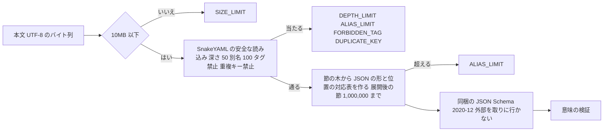

# Security Requirements — U2 DSL の定義（u2-dsl-definition）

U2 が受け持つ非機能の要件のうち、セキュリティに関わるもの（NFR2・NFR3・NFR5）を、確かめられる形に分けて示す。機能の決まりは `construction/u2-dsl-definition/functional-design/rules.md`（BR1.x〜BR5.x）、選定と数値は `tech-stack-decisions.md`。答えは `nfr-requirements-questions.md`（Q1〜Q6、F1）。

## 1. 守るものと脅威

投入される DSL（YAML）は、管理者が画面から送る信頼できない入力である（`aidlc/spaces/default/memory/team.md` の Code Style、project.md の Mandated）。

| 脅威（STRIDE） | 例 | 主な対策 |
|---|---|---|
| サービス拒否（D） | 巨大な本文、深い入れ子、別名の展開の爆発（Billion Laughs）、重い正規表現 | NFR2.1〜NFR2.4、NFR3.6 |
| 改ざん・権限の昇格（T・E） | YAML のタグで任意の型（例 `!!javax.script.ScriptEngineManager`）を作らせ、コードを動かす | NFR3.1 |
| 改ざん（T） | 重複キーで後の値に黙って上書きさせ、確かめた内容と違うものを通す | NFR3.2 |
| 情報の漏えい・なりすまし（I・S） | JSON Schema の外部の `$ref` で、サーバーから外へ要求を出させる | NFR3.3 |
| 情報の漏えい（I） | 部品の例外の文言（内部のクラス名・本文の断片）が応答に出る | NFR5.1〜NFR5.2 |
| 検証の抜け（T） | 画面だけで検証し、API を直接呼んで通す | NFR3.4 |

## 2. 要件

| ID | 要件 | 確かめ方（決めた値の境界で確かめる。team.md の Testing Posture） | 出典 |
|---|---|---|---|
| NFR2.1 | 本文が 10MB（10,485,760 バイト）を超えたら、読まずに SIZE_LIMIT を返す（要件の NFR2 と機能設計の BR1.1 は 5MB。U3 の NFR 要件で 10MB に上げると決めた。差は U3 の tech-stack-decisions.md） | 単体テスト: ちょうど 10MB は受け付け、1 バイト超えは拒否 | NFR2、BR1.1 |
| NFR2.2 | YAML の入れ子の深さの上限は 50 | 単体テスト: 深さ 50 は受け付け、51 は DEPTH_LIMIT | NFR3、BR1.2 |
| NFR2.3 | 別名（コレクションを指すもの）の数の上限は 100。数えるのがコレクションを指す別名だけなのは SnakeYAML の制限の仕組みによる。文字列などのスカラーを指す別名は展開しても大きさが増えにくく、増えた分は NFR2.4（展開後の節の数）と NFR2.1（本文の大きさ）で止まる | 単体テスト: 100 は受け付け、101 は ALIAS_LIMIT | NFR3、BR1.3 |
| NFR2.4 | 別名を展開した後の節の数の上限は 1,000,000（10MB の DSL を想定の書き方で読める大きさ）。超えたら展開の途中で打ち切り ALIAS_LIMIT を返す | 単体テスト: 別名の入れ子で展開が爆発する DSL が、上限で速やかに（1 秒以内）拒否される | NFR3、BR1.3 |
| NFR3.1 | タグはすべて拒否する（`!!` で始まる型の指定と、独自のタグ `!name` の両方）。型を作らない | 単体テスト: 任意の型を作るタグと独自のタグが FORBIDDEN_TAG になり、型が作られない | NFR3、BR1.4 |
| NFR3.2 | 1つの対応表の中の重複キーは DUPLICATE_KEY とし、後の値で上書きしない | 単体テスト: 重複キーが2回目の位置つきで誤りになる | NFR3、BR1.5 |
| NFR3.3 | JSON Schema は同梱の1つだけを読み、外部の `$ref` を取りに行かない設定を明示する（`fetchRemoteResources(false)`）。DSL の中の `$ref` は知らない項目として構文の誤りにする | 単体テスト: 外部の URL を指す `$ref` で要求が出ないこと（試しの HTTP の受け手で確かめる形）と、DSL の `$ref` が SYNTAX になること | NFR3、BR1.6 |
| NFR3.4 | 検証はサーバー側を正とし、画面の検証の有無にかかわらず、API に届いた本文をすべて検証する | U4 の結合テスト（画面を通さず API を直接呼ぶ） | NFR3 |
| NFR3.5 | 読み込みは SnakeYAML の安全な読み込み（型を作らない形）だけを使う。Jackson の YAML の読み込みは使わない（別名を展開しない・重複キーを上書きするため） | コードの点検と ArchUnit（`dsl` から Jackson の YAML の読み込みの型を使わない） | NFR3、試しの結果 |
| NFR3.6 | 正規表現（`pattern`）は、正しい正規表現かを確かめる（組み立てる）だけで、DSL の値に当てはめない。長さは 1,000 文字まで。1件の確かめは 100 ミリ秒で打ち切り、超えたら SEMANTIC（正しくない pattern）とする | 単体テスト: 1,000 文字は受け付け、1,001 文字は SEMANTIC。正しくない正規表現は SEMANTIC。打ち切りは時間を差し込めるように作り、テストで打ち切りの道を確かめる | NFR3、BR3.6 |
| NFR5.1 | 誤りは文言の鍵と埋める値で持ち、YAML・JSON Schema の部品の例外の文言をそのまま使わない | 単体テスト: 部品の例外の文言（例 `ScannerException`、`FileNotFoundException`）が誤りの一覧に現れない | NFR5、BR4.3 |
| NFR5.2 | 誤りに埋める値は、DSL の中の場所（パス）と、利用者が書いた値の先頭の一部（100 文字まで）に限る。接続先の項目（知らない項目）の値は埋めない | 単体テスト（ストーリーの AC2.2.6） | NFR5、NFR4 |

## 3. 読み込みの流れと信頼の境界

図の文章による代替: 本文は 10MB を超えれば読まずに止める。SnakeYAML の安全な読み込みで、深さ・別名・タグ・重複キーを確かめる。通れば、節の木から検証用の JSON の形と位置の対応表を作り、別名を展開した後の節の数が上限を超えれば止める。そのあと同梱の JSON Schema と意味の検証を行う。外部への要求はどこからも出ない。

## 4. 残る危険

| 危険 | 扱い |
|---|---|
| 後続の Intent が DSL の `pattern` を入力の検証に当てはめると、重い正規表現（ReDoS）で止まるおそれ | U2 は当てはめない（NFR3.6）。当てはめる後続の Intent で、時間の上限つきで当てはめる作りを決める（契約 C8 の利用者への注意として記録する） |
| SnakeYAML・networknt の脆弱性 | OSV-Scanner の関門（High 以上で止める）と Dependabot で見張る |
| 10MB の DSL を読むときのメモリ（節の木と JSON の形の2つを持つ） | 試しでは 0.68MB で問題なし。10MB の DSL のメモリと時間は Build and Test で測る |
