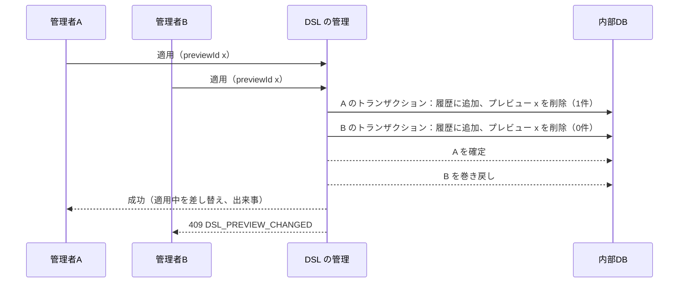
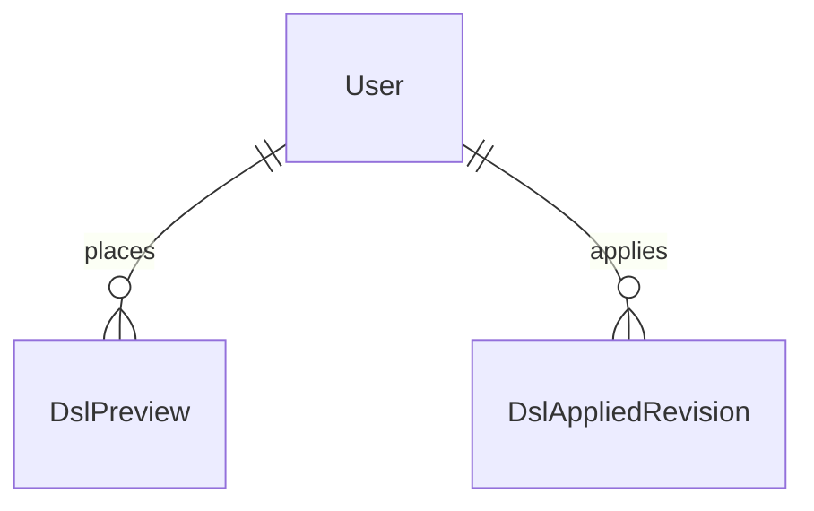

# Functional Spec — U4 DSL の管理（u4-dsl-management）

U4 の振る舞い（手順と状態）を示す。データの形は `entities.md`、決まりは `rules.md`、API の形は `inception/contract-design/contract-summary.md` の C6 が正本。

## 1. プレビューと適用中の状態の移り変わり

プレビュー（P）と適用中（A）の組で示す。`-` は無し。

| 今の状態 | 操作 | 次の状態 | 出来事 |
|---|---|---|---|
| (P:-, A:任意) | 生成・投入・戻し（検証を通る） | (P:新, A:変わらない) | GENERATED または SUBMITTED |
| (P:あり, A:任意) | 生成・投入・戻し（検証を通る） | (P:新しいものに置き換え, A:変わらない) | 同上 |
| (任意) | 投入・戻し（検証を通らない） | 変わらない | SUBMISSION_REJECTED（戻しは記録しない） |
| (P:あり, A:任意) | 破棄 | (P:-, A:変わらない) | PREVIEW_DISCARDED |
| (P:x, A:任意) | 適用（previewId が x） | (P:-, A:x の内容) | APPLIED |
| (P:y, A:任意) | 適用（previewId が x、x ≠ y） | 変わらない（409） | なし |
| (P:-, A:任意) | 適用 | 変わらない（409） | なし |

（履歴からの戻しで検証を通らないときは、受け付けなかった投入の出来事は出さない。戻しの操作そのものの失敗であり、利用者が外から投入した DSL ではないため。）

## 2. 手順

### 2.1 スキーマの読み込み（POST /preview/generate）

1. U3 で既定の DSL を作る。設定が無い・接続できないなら 503（`TARGET_DB_UNCONFIGURED`・`TARGET_DB_UNAVAILABLE`）で終える（BR1.1）。
2. プレビューを置き換える（BR1.4）。
3. 確定の後、`DSL_GENERATED` の出来事を出す（BR7.1）。
4. プレビューの中身（BR2.1）を返す。

### 2.2 投入（POST /preview?source=UPLOAD|PASTE）

1. 本文の形と大きさを確かめる（415・413、BR1.2・BR1.6）。413 のときは `DSL_SUBMISSION_REJECTED`（理由 SIZE_LIMIT、識別なし）の出来事を出す。
2. U2 で読み込み・検証する。通らなければ、誤りの一覧（先頭100件と総数）の 422 を返し、`DSL_SUBMISSION_REJECTED`（理由は最初の誤りの種類、識別あり）の出来事を出す（BR1.5・BR7.4）。
3. 通れば、プレビューを置き換え（BR1.4）、確定の後に `DSL_SUBMITTED` の出来事を出し、プレビューの中身を返す。

### 2.3 プレビューの表示（GET /preview）

1. プレビューが無ければ 404（BR2.5）。
2. プレビューと適用中を U2 でモデルにし、要約（BR2.3）・違い（BR2.2）を求める。
3. U1 の写しと照合し、警告を求める（BR2.4）。照合できなければ、その警告にする。
4. 返す（保存しない、BR2.1）。

### 2.4 破棄（DELETE /preview）

1. プレビューが無ければ 404。
2. プレビューの行を消し、確定の後に `DSL_PREVIEW_DISCARDED` の出来事を出す（BR3.1）。

### 2.5 適用（POST /apply）

1. トランザクションを始める。
2. プレビューを読む。無い・previewId が違えば 409 `DSL_PREVIEW_CHANGED`（BR4.1）。
3. プレビューの内容で履歴に1行足す（BR4.5 のとおり、同じ内容でも足す）。
4. previewId を指定してプレビューの行を消す。消した行が0件なら、巻き戻して 409（BR4.3）。
5. 上限を超えた古い履歴を消す（BR4.4）。
6. 確定する。どこかで失敗したら、全部を巻き戻し、差し替えも出来事もしない（BR4.2・BR4.6）。
7. 確定の後、U2 のモデルで適用中を差し替え、`DSL_APPLIED` の出来事を出す（BR4.6）。
8. 今の状態を返す。対象DB には接続しない（BR4.7）。

### 2.6 履歴からの戻し（POST /history/{revisionId}/restore）

1. 版が無ければ 404 `DSL_REVISION_NOT_FOUND`。
2. その本文を U2 で検証し直す。通らなければ 422（プレビューは変わらない）。
3. 通れば、出どころ RESTORE でプレビューを置き換え、確定の後に `DSL_SUBMITTED`（source RESTORE）の出来事を出し、プレビューの中身を返す（BR1.3）。

### 2.7 起動

1. 要求を受ける前に、履歴の最新を読む（BR5.1）。無ければ「無い」。
2. U2 で読めれば適用中のモデルに入れる。読めなければ ERROR を1件出し、「無い」にして起動を続ける（BR5.2）。

### 2.8 今の状態・履歴・ダウンロード

- 今の状態（GET /status）: 適用中とプレビューの識別・出どころ・人・日時（BR6.3）。
- 履歴（GET /history）: 新しい順と適用中の印（BR6.1）。
- ダウンロード（GET /preview/download・GET /applied/download）: 本文をそのまま、ファイル名で種類と識別が分かる（BR6.2）。

## 3. 同時の適用

図の文章による代替: 2人が同じプレビューを同時に適用すると、プレビューの行を消せた方（1件）だけが確定し、もう一方は消した件数が0件のため巻き戻して 409 を返す。履歴は1件だけ増える。

2人がほぼ同時にプレビューを置いた（生成・投入・戻し）ときは、固定の鍵の1行を MERGE で書き換えるため、後に確定した方が残る（BR1.4）。置く操作どうしでは待ち合わせも拒否もしない。先に置いた人がその応答の previewId で適用すると、BR4.1 で 409 になり、画面は今の状態を読み直して置き換えられたことを示す。

## 4. エンティティの関係（`entities.md` から導いた図）

図の文章による代替: プレビューと適用の履歴は、それぞれ置いた人・適用した人（既存の利用者）を1人指す。

## 5. 決まりの要約

`rules.md` の「決まりの一覧」のとおり（プレビューに置く BR1.x、表示 BR2.x、破棄 BR3.1、適用 BR4.x、起動 BR5.x、履歴・ダウンロード・状態 BR6.x、監査 BR7.x、応答 BR8.x）。

## 6. 失敗の場合とふるまい

| 場合 | ふるまい |
|---|---|
| 対象DB の設定が無い・接続できない（読み込み） | 503、プレビューは変わらない |
| 対象DB の設定が無い・接続できない（表示） | 警告1件、表示はできる |
| 本文が 5MB を超える | 413、SUBMISSION_REJECTED（SIZE_LIMIT） |
| 検証を通らない | 422（先頭100件と総数）、保存しない、SUBMISSION_REJECTED |
| 適用で previewId が違う・無い・同時に負けた | 409、適用中は変わらない |
| 適用の途中で失敗 | 巻き戻し、差し替えも出来事もしない、500 |
| 監査の書き込みの失敗 | 操作は成功、ERROR のログ1件 |
| 起動時に適用中の DSL を読めない | ERROR のログ1件、「無い」で起動 |
| 未認証・管理者でない | 401・403（既存） |
