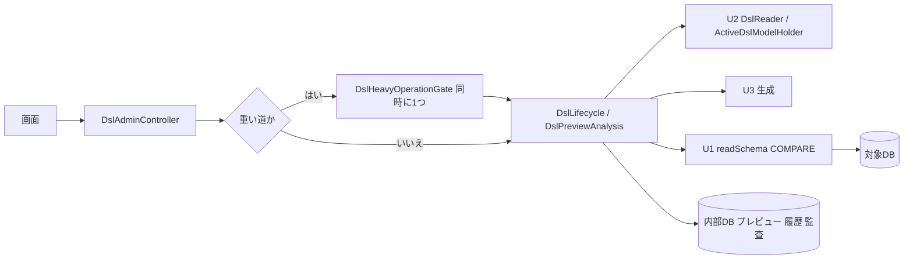

# Logical Components — U4 DSL の管理（u4-dsl-management）

U4 の論理的な部品と、障害の範囲を示す。

## 1. 部品

| 部品 | 役割 | 置き場（パッケージ） |
|---|---|---|
| DslAdminController | `/api/admin/dsl/**` の HTTP の受け渡し（契約 C6） | `cherry.mastersmith.dslmanage.web` |
| DslHeavyOperationGate | 重い道の同時の数を1つにする（本文を読む前に許可を取る） | `cherry.mastersmith.dslmanage.web` |
| DslLifecycle | 生成・投入・戻し・適用・破棄・起動時の読み込み（トランザクションの境界） | `cherry.mastersmith.dslmanage.service` |
| DslPreviewAnalysis | 要約・違い・照合の警告。プレビューの読み込みの結果を1つ持つ | `cherry.mastersmith.dslmanage.service` |
| DslPreviewRepository・DslAppliedRevisionRepository | プレビューと履歴の表（本文は BLOB） | `cherry.mastersmith.dslmanage.repository` |
| DslOperationMetrics | 指標とログの記録 | `cherry.mastersmith.dslmanage.service` |
| 本文の上限（道ごと） | 既存の `RequestSizeLimitFilter` を認証・認可の後に移し、道ごとの上限と code の表を足す（投入の道は 10MB・`DSL_TOO_LARGE`）。断ったことを知らせる口を持ち、U4 が投入の道の知らせで監査（操作した人つき）を出す | 既存の `common.web`・`config`、`dslmanage` |

## 2. 障害の範囲

図の文章による代替: 画面の要求は DslAdminController が受け、重い道だけ同時に1つの許可を取ってから業務処理に進む。業務処理は U2（読み込み・適用中のモデル）、U3（生成）、U1（照合）と内部DB を使う。対象DB に触れるのは U1 を通した生成と照合だけ。

- 対象DB の停止・遅延の影響は、生成（失敗）と照合（警告、最悪 23〜28 秒の待ち）に限られる。照合が長引く間は許可を持つため、ほかの重い処理は `DSL_BUSY` になる。
- 内部DB の障害は、DSL の操作すべてに及ぶ（既存の働きと同じ）。

## 3. 共有するもの

- 既存の AccessControl・共通のエラー変換・監査の仕組み・本文の上限の仕組み・Micrometer・構造化ログを使う。
- 内部DB のプール（上限 30）を既存の働きと共有する。適用は1要求で接続を2本使いうる（確定の後の監査の書き込み）ため、既存の見積もりの内に収まるかを Build and Test で確かめる（`aidlc/spaces/default/memory/project.md` の Corrections）。
