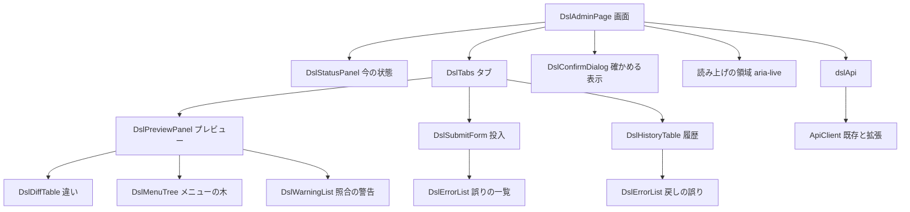
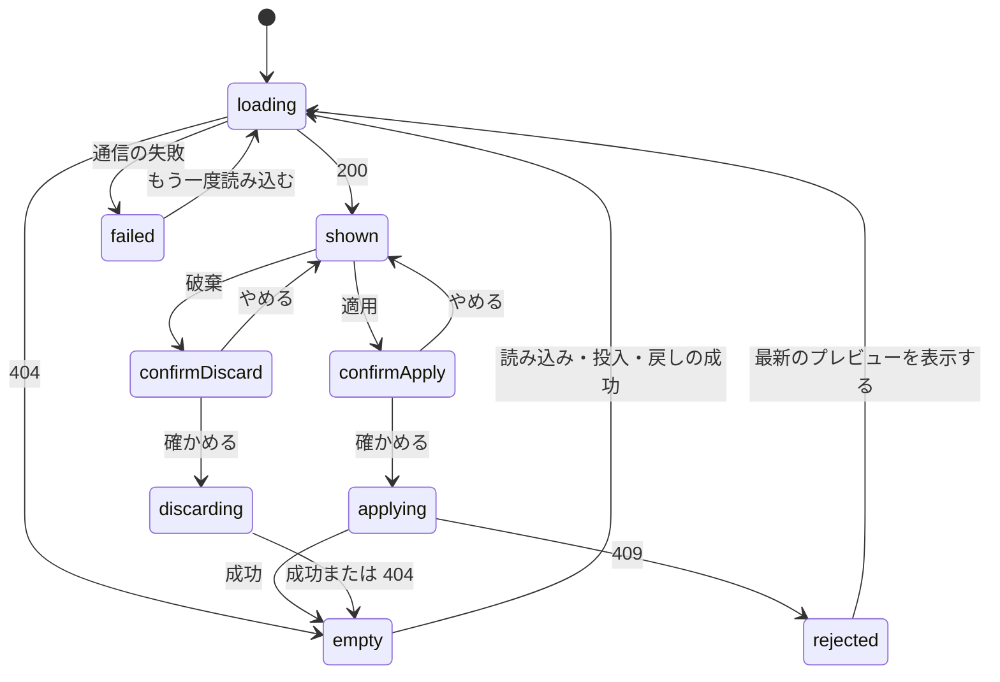

# Frontend Components — U5 DSL の管理画面（u5-dsl-admin-ui）

U5 の画面の部品の構成、画面が持つ状態、API との受け渡し（ApiClient の拡張を含む）を示す。操作の手順・誤りの表示・文言・アクセシビリティ・アクセス制御は `functional-spec.md`、部品ごとの状態・入力・アクセシビリティは `inception/refined-mockups/interaction-spec.md` が正本。決まりの番号（BR）は `functional-spec.md` と通しで振る。

入力の検証（フォームの決まり）は、投入の入力が空のときに投入を使えなくすること（`functional-spec.md` の 4.2 の 2）と、送る前の大きさの案内（BR2.3）だけで、DSL の中身の検証はサーバー側を正とし、画面では行わない（`aidlc/spaces/default/memory/team.md` の Code Style）。

## 1. 部品の構成と API の呼び方

### 1.1 部品の構成

図の文章による代替: 画面（DslAdminPage）は、今の状態（DslStatusPanel）・タブ（DslTabs）・確かめる表示（DslConfirmDialog）・読み上げの領域を持つ。タブの中は、プレビュー（違いの表・メニューの木・照合の警告を含む）・投入（誤りの一覧を含む）・履歴（戻しの誤りの一覧を含む）の3つ。API は dslApi を通して呼び、dslApi は既存の ApiClient（1.3 の拡張を含む）を使う。

| 部品 | 役割 | 仕様の正本 |
|---|---|---|
| DslAdminPage | ドメイン設計の部品 DslAdminUi の入口の画面（DslAdminUi は、この表の画面の部品・dslApi・登録の一式を指す）。画面の状態（2節）を持ち、API を呼び、子の部品に値と操作を渡す | この文書 |
| DslStatusPanel | 適用中・プレビューの識別・出どころ・人・日時、スキーマの読み込みのボタン | interaction-spec.md |
| DslTabs | プレビュー・投入・履歴の切り替え | interaction-spec.md |
| DslPreviewPanel | 検証を通ったこと・要約・警告・違い・メニューの木、ダウンロード・破棄・適用 | interaction-spec.md |
| DslDiffTable | テーブルごとの区分とカラムの違い（行を開く） | interaction-spec.md |
| DslMenuTree | メニューの階層の木（表示言語の表示名、テーブルの物理名は訳さない） | mockups.md の 2 |
| DslWarningList | 照合の警告の一覧（色に加えて記号と文言） | mockups.md の 2・3.4 |
| DslSubmitForm | ファイル・貼り付けの切り替えと投入 | interaction-spec.md |
| DslErrorList | 誤りの件数と、行・列・場所・内容の表 | interaction-spec.md |
| DslHistoryTable | 適用の履歴、適用中の印、戻し、適用中のダウンロード | interaction-spec.md |
| DslConfirmDialog | 置き換え・適用・破棄の確認 | interaction-spec.md |
| dslApi | C6 の 11 本の API を呼ぶ関数の集まり（1.2） | この文書 |

### 1.2 dslApi（API の呼び方）

| 関数 | API | 成功の値 | 画面で扱う失敗 |
|---|---|---|---|
| getStatus | GET /api/admin/dsl/status | DslStatus | 通信・5xx |
| getPreview | GET /api/admin/dsl/preview | Preview | 404 `DSL_PREVIEW_NOT_FOUND` |
| generatePreview | POST /api/admin/dsl/preview/generate | Preview | 503 `TARGET_DB_UNCONFIGURED`・`TARGET_DB_UNAVAILABLE` |
| submitPreview(text, source) | POST /api/admin/dsl/preview?source=UPLOAD または PASTE、本文 `application/yaml` | Preview | 422 `DSL_INVALID`（誤りの一覧）、413 `DSL_TOO_LARGE`、415（画面は常に `application/yaml` で送るため起きない想定。起きたときは BR5.5 の一般の文言） |
| discardPreview | DELETE /api/admin/dsl/preview | なし | 404 `DSL_PREVIEW_NOT_FOUND` |
| downloadPreview | GET /api/admin/dsl/preview/download | ファイル | 404 `DSL_PREVIEW_NOT_FOUND` |
| applyPreview(previewId) | POST /api/admin/dsl/apply（本文 `{ previewId }`） | DslStatus | 409 `DSL_PREVIEW_CHANGED` |
| downloadApplied | GET /api/admin/dsl/applied/download | ファイル | 404 `DSL_APPLIED_NOT_FOUND` |
| getHistory | GET /api/admin/dsl/history | HistoryEntry の一覧 | 通信・5xx |
| restoreRevision(revisionId) | POST /api/admin/dsl/history/{revisionId}/restore | Preview | 404 `DSL_REVISION_NOT_FOUND`、422 `DSL_INVALID` |

- **BR2.1** 画面は、応答の型を C6 のとおりに TypeScript の型で持つ。応答の知らない項目は無視する（C6 の ProblemDetail の決まり）。
- **BR2.2** 投入の本文は、選んだファイルを画面でテキスト（UTF-8）として読んだもの、または貼り付けた文字列で、`Content-Type: application/yaml` で送る。ファイルを選んだときは `source=UPLOAD`、貼り付けは `source=PASTE`。選んでいない方の入力は送らない。
- **BR2.3** 送る前の大きさの案内は、ファイルならそのバイト数、貼り付けならその文字列を UTF-8 にしたときのバイト数で判定し、5MB（5 × 1024 × 1024 バイト）を超えれば送らずに案内する（AC2.1.5）。これは案内だけで、サーバー側の上限（413 `DSL_TOO_LARGE`）の代わりにしない。413 を受けたときも同じ案内を出す。（5MB を何バイトとするかは U4 の NFR 設計で決まる。決まった値が違えば、画面の値もそれに合わせる。）
- **BR2.4** ダウンロードは、既存の ApiClient（アクセストークンを付ける）で本文を受け取り、ブラウザにファイルとして保存させる。ファイル名は応答の `Content-Disposition` の指定に従い（U4 の BR6.2 の `dsl-preview-<識別の先頭12文字>.yaml`・`dsl-applied-<識別の先頭12文字>.yaml`）、読めなければ `dsl.yaml` とする。画面でファイル名を組み立てない。
- **BR2.5** 適用の要求には、表示しているプレビューの `previewId` を付ける（US4.2）。画面の中で `previewId` を作ったり推測したりしない。

### 1.3 ApiClient の拡張

- **BR2.6** 今の ApiClient は、エラーの応答から状態コードと `code` だけを画面に渡している。これに、Problem Details の本文全体（`problem`）を足し、呼び出し元が型を決めて追加の項目（`errors`・`total` など）を読めるようにする。既存の `apiFetch`・`apiRequest` の呼び方と、`ApiResponseError` の `kind`・`status`・`code` の形は変えない（項目を足すだけ。既存のテストはそのまま通る）。
- **BR2.7** 本文が JSON として読めない・Problem Details でないときは、`problem` を持たない（今の `code` と同じ扱い）。画面は `problem` が無いときも壊れず、状態コードに応じた一般の文言を出す。
- **BR2.8** 誤りの一覧（`DSL_INVALID`）の本文は、`total`（1以上の整数）と `errors`（配列）があるときだけ誤りの一覧として扱う。形が合わないときは、件数の分からない誤りとして一般の文言（「DSL を受け付けられませんでした」）を出す。

## 2. 画面の状態

### 2.1 画面が持つ値

画面の状態は DslAdminPage の中で持つ。アプリ全体の状態の置き場は作らない。

| 値 | 内容 | 読むとき |
|---|---|---|
| status | 今の状態（適用中・プレビューの識別・出どころ・人・日時） | 画面を開いたとき、`functional-spec.md` の 4.6 の読み直し |
| preview | プレビューの中身（要約・違い・警告・識別） | プレビューのタブを表示したとき、`functional-spec.md` の 4.6 の読み直し |
| history | 適用の履歴 | 履歴のタブを表示したとき、`functional-spec.md` の 4.6 の読み直し |
| selectedTab | 選ばれているタブ（`'preview' \| 'submit' \| 'history'`、はじめは `'preview'`） | タブの選択、操作の成功 |
| busy | 処理中の操作（`'generate' \| 'submit' \| 'restore' \| 'apply' \| 'discard' \| null`） | 操作の開始と終了 |
| submitInput | 投入の入力（入力のしかた・選んだファイル・貼り付けた文字列） | 入力 |
| submitErrors・restoreErrors | 誤りの一覧（総数と先頭100件） | 投入・戻しの 422 |
| alert | 画面の中の失敗の知らせ（種類と文言の鍵） | 失敗 |
| confirm | 表示中の確かめる表示（種類と示す情報、開く前のボタン） | 確認の開始 |

- **BR3.1** 読み込みの状態（読んでいる・読めた・読めなかった）は、status・preview・history のそれぞれで持つ。読めなかったときは、その領域に Alert と「もう一度読み込む」を出す（interaction-spec.md の error の状態）。
- **BR3.2** 処理中は、読み込み・投入・履歴からの戻し・適用・破棄のボタンを使えなくする。タブの切り替えと表示の確認、ダウンロードはできる（interaction-spec.md の共通の決まり）。同じ操作の二重の送信はしない。
- **BR3.3** 読み直しの結果が前の要求より後に返ったときだけ画面に入れる（古い応答で新しい表示を上書きしない）。画面を離れた後に返った応答は捨てる。

### 2.2 プレビューのタブの状態の移り変わり

図の文章による代替: プレビューのタブは、読んで（loading）、あれば表示（shown）、無ければ空（empty）、通信に失敗すれば失敗（failed）になる。表示中に適用・破棄を選ぶと確かめる表示を出し、やめれば表示に戻る。適用が成功すると空、409 なら拒否（rejected）になり、「最新のプレビューを表示する」で読み直す。破棄は成功しても 404 でも空になる。空の状態から読み込み・投入・戻しが成功すると、読み直して表示する。

