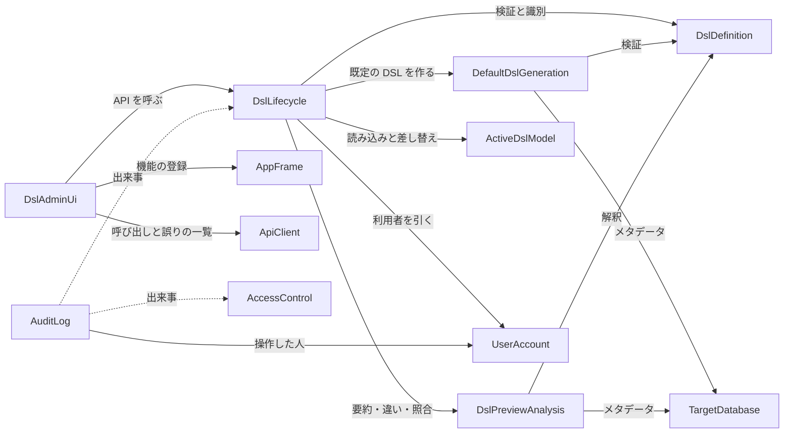

# Components — dsl-schema-loader

今回作る部品（書くコードのまとまり）と、それが関わる既存の部品の一覧。配備の形は Units Generation、道具の選定と性能の作りは NFR の段で決める。確定した答えは `domain-design-questions.md` の Q1〜Q8、判断の記録は `decisions.md`（ADR-001〜ADR-010）。

既存の部品（`UserAccount`・`AccessControl`・`AuditLog`・`AppFrame`・`ApiClient`）は、前の Intent（auth-audit-foundation）の部品の名前を使い、今回の変更点だけを書く。

## Part A — 部品の一覧（機械で読む形）

```yaml
components:
  - name: TargetDatabase
    summary: 対象DB への接続を持ち、設定したスキーマのメタデータ（テーブル・ビュー・カラム・型・主キー・外部キー・NOT NULL・既定値・コメント）を読む
    behaviour: >
      パッケージは targetdb。接続先は mastersmith.target-db.* の設定だけから受け取り、画面・API・DSL からは受け取らない。
      接続は Spring Boot の「既定の候補にしない」指定で内部DB とは別に持ち、内部DB の自動構成・JPA・Flyway・ヘルスチェック・
      名前の指定の無いトランザクションには関わらない（ADR-006）。接続は読み取り専用・小さなプール・短い待ち時間（接続と問い合わせ）とする。
      設定が無い・不正・対象DB が止まっている・応答しないときもアプリは起動し、使う操作だけが「設定が無い」「接続できない」を区別した結果で失敗する。
      起動時に設定を点検し、問題のある項目の名前だけを WARN で1件出す（値は出さない）。パスワードは設定の型の文字列表現で伏せ字にする。
      メタデータは MySQL・MariaDB・PostgreSQL の違い（型の表し方・コメントの取り方・ビューの見分け方・識別子の大文字小文字）を吸収し、
      共通の形（スキーマの写し）で返す。識別子を SQL に組み込むときは許可の一覧と引用符で扱い、利用者の入力から SQL を組み立てない。
      スキーマ・データを変更する SQL は発行しない。例外の内部のメッセージと接続先は、上位へ渡す結果に含めない。
    responsibilities:
      - 対象DB の接続の設定の受け取りと点検（値を漏らさない）
      - 対象DB の接続（既定の候補にしない・読み取り専用・待ち時間）
      - 設定したスキーマのメタデータの読み取りと、DB の種類の違いの吸収
      - 接続できない・設定が無い・応答しないの区別
    depends_on: []
    dependents:
      - component: DefaultDslGeneration
        interaction: 既定の DSL の元になるメタデータを読む
      - component: DslPreviewAnalysis
        interaction: プレビューの DSL と照合するメタデータを読む
    external_dependencies:
      - name: 対象DB（MySQL・MariaDB・PostgreSQL）
        kind: database
        purpose: メタデータの読み取りだけ（書き込まない）
      - name: 各 DB の JDBC ドライバー
        kind: other
        purpose: 対象DB への接続
    entities: []

  - name: DslDefinition
    summary: DSL の書式（JSON Schema と書式の版）を持ち、YAML を安全に読み、構文と意味を検証して、DSL のモデルに解釈する
    behaviour: >
      パッケージは dsl。JSON Schema はアプリに同梱した1つだけを正とし、外部の URL を取りに行かない（ADR-007）。
      YAML は信頼できない入力として読む: 大きさ（5MB、UTF-8 のバイト数）・入れ子の深さ・別名の数に上限を置き、任意の型を作るタグを拒否し、
      重複キーを誤りにする。読むときに各値の YAML の行・列を記録した位置の対応表を作り、検証の誤りのパスから行・列を引く（ADR-008）。
      検証は、書式の版の確認 → 構文（JSON Schema）→ 意味（メニューが DSL に無いテーブルを指さない、テーブル・カラムの重複が無い、
      参照・参照ピッカーの先が DSL にある）の順に行う（構文と意味の両方の誤りがあるときの返し方は機能設計で決める）。
      誤りは種類（構文・意味・版・上限・タグ・重複キー）と、行・列・DSL の中の場所・内容の一覧で返し、部品の例外のメッセージを含めない。
      DSL の本文からハッシュ値（DSL の識別）を求める（本文のバイト列から、ADR-003）。DSL に接続先の項目は無い（書けば構文の誤り）。
      後続の Intent が使う DSL のモデル（メニュー・テーブル・カラムの定義）の形を定める。
    responsibilities:
      - DSL の書式（JSON Schema・書式の版）の定義と同梱
      - YAML の安全な読み込みと位置の対応表
      - 構文と意味の検証、誤りの一覧
      - DSL のモデルへの解釈と、DSL の識別（ハッシュ値）
    depends_on: []
    dependents:
      - component: DefaultDslGeneration
        interaction: 生成した DSL を検証し、書式の版を得る
      - component: DslPreviewAnalysis
        interaction: 要約・違い・照合のために DSL をモデルに解釈する
      - component: DslLifecycle
        interaction: 投入・履歴からの戻しの DSL を検証し、識別を求める
    external_dependencies:
      - name: YAML の読み込みの部品
        kind: other
        purpose: YAML を位置つきで安全に読む（選定は NFR 要件の段）
      - name: JSON Schema の検証の部品
        kind: other
        purpose: 構文の検証（選定は NFR 要件の段）
    entities:
      - name: DslModel
        identifier: dslHash
        attributes: [formatVersion, menus, tables, columns, dbType, displayNames, search, list, detail, validations, formPart, optionSource, lookupSettings, readOnlyView]

  - name: ActiveDslModel
    summary: 適用中の DSL のモデルをアプリの中に1つ持ち、後続の Intent に取り出す提供口を渡す
    behaviour: >
      パッケージは dsl。アプリの中に適用中のモデルを1つだけ持つ（組み込みの H2 のためアプリは1つだけ動く前提、ADR-004）。
      中身の差し替えは、内部DB の適用の確定の後に DslLifecycle が行う。起動時の読み込みも DslLifecycle が行い、この部品は内部DB を直接読まない
      （dsl のパッケージが dslmanage に依存しないため、ADR-009）。取り出す側には、適用中のモデル、または「適用中の DSL が無い」ことが分かる結果を返す。
      差し替えは読み手から見て一度に切り替わり、途中の状態を見せない。適用が失敗して巻き戻ったときは差し替えない。
    responsibilities:
      - 適用中のモデルの保持と、一度に切り替わる差し替え
      - 後続の Intent（I・J・K）向けの取り出す提供口
    depends_on: []
    dependents:
      - component: DslLifecycle
        interaction: 起動時の読み込みと、適用の確定の後の差し替え
    external_dependencies: []
    entities: []

  - name: DefaultDslGeneration
    summary: 対象DB のメタデータから既定の DSL（YAML の本文）を作る
    behaviour: >
      パッケージは dslmanage。表示名は ja・en の両方に物理名、DB のコメントがあれば ja にはコメントを入れる。メニューは1階層で、
      テーブル（ビューを含む）ごとに1項目を物理名の順（並べ方の規則は機能設計）に並べる。カラムごとに DB 上の型の情報（型の名前・長さ・精度・
      NULL を許すか）を入れ（ADR-005）、型と制約からフォーム部品とバリデーションを機械的に決め、DB から導いたことを記録する（型の対応の規則は機能設計）。
      ビューは読み取り専用として記録する。作った DSL は YAML の本文にしてから DslDefinition で検証する（通らなければ作りの誤りとして扱う）。
      対象DB の接続先の値は DSL に入れない。
    responsibilities:
      - メタデータから既定の DSL への写し（表示名・メニュー・型・部品・バリデーション）
      - 生成した DSL の YAML の本文への書き出しと検証
    depends_on:
      - component: TargetDatabase
        interaction: スキーマのメタデータを読む
        style: sync
      - component: DslDefinition
        interaction: 生成した DSL を検証する
        style: sync
    dependents:
      - component: DslLifecycle
        interaction: スキーマの読み込みの操作で既定の DSL を作らせる
    external_dependencies: []
    entities: []

  - name: DslPreviewAnalysis
    summary: プレビューの要約、適用中の DSL との違い、対象DB との照合の警告を求める
    behaviour: >
      パッケージは dslmanage。要約はテーブル数・カラム数・ビューの数・メニューの階層の木・表示名の未設定の件数と場所。
      違いは、適用中の DSL と比べたテーブル・カラムの増えた・減った・変わった（変わったに数える項目は機能設計）。適用中が無ければすべてを増えたとする。
      照合は、DSL を対象DB のメタデータと比べ、無いテーブル・カラムと型の食い違いを警告にする。対象DB に接続できない・応答しないときは、
      照合できなかったことを警告にし、待ち時間の内に打ち切る。警告に接続先と内部のエラーの文言を含めない。対象DB に書き込まない。
    responsibilities:
      - プレビューの要約
      - 適用中の DSL との違い
      - 対象DB との照合の警告
    depends_on:
      - component: DslDefinition
        interaction: プレビューと適用中の DSL をモデルに解釈する
        style: sync
      - component: TargetDatabase
        interaction: 照合のためにメタデータを読む
        style: sync
    dependents:
      - component: DslLifecycle
        interaction: プレビューに置くとき・表示するときに要約・違い・照合を求める
    external_dependencies: []
    entities: []

  - name: DslLifecycle
    summary: DSL の管理の操作（スキーマの読み込み・投入・プレビュー・適用・破棄・履歴からの戻し・ダウンロード）と、その保存・監査の出来事を受け持つ
    behaviour: >
      パッケージは dslmanage。管理者だけの API（/api/admin/ の下）で操作を受ける（認可は既存の AccessControl の仕組み）。
      内部DB にプレビューの表と適用の履歴の表を持ち（ADR-002）、DSL は YAML の本文のまま保存する（ADR-003）。
      投入（アップロード・貼り付け）と履歴からの戻しは DslDefinition で検証し、通らなければ保存せず誤りの一覧を返す。
      通れば今のプレビューを置き換え、照合の結果とともに示す。プレビューは管理者全員で共有し、1件だけ。
      適用は、要求に付いた「見たプレビューの識別」が今のプレビューと同じときだけ行い、違えば・無ければ拒否する（同時の適用は1件だけ成功）。
      適用は1つのトランザクションで、プレビューの行を履歴に移し、上限（既定20件）を超えた古い履歴を消す。同じ内容の再適用も履歴に1件足す。
      確定の後に ActiveDslModel を差し替え、監査の出来事を出す。失敗して巻き戻ったときは差し替えず、出来事も出さない。
      起動時に履歴の最新（適用中）を読んで解釈し、ActiveDslModel に入れる。ダウンロードは保存した本文をそのまま返し、ファイル名で
      プレビュー中か適用中かと識別が分かるようにする。監査の出来事は、生成・投入（アップロード・貼り付け・履歴からの戻し）・受け付けなかった投入
      （理由の種類）・適用・破棄で、操作した管理者・日時・識別を持ち、DSL の本文と接続先を持たない。誤りと拒否は Problem Details の code で返す。
    responsibilities:
      - 管理者だけの DSL の操作の API
      - プレビュー・適用の履歴の保存と、件数の上限
      - 見たプレビューを指定する適用と、一度に切り替わる確定
      - 起動時の適用中のモデルの読み込みと、確定の後の差し替え
      - ダウンロード
      - 監査の出来事の発行
    depends_on:
      - component: DslDefinition
        interaction: 投入・戻しの DSL の検証と識別、起動時の解釈
        style: sync
      - component: DefaultDslGeneration
        interaction: スキーマの読み込みで既定の DSL を作る
        style: sync
      - component: DslPreviewAnalysis
        interaction: 要約・違い・照合を求める
        style: sync
      - component: ActiveDslModel
        interaction: 起動時の読み込みと、適用の確定の後の差し替え
        style: sync
      - component: UserAccount
        interaction: 置いた人・適用した人の表示のために利用者を引く
        style: sync
    dependents:
      - component: AuditLog
        interaction: DSL の操作の出来事を受けて監査の記録を書く
      - component: DslAdminUi
        interaction: 画面から DSL の操作の API を呼ぶ
    external_dependencies:
      - name: 内部DB（組み込みの H2）
        kind: database
        purpose: プレビューと適用の履歴の保存（Flyway の前進のみの移行で表を足す）
    entities:
      - name: DslPreview
        identifier: previewId
        attributes: [yamlText, dslHash, source, placedByUserId, placedAt]
        references:
          - entity: User
            owned_by: UserAccount
            relationship: 各プレビューは、置いた1人の管理者を指す
      - name: DslAppliedRevision
        identifier: revisionId
        attributes: [yamlText, dslHash, source, appliedByUserId, appliedAt]
        references:
          - entity: User
            owned_by: UserAccount
            relationship: 各適用の履歴は、適用した1人の管理者を指す

  - name: DslAdminUi
    summary: DSL の管理画面（今の状態・プレビュー・投入・履歴のタブ）
    behaviour: >
      画面の機能 features/dsl。サイドバーに管理者だけに見える「DSL」を足し、1つの画面に今の状態とタブを置く（refined-mockups の mockups.md）。
      画面では DSL を検証しない（ADR-007）。サーバーの code で文言を選び、ja・en を持つ。置き換え・適用・破棄の前に確かめる表示を出し、
      処理中は押したボタンに印を出してプレビューを変える操作を止める。適用の要求には、表示したプレビューの識別を付ける。
      make-you-chic-ui に無い部品（ファイルの選択・違いの表の行の開閉・メニューの木）は画面の側で作る。
    responsibilities:
      - DSL の管理画面の表示と操作
      - 確かめる表示・処理中・結果の知らせ
      - アクセシビリティ（WCAG 2.1 AA）
    depends_on:
      - component: DslLifecycle
        interaction: DSL の操作の API を呼ぶ
        style: sync
      - component: AppFrame
        interaction: 画面の機能の登録（ルート・サイドバー・文言）
        style: sync
      - component: ApiClient
        interaction: API の呼び出しと、誤りの一覧を含む応答の受け取り
        style: sync
    dependents: []
    external_dependencies:
      - name: make-you-chic-ui
        kind: other
        purpose: 画面の部品（変更しない）
    entities: []

  - name: UserAccount
    summary: 既存。利用者（管理者フラグを含む）を管理する。今回は変更しない
    behaviour: >
      既存の部品。DslLifecycle が、置いた人・適用した人の表示のために利用者を引く。
    responsibilities:
      - 利用者の管理（既存）
    depends_on: []
    dependents:
      - component: DslLifecycle
        interaction: 置いた人・適用した人の表示のために利用者を引く
      - component: AuditLog
        interaction: 監査の記録の操作した人を指す
    external_dependencies: []
    entities:
      - name: User
        identifier: userId
        attributes: [email, admin]

  - name: AccessControl
    summary: 既存。/api/admin/ の下の API を管理者だけに限り、拒否を監査の出来事として知らせる。今回は変更しない
    behaviour: >
      既存の部品。DslLifecycle の API を /api/admin/ の下に置くことで、未認証 401・管理者でない 403 と、アクセス拒否の監査がそのまま付く。
      呼び出しの関係は持たない（要求の手前で判定する）。
    responsibilities:
      - 管理者だけの API の判定（既存）
    depends_on: []
    dependents:
      - component: AuditLog
        interaction: アクセス拒否の出来事を受けて記録する（既存）
    external_dependencies: []
    entities: []

  - name: AuditLog
    summary: 既存を広げる。DSL の操作の出来事を受けて、監査の記録を内部DB に書く
    behaviour: >
      既存の決まり（元の操作の確定の後に記録する、書き込みに失敗しても元の操作は失敗させない）に従う。出来事の種類に、DSL の生成・投入・
      受け付けなかった投入・適用・破棄を足し、記録の表に操作した人と対象（DSL の識別・理由の種類）を入れる列を Flyway の移行で足す。
      DSL の本文と対象DB の接続先は記録しない。業務データの CRUD を含む共通の仕組みは作らない（project.md の DECIDED）。
    responsibilities:
      - DSL の操作の監査の記録（今回足す）
      - 認証とアクセス拒否の監査の記録（既存）
    depends_on:
      - component: DslLifecycle
        interaction: DSL の操作の出来事を受け取る
        style: event
      - component: AccessControl
        interaction: アクセス拒否の出来事を受け取る（既存）
        style: event
      - component: UserAccount
        interaction: 操作した人を指す
        style: sync
    dependents: []
    external_dependencies:
      - name: 内部DB（組み込みの H2）
        kind: database
        purpose: 監査の記録（audit_events）
    entities:
      - name: AuditEvent
        identifier: eventId
        attributes: [eventType, occurredAt, actorUserId, dslHash, reasonType, traceId]
        references:
          - entity: User
            owned_by: UserAccount
            relationship: 各 DSL の操作の監査の記録は、操作した1人の管理者を指す

  - name: AppFrame
    summary: 既存。画面の骨組み（ルーティング・アプリシェル・表示言語）。今回は変更しない
    behaviour: >
      既存の部品。DslAdminUi は機能の登録（features/<featureId>/registration.ts）で画面・サイドバーの項目・文言を差し込む。
    responsibilities:
      - 画面の骨組み（既存）
    depends_on: []
    dependents:
      - component: DslAdminUi
        interaction: 画面の機能の登録
    external_dependencies: []
    entities: []

  - name: ApiClient
    summary: 既存を広げる。API の呼び出しの共通部分に、誤りの一覧を含む応答の受け渡しを足す
    behaviour: >
      今は Problem Details の code と状態だけを画面に渡している。DSL の誤りの一覧（行・列・場所・内容）を渡せるように、
      応答の追加の項目を受け渡す形を足す（形は契約の設計で決める）。既存の呼び出し方は変えない。
    responsibilities:
      - API の呼び出しの共通部分（既存）
      - 誤りの一覧を含む応答の受け渡し（今回足す）
    depends_on: []
    dependents:
      - component: DslAdminUi
        interaction: API の呼び出し
    external_dependencies: []
    entities: []
```

## Part B — 人が読む形

### Component Diagram



図の文章による代替: 画面（DslAdminUi）は DSL の管理の API（DslLifecycle）を呼ぶ。DslLifecycle は、検証（DslDefinition）、既定の DSL の生成（DefaultDslGeneration）、要約・違い・照合（DslPreviewAnalysis）、適用中のモデル（ActiveDslModel）、利用者（UserAccount）を使う。生成と照合は対象DB（TargetDatabase）のメタデータを読む。監査（AuditLog）は DslLifecycle とアクセス制御の出来事を受けて記録する（点線は出来事）。後続の Intent は DslDefinition のモデルと ActiveDslModel・TargetDatabase だけを使う。

### Component Summary

| Component | Purpose | Depends On | Dependents | Entities Owned |
|---|---|---|---|---|
| TargetDatabase（新） | 対象DB の接続とメタデータの読み取り | — | DefaultDslGeneration、DslPreviewAnalysis | — |
| DslDefinition（新） | DSL の書式・安全な読み込み・検証・解釈 | — | DefaultDslGeneration、DslPreviewAnalysis、DslLifecycle | DslModel |
| ActiveDslModel（新） | 適用中のモデルの保持と提供口 | — | DslLifecycle | — |
| DefaultDslGeneration（新） | メタデータから既定の DSL を作る | TargetDatabase、DslDefinition | DslLifecycle | — |
| DslPreviewAnalysis（新） | 要約・違い・照合 | DslDefinition、TargetDatabase | DslLifecycle | — |
| DslLifecycle（新） | DSL の管理の操作・保存・監査の出来事 | DslDefinition、DefaultDslGeneration、DslPreviewAnalysis、ActiveDslModel、UserAccount | AuditLog、DslAdminUi | DslPreview、DslAppliedRevision |
| DslAdminUi（新） | DSL の管理画面 | DslLifecycle、AppFrame、ApiClient | — | — |
| UserAccount（既存） | 利用者 | — | DslLifecycle、AuditLog | User |
| AccessControl（既存） | 管理者だけの API の判定 | — | AuditLog | — |
| AuditLog（既存を広げる） | 監査の記録 | DslLifecycle、AccessControl、UserAccount | — | AuditEvent |
| AppFrame（既存） | 画面の骨組み | — | DslAdminUi | — |
| ApiClient（既存を広げる） | API の呼び出しの共通部分 | — | DslAdminUi | — |

### Entity Ownership

| Entity | Owning Component | Identifier | Attributes | References |
|---|---|---|---|---|
| DslModel | DslDefinition | dslHash | formatVersion、menus、tables、columns、dbType、displayNames、search、list、detail、validations、formPart、optionSource、lookupSettings、readOnlyView | — |
| DslPreview | DslLifecycle | previewId | yamlText、dslHash、source、placedByUserId、placedAt | User（UserAccount） |
| DslAppliedRevision | DslLifecycle | revisionId | yamlText、dslHash、source、appliedByUserId、appliedAt | User（UserAccount） |
| User（既存） | UserAccount | userId | email、admin | — |
| AuditEvent（既存を広げる） | AuditLog | eventId | eventType、occurredAt、actorUserId、dslHash、reasonType、traceId | User（UserAccount） |

DslModel は保存しない（内部DB に保存するのは YAML の本文で、モデルはそこから解釈して作る）。適用中の DSL は、DslAppliedRevision の最新の1件である。

### External Dependencies

| Component | Dependency | Kind | Purpose |
|---|---|---|---|
| TargetDatabase | 対象DB（MySQL・MariaDB・PostgreSQL） | database | メタデータの読み取りだけ |
| TargetDatabase | 各 DB の JDBC ドライバー | other | 対象DB への接続 |
| DslDefinition | YAML の読み込みの部品 | other | 位置つきの安全な読み込み（選定は NFR 要件） |
| DslDefinition | JSON Schema の検証の部品 | other | 構文の検証（選定は NFR 要件） |
| DslLifecycle | 内部DB（組み込みの H2） | database | プレビューと適用の履歴 |
| AuditLog | 内部DB（組み込みの H2） | database | 監査の記録 |
| DslAdminUi | make-you-chic-ui | other | 画面の部品（変更しない） |

### Rationale

| Component | なぜ別の部品か |
|---|---|
| TargetDatabase | 関心が違う（外部の DB との接続と、DB の種類の違いの吸収）。後続の Intent F・J・K も使う。障害の扱い（接続できない・応答しない）がほかと違う |
| DslDefinition | DSL の書式と解釈は、後続の Intent I・J・K が使う安定した部分で、管理の操作より変わる頻度が低い。信頼できない入力の扱いが集まる |
| ActiveDslModel | 後続の Intent への提供口。dsl のパッケージが dslmanage に依存しないよう、保持だけを持ち、読み込みと差し替えは DslLifecycle に任せる（ADR-009） |
| DefaultDslGeneration | メタデータから DSL への写しの規則（型の対応など）がまとまっており、単独で試せる |
| DslPreviewAnalysis | 要約・違い・照合は、保存も操作も持たない計算で、単独で試せる（性質ベースのテストの当て先） |
| DslLifecycle | 保存・状態の移り変わり・同時の操作・監査の出来事を持つ、管理の操作の中心 |
| DslAdminUi | 画面の変わる理由（見せ方・操作）はバックエンドと別 |

**採らなかった分け方**（ADR-001）: 2つ（`targetdb` と `dsl`）にまとめる案は、後続の Intent が使うモデルと管理の操作が同じパッケージになり、境界の検査で分けにくい。1つにまとめる案は、対象DB の接続の障害の扱いと DSL の扱いが混ざる。
