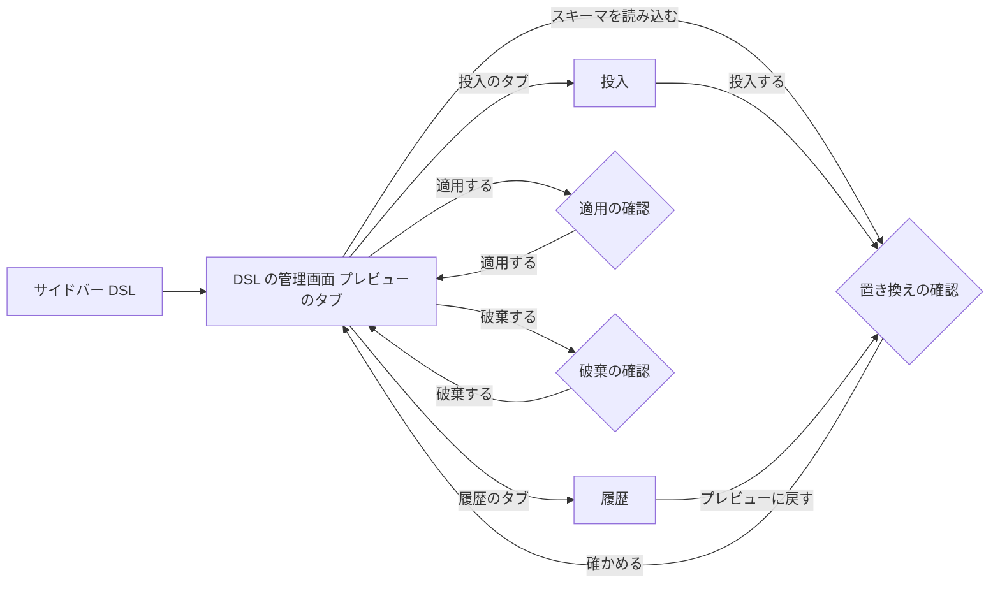

# Mockups — DSL の管理画面

## 0. 前提

- Ideation の段（ラフな画面イメージ・利用者の流れ）は無い。この画面イメージは、ストーリー（`aidlc/spaces/default/intents/260923-dsl-schema-loader/inception/user-stories/stories.md`）と要件（`inception/requirements-analysis/requirements.md`）から直接作った。
- 確定した答えは `refined-mockups-questions.md` の Q1〜Q8。
- 画面は AppShell（サイドバー＋トップバー＋コンテンツ）の中に置く（`aidlc/spaces/default/memory/project.md` の DECIDED）。
- 文言は日本語で示す。英語の文言は、機能設計で ja と対にして決める。物理名（テーブル名・カラム名）は訳さない。
- 画面の幅は、パソコン（1024px 以上）を主な対象にする（Q6: A）。狭い幅での崩れ方は 7節。
- 下の図は、配置と中身を示すための文字の図であり、見た目の寸法は表さない。

## 1. 画面の一覧と行き来

| 画面・領域 | URL | 入り口 | 主なストーリー |
|---|---|---|---|
| DSL の管理画面 | `/admin/dsl`（機能設計で確定） | サイドバーの「DSL」（管理者にだけ表示。「管理」の次） | US1.1〜US5.2、US6.2 |
| ├ 今の状態（画面の上部、常に表示） | — | — | US3.1（AC3.1.6・AC3.1.7）、US1.1 |
| ├ タブ「プレビュー」 | — | 既定で開く | US3.1〜US3.4、US4.1、US4.2 |
| ├ タブ「投入」 | — | — | US2.1〜US2.3 |
| └ タブ「履歴」 | — | — | US5.1、US5.2 |
| 確かめる表示（Modal） | — | 読み込み・投入・履歴からの戻し・適用・破棄 | AC1.1.6、AC2.1.3、AC5.1.4、AC4.1.2、AC3.3.1 |

画面の行き来（文章で示す）:

- サイドバーの「DSL」を選ぶと、DSL の管理画面が開き、「プレビュー」のタブが選ばれた状態になる。
- スキーマの読み込み・投入・履歴からの戻しが成功すると、「プレビュー」のタブに切り替わり、新しいプレビューが表示される。
- 適用が成功すると、「今の状態」の適用中の欄が新しい版に変わり、「プレビュー」のタブはプレビューが無い状態になる。
- 管理者でない利用者には、サイドバーの「DSL」は表示されない。URL を直接開いたときは、既存の管理者向け領域と同じ扱い（表示できない旨）になる。



図の文章による代替: サイドバーの「DSL」から管理画面（プレビューのタブ）に入る。読み込み・投入・履歴からの戻しは、置き換えの確認を経てプレビューに戻る。適用と破棄は、それぞれの確認を経てプレビューのタブに戻る。

## 2. 画面の全体（プレビューがあり、適用中の DSL もある状態）

```
┌─ AppShell ───────────────────────────────────────────────────────────────┐
│ [サイドバー]      │ MasterSmith                         [言語] [ユーザー ▼]  │
│  ホーム           ├──────────────────────────────────────────────────────┤
│  管理             │ # DSL                                                 │
│ >DSL              │                                                       │
│                   │ ┌ 今の状態 ─────────────────────────────────────────┐ │
│                   │ │ 適用中   識別 3f9a1c…  適用 管理者 太郎            │ │
│                   │ │          2026-09-24 10:15 (JST)                    │ │
│                   │ │ プレビュー 識別 8b02d4…  出どころ アップロード      │ │
│                   │ │          置いた人 管理者 花子  2026-09-24 11:02     │ │
│                   │ │                                  [スキーマを読み込む]│ │
│                   │ └──────────────────────────────────────────────────┘ │
│                   │                                                       │
│                   │ [プレビュー] [ 投入 ] [ 履歴 ]      ← タブ            │
│                   │ ┌──────────────────────────────────────────────────┐ │
│                   │ │ ✔ 検証を通りました                                │ │
│                   │ │ ⚠ 対象DB との食い違いが 2件あります（適用はできます）│ │
│                   │ │                                                    │ │
│                   │ │ ## 要約                                            │ │
│                   │ │ テーブル 42（うちビュー 3）  カラム 1,318           │ │
│                   │ │ 表示名の未設定  1件  [場所を見る]                   │ │
│                   │ │                                                    │ │
│                   │ │ ## 適用中との違い                                   │ │
│                   │ │ 増えた 1  減った 1  変わった 3   [すべて表示 ○]     │ │
│                   │ │ ┌───────────────┬────────┬──────────────┐     │ │
│                   │ │ │ テーブル        │ 区分    │ カラムの違い  │     │ │
│                   │ │ ├───────────────┼────────┼──────────────┤     │ │
│                   │ │ │ ▶ dept_mst     │ 変わった │ +1 −1 ~1      │     │ │
│                   │ │ │ ▶ item_mst     │ 増えた   │ +12           │     │ │
│                   │ │ │ ▶ old_code     │ 減った   │ −5            │     │ │
│                   │ │ └───────────────┴────────┴──────────────┘     │ │
│                   │ │                                                    │ │
│                   │ │ ## 対象DB との食い違い（警告）                       │ │
│                   │ │ ・dept_mst.remarks … 対象DB にありません            │ │
│                   │ │ ・item_mst.price … 型が違います（DSL: 数値 / DB: 文字列）│ │
│                   │ │                                                    │ │
│                   │ │ ## メニュー                                         │ │
│                   │ │ ▼ 基本マスタ                                        │ │
│                   │ │    ・部署（dept_mst）                               │ │
│                   │ │    ・品目（item_mst）                               │ │
│                   │ │                                                    │ │
│                   │ │ [ダウンロード]           [破棄する]  [適用する]     │ │
│                   │ └──────────────────────────────────────────────────┘ │
└──────────────────────────────────────────────────────────────────────────┘
```

- 「今の状態」は、どのタブを開いていても画面の上部に表示する（AC3.1.6・AC3.1.7）。識別はハッシュ値の先頭を示し、全体はツールチップで見られる。日時は表示言語に合わせた書式で、時差が分かる形にする（US5.1 の注記）。
- 状態は色だけでなく、記号と文言で示す（✔ 検証を通りました、⚠ 警告）。
- 「適用する」が主な操作（Button の primary）。「破棄する」は危険な操作の見た目（destructive）。「ダウンロード」は補助の操作（secondary）。
- 違いの表では、区分を文字のバッジ（Badge）で示し、はじめは違いのあるテーブルだけを表示する。「すべて表示」を入れると、変わらないテーブルも出る（Q4: A）。
- 表示名の未設定は、件数と「場所を見る」で一覧を開く（AC3.1.2）。

## 3. タブ「プレビュー」の状態

### 3.1 違いのあるテーブルの行を開いたとき（AC3.1.3・AC3.1.4）

```
│ ▼ dept_mst     │ 変わった │ +1 −1 ~1      │
│   ┌──────────────┬────────┬──────────────────────┐ │
│   │ カラム        │ 区分    │ 変わった項目          │ │
│   ├──────────────┼────────┼──────────────────────┤ │
│   │ dept_kana    │ 増えた   │ —                    │ │
│   │ fax_no       │ 減った   │ —                    │ │
│   │ dept_name    │ 変わった │ 表示名（ja）          │ │
│   └──────────────┴────────┴──────────────────────┘ │
```

「変わった」に数える項目の一覧は、機能設計で決める。

### 3.2 適用中の DSL がまだ無いとき（AC3.1.5・AC3.1.7）

```
┌ 今の状態 ──────────────────────────────────────────┐
│ 適用中   まだ適用していません                         │
│ プレビュー 識別 8b02d4…  出どころ 生成 …               │
└───────────────────────────────────────────────────┘
## 適用中との違い
適用中の DSL がまだ無いため、すべてのテーブルとカラムを「増えた」として示します。
増えた 42
```

### 3.3 プレビューが無いとき（AC3.1.7・AC3.3.3・AC4.2.2）

```
┌──────────────────────────────────────────────────┐
│  プレビューはありません。                              │
│  スキーマを読み込むか、DSL を投入すると、ここで         │
│  確かめられます。                                     │
│            [スキーマを読み込む]  [投入のタブへ]         │
└──────────────────────────────────────────────────┘
```

「適用する」「破棄する」「ダウンロード」は表示しない（押せない操作を並べない）。

### 3.4 対象DB と照合できなかったとき（AC3.2.4）

```
⚠ 対象DB と照合できませんでした。対象DB に接続できないか、応答がありません。
  適用はできますが、食い違いは確かめられていません。運用者に接続の状態を確かめてもらってください。
```

接続先・ユーザー名などの値と、内部のエラーの文言は表示しない（NFR4・NFR5）。

### 3.5 適用の確認（AC4.1.2、Modal）

```
┌ DSL を適用しますか ────────────────────────────────┐
│ 適用すると、アプリが使う DSL がこのプレビューの内容に    │
│ 切り替わります。                                     │
│                                                      │
│ 違い    増えた 1 ・ 減った 1 ・ 変わった 3               │
│ 警告    対象DB との食い違い 2件                         │
│                                                      │
│                         [やめる]  [適用する]           │
└──────────────────────────────────────────────────────┘
```

- はじめのフォーカスは「やめる」に置く（誤って Enter を押しても適用しない）。
- 警告が0件のときは「警告 ありません」と示す。

### 3.6 適用が拒否されたとき（AC4.2.1・AC4.2.2）

```
✖ 適用できませんでした。あなたが確かめた後に、プレビューが別の管理者によって置き換えられました。
  適用中の DSL は変わっていません。            [最新のプレビューを表示する]
```

- 「最新のプレビューを表示する」を選ぶと、新しいプレビュー（出どころ・置いた人を含む）を表示し直す。自動では適用しない。
- プレビューが破棄されていた場合は、3.3 の「プレビューはありません」を表示し、文言を「プレビューは別の管理者によって破棄されました」とする。

### 3.7 適用の成功（AC4.1.1）

- Toast で「DSL を適用しました」と知らせ（読み上げでも伝わる）、「今の状態」の適用中の欄を新しい版にし、プレビューのタブは 3.3 の状態にする。

### 3.8 破棄の確認（AC3.3.1、Modal）

```
┌ プレビューを破棄しますか ──────────────────────────┐
│ 破棄したプレビューは元に戻せません。適用中の DSL は     │
│ 変わりません。                                       │
│ 出どころ アップロード ・ 置いた人 管理者 花子            │
│                         [やめる]  [破棄する]           │
└──────────────────────────────────────────────────────┘
```

## 4. スキーマの読み込み

### 4.1 置き換えの確認（AC1.1.6、Modal。プレビューがあるときだけ）

```
┌ 今のプレビューを置き換えますか ─────────────────────┐
│ スキーマを読み込むと、今のプレビューは新しく作る DSL に │
│ 置き換わります。適用中の DSL は変わりません。           │
│ 今のプレビュー  出どころ アップロード                   │
│                置いた人 管理者 花子  2026-09-24 11:02  │
│                         [やめる]  [置き換える]         │
└──────────────────────────────────────────────────────┘
```

投入・履歴からの戻しの置き換えの確認も、同じ形にする（本文の「スキーマを読み込むと」を、操作に合わせて変える）。

### 4.2 処理中（Q8: A）

```
│                                  [◌ 読み込んでいます…] │   ← 押したボタンが処理中の表示になる
```

- 処理中は、読み込み・投入・履歴からの戻し・適用・破棄のボタンを使えなくする。タブの切り替えと表示の確認はできる。
- 読み上げでは「スキーマを読み込んでいます」と伝え、終わったら結果を伝える。

### 4.3 対象DB を使えないとき（AC1.1.7・AC1.1.8）

```
✖ スキーマを読み込めませんでした。対象DB の接続先が設定されていません。
  運用者に、対象DB の接続の設定を確かめてもらってください。
```

```
✖ スキーマを読み込めませんでした。対象DB に接続できないか、応答がありませんでした。
  運用者に、対象DB の状態を確かめてもらってください。
```

- 設定が無い場合と、接続できない場合で文言を分ける。値と内部のエラーの文言は表示しない。
- プレビューと適用中の DSL は変わらない。

## 5. タブ「投入」

### 5.1 入力（Q3: A）

```
┌──────────────────────────────────────────────────┐
│ 投入のしかた   (●) ファイルを選ぶ   ( ) 貼り付ける      │
│                                                    │
│ DSL のファイル（YAML、5MB まで）                     │
│ [ファイルを選ぶ]  master-dsl-v3.yaml（1.2MB）          │
│                                                    │
│                                        [投入する]  │
└──────────────────────────────────────────────────┘
```

「貼り付ける」を選んだとき:

```
│ 投入のしかた   ( ) ファイルを選ぶ   (●) 貼り付ける      │
│ DSL（YAML、5MB まで）                                │
│ ┌──────────────────────────────────────────────┐ │
│ │ version: 1                                     │ │
│ │ menus:                                         │ │
│ │   ...                                          │ │
│ └──────────────────────────────────────────────┘ │
│                                        [投入する]  │
```

- 切り替えで、どちらか一方だけを入力できる。切り替えても、もう一方の入力は画面の中では保つ（戻したときに消えていない）が、送るのは選んでいる方だけ。
- 何も入力していないときは「投入する」を押せず、「ファイルを選ぶか、貼り付けてください」と案内する（AC2.1.4）。
- 5MB を超えるファイルを選ぶと、送る前に「ファイルが 5MB を超えています」と示す（AC2.1.5）。
- ファイルの選択の部品は make-you-chic-ui に無いため、画面の側で作る（`design-system-mapping.md`）。

### 5.2 誤りの一覧（AC2.2.1〜AC2.2.9、Q5: A）

```
┌──────────────────────────────────────────────────┐
│ ✖ DSL に誤りが 128件あります。受け付けていません。      │
│   先頭の 100件を表示しています（残り 28件）。           │
├─────┬────┬─────────────────────┬───────────────┤
│ 行   │ 列  │ 場所                  │ 内容           │
├─────┼────┼─────────────────────┼───────────────┤
│ 12   │ 5   │ tables.dept_mst.columns.dept_name │ 必須の項目 label がありません │
│ 40   │ 9   │ menus[0].items[2]      │ DSL に無いテーブル item を指しています │
│ …    │     │                       │               │
└─────┴────┴─────────────────────┴───────────────┘
│ 投入のしかた   (●) ファイルを選ぶ   ( ) 貼り付ける      │
│ [ファイルを選ぶ]  master-dsl-v3.yaml（1.2MB）  ← 残る  │
│                                        [投入する]  │
```

- 件数の警告（Alert）を投入の欄のすぐ上に置き、その下に表（Table）を置く。フォーカスは件数の警告に移り、件数が読み上げられる。
- 選んだファイル名・貼り付けた内容は残り、直してそのまま投入し直せる。
- 危険な形の DSL（大きさ・入れ子の深さ・別名の数・タグ・重複キー）は、理由ごとの文言で1件の誤りとして示す（例: 「DSL が大きすぎます（上限 5MB）」）。
- 版が対応していないときは、「この DSL の書式の版（version: 3）には対応していません」と示す。

### 5.3 受け付けた後

- 置き換えの確認（プレビューがあるとき）を経て、「プレビュー」のタブに切り替わり、新しいプレビューを表示する。Toast で「DSL をプレビューに置きました」と知らせる。

## 6. タブ「履歴」

### 6.1 一覧（AC5.1.1、AC5.2.x）

```
┌──────────────────────────────────────────────────────────────┐
│ 適用の履歴（新しい順、最大 20件）                                  │
├──────────────────┬────────────┬──────────┬────────┬────────────────┤
│ 適用した日時        │ 適用した人   │ 識別      │ 状態    │ 操作            │
├──────────────────┼────────────┼──────────┼────────┼────────────────┤
│ 2026-09-24 10:15 JST│ 管理者 太郎  │ 3f9a1c…  │ 適用中   │ [ダウンロード]   │
│ 2026-09-20 16:40 JST│ 管理者 花子  │ 77e0b2…  │         │ [プレビューに戻す]│
│ 2026-09-18 09:05 JST│ 管理者 太郎  │ 1c4d9e…  │         │ [プレビューに戻す]│
└──────────────────┴────────────┴──────────┴────────┴────────────────┘
```

- 今適用中の版は、状態の列に「適用中」の文字で示す（色だけにしない）。適用中の版の「ダウンロード」は適用中の DSL のダウンロード（US5.2）。
- 「プレビューに戻す」は、置き換えの確認（プレビューがあるとき）を経てプレビューに置く。検証を通らない版は、投入と同じ誤りの一覧を出す（AC5.1.6）。

### 6.2 履歴が無いとき（AC5.1.2）

```
まだ一度も適用していません。適用すると、ここに履歴が残ります。
```

## 7. 画面の幅（Q6: A）

| 幅 | ふるまい |
|---|---|
| 1024px 以上 | 上の図のとおり |
| 768〜1023px | サイドバーは AppShell の既定の振る舞い（畳む）に従う。「今の状態」の2行は縦に並べる。表は横に動かして見る |
| 767px 以下 | ボタンは縦に並べる。表は横に動かして見る。操作はすべてできる（作り込みはしない） |

## 8. ストーリーとの対応

| ストーリー | 画面イメージの節 |
|---|---|
| US1.1・US1.2 | 2、4.1〜4.3 |
| US2.1・US2.2・US2.3 | 5.1〜5.3 |
| US3.1 | 2、3.1〜3.3 |
| US3.2 | 2、3.4 |
| US3.3 | 3.8 |
| US3.4 | 2（ダウンロード） |
| US4.1 | 3.5、3.7 |
| US4.2 | 3.6 |
| US5.1・US5.2 | 6.1、6.2 |
| US6.1 | 4.3（利用者に見える部分） |
| US6.2 | 1（入り口）、`accessibility-checklist.md` |
| US6.3 | 画面は無い（監査ログを画面で見る働きは作らない） |
