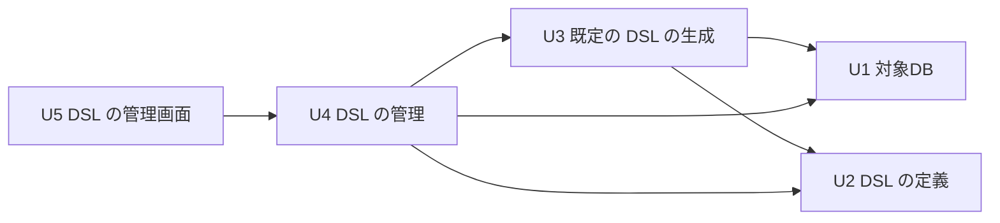

# Unit of Work Dependency — dsl-schema-loader

単位どうしの依存（どの単位がどの単位を使うか）だけを示す。どの順に作るか、どれが重要な経路かは Delivery Planning で決める。

## 依存の図



図の文章による代替（矢印は「依存する」）: U3 は U1 と U2 に依存する。U4 は U1・U2・U3 に依存する。U5 は U4 に依存する。U1 と U2 は、どの単位にも依存しない。循環は無い。

## 機械で読む形

```yaml
units:
  - name: u1-target-db
    kind: library
    depends_on: []
  - name: u2-dsl-definition
    kind: library
    depends_on: []
  - name: u3-default-dsl-generation
    kind: library
    depends_on: [u1-target-db, u2-dsl-definition]
  - name: u4-dsl-management
    kind: service
    depends_on: [u1-target-db, u2-dsl-definition, u3-default-dsl-generation]
  - name: u5-dsl-admin-ui
    kind: ui
    depends_on: [u4-dsl-management]
```

## 単位の間のつなぎ目

| 依存する単位 → 依存される単位 | つなぎ方 | 受け渡すもの |
|---|---|---|
| U3 → U1 | アプリの中の呼び出し（同期） | スキーマの写し（テーブル・ビュー・カラム・型・主キー・外部キー・NOT NULL・既定値・コメント）、接続できない等の結果 |
| U3 → U2 | アプリの中の呼び出し（同期） | 生成した YAML の本文を渡し、検証の結果を受け取る。書式の版 |
| U4 → U1 | アプリの中の呼び出し（同期） | 照合のためのスキーマの写し、接続できない等の結果 |
| U4 → U2 | アプリの中の呼び出し（同期） | YAML の本文を渡し、検証の結果（誤りの一覧）・DSL の識別・モデルを受け取る。起動時と適用の確定の後に ActiveDslModel を差し替える |
| U4 → U3 | アプリの中の呼び出し（同期） | スキーマの読み込みの操作で、既定の DSL の YAML の本文を受け取る |
| U5 → U4 | HTTP（`/api/admin/` の下の API） | 今の状態・プレビュー（要約・違い・照合の警告・識別）・誤りの一覧（Problem Details の拡張）・履歴・ダウンロード、適用の要求に見たプレビューの識別 |

- 共有するデータ: 内部DB のプレビューと適用の履歴の表は U4 だけが持つ。監査の表（`audit_events`）は既存の `audit` の持ち物で、U4 が拡張と出来事の発行を受け持つ。
- アプリの中の出来事: U4 が DSL の操作の出来事を出し、既存の `audit` が受けて記録する。
- つなぎ目の具体的な形（型・API・`code` の一覧）は、次の Contract Design で決める。

## 並行して作れる組み合わせ

依存の上では、U1 と U2 は互いに依存しないため、並行して作ることもできる。ただし依頼者の判断（`units-generation-questions.md` の Q4: B）により、この Intent では依存の順に1つずつ作る前提とする。具体的な順序は Delivery Planning で決める。
