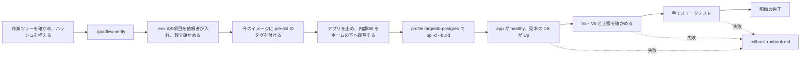

# 配備の流れの構成（cd-config）

Intent `260923-dsl-schema-loader`（対象DB の読み取り・DSL の定義・既定の DSL の生成・DSL の管理と画面）の配備の流れ。配備先は、前の Intent と同じく**開発者の PC 上のコンテナ**だけである。配備の仕組みは、既にある `Dockerfile`・`compose.yaml`・README と、前の Intent の配備の段の成果物（`aidlc/spaces/default/intents/260923-colima-spec-up/operation/deployment-pipeline/`、その元の `aidlc/spaces/default/intents/260922-auth-audit-base/operation/deployment-pipeline/`。以下「前回の構成」）を正とし、本書は今回の差だけを書く（`project.md` の Deployment）。

- 決定の記録: `deployment-pipeline-questions.md`（Q1〜Q3、F1・F2、確認済みの要約）
- 入力: `construction/ci-pipeline/ci-config.md`（8節、CI の実行の結果）、`construction/build-and-test/build-and-test-summary.md`（U4-MIGRATION・U4-STORAGE-RUN）、各単位の `infrastructure-design/cicd-pipeline.md`（U1 の3節「手元で試す対象DB」、U4 の2節「配備」）、U4 の `infrastructure-design/infrastructure-specification.md` 5節（戻し方）

## 1. 配備する版と、今動いている版

| 項目 | 値 | 確かめ方 |
|---|---|---|
| 配備する版 | この Intent の `develop` の先頭（本書を書いた時点で `037a33b`。配備のときに控えたハッシュが記録になる） | `git rev-parse --short HEAD` |
| アプリの中身 | `8961cb2`（Code Generation の Loop-back 1 の直し）と同じ。その後のコミットは README・`perf/`・ワークフローの記録だけ | `git diff --stat 8961cb2 HEAD -- . ':!aidlc'` が README.md・perf/README.md・perf/dsl-timing.sh だけ |
| CI | `6f212e8` で成功（実行 36021036733。対象DB の3種類のコンテナを含む全段、`SKIPPED` 0 件） | `construction/ci-pipeline/ci-config.md` 8節 |
| 今動いている版 | `10742a3`（前の Intent で配備。イメージ `mastersmith:local`、ID `sha256:8441534a745f…`、2026-09-23 作成）。上限はメモリ 2GiB・CPU 4、healthy | `docker inspect mastersmith-app-1 --format '{{.Image}} {{.HostConfig.Memory}} {{.HostConfig.NanoCpus}}'` |
| 戻し先として残すイメージ | `mastersmith:pre-dsl`（配備の前に今の `mastersmith:local` にタグを付ける。Q3: A） | `docker image inspect mastersmith:pre-dsl --format '{{.Id}}'` が上の ID と同じ |

## 2. 今回の変更と、配備への影響

| 項目 | 内容 | 配備への影響 |
|---|---|---|
| アプリ | 対象DB の読み取り（U1）・DSL の定義と検証（U2）・既定の DSL の生成（U3）・DSL の管理の API（U4）・DSL の管理画面（U5）。依存に JDBC ドライバー3つ・SnakeYAML・networknt json-schema-validator が増えた | WAR とイメージの作り直しが要る（`./gradlew verify` → `docker compose ... up -d --build`） |
| 内部DB のスキーマ | Flyway の V5（表 `dsl_previews`・`dsl_applied_revisions` の作成）・V6（`audit_events` に NULL を許す列4つの追加）。前進のみ・削除や変更は無い | 起動のときに当たる。戻すときはスキーマを戻さない（`rollback-runbook.md` 3節）。配備の前に内部DB を複写する（Q2: A） |
| 内部DB の既定の接続先 | `jdbc:h2:file:./data/mastersmith;DEFRAG_ALWAYS=TRUE`（止めるときに H2 のファイルを詰め直す） | `.env` に `MASTERSMITH_DB_URL` は無い（項目を数えて 0）ため、既定がそのまま効く。止めるのにかかる時間は Build and Test の実測で約 1 秒（0.55〜1.00 秒）で、`stop_grace_period: 45s` の内 |
| 対象DB の設定 | `MASTERSMITH_TARGET_DB_*`（7つの必須の項目と、待ち・接続の数の任意の項目）が増えた | `.env` に7項目を依頼者が入れる（3節）。今の `.env` には無い（項目を数えて 0） |
| 見本の対象DB | `compose.yaml` に profile `targetdb-postgres`・`targetdb-mysql`・`targetdb-mariadb` のサービスとボリュームが増えた（`10742a3` からの `compose.yaml` の差はこれだけ） | 配備したアプリには **PostgreSQL（`targetdb-postgres`）** をつなぎ、アプリと一緒に起動・停止する（Q1: B、F1: A、F2: A） |
| `Dockerfile` | `10742a3` から変更なし | 起動の形（`ENTRYPOINT`）・JVM の設定の口は前回のまま |
| コンテナの資源 | アプリは今までどおり `.env` の `MASTERSMITH_CONTAINER_MEMORY`（2g）・CPU 4。見本の PostgreSQL は `mem_limit: 512m` | colima の VM（CPU 4・6GiB）に、アプリ 2GiB と見本の DB 512MiB が収まる（手元の監視 `lgtm` 900MB を足しても約 3.4GB） |
| 既知の制約 U4-STORAGE-RUN | 動いている間は、大きな DSL の投入と適用のたびに内部DB のファイルが本文の大きさの分ずつ増え、止めると詰め直される（Build and Test で依頼者が受け入れた。README の「DSL の管理の API（U4）」） | 配備の手順は変えない。運用の注意として `deployment-strategy.md` 5節に書く |

## 3. `.env` に入れる項目（値は依頼者が入れ、AI は値を見ない）

| 項目 | 値の決め方 |
|---|---|
| `MASTERSMITH_SAMPLE_TARGETDB_ADMIN_PASSWORD` | 見本の DB の管理者 `target_admin` のパスワード。乱数で作ることを勧める（例: `openssl rand -hex 24`） |
| `MASTERSMITH_SAMPLE_TARGETDB_READER_PASSWORD` | 読み取りだけのアカウント `mastersmith_reader` のパスワード。乱数で作ることを勧める |
| `MASTERSMITH_TARGET_DB_TYPE` | `postgresql` |
| `MASTERSMITH_TARGET_DB_HOST` | `targetdb-postgres`（compose の中の名前。ポートは PC に開けない） |
| `MASTERSMITH_TARGET_DB_PORT` | `5432` |
| `MASTERSMITH_TARGET_DB_DATABASE` | `business` |
| `MASTERSMITH_TARGET_DB_SCHEMA` | `sales` |
| `MASTERSMITH_TARGET_DB_USERNAME` | `mastersmith_reader` |
| `MASTERSMITH_TARGET_DB_PASSWORD` | `MASTERSMITH_SAMPLE_TARGETDB_READER_PASSWORD` と同じ値 |

- 見本のスキーマと読み取りのアカウントは、見本の DB のボリューム（`mastersmith_mastersmith-targetdb-postgres`）が無い状態で初めて起動したときだけ作られる。本書を書いた時点でこのボリュームは無い。そのため、2つのパスワードは**初めて起動する前に**入れる。後からパスワードを変えても見本の DB には効かない（変えるときは見本の DB のボリュームを消して作り直す。`rollback-runbook.md` 6節）。
- `openssl rand -hex 24` を勧めるのは、値が英数字だけになり、`.env` の読み方（`$` などの展開）や SQL の引用に左右されないため。
- 入ったことの確かめは、値を表示せずに項目を数えるだけにする（`grep -c '^MASTERSMITH_TARGET_DB_TYPE=.' .env` などが 1）。
- 古い版（`10742a3`）は `MASTERSMITH_TARGET_DB_*` を読まないため、戻すときに `.env` を元に戻す必要は無い。そのため、前の Intent と違い、配備の前の `.env` の複写は手順に入れない。

## 4. 流れ（前回の構成からの差: イメージのタグ付けと見本の対象DB の起動・確かめを加え、`.env` の変更は依頼者が行う）

テキスト表記:

1. 作業ツリーにアプリのソースの未コミットの変更が無いことを確かめ、ハッシュを控えて、`./gradlew verify` を通す。
2. 依頼者が `.env` に3節の9項目を入れる。AI は項目の数だけを確かめる。
3. 今動いている版のイメージに `mastersmith:pre-dsl` のタグを付ける。
4. アプリを止め、内部DB のボリュームをリポジトリの外（ホームの下）へ複写する。
5. `docker compose --profile targetdb-postgres up -d --build` で、アプリのイメージを作り直してアプリと見本の対象DB を起動する。
6. アプリが healthy、見本の対象DB が Up になり、Flyway が V6 まで当て、上限が期待どおりであることを確かめる。
7. スモークテストが通れば配備の完了とする。途中で失敗したら `rollback-runbook.md` で戻す。

手順の詳細とコマンドは `deployment-strategy.md` 2節。配備の前の負荷の確かめは行わない（配備と同じソースのイメージを、配備と同じ上限 2g・CPU 4 で Build and Test の段で測っている。`construction/build-and-test/performance-test-instructions.md`）。残る性能の目標（NFR1.10・NFR1.12・U4-POOL）は performance-validation の段が持つ。

## 5. 環境の段・承認・成果物

前回の構成のまま変えない。

- 環境: 開発者の PC 上のコンテナだけ。検証環境と本番環境は無い（配備先が決まったら org.md の既定に沿って作る）。
- 承認: 依頼者。AI-DLC の作業の中で AI が配備する場合は、依頼者の承認を得てから行う。
- 成果物: 手元で `./gradlew verify` を通して作った `backend/build/libs/mastersmith.war`、イメージ `mastersmith:local`。版は、配備のときに控えたコミットのハッシュで見分ける。今回だけ、戻し先として `mastersmith:pre-dsl` を残す（次の配備でこのタグを替えるか消すかを決める）。
- 機能の切り替え（フィーチャーフラグ）: 使わない。対象DB を使うかどうかは `.env` の `MASTERSMITH_TARGET_DB_*` の有無で決まる（7項目がすべて空なら使わない）が、これは配備の設定であり、フィーチャーフラグとしては扱わない。

## 6. 承認済みの設計・前回の構成との差

| 事項 | 承認済みの設計・前回の構成 | 本段の決定 | 理由 |
|---|---|---|---|
| 戻すときの成果物 | 前回の構成: 直前の版のコミットを `git worktree add` で取り出して WAR を作り直す（README の「戻し方」も同じ） | 配備の前に今のイメージへ `mastersmith:pre-dsl` のタグを付けて残し、`MASTERSMITH_IMAGE_TAG=pre-dsl` で起動する（Q3: A）。取り出して作り直す手順は、タグのイメージが無いときの代わりの手として残す | 作り直しの時間とネットワークが要らず、`compose.yaml` の既にある口（`image: mastersmith:${MASTERSMITH_IMAGE_TAG:-local}`）だけで戻せる |
| イメージのタグ | 前回の構成: `local` のまま | `local` のまま。戻し先だけ `pre-dsl` を足す | 版は今までどおり控えたハッシュで見分ける |
| 内部DB のバックアップの置き場 | README の「内部DBのバックアップと戻し方」: リポジトリの直下（`"$PWD"`、`.gitignore` の `mastersmith-data-*.tgz`） | リポジトリの外、ホームの下（`~/.mastersmith-backup/`、権限 700）（Q2: A） | 公開のリポジトリの中に、メールアドレスと接続元IPを含むファイルを置かないため。colima の VM から見えるのはホームの下（`project.md` の Corrections） |
| 見本の対象DB の起動 | U1 の `cicd-pipeline.md` 3節: 試すときに1つずつ profile で起動する | 配備したアプリには PostgreSQL をつなぎ、アプリと一緒に起動・停止する（F2: A） | 配備したアプリで既定の DSL の生成と照合を使えるようにするため |
| スモークテスト | U4 の `cicd-pipeline.md` 2節: ヘルスチェックと、DSL の管理画面の今の状態の表示 | それに、見本の対象DB からの既定の DSL の生成を足す（`deployment-strategy.md` 3節） | Q1: B で対象DB をつなぐため、接続の設定が効いていることまで確かめる |

設計の文書は確定済みのため書き換えない。README の「コンテナでの起動と確認」と「手元で試す対象DB（compose の profile）」に、見本の対象DB を一緒に起動・停止する手順を足した（`project.md` の Way of Working）。最初の案では README の「戻し方」「内部DBのバックアップと戻し方」を変えずにいたが、承認の場の依頼者の指示（Request Changes「README の戻し方・バックアップの置き場をそろえる」）で、README を本段の手順にそろえた（2026-09-25）。

- 「戻し方」: 配備の前に今のイメージへ戻し用のタグ（例 `pre-dsl`）を付け、戻すときは `MASTERSMITH_IMAGE_TAG=<戻し用のタグ>` と `--no-build` で起動する形にした。取り出して WAR を作り直す手順は、タグのイメージが無いときの代わりの手として残した。見本の対象DB は戻しの対象外と書いた。
- 「内部DBのバックアップと戻し方」: 置き場をリポジトリの直下（`"$PWD"`）からホームの下の `~/.mastersmith-backup/`（権限 700）に替え、`mktemp -d` を使わない理由を書いた。「監査ログの確かめ方」の複写の置き場も同じ場所にそろえた。
- 「コンテナでの起動と確認」の配備の流れに、戻し用のタグを付ける手順を足した。

## Sources

- `aidlc/spaces/default/intents/260923-dsl-schema-loader/operation/deployment-pipeline/deployment-pipeline-questions.md`（Q1〜Q3、F1・F2、確認済みの要約）
- `aidlc/spaces/default/intents/260923-colima-spec-up/operation/deployment-pipeline/cd-config.md`・`deployment-strategy.md`・`rollback-runbook.md`（前回の構成）
- `aidlc/spaces/default/intents/260922-auth-audit-base/operation/deployment-pipeline/cd-config.md`・`deployment-strategy.md`・`rollback-runbook.md`（元の構成）
- `aidlc/spaces/default/intents/260923-dsl-schema-loader/construction/ci-pipeline/ci-config.md`（8節）
- `aidlc/spaces/default/intents/260923-dsl-schema-loader/construction/build-and-test/build-and-test-summary.md`（U4-MIGRATION、U4-STORAGE-RUN・U4-STORAGE-RESTART）
- `aidlc/spaces/default/intents/260923-dsl-schema-loader/construction/u1-target-db/infrastructure-design/cicd-pipeline.md`（3・4節）、`aidlc/spaces/default/intents/260923-dsl-schema-loader/construction/u4-dsl-management/infrastructure-design/cicd-pipeline.md`（2節）・`infrastructure-specification.md`（5節）
- `compose.yaml`、`Dockerfile`、`.env.example`、`README.md`、`docker/targetdb/postgres/01-sample-schema.sql`・`02-reader-account.sh`、`backend/src/main/resources/application.yaml`（Flyway）、`backend/src/main/resources/db/migration/V5__u4_dsl_management.sql`・`V6__u4_dsl_audit_columns.sql`
- 読み取りだけで調べた今の環境（2026-09-25）: `docker ps -a`（`mastersmith-app-1` が healthy、イメージ `mastersmith:local`）、`docker volume ls`（`mastersmith_mastersmith-targetdb-postgres` は無い）、`colima list`（CPU 4・6GiB）、`.env` の項目の数（`MASTERSMITH_TARGET_DB_*`・`MASTERSMITH_SAMPLE_TARGETDB_*`・`MASTERSMITH_DB_URL` は 0、`MASTERSMITH_CONTAINER_MEMORY` は 1）、`git diff 10742a3 HEAD -- compose.yaml Dockerfile`

## Assumptions & Open Questions

- [assumption] 古い版（`10742a3`）が V5・V6 の当たった内部DB で起動できること（U4-MIGRATION）は、Flyway の既定（アプリの知らない先の移行を無視する）と Hibernate の検証（自分の表と列だけを確かめる）からの見込みで、まだ試していない。Deployment Execution で確かめる。
- [assumption] `mastersmith:pre-dsl` のタグは、次の配備までは消さずに残す前提とした。いつ消すか（次の配備で付け替えるか）は決めていない。
