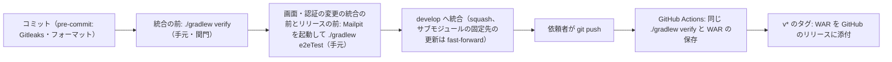

# CI の構成（ci-config）

Intent `260925-user-management`（U1〜U8）の CI の記録です。すでにリポジトリにある `.github/workflows/ci.yml` と、CI が呼ぶ `./gradlew verify` の中身を記録します（project.md の Deployment「CI の仕組みが既に実装されている段では、既にあるものの記録として書く」）。

- 作成日：2026-09-28
- 対象のファイル：`.github/workflows/ci.yml`（ワークフローの名前 `CI`）、`.github/dependabot.yml`
- 段ごとの合否の基準：`quality-gates.md`
- 依頼者の決定：`ci-pipeline-questions.md` の Q1: A・Q2: B・Q3: A と、Consolidated Summary Confirmation（Looks correct）

## 1. この Intent での CI の変更

| ファイル | 変更 | コミット |
|---|---|---|
| `.github/workflows/ci.yml` | **変えていない**。最後の変更は Intent 260922-auth-audit-base の `d1a9938` | — |
| `.github/dependabot.yml` | docker-compose の対象を足した（U1。Mailpit・手元の監視・見本の対象DB のイメージ） | `7b4b1f0` |
| `.github/dependabot.yml` | gradle の対象から `vendor/**` を外した（この段の Q1: A） | この段（未コミット） |
| `./gradlew verify` の中身 | サブモジュールが2つになった、SubEtha SMTP の結合テスト、SpotBugs の関門の追加、テンプレートのライセンスヘッダー、パッケージごとの下限の対象の追加（`quality-gates.md` の 1 節） | B1〜B5 |

CI は同じ `./gradlew verify` を呼ぶため、中身の変更はそのまま CI にも効きます。
- サブモジュール `vendor/java-mustache-processor` は、`ci.yml` の `submodules: true` で取得されます。YAML を変える必要はありませんでした。

## 2. CI の位置づけ

- CI は**統合の後の再確認**として動きます（team.md の Way of Working・Deployment）。統合を止める関門ではありません。
- 統合の前の関門は、手元で実行する `./gradlew verify` です。E2E（Mailpit を起動した `./gradlew e2eTest`）は、画面・認証に関わる変更の統合の前とリリースの前に、手元で流します。
- プルリクエストは使いません。`origin` への `git push` は依頼者が行い、AI はプッシュしません。
- CI が失敗したら、次に進む前に原因を直します（team.md の Way of Working）。ただし、この Intent では、依頼者の決定で次の Intent に持ち越しました（6 節）。

<!-- Text fallback: コミットの直前に pre-commit が動く。統合の前に手元で ./gradlew verify を流し、画面・認証の変更の統合の前とリリースの前には Mailpit を起動して ./gradlew e2eTest も流す。通ったら develop へ統合する（squash。サブモジュールの固定先の更新は fast-forward）。依頼者がプッシュすると GitHub Actions が同じ ./gradlew verify を実行して WAR を保存し、v* のタグでは WAR をリリースに添付する。 -->

## 3. きっかけ・権限・ランナー・固定している版

`ci.yml` を変えていないため、前の Intent の `ci-config.md` の 3 節・4 節から変わっていません。要点だけ書きます。

| 項目 | 値 |
|---|---|
| きっかけ | `push`（`develop`・タグ `v*`）、`workflow_dispatch` |
| 権限 | `contents: read`（リリースのジョブだけ `contents: write`） |
| 重なりの制御 | `concurrency: ci-${{ github.ref }}`・`cancel-in-progress: false` |
| ランナー | `ubuntu-latest`、`timeout-minutes: 60` |
| Actions | コミットのハッシュで固定（checkout v7.0.1・setup-java v6.0.1・setup-node v7.0.0・setup-gradle v6.3.0・upload-artifact v7.0.1・download-artifact v8.0.1） |
| JDK・Node.js | Temurin 25・Node.js 24 |
| Gitleaks・OSV-Scanner | 8.30.1・2.6.0。版と SHA-256 で固定 |
| 秘密情報 | 使わない |

## 4. 成果物とリリース

- ジョブ `verify` は、`backend/build/libs/mastersmith.war` を成果物 `mastersmith-<コミットのハッシュ>` として保存します（30 日）。
- `v*` のタグでは、ジョブ `release` が同じ WAR を GitHub のリリースに添付します。
- この Intent の WAR には、メールのテンプレート（`WEB-INF/classes/mail/templates/invitation_ja.html`・`invitation_en.html`）と、java-mustache-processor の jar が入ります（Build and Test で確かめた）。

## 5. CI に入れていないもの

`quality-gates.md` の 5 節のとおりです。
- E2E と実際のブラウザの検査：手元で、Mailpit を起動して流す
- 負荷の試験：performance-validation
- Dependabot のプルリクエストの取り込み：次の Intent

## 6. CI の実行の結果（依頼者のプッシュの後に `gh` で読んだもの）

| 項目 | 値 |
|---|---|
| プッシュしたコミット | `66fe981`（`fd44e79..66fe981`） |
| run | 36433076151 |
| 1回目 | **失敗**。サブモジュールの取得は成功。`backend:integrationTest` の `H2CompactionByPoolSuspensionIT`（接続が 0 本になるのを 10 秒待つところで `ConditionTimeoutException`）の1件で失敗（562 件中 1 件）。フロントエンドは 732 件通過。9分47秒 |
| 2回目（依頼者の手での流し直し） | **失敗**。`H2CompactionByPoolSuspensionIT` は通過。`frontendCoverage` の `InvitationAdminPage.test.tsx` の1件（Vitest の既定の上限 5 秒で時間切れ）で失敗（732 件中 1 件）。10分19秒 |
| 前回のプッシュ（`fd44e79`） | 成功 |

- どちらも、CI の実行環境で、テストの中の時間の上限すれすれになる形です。手元の verify（6分28秒）では、どちらのテストも通りました。原因は確かめていません。
- **依頼者の決定**（Build and Test）：「次のintentでコントラストと一緒に直す。このintentではこのまま進める。」
- CI は失敗したままです。team.md の「CI が失敗したら次に進む前に直す」との差として記録します（`build-and-test/test-results.md` の 8.1 節）。
- この段の変更（`.github/dependabot.yml`）と記録をプッシュすると、CI が再び動きます。上の2つのテストが直るまで、同じ形で失敗しうるものとして扱います。

## 7. 依存関係の更新（`.github/dependabot.yml`）

| 対象 | 置き場 | 間隔 | この段の変更 |
|---|---|---|---|
| gradle | `/` | 週1 | `exclude-paths: ["vendor/**"]` を足した（Q1: A） |
| npm | `/frontend` | 週1 | — |
| github-actions | `/` | 週1 | — |
| docker | `/` | 週1 | — |
| docker-compose | `/` | 週1 | —（U1 で追加） |

- 2026-09-28 の gradle の実行は failure でした。原因は、サブモジュールの中のビルドの依存（`org.owasp.dependencycheck`・`gradle-wrapper`・`org.slf4j:slf4j-api`・`net.jqwik:jqwik`）の `dependency_file_not_resolvable` です。`exclude-paths` の効き目は、プッシュの後の次の実行で確かめます。
- docker-compose の実行（2026-09-28、成功）は、`axllent/mailpit v1.31.2` を含む compose のイメージを調べていました（U1-NFR8.3 の Dependabot の確かめ）。
- Dependabot alerts は無効のままです（Q2: B）。脆弱性の関門は `osvScan` です（`quality-gates.md` の 3 節）。
- 開いたままのプルリクエスト 11 件は、次の Intent でまとめて見直します（Q3: A）。

## Sources

- `.github/workflows/ci.yml`・`.github/dependabot.yml`（`git log -- .github/`）
- GitHub Actions の run 36433076151（1回目・2回目）と Dependabot の実行（`gh run view`・`gh run list`・`gh pr list`）
- 各単位の `code-summary.md`（`construction/u1-mail/code-generation/code-summary.md` の「Build and Test に引き継ぐこと」ほか）
- `construction/build-and-test/build-and-test-summary.md`・`test-results.md`
- `construction/ci-pipeline/ci-pipeline-questions.md`
- `aidlc/spaces/default/memory/team.md`・`project.md`
- `aidlc/spaces/default/intents/260923-dsl-schema-loader/construction/ci-pipeline/ci-config.md`（前の Intent の記録）

## Assumptions & Open Questions

- CI の2つの時間切れの原因は確かめていません（次の Intent で扱う）。
