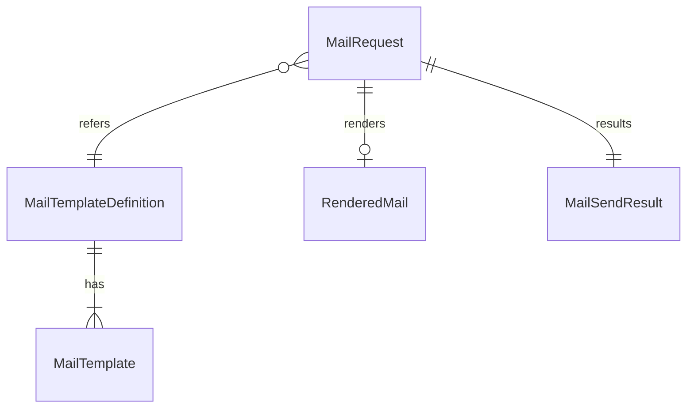

# Functional Spec — U1 メールの描画と送信（u1-mail）

U1 の振る舞い（手順と状態）の正本。値の形は `entities.md`、決まりは `rules.md` が正本で、このファイルの図と要約はそこから導いたもの。U1 は library の単位で、アプリの中の部品（パッケージ `mail`）として契約 C1（`MailSender` の `isConfigured` と `send`）を提供する。

## 1. 起動のときの SMTP の設定の点検

1. アプリの起動のとき、環境変数から SMTP の項目（接続先・ポート・暗号化・資格情報のユーザー名とパスワード・差出人のメールアドレス・差出人の表示名）を読む（BR1.1）。
2. 項目が1つも無ければ、状態を「設定がない」にして終える。WARN は出さない（BR1.2）。
3. 項目を点検する。接続先か差出人が無い、ポートが 1〜65535 の数でない、暗号化が NONE・STARTTLS・SMTPS のどれでもない、差出人が形式に合わない、差出人か表示名に改行がある、資格情報の片方だけがある、のどれかなら、問題のある項目の名前だけを並べた WARN を1件出し、状態を「設定がない」にして終える（BR1.3）。
4. 資格情報があり暗号化が NONE（暗号化の項目が無いときの既定を含む）なら、項目の名前だけの WARN を1件出し、状態を「設定がない」にして終える（BR1.4・BR1.5）。
5. 問題が無ければ、状態を「設定がある」にする。表示名が無ければ MasterSmith、ポートが無ければ暗号化の方式の標準の番号を使う（BR1.5・BR1.6）。SMTP にはまだ接続しない。
6. どの場合もアプリの起動は続ける（FR1.8）。メールの部品のデバッグ出力は無効に固定する（BR1.8）。

## 2. 起動のときのテンプレートの準備

1. テンプレートの一覧（templateId と差し込みの名前の集合、BR2.2）を読む。
2. 置き場 `mail/templates/` のファイルを数え上げる。名前が `<templateId>_<language>.html` の形に合わない、または一覧に無い templateId のファイルがあれば、起動を止める（BR2.1・BR2.3）。
3. 一覧の templateId ごとに、ja と en のファイルを読み、描ける形に準備する。どちらかが無い、または準備できない（Mustache として壊れている）ときは、templateId・language・原因の種類だけをログに出して起動を止める（BR2.3）。
4. 準備したテンプレートは、動いている間は変えない（差し替えない）。

## 3. 設定があるかの問い合わせ（isConfigured）

1. 1節で決めた状態が「設定がある」なら真、「設定がない」なら偽を返す（BR1.7）。
2. 設定の値や「設定がない」理由の項目名は返さない。呼び出し元（U3）は、この真偽を招待を使えない理由の `SMTP_NOT_CONFIGURED`（契約 C5）に使う。

## 4. 送信の流れ（send）

1. **設定を確かめる**: 状態が「設定がない」なら、依頼を確かめず・描かず・接続せずに FAILED（NOT_CONFIGURED）を返す（BR1.7）。
2. **依頼を確かめる**: 次の順に確かめ、最初に当たったもので止める。
   1. language が ja・en のどちらでもない → FAILED（INVALID_INPUT）（BR3.4）
   2. templateId が一覧に無い → FAILED（TEMPLATE_ERROR）（BR3.4）
   3. 宛先・差し込む値のどれかに CR か LF がある → FAILED（INVALID_INPUT）（BR3.2）
   4. 宛先が正規化済み・254 文字まで・形式に合う、のどれかを満たさない → FAILED（INVALID_INPUT）（BR3.1）
   5. 差し込みの名前の集合が一覧と一致しない（欠け・余分）、または値が null・空の文字列・空白だけ（前後の空白を除くと0文字） → FAILED（INVALID_INPUT）（BR3.3）
3. **描く**: templateId と依頼の language のテンプレートだけで、差し込む値をエスケープして描く（BR2.4・BR4.1）。描く途中で失敗したら FAILED（TEMPLATE_ERROR）（BR4.4）。
4. **件名と言語を確かめる**: 描いた本文の title 要素から件名を作る（文字参照を戻し、空白と改行を1つの空白にまとめ、前後の空白を除く）。title が無い・件名が空なら FAILED（TEMPLATE_ERROR）（BR4.2）。html 要素の lang 属性が依頼の language と違えば FAILED（TEMPLATE_ERROR）（BR4.3）。
5. **組み立てる**: HTML だけ（text/html、UTF-8）のメールに、差出人（BR1.6）・宛先1人・件名を、規格どおりに符号化して入れる（BR5.1）。
6. **送る**: 設定の暗号化の方式で SMTP に接続し、1回だけ送る（BR1.5・BR5.2）。自動の再試行はしない。
   - 接続できない・暗号化を確立できない（STARTTLS を受け付けないときを含む）・途中で接続が切れる → FAILED（CONNECTION_FAILED）
   - 接続または応答の待ちが時間切れ → FAILED（TIMEOUT）
   - 受け手が拒否の応答を返す（認証・差出人・宛先・本文） → FAILED（REJECTED）
   - U1 の不具合など想定外の失敗 → 例外（BR5.3）
7. **記録して返す**: 成功なら templateId・language の INFO を1件、失敗なら templateId・language・失敗の種類・例外の型の名前の WARN を1件出す（BR6.2）。SENT、または FAILED と失敗の種類だけを返す（BR6.1）。監査ログには書かない（BR6.4）。

手順 1〜5 で止まったときは SMTP に接続しない（受け手が受けるメールは0通）。U1 は内部DB に触れず、トランザクションを持たない（BR5.4）。送信の依頼は互いに独立で、準備したテンプレートと設定は読むだけなので、同時に呼ばれてもよい。

## 5. 状態の移り変わり

U1 には、依頼をまたいで状態が移り変わる対象（ライフサイクルを持つエンティティ）は無い。送信の依頼は4節の手順で1回ごとに完結する。起動のときに決まり、動いている間は変わらない状態は次の2つだけである。

| 状態 | 入る条件 | 送信の結果 |
|---|---|---|
| 設定がない | 起動のときに SMTP の項目が無い、欠け・不正がある、または資格情報と暗号化 NONE の組 | いつも FAILED（NOT_CONFIGURED）。isConfigured は偽 |
| 設定がある | 起動のときに接続先と差出人がそろい、問題が無い | 4節の手順 2 以降に進む。isConfigured は真 |

テンプレートの準備は、すべてそろえば「準備済み」になり、欠け・壊れがあれば起動が止まるため、「準備できていないまま動いている」状態は無い。設定やテンプレートを変えたときは、アプリを起動し直す。

## 6. エンティティの関係（`entities.md` から導いた図）

図の文章による代替: テンプレートの一覧の1行（MailTemplateDefinition）は、ja と en の描く前のテンプレート（MailTemplate）を持つ。送信の依頼（MailRequest）は templateId で一覧の1行を指し、確かめを通ったときだけ描いた結果（RenderedMail）を1つ作り、必ず1つの送信の結果（MailSendResult）になる。どれも保存しない値の型である。

## 7. 決まりの要約（`rules.md` から導いた表）

| 場面 | 決まり |
|---|---|
| 設定 | 環境変数だけ（BR1.1）、接続先と差出人がそろって「設定がある」（BR1.2）、欠け・不正は項目名だけの WARN（BR1.3）、資格情報と暗号化 NONE は送らない（BR1.4）、暗号化の3方式と既定 NONE（BR1.5）、差出人と表示名（BR1.6）、isConfigured は真偽だけ（BR1.7）、mail.debug は無効に固定（BR1.8） |
| テンプレート | 置き場 `mail/templates/<templateId>_<language>.html`（BR2.1）、一覧を U1 が持つ（BR2.2）、起動時に準備し欠けで止める（BR2.3）、エスケープされる差し込みだけ・属性は二重引用符（BR2.4）、ライセンスヘッダーは Mustache のコメント（BR2.5）、すべてを描くテストと名前の一致のテスト（BR2.6） |
| 依頼の確かめ | 宛先の形（BR3.1）、改行の拒否（BR3.2）、差し込みの名前の完全一致と空・空白だけの値の拒否（BR3.3）、言語と templateId（BR3.4） |
| 描画 | 依頼の言語だけ（BR4.1）、件名は title の文面（BR4.2）、lang の一致（BR4.3）、描く途中の失敗は TEMPLATE_ERROR（BR4.4） |
| 送信 | HTML だけ・UTF-8・ヘッダーの符号化（BR5.1）、1回だけ・時間切れ（BR5.2）、失敗の3種類と想定外だけ例外（BR5.3）、内部DB に触れない（BR5.4） |
| 秘密と記録 | 結果は種類だけ（BR6.1）、ログは項目を絞って1回（BR6.2）、トレースの属性も絞る（BR6.3）、監査ログに書かない（BR6.4） |

## 8. 失敗の場合とふるまい

| 場合 | ふるまい |
|---|---|
| SMTP の項目が何も無い | 起動する（WARN なし）。isConfigured は偽、送信は NOT_CONFIGURED |
| 接続先だけあり差出人が無い・ポートが不正・暗号化の値が不正 | 起動する。項目名だけの WARN を1件。送信は NOT_CONFIGURED |
| 資格情報があり暗号化が NONE | 起動する。項目名だけの WARN を1件。送信は NOT_CONFIGURED |
| テンプレートの ja か en が無い・壊れている・置き場の名前の誤り | 起動を止める |
| 宛先・差し込む値に改行 | INVALID_INPUT。接続しない（メールは0通） |
| 差し込みの名前の欠け・余分 | INVALID_INPUT。描かない |
| 差し込む値が null・空の文字列・空白だけ（例: registrationUrl が空） | INVALID_INPUT。描かない（リンクの無いメールを送信済みにしない）。中身のある値は前後に空白があってもそのまま描く |
| 一覧に無い templateId | TEMPLATE_ERROR。描かない |
| 描いた本文に title が無い・件名が空・lang の食い違い | TEMPLATE_ERROR。送らない |
| 受け手が接続を拒む・STARTTLS を受け付けない | CONNECTION_FAILED |
| 受け手が応答しない | 時間切れで打ち切り TIMEOUT |
| 受け手が認証・宛先などを拒否する | REJECTED |
| 本文を送った後の応答の待ちで時間切れ | TIMEOUT（受け手に届いている場合がある。やり直しは管理者の送り直しに任せ、重なって届くことはありうる） |

どの失敗でも、結果・ログ・トレースの属性に宛先・SMTP の応答・例外のメッセージ・資格情報・差し込んだ値を含めない（BR6.1〜BR6.3）。

## 9. 呼び出し元（U3）との境界

- U3 は、招待メールのテンプレート（`mail/templates/invitation_ja.html`・`invitation_en.html`）の中身と、一覧の行（invitation、差し込みは registrationUrl と validityHours）を足す（BR2.1・BR2.2、契約 C10）。有効な期間の文は、ja が「このリンクは {{validityHours}} 時間有効です」、en が同じ意味の文で、エスケープされる差し込みで入れる。文面・リンクの置き方・招待の URL の組み立て（ベース URL だけから）・validityHours の値（設定の有効期限の長さから作る正の整数）は U3 の決まりである。
- U3 は、招待の確定の後にトランザクションの外で send を呼び、結果の SENT・FAILED を招待の sendResult に記録する（ADR-009、契約 C5）。失敗の種類ごとの扱い（管理者への見せ方）は U3 が決める。
- U1 のテストは、U1 のテスト用のテンプレートと JVM の中で起動するテスト用の SMTP の受け手で行う。BR2.4・BR2.6 のテンプレートの検査は置き場のすべてのテンプレートを数え上げるため、U3 が足した invitation のテンプレートも自動で対象になる。
- 本文のエスケープの確かめ（AC3.1.4・team.md のメールのテスト）の対象: 招待のテンプレートは利用者の入れた値（招待先のメールアドレス・氏名）を差し込まない。そのため、(1) 置き場のすべてのテンプレートの差し込む値すべて（invitation では registrationUrl と validityHours）に `<`・`>`・`&`・`"`・`'` を含む値を入れて描くテストと、(2) U1 のテスト用のテンプレート（本文の文面・二重引用符で囲んだ属性の値・title に差し込む）で仕組みとしてのエスケープを確かめるテストで満たす（BR2.4）。後のテンプレートが利用者の値を差し込めば、(1) で自動で対象になる。
- 差し込む値の確かめの境界（BR3.3）: null・`""`・半角の空白だけ・タブだけ・全角の空白だけは INVALID_INPUT でメールは0通、1文字の値と前後に空白のある中身のある値は受け付けて描く。registrationUrl と validityHours の両方で確かめる。

## 10. 上流との差

- 契約 C1 の isConfigured の説明は「SMTP の接続先が設定されているか」だが、この段の答え（Q2: B・Q3: A）により、「接続先と差出人がそろい、資格情報と暗号化 NONE の組でなく、設定に不正が無いか」とした（BR1.2〜BR1.4・BR1.7）。形（真偽を返す）は変わらず、契約の持ち主は U1 のため、使う側（U3）の変更は要らない。
- 契約 C1 は宛先を「既存の値の型 EmailAddress」としているが、既存の EmailAddress は利用者の部品（UserAccount）の中の決まりで、部品 Mail は他の部品に依存しない（`components.md` の depends_on が空）。そのため U1 は同じ決まりを自分の中に持ち（BR3.1）、宛先は正規化済みの文字列として受け取る。
- 契約 C1 の MailSendResult の Sent・Failed は、`entities.md` では outcome（SENT・FAILED）と failureKind で表した。意味は同じ。

## 11. 承認の場の Request Changes（2026-09-27）による直し

単位ごとのレビュー（1回目、READY）の指摘と、U3 のレビューの指摘に伴う変更を、承認の場の Request Changes でまとめて直した。

| 指摘 | 元の状態 | 直した点 | 直した場所 |
|---|---|---|---|
| U1 の R-01（Major） | BR3.3 と variables の制約は値が null のときだけ拒否し、空の文字列を通していた | 空の文字列と、前後の空白を除くと0文字になる値（空白だけ）も INVALID_INPUT で拒否する。空白だけも拒否するのは、Q4 の動機（欠けた値が空で描かれ、リンクの無いメールが送信済みになるのを防ぐ）に照らし、空白だけの registrationUrl も中身の無いリンクになり受け手から見て空と同じだから。値そのものは変えずに描く。テストの境界（null・空・半角の空白・タブ・全角の空白は拒否、1文字と前後に空白のある値は受け付ける）を足した | `rules.md` の BR3.3 と一覧、`entities.md` の MailRequest.variables、この文書の4節・7節・8節・9節 |
| U3 の R-02 に伴う変更 | 招待のテンプレートの差し込みは registrationUrl だけで、「24 時間有効」はテンプレートの固定の文面だった | 差し込みを registrationUrl と validityHours（有効期限の長さの時間の数。U3 が設定から作る正の整数を文字列で渡す）の2つにし、文面は「このリンクは {{validityHours}} 時間有効です」（en は同じ意味の文）とエスケープされる差し込みで入れる。U1 は validityHours を他の差し込みと同じに扱い、正の整数かの確かめは U3 が持つ | `rules.md` の BR2.2 と一覧、`entities.md` の variableNames と variables、この文書の9節、`traceability.json` の AC3.1.2 |
| U1 の R-03（Minor） | AC3.1.4 のエスケープの確かめを BR2.4 の汎用の仕組みだけで OK とし、AC が例示する利用者の値（メールアドレス）が招待のテンプレートに無いことを書いていなかった | 招待のテンプレートは利用者の入れた値を差し込まないことを明記し、確かめを (1) 置き場のすべてのテンプレートの差し込む値すべて（registrationUrl・validityHours）と (2) テスト用のテンプレートでの仕組みとしてのエスケープ（本文・二重引用符の属性・title）の2つとした | `rules.md` の BR2.4 と一覧、この文書の9節、`traceability.json` の AC3.1.4 |
| U1 の R-02（Minor） | 宛先の決まり（BR3.1）を U1 の中に独自に持ち、既存の EmailAddress との食い違いを保つ手当てを書いていない | 依頼者の判断で受け入れ、直さない | — |
