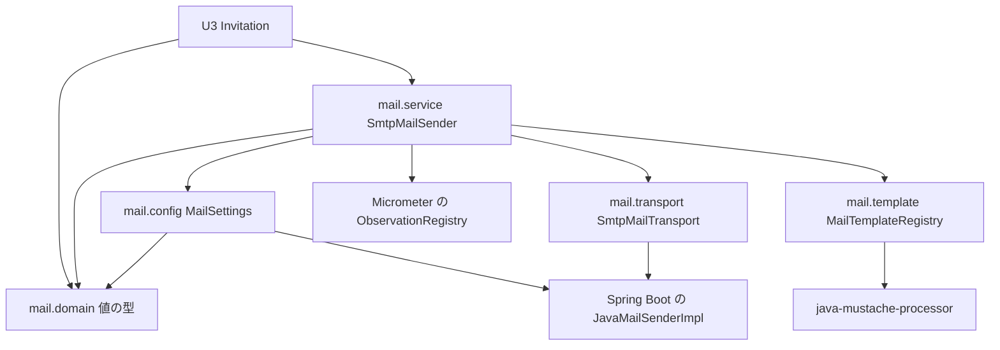

# Logical Components — U1 メールの描画と送信（u1-mail）

U1 の論理の部品（パッケージと役割）、部品の間の境界、失敗の及ぶ範囲を示す。library の単位のため性能・信頼性・観測の設計の文書は作らず、それに当たる設計（NFR5・NFR6・送信の観測）と、テンプレート（NFR8）・テスト（NFR9）・手元の確かめ（NFR11）の設計をこの文書の節に置く。この文書は作りと判断を書き、完成したコードはコード生成で書く。

- 要件: `construction/u1-mail/nfr-requirements/tech-stack-decisions.md`・`security-requirements.md`
- 機能の設計: `construction/u1-mail/functional-design/functional-spec.md`・`rules.md`・`entities.md`
- 答え: `nfr-design-questions.md`（Q1 A: 描画と送信を `mail.template`・`mail.transport` に置く、Q2 B: Observation を1つ作る、まとめの確認は Looks correct）
- セキュリティの設計: `security-design.md`

| 要件の節 | 設計の場所 |
|---|---|
| 部品の構成・境界・U3 との境目 | この文書の1節〜4節 |
| NFR5.1（内部DB に触れない）・NFR6.1〜NFR6.5（時間切れ・1回だけ・ヘルスチェック・描画の性能） | この文書の5節 |
| 送信の観測（Q2 B、BR6.2・BR6.3） | この文書の6節 |
| NFR8.1〜NFR8.3（テンプレートと java-mustache-processor） | この文書の7節 |
| NFR9.1〜NFR9.5（テスト） | この文書の8節 |
| NFR11.1・NFR11.2（手元の確かめ） | この文書の9節 |
| B1 で確かめること（承認の場の R-01・R-02 を含む） | この文書の10節 |
| NFR1.1〜NFR2.9（セキュリティ） | `security-design.md` |

## 1. 部品の一覧

パッケージ `cherry.mastersmith.mail` に次の5つの下位パッケージを置く。`web`・`repository` は作らない（API と内部DB を持たない）。「追跡」は既存の `TraceAspect` が引数と戻り値を TRACE に出す対象かを示す（`security-design.md` の4.2）。

| パッケージ | 部品（Bean の有無） | 役割 | 追跡 | 外から使えるか |
|---|---|---|---|---|
| `mail.service` | `MailSender`（インターフェース、契約 C1）、`SmtpMailSender`（Bean） | 入口。設定の状態を見て、確かめ・描画・送信を順に呼び、結果を返し、ログを1件出し、Observation を1つ作る | 対象（引数は伏せた `MailRequest`、戻り値は種類だけ） | 使える（U3） |
| `mail.domain` | `MailRequest`・`MailSendResult`・`MailFailureKind`・`MailUnexpectedException`（値の型）、`MailRequestValidation`（純粋な関数、Bean でない） | 契約の値の型と、依頼の確かめ（BR3.1〜BR3.4）、宛先の形の決まり（BR3.1。差出人の点検でも使う） | 対象の層だが Bean でないため追跡されない | 使える（U3） |
| `mail.config` | `MastersmithMailProperties`（設定の型）、`MailSettings`（封じた型）、`EncryptionMode`、`MailConfig`（`@Configuration`） | 起動時に1回だけの設定の点検と方式の分類（`security-design.md` の2節） | 対象外（`@Configuration`・`@ConfigurationProperties`・record は除かれている） | 使えない |
| `mail.template` | `MailTemplateCatalog`（一覧、定数）・`MailTemplateDefinition`（一覧の1行）・`MailTemplateRegistry`（Bean）・`RenderedMail`・`RenderedMailInspector`（件名と lang の取り出し） | テンプレートの一覧（BR2.2）、起動時の準備（BR2.3）、描画（BR2.4・BR4.1）、件名と lang（BR4.2・BR4.3） | 対象外（用途名の下位パッケージ、Q1 A） | 使えない |
| `mail.transport` | `SmtpMailTransport`（Bean）・`SendFailureClassifier`（純粋な関数） | メールの組み立て（BR5.1）、1回だけの送信（BR5.2）、失敗の分類（BR5.3） | 対象外（用途名の下位パッケージ、Q1 A） | 使えない |

エンティティ（`entities.md`）の置き場: MailRequest・MailSendResult は `mail.domain`、MailTemplateDefinition・MailTemplate（準備した `Template` として `MailTemplateRegistry` の中に持つ）・RenderedMail は `mail.template`。どれも保存しない値の型である。

## 2. 部品の間のつながり



図の文章による代替: U3 は `mail.service` の `SmtpMailSender` と `mail.domain` の値の型だけを使う。`SmtpMailSender` は `mail.config` の設定の状態、`mail.domain` の確かめ、`mail.template` の描画、`mail.transport` の送信を順に使い、Micrometer の `ObservationRegistry` で送信の観測を作る。`mail.config` は Spring Boot の `JavaMailSenderImpl` を読み、宛先の形の決まりを `mail.domain` から使う。`mail.template` だけが java-mustache-processor を、`mail.transport` と `mail.config` だけが送信の部品を使う。

`send` の順序（`functional-spec.md` の4節のとおり）:

1. `MailSettings` が `Usable` でなければ NOT_CONFIGURED（確かめず・描かず・接続しない）
2. `MailRequestValidation` で確かめる（言語 → templateId → 改行 → 宛先の形 → 差し込みの名前と空の値）
3. `MailTemplateRegistry` で描き、`RenderedMailInspector` で件名と lang を確かめる
4. `SmtpMailTransport` で組み立てて1回だけ送り、失敗を分類する
5. 結果を返し、ログを1件出し、Observation を閉じる

## 3. 境界の検査（ArchUnit）

既存の `DslBoundaryArchitectureTest` と同じ形で `MailBoundaryArchitectureTest`（`backend/src/test/java/cherry/mastersmith/mail/`）を足す。既存の全体の決まり（`ArchitectureTest`）と機能ごとの境界テストは緩めない。

| 決まり | 理由 |
|---|---|
| `mail` はほかの機能（`user`・`auth`・`audit`・`access`・`dsl`・`dslmanage`・`targetdb`・`invitation` など）と、`web`・`repository` の層に依存しない。`common` は使ってよい | `components.md` の Mail の `depends_on` が空。API と内部DB を持たない |
| `mail` の下のパッケージは `mail.service`・`mail.domain`・`mail.config`・`mail.template`・`mail.transport` だけ | 置き場を固定し、追跡の対象の層に内部を置かない（Q1 A） |
| `mail` の外から使えるのは `mail.service` と `mail.domain` だけ | 内部（描いた本文や送信の部品を扱う部品）を外から呼ばせない |
| `mail` の中で `@Transactional` を使わない | NFR5.1、BR5.4 |
| `cherry.mustache` を使うのは `mail.template` だけ。`jakarta.mail`・`org.springframework.mail` を使うのは `mail.transport` と `mail.config` だけ | 外部の部品への依存を1か所に閉じる（`components.md` の Mail の理由） |

## 4. U3 との境目

- U3 は `MailSender` の `isConfigured`・`send` と `mail.domain` の型だけを使い、招待の確定の後にトランザクションの外で呼ぶ（ADR-009）。`isConfigured` の偽を招待を使えない理由（契約 C5 の `SMTP_NOT_CONFIGURED`）に使う。
- 想定外の失敗では `MailUnexpectedException` が投げられ、U3 はそれを捕まえずに既存の 5xx の扱いに任せてよい（文言と原因に秘密を持たない。`security-design.md` の4.3）。
- 招待のテンプレート（`backend/src/main/resources/mail/templates/invitation_ja.html`・`invitation_en.html`）の中身と、`MailTemplateCatalog` の invitation の行（差し込みは `registrationUrl`・`validityHours`）は、U3 の Bolt（B3）で U1 の置き場に足す（BR2.2、契約 C10）。
- U1 の Bolt（B1）では、本番の一覧は空、本番の置き場にファイルは無い状態で始める（空でも起動する）。U1 のテストはテスト用の一覧と置き場（8節）で行う。

## 5. 性能と信頼性（NFR5.1・NFR6.1〜NFR6.5）

### 5.1 内部DB と接続（NFR5.1）

`mail` はトランザクションを持たず内部DB に触れない（3節の境界テスト）。送信の待ちの間に内部DB の接続を持たないことは、U3 がトランザクションの外で呼ぶ順序（ADR-009）で守り、U3 のテストで確かめる。

### 5.2 時間切れと1回だけの送信（NFR6.1〜NFR6.3）

- `application.yaml` の `spring.mail.properties` に、`mail.smtp.connectiontimeout`・`mail.smtp.timeout`・`mail.smtp.writetimeout` と `mail.smtps.*` の同じ3つを `3000`（ミリ秒）で置く。環境変数で上書きでき、不正な値は起動時の点検で「設定がない」にする（`security-design.md` の2.2 の8）。
- `SmtpMailTransport` は `JavaMailSender.send` を1回だけ呼び、自動でやり直さない。全体の上限は持たない。
- 既知の限界（NFR6.3 のとおり）: 応答が時間切れの手前で遅れ続ける受け手では全体が時間切れの値の数倍になりうる。接続先の名前の解決（DNS）の待ちは接続の時間切れの外にある。配備先が決まったら値と限界を見直す。

### 5.3 失敗の分類（BR5.3）

`SendFailureClassifier` は、送信の部品の例外の原因の連なり（`getCause`、Jakarta Mail の `MessagingException.getNextException`、Spring の `MailSendException.getMessageExceptions` をたどる）の型だけで分類する。文言は見ない。Angus Mail は実行時だけの依存のため、コンパイルの時に見える Jakarta Mail の API と Spring の型だけを使う。

| 判定の順 | 連なりの中の型 | 分類 |
|---|---|---|
| 1 | `java.net.SocketTimeoutException`（接続の時間切れを包んだものを含む） | TIMEOUT |
| 2 | Spring の `MailAuthenticationException`、`jakarta.mail.AuthenticationFailedException`、`jakarta.mail.SendFailedException`（受け手の拒否の応答を表す SMTP の例外はこれを継ぐ） | REJECTED |
| 3 | 1・2 に当たらない Spring の `MailSendException`（接続の拒否、TLS の失敗、STARTTLS（必須）を受け付けない、途中で切れる、を含む） | CONNECTION_FAILED |
| 4 | Spring の `MailParseException`・`MailPreparationException`、そのほかの実行時の例外 | 想定外（`MailUnexpectedException` に包んで投げる。`security-design.md` の4.3） |

描く途中の部品の例外（`MustacheException` の仲間）は `mail.template` の中で TEMPLATE_ERROR にする（BR4.4）。表のすべての行は、例外を組み立てた単体テストで確かめ、受け手の側の場合は SubEtha SMTP の結合テストで確かめる（8節）。

### 5.4 ヘルスチェックと起動（NFR6.4）

`application.yaml` に `management.health.mail.enabled: false` を置き、`spring.mail.test-connection` は設定しない。起動のときに SMTP へ接続しない。SMTP の設定が無い・不正でも起動は続ける（数でないポートだけは Spring Boot の結び付けの失敗で止まる、F2 A）。

### 5.5 描画の性能と同時の呼び出し（NFR6.5）

準備した `Template` は `MailTemplateRegistry` の中の変わらない表に持ち、描画は差し込むだけとする。キャッシュは置かない。`MailSettings`・準備したテンプレート・`JavaMailSenderImpl` は動いている間は変えず、依頼ごとの値は呼び出しの中だけで持つため、同時に呼ばれてもよい。

### 5.6 失敗の及ぶ範囲

| 失敗 | 及ぶ範囲 | 戻り方 |
|---|---|---|
| テンプレートの欠け・壊れ・名前の誤り | アプリ全体（起動を止める） | WAR を直して配備し直す（テンプレートは WAR に入るもので、設定の不足と区別する。BR2.3） |
| SMTP の設定が無い・不正 | メールの送信だけ（ほかの機能と起動は続く） | 設定を直して起動し直す。送信は NOT_CONFIGURED |
| SMTP の受け手が止まる・拒む・遅い | その送信の依頼だけ（1件ごとに最長で時間切れの値のあたりで返る） | 呼び出し元（U3）が失敗の種類を記録し、管理者が送り直す |
| U1 の不具合 | その要求だけ（5xx） | `MailUnexpectedException` の型の名前で調べる |

## 6. 送信の観測（Q2 B、BR6.2・BR6.3）

### 6.1 Observation

- `SmtpMailSender` は送信ごとに Micrometer の Observation を1つ作る。名前は `mastersmith.mail.send`。`send` の全体（NOT_CONFIGURED と確かめの失敗を含む）を覆い、HTTP の要求の span の子の span と、時間の指標（件数・合計・最大）の両方になる。このアプリで初めての自前の Observation である。
- 低い基数のタグだけを付ける: `mail.template`（一覧にある templateId、なければ `unknown`）・`mail.language`（`ja`・`en`、そうでなければ `unknown`）・`mail.outcome`（`sent`・`failed`）・`mail.failure.kind`（失敗の種類の小文字、成功は `none`）。高い基数のタグ（宛先・差し込んだ値・件名）は付けない。
- 想定外の失敗だけ `Observation.error` を呼び、包んだ `MailUnexpectedException` を渡す（`security-design.md` の4.3）。FAILED の結果は error にせず、`mail.outcome` と `mail.failure.kind` で表す。
- `ObservationRegistry` はコンストラクター注入で受ける。外部エクスポートは既定で無効のまま（`team.md` の Deployment）。手元では、監視の profile を起動したときに span と指標を見られる。

```java
Observation obs = Observation.createNotStarted("mastersmith.mail.send", registry)
        .lowCardinalityKeyValue("mail.template", knownTemplateOrUnknown(request))
        .lowCardinalityKeyValue("mail.language", knownLanguageOrUnknown(request))
        .start();
try (Observation.Scope scope = obs.openScope()) {
    MailSendResult result = doSend(request);          // 確かめ・描画・送信
    obs.lowCardinalityKeyValue("mail.outcome", outcomeTag(result))
       .lowCardinalityKeyValue("mail.failure.kind", failureKindTag(result));
    return result;
} catch (MailUnexpectedException e) {
    obs.error(e);                                      // 包んだ例外だけ
    throw e;
} finally {
    obs.stop();
}
```

### 6.2 ログ

送信ごとに1件だけ出す（成功は INFO、失敗は WARN）。項目は templateId・language（6.1 と同じく未知は `unknown`）・failureKind・exceptionType で、SLF4J のキーと値で渡す。Observation の範囲の中で出すため、ログのトレースIDとスパンIDは送信の span のものになる。監査ログには書かない（BR6.4）。

## 7. テンプレート（NFR8.1〜NFR8.3）

- **置き場と数え上げ**: `MailTemplateRegistry` は、一覧（`MailTemplateCatalog`）と置き場（本番は `classpath:mail/templates/`）を受け取って作る。置き場の `*.html` を Spring の `ResourcePatternResolver` で数え上げ、名前（`<templateId>_<language>.html`）と一覧を照らし、一覧の templateId ごとに ja・en を UTF-8 で読んで `Mustache.compile`（空の部分テンプレートの解決）で準備する（BR2.1〜BR2.3）。
- **準備の失敗**: 欠け・壊れ・名前の誤り・一覧に無い templateId のファイルは、templateId・language・原因の種類（MISSING・PARSE_ERROR・INVALID_NAME・UNKNOWN_TEMPLATE）だけを持つ例外で Bean の作成を失敗させ、起動を止める。部品の例外の文言は出さない。
- **描画**: 依頼の language のテンプレートだけで描く（BR4.1）。描いた本文から、`RenderedMailInspector` が title 要素の文面（HTML の文字参照は既存の依存 spring-web の `HtmlUtils.htmlUnescape` で戻し、空白と改行を1つにまとめ、前後を除く）と html 要素の `lang` 属性を決まった形で取り出す（BR4.2・BR4.3）。テンプレートは WAR に入る信頼できる入力のため、HTML の解析の部品は足さない。
- **ライセンスヘッダー**: テンプレートの先頭のライセンスヘッダーは Mustache のコメント `{{! ... }}` で書き（BR2.5）、ライセンスヘッダーの検査の対象にバックエンドのメールのテンプレート（`backend/src/main/resources/mail/templates/*.html` とテスト用のテンプレート）を加える（`team.md` の Code Style、B1 の完了の条件）。描いた本文にヘッダーの文面が出ないことは BR2.6 のテストで確かめる。
- **一覧の形**: `MailTemplateCatalog` は変わらない一覧の定数（templateId と差し込みの名前の集合）で、テンプレートを足す単位が行を足す（BR2.2）。
- **java-mustache-processor**: タグ `0.1.0`（コミット `8d44c36`）をサブモジュール `vendor/java-mustache-processor` とルートの `settings.gradle.kts` の `includeBuild` で組む。固定先の更新は承認を得た専用のコミットで行い、更新の前後のハッシュを記録する。中身はこのリポジトリから変えない（NFR8.2）。取り込みの5条件は10節。

## 8. テスト（NFR9.1〜NFR9.5）

| 対象 | テストの形 | 要件 |
|---|---|---|
| 送信の成功（ja・en、宛先・件名・本文・`lang`・Content-Type の text/html と UTF-8） | 結合テスト（`XxxIT`）。JVM の中の SubEtha SMTP 7.2.2 で実際に受ける。宛先は予約されたドメイン | NFR9.1 |
| 送信の失敗（閉じたポート→CONNECTION_FAILED、受け付けて何も返さない `ServerSocket`→TIMEOUT、STARTTLS を受け付けない→CONNECTION_FAILED、認証・宛先の拒否→REJECTED）と、1回だけ接続したこと | 結合テスト。時間切れはテストの設定で短くする | NFR9.2、NFR6.1、NFR6.3 |
| 失敗の分類の表（5.3）のすべての行 | 単体テスト（例外を組み立てる） | BR5.3 |
| メールの必須のテストのうち U1 のもの（エスケープ・描画・ヘッダーへの差し込み・送信の失敗・漏えい） | 単体・結合テスト（`security-design.md` の8節） | NFR9.3 |
| 設定の点検・方式の分類・既定の debug・ヘルスチェックに含まれない・範囲の外のポート・時間切れの不正な値 | 単体・結合テスト | NFR9.4 |
| 依頼の確かめ（改行・宛先の形・空と空白だけの値） | 単体テストと、性質ベースのテスト（jqwik、失敗時の種を記録） | NFR9.3、BR3.x |
| Observation のタグが4つの鍵だけで、値が入らない | 単体テスト。新しいテストの依存を足さず、`ObservationRegistry.create()` に文脈を集める小さな受け手（`ObservationHandler`）を付けて確かめる | Q2 B、BR6.3 |
| 同じ準備済みのテンプレートを複数のスレッドで描いて崩れない | 単体テスト | NFR6.5 |
| 境界の決まり（3節） | `MailBoundaryArchitectureTest` | NFR5.1 |

テスト用のテンプレートと一覧:

- テスト用のテンプレートは本番の置き場と分けて `backend/src/test/resources/mail/test-templates/` に置き、テスト用の一覧とともに `MailTemplateRegistry` を作る。
- Spring を起動する結合テストでは、テストの設定でテスト用の `MailTemplateRegistry` に置き換える。
- 本番の置き場のすべてのテンプレートの検査（BR2.4・BR2.6、`security-design.md` の7節）は、本番の一覧と置き場を数え上げる。B1 の時点で空でも、U3 が足したテンプレートが自動で対象になる。
- テストの自己署名の証明書は `src/test/resources` に置き、テストの設定の中だけで信頼させる（秘密ではない試験用の証明書で、Gitleaks の誤検知になれば理由を書いて除外する）。

カバレッジ: 新しいパッケージ `mail` の5つの下位パッケージは、パッケージごとの下限（行 80%・分岐 70%）の対象で、除外を足さない（NFR9.5）。値は `:backend:cleanTest :backend:cleanIntegrationTest` を付けた `./gradlew verify` で実測して記録する。

## 9. 手元の確かめ（NFR11.1・NFR11.2）

- compose の profile `mail` に Mailpit（`axllent/mailpit:v1.31.2`、ダイジェストで固定）を置き、見たいときだけ起動する。受け手の画面（8025）は `127.0.0.1` だけに公開し、SMTP（1025）はホストに公開しない。
- アプリからは暗号化 NONE・資格情報なしで `SPRING_MAIL_HOST=mailpit`・`SPRING_MAIL_PORT=1025` に送る。`.env.example` と README の見本の接続先は手元の受け手だけにする（実在の宛先・外部の SMTP へ送らない）。
- B1 の完了の条件（`inception/delivery-planning/bolt-plan.md`）は「受け手を compose の profile で起動できる」である。一方 NFR11.1 の確かめ方は「招待のメールが受け手の画面に出ること（B1 の完了の条件）」としているが、B1 の時点では本番の一覧が空で招待のテンプレートが無い。そのため B1 では、profile の起動と、Mailpit を指す設定で `isConfigured` が真になることまでを確かめ、招待のメールを画面で見る確かめは U3 が招待のテンプレートを足す B3 に引き継ぐ。

## 10. B1 で確かめること

| 確かめ | 成り立たないとき | 出典 |
|---|---|---|
| java-mustache-processor の取り込みの5条件: (a) 取り込んだ状態で `./gradlew verify` が通り、依存の取得元が Maven Central だけのまま、(b) 推移依存（`slf4j-api`）が `backend/gradle.lockfile` に載り OSV-Scanner の対象に入る、(c) WAR に core の JAR が入る、(d) CI がサブモジュールを固定先で取得してビルドできる、(e) 部品側のプラグインがアプリの Gradle 9.7.1 で動く | ADR-010 のとおり Maven Central への公開に切り替える判断を B1 で記録する（部品のリポジトリの変更は部品のリポジトリ側で行う） | NFR8.3、ADR-010、承認の場の R-02 |
| 環境変数（例: `SPRING_MAIL_PROPERTIES_MAIL_SMTP_CONNECTIONTIMEOUT`）が `spring.mail.properties` の点を含む鍵へ結び付き、部品に届く | 既定の 3 秒のまま動くことを確かめたうえで、変え方（別の設定の口）を B1 で依頼者に諮る | NFR6.2、承認の場の R-02 |
| 実行可能 WAR の中で `mail/templates/*.html` を数え上げられる（手元で WAR を起動し、テンプレートの数をログの件数などで確かめる） | 数え上げをやめ、一覧からファイル名を組み立てて直接読む形に替える（BR2.3 の「一覧に無いファイル」の検査はテストで行う） | BR2.1〜BR2.3 |
| README に、運用で設定しない値の一覧・方式ごとの書き方・STARTTLS のポート 587・`starttls.enable` だけの設定の平文の危険を書く | B1 を完了としない | NFR2.4、承認の場の R-01 |
| SpotBugs の関門の追加と既存の `PREDICTABLE_RANDOM` の1件の確かめ | 直すか、理由を書いて除外する | NFR2.9 |
| テンプレートのライセンスヘッダーの検査が加わっている（7節） | B1 を完了としない | BR2.5、B1 の完了の条件 |

## 11. 上流との差

機能設計・NFR 要件との差は `security-design.md` の10節にまとめた。この文書に関わるものは次のとおり。

- 描画と送信の内部を用途名の下位パッケージ `mail.template`・`mail.transport` に置く（Q1 A）。機能設計は部品の置き場を決めていなかったため、承認済みの形との食い違いは無い。
- 送信の Observation（`mastersmith.mail.send`）を足す（Q2 B）。BR6.3 の「属性を付けるなら templateId・language・結果の種類だけ」の範囲の中で、付けることにした。
- 想定外の失敗は `MailUnexpectedException` に包む（`security-design.md` の10節の BR5.3 の行）。
- NFR11.1 の確かめ方（招待のメールが受け手の画面に出ることを B1 の完了の条件とする）は、B1 の時点で本番のテンプレートが無いため、B1 では profile の起動と `isConfigured` が真になることまでとし、画面での確かめは B3 に引き継ぐ（9節）。Delivery Planning の B1 の完了の条件（profile で起動できる）とは食い違わない。NFR11.1 との差として、B1 のコード生成の計画で依頼者に確かめる。
