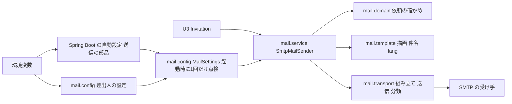

# Security Design — U1 メールの描画と送信（u1-mail）

U1 のセキュリティに関わる非機能の要件（NFR1・NFR2）を、どの部品がどの作りで満たすかを示す。U1 は library の単位で、パッケージ `cherry.mastersmith.mail` として契約 C1（`MailSender` の `isConfigured` と `send`）を提供する。この文書は作りと判断を書き、完成したコードはコード生成で書く（コードの断片は説明のためだけ）。

- 要件: `construction/u1-mail/nfr-requirements/security-requirements.md`（NFR1.1〜NFR2.9）・`tech-stack-decisions.md`（NFR5.1〜NFR11.2）
- 機能の決まり: `construction/u1-mail/functional-design/rules.md`（BR1.1〜BR6.4）
- 答え: `nfr-design-questions.md`（Q1 A・Q2 B、まとめの確認は Looks correct）
- 部品の構成・性能・信頼性・観測・テスト・B1 で確かめること: `logical-components.md`

| 要件の節 | 設計の場所 |
|---|---|
| NFR1.1・NFR1.2（招待のトークンと URL を出さない） | この文書の4節 |
| NFR2.1〜NFR2.4（ログ・部品のログ・`mail.debug`・README の運用の決まり） | この文書の4節・5節 |
| NFR2.5・NFR2.6（設定の受け取りと方式の分類） | この文書の2節 |
| NFR2.7（TLS の確かめ） | この文書の3節 |
| NFR2.8・NFR2.9（ヘッダーへの差し込み・静的解析） | この文書の6節 |
| 本文のエスケープ（BR2.4 と、この段で足す検査） | この文書の7節 |
| NFR5.1・NFR6.1〜NFR6.5（性能と信頼性）・観測（Q2 B） | `logical-components.md` の5節・6節 |
| NFR8.1〜NFR8.3・NFR9.1〜NFR9.5・NFR11.1・NFR11.2 | `logical-components.md` の7節〜9節 |

## 1. 信頼の境界と守りの配置



図の文章による代替: 環境変数から、Spring Boot の自動設定が送信の部品を作り、`mail.config` が差出人の設定を受ける。`mail.config` は起動のときに1回だけ両方を点検して `MailSettings` を作る。U3 は `mail.service` の `SmtpMailSender` だけを呼ぶ。`SmtpMailSender` は `mail.domain` で依頼を確かめ、`mail.template` で描き、`mail.transport` で組み立てて SMTP の受け手へ1回だけ送る。

守りの置き場の考え方:

| 境界 | 入ってくるもの | 守り |
|---|---|---|
| 環境変数から U1 | 接続先・ポート・資格情報・方式・時間切れ・差出人 | 起動時の点検（2節）。値はログに出さず、項目の名前だけを出す |
| U3 から U1 | templateId・language・宛先・差し込む値 | 描く前の確かめ（BR3.1〜BR3.4、`mail.domain` の純粋な関数）。確かめを通らなければ SMTP に接続しない |
| U1 から SMTP | 描いたメール・資格情報 | 方式の分類と TLS の確かめ（3節）、ヘッダーの符号化（6節） |
| U1 からログ・トレース・呼び出し元 | 結果・失敗の種類・例外 | 出してよい項目の限定と、例外の包み方（4節） |

## 2. 設定の受け取りと起動時の点検（NFR2.5・NFR2.6・NFR6.2）

### 2.1 作り

- `mail.config` の `@Configuration` の `@Bean` で `MailSettings` を1回だけ作る。既存の `targetdb/config/TargetDataSourceConfig` が `TargetDbSettings.inspect` を1回だけ呼び、欠け・不正なら項目の名前だけを WARN で1件出す形と同じにする。
- 送信の部品（Spring Boot の自動設定が作る `JavaMailSenderImpl`）は `ObjectProvider<JavaMailSenderImpl>` で「あれば使う」形で受ける。`spring.mail.host` が無ければ部品は作られない（NFR2.5）。
- 差出人と表示名は U1 の設定の型 `MastersmithMailProperties`（接頭辞 `mastersmith.mail`、項目 `from`・`from-name`。Spring Boot の `MailProperties` と名前を分ける）で受ける。設定の型は文字列で受け、`@Validated` を付けない（不正な値でも起動を続け、点検で「設定がない」にするため。BR1.3）。
- U1 は送信の部品の設定を読むだけで書き換えない。読むのは `getHost`・`getPort`・`getProtocol`・`getUsername` と `getPassword` の有無・`getJavaMailProperties` の方式と時間切れの鍵だけとする。

```java
sealed interface MailSettings {
    record NotConfigured() implements MailSettings {}          // 項目が1つも無い（WARN なし）
    record Invalid(List<String> problemItems) implements MailSettings {} // 項目の名前だけ
    record Usable(JavaMailSenderImpl sender, InternetAddress from,
                  EncryptionMode mode) implements MailSettings {} // 資格情報の値は持たない
    static MailSettings inspect(JavaMailSenderImpl senderOrNull, MastersmithMailProperties props) { ... }
}
```

### 2.2 点検の規則

`inspect` は問題をすべて集め、1つでもあれば `Invalid`（問題の項目の名前の一覧）にする。WARN は `@Bean` の中で1件だけ、キー `items` に項目の名前を並べて出す（値は出さない。NFR2.1）。

| 順 | 条件 | 結果・項目の名前 | 出典 |
|---|---|---|---|
| 1 | 送信の部品が無く、差出人も無い | `NotConfigured`（WARN なし） | BR1.2 |
| 2 | 送信の部品が無い（差出人はある）、または接続先が空白だけ | `spring.mail.host` | NFR2.5、BR1.2 |
| 3 | 差出人が無い・形式に合わない（宛先と同じ決まり、BR3.1 の関数を使う）・改行を含む | `mastersmith.mail.from` | BR1.3、BR1.6 |
| 4 | 表示名が改行を含む | `mastersmith.mail.from-name` | BR1.3 |
| 5 | ユーザー名とパスワードの片方だけがある | `spring.mail.username`・`spring.mail.password` のうち無いほう | BR1.3 |
| 6 | ポートが指定され、1〜65535 の外 | `spring.mail.port` | BR1.3、F2 A |
| 7 | `protocol` が `smtp`・`smtps` のどちらでもない | `spring.mail.protocol` | NFR2.6 |
| 8 | 使う方式の時間切れの3つの鍵（`smtps` なら `mail.smtps.*`、それ以外は `mail.smtp.*`）のどれかが1以上の整数でない | 問題の鍵の名前（例: `spring.mail.properties.mail.smtp.timeout`） | NFR6.2 |
| 9 | 資格情報があり、方式の分類（2.3）が NONE | `spring.mail.username`（暗号化なし） | BR1.4、NFR2.6、F5 A |

表示名が無ければ `MasterSmith` とする（BR1.6）。差出人は起動のときに表示名つきの `InternetAddress`（UTF-8 で符号化）に組み立てて `Usable` に持つ。`isConfigured` は `MailSettings` が `Usable` かだけを返し、理由の項目は返さない（BR1.7）。

注: 接続先の無いまま `spring.mail.username` などだけを設定した場合、送信の部品が作られないため U1 からは見えず、差出人も無ければ1の `NotConfigured`（WARN なし）になる。送信はしない（「送らない」は守られる）。

### 2.3 暗号化の方式の分類（NFR2.6）

| 判定の順 | 条件 | 分類 |
|---|---|---|
| 1 | `protocol` が `smtps`、または使う方式の `ssl.enable` が true（`spring.mail.ssl.enabled: true` で入る） | SMTPS（STARTTLS の指定があっても SMTPS） |
| 2 | `mail.smtp.starttls.enable` と `mail.smtp.starttls.required` がどちらも true | STARTTLS（必須） |
| 3 | そのほか（何も無い、`starttls.enable` だけの組を含む） | NONE |

分類は `mail.config` の中の純粋な関数とし、単体テストで表のすべての行を確かめる。

## 3. TLS の確かめ（NFR2.7）

- `application.yaml` の `spring.mail.properties` に、`mail.smtp.ssl.checkserveridentity: true`・`mail.smtp.ssl.protocols: TLSv1.3 TLSv1.2`・`mail.smtps.ssl.checkserveridentity: true`・`mail.smtps.ssl.protocols: TLSv1.3 TLSv1.2` を理由のコメントつきで置く（`spring.mail.ssl.verify-hostname` は STARTTLS に効かないため）。証明書は JVM の既定の信頼できる一覧で確かめ、本番の設定では `spring.mail.ssl.bundle` を使わない。
- STARTTLS（必須）で受け手が STARTTLS を受け付けない・暗号化を確立できないときは、部品の `starttls.required` により平文で続けず、U1 は CONNECTION_FAILED に分類する（分類は `logical-components.md` の5.3）。
- テストの自己署名の証明書は、テストの設定の中だけで信頼させる（`logical-components.md` の8節）。
- TLS を弱める値への U1 の守りは足さない（F3 A）。README の運用の決まり（5節）で扱う。

## 4. 秘密の扱い（NFR1.1・NFR1.2・NFR2.1）

### 4.1 出してよい項目

| 出口 | 出してよい項目 | 作り |
|---|---|---|
| アプリのログ | templateId・language・failureKind・exceptionType（型の名前） | 送信ごとに `SmtpMailSender` が1件だけ出す（成功は INFO、失敗は WARN）。SLF4J のキーと値で渡し、例外の物をロガーに渡さない（スタックトレースと文言を出さない）。BR6.2 |
| 設定の点検のログ | 項目の名前（`items`） | 2.2 |
| テンプレートの準備の失敗 | templateId・language・原因の種類 | 部品の例外の文言を出さない（`logical-components.md` の7節）。BR2.3 |
| 送信の結果（`MailSendResult`） | outcome・failureKind | BR6.1 |
| トレースの属性と指標のタグ | template・language・outcome・failure.kind | Observation（`logical-components.md` の6節）。BR6.3 |
| 呼び出し元への想定外の例外 | 固定の文言と、原因の連なりの型の名前 | 4.3 |

templateId と language は呼び出し元が渡す文字列のため、ログ・タグに出すのは、templateId が一覧にあるとき・language が `ja`・`en` のときだけとし、そうでなければ `unknown` と出す（改行などを含む未知の値をログ・タグに写さないため。指標のタグの種類が増え続けるのも防ぐ）。

### 4.2 メソッドの追跡（TraceAspect）からの守り（Q1 A）

- 既存の `TraceAspect` は、`web`・`service`・`domain`・`repository` の層の Spring の Bean のメソッドの引数と戻り値を、`toString` で TRACE に出す。
- 描画と送信の内部（差し込む値の `Map`・描いた本文・組み立てたメール・送信の部品を受け渡す部品）は、用途名の下位パッケージ `mail.template`・`mail.transport` に置き、追跡の対象の外にする。追跡の対象の層に置くのは、`mail.service` の `MailSender` とその実装、`mail.domain` の値の型と確かめの純粋な関数（Bean ではないため追跡されない）だけとする。`TraceAspect` は変えない（前例は `dsl/parse`・`dslmanage/generate`）。
- `MailSender` の入口で TRACE に出うるのは、引数の `MailRequest`（`toString` は templateId と language だけ、NFR1.2）と、戻り値の `MailSendResult`（outcome と failureKind だけ）と `isConfigured` の真偽で、どれも出してよい値である。
- 二重の守りとして、`RenderedMail` の `toString` も件名と本文を伏せる（templateId と language だけ）。
- `mail.template`・`mail.transport` を外から使わせないことは、境界テスト（`logical-components.md` の3節）で守る。

### 4.3 想定外の例外の包み方

- 分類できない失敗（組み立ての失敗 `MailParseException`・`MailPreparationException` や U1 の不具合、`logical-components.md` の5.3）は、そのまま呼び出し元へ渡さない。既存の `@RestControllerAdvice` が 5xx を ERROR とスタックトレースで出すため、部品の例外の文言（宛先のメールアドレス・SMTP の応答を含みうる）がログに残るからである（`project.md` の Forbidden）。
- U1 は、固定の文言と原因の連なりの型の名前の一覧だけを持つ例外 `MailUnexpectedException`（`mail.domain`、実行時の例外）に包んで投げ、原因の例外そのものは付けない。包んだ地点のスタックトレースは残る。
- 調べるときは、型の名前・時刻・トレースIDで絞る。
- Observation に失敗を記録するときも、包んだ例外だけを渡す（トレースの例外のイベントに部品の文言を載せないため）。

```java
// 原因の文言は持たず、型の名前だけを並べる
throw new MailUnexpectedException(causeTypeNames(e)); // 例: [MailPreparationException, AddressException]
```

### 4.4 toString の伏せ方

| 型 | toString が出すもの | 伏せるもの |
|---|---|---|
| `MailRequest`（`mail.domain`） | templateId・language | 宛先・差し込む値 |
| `MailSendResult`（`mail.domain`） | outcome・failureKind | （もともと持たない） |
| `RenderedMail`（`mail.template`） | templateId・language | 件名・本文 |
| `MailSettings.Usable`（`mail.config`） | 方式の分類・`Usable` であること | 送信の部品・差出人（部品の `toString` に頼らない） |
| `MastersmithMailProperties`（`mail.config`） | 項目の有無 | 差出人・表示名の値 |

## 5. メールの部品のログ・`mail.debug`・README（NFR2.2〜NFR2.4）

- `application.yaml` の `logging.level` で `org.eclipse.angus`・`jakarta.mail` を OFF にする（対象DB のドライバーと同じ置き方。理由と調べ方をコメントに書く）。java-mustache-processor のロガー（`cherry.mustache`）は差し込む値を出さない（出すのは構文の誤りの位置と名前だけ、水準は debug・warn）ため、水準を変えない。
- `spring.mail.properties.mail.debug: false` を明示して置く。環境変数から有効にできる口は残る（Q3 X・F3 A で受け入れた）。既定のセッションが debug でないことを結合テストで確かめる。
- `management.health.mail.enabled: false` を置き、`spring.mail.test-connection` は設定しない（`logical-components.md` の5.4）。
- `application.yaml` に空の既定の `spring.mail.host` を置かない。`.env.example` の SMTP の行はコメントの形で置く（NFR2.5）。
- README の SMTP の設定の説明に、次を書く（NFR2.4、承認の場の R-01）:
  - 運用で設定しない値の一覧（`mail.debug`、`mail.smtp.ssl.trust`・`mail.smtps.ssl.trust`、`checkserveridentity` の false、1.2 より古い TLS、STARTTLS の `required` の false、`spring.mail.test-connection` の true、`management.health.mail.enabled` の true、メールの部品のロガーの水準）
  - 方式ごとの書き方（2.3）と、STARTTLS ではポート 587 を書くこと
  - `starttls.enable` だけの設定では、受け手が STARTTLS を受け付けないとメールが平文で届き、本文の招待の URL（トークン）が守られないこと。配備先が決まったら STARTTLS（必須）か SMTPS を使うこと（R-01。B1 の完了の条件）

## 6. ヘッダーへの差し込みと静的解析（NFR2.8・NFR2.9）

- 宛先と差し込む値の CR・LF は、描く前の確かめ（BR3.2）で INVALID_INPUT にし、接続しない。
- 件名は title の文面の空白と改行を1つの空白にまとめ（BR4.2）、改行を含めない。
- 差出人と表示名の改行は起動時の点検（2.2 の3・4）で「設定がない」にする。
- `mail.transport` は `MimeMessageHelper`（UTF-8）で差出人・宛先・件名を入れ、件名と表示名は部品の符号化（RFC 2047）に任せる。ヘッダーを文字列で直接足す API（`addHeader` など）は使わない。
- SpotBugs の関門（`spotbugsGate`）に `SMTP_HEADER_INJECTION` と `PREDICTABLE_RANDOM` を priority にかかわらず止めるものとして足す。件名を設定する箇所が指摘されたら、上のテストで改行が入らないことを確かめたうえで、理由を書いて `backend/config/spotbugs-exclude.xml` に入れる。既存の `PREDICTABLE_RANDOM` の1件（`auth/repository/LoginAttemptStateRepository`）は、誤検知かを確かめ、誤検知なら理由を書いて外し、そうでなければ直す（B1）。

## 7. 本文のエスケープとテンプレートの検査（BR2.4・BR2.6）

- 差し込みはエスケープされる差し込み（二重の波かっこ）だけで入れ、属性の値は二重引用符で囲む（BR2.4）。部品の `{{ }}` は `&`・`<`・`>`・`"` の4文字だけを置き換えるため。
- テンプレートの検査（テスト。置き場のすべてのテンプレートを数え上げる）で、次の書き方が無いことを確かめる:
  - 三重の波かっこ `{{{`・アンパサンドの差し込み `{{&`（BR2.4）
  - **部分テンプレート `{{>`（この段で足す）**: テンプレートは空の部分テンプレートの解決で準備するため、書くと黙って空になる
  - **区切りの変更 `{{=`（この段で足す）**: 区切りを変えると、三重の波かっこの検査をすり抜けてエスケープしない差し込みを書けるため
- 差し込みの名前と一覧の一致は、BR2.6 のとおりテストで確かめる。部品の公開の API は構文木を出さないため、起動時には確かめない。
- 5つの文字（`<`・`>`・`&`・`"`・`'`）を含む値の描画の確かめは BR2.4 の (1)・(2) のとおり。

## 8. セキュリティのテストの対応

| 確かめ | テストの形 | 要件 |
|---|---|---|
| 送信の成功と失敗のそれぞれで、差し込んだ値・宛先・資格情報・SMTP の応答がアプリのログに出ない | 結合テスト（既存の `*SecretLeakIT` と同じ形） | NFR1.1、NFR2.1 |
| `MailRequest`・`RenderedMail` の `toString` に宛先・差し込む値・件名・本文が出ない | 単体テスト | NFR1.2 |
| TRACE の水準で送信しても、TRACE のログに差し込んだ値・本文が出ない | 結合テスト（テストの設定でロガーを TRACE にする） | NFR1.1、Q1 A |
| Observation の属性が4つの鍵だけで、未知の templateId・language は `unknown` になる | 単体テスト（`logical-components.md` の6節） | BR6.3、Q2 B |
| 想定外の失敗で、呼び出し元に渡る例外の文言と原因に宛先・部品の文言が無い | 単体テスト | NFR2.1、4.3 |
| 設定の点検の表（2.2）のすべての行と、WARN に値が出ないこと | 単体テストと結合テスト | NFR2.5、NFR2.6、NFR6.2 |
| 方式の分類の表（2.3）のすべての行 | 単体テスト | NFR2.6 |
| 部品のロガーの名前のログが出ない、既定のセッションが debug でない | 結合テスト | NFR2.2、NFR2.3 |
| STARTTLS を受け付けない受け手で CONNECTION_FAILED・0通、名前の一致しない証明書で CONNECTION_FAILED、STARTTLS・SMTPS で送れる | 結合テスト（SubEtha SMTP） | NFR2.7 |
| 改行を含む宛先・差し込む値・title でヘッダーが増えない | 結合テスト | NFR2.8 |
| 三重の波かっこ・`{{&`・`{{>`・`{{=` が置き場のテンプレートに無い | 単体テスト（数え上げ） | BR2.4、7節 |

## 9. 残る危険

| 危険 | 扱い |
|---|---|
| `spring.mail.properties.*` の口から `mail.debug` や TLS を弱める値を入れられる | Q3 X・F3 A で受け入れた。README の運用の決まり（5節）と、既定の値のテスト |
| `starttls.enable` だけの設定（資格情報なし）で、メールが平文で届きうる | F5 A で受け入れた。README に書くことを B1 の完了の条件にする（R-01） |
| 想定外の例外で原因の文言を捨てるため、調べるときの手がかりが減る | 型の名前・時刻・トレースIDで絞る（4.3） |
| 部品のロガーを環境変数で OFF から上げられる | README の運用の決まり |
| Jakarta Mail・Angus Mail・SubEtha SMTP・java-mustache-processor の推移依存の脆弱性 | OSV-Scanner の関門と Dependabot |

## 10. 上流との差

承認済みの文書は書き換えず、差をここに記録する（`aidlc/spaces/default/memory/project.md` の決まり）。NFR 要件の段で記録した機能設計との差（BR1.1〜BR1.5・BR1.8、ヘルスチェック）は `security-requirements.md` の5節のとおりで、この段では次を足す。

| 対象 | 承認済みの形 | この段の設計 | 理由 |
|---|---|---|---|
| BR2.4（テンプレートの検査） | 三重の波かっこ・`{{&` を書かないことをテストで確かめる | 加えて、部分テンプレート `{{>` と区切りの変更 `{{=` を書かないことも確かめる | 区切りの変更で検査をすり抜けうる。部分テンプレートは黙って空になる。BR2.4 の趣旨を強める追加 |
| BR5.3（想定外の失敗は例外） | 想定外の失敗は例外で呼び出し元に伝える | 原因の例外を付けず、固定の文言と原因の型の名前だけを持つ `MailUnexpectedException` に包んで投げる | 5xx の ERROR ログに部品の文言（宛先・SMTP の応答）が残るのを防ぐ（`project.md` の Forbidden） |
| BR6.2・BR6.3（ログとトレースの属性の templateId・language） | templateId・language を出す | 一覧にある templateId と `ja`・`en` だけをそのまま出し、そうでなければ `unknown` と出す | 呼び出し元が渡す未知の文字列をログ・タグに写さない |
| NFR 設計の質問ファイルの要点 8 | 受け手の拒否は「SMTP の応答の番号を持つ Jakarta Mail の例外」 | Jakarta Mail の API の型（`SendFailedException`・`AuthenticationFailedException`）と Spring の `MailAuthenticationException` で分類する（`logical-components.md` の5.3） | Angus Mail は実行時だけの依存で、コンパイルの時に SMTP の例外の型を使えないため |
| NFR 設計の質問ファイルの Q2 B | 属性に値が入らないことを `TestObservationRegistry` で確かめる | 新しいテストの依存を足さず、テストで `ObservationRegistry` に文脈を集める小さな受け手を付けて確かめる（`logical-components.md` の6節） | `micrometer-observation-test` は今の lockfile に無い。同じことを依存を足さずに確かめられる |

契約 C1 の形（`isConfigured` と `send`、`MailSendResult` の種類）は変わらない。U3 の変更は要らない。
