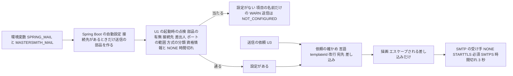

# Security Requirements — U1 メールの描画と送信（u1-mail）

U1 が受け持つ非機能の要件のうち、セキュリティに関わるもの（NFR1・NFR2）を、確かめられる形に分けて示す。

- 機能の決まり: `construction/u1-mail/functional-design/rules.md`（BR1.1〜BR6.4）
- 選定・数値・性能と信頼性に当たる要件（NFR5・NFR6・NFR8・NFR9・NFR11）: `tech-stack-decisions.md`
- 答え: `nfr-requirements-questions.md`（Q1 A・Q2 B・Q3 X・Q4 A・F1 B・F2 A・F3 A・F4 A・F5 A、まとめの確認は Looks correct）
- 枝番は、この単位の中で要件の NFR ごとに .1 から振る

U1 は library の単位で、アプリの中の部品（パッケージ `mail`）として契約 C1（`MailSender` の `isConfigured` と `send`）を提供する。SMTP の送信の部品は Spring Boot のメールの自動設定（`spring-boot-starter-mail`）が作り、U1 はそれを受け取って使う（Q3 X）。

## 1. 守るものと脅威

守るもの: 招待のトークンと招待の URL（差し込む値）、宛先のメールアドレス、SMTP の資格情報、SMTP の応答の文面。

| 脅威（STRIDE） | 例 | 主な対策 |
|---|---|---|
| 情報の漏えい（I） | 差し込んだ値（招待の URL）や宛先が、アプリのログ・メソッドの追跡の TRACE・トレースの属性・送信の結果に出る | NFR1.1、NFR1.2、NFR2.1 |
| 情報の漏えい（I） | メールの部品の詳しいログやデバッグ出力に、宛先・SMTP の応答・認証のやり取りが出る | NFR2.2、NFR2.3 |
| 情報の漏えい・なりすまし（I・S） | 資格情報が暗号化の無い経路で流れる。偽の受け手（証明書の確かめの抜け）に資格情報を渡す | NFR2.5、NFR2.6、NFR2.7 |
| 改ざん（T） | 宛先・件名・差し込む値の改行でメールのヘッダーを増やす（ヘッダーへの差し込み） | NFR2.8 |
| 情報の漏えい（I） | 秘密情報を含む設定のファイルがコミットされる。設定の口から守りを弱める値が入る | NFR2.4、NFR2.5 |
| 推測（I） | 予測できる乱数の使い方の見落とし | NFR2.9 |

## 2. 要件

### 2.1 招待のトークンと URL（NFR1）

| ID | 要件 | 確かめ方 | 出典 |
|---|---|---|---|
| NFR1.1 | U1 のアプリのログ・送信の結果（`MailSendResult`）・トレースの属性に、差し込んだ値（招待の URL とその中のトークンを含む）・件名・本文を入れない。ログは templateId・language・失敗の種類・例外の型の名前だけ、結果は outcome と failureKind だけ、トレースの属性は templateId・language・結果の種類だけとする | 結合テスト: 既存の `*SecretLeakIT` と同じ形で、送信の成功と失敗（拒む・応答しない・拒否の応答・入力の誤り）それぞれで、差し込んだ値の文字列がアプリのログに現れないこと | NFR1、BR6.1〜BR6.3 |
| NFR1.2 | `MailRequest` の `toString` は、宛先と差し込む値を伏せ、templateId と language だけを出す。既存のメソッドの追跡（`TraceAspect`）は `service` などのパッケージのメソッドの引数を TRACE で出し、`MailSender` は `cherry.mastersmith.mail.service` に置くため（既存の `LoginRequest`・`TokenResponse` と同じ形） | 単体テスト: `toString` に宛先・差し込む値が含まれないこと | NFR1、NFR2 |

### 2.2 個人情報・メールの部品・SMTP の設定（NFR2）

| ID | 要件 | 確かめ方 | 出典 |
|---|---|---|---|
| NFR2.1 | 宛先と差出人のメールアドレス・SMTP の応答の文面・メールの部品の例外のメッセージ・資格情報を、U1 のログと送信の結果に入れない。設定の点検の WARN は、問題のある項目の名前だけを出し、値（接続先・差出人・資格情報・時間切れの値・ポート）を出さない | 結合テスト: 送信の失敗のそれぞれと、設定の不正のそれぞれで、宛先・資格情報・SMTP の応答の文面がログに現れないこと | NFR2、BR1.3、BR6.1、BR6.2 |
| NFR2.2 | メールの部品のロガー（`org.eclipse.angus`・`jakarta.mail`）を `application.yaml` の `logging.level` で OFF に固定する（対象DB の3つのドライバーのログを OFF にした既存の形と同じ）。部品の詳しいログは宛先や SMTP の応答を出しうるため | 結合テスト: 送信の後に、部品のロガーの名前のログが出ていないこと | NFR2 |
| NFR2.3 | メールの部品のデバッグ出力（`mail.debug`）は既定で無効とし、`application.yaml` の `spring.mail.properties` に `mail.debug: false` を明示して置く。環境変数（`SPRING_MAIL_PROPERTIES_MAIL_DEBUG`）から有効にできる口が残ることは受け入れ（Q3 X）、運用で有効にしない（NFR2.4）。U1 は有効にされたときの守りを足さない（F3 A） | 結合テスト: 既定の設定で作った送信の部品のメールのセッションが debug でないこと | NFR2、BR1.8（差は5節）、`project.md` の Forbidden |
| NFR2.4 | README の SMTP の設定の説明に、運用で設定しない値の一覧を書く: `spring.mail.properties` の `mail.debug`（true にしない）、`mail.smtp.ssl.trust`・`mail.smtps.ssl.trust`（証明書を無条件に信じる指定をしない）、`mail.smtp.ssl.checkserveridentity`・`mail.smtps.ssl.checkserveridentity`（false にしない）、`mail.smtp.ssl.protocols`・`mail.smtps.ssl.protocols`（1.2 より古い TLS を足さない）、`mail.smtp.starttls.required`（STARTTLS で false にしない）、`spring.mail.test-connection`（true にしない）、`management.health.mail.enabled`（true にしない）、メールの部品のロガーの水準（`LOGGING_LEVEL_ORG_ECLIPSE_ANGUS` など。OFF のまま）。あわせて暗号化の方式ごとの書き方（NFR2.6）と、STARTTLS ではポート 587 を書くことを載せる | コード生成の点検: README に一覧と書き方があること | NFR2、F3 A |
| NFR2.5 | SMTP の接続先・ポート・資格情報・暗号化の方式は、Spring Boot の `spring.mail.*` を環境変数（`SPRING_MAIL_HOST`・`SPRING_MAIL_PORT`・`SPRING_MAIL_USERNAME`・`SPRING_MAIL_PASSWORD`・`SPRING_MAIL_PROTOCOL`・`SPRING_MAIL_SSL_ENABLED`・`SPRING_MAIL_PROPERTIES_MAIL_SMTP_STARTTLS_ENABLE`・`SPRING_MAIL_PROPERTIES_MAIL_SMTP_STARTTLS_REQUIRED`）だけから受け取る。差出人と表示名は `MailProperties` に項目が無いため U1 の `mastersmith.mail.from`・`mastersmith.mail.from-name`（`MASTERSMITH_MAIL_FROM`・`MASTERSMITH_MAIL_FROM_NAME`）とする。資格情報をソース・`application.yaml`・コミットするファイルに書かない。`application.yaml` に空の既定の `spring.mail.host` を置かない（空の文字列でも自動設定が送信の部品を作るため）。`.env.example` の SMTP の行は、値を空にした行ではなくコメントの形で置く（空の `SPRING_MAIL_HOST=` を写すと送信の部品が作られるため） | コード生成の点検と Gitleaks。結合テスト: `SPRING_MAIL_HOST` が無いときと空白だけのときに NOT_CONFIGURED で SMTP に接続しないこと | NFR2、BR1.1・BR1.2、`project.md` の Mandated・Forbidden |
| NFR2.6 | 暗号化の方式は Spring Boot の項目だけで指定し（F1 B）、U1 が起動のときに送信の部品の `protocol` と部品の設定（`getJavaMailProperties`）を読んで分類する。(a) `protocol` が `smtps`、または使う方式の `ssl.enable` が true（`spring.mail.ssl.enabled: true` で入る）なら SMTPS（STARTTLS の指定があっても SMTPS）。(b) そうでなく `mail.smtp.starttls.enable` と `mail.smtp.starttls.required` がどちらも true なら STARTTLS（必須）。(c) そのほか（何も指定しない、`starttls.enable` が true で `required` が true でない組を含む（F5 A））は NONE。資格情報（ユーザー名とパスワード）があり分類が NONE なら、項目の名前だけの WARN を1件出して「設定がない」とする（BR1.4、資格情報を暗号化の無い経路に流さない）。`protocol` が `smtp`・`smtps` のどちらでもなければ、項目の名前だけの WARN で「設定がない」とする | 単体テスト（分類）: 何も無い→NONE、STARTTLS の2つ→STARTTLS、`starttls.enable` だけ→NONE、`protocol` が `smtps`→SMTPS、`ssl.enabled`→SMTPS、SMTPS と STARTTLS の両方→SMTPS、知らない `protocol`→設定がない。結合テスト: 資格情報と NONE の組（`starttls.enable` だけの組を含む）で NOT_CONFIGURED になり接続しないこと | NFR2、BR1.4・BR1.5（差は5節）、F1 B、F5 A |
| NFR2.7 | STARTTLS と SMTPS では、JVM の既定の信頼できる証明書の一覧で受け手の証明書を確かめ、接続先の名前の一致を確かめ、TLS は 1.2 以上とする。`spring.mail.ssl.verify-hostname` は STARTTLS に効かないため、`application.yaml` の `spring.mail.properties` に `mail.smtp.ssl.checkserveridentity: true`・`mail.smtp.ssl.protocols: TLSv1.3 TLSv1.2`・`mail.smtps.ssl.checkserveridentity: true`・`mail.smtps.ssl.protocols: TLSv1.3 TLSv1.2` を置く。本番の設定では `spring.mail.ssl.bundle` を使わない。STARTTLS（必須）で受け手が STARTTLS を受け付けない・暗号化を確立できないときは、部品の `starttls.required` により平文で続けず CONNECTION_FAILED とする | 結合テスト（SubEtha SMTP）: STARTTLS を受け付けない受け手で CONNECTION_FAILED になりメールが0通であること、STARTTLS と SMTPS の受け手（テストの自己署名の証明書をテストの設定の中だけで信頼させる）で送れること、名前の一致しない証明書の受け手で CONNECTION_FAILED になること | NFR2、BR1.5、Q3 X |
| NFR2.8 | ヘッダーへの差し込みを防ぐ。宛先・差し込む値に CR・LF があれば描かず・接続せずに INVALID_INPUT とし（BR3.2）、件名は title の文面の空白と改行を1つの空白にまとめて改行を含めない（BR4.2）。件名と差出人の表示名はヘッダーの規格どおりに符号化する（BR5.1）。SpotBugs の関門（`spotbugsGate`）で `SMTP_HEADER_INJECTION` を priority にかかわらず止める。件名を設定する箇所が指摘された場合は、改行が入らないことを上のテストで確かめたうえで、誤検知として理由を書いて `backend/config/spotbugs-exclude.xml` に入れる | 結合テスト: 宛先・件名に効く差し込む値・title に改行を含めても、受け手のメールのヘッダーが増えず、INVALID_INPUT またはまとめた件名になること。`./gradlew verify` の SpotBugs の関門 | NFR2、BR3.2・BR4.2・BR5.1、AC3.1.7、`team.md` の Code Style |
| NFR2.9 | SpotBugs の関門に `PREDICTABLE_RANDOM` を priority にかかわらず止めるものとして足し、既存の1件（`auth/repository/LoginAttemptStateRepository`）が誤検知かを確かめ、誤検知なら除外の設定に理由を書いて外し、そうでなければ直す | `./gradlew verify` の SpotBugs の関門と、確かめの結果の記録（コード生成） | `team.md` の Code Style、B1 の完了の条件 |

### 2.3 本文のエスケープ（NFR2 の一部）

利用者の値を HTML としてエスケープしない差し込みで入れないこと（`project.md` の Forbidden）は、機能設計の BR2.4（エスケープされる差し込みだけ、属性は二重引用符）と、その確かめのテストで満たす。java-mustache-processor の `{{ }}` は `&`・`<`・`>`・`"` の4文字だけを置き換え `'` を置き換えないため、属性の値は二重引用符で囲む。この段で新しく足す要件は無い。

## 3. 送信の流れと信頼の境界

図の文章による代替: 環境変数から Spring Boot の自動設定が送信の部品を作る（接続先があるときだけ）。U1 は起動のときに、部品の有無・接続先・差出人・ポートの範囲・暗号化の方式の分類・資格情報と NONE の組・時間切れの値を点検し、当たれば「設定がない」として項目の名前だけの WARN を出し、送信はいつも NOT_CONFIGURED にする。通れば「設定がある」とし、U3 の依頼を確かめ、エスケープされる差し込みだけで描き、決めた方式と時間切れで SMTP の受け手へ1回だけ送る。U1 のログ・結果・トレースの属性には、どの段でも宛先・差し込んだ値・資格情報・SMTP の応答を出さない。

## 4. 残る危険

| 危険 | 扱い |
|---|---|
| `spring.mail.properties.*` の口から、環境変数で `mail.debug` を有効にされる、または証明書の確かめ・STARTTLS の必須を弱められる | Q3 X・F3 A で受け入れた。U1 の守りは足さず、README の運用の決まり（NFR2.4）で扱う。既定が安全な値であることはテストで確かめる（NFR2.3、NFR2.7） |
| `starttls.enable` だけの設定（資格情報なし）では、受け手が STARTTLS を受け付けないとメールが平文で届く | F5 A で受け入れた。資格情報は流さない（NFR2.6）。本文には招待の URL（トークン）が入るため、配備先が決まったら STARTTLS（必須）か SMTPS を使うことを README に書く |
| メールの部品のロガーを環境変数（`LOGGING_LEVEL_...`）で OFF から上げられる | 対象DB のドライバーと同じ扱い。README の運用の決まり（NFR2.4）で扱う |
| Jakarta Mail・Angus Mail・SubEtha SMTP の脆弱性 | OSV-Scanner の関門（High 以上で止める）と Dependabot で見張る（`tech-stack-decisions.md`） |
| 実在の宛先・外部の SMTP への送信 | 配備先が決まるまで送らない（`project.md` の Forbidden、NFR11.2）。テストは JVM の中の受け手だけに送る |

## 5. 上流との差

Q2 B・Q3 X・F1 B・F2 A・F3 A・F5 A の答えにより、承認済みの U1 の機能設計（`construction/u1-mail/functional-design/rules.md`）と次の点が違う。承認済みの文書は書き換えず、ここに差を記録する（`aidlc/spaces/default/memory/project.md` の決まり）。

| 決まり | 承認済みの機能設計 | この段の決定 | 答え |
|---|---|---|---|
| BR1.1 設定の名前と読み方 | SMTP の設定（接続先・ポート・暗号化・資格情報・差出人・表示名）を環境変数だけから U1 が受け取り、ほかの口を作らない | 「環境変数だけから受け取る」は保つ。接続先・ポート・資格情報・暗号化の方式は Spring Boot の `spring.mail.*` を Spring Boot が読んで送信の部品を作り、U1 はそれを受け取って読む。差出人と表示名だけが U1 の `mastersmith.mail.*`。`spring.mail.properties.*` から部品の任意の設定を受ける口ができる | Q3 X |
| BR1.2 「設定がある」の意味 | 接続先と差出人のメールアドレスがそろう | 「接続先がある」を「送信の部品が作られ、接続先が空白だけでない」と読む | Q3 X |
| BR1.3 不正な値 | ポートが 1〜65535 の数でない・暗号化が3つのどれでもない、などは項目の名前だけの WARN で「設定がない」とし、起動を続ける | 時間切れの値（使う方式の3つ）を点検の項目に足す。「暗号化が3つのどれでもない」は「`protocol` が `smtp`・`smtps` のどちらでもない」に読み替える。範囲の外のポートは BR1.3 のとおりだが、数でないポートは Spring Boot の設定の結び付けの失敗で起動が止まる（「起動を続ける」と違う） | Q2 B、F1 B、F2 A |
| BR1.4 資格情報と暗号化なし | 資格情報があり暗号化の項目が NONE なら「設定がない」 | 決まりは保つが、NONE は1つの項目の値ではなく、U1 が部品の設定から分類した結果（NFR2.6）で判定する。`starttls.enable` が true で `required` が true でない組も NONE に分類する | F1 B、F5 A |
| BR1.5 暗号化の方式とポートの既定 | 1つの項目（NONE・STARTTLS（必須）・SMTPS、既定 NONE）で指定し、ポートを省いたら 25・587・465 | 方式は Spring Boot の項目の組み合わせで指定する（NONE は指定なし、STARTTLS（必須）は `mail.smtp.starttls.enable` と `mail.smtp.starttls.required` を true、SMTPS は `protocol: smtps` か `ssl.enabled: true`）。既定は NONE のまま。ポートを省いたときは部品の既定で、NONE・STARTTLS は 25、SMTPS は 465 になり、STARTTLS の 587 の既定は無くなる（README に「STARTTLS ではポート 587 を書く」と載せる）。平文で続けないことは `starttls.required: true` で部品が守る | F1 B |
| BR1.8 `mail.debug` | 常に無効とし、有効にする口を作らない | 既定で無効（明示）・運用で有効にしない（README）・既定が無効であることをテストで確かめる。環境変数から有効にできる口が残る。TLS を弱める値も同じく U1 は守らず README で扱う | Q3 X、F3 A |
| （機能設計に無い） | — | `management.health.mail.enabled: false` で SMTP をヘルスチェックから外す（`tech-stack-decisions.md` の NFR6.4） | Q3 X |

契約 C1（`MailSender` の形）と、BR1.6・BR1.7・BR2.x〜BR6.x は変わらない。U3（呼び出し元）の変更は要らない。
