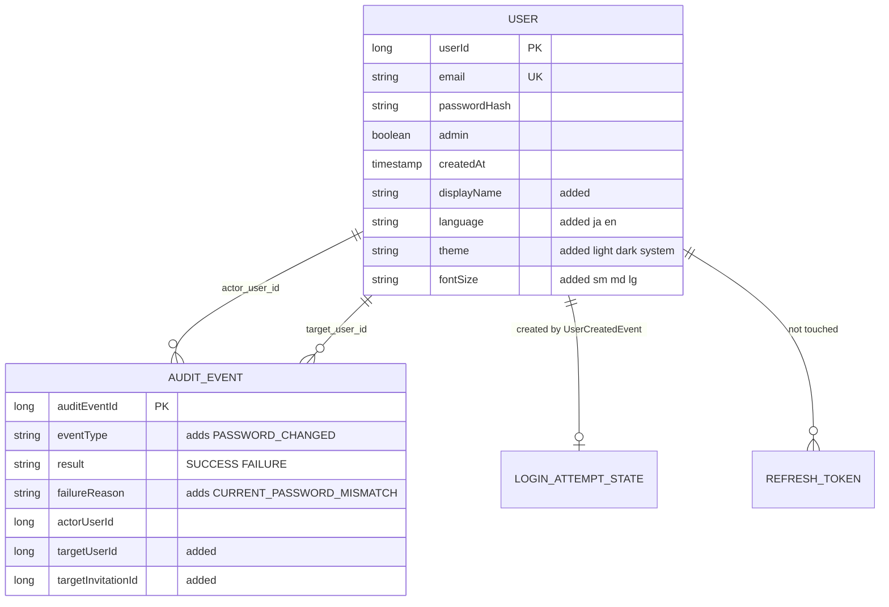

# Functional Spec — U2 利用者のプリファレンスとパスワードの変更（u2-user-preferences）

この文書は、U2 の手順（流れ）と状態の移り変わりの正本である。データの形は `entities.md`、判定の決まりは `rules.md` の YAML が正本で、4節の図と5節の要約はそこから導いた読みやすさのための写しである。出典は `rules.md` の冒頭の略号のとおり。

## 1. 状態の移り変わり

### 1.1 利用者の氏名と表示の設定

利用者の行は、この単位では「作成」と「プリファレンスの置き換え」と「パスワードの置き換え」の3つでだけ変わる。削除・無効化の状態は持たない（招待中は U3 の Invitation の状態で、利用者の行はまだ無い）。

| 今の状態 | きっかけ | 次の状態 | 決まり |
|---|---|---|---|
| （行が無い） | V7 の前に作られていた利用者に V7 を当てる | 氏名＝メールアドレス・ja・system・md | BR9.1・BR2.2 |
| （行が無い） | 初期管理者の自動作成 | 氏名＝メールアドレス・ja・system・md、admin true | BR5.4 |
| （行が無い） | U3 の登録の完了からの作成（Created） | 招待された人が選んだ氏名・言語・テーマ・文字の大きさ、admin false | BR5.1〜BR5.3 |
| （行が無い） | 登録済みのメールアドレスでの作成 | （行は増えない、EmailAlreadyUsed） | BR5.2 |
| 氏名 N・言語 L・テーマ T・文字 F | プリファレンスの保存（検証を通る） | 保存した N'・L'・T'・F'（同じ値でも成功） | BR3.2・BR3.3 |
| 氏名 N・言語 L・テーマ T・文字 F | プリファレンスの保存（誤りが1つ以上） | 変わらない（4つとも） | BR3.2 |

### 1.2 パスワード

| 今の状態 | きっかけ | 次の状態 | 監査 | 決まり |
|---|---|---|---|---|
| ハッシュ H | 変更の要求（入力の誤り） | H のまま | 残さない | BR4.1 |
| ハッシュ H | 変更の要求（今のパスワードの誤り） | H のまま | PASSWORD_CHANGED・FAILURE・CURRENT_PASSWORD_MISMATCH | BR4.2・BR7.2 |
| ハッシュ H | 変更の要求（一致、新しいパスワードが今と同じでも） | 新しいハッシュ H' | PASSWORD_CHANGED・SUCCESS | BR4.3・BR4.4・BR7.2 |

どの行でも、リフレッシュトークン・アクセストークン・ロックの状態は変わらない（BR4.5）。

## 2. 手順

### 2.1 プリファレンスの取得（GET /api/me/preferences、C4）

1. 既存のアクセストークンの認証を通る。無い・無効なら 401 AUTHENTICATION_REQUIRED（BR8.1）。
2. 認証された本人の利用者 ID で利用者を内部DB から読む。読めなければ 401 AUTHENTICATION_REQUIRED（BR3.1）。
3. displayName・language・theme・fontSize を保存された値のまま 200 で返す（theme は system のまま。email・admin は含めない）。

### 2.2 プリファレンスの保存（PUT /api/me/preferences、C4）

1. 認証（2.1 の 1 と同じ）。
2. 本文の4つを受け取る。氏名は前後の空白を除いてから判定する（BR1.1）。
3. 4つすべてを検証し、誤りの項目をすべて集める（氏名は BR1.2〜BR1.4、言語・テーマ・文字の大きさは BR2.1）。
4. 誤りが1つ以上なら、項目ごとの誤り（項目の名前と理由。入れた値は返さない）を付けて 400 VALIDATION_FAILED で返す。内部DB は変えない（BR3.2・BR8.4）。
5. 1つのトランザクションで、本人の行の4つの列だけを置き換える（BR3.3・BR3.4）。本人の行が無ければ 401 AUTHENTICATION_REQUIRED。
6. 確定の後、保存した4つを 200 で返す。監査の出来事は出さない（BR3.5）。

同時の保存は待ち合わせず、後に確定した方が残る。同時のパスワードの変更とは別の列を書くため、どちらの結果も残る（BR3.4）。

### 2.3 パスワードの変更（POST /api/me/password、C4、ADR-004）

1. 認証（2.1 の 1 と同じ）。
2. 入力の検証（BR4.1）: currentPassword が有る、newPassword が PasswordPolicy の作成時の規則に合う、newPasswordConfirmation が newPassword と完全に一致する。誤りの項目をすべて集め、1つ以上なら 400 VALIDATION_FAILED で返す。照合はせず、監査も残さない。
3. 本人の保存されたハッシュを読み、currentPassword と照合する（BR4.2）。currentPassword が UTF-8 で 72 バイトを超えるときは照合の仕組みに渡さず不一致とする。本人の行が無ければ 401 AUTHENTICATION_REQUIRED。
4. 不一致なら 400 PASSWORD_CURRENT_MISMATCH で返し、PasswordChangedEvent（FAILURE・CURRENT_PASSWORD_MISMATCH）を出す。何も書かないため、監査はその場で記録される（BR7.3）。トークンとログインの状態は変えない（BR4.5）。
5. 一致なら、newPassword をハッシュにし、1つのトランザクションで本人の passwordHash だけを書き換え、PasswordChangedEvent（SUCCESS）を出す（BR4.3・BR3.4）。新しいパスワードが今と同じかは確かめない（BR4.4）。
6. 確定の後に監査が記録される（BR7.3）。応答は 204。トークンは変えない（BR4.5）。

監査の書き込みが失敗しても、4・6 の応答は変わらない（BR7.3）。今のパスワードの誤りの回数の制限は持たない（NFR 要件の段で決める、BR4.5）。

### 2.4 利用者の作成（createUser、C2）

呼び出し元は U3 の登録の完了（招待の使用済みの記録と同じトランザクション）と、初期管理者の自動作成。

1. 呼び出し元が、同じ DisplayName の関数（BR1.6）・BR2.1・PasswordPolicy で入力を検証し、誤りを利用者に返す（U2 の作成の操作はこの検証の代わりにしない）。
2. 作成の操作は受け取った値を同じ決まりで確かめ、合わなければ作らずに想定外の誤りとする（BR5.1）。
3. メールアドレスをそろえ、その利用者がすでにいれば EmailAlreadyUsed を返す（BR5.2）。
4. 呼び出し元のトランザクションに参加し（無ければ新しく始め）、利用者を保存する。氏名は前後の空白を除いた値、パスワードはハッシュ（BR5.3）。
5. 一意の制約に当たったとき（同時の作成）も EmailAlreadyUsed を返す（BR5.2）。
6. 同じトランザクションで UserCreatedEvent を知らせ、Created（userId）を返す（BR5.3）。
7. 初期管理者の自動作成は、admin true・氏名＝そろえたメールアドレス・ja・system・md で 2〜6 を通る（BR5.4）。既存の決まり（すでにいれば作らない、パスワードをログに出さない）は変えない。

### 2.5 ログインとトークンの更新の応答の広げ（C3）

1. 既存のログイン（POST /api/auth/login）と更新（POST /api/auth/session/refresh）の判定・トークンの発行は変えない。
2. 成功の応答の user を作るとき、利用者の要約（UserSummary）から displayName・language・theme・fontSize を、既存の email・admin と並べて載せる（BR6.1）。値は応答を作る時点の内部DB の値。
3. 画面（U4）はこの値で表示の設定を当て、氏名をユーザーメニューに出し、以降の要求の Accept-Language に言語を入れる（ADR-005、BR8.3）。

### 2.6 スキーマの変更 V7 の方針（NFR10）

1. 利用者の表に displayName・language・theme・fontSize を足す。language・theme・fontSize は既定の値 ja・system・md を持たせ、既存の行にもその値が入る（BR9.1）。
2. displayName は空を許す形で足し、既存の行に保存済みのメールアドレスを入れてから、必須にする（BR9.1・BR2.2）。
3. 監査の表に targetUserId・targetInvitationId を空を許す列として足す（BR9.2）。
4. 1つの V7 にまとめ、適用済みの V1〜V6 は書き換えない。前進のみ。
5. 後方互換: 1つ前の版のアプリは足した列を知らないまま動く。利用者を作るのは初期管理者の自動作成だけで、利用者がすでにいれば動かないため、displayName を渡さない追記は起きない見込み。監査の2列は空を許すため、前の版の追記はそのまま通る。細部（戻したときの確かめ）は NFR 設計・基盤の設計で確かめる。

## 3. 失敗の場合とふるまい

| 場合 | 応答 | 内部DB | 監査 | 決まり |
|---|---|---|---|---|
| 未認証（3つの API） | 401 AUTHENTICATION_REQUIRED | 変わらない | 既存のアクセスの拒否の扱いのまま（/api/me/ は管理者だけの API ではないため ACCESS_DENIED は残らない） | BR8.1 |
| 管理者でないログインした利用者（3つの API） | 403 の場面は無い（管理者の権限を要しないため、ほかの決まりに合えば 200、パスワードの変更は 204） | 操作のとおり | 操作のとおり | BR8.1（7節の差 D1） |
| プリファレンスの誤り（1つ以上） | 400 VALIDATION_FAILED（項目ごと） | 変わらない | 残さない | BR3.2・BR3.5 |
| パスワードの入力の誤り | 400 VALIDATION_FAILED（項目ごと） | 変わらない | 残さない | BR4.1 |
| 今のパスワードの誤り | 400 PASSWORD_CURRENT_MISMATCH | 変わらない | FAILURE・CURRENT_PASSWORD_MISMATCH | BR4.2・BR7.2 |
| 監査の書き込みの失敗 | 元の応答のまま | 元の操作のとおり | 記録されない（アプリのログに ERROR） | BR7.3 |
| 作成で登録済みのメールアドレス | 結果の型 EmailAlreadyUsed（U3 が C6 の同じ応答に変える） | 利用者は増えない | U3 の REGISTRATION_FAILED の扱い | BR5.2 |
| 作成に決まりに合わない値 | 想定外の誤り（呼び出し元が巻き戻る） | 変わらない | — | BR5.1 |
| 想定外の誤り（DB の障害など） | 既存の 500 の扱い（内部の例外のメッセージを載せない） | 巻き戻る | — | 既存の決まり、BR8.4 |

エラーの説明文はどれも要求の Accept-Language で ja・en を選ぶ（BR8.3）。応答・ログ・トレースの属性にパスワードとメールアドレスを載せない（BR8.4）。

## 4. エンティティの関係（`entities.md` から導いた図）

文字の代替説明: 利用者（USER）1人に対して、監査の記録（AUDIT_EVENT）は「操作した人（actor_user_id）」としても「対象の利用者（target_user_id、今回足す列）」としても0件以上つながる。利用者1人にロックの状態（LOGIN_ATTEMPT_STATE、既存）が0か1件つながり、作成の知らせで作られる。リフレッシュトークン（REFRESH_TOKEN、既存）は利用者1人に0件以上つながるが、この単位では触れない。利用者には氏名・言語・テーマ・文字の大きさの4列を、監査の記録には対象の利用者・対象の招待の2列を足す。監査の記録の対象の招待（target_invitation_id）は U3 の招待を指すが、U2 は使わないため図では参照を描いていない。どちらの監査の列にも参照の制約は置かない。

## 5. 決まりの要約（`rules.md` から導いた写し）

| 群 | ID | 要点 |
|---|---|---|
| 氏名 | BR1.1〜BR1.6 | 前後の空白を除いて判定・保存、空なら拒否、254 コードポイントまで、Cc・Cf を拒否、正規化しない、保存と作成で同じ関数 |
| 表示の設定の値 | BR2.1・BR2.2 | 決めた値の完全な一致だけ、初期値はメールアドレス・ja・system・md |
| プリファレンスの読み書き | BR3.1〜BR3.5 | 要求ごとに読む、まとめて検証し一部だけ保存しない、1つのトランザクション、4列だけ書き後勝ち、監査しない |
| パスワードの変更 | BR4.1〜BR4.5 | 入力の検証が先、今のパスワードの誤りは 400 と失敗の監査、一致なら 204 と成功の監査、同じパスワードも許す、トークンに触れない |
| 利用者の作成と読み取り | BR5.1〜BR5.5 | 決まりに合う前提、EmailAlreadyUsed、呼び出し元のトランザクションと UserCreatedEvent、初期管理者も同じ操作、ハッシュを出さない |
| 認証の応答 | BR6.1 | ログインと更新の user に4つを足す |
| 監査 | BR7.1〜BR7.5 | 対象の2列だけ、PASSWORD_CHANGED、確定の後・失敗で止めない、パスワードを入れない、32 に収まる |
| 認可・応答・秘密 | BR8.1〜BR8.4 | ログインした本人だけ（403 の場面は無く、確かめるのは 401 と 200）、PASSWORD_CURRENT_MISMATCH 400、Accept-Language、パスワードとメールアドレスを出さない |
| スキーマの変更 | BR9.1・BR9.2 | V7、既定の値と初期値、前進のみ・後方互換 |

## 6. 後の段へ渡すこと

| 論点 | 持ち主の段 |
|---|---|
| 今のパスワードの誤りが続いたときの制限（回数・期間・ロックとの関係）。入れるときは BR4.5 を広げる | nfr-requirements |
| プリファレンス・パスワードの変更の応答時間の目標（要件の [assumption] の 1 秒） | nfr-requirements |
| V7 の後方互換（1つ前の版のアプリへ戻したときに起動し、初期管理者の作成が動かないこと）の確かめ方 | nfr-design・infrastructure-design |
| 手を入れる既存のパッケージ（user.domain・user.repository・user.service・audit.domain・audit.repository・audit.service、応答を広げる auth.service・auth.web）を packagesJudgedByTotal の一覧から外し、パッケージごとの下限を満たすこと | code-generation・build-and-test |
| 既存の AuditSecretLeakIT などの列の一覧に V7 の2列を足すこと（前の Intent の U4 と同じ扱い） | code-generation |
| 契約 C8 の PASSWORD_CHANGED の項目に target_user_id を足すこと（7節の差 D2） | 契約を次に見直す段（遅くとも code-generation の計画で反映を確かめる） |

## 7. 上流との差と変更の記録

### 7.1 上流との差

| ID | 上流 | 上流の記載 | この単位の設計 | 理由と扱い |
|---|---|---|---|---|
| D1 | 要件 NFR4（`inception/requirements-analysis/requirements.md`） | 「どれもサーバー側のテストで 401・403・200 を確かめる」 | GET・PUT /api/me/preferences と POST /api/me/password では 403 は当てはまらないと読み、確かめるのは未認証の 401 と、管理者でないログインした利用者の 200（パスワードの変更は 204）とする（BR8.1、3節） | この3本は管理者の権限を要しない API で、ログインした利用者なら管理者でなくても処理するため、403 を返す場面が無い。ストーリーの CR4 も「プリファレンスの取得と保存・パスワードの変更: 未認証 401、ログインした利用者は成功」と2つにしている。要件の文書は書き換えない |
| D2 | 契約 C8（`inception/contract-design/contract-summary.md`、この単位が正を持つ） | PASSWORD_CHANGED の項目は actor_user_id・result・failure_reason だけ | target_user_id にも本人と同じ値を記録する（BR7.2、`entities.md` の AuditEvent・PasswordChangedEvent） | 対象の利用者の列を足すのはこの単位で、U3 の REGISTRATION_COMPLETED と同じく「対象」を列で引けるようにするため。契約の文書は書き換えず、後の段で C8 の PASSWORD_CHANGED に target_user_id を足す（6節） |
| D3 | 受け入れ基準の受け持ち（`inception/units-generation/unit-of-work-story-map.md` の US4.1 は主が U2、関わる単位が U4・U7） | 表示に関わる受け入れ基準の単位ごとの受け持ちは決めていない | サーバーの応答・保存で満たせる受け入れ基準（AC4.1.7・AC4.1.13・AC5.1.1〜AC5.1.6）だけを U2 が OK で持ち、画面の表示で確かめる受け入れ基準は画面の単位へ Deferred とする。AC4.1.1・AC4.1.8・AC4.1.10 は u7-preferences-ui、AC4.1.2〜AC4.1.6・AC4.1.9 は u4-display-foundation（`traceability.json`） | 画面の単位の設計（`construction/u4-display-foundation/functional-design/traceability.json`・`construction/u7-preferences-ui/functional-design/traceability.json`）でそれぞれ OK として受けているため。U2 はそれらのサーバーの部分（BR2.2・BR3.1・BR3.3・BR6.1・BR8.3・BR9.1）を自分のテストで確かめ、`traceability.json` の reverse に理由を書いた |

### 7.2 承認の場の Request Changes（2026-09-27）による直し

| 指摘 | 直した箇所 | 直した内容 |
|---|---|---|
| R-01（NFR4 の 403） | `rules.md` の BR8.1 と決まりの一覧、この文書の3節の表・5節・7.1 の D1 | 403 は当てはまらないこと（管理者の権限を要しない API のため）と、確かめるのは 401 と 200 であることを明記した。決まりの中身（ログインした本人だけが使える）は変えていない |
| R-02（表示の受け入れ基準の OK と Deferred の分け方） | `traceability.json` の coverage と reverse、この文書の7.1 の D3 | 元は AC4.1.1・AC4.1.2・AC4.1.8・AC4.1.9・AC4.1.10 を OK（サーバーの決まりで満たすと読んだ）とし、AC4.1.3〜AC4.1.6 を Deferred としていた。分け方を「サーバーの応答・保存で満たせる部分だけを U2 が OK で持ち、画面の表示で確かめる受け入れ基準は画面の単位へ Deferred」にそろえ、5件を理由つきで Deferred に変えた（AC4.1.1・AC4.1.8・AC4.1.10 は u7-preferences-ui、AC4.1.2・AC4.1.9 は u4-display-foundation）。OK の対象から外れた BR2.2・BR3.1・BR3.3・BR6.1・BR9.1 は reverse にサーバーの部分として受け持つ理由を書いた。決まりの中身は変えていない |
| R-03（C8 と targetUserId） | `rules.md` の BR7.2、`entities.md` の AuditEvent の targetUserId、この文書の6節・7.1 の D2 | 契約 C8 との差（PASSWORD_CHANGED に target_user_id を足す）を明記し、契約への反映を後の段へ渡した。契約の文書は書き換えていない |
