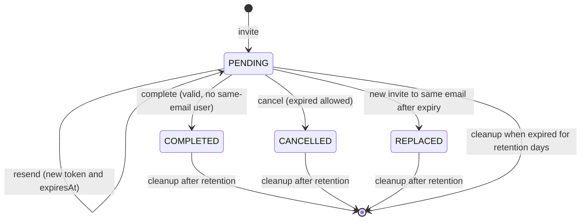
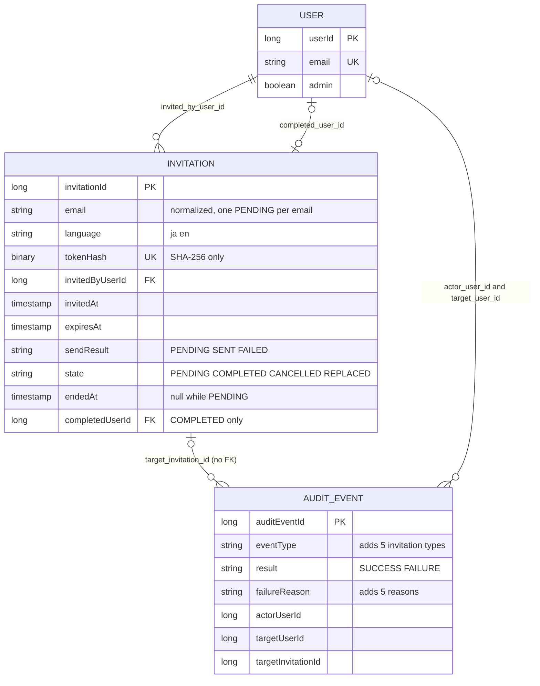

# Functional Spec — U3 招待と登録の完了（u3-invitation）

この文書は、U3 の手順（流れ）と招待の状態の移り変わりの正本である。データの形は `entities.md`、判定の決まりは `rules.md` の YAML が正本で、4節の図と5節の要約はそこから導いた読みやすさのための写しである。出典の略号は `rules.md` の冒頭のとおり（Q1〜Q4 はこの段の答え、要点 n は `functional-design-questions.md` の設計の要点、C1〜C10 は契約）。

## 1. 状態の移り変わり

### 1.1 招待の状態（state）

保存する状態は PENDING・COMPLETED・CANCELLED・REPLACED の4つである。**期限切れは保存しない**。PENDING のうち「時計の今 ≧ expiresAt」のものを、読むたびに注入した時計で期限切れと決める（BR3.3）。そのため、下の表の「PENDING（期限内）」と「PENDING（期限切れ）」は同じ保存の状態で、時計の値だけが違う。

| 今の状態 | きっかけ | 次の状態 | 変わる値 | 監査 | 決まり |
|---|---|---|---|---|---|
| （行が無い） | 招待（登録済みでも招待中でもない） | PENDING（期限内） | 全項目を作る。sendResult は PENDING | INVITATION_ISSUED | BR2.6 |
| PENDING（期限内） | 同じメールアドレスへの招待 | 変わらない（409 INVITATION_ALREADY_PENDING） | なし | 残さない | BR2.2・BR8.1 |
| PENDING（期限切れ） | 同じメールアドレスへの招待 | REPLACED（新しい招待の行が PENDING で作られる） | endedAt | 新しい招待の INVITATION_ISSUED だけ | BR2.4 |
| PENDING（期限内・期限切れ） | 送り直し（使える設定） | PENDING（期限内） | tokenHash・expiresAt・sendResult（PENDING）。invitedAt・invitedByUserId は変えない | INVITATION_RESENT | BR6.1 |
| PENDING（期限内・期限切れ） | 送り直し（使えない設定） | 変わらない（503） | なし | 残さない | BR1.5 |
| PENDING（期限内・期限切れ） | 取り消し（設定によらない） | CANCELLED | endedAt | INVITATION_CANCELLED | BR6.2 |
| PENDING（期限内） | 登録の完了（入力が正しく、同じメールアドレスの利用者がいない） | COMPLETED | endedAt・completedUserId | REGISTRATION_COMPLETED | BR7.3 |
| PENDING（期限内） | 登録の完了（同じメールアドレスの利用者がいる） | 変わらない（巻き戻し） | なし | REGISTRATION_FAILED・EMAIL_ALREADY_REGISTERED | BR7.4・BR8.3 |
| PENDING（期限切れ） | 登録の完了 | 変わらない | なし | REGISTRATION_FAILED・INVITATION_EXPIRED | BR7.5・BR7.6 |
| PENDING（期限内・期限切れ） | 登録の完了の入力の誤り | 変わらない（消費しない） | なし | 残さない | BR7.2 |
| PENDING | リンクの確かめ（verify） | 変わらない | なし | 残さない | BR7.1 |
| COMPLETED・CANCELLED・REPLACED | 送り直し・取り消し | 変わらない（404 INVITATION_NOT_FOUND） | なし | 残さない | BR6.3 |
| COMPLETED・CANCELLED・REPLACED | 登録の完了 | 変わらない | なし | REGISTRATION_FAILED（理由は ALREADY_USED・CANCELLED・EXPIRED） | BR7.5・BR7.6 |
| COMPLETED・CANCELLED・REPLACED | endedAt から保存の日数が過ぎた | （行が消える） | — | 残さない | BR11.1 |
| PENDING（期限切れ） | expiresAt から保存の日数が過ぎた | （行が消える、一覧から消える） | — | 残さない | BR11.1 |

終わった3つの状態（COMPLETED・CANCELLED・REPLACED）からはどこへも移らず、定期の削除で消えるだけである。送り直しは状態を変えず、同じ行のトークンを置き換える（前のトークンはその時点で見つからなくなる）。

文字の代替説明: 招待は作られると PENDING（招待中）になる。PENDING は送り直しで PENDING のまま新しいトークンと有効期限になり、登録の完了で COMPLETED、取り消しで CANCELLED（期限切れでも取り消せる）、期限切れのまま同じメールアドレスへ新しく招待されると REPLACED に移る。COMPLETED・CANCELLED・REPLACED は終わった日時から、期限切れの PENDING は有効期限から、保存の日数（既定 90 日）を過ぎると定期の削除で消える。期限切れは保存する状態ではなく、PENDING のうち時計の今が有効期限以後のものである。

### 1.2 送信の結果（sendResult）

| 今の値 | きっかけ | 次の値 | API（C5）での見え方 | 決まり |
|---|---|---|---|---|
| （行が無い） | 招待の確定 | PENDING | FAILED | BR2.6・BR4.4 |
| どれでも | 送り直しの確定 | PENDING | FAILED | BR6.1・BR4.4 |
| PENDING | 送信の結果が Sent（同じトークンの行が残っている） | SENT | SENT | BR4.3 |
| PENDING | 送信の結果が Failed（種類によらず、同じトークンの行が残っている） | FAILED | FAILED | BR4.3・BR4.5 |
| PENDING | 送信の途中でアプリが止まった | PENDING のまま | FAILED（管理者は送り直せる） | BR4.4 |
| PENDING | 記録の前に同じ招待がもう一度送り直された（tokenHash が違う） | 書かない（新しい送信の結果を待つ） | 新しい送信の結果 | BR4.3 |

送信の結果の PENDING は「送信中・結果不明」であり、招待の状態 state の PENDING（招待中）とは別の値である（Q2 C）。

## 2. 手順

### 2.1 起動のときの確かめ（招待を使える設定か）

1. ベース URL の設定を読む。無い・空白だけなら「使える値が無い」とし、警告は出さない。値があれば BR1.3 の形（http・https の絶対 URL、ホストあり、問い合わせ・#・利用者情報なし）を確かめ、合わなければ「使える値が無い」として、項目の名前だけの WARN を1件出す（値は出さない）。末尾の / は除いて持つ（BR1.3）。
2. U1 の isConfigured（C1）を読む（U1 の設定の判定は U1 の BR1.2〜BR1.4 のとおり）。
3. BR1.4 で InvitationAvailability（enabled と unavailableReasons）を決める。動いている間は変わらない。
4. 有効期限の長さ・保存の日数・定期の削除の時刻を読み、不正なら起動を止める（BR1.6）。
5. 登録の完了の2つの POST を公開にする決まりを差し込み口で足す（BR9.2）。どの場合も、ベース URL と SMTP の不足では起動を止めない。

### 2.2 招待（POST /api/admin/invitations、C5）

1. 認可: 未認証 401、管理者でない 403（BR9.1）。
2. 入力の検証: email（改行の拒否・正規化・254 文字・形式、BR1.1）と language（ja・en、BR1.2）。誤りは 400 VALIDATION_FAILED で、何も変えず送らない。
3. 使える設定か: だめなら 503 INVITATION_NOT_CONFIGURED（unavailableReasons）で、何も変えず送らない（BR1.5）。
4. 短いトランザクション（1つ）で:
   1. 登録済みなら 409 INVITATION_EMAIL_REGISTERED（BR2.1）。
   2. 同じメールアドレスの PENDING を排他して読み、期限内なら 409 INVITATION_ALREADY_PENDING（invitationId と BR2.3 の page）（BR2.2）。
   3. 期限切れなら REPLACED にする（BR2.4）。
   4. トークンを作り（BR3.1）、招待を PENDING・sendResult PENDING で保存する（BR2.6）。同時の招待で1件に限る仕組みに当たったら 409 INVITATION_ALREADY_PENDING（BR2.5）。
   5. 確定する。
5. 確定の後に INVITATION_ISSUED を知らせる（AuditLog が記録、BR8.1）。
6. 招待の URL をベース URL だけから組み立てる（BR3.4）。
7. トランザクションの外で、内部DB の接続を持たずに U1 の send を1回呼ぶ（invitation・招待の言語・招待のメールアドレス・registrationUrl、BR4.1・BR4.2）。
8. 別の短いトランザクションで、送ったトークンのハッシュを今も持つ行にだけ SENT か FAILED を書く（BR4.3）。
9. 201 で招待の要約を返す（sendResult はこの送信の結果、expired は false、invitedBy は操作した管理者の氏名、BR5.3・BR5.4）。送信に失敗しても 201（BR4.5）。

### 2.3 一覧（GET /api/admin/invitations?page=n、C5）

1. 認可（BR9.1）。page が 1 未満・整数でなければ 400 VALIDATION_FAILED（BR5.2）。
2. state が PENDING の招待を、invitedAt の降順・invitationId の降順に並べ、(page−1)×20 番目から 20 件を読む。total は対象の件数（BR5.1・BR5.2）。
3. 各行の expired を時計で決め（BR3.3）、sendResult の PENDING を FAILED にし（BR4.4）、invitedBy を氏名（無ければメールアドレス）にする（BR5.3）。
4. invitationEnabled と unavailableReasons を付けて 200 で返す。トークン・ハッシュ・URL を含めない（BR5.4）。最後のページを超えたら items は空（BR5.2）。

### 2.4 送り直し（POST /api/admin/invitations/{invitationId}/resend、C5）

1. 認可（BR9.1）。
2. 使える設定か: だめなら 503 INVITATION_NOT_CONFIGURED で、トークン・有効期限・送信の結果を変えず、前のリンクは有効なまま、送らない（BR1.5）。
3. 短いトランザクションで対象の行を排他して読む。無い・PENDING でなければ 404 INVITATION_NOT_FOUND（BR6.3）。
4. 新しいトークンを作り、tokenHash・expiresAt（時計の今 ＋ 有効期限の長さ）・sendResult（PENDING）を置き換えて確定する。invitedAt・invitedByUserId は変えない（BR6.1）。前のトークンはこの時点で見つからなくなる。
5. 確定の後に INVITATION_RESENT を知らせる（BR8.1）。
6. 2.2 の 6〜8 と同じ手順で送り、結果を記録する（BR3.4・BR4.1〜BR4.3）。
7. 200 で招待の要約を返す。送信に失敗しても 200 で sendResult は FAILED（BR4.5）。監査は SUCCESS のまま（BR8.1）。

### 2.5 取り消し（POST /api/admin/invitations/{invitationId}/cancel、C5）

1. 認可（BR9.1）。設定の確かめはしない（BR6.2）。
2. 短いトランザクションで対象の行を排他して読む。無い・PENDING でなければ 404 INVITATION_NOT_FOUND（BR6.3）。
3. state を CANCELLED、endedAt を時計の今にして確定する（tokenHash は残す）（BR6.2）。
4. 確定の後に INVITATION_CANCELLED を知らせ（BR8.1）、204 を返す。

### 2.6 リンクの確かめ（POST /api/registration/verify、C6、ログインなし）

1. 本文の token の形を確かめ、合わなければ引かずに拒否（BR3.2）。
2. ハッシュで招待を引き、無い・有効でない（BR3.3）・そのメールアドレスの利用者がいる（existsByEmail）なら拒否（BR7.1）。
3. 拒否は理由によらず 404 REGISTRATION_LINK_INVALID（BR7.5）。成功は 200 で email と language だけ。
4. 内部DB を変えず、成功も失敗も監査しない（BR7.1）。

### 2.7 登録の完了（POST /api/registration/complete、C6、ログインなし）

1. 入力の検証を内部DB を使わずに行う: 氏名（U2 の DisplayName の関数）・言語・テーマ・文字の大きさ（U2 の BR2.1）・パスワード（PasswordPolicy）・2回の入力の一致。誤りはすべて集めて 400 VALIDATION_FAILED、招待は消費せず監査しない（BR7.2）。
2. token の形を確かめ、合わなければ 5 へ（理由 INVITATION_NOT_FOUND、BR3.2）。
3. 1つのトランザクションで:
   1. ハッシュで招待の行を排他して読む。無い・有効でなければ巻き戻して 5 へ（理由は BR7.6）。
   2. UserAccount の createUser（C2）を同じトランザクションで呼ぶ（email は招待の email、admin false、ほかは入力の値。UserCreatedEvent でロックの状態が用意される）（BR7.3）。
   3. EmailAlreadyUsed なら巻き戻して 5 へ（理由 EMAIL_ALREADY_REGISTERED、招待は PENDING のまま）（BR7.4）。
   4. Created なら招待を COMPLETED、endedAt を時計の今、completedUserId を作った利用者にして確定する（BR7.3）。
4. 確定の後に REGISTRATION_COMPLETED を知らせ（BR8.2）、204 を返す。自動ではログインしない（BR7.3）。
5. 拒否: 404 REGISTRATION_LINK_INVALID を理由によらず同じ本文で返し（BR7.5）、巻き戻しの後に要求の中で REGISTRATION_FAILED（BR7.6 の理由、招待が分かるときだけ targetInvitationId）を記録する（BR8.3）。

同じ招待での2回の完了、完了と取り消し、完了と送り直しが同時に来たときは、行の排他で1つずつ判定され、後の操作は 404 になる（BR6.4）。

### 2.8 保存期間を過ぎた招待の定期の削除

1. 設定の時刻に動く。境目を 時計の今 − 保存の日数（既定 90 日）とする（BR11.1）。
2. COMPLETED・CANCELLED・REPLACED で endedAt ≦ 境目の行と、PENDING で expiresAt ≦ 境目の行を、件数の上限ごとに別のトランザクションで消す。条件は消す操作の中で確かめ直し、同時に送り直された行は消さない。
3. 消した件数を INFO で出す。失敗は ERROR（スタックトレース付き）で出し、例外を外へ出さず次の回に任せる。
4. 消えた招待のリンクは「存在しない」と同じ扱い（監査の理由 INVITATION_NOT_FOUND）、ID は 404 INVITATION_NOT_FOUND になる。監査の記録は消さない（BR11.2）。

## 3. 失敗の場合とふるまい

| 場合 | 応答 | 内部DB | メール | 監査 | 決まり |
|---|---|---|---|---|---|
| 招待の管理の API に未認証・管理者でない | 401・403 | 変わらない | 送らない | 既存のアクセスの拒否の扱いのまま | BR9.1 |
| 招待の入力の誤り（形式・255 文字・改行・言語） | 400 VALIDATION_FAILED | 変わらない | 送らない | 残さない | BR1.1・BR1.2 |
| 招待・送り直しで使えない設定（ベース URL が無い・不正、SMTP が無い） | 503 INVITATION_NOT_CONFIGURED（unavailableReasons） | 変わらない | 送らない | 残さない | BR1.3〜BR1.5 |
| 登録済みのメールアドレス | 409 INVITATION_EMAIL_REGISTERED | 変わらない | 送らない | 残さない | BR2.1 |
| 期限内の招待中（同時の招待の負けた側を含む） | 409 INVITATION_ALREADY_PENDING（invitationId・page） | 変わらない | 送らない | 残さない | BR2.2・BR2.5 |
| 送信の失敗（接続を拒む・応答しない・宛先を拒む・U1 の入力やテンプレートの誤り） | 201（招待）・200（送り直し）で sendResult FAILED | 招待は確定したまま、sendResult は FAILED | 受け手は0通、または送れていない | 招待・送り直しの SUCCESS だけ（送信の失敗は残さない） | BR4.5・BR8.1 |
| 送信の途中でアプリが止まる | （応答は返らない） | sendResult は PENDING のまま、API では FAILED | 不明 | 招待・送り直しの SUCCESS は確定の後に記録済み | BR4.4 |
| 送り直し・取り消しの対象が無い・終わった状態 | 404 INVITATION_NOT_FOUND | 変わらない | 送らない | 残さない | BR6.3 |
| 一覧の page の誤り | 400 VALIDATION_FAILED | 変わらない | — | 残さない | BR5.2 |
| リンクの確かめの拒否（どの理由でも） | 404 REGISTRATION_LINK_INVALID | 変わらない | — | 残さない | BR7.1・BR7.5 |
| 登録の完了の入力の誤り | 400 VALIDATION_FAILED（項目ごと） | 変わらない（招待を消費しない） | — | 残さない | BR7.2 |
| 登録の完了のリンクの拒否（期限切れ・使用済み・取り消し済み・置き換え済み・存在しない・改ざん・同時の完了） | 404 REGISTRATION_LINK_INVALID（同じ本文） | 変わらない | — | REGISTRATION_FAILED（理由は BR7.6） | BR7.5・BR7.6・BR8.3 |
| 登録の完了の時点で同じメールアドレスの利用者がいる | 404 REGISTRATION_LINK_INVALID（同じ本文） | 巻き戻す（招待は PENDING のまま、利用者は増えない） | — | REGISTRATION_FAILED・EMAIL_ALREADY_REGISTERED | BR7.4・BR8.3 |
| 招待中の人のログイン・トークンの更新・アクセストークンの認証 | 401（既存の扱い） | 変わらない | — | 既存の認証の出来事のまま | BR7.7 |
| 監査の書き込みの失敗 | 元の応答のまま | 元の操作のとおり | 元の操作のとおり | 記録されない（アプリのログに ERROR） | BR8.5 |
| 定期の削除の失敗 | —（要求ではない） | その回に消した分まで | — | 残さない（アプリのログに ERROR） | BR11.1 |
| 想定外の誤り（DB の障害など） | 既存の 500 の扱い（内部の例外のメッセージを載せない） | 巻き戻る | 送らない（確定の前）・結果は記録されない（確定の後） | — | 既存の決まり、BR9.3 |

エラーの説明文はどれも要求の Accept-Language で ja・en を選ぶ（BR9.3）。応答・ログ・トレースの属性に、招待のトークン・URL・メールアドレス・パスワード・SMTP の応答を載せない（BR9.4。管理者だけが見る C5 の正常の応答の email・invitedBy は除く）。

## 4. エンティティの関係（`entities.md` から導いた図）

文字の代替説明: 利用者（USER）1人は、招待した管理者として招待（INVITATION）の0件以上につながる（invited_by_user_id）。登録の完了で作られた利用者は、その招待と0か1件ずつでつながる（completed_user_id、招待が COMPLETED のときだけ入る）。招待1件は監査の記録（AUDIT_EVENT）の0件以上から対象の招待として指される（target_invitation_id）が、参照の制約は置かないため、招待の行が定期の削除で消えても監査の記録は残る。監査の記録は操作した人（actor_user_id）と対象の利用者（target_user_id）で利用者を指す。招待はメールアドレス（正規化済み、同じメールアドレスの PENDING は1件まで）・言語・トークンのハッシュ（一意）・招待した日時・有効期限・送信の結果・状態・終わった日時を持つ。利用者と監査の記録の列の全体は U2 の `entities.md` のとおり。

## 5. 決まりの要約（`rules.md` から導いた写し）

| 群 | ID | 要点 |
|---|---|---|
| 入力と使える設定 | BR1.1〜BR1.6 | メールアドレスは改行を拒否し正規化・254 文字・形式、言語は ja・en、ベース URL は http・https の絶対 URL（不正は WARN で未設定扱い）、使える設定はベース URL と SMTP の両方、使えなければ招待と送り直しだけ 503、有効期限 24 時間と保存 90 日は設定 |
| 招待の作成 | BR2.1〜BR2.7 | 登録済み 409、期限内の招待中 409（invitationId・page）、page は位置 ÷ 20 の切り上げ、期限切れは REPLACED、PENDING は1件まで、新しい招待は PENDING・sendResult PENDING、取り消し・完了の後の再招待を許す |
| トークンと URL | BR3.1〜BR3.5 | 乱数 32 バイト・SHA-256 のハッシュだけ、形の誤りは引かずに見つからない、有効は PENDING かつ 今 < 有効期限、URL はベース URL ＋ /register#token=、トークンはフラグメントと本文だけ |
| 送信と結果 | BR4.1〜BR4.5 | 確定の後にトランザクションの外で1回、invitation・招待の言語・registrationUrl だけ、同じトークンの行にだけ結果を記録、内部は PENDING で API は FAILED、送信の失敗でも 201・200 |
| 一覧 | BR5.1〜BR5.4 | PENDING だけ、新しい順に 20 件、送信の結果・期限切れ・招待した管理者、トークンと URL を含めない |
| 送り直し・取り消し | BR6.1〜BR6.4 | 送り直しはトークン・有効期限・送信の結果だけ、取り消しは設定なしでも可、無い・終わったものは同じ 404、同時の操作は行の排他 |
| リンクの確かめと登録の完了 | BR7.1〜BR7.7 | verify は消費も監査もしない、入力は DB の前に検証、1つのトランザクションで利用者の作成と完了、同じメールアドレスの利用者は巻き戻し、拒否は同じ 404、理由は監査だけ、招待中の人は認証の3経路で構造的に拒否 |
| 監査 | BR8.1〜BR8.6 | 招待・送り直し・取り消しは SUCCESS、登録の完了、完了の要求の拒否だけ REGISTRATION_FAILED、種類5つ・理由5つ、書き込みの失敗で応答を変えない、秘密を入れない |
| 認可・応答・秘密 | BR9.1〜BR9.4 | 管理の API は管理者だけ、verify・complete の POST だけ公開、code と状態コードの固定と要求の言語、ログ・トレース・エラー応答に秘密を出さない |
| 招待メールのテンプレート | BR10.1〜BR10.3 | U1 の一覧に invitation、本文の文面（24 時間有効・日時と管理者の氏名なし）、行き先の分かるリンクと URL の文字 |
| 保存期間とスキーマ | BR11.1〜BR11.3 | 保存の日数を過ぎたものを定期に消す、消えた招待は存在しないと同じ、V8 以降の前進のみ |

## 6. 上流との差

承認済みの上流の文書は書き換えず、差をここに記録する（`project.md` の決まり）。

| 差 | 上流の記述 | この段の決定 | 影響する単位・段 |
|---|---|---|---|
| 監査の失敗の理由 EMAIL_ALREADY_REGISTERED を足す | 契約 C8 の REGISTRATION_FAILED の failure_reason は INVITATION_EXPIRED・INVITATION_ALREADY_USED・INVITATION_CANCELLED・INVITATION_NOT_FOUND の4つ（`contract-summary.md` の C8） | Q4 A: 登録の完了の時点で同じメールアドレスの利用者がいたときは、失敗の理由 EMAIL_ALREADY_REGISTERED（24 文字、既存の列の長さ 32 に収まる）で記録する。既存の AuditFailureReason に足す値は5つになる。応答（404 REGISTRATION_LINK_INVALID）は変えない（BR7.4・BR7.6・BR8.4） | 契約 C8 の値の追加（安全な追加で、持ち主の U3 だけで行える）。U2 の BR7.5 の長さの確かめにも収まる |
| 送信の結果の内部の値 PENDING | 契約 C5 の sendResult は SENT・FAILED の2つ（`contract-summary.md` の C5）、ADR-009 の悪い点「送信の途中でアプリが止まると送信の結果が残らない」 | Q2 C: 内部DB には送信中（PENDING）を持ち、確定の時点で PENDING、送信の結果で SENT か FAILED にする。API（C5）では PENDING を FAILED として返し、契約の値は変えない。途中で止まった招待は一覧に「送信に失敗」と出て送り直せる（BR4.3・BR4.4） | C5 と U5 の画面は変わらない。記録の上で「止まった」と「失敗した」を区別できる |
| 招待の状態 REPLACED | 部品の一覧の Invitation の属性は state（値は未定）、AC2.2.6 は「期限切れの古い招待は無効になって一覧から消える」 | 期限切れのまま同じメールアドレスに新しく招待された招待を REPLACED として残す（監査の理由は INVITATION_EXPIRED）（BR2.4・BR7.6） | なし（内部の値） |
| 終わった日時を1つの属性にまとめた | 設計の要点 1 は「登録の完了の記録（completedAt・completedUserId）と終わった日時（取り消し・置き換えの時点）を足す」 | 完了・取り消し・置き換えの時点を1つの endedAt にまとめ、完了の時点は state が COMPLETED の endedAt とした。completedUserId は残す（`entities.md`） | なし（保存期間の起点が1つで済む） |

## 7. 後の段へ渡すこと

| 論点 | 持ち主の段 |
|---|---|
| 同じメールアドレスの PENDING を1件に限る仕組み（H2 の索引か行の排他か）と、招待・送り直し・取り消し・登録の完了の行の排他の作り（BR2.5・BR6.4、ADR-010） | nfr-design |
| 送信を待つ間に内部DB の接続を持たないことの観測の仕方（AC1.1.7、BR4.1） | nfr-design |
| SMTP の時間切れの値と、招待・送り直し（5 秒）・ほかの API（1 秒）の応答時間の目標（要件の [assumption]） | nfr-requirements |
| 登録の完了の公開の API（verify・complete）の回数の制限を設けるか（ADR-011、C6 の Open question） | nfr-requirements |
| 設定の項目の名前（有効期限の長さ・保存の日数・定期の削除の時刻）、定期の削除の既定の時刻と件数の上限、差し込み口の順番の値 | code-generation |
| 新しいパッケージ invitation のパッケージごとのカバレッジの下限、有効の判定（BR3.3）とトークンの形の確かめ（BR3.2）の性質ベースのテスト、既存の *SecretLeakIT と同じ形の漏えいの確かめ、監査の書き込みの失敗を出来事ごとに1件 | code-generation・build-and-test |
| 招待から登録の完了までの E2E の代表の流れ1本（E2E-1）と、E2E で招待メールのリンクを取り出す方法 | u6-registration-ui・infrastructure-design |
| 招待の画面の言語の初期値（AC1.1.1）と、画面の表示・操作の受け入れ基準（traceability.json の Deferred） | u5-invitation-ui・u6-registration-ui |
