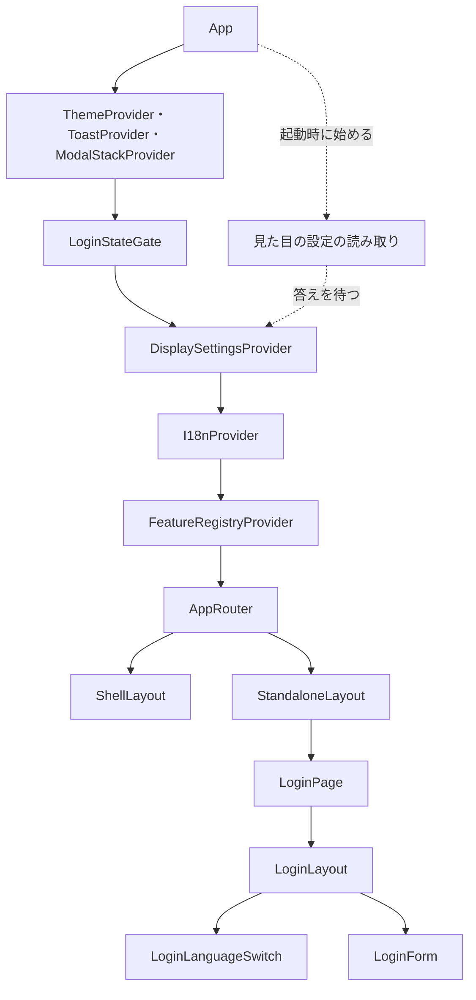

# Frontend Components — U4 表示の設定の土台（u4-display-foundation）

画面の流れ（W1〜W12）・決まり（D1〜D14）・ブラウザの保存の鍵・状態の移り変わりは `functional-spec.md` が正本で、ここでは繰り返さない。ここでは部品の階層、props と state、口の形、API との受け渡し（契約 C3・C7・C9）、テストで確かめる内容を示す。画面の配置と部品ごとの動きは `aidlc/spaces/default/intents/260925-user-management/inception/refined-mockups/` の `mockups.md`（S3）・`interaction-spec.md`（6節・9節）・`design-system-mapping.md` が正本。

## 1. 部品の階層

`App` の並びを次のとおり変える。ログイン状態を受けてから表示の設定を決め、その言語で文言を引くため、`LoginStateGate` を `DisplaySettingsProvider` と `I18nProvider` の外側に移す。

| 階層 | 部品 | 置き場 | 変更 |
|---|---|---|---|
| 1 | `App` | `frontend/src/app/App.tsx` | 並びを変える。最初の描画の前に写しの鍵を書き直し（W1）、見た目の設定の読み取りを始める |
| 2 | `ThemeProvider`・`ToastProvider`・`ModalStackProvider` | make-you-chic-ui | 変えない |
| 3 | `LoginStateGate` | `frontend/src/app/login-state/LoginStateGate.tsx` | 位置を `I18nProvider` の外側へ。表示の設定をログイン状態に通す |
| 4 | `DisplaySettingsProvider` | `frontend/src/app/display-settings/`（新しい） | 表示の設定の状態・見た目の設定のゲート・make-you-chic-ui への反映・要求の言語の登録・ブラウザの保存 |
| 5 | `I18nProvider` | `frontend/src/app/i18n/I18nProvider.tsx` | 言語を外から受ける形に変える |
| 6 | `FeatureRegistryProvider` → `AppRouter` | 既存 | 変えない（起動の誤りのときは `StandaloneLayout` → `StartupErrorPage`） |
| 7 | `ShellLayout` | `frontend/src/app/layout/ShellLayout.tsx` | ユーザーメニューの名前を表示の設定の口の氏名から出す |
| 7 | `LoginLayout` | `frontend/src/app/layout/LoginLayout.tsx` | 右上の置き場（任意の props）を足す |
| 8 | `LoginPage` → `LoginLanguageSwitch`・`LoginForm` | `frontend/src/features/auth/` | 言語の切り替えを足す。受け渡しの案内とメールアドレスの持ち越しを足す |

<!-- Text fallback: App の下に make-you-chic-ui の ThemeProvider・ToastProvider・ModalStackProvider があり、その下に LoginStateGate、その下に新しい DisplaySettingsProvider、その下に I18nProvider、その下に既存の FeatureRegistryProvider と AppRouter が続く。AppRouter はアプリシェルの中の画面を ShellLayout に、ログインの画面などを StandaloneLayout に置く。ログインの画面は LoginPage が LoginLayout の中に、右上の LoginLanguageSwitch と LoginForm を置く。App は起動時に見た目の設定の読み取りを始め、DisplaySettingsProvider がその答えを待つ。 -->

- `renderWithProviders`（`frontend/src/app/testing/renderWithProviders.tsx`）も同じ並び（`LoginStateGate` → `DisplaySettingsProvider` → `I18nProvider`）に変える。テストでは見た目の設定の読み取りを差し替えられる形（既定は読み終わった扱い）にし、既存の画面のテストが変わらず通るようにする。

## 2. 置き場ごとのモジュール

| 置き場 | モジュール | 役割 |
|---|---|---|
| `frontend/src/app/display-settings/` | 表示の設定の型 | `DisplayLanguage`（既存の `ja`・`en`）・`ThemeChoice`（`light`・`dark`・`system`）・`FontSize`（`sm`・`md`・`lg`）・`DisplaySettings`（3つの軸）・`UserDisplaySettings`（3つの軸と氏名）。文字列リテラルの union で表し `enum` は使わない |
| 同上 | 解き方（純粋な関数） | 保存の値の読み取りと検証、テーマの選択と OS の配色から解く、当てている値と見せ方から画面の値を決める、ログイン状態の表示の設定の検証 |
| 同上 | ブラウザの保存 | U4 の鍵の読み書き（例外を外へ出さない、D7）、写しの鍵の書き直し（W1） |
| 同上 | 見た目の設定の読み取り | `GET /api/appearance` を呼び、応答を検証して返す（W3） |
| 同上 | OS の配色の購読 | `prefers-color-scheme: dark` の今の値と変化の知らせ（W11） |
| 同上 | `DisplaySettingsProvider` と口 | 状態を持ち、画面の値を決め、make-you-chic-ui・`<html lang>`・ApiClient に反映する。口 `useDisplaySettings`・`saveBrowserDisplaySettings`・`saveBrowserLanguage` と、言語の名前の定数 |
| `frontend/src/app/login-handoff/` | 受け渡し | `handOffToLogin`・`takeLoginHandoff`・`clearLoginHandoff`（W9、メモリだけ） |
| `frontend/src/shared/api-client/` | ApiClient | 言語の関数の登録（`registerLanguageResolver`）、`Accept-Language` の付与、公開の API のパス |

- 解き方の関数は React・ブラウザの保存・`window` に触れない純粋な関数とし、性質ベースのテストの対象にする（設計の要点 4）。

## 3. 表示の設定の口（契約 C9）

### 3.1 `useDisplaySettings()` が返す値

| 項目 | 型 | 意味 |
|---|---|---|
| `language` | `DisplayLanguage` | 画面の言語（言語の見せ方を含む） |
| `theme` | `ThemeChoice` | テーマの画面の値（選択。見せ方を含む） |
| `fontSize` | `FontSize` | 文字の大きさの画面の値（見せ方を含む） |
| `resolvedTheme` | `'light'` または `'dark'` | `theme` を D4 で解いた値（C9 への項目の追加。安全な変更） |
| `displayName` | `string` または `undefined` | ログインの後の氏名（ログインの前は無い。C9 への項目の追加） |
| `setPreview(theme?, fontSize?)` | 関数 | テーマ・文字の大きさの見せ方を置く。渡した軸だけを置き換え、渡さない軸は前の見せ方のまま。ブラウザに保存しない |
| `clearPreview()` | 関数 | 見せ方（テーマ・文字の大きさ・言語）をすべてやめ、当てている値に戻す |
| `applyUserPreferences(prefs)` | 関数 | `prefs` は `displayName`・`language`・`theme`・`fontSize`。ログインの後だけ有効。当てている値と氏名を置き換え（D8）、見せ方を捨て、ブラウザに保存する |
| `setLanguage(lang)` | 関数 | 言語の見せ方を置く。文言・`<html lang>`・要求の言語が変わる。ブラウザに保存しない |

### 3.2 口の関数（フックの外から呼べる）

| 関数 | 使う単位 | 意味 |
|---|---|---|
| `saveBrowserDisplaySettings({ language, theme, fontSize })` | U6 | 3つをブラウザに保存し、見せ方を捨てる。ログインの前は当てている値がこの値になる（W8） |
| `saveBrowserLanguage(language)` | AuthUi（U4） | ブラウザの保存の値の言語だけを書き換え、言語の見せ方を捨てる（W7）。契約 C9 の外の U4 の中の口 |
| `LANGUAGE_NAMES` | U6・U7・AuthUi | `ja` は「日本語」、`en` は「English」（訳さない、D12） |

- フックの外から呼べるよう、表示の設定の状態のうち「ブラウザの保存の値」「見せ方」「保存の後の利用者の設定」はモジュールの中の1つの置き場（購読できる状態）に持ち、`DisplaySettingsProvider` がそれを購読する。テストのために状態を初めに戻す関数を置く（既存の `resetAuthSession` と同じ形）。

### 3.3 `DisplaySettingsProvider` が持つ値と決め方

| 値 | 持ち方 | 変わる時点 |
|---|---|---|
| ブラウザの保存の値 | 置き場（最初に U4 の鍵から読む） | D6 の保存の時点 |
| ログイン状態 | `LoginStateGate` の値を受ける | ログイン・復元・更新の応答・ログアウト |
| 保存の後の利用者の設定 | 置き場。受けたときのログイン状態に結び付ける | `applyUserPreferences` |
| 見せ方（テーマ・文字の大きさ・言語） | 置き場。置いたときのログイン状態に結び付ける | `setPreview`・`setLanguage`・`clearPreview`・保存 |
| OS の配色 | OS の配色の購読 | OS の切り替え |
| 見た目の設定の答え | `App` が始めた読み取りの結果 | 起動時に1回 |

- 画面の値は描画の中で次の順に決める（純粋な関数）。(1) ログイン中で、保存の後の利用者の設定が今のログイン状態に結び付いていればそれ、そうでなくログイン状態に表示の設定があればそれを当てている値とする。未ログイン、または表示の設定が無ければブラウザの保存の値（無い軸は D1 の既定）。(2) 見せ方が今のログイン状態に結び付いていれば、見せ方のある軸を見せ方で置き換える。結び付いていない見せ方は捨てたものとして扱う（D2）。(3) テーマは OS の配色で解く（D4）。
- 描画の中で決めるため、ログイン状態が変わった描画でそのまま言語の文言が切り替わる（D3）。
- 反映（描画の確定の直後、子の副作用より前）:
  - テーマの解いた値・文字の大きさを make-you-chic-ui の `setTheme`・`setFontSize` に渡す。渡すのは、このタブの画面の値（解いた値）が前に渡した値から変わったときだけとし、ほかのタブで起きた make-you-chic-ui の変化を打ち消さない（`functional-spec.md` の 4.2）。
  - `<html lang>` を画面の言語にする。
  - ApiClient に登録した言語の関数が返す値を画面の言語にする（W12）。
  - ログイン状態が新しくなり表示の設定を持つときは、利用者の設定をブラウザに保存する（D6 の (a)）。
- make-you-chic-ui の `ThemeProvider` が `<html>` の属性を変える時点が描画の後になり、ログインの後の最初の画面に前の値が一瞬出ることがテストで分かったときは、`DisplaySettingsProvider` が同じ時点で `<html>` の `data-theme`・`data-font-size` にも同じ値を置く（make-you-chic-ui は後から同じ値を置く）。どちらにするかはコード生成で確かめて記録する。
- 見た目の設定の答えが出るまで、子を描かない（D11）。答えが出たら、成功した項目だけ `setBrand`・`setFontFamily` を呼ぶ。

### 3.4 使う単位ごとの口の使い方（約束）

| 単位 | 画面 | 使い方 |
|---|---|---|
| U5 | 招待の管理 | 招待の言語の初期値に `useDisplaySettings().language` を使う（ログインの後は管理者自身の言語、FR1.1・FR7.4） |
| U6 | 登録の完了 | 開いた時点で `setLanguage`（招待の言語）、テーマ・文字の大きさを選んだ時点で `setPreview`、言語を選んだ時点で `setLanguage`、完了の成功で `saveBrowserDisplaySettings` → `handOffToLogin` → `/login` へ移る、完了せずに離れるときは `clearPreview`（W8・W9） |
| U7 | プリファレンス | テーマ・文字の大きさを選んだ時点で `setPreview`、言語を選んでも呼ばない、「元に戻す」と離れるときに `clearPreview`、保存の成功で `applyUserPreferences` の後に Toast（W10） |
| U6・U7 | 選択肢の文言 | 言語は `LANGUAGE_NAMES` と `lang` 属性、テーマ・文字の大きさは骨組みの文言の鍵 `display.theme.*`・`display.fontSize.*` |

## 4. 部品ごとの props と state

| 部品 | props | state・読む値 | 変更の要点 |
|---|---|---|---|
| `App` | 既存の `modules` | 登録の検査の結果、見た目の設定の読み取りの約束（最初の描画で1回だけ作る） | 最初の描画の前に写しの鍵を書き直す（`ThemeProvider` が保存の値を読むより前） |
| `LoginStateGate` | 既存の `provider`・`children` | 既存のログイン状態 | 整え方（`normalizeLoginState`）で、ログイン中なら `displayName` と表示の設定（`preferences`）を通す。未ログインなら従来どおり落とす |
| `DisplaySettingsProvider` | `appearance`（見た目の設定の読み取りの約束）・`children` | 3.3 の値 | 新しい。答えが出るまで子を描かない |
| `I18nProvider` | `language`（新しい、必須）・既存の `featureMessages`・`children` | i18next の実体 | ブラウザの言語設定を自分で読まず、受けた言語で文言を引く。言語が変わったら同じ描画で文言が変わる。`<html lang>` は `DisplaySettingsProvider` が変える（`I18nProvider` の今の副作用は移す） |
| `ShellLayout` | 既存 | ログイン状態、`useDisplaySettings().displayName` | ユーザーメニューの名前を `displayName`（氏名）にする。無ければログイン状態の `displayName` |
| `LoginLayout` | 既存の `children`、`topRight`（新しい、任意） | — | 右上の置き場。`LOGIN_LAYOUT` の振り分け（登録が無い場合の枠だけの表示）では渡さない |
| `LoginPage` | — | — | `LoginLayout` の `topRight` に `LoginLanguageSwitch` を渡す |
| `LoginLanguageSwitch` | なし（今の言語は `useDisplaySettings().language` から読む） | — | 新しい。「日本語」「English」の2つのボタンの組（`aria-pressed`、組の名前「表示の言語」）。選ぶと `setLanguage` 相当の切り替えと `saveBrowserLanguage`（W7）。フォーカスは選んだボタンのまま |
| `LoginForm` | — | 既存の入力・誤り・送信中、受け渡しの値（最初の描画で1回だけ読む） | 受け渡しの値があれば、フォームの上に案内（`Alert`、成功の種類、文言 `auth.login.registered`）を出し、メールアドレスの欄の初期値にする。受け渡しの口から消すのは描画の確定の後（W9） |

- `LoginLanguageSwitch` の見た目と動きは `interaction-spec.md` の6節（右上に固定、Tab で届き Enter・Space で切り替え、WCAG AA）。

## 5. AuthUi とログイン状態（契約 C3）

| 置き場 | 変更 |
|---|---|
| `frontend/src/features/auth/authApi.ts` の `CurrentUser` | 契約 C3 に合わせて `displayName`・`language`・`theme`・`fontSize` を足す |
| `frontend/src/app/registry/types.ts` の `LoginState` | 任意の項目 `preferences`（`language`・`theme`・`fontSize`）を足す。既存の `displayName` には氏名を入れる。差し込み口の形は安全な追加で、既存の提供元はそのまま動く |
| `frontend/src/features/auth/loginStateProvider.ts` の `toLoginState` | ログイン中なら `displayName` に C3 の `displayName`（今のメールアドレスではない、ストーリーの M7）、`preferences` に C3 の3つの値を入れる |

- ログイン・セッションの復元・トークンの更新の応答はどれも `authSession` の状態を変え、既存の購読でログイン状態の提供元が知らせる。`LoginStateGate` は新しいログイン状態の値を作り、`DisplaySettingsProvider` はそれを「ログイン状態が新しくなった」として扱う（W5）。
- AppFrame は `features/auth` を読み込まない。受け渡しの口（`frontend/src/app/login-handoff/`）と表示の設定の口（`frontend/src/app/display-settings/`）を、AuthUi と U6 が読み込む向きだけにする。

## 6. API との受け渡し

| 契約 | 相手 | 呼び方・受け方 | この単位の扱い |
|---|---|---|---|
| C3 | U2（`POST /api/auth/login`・`POST /api/auth/session/refresh`） | 既存の AuthUi の呼び出し。応答の `user` の項目が増える | `CurrentUser` を広げ、ログイン状態に通す（5節）。`theme` は `system` のまま受け、画面の側で解く |
| C7 | U8（`GET /api/appearance`） | ApiClient の公開の API のパスとして、トークンを付けず、401 での更新と送り直しをしない | 起動時に1回（W3）。応答は `brandColor`・`fontFamily` の2項目で、許される値だけを当てる |
| C9 | U5・U6・U7 | 画面の中の呼び出し（3節） | この単位が持ち主。項目の追加（`resolvedTheme`・`displayName`・`LANGUAGE_NAMES`）は安全な変更 |

### 6.1 ApiClient の変更

| 変更 | 内容 |
|---|---|
| 言語の関数の登録 | `registerLanguageResolver(resolver)`。AppFrame が画面を開いたときに登録する。テストのための初期化（既存の `resetApiClient`）で消す |
| `Accept-Language` の付与 | すべての要求に、登録した関数が返す言語を付ける。呼び出し側が指定したときは上書きしない。関数が無ければ付けない（D9） |
| 公開の API のパス | 既存の認証の API のパス（ログイン・更新・ログアウト）に `/api/appearance` を加えた「トークンを付けず、更新と送り直しをしないパス」として扱う（D10）。判定は問い合わせの部分を見ない既存の形のまま |
| 変えないこと | 401 と `AUTHENTICATION_REQUIRED` での更新を1回だけ行う流れ、同時の 401 をまとめる形、エラーの変換 |

## 7. テストで確かめる内容

`team.md` の決まり（対象と同じ場所の `*.test.ts(x)`、Vitest・Testing Library（jsdom）・user-event・vitest-axe、画面部品ごとにアクセシビリティの検査を1件、説明文は英語）に従う。OS の配色は `matchMedia` の差し替え、ブラウザの保存は jsdom の localStorage、ログイン状態は偽の提供元で作る。

| 対象 | 確かめる内容 | 上流 |
|---|---|---|
| 解き方の関数（性質ベース、fast-check） | 壊れた JSON・知らない値の項目は無いものになる、有効な値はそのまま、どの入力でも3つの軸が許される値になる。テーマの選択 `system` は OS の配色で解け、`light`・`dark` は OS によらない。画面の値は見せ方のある軸だけが置き換わる。失敗時の種を記録する | D1・D4・D7 |
| ブラウザの保存 | 読み書きの例外で落ちない、言語だけの保存でほかの2つが変わらない・無い項目は無いまま、写しの鍵の書き直し | D5・D6・D7 |
| `DisplaySettingsProvider` | 見た目の設定と復元の答えが出るまで描かない、見た目の設定の失敗で前の値のまま描き読み直さない、成功で `<html>` の `data-brand`・`data-font-family` が変わる | W2・W3、CR2 |
| 同上 | ログインの前はブラウザの保存の値、無ければブラウザの言語設定と OS の配色で表示する | W4・W6、AC4.1.6 |
| 同上 | 前の利用者の値（dark）がブラウザに残る状態で light の利用者がログインすると、ログインの後の最初の画面から light で、途中で dark が出ない | W5、AC4.1.5 |
| 同上 | ブラウザの保存が light・md・ja で、利用者の設定が dark・lg・en のセッションの復元で、dark・lg・en で表示され、ユーザーメニューに氏名が出る | W5、AC4.1.9 |
| 同上 | ブラウザの保存を消してからログインしても利用者の設定で表示される、ログインでブラウザに保存される | W5、AC4.1.2 |
| 同上 | テーマ `system` で OS の配色を dark にするとダークで表示され、開いたまま light に変えると追従する。見せ方の `system` でも追従する | W11、AC4.1.3 |
| 同上 | `applyUserPreferences` で言語を en にすると、文言と `<html lang>` が en になり、以降の要求の `Accept-Language` が en になる。氏名がすぐユーザーメニューに出る | W10、AC4.1.4・AC4.1.8、CR1.3 |
| 同上 | `setPreview` は保存しない、`clearPreview` で戻る、ログイン状態が変わると見せ方が捨てられる | W10、D2・D6 |
| 同上 | `saveBrowserDisplaySettings` の後、ログインの画面が保存した en・dark・lg で表示される | W8、AC3.2.18 |
| 同上 | ほかのタブの make-you-chic-ui の鍵の変化を打ち消さない（`storage` の知らせで make-you-chic-ui の見た目が変わったまま） | 4.2、Q3 A |
| ApiClient | 言語の関数の値が `Accept-Language` に付く（認証の API を含む）、呼び出し側の指定は上書きしない、`/api/appearance` にトークンが付かず 401 で更新しない | W12・W3、CR1.2、D10 |
| `LoginLanguageSwitch` | 「日本語」「English」と `lang` 属性、選ぶと文言と `<html lang>` が変わりブラウザに言語だけが保存される、切り替えた後の誤ったパスワードのログインの要求が切り替えた言語を持つ、フォーカスが残る、アクセシビリティの検査 | W7、CR1.5・CR6.6 |
| `LoginForm` | 受け渡しがあれば案内が出てメールアドレスの欄に値が入る、2回目の表示と読み込み直しでは出ない、URL にメールアドレスが載らない、アクセシビリティの検査 | W9、AC3.2.17 |
| `ShellLayout` | ユーザーメニューの名前がメールアドレスではなく氏名 | W5、AC4.1.8 |
| 既存のテスト | `renderWithProviders` を使う画面のテストと、ログイン・ログアウト・トークンの更新のテストが通り続ける | 設計の要点 18 |

- フロントエンドのカバレッジの下限（行 80%・分岐 70%）を守る（`team.md`）。
- テーマと文字の大きさのすべての組み合わせで崩れないこと（NFR7）の確かめ方は、NFR 要件の段の持ち主のまま（ストーリーの「後の段に回す点」）。

## 8. 既存への影響

| 既存 | 影響 | 扱い |
|---|---|---|
| `App` の並び | `LoginStateGate` が `I18nProvider` の外になる。起動の誤りの画面も同じ並びを通る | 既存の起動のテストで確かめる |
| `I18nProvider` の props | 言語が必須の props になる | 呼ぶのは `App` と `renderWithProviders` だけ |
| `LoginState` と `normalizeLoginState` | 任意の項目が増える | 既存の提供元・偽の提供元はそのまま動く（W5 の6） |
| `ShellLayout` | 名前の出どころが変わる | 氏名が無いときはログイン状態の `displayName` に戻る |
| ApiClient | すべての要求に `Accept-Language` が付く | サーバーの決め方は変えない（ADR-005） |
| `frontend/src/main.tsx` | Noto Serif JP の CSS を読み込む | `functional-spec.md` の9節 |
| make-you-chic-ui | 変えない | 写しの鍵の書き直しと `setTheme` などの呼び出しだけで扱う |
