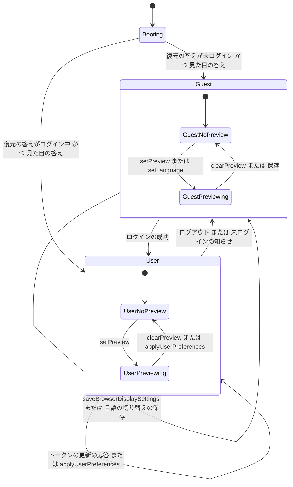

# Functional Spec — U4 表示の設定の土台（u4-display-foundation）

U4 は、すべての画面に表示の設定（言語・テーマの選択・文字の大きさ・インスタンスの見た目）を当てる仕組みと、要求の言語（`Accept-Language`）、ログインの画面の広げを受け持つ画面の単位（種類 ui）である。部品は AppFrame・ApiClient・AuthUi を広げる（`aidlc/spaces/default/intents/260925-user-management/inception/units-generation/unit-of-work.md`）。

- 正本: この文書は、画面の流れ（W1〜W12）と表示の設定の状態の移り変わりの正本である。U4 は画面の単位のため、保存するデータ（エンティティ）と `rules.md` を持たない。ブラウザに保存する値の形は 4節に、部品・props・state・API との受け渡しは `frontend-components.md` に置く。
- 出典: 質問と答え `functional-design-questions.md`（設計の要点 1〜18・決まっていること・Q1 A・Q2 A・Q3 A・Q4 A）、契約 C3・C7・C9（`aidlc/spaces/default/intents/260925-user-management/inception/contract-design/contract-summary.md`）、ADR-005・ADR-006・ADR-007（`inception/domain-design/decisions.md`）、要件 FR4.3・FR5.3〜FR5.5・FR7・FR8（`inception/requirements-analysis/requirements.md`）、ストーリー US3.2・US4.1 と共通の決まり CR1・CR2・CR6（`inception/user-stories/stories.md`）、画面 S2・S3・S4 と `interaction-spec.md`・`design-system-mapping.md`（`inception/refined-mockups/`）、依存する単位 U2・U8 の機能設計。
- 受け持たないこと: 各画面の中身（招待の管理 U5・登録の完了 U6・プリファレンスとパスワードの変更 U7）、利用者の設定の保存と検証（U2）、見た目の設定の読み取りと既定への置き換え（U8）。make-you-chic-ui（`vendor/make-you-chic-ui`）は変更しない（`project.md` の Forbidden）。

## 1. 用語

| 用語 | 意味 |
|---|---|
| 表示の設定 | 言語（`ja`・`en`）・テーマの選択（`light`・`dark`・`system`）・文字の大きさ（`sm`・`md`・`lg`）の3つの軸 |
| テーマの選択と解いたテーマ | テーマの選択は利用者が選ぶ3値。解いたテーマは画面に当てる2値（`light`・`dark`）。選択が `system` のときは OS の配色の設定で解く |
| 見た目の設定 | インスタンス全体のブランドカラー（`blue`・`green`・`purple`・`orange`）とフォントファミリー（`sans`・`serif`）。契約 C7 で受け取り、利用者は変えられない（FR8.1） |
| ブラウザの保存の値 | そのブラウザに最後に保存された表示の設定（U4 の鍵、4節）。利用者ごとではなくブラウザごと（FR5.5） |
| 利用者の設定 | ログインした利用者の内部DB の表示の設定と氏名（契約 C3 のログイン・更新の応答の `user`、保存の後は契約 C4 の値） |
| 当てている値 | 画面の土台として当てている表示の設定。ログインの後は利用者の設定、ログインの前はブラウザの保存の値（無い軸は既定） |
| 見せ方（未保存） | 保存していないが画面に当てている値。テーマ・文字の大きさの見せ方（`setPreview`）と、言語の見せ方（`setLanguage`）の2つ |
| 画面の値 | 実際に画面に当たる値。見せ方があれば見せ方、無ければ当てている値 |

## 2. 置き場と責務

| 置き場 | 部品 | この単位で足すこと |
|---|---|---|
| `frontend/src/app/display-settings/`（新しい） | AppFrame | 表示の設定の状態と口（契約 C9）、純粋な関数（解き方・保存の値の検証）、ブラウザの保存、見た目の設定の読み取りとゲート、OS の配色の追従、要求の言語の登録 |
| `frontend/src/app/login-handoff/`（新しい） | AppFrame | 登録の完了からログインの画面への1回だけの受け渡し（W9） |
| `frontend/src/app/`（既存を広げる） | AppFrame | `App` の並び、`I18nProvider` の言語を外から決める形、`LoginState` の任意の項目、`LoginStateGate` の整え方、`ShellLayout` の氏名、`LoginLayout` の右上の置き場、骨組みの文言 |
| `frontend/src/shared/api-client/`（既存を広げる） | ApiClient | 要求の言語の付与、トークンを付けない公開の API のパス（`/api/appearance`） |
| `frontend/src/features/auth/`（既存を広げる） | AuthUi | `CurrentUser` と `toLoginState` を C3 に合わせる、ログインの画面の言語の切り替え、登録の完了の後の案内とメールアドレスの持ち越し |

- 機能（`features/*`）は表示の設定を `frontend/src/app/display-settings/` の口だけで扱い、make-you-chic-ui の `useTheme` を直接呼ばない（設計の要点 1）。
- AppFrame は `features/auth` に依存しない。ログイン状態は既存の差し込み口「ログイン状態の提供元」から受ける（設計の要点 8）。ApiClient は AppFrame に依存せず、AppFrame が ApiClient に関数を登録する（既存の `registerAuthHandlers` と同じ形、設計の要点 12）。
- 既存の機能の登録の仕組み（`features/<featureId>/registration.ts`）は変えない（契約 C9、設計の要点 14）。

## 3. 決まり（画面の単位の設計の決まり）

画面の単位のため `rules.md` は作らない。流れの中で守る決まりを、ここに D1〜D14 として1回だけ書く。

| ID | 決まり | 出典 |
|---|---|---|
| D1 | 画面の値は「見せ方があれば見せ方、無ければ当てている値」。当てている値は、ログインの後は利用者の設定、ログインの前はブラウザの保存の値。ブラウザの保存の値が無い軸は、言語がブラウザの言語設定（既存の `resolveLanguage`）、テーマの選択が `system`、文字の大きさが `md` | 設計の要点 2・5・7、FR5.4、FR5.5 |
| D2 | ログインの後は、同じブラウザに残った前の利用者の値（ブラウザの保存の値・見せ方）を使わない。ログイン状態が新しくなった時点で見せ方を捨てる | FR5.4、AC4.1.5、AC4.1.9 |
| D3 | ログイン状態が変わったときは、同じ描画の中で言語の文言を切り替え、テーマ・文字の大きさは画面に出る前（描画の確定の直後、子の副作用より前）に make-you-chic-ui に渡す。ログインの後の最初の画面に前の利用者の見た目が出ない | 設計の要点 9、AC4.1.5 |
| D4 | テーマの選択が `system` のときは、OS の配色の設定（`prefers-color-scheme: dark`）で `light`・`dark` に解き、make-you-chic-ui の `setTheme` には解いた値だけを渡す。画面を開いている間の OS の切り替えにも追従する（ログインの前後、登録の完了とプリファレンスの画面で見せている間も同じ） | 設計の要点 3、Q1 A、FR5.3、AC4.1.3 |
| D5 | ブラウザの保存の値は U4 の鍵だけを正とする。make-you-chic-ui の鍵（`design-system-theme`・`design-system-font-size`）は写しとして扱い、最初に描く前に U4 の鍵の値で書き直す。ほかのタブへの映り方は make-you-chic-ui の今の動きのまま受け入れる | Q3 A、設計の要点 5 |
| D6 | ブラウザに保存するのは次の時点だけ。(a) ログインの成功・画面を開いたときのセッションの復元・トークンの更新の応答で利用者の設定を受けたとき、(b) `applyUserPreferences`（プリファレンスの保存の成功）、(c) `saveBrowserDisplaySettings`（登録の完了）、(d) ログインの画面の言語の切り替え（言語だけ）。見せ方（`setPreview`・`setLanguage`）とログアウトでは保存しない・消さない | 設計の要点 6、AC4.1.6、AC3.2.18 |
| D7 | ブラウザの保存の値の読み書きは例外を外へ出さない。ブラウザの保存が使えないときは保存せずに動く。3つの値は項目ごとに検証し、無い・壊れた・知らない値の項目はその項目だけを無いものとして D1 の既定で解く | 設計の要点 5 |
| D8 | 保存の後の利用者の設定は、そのときのログイン状態に結び付けて持つ。ログイン状態が新しくなったら（ログイン・復元・トークンの更新の応答）新しいほうを使う。どちらも内部DB の値のため食い違わない。ユーザーメニューの氏名も同じ値から出す | 設計の要点 10、AC4.1.8 |
| D9 | すべての要求（認証の API を含む）に、画面の言語を `Accept-Language` として付ける。呼び出し側が明示した `Accept-Language` は上書きしない | 設計の要点 12、ADR-005、CR1.2 |
| D10 | `/api/appearance` はトークンを付けず、401 での更新と送り直しもしない公開の API のパスとして扱う | 設計の要点 13、U8 の機能設計の Q1 A |
| D11 | 見た目の設定は、画面を開いたときに1回だけ、セッションの復元と並べて読み、両方の答えが出るまで画面を描かない。読み取りに失敗したら前に当てた値（無ければ `blue`・`sans`）で描き、読み直さない。利用者の操作で変える手段は置かない | Q2 A、設計の要点 13、FR8.1、CR2 |
| D12 | 言語の選択肢はそれぞれの言語の名前（「日本語」「English」）で示し、`lang` 属性を付ける。訳さない | CR6.6 |
| D13 | 登録の完了からログインの画面へのメールアドレスの受け渡しは、画面の中のメモリだけで1回だけ行う。URL に載せず、ブラウザにも保存しない。読み込み直すと案内は出ない | 設計の要点 15、AC3.2.17 |
| D14 | 画面の言語が変わったら、同じ時点で文言・`<html lang>`・要求の言語を切り替える | 設計の要点 11、CR1.3 |

## 4. ブラウザの保存の鍵と make-you-chic-ui の鍵

### 4.1 U4 の鍵

| 項目 | 値 |
|---|---|
| 置き場 | ブラウザの localStorage |
| 鍵 | `mastersmith.display-settings`（1つの鍵に3つの値をまとめる） |
| 形 | JSON。項目は `language`（`ja`・`en`）・`theme`（`light`・`dark`・`system`）・`fontSize`（`sm`・`md`・`lg`）。どの項目も任意 |
| 読み方 | JSON として読めなければ全体を無いものとする。読めたら項目ごとに D7 で検証する |
| 書き方 | D6 の (a)〜(c) では3つをまとめて書く。(d) は読み直した今の値の `language` だけを置き換えて書く（ほかの2つは保存済みのまま。無い項目は無いまま残す） |
| 持たないもの | トークン・メールアドレス・氏名・見せ方（未保存）の値。表示の設定はトークンではないため、ブラウザに保存してよい（既存の `frontend/src/features/auth/authSession.ts` はトークンと利用者をメモリだけに持つ決まりのまま） |

### 4.2 make-you-chic-ui の鍵との関係（Q3 A）

| make-you-chic-ui の鍵 | 扱い |
|---|---|
| `design-system-theme` | 写し。画面を開いたとき、最初に描く前に、U4 の鍵のテーマの選択を D4 で解いた値で書き直す（U4 の鍵が無ければ OS の配色で解いた値）。以降は make-you-chic-ui の `setTheme` が書く（見せ方でも書き換わる） |
| `design-system-font-size` | 写し。最初に描く前に、U4 の鍵の文字の大きさ（無ければ `md`）で書き直す。以降は `setFontSize` が書く |
| `design-system-brand`・`design-system-font-family` | 見た目の設定の「前に当てた値」の置き場として使う。最初に描く前には書き直さない。見た目の設定の読み取りに成功したら `setBrand`・`setFontFamily` で上書きする（`design-system-mapping.md` の3節） |

- 書き直しは、make-you-chic-ui の ThemeProvider が保存の値を読むより前に1回だけ行う。読み込み直した直後に古い見た目（前の見せ方のまま残った値）が出ないようにするため。
- ほかのタブ: make-you-chic-ui は `design-system-*` の鍵の変化を受けてほかのタブの見た目を変える。U4 はこれを止めない。テーマ・文字の大きさの見た目は見せ方も含めてほかのタブに映り、見せ方をやめると戻る。言語とテーマの選択の `system` はほかのタブに映らない。U4 はほかのタブで起きた make-you-chic-ui の変化を打ち消さない（U4 が make-you-chic-ui に値を渡すのは、そのタブの画面の値が変わったときだけ、`frontend-components.md` の 3.2）。

## 5. 表示の設定の状態の移り変わり

表示の設定は、「ログイン状態による土台（起動中・ログインの前・ログインの後）」と「見せ方の有無」の組で表す。

| 状態 | 当てている値 | 入る時点 |
|---|---|---|
| Booting（起動中） | 画面を描かない | 画面を開いた |
| Guest（ログインの前） | ブラウザの保存の値（D1） | ログイン状態の最初の答えが未ログインで、見た目の設定の答えも出た。ログアウト。未ログインになった知らせ |
| User（ログインの後） | 利用者の設定（D1・D8） | ログイン状態の最初の答えがログイン中で、見た目の設定の答えも出た。ログインの成功。トークンの更新の応答 |

| 見せ方 | 意味 | 入る時点 | 抜ける時点 |
|---|---|---|---|
| NoPreview | 画面の値 ＝ 当てている値 | 既定 | — |
| Previewing | テーマ・文字の大きさの見せ方、または言語の見せ方がある | `setPreview`・`setLanguage` | `clearPreview`・`applyUserPreferences`・`saveBrowserDisplaySettings`・ログイン状態が新しくなった。言語の見せ方はログインの画面の言語の切り替え（言語だけを保存）でも抜ける |

<!-- Text fallback: 画面を開くと Booting（何も描かない）になり、セッションの復元と見た目の設定の両方の答えが出たら、未ログインなら Guest、ログイン中なら User になる。Guest からはログインの成功で User へ、User からはログアウトか未ログインになった知らせで Guest へ移る。User のままトークンの更新の応答や applyUserPreferences を受けると、当てている値を新しい利用者の設定に置き換える。Guest で saveBrowserDisplaySettings かログインの画面の言語の切り替えを受けると、ブラウザの保存の値を書き換えて当てる。どちらの土台の中でも、setPreview（Guest では setLanguage も）で Previewing に入り、clearPreview か保存で NoPreview に戻る。土台が移るとき（Guest と User の間）は見せ方を捨て、移った先の NoPreview から始まる。 -->

- 土台が移るとき（Guest と User の間、User のままログイン状態が新しくなったとき）は見せ方を捨てる（D2）。
- User のまま `setLanguage` を呼んだときも言語の見せ方として扱うが、今の画面の決まりでは使わない（プリファレンスの画面の言語は保存するまで変えない、ストーリーの M8）。
- User のまま `saveBrowserDisplaySettings` を呼んだときは、ブラウザの保存の値だけを書き換え、当てている値（利用者の設定）は変えない（登録の完了はログインの前の画面だけが呼ぶ）。
- Guest のまま `applyUserPreferences` を呼んだときは何もしない（プリファレンスの画面はログインの後だけ）。

## 6. 画面の流れ

### W1. 画面を開く（起動）

1. 登録の読み込みと検査は既存のとおり行う（`frontend/src/app/App.tsx`）。
2. make-you-chic-ui の ThemeProvider が保存の値を読むより前に、U4 の鍵を読み（D7）、make-you-chic-ui の写しの鍵（`design-system-theme`・`design-system-font-size`）を書き直す（4.2、D5）。
3. 見た目の設定の読み取り（W3）を始める。これは次のセッションの復元と並べて進む。
4. ログイン状態の提供元（AuthUi）がセッションの復元（トークンの更新の要求）を始める（既存の `LoginStateGate`）。
5. W2 のゲートを経て、最初の画面を描く。登録に問題があって起動を止めるとき（既存の起動の誤りの画面）も、表示の設定と言語は同じ仕組みで当てる。

### W2. セッションの復元と見た目の設定の並べ読み（ゲート）

1. ログイン状態の最初の答えが出るまで、既存のとおり何も描かない。
2. 見た目の設定の答え（成功または失敗）が出るまで何も描かない（Q2 A、D11）。2つは並べて読むため、待ちはほとんど増えない。
3. 両方の答えが出たら、ログイン状態に応じて W4（未ログイン）か W5（ログイン中）の値で、最初の画面を描く。最初の描画から当てた値で表示する（AC4.1.9）。
4. 待ちに上限は置かない（Q2 A。セッションの復元の今の待ち方と同じ）。

### W3. 見た目の設定の読み取りと当て方（C7）

1. `GET /api/appearance` を、トークンを付けずに1回だけ呼ぶ（D10）。
2. 応答の `brandColor`・`fontFamily` が契約 C7 の許される値なら、make-you-chic-ui の `setBrand`・`setFontFamily` で当てる。`<html>` の `data-brand`・`data-font-family` は make-you-chic-ui が変える。当てた値は make-you-chic-ui の鍵に残り、次に開いたときの「前に当てた値」になる。
3. 失敗（通信の失敗・200 以外・形の誤り）のときは当てず、make-you-chic-ui がすでに持つ値（前に当てた値。無ければ make-you-chic-ui の既定 `blue`・`sans`）のまま描く。項目ごとに許されない値のときも、その項目は当てない。読み直さず、画面は止めない（CR2 は Should）。
4. 利用者の操作でブランドカラー・フォントファミリーを変える手段は、どの画面にも置かない（FR8.1）。ほかの機能は make-you-chic-ui の `setBrand`・`setFontFamily` を呼ばない（2節の決まり）。
5. ログインの前後を問わず、ログインの画面・登録の完了の画面・管理画面のどれにも同じ値が当たる（CR2 の画面側の確かめ方）。

### W4. ログインの前の画面（Guest）

1. 当てている値は、ブラウザの保存の値。無い軸は D1 の既定（ブラウザの言語設定・`system`・`md`）。
2. テーマの選択が `system` なら OS の配色で解き（D4）、W11 のとおり追従する。
3. 画面の言語で文言・`<html lang>`・要求の言語をそろえる（D14、W12）。
4. これはログインの画面・登録の完了の画面・起動の誤りの画面に当たる（FR5.5、AC4.1.6）。

### W5. ログインの後（User）: ログインの成功・セッションの復元・トークンの更新の応答

1. AuthUi が、ログインか更新の応答の `user`（契約 C3 の `displayName`・`language`・`theme`・`fontSize`）をログイン状態として知らせる（`frontend-components.md` の 5節）。
2. AppFrame は新しいログイン状態を受けた描画の中で、当てている値を利用者の設定に置き換え、見せ方を捨てる（D2・D8）。前の利用者のブラウザの保存の値は使わない（FR5.4）。
3. 同じ描画で言語の文言を切り替え、画面に出る前にテーマ（`system` なら D4 で解いた値）と文字の大きさを make-you-chic-ui に渡し、`<html lang>` と要求の言語を変える（D3・D14）。ログインの後の最初の画面から利用者の見た目になる（AC4.1.5）。
4. 利用者の設定をブラウザにも保存する（D6 の (a)）。ブラウザの保存の値を消してからログインし直しても、内部DB の設定で表示される（AC4.1.2）。
5. ユーザーメニューに `displayName`（氏名）を出す（AC4.1.8、AC4.1.9）。
6. ログイン状態に表示の設定が無い（古い形の提供元・テストの偽の提供元）ときは、ブラウザの保存の値を当て続ける（既存の画面のテストとの互換）。表示の設定の値が契約の値から外れている項目は、D1 の既定で解く。

### W6. ログアウトの後

1. ログアウトか、更新の失敗による未ログインの知らせで、ログイン状態が未ログインになる（既存の `frontend/src/features/auth/authSession.ts`）。
2. AppFrame は土台を Guest に移し、見せ方を捨てる。ブラウザの保存の値は消さない（D6）。
3. ログインの画面は、そのブラウザに最後に保存された値（多くはログアウトした利用者の設定）で表示される。保存された値が無ければブラウザの言語設定と OS の配色で表示される（AC4.1.6）。

### W7. ログインの画面の言語の切り替え（S3、Could）

1. ログインの画面の右上に言語の切り替え（`LoginLanguageSwitch`）を置く。選択肢は「日本語」「English」で、それぞれに `lang` 属性を付ける（D12）。今の画面の言語が選ばれた状態で示す。
2. 選ぶと、画面の言語を切り替え（文言・`<html lang>`・要求の言語、D14）、ブラウザの保存の値の言語だけを書き換える（D6 の (d)。テーマ・文字の大きさは保存済みのまま）。次にログインの画面を開いたときもその言語になる。
3. 切り替えた後に誤ったパスワードでログインすると、エラーの説明文は切り替えた言語で返る（CR1.2、CR1.5 の確かめ方）。
4. 切り替えた後もフォーカスは選んだボタンのまま（`interaction-spec.md` の 6節）。
5. 登録の完了の画面には言語の切り替えを置かない。登録の完了の画面の言語は、その画面の「言語」の項目で切り替わる（W8、refined-mockups の Q4 C）。

### W8. 登録の完了の画面の表示の設定（U6 が口を使う）

U6（`features/registration`）の画面で、U4 の口を次のとおり使う。U4 はこの使い方を口の約束として持ち、画面の中身は U6 が受け持つ（設計の要点 16）。

1. 開いた時点（リンクの確かめが通った時点）で、招待の言語を `setLanguage` で当てる（言語の見せ方）。テーマ・文字の大きさは当てている値（ブラウザの保存の値、FR4.3）のまま（AC3.2.1）。
2. テーマ・文字の大きさを選んだ時点で `setPreview(theme, fontSize)` を呼び、画面に見せる（refined-mockups の Q3 A）。テーマ `system` を選んだ間も OS の切り替えに追従する（D4）。
3. 「言語」の項目を選んだ時点で `setLanguage` を呼び、画面の言語を切り替える（以降の要求の言語もそろう、CR1.2）。
4. 登録の完了が成功したら、選んだ3つを `saveBrowserDisplaySettings` で保存し（見せ方は捨てる。D6 の (c)）、W9 の受け渡しをしてから、ログインの画面へ移る。ログインの画面は選んだ3つで表示される（AC3.2.18）。
5. 完了せずに画面を離れるときは `clearPreview` を呼び、言語の見せ方とテーマ・文字の大きさの見せ方をやめる（ブラウザの保存の値に戻る）。

### W9. 登録の完了からログインの画面への受け渡し（S2 → S3）

1. U6 は完了の成功のとき、招待のメールアドレスを U4 の受け渡しの口（`handOffToLogin`）に渡してから、ログインの画面（`/login`）へ移る。URL にメールアドレスを載せない（D13）。
2. ログインの画面（AuthUi）は、最初に描くときに受け渡しの値を1回だけ受け取る。値があれば、フォームの上に登録が終わった旨の案内（Alert、「登録が完了しました。設定したパスワードでログインしてください。」）を出し、メールアドレスの欄に受け取ったメールアドレスを入れておく（AC3.2.17、S2 の [assumption]）。
3. 受け取った値は、描画の確定の後に受け渡しの口から消す。開発時の StrictMode の二重の描画でも失われず、2回目に開いたログインの画面には出ない。
4. 読み込み直すと受け渡しの値は無く、案内は出ない。値はブラウザの保存にも URL にも残らない。
5. 受け渡しの値はメールアドレスだけで、パスワード・招待のトークンは渡さない。

### W10. プリファレンスの画面の見せ方と保存の後（U7 が口を使う）

U7（`features/preferences`）の画面で、U4 の口を次のとおり使う（設計の要点 16）。

1. テーマ・文字の大きさを選んだ時点で `setPreview(theme, fontSize)` を呼び、保存の前から画面に見せる（AC4.1.11）。
2. 言語を選んでも口は呼ばない。画面の言語は保存するまで変えない（ストーリーの M8）。
3. 「元に戻す」を押したときと、保存せずに画面を離れるとき（部品が外れるとき）に `clearPreview` を呼び、当てている値に戻す（AC4.1.11、S4 の [assumption]）。
4. 保存が成功したら、応答の値（契約 C4 の `displayName`・`language`・`theme`・`fontSize`）で `applyUserPreferences` を呼ぶ。AppFrame は当てている値と氏名を置き換え（D8）、見せ方を捨て、ブラウザにも保存する（D6 の (b)）。言語を変えたときは同じ描画で文言・`<html lang>`・要求の言語が切り替わる（AC4.1.4、D14）。
5. U7 は `applyUserPreferences` を呼んだ後に成功の Toast を出す。Toast の文言は新しい言語で出る（AC4.1.12 は U7 が確かめる）。
6. ユーザーメニューの名前は保存した直後から新しい氏名になる。ログインし直しても、C3 の `displayName` で同じ氏名になる（AC4.1.8）。

### W11. OS の配色の追従（Q1 A）

1. テーマの画面の値が `system` の間、OS の配色の設定の変化を受け取る。
2. 変化を受けたら、画面を開いたまま `light`・`dark` を解き直して make-you-chic-ui に渡す（D4）。
3. ログインの前後、登録の完了の画面・プリファレンスの画面で `system` を見せている間も同じ（AC4.1.3）。
4. テーマの画面の値が `light`・`dark` の間は、OS の変化を受けても何もしない。
5. ブラウザが OS の配色の設定を扱えないときは `light` として解く（make-you-chic-ui の今の扱いと同じ）。

### W12. 要求の言語（ADR-005、CR1.2）

1. AppFrame は画面を開いたときに、ApiClient へ「今の画面の言語を返す関数」を登録する。
2. ApiClient は、すべての要求（認証の API・公開の API を含む）に、その関数が返す言語を `Accept-Language` として付ける（D9）。
3. ログインの前は画面の言語（ブラウザの保存の値・ブラウザの言語設定・ログインの画面の切り替え・登録の完了の画面の「言語」の項目）、ログインの後は利用者の言語（W5）が画面の言語になるため、「ログインの前は画面の言語、ログインの後は利用者の言語」がこの1つの決まりで満たされる（CR1.1、CR1.2）。
4. AppFrame が関数の返す値を更新するのは、画面の言語が変わった描画の確定の直後、子の部品の副作用より前とする。言語が変わった後に子の部品が送る要求は新しい言語を持つ。
5. ログインの要求はログインの前の画面の言語で送られ、ログインの後の要求は利用者の言語で送られる。
6. 関数が登録されていないとき（ApiClient の単体のテストなど）は付けない。サーバーは今までどおり `Accept-Language` が無ければ既定の言語で返す。

## 7. 失敗の場合とふるまい

| 場合 | ふるまい | 出典 |
|---|---|---|
| ブラウザの保存が使えない（例外） | 読めなければ無いものとし、書けなければ保存せずに続ける。画面は止めない | D7 |
| U4 の鍵の JSON が壊れている・知らない値がある | 壊れていれば全体、知らない値はその項目だけを無いものとして既定で解く | D7 |
| 見た目の設定の読み取りの失敗 | 前に当てた値（無ければ `blue`・`sans`）で描き、読み直さない。利用者への知らせは出さない | D11、Q2 A |
| 見た目の設定の応答が許されない値 | その項目だけ当てない | W3 |
| ログイン状態の応答に表示の設定が無い・値が外れている | 無ければブラウザの保存の値、外れた項目は D1 の既定で解く | W5 |
| OS の配色の設定を扱えない | `light` として解く | W11 |
| 受け渡しの値が無いままログインの画面を開いた | 案内を出さず、メールアドレスの欄は空 | W9 |

## 8. 文言

- 文言は ja・en の両方を用意する（NFR8、CR1.4）。骨組みの文言は `frontend/src/app/i18n/messages/`、AuthUi の文言は `frontend/src/features/auth/registration.ts` の `messages` に置く。
- 足す文言:

| 鍵 | ja | en | 置き場 |
|---|---|---|---|
| `auth.login.registered` | 登録が完了しました。設定したパスワードでログインしてください。 | Registration is complete. Log in with the password you set. | AuthUi |
| `auth.language.label` | 表示の言語 | Display language | AuthUi |
| `display.theme.system` | OS に合わせる | Match OS | 骨組み（U6・U7 が使う） |
| `display.theme.light` | ライト | Light | 骨組み |
| `display.theme.dark` | ダーク | Dark | 骨組み |
| `display.fontSize.sm` | 小 | Small | 骨組み |
| `display.fontSize.md` | 標準 | Medium | 骨組み |
| `display.fontSize.lg` | 大 | Large | 骨組み |

- 言語の選択肢の名前（「日本語」「English」）は訳さない固定の値として骨組みが持ち、U6・U7 も同じ値を使う（D12）。
- テーマ・文字の大きさの選択肢の文言は `design-system-mapping.md` の4節の値。U6・U7 が同じ文言を使えるよう骨組みに置く。

## 9. フォントファミリー serif の明朝体（Q4 A）と採用の記録

### 9.1 方針

- `@fontsource/noto-serif-jp` をフロントエンドの実行時の依存（`dependencies`）に足し、Noto Sans JP と同じ太さ（400・500・600・700）の japanese・latin のサブセットを自前で配信する。読み込みは画面の入口（`frontend/src/main.tsx`）で、既存の Noto Sans JP と同じ形で行う（make-you-chic-ui の組み込みガイドの手順）。
- フォントのファイル（woff2）は、ブラウザが明朝体の文字を描くときにだけ読まれる。フォントファミリーが `sans` のインスタンスでは読まれない。
- CSP は `font-src 'self'` のため外部のフォントは読めない。自前の配信のため CSP は変えない（`backend/src/main/resources/application.yaml`）。
- 初回の読み込みの JavaScript の大きさ（`frontend/scripts/check-bundle-size.mjs` が測る値）は増えない（フォントは CSS とフォントのファイル）。配信する `dist` と WAR は大きくなる。
- 版は lockfile で固定し、実行時の依存として依存関係の脆弱性検査（High 以上で統合を止める）の対象に入る（`team.md`）。版と推移依存の有無はコード生成で確かめて記録する。

### 9.2 採用の記録（ADR 形式。`team.md` の「Apache License 2.0 と異なるライセンスは採用の理由を設計の記録に残す」による）

- **Context**: make-you-chic-ui の `serif` は 'Noto Serif JP'・ヒラギノ明朝・游明朝・serif の順に指定している（`vendor/make-you-chic-ui/packages/make-you-chic-ui/src/theme/tokens.css`）が、今の画面は Noto Sans JP だけを配信している。見た目の設定の `serif`（FR8、CR2）を OS によらず同じに見せるには、Noto Serif JP を配信する必要がある。`@fontsource/noto-serif-jp` のライセンスは SIL Open Font License 1.1（OFL-1.1）で、このリポジトリの Apache License 2.0 と異なる。
- **Decision**: `@fontsource/noto-serif-jp` を採用し、400〜700 の japanese・latin を自前で配信する（Q4 A）。OFL-1.1 を採用してよいと判断した理由: (1) フォントを画面に組み込んで配信することは OFL-1.1 で許されている。(2) フォントそのものを改変せず、単独で販売もしないため、OFL-1.1 の条件（改変したフォントの名前の制限・単独での販売の禁止）に触れない。(3) フォントのライセンスは画面のコード（Apache License 2.0）に及ばない。(4) 既に採用している `@fontsource/noto-sans-jp` と同じライセンス・同じ配布元で、扱いが増えない。
- **Consequences**: 良い点: `serif` の見た目が OS によらず同じになる。外部のフォントの配信に頼らず、CSP を変えずに済む。悪い点: 配信する `dist` と WAR が大きくなる。フォントのライセンスの表示を、配布物の第三者のライセンスの扱い（配備先が決まってから入れる SBOM など）で扱う必要がある。
- **Alternatives Rejected**: 太さを 400・700 だけにする（Q4 B）: `dist` の増えは抑えられるが、500・600 が近い太さで代わりに描かれ、sans と見た目の太さの段が揃わない。足さずに OS の明朝体に任せる（Q4 C）: 依存は増えないが、OS によって見た目が変わり、明朝体の無い環境では `serif` の総称のフォントになる。

## 10. テストの方針

`team.md` の Testing Posture に従う（テストは対象と同じ場所の `*.test.ts(x)`、Vitest・Testing Library（jsdom）・user-event・vitest-axe、画面部品ごとにアクセシビリティの検査を1件、テストの説明文は英語、フロントエンドのカバレッジの下限は行 80%・分岐 70%）。確かめる内容の一覧は `frontend-components.md` の 7節に置く。

- 性質ベースのテスト（fast-check、失敗時の種を記録）: 保存の値の読み取りと検証、テーマの選択と OS の配色から解く関数、ブラウザの言語設定から言語を解く関数、画面の値を決める関数。
- OS の配色は `matchMedia` の差し替えで作り、変化の知らせを送って追従を確かめる。
- 既存の画面のテスト（`frontend/src/app/testing/renderWithProviders.tsx` を使うものを含む）が通り続けることを確かめる（設計の要点 18）。

## 11. 上流との対応の要約

| 上流 | この文書の置き場 |
|---|---|
| FR5.3・AC4.1.3（テーマ system と追従） | D4、W11 |
| FR5.4・AC4.1.2・AC4.1.5・AC4.1.9（ログインの後の適用） | D2・D3・D8、W5 |
| FR5.5・AC4.1.6（ログインの前の画面） | D1・D6、W4・W6 |
| AC4.1.4・AC4.1.8・AC4.1.11（保存の後・見せ方） | W10 |
| FR4.3・AC3.2.1・AC3.2.17・AC3.2.18（登録の完了） | W8・W9 |
| CR1.2・ADR-005（要求の言語） | D9、W12 |
| CR1.3（`<html lang>`） | D14 |
| CR1.5・CR6.6（ログインの画面の言語の切り替え） | D12、W7 |
| CR2・FR8・ADR-006（見た目の設定） | D10・D11、W3 |
| Q4 A（Noto Serif JP） | 9節 |

画面の単位のため、エンティティの関係図と `rules.md` の要約は無い（U4 はアプリが保存するデータを持たない）。
