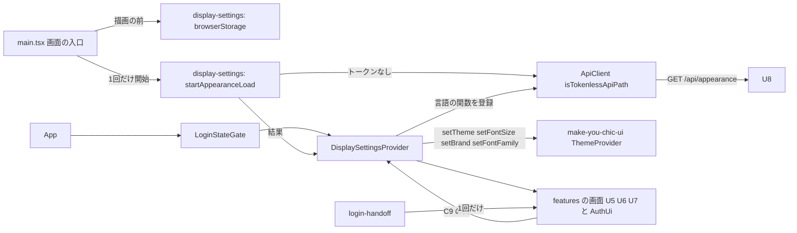

# Logical Components — U4 表示の設定の土台（u4-display-foundation）

U4 の部品の一覧と、非機能の設計がどの部品に当たるかの見取り図です。この文書には、次のものも置きます。

- 失敗の範囲と、影響の広がり
- アクセシビリティ（実際のブラウザの検査の置き場・組・既存の E2E への非干渉）
- 多言語
- テストの作り

答えは `nfr-design-questions.md` にあります（Q1: A、Q2: A、Q3: A、Consolidated Summary Confirmation: Looks correct）。

出典の略号:

- NFR: この単位の NFR 要件 `construction/u4-display-foundation/nfr-requirements/` の枝番
- D・W: この単位の機能設計 `construction/u4-display-foundation/functional-design/functional-spec.md`
- 部品 n節: 同じフォルダの `frontend-components.md`
- 要点 n: この段の `nfr-design-questions.md` の「NFR 設計の要点（案）」の番号
- R-01・R-02: NFR 要件の段のレビューの Minor の指摘（承認の場で Accepted risk。コード生成で拾う）

成果物ごとの置き場は、`performance-design.md` の冒頭の表のとおりです。この文書の節は次のとおりです。

| 節 | 置く設計 |
|---|---|
| 1〜3節 | 部品の一覧・関係・失敗の範囲 |
| 4節 | 拡張性・信頼性・観測性の扱い（ui の単位のため成果物を作らない） |
| 5節 | 実際のブラウザの検査（NFR7.3・NFR7.5・NFR9.11、R-01・R-02） |
| 6節 | アクセシビリティの画面部品の側（NFR7.1・NFR7.2・NFR7.4）と多言語（NFR8.1・NFR8.2） |
| 7節 | テストとカバレッジ（NFR9.8〜NFR9.10） |

## 1. 部品の一覧

置き場は機能設計の2節のとおりです。モジュールの名前は仮で、コード生成で決めます。

| 部品（仮の名前） | 置き場 | 受け持つこと | 当たる非機能の設計 |
|---|---|---|---|
| 見た目の設定の読み取り（`startAppearanceLoad`） | `frontend/src/app/display-settings/` | 描画の外で1回だけ `GET /api/appearance` を呼び、例外で終わらない結果を返す。項目ごとに C7 の値だけを通す | NFR6.2・NFR9.3（`performance-design.md` の2節、`security-design.md` の4節） |
| ブラウザの保存（`browserStorage`） | 同上 | U4 の鍵と写しの鍵の読み書き。例外を外へ出さない | NFR2.2（`security-design.md` の1節） |
| 解き方の純粋な関数（`resolve*`） | 同上 | 保存の値の検証、テーマの解き方、言語の解き方、画面の値の決め方 | NFR9.9・NFR9.2 |
| 表示の設定の置き場と `DisplaySettingsProvider`・`useDisplaySettings` | 同上 | 3.3 の値の保持、ゲート、make-you-chic-ui への反映、`<html lang>`、要求の言語の関数の登録 | NFR6.2・NFR7.4 |
| 受け渡し（`handOffToLogin`） | `frontend/src/app/login-handoff/` | メールアドレスを1回だけ持つ | NFR2.1 |
| ApiClient（トークンを付けないパスの一覧と判定、`Accept-Language`） | `frontend/src/shared/api-client/` | 1つの一覧と1つの判定（Q3: A）、許される言語だけを付ける | NFR9.1・NFR9.2 |
| `LoginLanguageSwitch`・`LoginForm`（広げる） | `frontend/src/features/auth/` | 言語の切り替え、登録の完了の案内 | NFR7.2・NFR7.4・NFR8 |
| `ShellLayout`・`LoginLayout`・`I18nProvider`（広げる） | `frontend/src/app/` | 氏名、右上の置き場、外から言語を受ける | NFR7.2・NFR8 |
| 画面の入口（広げる） | `frontend/src/main.tsx` | Noto Serif JP の8つの CSS、写しの鍵の書き直し、読み取りの開始 | NFR6.4・NFR9.4 |
| 実際のブラウザの検査 | `frontend/e2e/050-display-accessibility.e2e.ts`（見込み） | 組ごとの axe と横のはみ出し、最初の画面の時間の測定 | NFR6.1・NFR7.3・NFR9.11（5節） |
| 検査の手伝い | `frontend/e2e/support/`（見込み） | 組の切り替え、axe-core の読み込みと実行、はみ出しの判定、CSP の違反の集め | 5節、`security-design.md` の6節 |

- 機能（`features/*`）は、表示の設定を `display-settings` の口（契約 C9）だけで扱います。make-you-chic-ui の `useTheme` と localStorage を直接触りません。
- 検査の2つの部品（`frontend/e2e/` の下）は、画面の成果物（`dist`）に入りません。`frontend/src/` から読み込まないためです。

## 2. 部品の関係

<!-- Text fallback: 画面の入口（main.tsx）は、描画の前にブラウザの保存の部品で写しの鍵を書き直し、見た目の設定の読み取りを1回だけ始める。読み取りは ApiClient を通り、トークンを付けないパスとして GET /api/appearance を U8 に送る。App は LoginStateGate の中に DisplaySettingsProvider を置き、DisplaySettingsProvider は読み取りの結果を受けて、make-you-chic-ui の ThemeProvider に setTheme・setFontSize・setBrand・setFontFamily で値を渡し、ApiClient に言語の関数を登録する。機能の画面（U5・U6・U7 と AuthUi）は C9 の口だけで表示の設定を使う。受け渡しの部品は、登録の完了からログインの画面へメールアドレスを1回だけ渡す。 -->

## 3. 失敗の範囲と影響の広がり

失敗の範囲は、ブラウザの1つのタブの中に閉じます。サーバーの状態は変えません。

| 失敗 | 影響の広がり | 扱い | 出典 |
|---|---|---|---|
| ブラウザの保存が使えない・壊れている | そのタブの表示の設定だけ | 既定の値で描く。書けなければ保存せずに続ける | D7 |
| 見た目の設定の読み取りの失敗（通信の失敗・200 以外・形の誤り） | ブランドカラーとフォントファミリーだけ | 前に当てた値（無ければ `blue`・`sans`）で描き、読み直さない | D11、W3 |
| 見た目の設定の応答が返らない（ハング） | すべての画面の最初の描画（ログインの画面・登録の完了の画面・起動の誤りの画面を含む） | 待ちに上限を置かない（依頼者が受け入れた決定）。U8 が I/O を持たないことと、実際のブラウザの測定で支える（`performance-design.md` の 2.2） | W2 の5、7節 |
| セッションの復元の失敗 | ログイン状態だけ | 既存のとおり未ログインとして描く | 既存の `LoginStateGate` |
| 公開の API に期限切れのトークンが残っている | 起きない | トークンを付けない | D10、`security-design.md` の3節 |
| make-you-chic-ui の API が変わる（固定先の更新） | 表示の設定の当て方 | 固定先の更新は B4 の専用のコミットで、使う API が変わっていないことを前提とする。同梱版でビルドと既存のテストが通ることを確かめる | NFR9.7 |

共有する資源:

- localStorage（make-you-chic-ui の鍵と同じ置き場）
- `<html>` の属性（`lang`・`data-*`）
- ApiClient のモジュールの状態（登録した関数）

どれもそのタブの中だけで、ほかの利用者と共有しません。

## 4. 拡張性・信頼性・観測性の扱い

段の定義（`produces_kinds`）により、ui の単位ではこの3つの設計の文書を作りません。U4 での扱いだけを書きます。

| 分類 | 扱い |
|---|---|
| 拡張性 | 状態はブラウザのタブの中だけで、サーバーに状態を足さない。サーバーの負荷は、画面を開くたびの `GET /api/appearance` 1件（U8 の NFR6.1 で押さえる）だけ増える |
| 信頼性 | 3節のとおり、失敗は既定の値で描く。再試行・サーキットブレーカー・時間切れは置かない（当てる相手は U8 の I/O を持たない API と既存の認証だけで、待ちに上限を置かない決定のため） |
| 観測性 | 画面の側に、独自の指標・ログの送り先・外部への送信を足さない。`console` にトークン・メールアドレス・氏名を出さない。サーバーの側の要求の数と時間は、既存の `http.server.requests` で見える（U8 の NFR 設計） |

## 5. 実際のブラウザの検査（NFR7.3・NFR7.5・NFR9.11、R-01・R-02、Q1: A・Q2: A）

### 5.1 置き場と既存の E2E への非干渉（R-01）

| 項目 | 作り |
|---|---|
| ファイル | 新しいファイル `frontend/e2e/050-display-accessibility.e2e.ts`（番号は見込み、コード生成で決める）。既存の 010〜040 の後の番号にし、既存の4つのファイルの実行順と前提を変えない。既存のファイルは変えない |
| 実行 | `./gradlew e2eTest` の中（`./gradlew verify` と CI の外）。`playwright.config.ts` の `workers: 1`・`fullyParallel: false` のまま、番号の順で最後に動く |
| 本数 | 流れの E2E ではないため、`team.md` の「機能の Intent ごとに代表の流れを1本まで」に数えない（NFR9.11） |
| ブラウザの状態 | 組ごとに `browser.newContext()` で新しいコンテキストを作り、終わったら閉じる。表示の設定の値（U4 の鍵と make-you-chic-ui の鍵）は、そのコンテキストの localStorage にだけ置かれ、ほかのテストに持ち越さない。既定へ戻す処理は要らない |
| 要求の差し替え | `page.route` は、そのコンテキストのページの中だけで効く。ほかのテストの要求に及ばない |
| サーバーの状態 | B4 の検査（ログインの画面）はログインせず、ログインの要求も送らない。内部DB・監査の記録・ロックの回数を変えない。既存の 010〜040 がこのファイルより先に動くため、このファイルの状態が既存のテストに届く道は無い |
| B5 で足す画面 | ログインの後の画面は、利用者・招待などの前提をその検査の中で自分で作る（NFR9.11）。前のテストが作った状態に頼らない |
| CSP の違反の集め | 既存の `010-skeleton.e2e.ts` の `collectProblems` と同じ見方を、検査の手伝いのモジュールに置く。既存の 010 は変えない（同じ考えの手伝いが2か所になることを受け入れる） |

### 5.2 組

組ごとに、新しいコンテキストで画面を開き、axe（`security-design.md` の 6節）と横のはみ出しの判定を行います。

| 組 | 軸 | 表示の幅 | 数（1画面・1状態あたり） | 出典 |
|---|---|---|---|---|
| (a) | テーマ `light`・`dark` × 文字の大きさ `sm`・`md`・`lg`（ブランドカラーは既定の `blue`） | 既定（`Desktop Chrome`） | 6 | NFR7.3 |
| (b) | ブランドカラー `blue`・`green`・`purple`・`orange` × テーマ `light`・`dark`（文字の大きさ `md`） | 既定 | 8 | NFR7.3 |
| (c) | テーマ × 文字の大きさの6組（ブランドカラーは `blue`） | 375px × 812px | 6 | U5〜U7 の共通の決定、Q1: A |

- 合わせて 20 組です。(a) と (b) の重なり（`blue`・`md`・`light`／`dark`）は、組を数えやすくするため省かずに流します。
- 画面の言語は、既定のロケール（`ja-JP`）のまま日本語です。
- テーマは `light`・`dark` を明示で置きます。`system` は解いた後の値が同じになるため、組に入れません。
- フォントファミリーは `sans` のままです。`serif` は組の軸に入れません（NFR7.3 の組のまま）。

### 5.3 組の切り替え方

| 軸 | 切り替え方 | 通す本物の道 |
|---|---|---|
| テーマ・文字の大きさ | コンテキストの初めのスクリプト（`addInitScript`）で、読み込みの前に U4 の鍵 `mastersmith.display-settings` に `{ theme, fontSize }` を置く | 画面の入口の読み込みと写しの鍵の書き直し（D5・W1）、`setTheme`・`setFontSize` |
| ブランドカラー | そのコンテキストのページで `GET /api/appearance` を `page.route` で受け、`{ brandColor, fontFamily: 'sans' }` を 200 で返す | 見た目の設定の読み取りと当て方（W3）、`setBrand` |
| 表示の幅 | コンテキストの `viewport` を `{ width: 375, height: 812 }` にする | — |

- `<html>` の `data-*` の属性を直接書き換える方法は使いません。本物の読み込みと当て方の道を通らないためです。
- `/api/appearance` の差し替えは、(a)・(c) でも `blue`・`sans` を返す形にそろえます。WAR の設定に左右されないためです。
- 差し替えないで本物の応答を使う確かめは、最初の画面の時間の測定（`performance-design.md` の3節）で行います。
- 切り替えが効いたことを、検査の前に `<html>` の `data-theme`・`data-font-size`・`data-brand` が組の値であることで確かめます。効いていなければ、検査の結果を使わずに失敗させます。

### 5.4 横のはみ出しの判定

- 各組で、`document.documentElement.scrollWidth` が `window.innerWidth` 以下であることを確かめます（文書の横の大きさが表示の幅を超えない）。
- 表のように、中で横に動く領域（U5 の一覧の表）は包む要素の中だけで動くため、文書の横の大きさに出ません。その領域にキーボードで届くことは、axe の `scrollable-region-focusable` で見ます（`security-design.md` の 6.3）。
- はみ出したときは、組と横の大きさの値を失敗の説明に出します。

### 5.5 対象の画面と状態

| Bolt | 画面・状態 | 組 | 出典 |
|---|---|---|---|
| B4 | ログインの画面（`/login`）の最初の状態。右上の言語の切り替えを含み、登録の完了の案内は無い | (a)・(b)・(c) の 20 組 | NFR7.5、Q1: A |
| B5 | U5 の招待の一覧（行あり）・招待の入力の Modal・取り消しの確かめの Modal、U6 の登録の完了のフォームと「リンクが使えない」、U7 のプリファレンスとパスワードの変更 | 各画面の NFR 要件のとおり（(a)・(b)・(c)） | U5〜U7 の NFR 要件、NFR7.5 |

- B4 で検査しない状態が2つあります。どちらも画面部品のテスト（vitest-axe と部品 7節）で見ます。
  - ログインの画面の登録の完了の案内（受け渡しの値がある状態）: 出すには登録の完了の画面の操作が要るため。
  - ログインの誤りの表示: 出すにはログインの要求を送り、ロックの回数と監査を変えるため。
- ログインの画面を (c)（幅 375px）に入れることで、NFR 要件の R-02（ログインの画面の狭い幅の確かめ方）を閉じます（Q1: A）。

### 5.6 結果の記録

- 組ごとの成否と違反の件数・規則の名前を、テストの注記と添付（JSON）で残し、Build and Test がそれを結果に写します。
- 判定できなかった要素（`incomplete`）も同じく記録します。
- 画面・認証に関わる変更を統合する前と、リリースの前に、手元で `./gradlew e2eTest` を実行します（`team.md` の Testing Posture）。

## 6. アクセシビリティの画面部品の側と多言語（NFR7.1・NFR7.2・NFR7.4・NFR8.1・NFR8.2）

| ID | 作り |
|---|---|
| NFR7.1 | 目標は WCAG 2.1 AA。実際のブラウザの検査（5節）は WCAG 2.0・2.1 の A・AA のタグの規則で合否を決める（Q2: A）。自動で見ない点（読み上げの順序の自然さなど）は、画面部品のテストと画面の段の決まり（`interaction-spec.md`）で補う |
| NFR7.2 | `LoginLanguageSwitch`・登録の完了の案内を出す `LoginForm`・氏名を出す `ShellLayout` に、vitest-axe の検査を1件ずつ入れ、違反 0 件とする |
| NFR7.4 | 言語の選択肢は make-you-chic-ui の Button の組で、`lang`（`ja`・`en`）と `aria-pressed` を付ける。組の名前は `auth.language.label`。切り替えた後もフォーカスを選んだボタンに残す。`<html lang>` は `DisplaySettingsProvider` が画面の言語と同じ時点で変える（D14）。動きは make-you-chic-ui の `prefers-reduced-motion` の扱いのまま |
| NFR8.1 | 足す文言の鍵（`auth.login.registered`・`auth.language.label`・`display.theme.*`・`display.fontSize.*`）は、ja・en の両方に置く。鍵がそろい、空でないことを、文言の一覧を読むテストで確かめる |
| NFR8.2 | 言語の名前（「日本語」「English」）は、訳さない固定の値 `LANGUAGE_NAMES` として `display-settings` が持ち、文言の一覧に入れない。U6・U7 も同じ値を使う |

## 7. テストとカバレッジ（NFR9.8〜NFR9.10）

| ID | 作り |
|---|---|
| NFR9.8 | フロントエンドのカバレッジの下限（行 80%・分岐 70%、`@vitest/coverage-v8` の `thresholds`）を守る。U4 のために計測の除外を増やさない。`frontend/e2e/` の下の検査と手伝いは Vitest の計測の対象外（既存の E2E と同じ扱い）で、除外の設定は変えない |
| NFR9.9 | 性質ベースのテスト（fast-check）を、保存の値の読み取りと検証・テーマの解き方・言語の解き方・画面の値の決め方の4つの純粋な関数に当てる。性質は3つ（どの入力でも3つの軸が許される値になる、壊れた値・知らない値の項目は無いものになる、有効な値はそのまま）。失敗時の種は、fast-check が失敗のときに示す既定の報告（`seed`・`path`）をテストの出力に残し、その値で再現する（既存の `frontend/src/features/dsl/submitInput.test.ts` などと同じ扱い。全体の設定は足さない） |
| NFR9.10 | 既存の画面のテスト（`frontend/src/app/testing/renderWithProviders.tsx` を使うものを含む）と、ログイン・ログアウト・トークンの更新のテスト、既存の E2E（010〜040）が通り続けること。`renderWithProviders` は、見た目の設定の読み取りを答え済みの約束で渡せる形に広げ、既存のテストが `/api/appearance` の要求を用意せずに描けるようにする |

テストの置き場と名前は、既存の決まりのとおりです。

- 対象と同じ場所に `*.test.ts(x)` を置く
- 説明文は英語で書く
- E2E と検査は `frontend/e2e/*.e2e.ts` に置く

## 8. 上流との差

承認済みの文書は書き換えません（`aidlc/spaces/default/memory/project.md` の Way of Working）。

| 決定 | 文書 | 承認済みの記述 | この段での扱い |
|---|---|---|---|
| ログインの画面を B4 で幅 375px の6組（(c)）に入れる（Q1: A） | U5〜U7 の NFR 要件の共通の決定（`construction/u5-invitation-ui/nfr-requirements/tech-stack-decisions.md` の NFR7.4 ほか） | 幅 375px の6組は「B5 で U5・U6・U7 の画面に当てる」。ログインの画面には触れていない | 依頼者の決定で、ログインの画面にも広げ、B4 から当てる（5.5）。U5〜U7 の文書は書き換えない。追加 |
| NFR 要件の R-02 を閉じる | NFR 要件のレビューの R-02 | ログインの画面の狭い幅の確かめ方を B4 の計画に書く | 幅 375px の自動の確かめで閉じる（5.5）。B4 のコード生成の計画に載せる |
| NFR 要件の R-01 の答え | NFR 要件のレビューの R-01 | 検査のファイルの実行順と、既存の 010〜040 への非干渉をコード生成の計画に書く | この段で作りを決めた（5.1）。ファイルの番号の具体は、コード生成の計画で確かめる |
| 組の切り替え方を決めた | NFR 要件の NFR7.3 | 「組の切り替え方（U4 の鍵を読み込みの前に置く、`<html>` の `data-brand` を書き換える など）は、コード生成で決める」 | U4 の鍵を初めのスクリプトで置き、ブランドカラーは `/api/appearance` の答えの差し替えとした。`<html>` の属性の書き換えは使わない（5.3）。要件が挙げた例の一方を採らなかったが、要件は例として挙げただけで、食い違いではない |
| B4 で検査しない状態がある | NFR 要件の NFR7.3・NFR7.5 | 「B4 ではログインの画面から始める」 | ログインの画面の最初の状態だけを検査する。登録の完了の案内とログインの誤りの表示は、画面部品のテストで見る（5.5） |
| `renderWithProviders` を広げる | 機能設計の設計の要点 18 | 既存の画面のテストが通り続ける | 答え済みの見た目の設定を渡せる形に広げる（7節）。作りの細部で、食い違いではない |
