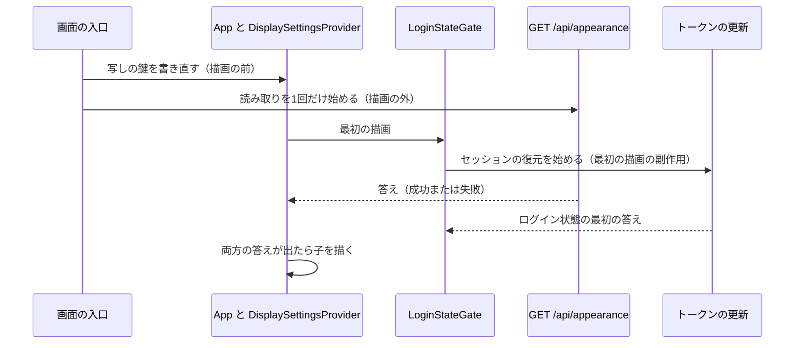

# Performance Design — U4 表示の設定の土台（u4-display-foundation）

U4 の性能の設計です。U4 は画面の単位で、自分の API を持ちません。この文書では次の4つの作りを決めます。

- 画面を開いてから最初の画面が出るまでの待ちの作り（ゲート）
- その時間の測り方
- 初回の JavaScript の大きさ
- フォントの読み込みと、配信物の大きさの測り方

答えは `nfr-design-questions.md` にあります（Q1: A、Q2: A、Q3: A、Consolidated Summary Confirmation: Looks correct）。

出典の略号:

- NFR: この単位の NFR 要件 `construction/u4-display-foundation/nfr-requirements/` の枝番（この単位の中で振った番号）
- D・W・9節: この単位の機能設計 `construction/u4-display-foundation/functional-design/functional-spec.md`
- 部品 n節: 同じフォルダの `frontend-components.md`
- 要点 n: この段の `nfr-design-questions.md` の「NFR 設計の要点（案）」の番号

この単位（種類 ui）の成果物と置き場は、次の表のとおりです。拡張性・信頼性・観測性の設計は service の単位だけが作ります。U4 での扱いは `logical-components.md` の4節に書きます。

| 成果物 | 置く設計 |
|---|---|
| この文書 | 性能（NFR6.1〜NFR6.5） |
| `security-design.md` | ブラウザの保存と受け渡し（NFR2.1・NFR2.2）、公開の API・要求の言語・見た目の値・CSP（NFR9.1〜NFR9.4）、依存（NFR9.5〜NFR9.7） |
| `logical-components.md` | 部品の一覧と失敗の範囲、アクセシビリティ（NFR7.1〜NFR7.5）、多言語（NFR8.1・NFR8.2）、テストの作り（NFR9.8〜NFR9.11）、実際のブラウザの検査の置き場と非干渉 |
| `traceability.json` | NFR の枝番と設計の対応 |

## 1. 予算の前提

| 項目 | 値 | 持ち主 |
|---|---|---|
| `GET /api/appearance` | 同時 10 件で p95 300 ミリ秒 | U8 の NFR6.1 |
| セッションの復元（トークンの更新） | 同時 10 件で p95 1 秒 | U2 の NFR6.5 |
| 最初の画面（ログインの画面）が出るまで | 手元の PC のブラウザ、キャッシュが空の状態で 2 秒以内 | この単位の NFR6.1 |

- 最初の描画の待ちは、2つの API の遅いほう（多くはセッションの復元）に、JavaScript の読み込みと描画の時間を足したものです。
- U8 の NFR 設計は「I/O を持たない」ことを予算の前提にしています（`construction/u8-instance-appearance/nfr-design/performance-design.md`）。U4 の待ちはこの前提に頼ります。

## 2. 最初の描画のゲート（NFR6.2、W1・W2・D11）

### 2.1 作り



<!-- Text fallback: 画面の入口で、ThemeProvider が保存の値を読むより前に写しの鍵を書き直し、見た目の設定の読み取りを React の描画の外で1回だけ始める。App の最初の描画で LoginStateGate がセッションの復元（トークンの更新）を始める。2つの要求は、どちらかの答えを待たずに同時に進む。DisplaySettingsProvider は、見た目の設定の答え（成功でも失敗でも）とログイン状態の最初の答えの両方が出たら、子を描く。 -->

- **読み取りの約束:** 見た目の設定の読み取りは、React の描画の外で1回だけ作ります（画面の入口か、`display-settings` のモジュールの中で1回だけ作る関数）。
  - 開発時の StrictMode では、描画と `useState` の初期値の関数が2回呼ばれます。約束を描画の外に置けば、要求は1回になります。
  - 約束の作り方の具体（置き場・名前）は、コード生成で決めます。
- **写しの鍵の書き直し:** `ThemeProvider` が保存の値を読むより前に行います（W1 の2、D5）。約束を作る前後のどちらでもかまいません。どちらも同じ入口で、最初の描画の前に済ませます。
- **セッションの復元:** 既存の `LoginStateGate` のまま、最初の描画の副作用で始めます。変えません。
- **ゲート:** `DisplaySettingsProvider` は約束の答えを受け取るまで子を描きません（部品 3.3）。ログイン状態の最初の答えが出るまでは、既存の `LoginStateGate` が何も描きません。
  - 2つのゲートは入れ子です。どちらの答えが先に出ても、両方がそろった描画で最初の画面が出ます。
- **答えの形:** 約束は例外で終わりません。成功・失敗・形の誤りを、1つの結果（当てる値の有無）で返します。
  - 失敗のときは、前に当てた値のまま描きます（W3、7節）。
  - エラーの境界（ErrorBoundary）に頼らずに済みます。
- **待ちの上限:** 置きません。再試行も、中断（AbortController）も置きません（W2 の4、機能設計の Q2 A）。

```ts
// 説明用の断片（名前は仮）。描画の外で1回だけ作り、例外で終わらない約束を返す。
let appearanceLoad: Promise<AppearanceResult> | undefined
export function startAppearanceLoad(): Promise<AppearanceResult> {
  appearanceLoad ??= fetchAppearance().then(toResult, () => ({ kind: 'failed' as const }))
  return appearanceLoad
}
```

### 2.2 上限を置かない決定の支え方

W2 の5・7節の影響（見た目の設定の応答が返らないと、全画面の最初の描画が止まる）は、依頼者が受け入れた決定です。この段では変えません。代わりに、次の3つで支えます。

| 支え | 中身 | 持ち主 |
|---|---|---|
| 返らない原因を作らない | U8 は I/O を持たず、保持した値を写すだけ | U8 の NFR 設計 |
| 並べ読みが崩れていないこと | 2つの要求がともに始まることを、画面部品のテストで確かめる | 2.3 |
| 体感の時間 | 実際のブラウザで測って記録する | 3節 |

### 2.3 並べ読みの確かめ（NFR6.2）

画面部品のテスト（Vitest）で確かめます。

- 2つの要求（`/api/appearance` とトークンの更新）の `fetch` を、どちらにもまだ答えない状態で止めます。
- その状態で、2つの要求がともに送られていることを見ます。どちらかの答えを待ってから次を送る作りに変わると、このテストが落ちます。
- 片方の答えだけでは子を描かないことを、答えの順を入れ替えた2通りで見ます（部品 7節の `DisplaySettingsProvider`）。
- StrictMode の中で描いても、`/api/appearance` の要求が1回であることを見ます。

## 3. 最初の画面が出るまでの時間の測り方（NFR6.1）

### 3.1 置き場

- 実際のブラウザの検査のファイル（`logical-components.md` の 5節、`frontend/e2e/050-display-accessibility.e2e.ts` の見込み）に、測定のテストを1件置きます。
- `./gradlew e2eTest` の中で動き、`./gradlew verify` と CI の外です。
- 流れの E2E ではないため、`team.md` の「代表の流れを1本まで」の本数に数えません（NFR9.11）。

### 3.2 手順

1. `browser.newContext()` で、キャッシュが空の新しいコンテキストを作ります。
2. `page.goto('/', { waitUntil: 'commit' })` の直前から、ログインの画面の見出しが見えるまで（`toBeVisible`）の時間を、テストの側の時計で測ります。
3. コンテキストを閉じます。
4. 1〜3 を5回くり返します。

- テストの側の時計は、Playwright が見出しを探す待ちの間隔を含むため、実際より長めに出ます。長めの側で判定し、目標を緩めません（`project.md` の Testing Posture）。
- 5回の値（ミリ秒）と、2 秒以内の回数を、テストの注記（`test.info().annotations`）と添付（JSON）で残します。Build and Test がそれを結果に写します。
- 時間では失敗させません（統合の関門にしない。NFR 要件の2節）。
- 2 秒を超えたときは、次のどれが遅いかを要求の一覧と時刻で切り分け、依頼者に相談します（NFR 要件の2節）。
  - 2つの API
  - JavaScript の読み込み
  - 描画
- WAR はヘルスチェックが通った後に測ります（`playwright.config.ts` の `webServer.url` のとおり）。長い実行は `caffeinate -i` を付けます。

### 3.3 同じテストで記録すること

| 記録 | 見方 | 出典 |
|---|---|---|
| Noto Serif JP のフォントのファイルへの要求が無いこと | 見た目の設定が `sans` のとき（既定の WAR の設定）、要求の一覧に `noto-serif-jp` を含むフォントのファイルが無い | NFR6.4 |
| CSP の違反が無いこと | コンソールの CSP の違反の知らせが 0 件（既存の `010-skeleton.e2e.ts` の `collectProblems` と同じ見方。`securitypolicyviolation` を初めのスクリプトでコンソールへ写し、未ログインのトークンの更新の 401 の1件だけを除く） | NFR9.4（`security-design.md` の 5節） |

どちらも、測った5回のコンテキストのすべてで見ます。違反や要求があれば、テストを失敗させます。これらは時間と違って不安定ではないためです。

## 4. 初回の JavaScript の大きさ（NFR6.3）

- 既存の `frontend/scripts/check-bundle-size.mjs`（`./gradlew verify` の中）をそのまま使います。
  - 入口から静的にたどった `.js` だけを gzip で数えます。
  - 目安は 500KB で、超えたら警告だけです。
- U4 が足すのは小さな関数と部品だけです。axe-core は検査の側だけで読み込み、画面の成果物に入りません（`security-design.md` の 6節）。
- コード生成で、U4 の変更の前後の値を記録します。今の入口の JavaScript は圧縮前で約 370KB です。
- `/api/appearance` の読み取りのために、新しいライブラリは足しません。既存の ApiClient を使います。

## 5. フォントの読み込み（NFR6.4、9.1）

| 項目 | 作り |
|---|---|
| 読み込みの場所 | 画面の入口 `frontend/src/main.tsx`。既存の Noto Sans JP の8つの CSS の後に、`@fontsource/noto-serif-jp` の `japanese-400`〜`700`・`latin-400`〜`700` の8つの CSS を読み込む（9.1） |
| 描画を止めない | fontsource の CSS の `@font-face` は `font-display: swap`。フォントのファイルを読む間も、代わりのフォントで文字が出る |
| 読むときだけ読む | `@font-face` の宣言だけでは、フォントのファイルは読まれない。make-you-chic-ui の `serif` の指定（`data-font-family="serif"`）で 'Noto Serif JP' を使う文字を描くときにだけ、ブラウザがその太さのファイルを読む。fontsource 5.3.0 の `japanese-*`・`latin-*` の CSS は、どちらも太さごとに `@font-face` が1つで `unicode-range` を持たない（今の Noto Sans JP の CSS で確かめた形。Noto Serif JP も同じ形の見込みで、コード生成で確かめる） |
| 保存 | フォントのファイルは `dist/assets/` の名前にハッシュが付くファイルになり、既存の `CacheControlFilter` で `public, max-age=31536000, immutable` になる |
| 先読み | `<link rel="preload">` を足さない。`serif` のインスタンスでも最初の描画を止めず、`sans` のインスタンスで余計な読み込みをしないため |

確かめ:

- **コード生成:** ビルドした入口の CSS に Noto Serif JP の `@font-face` が `font-display: swap` で入り、フォントのファイルの URL が同じオリジンの `/assets/` であることを見ます。
- **Build and Test:** 3.3 のとおり、`sans` で読まれないことを見ます。

## 6. 配信物の大きさの測り方（NFR6.5）

上限は置きません。コード生成で、U4 の変更の前後の次の値を記録します（`code-summary.md` の見込み）。

| 値 | 測り方 |
|---|---|
| フォントのファイルの合計 | `dist/assets/` の `.woff2`・`.woff` の大きさを、名前の `noto-sans-jp`・`noto-serif-jp` ごとに足す |
| 入口の CSS | `dist/.vite/manifest.json` の入口の `css` のファイルの大きさ（圧縮前と gzip）。`@font-face` の宣言が増えるため |
| `dist` の全体 | `dist/` の下のファイルの合計 |
| WAR | `backend/build/libs/mastersmith.war` の大きさ |

- 今の値は、Noto Sans JP の分が約 9.8MB、WAR が約 87MB です（NFR 要件の NFR6.5）。
- 測る道具は足しません。Node の1回だけのコマンドか、シェルの `du`・`stat` で測り、手順と値を記録します。

## 7. 上流との差

承認済みの文書は書き換えません（`aidlc/spaces/default/memory/project.md` の Way of Working）。

| 決定 | 文書 | 承認済みの記述 | この段での扱い |
|---|---|---|---|
| 見た目の設定の読み取りの約束を、描画の外で作る | `frontend-components.md` の 4節 | `App` の state・読む値に「見た目の設定の読み取りの約束（最初の描画で1回だけ作る）」 | StrictMode でも要求を1回にするため、約束を作る場所を描画の外（入口か、モジュールの中で1回だけ作る関数）にした。`App` が約束を受けて `DisplaySettingsProvider` に渡す形は変わらない。作りの細部で、食い違いではない |
| 測定のテストを新しい検査のファイルに置く | NFR 要件の NFR6.1 | 「既存の E2E（`./gradlew e2eTest`）の中で測って記録する」 | 同じ `./gradlew e2eTest` の中の新しいファイル（`050-`）に置き、既存の 010〜040 のファイルは変えない（`logical-components.md` の 5節）。食い違いではない |
| NFR6.4 と NFR9.4 の確かめを失敗の条件にする | NFR 要件の NFR6.4・NFR9.4 | 「要求の一覧を見て記録する」「コンソールに CSP の違反が出ないことを記録する」 | 記録に加えて、要求や違反があればテストを失敗させる。時間と違って不安定ではないため。追加 |
