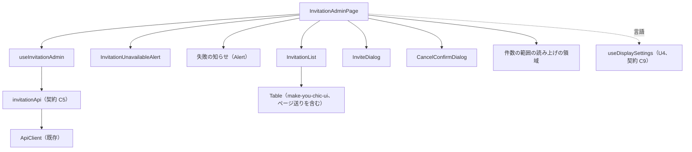

# Frontend Components — U5 招待の管理の画面（u5-invitation-ui）

画面の流れ（W1〜W10）・決まり（D1〜D14）・状態の移り変わり・応答ごとの動き・文言は `functional-spec.md` が正本で、ここでは繰り返さない。ここでは部品の階層、置き場のモジュール、props と state、`useInvitationAdmin` の状態と操作、API（契約 C5）との受け渡し、テストで確かめる内容を示す。画面の配置と部品ごとの動きは `aidlc/spaces/default/intents/260925-user-management/inception/refined-mockups/` の `mockups.md`（S1・S1-M1・S1-M2）・`interaction-spec.md`（2〜4節）・`design-system-mapping.md` が正本。

## 1. 部品の階層

画面 `InvitationAdminPage` が `useInvitationAdmin` を1回だけ呼び、状態と操作を子の部品へ props で渡す。子の部品は表示と操作の受け渡しだけを行い、API を呼ばない（DSL の管理画面の `useDslAdmin` と同じ形。設計の要点 2）。

| 階層 | 部品 | 置き場 | 役割 |
|---|---|---|---|
| 1 | `InvitationAdminPage` | `frontend/src/features/invitation/InvitationAdminPage.tsx` | 画面。見出し・「招待する」・警告・失敗の知らせ・一覧・2つの Modal・件数の範囲の読み上げの領域を並べる |
| 2 | `InvitationUnavailableAlert` | `InvitationUnavailableAlert.tsx` | 招待を使えないときの警告（W3） |
| 2 | 失敗の知らせ（Alert） | `InvitationAdminPage.tsx` の中 | 一覧の上の `role="alert"`（W10、D10）。make-you-chic-ui の Alert をそのまま使う |
| 2 | `InvitationList` | `InvitationList.tsx` | 一覧の見出し・読み込み中・空・読めなかった・表（make-you-chic-ui の Table、行と操作とページ送り）。行へのフォーカスを当てる（W1・W2・W7〜W9） |
| 2 | `InviteDialog` | `InviteDialog.tsx` | S1-M1（W4〜W7） |
| 2 | `CancelConfirmDialog` | `CancelConfirmDialog.tsx` | S1-M2（W9） |



<!-- Text fallback: InvitationAdminPage は useInvitationAdmin を呼び、useInvitationAdmin は invitationApi（契約 C5）を通して既存の ApiClient を呼ぶ。InvitationAdminPage の下に、InvitationUnavailableAlert（警告）、失敗の知らせの Alert、InvitationList（その中に make-you-chic-ui の Table。ページ送りは Table が持つ）、InviteDialog、CancelConfirmDialog、件数の範囲の読み上げの領域を置く。画面の言語は U4 の useDisplaySettings から読む。 -->

- 画面は骨組みの `ShellLayout` の中に描かれる（機能の登録の `layout: 'SHELL'`）。Toast と Modal の Provider（make-you-chic-ui の `ToastProvider`・`ModalStackProvider`）は骨組みが既に置いている。

## 2. 置き場ごとのモジュール

| 置き場 | モジュール | 役割 |
|---|---|---|
| `frontend/src/features/invitation/registration.ts` | 機能の登録 | 画面・サイドバーの項目・文言（`functional-spec.md` の 2節）。画面は遅延読み込み（DSL と同じ `lazy`） |
| `frontend/src/features/invitation/messages.ts` | 文言 | `invitationMessages`（ja・en、`functional-spec.md` の 7節） |
| `frontend/src/features/invitation/api/types.ts` | 応答の型 | `Invitation`・`InvitationPage`・`InvitationRequest`・`SendResult`（文字列リテラルの union の `'SENT'`・`'FAILED'`）・`UnavailableReason`（`'SMTP_NOT_CONFIGURED'`・`'BASE_URL_NOT_CONFIGURED'`）。`enum` は使わない |
| `frontend/src/features/invitation/api/invitationApi.ts` | API の関数 | 5節の4つの関数と、失敗の追加の項目を読む関数 |
| `frontend/src/features/invitation/paging.ts` | 純粋な関数 | ページの大きさ 20、ページの数、件数の範囲（Table の `labels.pageStatus` と件数の範囲の読み上げに使う）、ページの補正、ページ送りで押したボタンが読んだ先で押せなくなるかの判定（W2） |
| `frontend/src/features/invitation/focusTarget.ts` | 純粋な関数 | フォーカスの行き先の型と、行の有無・押せるかで行き先を決める関数（3.3） |
| `frontend/src/features/invitation/unavailable.ts` | 純粋な関数 | `unavailableReasons` から警告の文の形（1つ・2つ・知らない理由だけ）を決める（W3） |
| `frontend/src/features/invitation/inviteInput.ts` | 純粋な関数 | メールアドレスが空（空白だけを含む）かの判定（D8） |
| `frontend/src/features/invitation/failureMessage.ts` | 純粋な関数 | 失敗から `code`・状態コード・文言の鍵を選ぶ（D4。DSL の `failureMessage.ts` と同じ考え方で、この機能の `code` を持つ） |
| `frontend/src/features/invitation/useInvitationText.ts` | フック | 文言の鍵と埋める値から文言を返す（DSL の `useDslText` と同じ形） |
| `frontend/src/features/invitation/useInvitationAdmin.ts` | フック | 画面の状態と操作（3節） |
| `frontend/src/features/invitation/*.tsx`・`*.css` | 部品 | 1節の部品と、部品と同じ場所の素の CSS |
| `frontend/src/features/invitation/testing/` | テストの補助 | 文言を登録した Provider の中に描く補助と、応答の見本（テストからだけ使う） |
| `frontend/src/shared/format/formatDateTime.ts` | 日時の書式 | `features/dsl/format.ts` から移す（Q1 A、`functional-spec.md` の 9節の (d)）。引数は ISO 8601 の日時・言語（`'ja'` か `'en'`）・時差（省略するとブラウザの時差） |

- 純粋な関数は React・`window`・API に触れず、性質ベースのテストの対象にできる形にする（`team.md`）。
- CSS は部品と同じ場所に素の CSS で置き、make-you-chic-ui のトークン（CSS の変数）だけを使う。表の見た目は make-you-chic-ui の Table のまま変えず、機能の CSS は目立たせた行（`:has()` で印を含む行に枠の線と背景）・一覧の見出し・読み込み中の表示などの配置だけを書く（Table の中の class を上書きしない）。
- 純粋な関数の中身（例）:

```ts
// paging.ts（設計の意図を示す例。実装はコード生成で書く）
export const PAGE_SIZE = 20
export function pageCount(total: number): number // Math.ceil(total / 20)、total が 0 なら 0
export function pageRange(page: number, total: number): { from: number; to: number } // 21〜40 件目
export function correctedPage(page: number, total: number, itemCount: number): number | undefined
// items が空で total が 1 以上なら pageCount(total)、そうでなければ undefined（補正しない）
export function pagerButtonDisabledAfter(direction: 'prev' | 'next', page: number, total: number): boolean
// 「前へ」なら page が 1、「次へ」なら page が pageCount(total) 以上のとき true（フォーカスを一覧の見出しへ移す）
```

## 3. `useInvitationAdmin`

### 3.1 持つ状態

画面の状態はこの画面の中だけで持ち、アプリ全体の置き場は作らない（DSL と同じ）。今のページも画面の中だけ（Q2 B）。

| 状態 | 型 | 初め | 意味 |
|---|---|---|---|
| `page` | 数 | 1 | 今のページ（D1） |
| `list` | `InvitationPage` または null | null | 最後に使った一覧の応答 |
| `loadState` | `'loading'`・`'loaded'`・`'failed'` | `'loading'` | 一覧の読み込みの状態 |
| `loadFailureKey` | 文字列 または null | null | 読めなかったときの一般の文言の鍵（W10 の 3） |
| `failure` | 失敗の知らせ または null | null | 一覧の上の失敗の知らせ。文言の鍵、または理由の一覧（503） |
| `highlightedId` | 数 または null | null | 目立たせた行の `invitationId`（W7） |
| `resendingIds` | 数の集合 | 空 | 行の処理中の `invitationId`（W8。複数の行を同時に送り直せる） |
| `invite` | 招待の入力の状態 または null | null | Modal を開いている間だけ持つ（3.2） |
| `cancelTarget` | `Invitation` または null | null | 取り消しの確かめの対象 |
| `cancelBusy` | 真偽 | 偽 | 取り消しの要求中 |
| `focusTarget` | フォーカスの行き先 または null | null | 次に一覧を描いた後に当てるフォーカス（3.3） |
| `liveMessage` | 文字列 | 空 | 件数の範囲の読み上げ（W2 の 3） |

- 招待を使えるか（`invitationEnabled`）と理由は `list` から読む。`list` が null（読んでいない）なら「招待する」は押せない（D3）。
- 読み直しの順番のために、読み直しごとに番号を増やし、最後の番号の答えだけを使う。画面を離れた後の答えも捨てる（D2。`useDslAdmin` の `statusSeq` と `mounted` と同じ形）。

### 3.2 招待の入力の状態

| 項目 | 型 | 意味 |
|---|---|---|
| `email` | 文字列 | 入れた値（正規化しない、D8） |
| `language` | `DisplayLanguage`（`'ja'`・`'en'`） | 選んだ言語。開いた時点の `useDisplaySettings().language` |
| `busy` | 真偽 | 送信中（D9） |
| `fieldError` | 文言の鍵 または null | メールアドレスの項目の下の誤り（`invitation.invite.required`・`invitation.error.*`） |
| `pending` | `{ invitationId, page }` または null | 招待中の誤りのときの行の位置（W7 の案内を出すか） |
| `dialogAlert` | 失敗の知らせ または null | Modal の中の `role="alert"`（503・一般の失敗） |
| `reloadOnClose` | 真偽 | 503 を受けたとき真。閉じた後に一覧を読み直す（W6 の 4） |

### 3.3 フォーカスの行き先

| 行き先 | 使う場面 | 当てられないときの代わり |
|---|---|---|
| `{ kind: 'resend', invitationId }` | 送り直しの 200・404 の後（W8）、招待中の案内から移った後（W7） | 行はあるが「送り直す」を押せない → その行のメールアドレスのセルの受け口。行が無い → 一覧の見出し |
| `{ kind: 'email', invitationId }` | 送り直しの 503 の後（W8） | 行が無い → 一覧の見出し |
| `{ kind: 'heading' }` | 取り消しの後（W9）、ページ送りで押したボタンが読んだ先で押せなくなったとき（W2） | 一覧が空 → 空の表示の文 |
| `{ kind: 'empty' }` | 取り消しで空になったとき | — |

- 代わりの決め方は `focusTarget.ts` の純粋な関数（行き先・今の `items`・招待を使えるか・`resendingIds` から、実際に当てる所を返す）。`InvitationList` は一覧を描いた後（読み込み中でない描画の確定の後）に、その結果の要素へフォーカスし、`onFocusApplied` で消す。
- 送り直しの 403・そのほかの 4xx・5xx・通信の失敗（読み直さない）では `focusTarget` を使わない。「送り直す」は `loading` の間もフォーカスを保つため、処理中を解くだけで同じ行の「送り直す」にフォーカスが残る（W8）。
- 行の要素への参照は、Table の `columns` の `render` で描く要素（行の「送り直す」とメールアドレスのセルの受け口）に `invitationId` ごとの参照を付けて持つ。Table の中の class・`data-testid` を探してフォーカスを当てることはしない。
- 招待の成功の後の「招待する」と、取り消しの確かめを閉じた後の「取り消す」へは、make-you-chic-ui の Modal が閉じるときに開く前の要素へ戻す動きに任せ、`focusTarget` を使わない。

### 3.4 返す値と操作

| 名前 | 意味 | 流れ |
|---|---|---|
| 3.1 の状態（読み取りだけ） | 部品へ渡す値 | — |
| `retry()` | 今のページを読み直す（失敗の知らせと目立たせた行を消す） | W1・W10 |
| `goToPage(page)` | 今のページを変えて読む（失敗の知らせと目立たせた行を消す） | W2 |
| `openInvite()` | 招待の入力を開く（使えるときだけ。失敗の知らせと目立たせた行を消す） | W4 |
| `changeInviteEmail(value)`・`changeInviteLanguage(value)` | 入力の値を変える。`fieldError` は変えない（送るまで残す） | W4 |
| `submitInvite()` | 空の確かめ → 送信 → 6.2 の応答ごとの動き | W5・W6 |
| `closeInvite()` | 送信中でなければ閉じる。`reloadOnClose` なら一覧を読み直す | W4・W6 |
| `showPendingRow()` | 招待中の案内から、Modal を閉じて `pending.page` を読み、行を目立たせてフォーカスを求める | W7 |
| `resend(invitation)` | 行の処理中にして送り直し → 6.3 | W8 |
| `requestCancel(invitation)` | 取り消しの確かめを開く | W9 |
| `closeCancel()` | 要求中でなければ閉じる | W9 |
| `confirmCancel()` | 取り消しを送る → 6.4 | W9 |
| `dismissFailure()` | 失敗の知らせを閉じる | W10 |
| `onFocusApplied()` | `focusTarget` を消す | 3.3 |

- 成功の Toast は make-you-chic-ui の `useToast` で、このフックが出す（DSL と同じ）。
- 操作の後の読み直しは、操作の応答を受けてから始める（招待・送り直し・取り消しの確定を待ってから読む）。

## 4. 部品ごとの props と state

| 部品 | props | 自分の state | 要点 |
|---|---|---|---|
| `InvitationAdminPage` | なし | なし（`useInvitationAdmin` と `useDisplaySettings`） | `api`（既定は `invitationApi`）と `timeZone` を差し替えられる任意の props をテストのために持つ。見出しは `h1`「利用者の招待」、右に「招待する」（primary、押せないときは `disabled`）。件数の範囲の読み上げは見えない `aria-live="polite"` の領域 |
| `InvitationUnavailableAlert` | `list`（`invitationEnabled`・`unavailableReasons`） | なし | `invitationEnabled` が偽のときだけ描く。make-you-chic-ui の Alert の警告の種類。文の形は `unavailable.ts` |
| `InvitationList` | `list`・`page`・`loadState`・`loadFailureKey`・`invitationEnabled`・`resendingIds`・`highlightedId`・`focusTarget`・`language`・`timeZone`（任意）・`onResend`・`onRevoke`・`onRetry`・`onPageChange`・`onFocusApplied` | なし（要素への参照だけ） | 一覧の見出し `h2`「招待中の人」（`tabIndex=-1`）をいつも描く。表は make-you-chic-ui の Table（`columns` は7列、`data` は行、`totalCount`・`page`・`pageSize` 20・`onPageChange`、`getRowId` は `invitationId` の文字、`aria-label`「招待中の人」、`labels` は 7節のとおり ja・en の7項目すべて）。最初の読み込み・空・読めなかったときは Table を描かず、読み直しの間は Table を描いたまま `data` を空にする（`functional-spec.md` の 4.1）。列の `render` で、行ごとに Badge 2つ（送信の結果・状態）、行のボタン（`aria-label` に D13 の名前）、メールアドレスのセルの受け口（`tabIndex=-1` の要素、目立たせた行ではその中に `data-invitation-highlighted` の印）を描く。行の処理中はその行の「送り直す」を Button の `loading` にして「送信しています」、「取り消す」を `disabled`。「送り直す」は招待を使えないときは `disabled`。目立たせた行は機能の CSS の `:has()` で枠の線と背景（`aria-current` などの意味は付けない）。空の表示の文も `tabIndex=-1`。ページ送りは Table のもので、`onPageChange` に「前へ」「次へ」のどちらかを添えて上へ渡す（W2 の 3 のフォーカスの判定のため、ページが1つ減ったか増えたかで決める） |
| `InviteDialog` | `state`（3.2、null なら閉じている）・`invitationEnabled`・`onEmailChange`・`onLanguageChange`・`onSubmit`・`onClose`・`onShowPendingRow` | なし（要素への参照だけ） | make-you-chic-ui の Modal（見出し「利用者を招待する」、`closeLabel` は `invitation.action.close`、`closeOnBackdropClick={false}`、`initialFocusRef` はメールアドレス、役割は既定の `dialog`）。送信中は `onClose` を呼ばない（Esc・閉じるボタンの `onClose` を無視する）。メールアドレスは FormField と TextInput（`type="email"`、`autocomplete="off"`、誤りは `aria-invalid`・`aria-describedby`）。言語は RadioGroup（`legend`「招待メールの言語」、`options` の `lang` に言語の値、ラベルは `LANGUAGE_NAMES`、案内の文）。「やめる」（secondary、送信中は `disabled`）と「招待する」（primary、送信中は Button の `loading` と「送信しています」。フォーカスは「招待する」に残る）。`fieldError` が出たら、描いた後にメールアドレスへフォーカス。Modal の中の知らせは Alert の失敗の種類 |
| `CancelConfirmDialog` | `target`（`Invitation` または null）・`busy`・`onConfirm`・`onClose` | なし（要素への参照だけ） | make-you-chic-ui の Modal（見出し「招待を取り消しますか」、`role="alertdialog"`、`closeLabel` は `invitation.action.close`、`closeOnBackdropClick={false}`、本文は Modal が `aria-describedby` で結ぶ、`initialFocusRef` は「やめる」）。要求中は `onClose` を呼ばない。「取り消す」は Button の `danger`、要求中は `loading` と「取り消しています」（フォーカスは「取り消す」に残る）、「やめる」は要求中 `disabled` |

- 部品の文言はすべて `useInvitationText` で引き、表示の言語は `useDisplaySettings().language` を使う（日時の書式の言語も同じ）。
- メールアドレスの入力を `type="email"` にしても、ブラウザの形式の確かめ（送信の阻止）は使わない（フォームに `noValidate`）。形式はサーバーが判定する（D8）。

## 5. API との受け渡し（契約 C5）

`invitationApi.ts` は、すべて既存の ApiClient（`frontend/src/shared/api-client/apiClient.ts` の `apiRequest`）を通す。アクセストークン・401 での更新・`Accept-Language`（U4 が付ける）は ApiClient に任せる。失敗は ApiClient の `ApiError`（`kind`・`status`・`code`、本文が Problem Details なら `problem`）としてそのまま投げる。

| 関数 | 要求 | 成功の値 | 画面が扱う失敗 |
|---|---|---|---|
| `listInvitations(page)` | `GET /api/admin/invitations?page={page}` | `InvitationPage` | 4xx・5xx・通信の失敗（6.1） |
| `createInvitation({ email, language })` | `POST /api/admin/invitations`（JSON） | 201 の `Invitation` | 400 `VALIDATION_FAILED`、409 `INVITATION_EMAIL_REGISTERED`・`INVITATION_ALREADY_PENDING`、503 `INVITATION_NOT_CONFIGURED`、そのほか（6.2） |
| `resendInvitation(invitationId)` | `POST /api/admin/invitations/{invitationId}/resend` | 200 の `Invitation` | 404 `INVITATION_NOT_FOUND`、503 `INVITATION_NOT_CONFIGURED`、そのほか（6.3） |
| `cancelInvitation(invitationId)` | `POST /api/admin/invitations/{invitationId}/cancel` | 204（値なし） | 404 `INVITATION_NOT_FOUND`、そのほか（6.4） |
| `readPendingProblem(error)` | — | `{ invitationId, page }` または undefined | 409 `INVITATION_ALREADY_PENDING` の `problem` の `invitationId`（整数）と `page`（1 以上の整数）。型が合わなければ undefined |
| `readUnavailableReasons(error)` | — | 理由の配列 | 503 `INVITATION_NOT_CONFIGURED` の `problem` の `unavailableReasons` のうち、知っている値だけ |

- `invitationId` はパスに入れる前に数として扱い、`encodeURIComponent` を通す（DSL の `restorePath` と同じ）。
- 成功の本文は JSON として読み、読めなければ通信の失敗として扱う（DSL の `readJson` と同じ。画面は一般の文言を出す）。応答の知らない項目は無視する。`sendResult`・`unavailableReasons` の知らない値は、送信の結果は「送信に失敗」、理由は出さない側に倒す。
- 日時（`invitedAt`・`expiresAt`）は ISO 8601 の UTC の文字列のまま持ち、表示のときに `formatDateTime` で書式にする。
- 要求の本文は `email`・`language` の2つだけ。応答の値をブラウザの保存・コンソールに出さない（D11）。
- 表示の設定は契約 C9 の `useDisplaySettings().language` だけを読む。`setPreview`・`setLanguage` などは呼ばない。

## 6. 機能の登録

| 項目 | 値 |
|---|---|
| `featureId` | `invitation` |
| 画面 | `path: '/admin/invitations'`、`screen: InvitationAdminPage`（遅延読み込み）、`layout: 'SHELL'`、`access: 'ADMIN'` |
| サイドバー | `id: 'invitation'`、`labelKey: 'invitation.nav.label'`、`path: '/admin/invitations'`、`order: 220`、`visibleWhen: 'ADMIN'` |
| 文言 | `invitationMessages` |

- 既存の登録の検査（`frontend/src/app/registry/validateRegistrations.ts`）が、パスの重なり・文言の ja・en のそろい・鍵の接頭辞を確かめる。

## 7. テストで確かめる内容

説明文は英語、対象と同じ場所の `*.test.ts(x)`、部品ごとに vitest-axe を1件（`team.md`）。API は `invitationApi` の関数を差し替え、日時は時差を固定する。

| 対象 | 確かめる内容 | 上流 |
|---|---|---|
| `paging.ts` | ページの数（0・20・21・43 件）、件数の範囲（1ページ目・途中・最後のページ）、ページの補正（空の items と total で最後のページ、補正しない場合）、押したボタンが押せなくなるかの判定（1ページ目・最後のページ・途中）。性質ベース（fast-check、種を記録）: 任意の total と有効なページで from ≦ to ≦ total・to − from + 1 ≦ 20・補正の結果は 1 以上ページの数以下 | D1、W2 |
| `focusTarget.ts` | 行があり押せる→送り直す、押せない→メールアドレスのセルの受け口、行が無い→一覧の見出し、空→空の表示の文 | 3.3、W7〜W9 |
| `unavailable.ts` | 理由が1つずつ・両方・知らない値だけ・空 | W3 |
| `inviteInput.ts` | 空・空白だけ・前後に空白のある値（空でない）。性質ベース: 空白だけの文字列はすべて空と判定 | D8 |
| `failureMessage.ts` | 知っている `code` の鍵、知らない `code`・`code` なし（4xx・5xx）・通信の失敗の一般の鍵 | D4 |
| `invitationApi.ts` | 4つの要求のメソッド・パス・本文、204 の扱い、`readPendingProblem`・`readUnavailableReasons` の型の確かめ | 5節 |
| `shared/format/formatDateTime.ts` | 移す前と同じ（ja・en・時差・不正な値）。DSL の部品のテストがそのまま通る | D6、Q1 A |
| `InvitationList` | 列と値（言語の名前と `lang`、日時の書式、招待した管理者、空の `invitedBy` の「（不明）」）、送信の結果の文字「送信済み」「送信に失敗」、状態の文字「期限内」「期限切れ」（色だけでない）、ボタンの名前にメールアドレス、トークン・URL を表示しない、読み込み中・空の文・読めなかった表示と「もう一度読み込む」、行の処理中にその行の「送り直す」が `aria-disabled`・`aria-busy` で押しても送らずフォーカスを保ち「取り消す」が押せない、招待を使えないとき「送り直す」だけ押せず「取り消す」は押せる、期限切れの行も押せる、目立たせた行の印、フォーカスの行き先（一覧の見出しを含む）、表の名前（`aria-label`）と一覧の見出し、表の中のボタンに Tab で届く、Table のページ送りの状態の文（件数の範囲とページ）と端で押せないこと、en の画面で Table の文言に日本語の既定が出ないこと、読み直しの間も Table とページ送りのボタンが残ること、vitest-axe | AC2.1.1・AC2.1.2・AC2.1.4〜AC2.1.8、AC2.2.2・AC2.2.9・AC2.2.10・AC2.2.12、CR6.5・CR6.6・CR6.8、W2 |
| `InvitationUnavailableAlert` | 理由ごとの文・両方の並び・使えるとき描かない、vitest-axe | AC1.1.6、AC2.2.9 |
| `InviteDialog` | 開いた時点の言語が画面の言語（en の管理者で en）、メールアドレスが空、フォーカス、空のまま送ると誤りと結び付きとフォーカス、送信中に「招待する」が `aria-disabled`・`aria-busy` で「送信しています」になりフォーカスが残る、送信中は Esc・閉じる・やめるで閉じない、背景のクリックで閉じない、閉じるボタンの名前が ja・en、誤りの後も値が残る、招待中の案内と「一覧でこの招待を見る」、Modal の中の知らせ、vitest-axe | AC1.1.1・AC1.1.3・AC1.1.4・AC1.1.9、CR6.1〜CR6.3・CR6.6 |
| `CancelConfirmDialog` | 役割が `alertdialog`、本文のメールアドレス、はじめのフォーカスが「やめる」、Esc・やめるで閉じて何も送らない、背景のクリックで閉じない、要求中に「取り消す」が `loading` で「やめる」が押せない、閉じるボタンの名前が ja・en、vitest-axe | AC2.2.11、CR6.7 |
| `InvitationAdminPage`（`useInvitationAdmin` を通す） | 開くと1ページ目を読む、ページ送りと件数の範囲の読み上げ、重なった読み直しで古い答えを捨てる、6.2〜6.4 の応答ごとの動き（Toast・失敗の知らせ・読み直すページ・フォーカス）、招待の成功で Modal を閉じて Toast と1ページ目、送信の失敗の知らせ、招待中の案内から行へ移る（別のページ・行が無い場合を含む）、送り直しの SENT・FAILED・404・503、取り消しの 204・404・一般の失敗、最後の1件の取り消しで前のページ、失敗の知らせが1つだけで置き換わる、一覧を読む前と読めなかった間に「招待する」が押せない、設定が無いときの警告と押せなさ、en の文言、vitest-axe | AC1.1.2・AC1.1.4〜AC1.1.8・AC1.1.10、AC2.1.4・AC2.1.5、AC2.2.3・AC2.2.4・AC2.2.7〜AC2.2.12、CR1.1・CR1.4、CR6.3・CR6.4 |
| `registration.ts` | 画面とサイドバーの項目の値、文言の ja・en の鍵がそろう | 6節 |

- フロントエンドのカバレッジの下限（行 80%・分岐 70%）を守る。

## 8. 既存への影響

| 既存 | 影響 |
|---|---|
| `frontend/src/features/dsl/format.ts`・`format.test.ts` | `formatDateTime` と、そのテストを `frontend/src/shared/format/` へ移す。`shortHash`・`formatBytes` とそのテストは残す |
| `frontend/src/features/dsl/DslStatusPanel.tsx`・`DslConfirmDialog.tsx`・`DslHistoryTable.tsx` | `formatDateTime` の読み込み先を `shared/format` に変える。ふるまいは変えない |
| 骨組み（`frontend/src/app/`）・AdminArea（`frontend/src/features/admin/`）・ApiClient | 変えない |
| make-you-chic-ui | 中身は変えない（`project.md` の Forbidden）。この単位は新しい版の Table（`labels`）・Modal（`closeOnBackdropClick`・`role`・`closeLabel`）・Button（`loading` の `aria-disabled`）・RadioGroup（`legend`・選択肢の `lang`）に頼るため、コード生成の B4 でサブモジュールの固定先を edb1f94 から 735ef04（origin/main）へ更新することを前提にする（承認を得た専用のコミット、更新前後のハッシュを記録。`project.md` の Mandated） |
| DSL の管理画面（`frontend/src/features/dsl/`） | 背景の押下の見張り（`DslConfirmDialog` の仕組み）は複写しない。DSL 側を新しい Modal に置き換えるかはこの単位では決めない（`formatDateTime` の読み込み先の変更だけ） |
