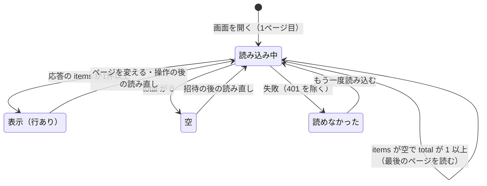
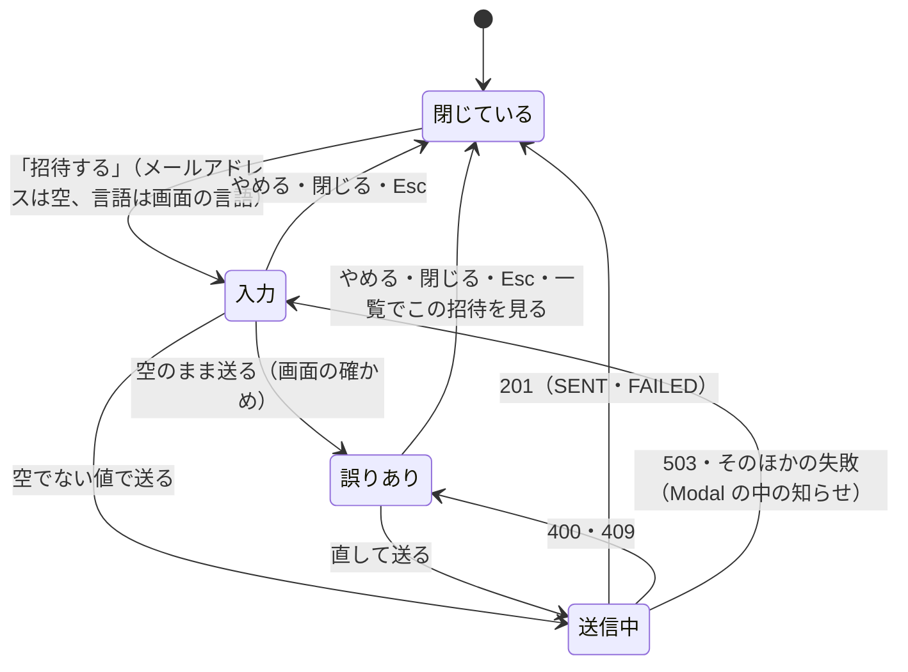

# Functional Spec — U5 招待の管理の画面（u5-invitation-ui）

U5 は、管理者が招待中の人を一覧で確かめ、招待・送り直し・取り消しを行う画面の単位（種類 ui）である。画面は S1（利用者の招待、招待中の一覧）・S1-M1（招待の入力の Modal）・S1-M2（取り消しの確かめの Modal）で、部品は InvitationUi（`aidlc/spaces/default/intents/260925-user-management/inception/units-generation/unit-of-work.md`）。

- 正本: この文書は、画面の流れ（W1〜W10）と画面の状態の移り変わりの正本である。U5 は画面の単位のため、保存するデータ（エンティティ）と `rules.md` を持たない。流れの中で守る決まりは 3節に D1〜D14 として1回だけ書く。部品の階層・props と state・`useInvitationAdmin`・API との受け渡しは `frontend-components.md` に置く。
- 出典: 質問と答え `functional-design-questions.md`（設計の要点 1〜19・決まっていること・Q1 A・Q2 B・Q3 A、まとめの確認は Looks correct）、契約 C5（受ける側、招待の管理の API）・C9（受ける側、表示の設定の口）（`aidlc/spaces/default/intents/260925-user-management/inception/contract-design/contract-summary.md`）、要件 FR1・FR3・FR7・NFR7・NFR8（`inception/requirements-analysis/requirements.md`）、ストーリー US1.1・US2.1・US2.2 と共通の決まり CR1・CR6（`inception/user-stories/stories.md`）、画面 S1・S1-M1・S1-M2 と `interaction-spec.md` の 2〜4節・`design-system-mapping.md`（`inception/refined-mockups/`）、依存する単位 U3（`construction/u3-invitation/functional-design/`、R-01・R-02 を直した後の形）と U4（`construction/u4-display-foundation/functional-design/`）の機能設計、既存のコード `frontend/src/features/dsl/`（前の Intent の管理画面の作り）。
- 受け持たないこと: 招待の API のふるまい・検証・排他・送信・監査（U3・U1）、表示の設定の口と `Accept-Language` の付与（U4）、管理者だけに画面を出す判定（既存の AccessControl と、骨組みの `access: 'ADMIN'`。どちらも変えない）、招待から登録の完了までの E2E（U6）。make-you-chic-ui（`vendor/make-you-chic-ui`）は変更しない（`project.md` の Forbidden）。

## 1. 用語

| 用語 | 意味 |
|---|---|
| 招待中の人 | 登録の完了も取り消しもしていない招待（期限切れを含む）。一覧の行（契約 C5 の `Invitation`） |
| 一覧の応答 | `GET /api/admin/invitations?page=n` の `InvitationPage`（`items`・`page`・`size`・`total`・`invitationEnabled`・`unavailableReasons`） |
| 今のページ | 画面が表示しているページの番号（1 から）。画面の中の状態だけに持つ（Q2 B） |
| 招待を使える | 一覧の応答の `invitationEnabled` が真。偽のときの理由は `unavailableReasons`（`SMTP_NOT_CONFIGURED`・`BASE_URL_NOT_CONFIGURED`） |
| 失敗の知らせ | 一覧の上に出す `role="alert"` の表示。画面に1つだけ置き、次の操作の結果で置き換える（D10） |
| 目立たせた行 | 招待中の案内から移った行（W7）。枠の線と背景で示し、ページを変える・次の操作をするまで残す |
| 行の処理中 | その行の送り直しの要求中。その行の「送り直す」「取り消す」だけを押せなくする |

## 2. 置き場と登録

| 置き場 | 中身 | この単位で足す・変えること |
|---|---|---|
| `frontend/src/features/invitation/`（新しい） | 機能 `invitation` の画面・部品・フック・API の関数・文言・純粋な関数 | すべて新しく足す（`frontend-components.md` の 2節） |
| `frontend/src/features/invitation/registration.ts`（新しい） | 機能の登録 | 画面 `/admin/invitations`（`layout: 'SHELL'`・`access: 'ADMIN'`）と、サイドバーの項目「利用者の招待」（`visibleWhen: 'ADMIN'`、order 220。既存の「管理」200・「DSL」210 の次）と文言を登録する |
| `frontend/src/shared/format/`（新しい） | 日時の書式の関数 `formatDateTime` | `frontend/src/features/dsl/format.ts` から移す（Q1 A。9節の (d)） |
| `frontend/src/features/dsl/`（既存） | DSL の管理画面 | `formatDateTime` の読み込み先を `shared/format` に変えるだけ。ふるまいは変えない |

- 骨組み（`frontend/src/app/`）と AdminArea（`frontend/src/features/admin/`）は変えない（`unit-of-work.md` の「今回変更しない部品」）。機能の登録の仕組み（`frontend/src/app/registry/types.ts`）も変えない。
- 機能どうしの読み込みは作らない。`features/invitation` は `features/dsl` を読み込まず、共通に使う日時の書式だけを `shared/format` に置く（今のコードに機能どうしの読み込みは無い）。
- 表示の設定は U4 の口 `useDisplaySettings()`（契約 C9）の `language` だけを使う。`LANGUAGE_NAMES` も U4 のものを使う（`construction/u4-display-foundation/functional-design/frontend-components.md` の 3.2・3.4）。
- API は既存の ApiClient（`frontend/src/shared/api-client/`）を通す。アクセストークン・401 での更新・`Accept-Language` の付与は ApiClient（と U4 が登録する言語の関数）に任せ、この単位では扱わない。

## 3. 決まり（画面の単位の設計の決まり）

| ID | 決まり | 出典 |
|---|---|---|
| D1 | 一覧はサーバーの順（招待した日時の新しい順）のまま出し、画面で並べ替えない。20 件ごとで、ページの数は `total` を 20 で割った切り上げ（`total` が 0 なら 0）。今のページは画面の中の状態だけに持ち、画面を開くたびに1ページ目から始める。URL には載せない | 設計の要点 7、Q2 B、AC2.1.5、U3 の BR5.2 |
| D2 | 一覧を読むのは、画面を開いたとき・ページを変えたとき・操作（招待・送り直し・取り消し）の後・「もう一度読み込む」のときだけ。決まった間隔の自動の読み直しはしない。読み直しが重なったら、最後に始めた読み直しの答えだけを使い、前の答えは捨てる。画面を離れた後の答えも捨てる | 設計の要点 8、Q3 A、`frontend/src/features/dsl/useDslAdmin.ts` の前例 |
| D3 | 招待を使えるかは、最後に使った一覧の応答の `invitationEnabled`・`unavailableReasons` だけで決める。使えないときは警告を出し、「招待する」とすべての行の「送り直す」を押せなくする。「取り消す」は押せる。一覧をまだ読んでいない・読めなかった間も「招待する」を押せない（使えるか分からないため） | 設計の要点 9、FR1.8、AC1.1.6、AC2.2.9、U3 の BR1.4・BR1.5 |
| D4 | 失敗の文言は、サーバーの `detail` を使わず、応答の `code` から画面の文言の鍵を選ぶ。画面が文言を持たない `code`・`code` の無い応答・通信の失敗は、状態コードの種類（4xx・5xx・通信の失敗）ごとの一般の文言にする | 設計の要点 11、`frontend/src/features/dsl/failureMessage.ts` の前例、NFR1 |
| D5 | 送信の結果は「送信済み」「送信に失敗」、有効期限の状態は「期限内」「期限切れ」の文字で、どの行にも出す（Badge）。色と記号は補助で、文字だけで意味が分かる。「成功」「届いた」とは書かない | 設計の要点 4、AC2.1.1、AC2.1.2、CR6.5 |
| D6 | 招待した日時と有効期限は、`shared/format` の `formatDateTime` で、ブラウザのタイムゾーンと画面の言語の書式（年と時差の略号つき。例 `2026-09-25 21:00 JST`・`Sep 25, 2026, 21:00 GMT+9`）で出す | 設計の要点 6、Q1 A、CR6.8 |
| D7 | 招待した管理者は、応答の `invitedBy`（氏名）をそのまま出す。空の文字列のときは「（不明）」／「(Unknown)」と出す。画面でメールアドレスに切り替えない | 設計の要点 5、U3 の R-01（直した後の形） |
| D8 | 招待の入力で画面が前もって確かめるのは、メールアドレスが空（空白だけを含む）でないことだけ。形式・長さ・改行はサーバー（U3 の BR1.1）の判定に任せ、入れた値を正規化せずにそのまま送る | 設計の要点 10、`frontend/src/features/auth/validateLoginInput.ts` の考え方 |
| D9 | 送信の間はそのボタンを押せなくし、文字（「送信しています」など）と `aria-busy` で示す。招待の送信中は Modal を閉じない（「やめる」・閉じるボタン・Esc を受けない）。送り直しの処理中はその行の「送り直す」「取り消す」だけを押せなくし、ほかの行は押せるまま。取り消しの要求中は確かめの Modal のどちらのボタンも押せず、閉じない | 設計の要点 10・12・13、CR6.3、AC1.1.9、AC2.2.12 |
| D10 | 成功は Toast（`aria-live="polite"`）だけで知らせる。失敗は一覧の上の失敗の知らせ（`role="alert"`、閉じるボタン付き）に残す。失敗の知らせは1つだけで、次の操作の結果（成功を含む）で置き換える・消す。Modal の中で扱う失敗（W6 の入力の誤りと Modal の中の知らせ）は Modal の中に出す | 設計の要点 14、CR6.4 |
| D11 | 画面に出す・知らせる個人に関する値は、招待のメールアドレスと招待した管理者の氏名だけ。招待のトークン・招待の URL は扱わない（一覧・招待・送り直しの応答に無い、U3 の BR5.4）。応答の値をブラウザのコンソールや保存に出さない | 設計の要点 14、AC2.1.7、CR5 |
| D12 | 招待の入力と取り消しの確かめの Modal は、背景のクリックで閉じない。取り消しの確かめのはじめのフォーカスは「やめる」。Esc と「やめる」で閉じ、閉じたら開く前のボタンへフォーカスを戻す（make-you-chic-ui の Modal の決まり） | 設計の要点 10・13、CR6.7、`mockups.md` の 3・4節 |
| D13 | 行の「送り直す」「取り消す」の見える文字はそのまま、読み上げの名前にその行のメールアドレスを含める（例「a@example.test への招待を送り直す」） | 設計の要点 15、AC2.1.6 |
| D14 | 画面でメニューやボタンを隠すことは、サーバー側の管理者の判定の代わりにしない。401・403 はサーバーが判定し、画面はその結果を W1・6節のとおり示すだけ | CR4、`team.md` |

## 4. 画面の状態の移り変わり

### 4.1 一覧（S1）

<!-- Text fallback: 画面を開くと1ページ目の読み込み中になる。応答の items が1件以上なら表示（行あり）、total が 0 なら空、items が空で total が 1 以上なら（ページが最後を超えた）最後のページを読み直す。失敗（401 を除く）なら読めなかったになり、「もう一度読み込む」で読み込み中に戻る。表示と空からは、ページを変えるか操作の後の読み直しで読み込み中に戻る。 -->

- 読み込み中は、前に表示していた行を残さず、表の位置に読み込み中の表示（文字つき、`role="status"`）を出す。ページ送りのボタンは押せない。
- 警告（D3）は読み込み中の間も、最後に使った一覧の応答の値のまま残す。最初の読み込みの間は応答が無いため警告は出さず、「招待する」は押せない。
- 失敗の知らせ（D10）と目立たせた行は、一覧の状態とは別に持つ（4.3）。

### 4.2 招待の入力（S1-M1）

<!-- Text fallback: Modal は閉じている状態から「招待する」で入力の状態になる（メールアドレスは空、言語は画面の言語）。空のまま送ると画面の確かめで誤りありになる。空でない値で送ると送信中になり、この間は閉じない。201（送信の結果が SENT でも FAILED でも）で閉じる。400・409 で誤りありになり、503 やそのほかの失敗では Modal の中に知らせを出して入力の状態に戻る。入力と誤りありの状態からは、やめる・閉じる・Esc で閉じる。招待中の誤りの「一覧でこの招待を見る」でも閉じる。 -->

### 4.3 行と知らせ

| 状態 | 始まり | 終わり |
|---|---|---|
| 行の処理中（送り直し） | その行の「送り直す」 | 送り直しの応答（成功・失敗とも） |
| 取り消しの確かめ | 行の「取り消す」 | やめる・閉じる・Esc、または取り消しの応答 |
| 取り消しの要求中 | 確かめの「取り消す」 | 取り消しの応答 |
| 目立たせた行 | W7 で移った行 | ページを変える、または次の操作（招待・送り直し・取り消し・もう一度読み込む）を始める |
| 失敗の知らせ | 6節で失敗の知らせを出す場合 | 閉じるボタン、または次の操作の結果で置き換え・消す |

## 5. 画面の流れ

### W1. 一覧の読み込みと表示

1. 管理者がサイドバーの「利用者の招待」を選ぶか `/admin/invitations` を開く。骨組みが `access: 'ADMIN'` で画面を出す（管理者でない人には骨組みの既存の扱い。D14）。
2. 今のページを 1 にし、一覧の応答を読む（D1・D2）。
3. 応答が来たら、6.1 のとおり状態を決める。`invitationEnabled` と `unavailableReasons` で警告と押せなさを決める（W3）。
4. 行ごとに、メールアドレス・言語・招待した管理者・招待した日時・有効期限・送信の結果・状態・操作を、次のとおり出す。
   - メールアドレス: そのまま。長いものは折り返す（`mockups.md` の「部分」）。
   - 言語: U4 の `LANGUAGE_NAMES`（「日本語」「English」、訳さない）に、その言語の `lang` 属性を付ける（CR6.6）。
   - 招待した管理者: D7。
   - 招待した日時・有効期限: D6。
   - 送信の結果・状態: D5（`sendResult` と `expired` の値だけで決め、画面の時計で `expiresAt` と比べない）。
   - 操作: 「送り直す」「取り消す」（D13 の名前）。期限切れの行も押せる（AC2.2.2・AC2.2.10）。
5. 表は `caption`「招待中の人」と列見出し `th scope="col"` を持つ。狭い幅では表を包む領域を横に動かして見る。その領域はキーボードで届き（`tabIndex=0`）、名前（「招待中の人の表」）を持つ（設計の要点 16）。
6. 招待が0件（`total` が 0）なら、表の代わりに「招待中の人はいません。『招待する』から招待できます。」を出す（AC2.1.4）。
7. 開いたまま時間がたって期限を過ぎた行は、次に一覧を読むまで「期限内」のまま出る（Q3 A。送り直し・取り消しは期限切れでも行えるため操作は誤らない）。

### W2. ページ送り

1. `total` が 20 より大きいときだけ、表の下にページ送りを出す。件数の範囲「21〜40 件目 / 全 43 件」、ページ「2 / 3」、「前へ」「次へ」のボタン（1ページ目で「前へ」、最後のページで「次へ」を押せない）。
2. 「前へ」「次へ」で今のページを1つ変え、そのページの一覧を読む（D2）。目立たせた行と失敗の知らせは消す。
3. 読み終わったら、件数の範囲を `aria-live="polite"` の領域で伝える。フォーカスは押したボタンのまま（押せなくなったら表の `caption` に移す）。
4. 件数の範囲・ページの数・ページの補正（下の 5）は純粋な関数で決める（`frontend-components.md` の 2節）。
5. 応答の `items` が空で `total` が 1 以上のとき（ほかの管理者の操作や取り消しで今のページが最後を超えた）は、最後のページ（`total` を 20 で割った切り上げ）を読み直す（U3 の BR5.2）。

### W3. 招待を使えないときの警告と押せなさ

1. 一覧の応答の `invitationEnabled` が偽なら、画面の見出しの下（一覧の上）に警告（make-you-chic-ui の Alert の警告の種類、記号と文言つき）を出す。
2. 警告の文は `unavailableReasons` ごとに分ける。1つなら7節の `invitation.unavailable.SMTP_NOT_CONFIGURED`・`invitation.unavailable.BASE_URL_NOT_CONFIGURED` の文、両方なら見出し「招待を使えません」の下に2つの理由（7節の `invitation.unavailableReason.*`）を並べる。設定の値そのものは出さない（AC1.1.6）。知らない理由の値は出さず、知っている理由が1つも無ければ見出しと一般の文（`invitation.unavailable.unknown`）を出す。
3. 「招待する」とすべての行の「送り直す」を押せなくする（`disabled`）。押せない理由は警告の文で読み上げられる。「取り消す」は押せる（AC2.2.9）。
4. 警告は一覧を読むたびに応答の値で置き換える（設定は動いている間は変わらない、U3 の BR1.4）。読み込み中・読めなかった間は、最後に使った応答の値を残す。

### W4. 招待の入力を開く

1. 「招待する」（押せるのは W3 で使えると分かっているときだけ）で S1-M1 を開く。失敗の知らせと目立たせた行を消す。
2. メールアドレスは空、言語は `useDisplaySettings().language`（ログインの後は管理者自身の言語、U4 の約束）で始める（AC1.1.1）。開くたびにこの値に戻す。
3. フォーカスはメールアドレスの項目に置く。項目の名前は「メールアドレス（必須）」（入力の前に必須であることを文字で示す、CR6.2）。
4. 言語は RadioGroup（legend「招待メールの言語」、選択肢は `LANGUAGE_NAMES` と `lang` 属性、案内「初期値は自分の言語」）。

### W5. 招待を送る

1. 「招待する」（Modal の中）を押す。
2. メールアドレスが空（空白だけを含む）なら送らず、項目の下に「メールアドレスを入れてください。」を出し（`aria-invalid`・`aria-describedby`）、項目にフォーカスする（D8、CR6.1）。
3. 空でなければ、入れた値と選んだ言語をそのまま C5 の招待（`POST /api/admin/invitations`）で送る。前の誤りと Modal の中の知らせを消す。
4. 送信の間は「招待する」を押せなくして「送信しています」と `aria-busy` を示し、Modal を閉じない（D9、AC1.1.9）。
5. 応答で 6.2 のとおりに動く。

### W6. 招待の結果

1. 201 で `sendResult` が SENT なら、Modal を閉じ、Toast「招待を送りました」を出し、今のページを 1 にして一覧を読み直す（新しい招待は最も新しいため1ページ目に載る）。フォーカスは開く前の「招待する」に戻る（AC1.1.2・9節の (a)）。
2. 201 で `sendResult` が FAILED なら、Modal を閉じ、失敗の知らせ「招待は作りましたが、メールを送れませんでした。一覧から送り直せます。」を出し、1ページ目を読み直す。行には「送信に失敗」が出る（AC1.1.5・AC1.1.7）。
3. 400（`VALIDATION_FAILED`）・409 は Modal を閉じずに、メールアドレスの項目の下に誤りを出し、項目にフォーカスし、入れた値を残す（CR6.1、AC1.1.3・AC1.1.4・AC1.1.10）。409 の招待中のときは W7 の案内を添える。
4. 503（`INVITATION_NOT_CONFIGURED`）とそのほかの失敗は、Modal の中に `role="alert"` の知らせを出し、入れた値を残す。503 のときは、Modal を閉じた後に一覧を読み直して警告を最新にする（AC1.1.6）。
5. 通信の失敗の後にもう一度送り、実はサーバーで招待が作られていたときは、409 の招待中の案内（W7）から一覧のその行へ移れる。
6. 応答ごとの詳しい動きは 6.2。

### W7. 招待中の案内から一覧の行へ移る

1. 409 `INVITATION_ALREADY_PENDING` の誤り「すでに招待中です。一覧から送り直してください。」の下に「一覧でこの招待を見る」を出す（画面の中の操作のため要素は button、見た目はリンク。9節の (f)）。
2. 押すと Modal を閉じ、今のページを応答の `page` にして一覧を読み、応答の `invitationId` の行を目立たせる（枠の線と背景。色だけで示さない。ページを変える・次の操作まで残す）。
3. 読み終わったら、その行の「送り直す」にフォーカスする。「送り直す」を押せない（W3）ときは、その行のメールアドレスのセル（`tabIndex=-1`）にフォーカスする。
4. その行がそのページに無い（ほかの操作で位置が動いた）ときは、目立たせず、表の `caption` にフォーカスする。応答の `page` が最後を超えていたら W2 の 5 で最後のページを読み、そこで同じく探す（AC1.1.4・AC1.1.13）。

### W8. 送り直し

1. 行の「送り直す」を押す。失敗の知らせと目立たせた行を消す。
2. その行を行の処理中にし、その行の「送り直す」を「送信しています」と `aria-busy` に、「取り消す」も押せなくする。ほかの行の操作は押せるまま（D9、AC2.2.12）。
3. C5 の送り直し（`POST /api/admin/invitations/{invitationId}/resend`）を送る。
4. 200 で SENT なら Toast「招待を送り直しました」。200 で FAILED なら失敗の知らせ「招待を送り直しましたが、メールを送れませんでした。もう一度送り直せます。」（AC2.2.8）。どちらも今のページを読み直し（行の有効期限と送信の結果が新しい値になる、AC2.2.3・AC2.2.12）、同じ行の「送り直す」にフォーカスを戻す（送り直しでは招待した日時が変わらず、行の位置は変わらない、U3 の BR6.1）。
5. 404・503・そのほかの失敗は 6.3 のとおり。読み直しの後にその行が無ければ `caption` に、「送り直す」を押せなくなっていればその行のメールアドレスのセルにフォーカスする。
6. 行の処理中は、その行の応答が来たら（成功・失敗とも）解く。

### W9. 取り消し

1. 行の「取り消す」を押す。失敗の知らせと目立たせた行を消す。
2. S1-M2 を開く。見出し「招待を取り消しますか」、本文「a@example.test への招待を取り消します。取り消すと、招待メールのリンクは使えなくなります。」（本文は Modal がダイアログの説明として結ぶ）。はじめのフォーカスは「やめる」。背景のクリックで閉じない（D12、CR6.7）。
3. 「やめる」・閉じるボタン・Esc で閉じ、招待は変わらない。フォーカスは元の「取り消す」に戻る（AC2.2.11）。
4. 「取り消す」を押すと、C5 の取り消し（`POST /api/admin/invitations/{invitationId}/cancel`）を送る。要求中はどちらのボタンも押せず、「取り消す」を「取り消しています」と `aria-busy` にし、閉じない（D9）。
5. 204 なら Modal を閉じ、Toast「招待を取り消しました」を出し、今のページを読み直す。行が無くなるため、フォーカスは表の `caption` に置き、一覧が空になったら空の表示の文（`tabIndex=-1`）に置く。今のページが最後を超えたら（そのページの最後の1件を取り消した）、W2 の 5 で最後のページを読む（AC2.2.4・AC2.2.10）。
6. 404 と、そのほかの失敗は 6.4 のとおり。

### W10. 結果の知らせ

1. 成功は Toast（make-you-chic-ui の `useToast`、成功の種類、`aria-live="polite"`、5 秒で消える）だけで知らせる（D10）。
2. 失敗は一覧の上の失敗の知らせ（Alert の失敗の種類、`role="alert"`、記号と文言、閉じるボタン「知らせを閉じる」）に残す。1つだけで、新しい失敗で置き換え、次の操作の成功と、ページ送り・次の操作の開始で消す。
3. 一覧が読めなかったとき（W1）は、表の位置に「招待中の人を読み込めませんでした。」と状態コードの種類ごとの一般の文（D4）を `role="alert"` で出し、「もう一度読み込む」を置く。これは失敗の知らせとは別の置き場（表の位置）。
4. 知らせに載せる値は D11 のとおり（取り消しの本文のメールアドレスだけ）。

## 6. 応答ごとの動き

契約 C5 の応答ごとの画面の動き。すべての API で、401 は既存の ApiClient の更新と、ログイン状態の変化によるログインの画面への移動に任せ、画面の文言を出さない（既存の決まり）。403 は D14 のとおりサーバーの判定の結果で、画面は一般の 4xx の文言で示す（9節の (g)）。

### 6.1 一覧（`GET /api/admin/invitations?page=n`）

| 応答 | 画面の動き | 流れ |
|---|---|---|
| 200・`items` が1件以上 | 行を表示。警告を応答の値で置き換える | W1・W3 |
| 200・`total` が 0 | 空の表示 | W1 |
| 200・`items` が空で `total` が 1 以上 | 最後のページを読み直す | W2 |
| 403・そのほかの 4xx・5xx・通信の失敗 | 表の位置に読めなかった旨と一般の文、「もう一度読み込む」。警告は最後の値を残す | W10 |
| 最後に始めた読み直しでない答え | 捨てる | D2 |

### 6.2 招待（`POST /api/admin/invitations`）

| 応答 | 画面の動き | 出典 |
|---|---|---|
| 201・`sendResult` SENT | Modal を閉じ、Toast「招待を送りました」、1ページ目を読み直す。フォーカスは「招待する」 | AC1.1.2、AC1.1.8 との差（9節の (a)） |
| 201・`sendResult` FAILED | Modal を閉じ、失敗の知らせ「招待は作りましたが、メールを送れませんでした。一覧から送り直せます。」、1ページ目を読み直す | AC1.1.5・AC1.1.7 |
| 400 `VALIDATION_FAILED` | Modal を閉じず、メールアドレスの項目の下に「メールアドレスの形式が正しくありません。」、項目にフォーカス、入れた値は残す（言語は選択肢から選ぶため誤りにならない。項目ごとの誤りの形に頼らない） | AC1.1.3、CR6.1 |
| 409 `INVITATION_EMAIL_REGISTERED` | Modal を閉じず、項目の下に「このメールアドレスの利用者はすでに登録されています。」、項目にフォーカス | AC1.1.4・AC1.1.10 |
| 409 `INVITATION_ALREADY_PENDING` | Modal を閉じず、項目の下に「すでに招待中です。一覧から送り直してください。」と「一覧でこの招待を見る」、項目にフォーカス。`invitationId`・`page` が読めないときは案内だけを出し「一覧でこの招待を見る」を出さない | AC1.1.4・AC1.1.13、W7 |
| 503 `INVITATION_NOT_CONFIGURED` | Modal の中に `role="alert"` で W3 の理由の文（応答の `unavailableReasons`）、入れた値は残す。閉じた後に一覧を読み直して警告を出す | AC1.1.6 |
| 403・そのほかの 4xx（知らない `code` を含む）・5xx・通信の失敗 | Modal の中に `role="alert"` で状態コードの種類ごとの一般の文言、入れた値は残す | D4、CR6.4 |
| 401 | 画面の文言を出さない（ApiClient とログイン状態に任せる） | 既存の決まり |

### 6.3 送り直し（`POST /api/admin/invitations/{invitationId}/resend`）

| 応答 | 画面の動き | 出典 |
|---|---|---|
| 200・SENT | Toast「招待を送り直しました」、今のページを読み直し、同じ行の「送り直す」にフォーカス | AC2.2.3・AC2.2.12 |
| 200・FAILED | 失敗の知らせ「招待を送り直しましたが、メールを送れませんでした。もう一度送り直せます。」、今のページを読み直し、同じ行の「送り直す」にフォーカス | AC2.2.8 |
| 404 `INVITATION_NOT_FOUND` | 失敗の知らせ「この招待は見つかりません。ほかの管理者が取り消したか、登録が完了した可能性があります。」、今のページを読み直す（行が無ければ `caption` にフォーカス） | AC2.2.7 |
| 503 `INVITATION_NOT_CONFIGURED` | 失敗の知らせに W3 の理由の文、今のページを読み直す（警告が出て「送り直す」が押せなくなる。フォーカスはその行のメールアドレスのセル） | AC2.2.9 |
| 403・そのほかの 4xx・5xx・通信の失敗 | 失敗の知らせに一般の文言。読み直さず、フォーカスは同じ行の「送り直す」 | D4 |
| 401 | 画面の文言を出さない | 既存の決まり |

### 6.4 取り消し（`POST /api/admin/invitations/{invitationId}/cancel`）

| 応答 | 画面の動き | 出典 |
|---|---|---|
| 204 | Modal を閉じ、Toast「招待を取り消しました」、今のページを読み直す。フォーカスは `caption`（空になれば空の表示の文）。今のページが最後を超えたら最後のページを読む | AC2.2.4・AC2.2.10・AC2.2.11 |
| 404 `INVITATION_NOT_FOUND` | Modal を閉じ、6.3 と同じ見つからない旨の失敗の知らせ、今のページを読み直す（フォーカスは `caption`） | AC2.2.7 |
| 403・そのほかの 4xx・5xx・通信の失敗 | Modal を閉じ、失敗の知らせに一般の文言。読み直さず、フォーカスは元の「取り消す」 | D4 |
| 401 | 画面の文言を出さない | 既存の決まり |

## 7. 文言

- 文言は ja・en の両方を、機能 `invitation` の登録の文言（鍵は `invitation.` で始める）として持つ（NFR8、CR1.4）。既定は日本語（骨組みの言語の決め方のまま）。
- 言語の選択肢の名前は U4 の `LANGUAGE_NAMES`（訳さない）を使い、この機能の文言に持たない。
- 有効期限の長さ（24 時間）は画面の文言に書かない（U3 の R-02 で設定の値としてメールに差し込む形になり、画面は値を受け取らないため）。
- `{{ }}` の値は React の文字として描き、HTML として解釈しない（既存の `useDslText` と同じ）。

| 鍵 | ja | en |
|---|---|---|
| `invitation.nav.label` | 利用者の招待 | User invitations |
| `invitation.title` | 利用者の招待 | User invitations |
| `invitation.action.invite` | 招待する | Invite |
| `invitation.action.sending` | 送信しています | Sending |
| `invitation.action.resend` | 送り直す | Resend |
| `invitation.action.revoke` | 取り消す | Revoke |
| `invitation.action.revoking` | 取り消しています | Revoking |
| `invitation.action.cancel` | やめる | Cancel |
| `invitation.action.close` | 閉じる | Close |
| `invitation.action.retry` | もう一度読み込む | Load again |
| `invitation.action.showRow` | 一覧でこの招待を見る | Show this invitation in the list |
| `invitation.action.prev` | 前へ | Previous |
| `invitation.action.next` | 次へ | Next |
| `invitation.action.dismissAlert` | 知らせを閉じる | Dismiss the message |
| `invitation.list.caption` | 招待中の人 | Pending invitations |
| `invitation.list.region` | 招待中の人の表 | Table of pending invitations |
| `invitation.list.loading` | 招待中の人を読み込んでいます | Loading pending invitations |
| `invitation.list.empty` | 招待中の人はいません。『招待する』から招待できます。 | There are no pending invitations. Use "Invite" to invite someone. |
| `invitation.list.failed` | 招待中の人を読み込めませんでした。 | Could not load the pending invitations. |
| `invitation.column.email` | メールアドレス | Email address |
| `invitation.column.language` | 言語 | Language |
| `invitation.column.invitedBy` | 招待した管理者 | Invited by |
| `invitation.column.invitedAt` | 招待した日時 | Invited at |
| `invitation.column.expiresAt` | 有効期限 | Expires at |
| `invitation.column.sendResult` | 送信の結果 | Delivery |
| `invitation.column.status` | 状態 | Status |
| `invitation.column.actions` | 操作 | Actions |
| `invitation.sendResult.SENT` | 送信済み | Sent |
| `invitation.sendResult.FAILED` | 送信に失敗 | Failed to send |
| `invitation.status.valid` | 期限内 | Valid |
| `invitation.status.expired` | 期限切れ | Expired |
| `invitation.invitedBy.unknown` | （不明） | (Unknown) |
| `invitation.row.resendName` | {{email}} への招待を送り直す | Resend the invitation to {{email}} |
| `invitation.row.resendingName` | {{email}} への招待を送信しています | Sending the invitation to {{email}} |
| `invitation.row.revokeName` | {{email}} への招待を取り消す | Revoke the invitation to {{email}} |
| `invitation.pager.label` | ページ送り | Pagination |
| `invitation.pager.range` | {{from}}〜{{to}} 件目 / 全 {{total}} 件 | {{from}}–{{to}} of {{total}} |
| `invitation.pager.page` | {{page}} / {{pages}} | {{page}} / {{pages}} |
| `invitation.unavailable.title` | 招待を使えません | Invitations are unavailable |
| `invitation.unavailable.SMTP_NOT_CONFIGURED` | 招待を使えません: メールの送り先が設定されていません。運用者に設定を依頼してください。 | Invitations are unavailable: the mail server is not configured. Ask the operator to configure it. |
| `invitation.unavailable.BASE_URL_NOT_CONFIGURED` | 招待を使えません: 招待のリンクに使うアプリの URL が設定されていません。運用者に設定を依頼してください。 | Invitations are unavailable: the application URL for invitation links is not configured. Ask the operator to configure it. |
| `invitation.unavailable.unknown` | 必要な設定が足りません。運用者に設定を確かめてもらってください。 | A required setting is missing. Ask the operator to check the configuration. |
| `invitation.unavailableReason.SMTP_NOT_CONFIGURED` | メールの送り先が設定されていません。運用者に設定を依頼してください。 | The mail server is not configured. Ask the operator to configure it. |
| `invitation.unavailableReason.BASE_URL_NOT_CONFIGURED` | 招待のリンクに使うアプリの URL が設定されていません。運用者に設定を依頼してください。 | The application URL for invitation links is not configured. Ask the operator to configure it. |
| `invitation.invite.title` | 利用者を招待する | Invite a user |
| `invitation.invite.email` | メールアドレス（必須） | Email address (required) |
| `invitation.invite.language` | 招待メールの言語 | Language of the invitation email |
| `invitation.invite.languageHint` | 初期値は自分の言語 | Defaults to your language |
| `invitation.invite.required` | メールアドレスを入れてください。 | Enter an email address. |
| `invitation.error.VALIDATION_FAILED` | メールアドレスの形式が正しくありません。 | The email address is not in a valid format. |
| `invitation.error.INVITATION_EMAIL_REGISTERED` | このメールアドレスの利用者はすでに登録されています。 | A user with this email address is already registered. |
| `invitation.error.INVITATION_ALREADY_PENDING` | すでに招待中です。一覧から送り直してください。 | This address already has a pending invitation. Resend it from the list. |
| `invitation.error.INVITATION_NOT_FOUND` | この招待は見つかりません。ほかの管理者が取り消したか、登録が完了した可能性があります。 | This invitation was not found. Another administrator may have revoked it, or registration may have been completed. |
| `invitation.result.sendFailed` | 招待は作りましたが、メールを送れませんでした。一覧から送り直せます。 | The invitation was created, but the email could not be sent. You can resend it from the list. |
| `invitation.result.resendFailed` | 招待を送り直しましたが、メールを送れませんでした。もう一度送り直せます。 | The invitation was renewed, but the email could not be sent. You can resend it again. |
| `invitation.toast.invited` | 招待を送りました | Invitation sent |
| `invitation.toast.resent` | 招待を送り直しました | Invitation resent |
| `invitation.toast.revoked` | 招待を取り消しました | Invitation revoked |
| `invitation.revoke.title` | 招待を取り消しますか | Revoke this invitation? |
| `invitation.revoke.body` | {{email}} への招待を取り消します。取り消すと、招待メールのリンクは使えなくなります。 | The invitation to {{email}} will be revoked. The link in the invitation email will no longer work. |
| `invitation.errorGeneral.client` | 操作を受け付けられませんでした。画面を読み込み直してからやり直してください | The operation was not accepted. Reload the screen and try again |
| `invitation.errorGeneral.server` | サーバーで問題が起きました。しばらくしてからやり直してください | A problem occurred on the server. Try again later |
| `invitation.errorGeneral.network` | サーバーにつながりませんでした。通信の状態を確かめてからやり直してください | The server could not be reached. Check your connection and try again |

- 「取り消す」の英語は、Modal の「やめる」（Cancel）と取り違えないよう Revoke とする。
- 一般の文言の3つは DSL の管理画面（`frontend/src/features/dsl/messages.ts`）と同じ文にする（機能どうしで読み込まないため、文言は複写する）。

## 8. テストの方針

`team.md` の Testing Posture に従う（テストは対象と同じ場所の `*.test.ts(x)`、Vitest・Testing Library（jsdom）・user-event・vitest-axe、画面部品ごとにアクセシビリティの検査を1件、テストの説明文は英語、テストデータは日本語でよい、フロントエンドのカバレッジの下限は行 80%・分岐 70%）。確かめる内容の一覧は `frontend-components.md` の 7節に置く。

- API は `invitationApi` の関数を差し替えて作る（前の Intent の DSL の画面のテストと同じ形）。ApiClient の中（トークン・401 の更新・`Accept-Language`）は既存と U4 のテストが確かめる。
- 日時の書式は、部品と `formatDateTime` に時差を渡してタイムゾーンを固定して確かめる（`frontend/src/features/dsl/format.test.ts` の前例）。
- 性質ベースのテスト（fast-check、失敗時の種を記録）: 件数の範囲・ページの数・ページの補正の純粋な関数（`frontend-components.md` の 2節）。
- Q1 A で移す `formatDateTime` は、移した先でも同じテスト（ja・en・不正な値）が通り、DSL の画面のテスト（`DslStatusPanel`・`DslConfirmDialog`・`DslHistoryTable`）がそのまま通ることを確かめる。
- 招待から登録の完了までの E2E は U6 が持つ（`unit-of-work.md`）。この単位では E2E を足さない（`team.md` の Intent ごとに1本まで）。

## 9. 上流との差（承認済みの文書は書き換えず、ここに記録する）

| 項目 | 上流の文書 | この設計 | 理由 |
|---|---|---|---|
| (a) 招待の成功の後 | ストーリーの AC1.1.8「成功の後もフォームが開いたまま（メールアドレスは空、言語はそのまま、フォーカスはメールアドレス）」 | Modal を閉じて Toast、1ページ目を読み直して一覧に1行加える。フォーカスは「招待する」 | Refined Mockups の承認の決定（R-01、`mockups.md` の 10節）。続けて招待するときはもう一度「招待する」を押す |
| (b) 招待した管理者 | AC2.1.8・`mockups.md` の 2節・契約 C5 の `invitedBy` の説明「氏名が得られないときはメールアドレス」 | 氏名だけを出し、空なら「（不明）」（D7） | U3 の R-01 の直し（依頼者の決定）。U2 で氏名は必須のため、今は空にならない |
| (c) 期限内の表示 | `mockups.md` の 2節は期限切れの印だけ | 期限内の行にも「期限内」を文字で出す（D5） | AC2.1.2 は期限内・期限切れの両方を文字で示すことを求めるため |
| (d) 日時の書式と置き場 | `mockups.md` の 2節は「09/25 21:00」の短い形 | 年と時差の略号つきの形。`formatDateTime` を `frontend/src/features/dsl/format.ts` から `frontend/src/shared/format/` へ移し、DSL と招待の2つの機能で使う（D6） | Q1 A。`shortHash`・`formatBytes` は DSL だけが使うため `features/dsl/format.ts` に残す。`shared` は `app` に依存しない（今の ApiClient と同じ）ため、移した関数の言語の引数は `'ja'` か `'en'` の文字列リテラルの union の型を自分で持つ（U4 の `DisplayLanguage` と同じ値）。DSL の3つの部品は読み込み先だけを変える |
| (e) 取り消しの確かめの役割 | `interaction-spec.md` の 4節は `alertdialog` | make-you-chic-ui の Modal（役割は `dialog` に固定、`aria-modal`、見出しで名前、本文を `aria-describedby`）を使う | make-you-chic-ui を変更できない（`project.md` の Forbidden）。DSL の確かめ（`DslConfirmDialog`）と同じ作り。CR6.7 が求める動き（背景で閉じない・はじめのフォーカス・Esc・フォーカスを戻す）はすべて満たす |
| (f) 「一覧でこの招待を見る」 | `mockups.md` の 3節は「リンク」 | 要素は button（見た目はリンク） | 画面の中の操作（Modal を閉じて一覧のページを変える）で、URL へ移らないため |
| (g) 一覧の 403 | DSL の管理画面は 403 で「表示できない」の画面にする | 一覧の 403 は読めなかった旨と一般の 4xx の文言（W10） | 画面は骨組みの `access: 'ADMIN'` で管理者にだけ出るため、403 は使っている間に管理者でなくなった場合だけで、設計の要点 8 の失敗の表示にまとめた |
| (h) 画面の状態のうち `interaction-spec.md` の Props | InvitationList の props は `page`・`invitationEnabled`・`onResend`・`onCancel` | 目立たせた行・行の処理中・フォーカスの口などを足す（`frontend-components.md` の 4節） | 設計の要点 7・12・16 の動きに要るため。画面の動きは変えない |

## 10. 上流との対応の要約

| 上流 | この文書の置き場 |
|---|---|
| US1.1（招待の入力と結果）、AC1.1.1〜AC1.1.10・AC1.1.13 の画面の部分 | W4・W5・W6・W7、6.2 |
| US2.1（一覧）、AC2.1.1・AC2.1.2・AC2.1.4〜AC2.1.8 | W1・W2・W3、6.1、D1・D5・D6・D7 |
| US2.2（送り直し・取り消し）、AC2.2.2〜AC2.2.4・AC2.2.7〜AC2.2.12 の画面の部分 | W8・W9、6.3・6.4 |
| FR1.8・AC1.1.6・AC2.2.9（招待を使えないとき） | D3、W3 |
| CR1.1・CR1.4（文言の言語） | 7節 |
| CR6.1〜CR6.8（画面の共通の決まり） | D4〜D13、W5・W6・W8・W9・W10 |
| 契約 C5・C9 | 2節、6節、`frontend-components.md` の 5節 |

画面の単位のため、エンティティの関係図と `rules.md` の要約は無い（U5 はアプリが保存するデータを持たない）。
