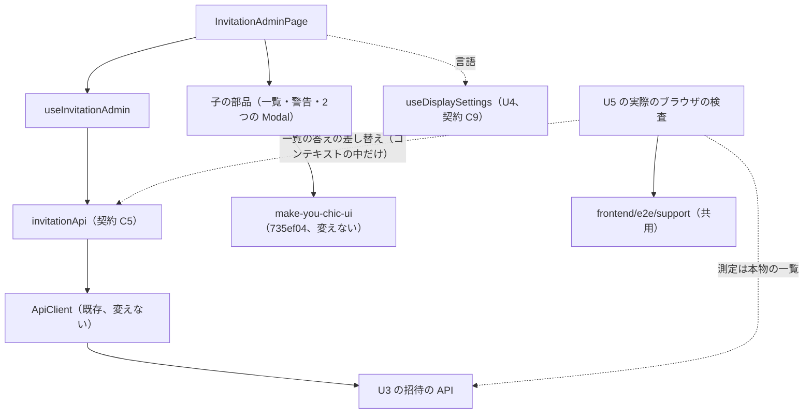

# Logical Components — U5 招待の管理の画面（u5-invitation-ui）

U5 の部品の一覧と、非機能の作りが当たる場所をまとめた文書です。失敗の範囲、アクセシビリティ（Table の足りない口の回避を含む）、実際のブラウザの検査（置き場・組・状態の出し方・ログインの開き方）、多言語、テストの作りをここに置きます。答えは `nfr-design-questions.md` にあります（Q1: A、Q2: A、Q3: A、Consolidated Summary Confirmation: Looks correct）。

出典の略号と、成果物ごとの置き場は `performance-design.md` の冒頭のとおりです。この文書の節と要件の対応は次のとおりです。

| 節 | 置く設計 |
|---|---|
| 1節・2節 | 部品の一覧と関係 |
| 3節 | 失敗の範囲と影響の広がり |
| 4節 | 拡張性・信頼性・観測性の扱い（ui のため成果物を作らない） |
| 5節 | 実際のブラウザの検査（NFR7.3・NFR7.4・NFR9.9、Q1: A・Q3: A） |
| 6節 | アクセシビリティの画面部品の側・Table の足りない口・多言語（NFR7.1・NFR7.2・NFR8.1・NFR8.2・NFR9.5） |
| 7節 | テストとカバレッジ（NFR9.6〜NFR9.9） |
| 8節 | 上流との差 |

## 1. 部品の一覧

| 部品 | 置き場 | 受け持つ非機能 | 設計 |
|---|---|---|---|
| 画面 `InvitationAdminPage` と `useInvitationAdmin` | `frontend/src/features/invitation/` | 重なった読み直しの扱い・待ちの見せ方・失敗の文言・画面の外に出さないこと | `performance-design.md` の2節・3節、`security-design.md` の2節・3節 |
| 子の部品（`InvitationList`・`InvitationUnavailableAlert`・`InviteDialog`・`CancelConfirmDialog`） | 同上 | 表示・フォーカス・アクセシビリティ。API を呼ばない | 6節 |
| API の関数 `invitationApi.ts` と応答の型 `api/types.ts` | `frontend/src/features/invitation/api/` | 決まった項目だけの型、204 の読み方、追加の項目の型の確かめ | `security-design.md` の1節・3.3・3.4 |
| 純粋な関数（`paging.ts`・`focusTarget.ts`・`unavailable.ts`・`inviteInput.ts`・`failureMessage.ts`） | 同上 | 性質ベースのテストの対象、文言の鍵の選び方 | 7節、`security-design.md` の3.1 |
| 日時の書式 `formatDateTime` | `frontend/src/shared/format/`（`features/dsl/format.ts` から移す） | DSL の画面のふるまいを変えない | 7節 |
| 既存の ApiClient | `frontend/src/shared/api-client/` | トークンの付与・401 での更新・`Accept-Language`。変えない | `security-design.md` の前提 |
| U4 の表示の設定の口 `useDisplaySettings` | U4（契約 C9） | 画面の言語。読むだけ | 6.3 |
| make-you-chic-ui の Table・Modal・Button・RadioGroup・Alert・Badge・`useToast` | `vendor/make-you-chic-ui`（735ef04） | 表・Modal のアクセシビリティの土台。中身は変えない | 6.2、`security-design.md` の7節 |
| 実際のブラウザの検査 | `frontend/e2e/` の `050-` の後の番号の新しいファイル（番号は B5 のコード生成の計画で決める） | 組ごとの axe と横のはみ出し、画面の時間の測定 | 5節、`performance-design.md` の4節 |
| 検査の手伝い（共用） | `frontend/e2e/support/`（U4 が B4 で作る） | 組の切り替え・axe-core の読み込みと実行・はみ出しの判定・CSP の違反の集め。U5 はここにログインの関数と一覧の見本を足す | 5節 |

## 2. 部品の関係

<!-- Text fallback: InvitationAdminPage は useInvitationAdmin を呼び、useInvitationAdmin は invitationApi（契約 C5）を通して既存の ApiClient を呼び、ApiClient が U3 の招待の API を呼ぶ。InvitationAdminPage の下に子の部品（一覧・警告・2つの Modal）があり、make-you-chic-ui の部品を使う。言語は U4 の useDisplaySettings から読む。U5 の実際のブラウザの検査は共用の frontend/e2e/support を使い、アクセシビリティの検査では一覧の API の答えをコンテキストの中だけで差し替え、測定では本物のサーバーの一覧を読む。 -->

## 3. 失敗の範囲と影響の広がり

| 失敗 | 画面の動き | 影響の広がり |
|---|---|---|
| 一覧が読めない（4xx・5xx・通信の失敗） | 一覧の中に読めなかった表示と「もう一度読み込む」。「招待する」は押せない（W10・D3） | この画面の中だけ。サイドバーとほかの画面は使える |
| 操作（招待・送り直し・取り消し）の失敗 | 一覧の上か Modal の中の `role="alert"`。知らせは1つだけで置き換わる（W10） | 同上 |
| 招待を使えない設定（503、`invitationEnabled` が偽） | 警告を出し、「招待する」と「送り直す」を押せなくする。「取り消す」は押せる（W3） | 同上 |
| 受け手が応答の手前で遅れ続ける（U1 の NFR6.3 の既知の限界） | 招待の Modal が「送信しています」のまま閉じられない。画面の側に時間切れを置かない（`performance-design.md` の3節） | その Modal だけ。ブラウザのタブを閉じる・移動すると画面を離れ、後の答えは捨てる。招待がサーバーに置かれたかは一覧を読み直して確かめる |
| 画面を離れた後に答えが来る | 捨てる（D2） | 無し |
| 401 | ApiClient が更新を試み、だめならログインの画面へ移る | 骨組みの既存の扱いのまま |

- 状態は画面の中だけに持ち、アプリ全体の置き場を作らないため、失敗がほかの機能の画面に及ぶ道はありません。

## 4. 拡張性・信頼性・観測性の扱い

U5 は種類 ui のため、`scalability-design.md`・`reliability-design.md`・`observability-design.md` を作りません。要点は次のとおりです。

| 分類 | 扱い |
|---|---|
| 拡張性 | 状態はブラウザの1つのタブの中だけ。1ページ 20 行で、件数が増えても描く量は変わらない。一覧の件数に応じた負荷は U3 の API の持ち主 |
| 信頼性 | 失敗の扱いは3節のとおり。画面の側に再試行・時間切れを置かず、利用者の「もう一度読み込む」と操作の後の読み直しで戻る |
| 観測性 | 画面の側に独自の指標・ログの送り先・外部への送信を足さない。`console` にメールアドレス・氏名を出さない（`security-design.md` の2節）。サーバーの側の要求の数と時間は既存の `http.server.requests` と U3 の観測性の設計で見える |

## 5. 実際のブラウザの検査（NFR7.3・NFR7.4・NFR9.9、Q1: A・Q3: A）

### 5.1 置き場と非干渉

| 項目 | 作り |
|---|---|
| ファイル | `frontend/e2e/` の `050-display-accessibility.e2e.ts`（U4）の後の番号の新しいファイル（例: `05x-invitation-accessibility.e2e.ts`）。U4 の 050 と既存の 010〜040 のファイルは変えない。アクセシビリティの検査と画面の時間の測定（`performance-design.md` の4節）を同じファイルに置く |
| 実行 | `./gradlew e2eTest` の中（`./gradlew verify` と CI の外）。`workers: 1` のまま番号の順に動く |
| 本数 | 流れの E2E ではないため、`team.md` の「機能の Intent ごとに代表の流れを1本まで」に数えない |
| ブラウザの状態 | 組ごとに `browser.newContext()` で新しいコンテキストを作り、終わったら閉じる。表示の設定の値と差し替えは、そのコンテキストの中だけに置く |
| サーバーの状態 | アクセシビリティの検査は、ログイン（成功）と一覧の読み取り（差し替え）だけで、招待・取り消しの要求は送らない。ログインの成功は実行ごとの一時の内部DB の監査に残るだけで、ロックの回数（失敗だけを数える）に影響しない。測定は招待を 21 件置く（`performance-design.md` の4.2） |
| 後のファイルへの影響 | 測定で置いた招待と、ログインの監査の記録が残る。後のファイル（U6 の E2E-1 など）は一覧の件数・順・監査の件数に頼らない作りにする |
| U6・U7 とそろえること | 次の3つは B5 のコード生成の計画で U6・U7 とそろえて決める。(1) B5 の検査のファイルの番号と並び（U5・U6・U7 の検査と E2E-1 の順）。(2) 初期管理者の設定（`frontend/playwright.config.ts` の `adminEmail`・実行ごとに作るパスワード）を変えない方針。(3) 共用の検査の手伝い（`frontend/e2e/support/`）に足す関数（ログイン・見本の組み立て）の形と置き場 |

### 5.2 組と対象

| 組 | 軸 | 表示の幅 | 対象の状態 | 出典 |
|---|---|---|---|---|
| (a) | テーマ `light`・`dark` × 文字の大きさ `sm`・`md`・`lg`（ブランドカラーは `blue`） | 既定（`Desktop Chrome`） | 一覧（行あり）・警告・招待の入力の Modal・取り消しの確かめの Modal | NFR7.3 |
| (b) | ブランドカラー `blue`・`green`・`purple`・`orange` × テーマ（文字の大きさ `md`） | 既定 | 同上 | NFR7.3 |
| (c) | テーマ × 文字の大きさの6組（ブランドカラーは `blue`） | 375px × 812px | 一覧（行あり）・招待の入力の Modal・取り消しの確かめの Modal（警告は入れない） | NFR7.4 |

- 組の切り替え方（`addInitScript` で U4 の鍵を置く、`/api/appearance` を `page.route` で差し替える、`viewport` を変える）と、切り替えが効いたことの確かめは、U4 の `logical-components.md` の5.3 のとおり共用の手伝いを使います。
- axe の読み込み方と合否の規則（WCAG 2.0・2.1 の A・AA のタグ、`color-contrast` と `scrollable-region-focusable` が流れたことの確かめ）は、U4 の `security-design.md` の6節のとおりです。
- 横のはみ出しの判定は U4 の5.4 のとおり、`document.documentElement.scrollWidth` が表示の幅以下であることです。一覧の表は Table の包む要素（`overflow-x: auto`）の中だけで横に動くため、文書の横の大きさに出ない前提です。
- 画面の言語は既定のロケール（`ja-JP`）の日本語です。en の画面は画面部品のテストで見ます（6.3）。

### 5.3 状態の出し方（Q1: A）

| 状態 | 出し方 |
|---|---|
| 一覧（行あり） | そのコンテキストのページで `GET /api/admin/invitations` を `page.route` で受け、見本の `InvitationPage` を 200 で返す。20 行・全件数 21 以上・`invitationEnabled: true`。行には送信の結果 SENT・FAILED、期限内・期限切れ、招待した管理者の空（「（不明）」）、言語 ja・en を含める |
| 警告 | 同じく、`invitationEnabled: false`・理由 `SMTP_NOT_CONFIGURED`・`BASE_URL_NOT_CONFIGURED` の2つ・行ありの見本を返す |
| 招待の入力の Modal | 一覧（行あり）の後に「招待する」を押して開く。入力も送信もせずに検査し、「やめる」で閉じる |
| 取り消しの確かめの Modal | 1行目の「取り消す」を押して開き、検査し、「やめる」で閉じる。要求は送らない |

- 1つの組の中で、一覧（行あり）→ 招待の入力の Modal → 取り消しの確かめの Modal の順に、同じコンテキストで出します。警告は、同じコンテキストで差し替えの答えを警告の見本に替え、ページを読み込み直して出します（(a)・(b) だけ）。読み込み直しでは、同じコンテキストの Cookie のリフレッシュトークンで復元の道（`LoginStateGate`）を通ってログイン状態に戻り、ログインし直しは要りません（作り直された Cookie は同じコンテキストに入るため）。
- 見本は共用の手伝いの中の関数で、`frontend/src/features/invitation/api/types.ts` の型を読み込んで組み立てます。契約 C5 の項目の食い違いは型検査（`./gradlew verify` の中）で止まります。値は `example.com` の下の固定のメールアドレスと架空の氏名です（`security-design.md` の6節）。
- 差し替えるのは一覧の API だけです。そのほかの要求（ログイン・トークンの更新・`/api/appearance` の組の値・画面の塊）は本物のままです。

### 5.4 ログインの後の画面の開き方（Q3: A）

- リフレッシュトークンは HttpOnly の Cookie で、使うたびに作り直されます。そのため1回のログインの状態を複数のコンテキストで使い回せず、コンテキストごとにログインします。
- コンテキストごとに、ログインの画面のフォームから管理者（`frontend/playwright.config.ts` の `adminEmail`・`adminPassword`）でログインし、骨組みの画面が出た後にサイドバーの「利用者の招待」を押して開きます（既存の 030・040 と同じ道）。ログインの操作は共用の手伝いに関数を1つ置いてまとめ、既存の 030・040 は変えません。
- 組の切り替えの初めのスクリプトと差し替えは、ログインの画面を開く前に置きます。ログインの画面から骨組みへの移りは画面の中の移動のため、置いた値がそのまま効きます。
- 1回の実行でログインは、(a) 6・(b) 8・(c) 6 の 20 組と測定の5回で約 25 回です。

### 5.5 結果の記録

- 組・状態ごとの成否と違反の件数・規則の名前・判定できなかった要素（`incomplete`）を、テストの注記と添付（JSON）で残し、Build and Test がそれを結果に写します（U4 の5.6 と同じ）。
- 画面・認証に関わる変更を統合する前と、リリースの前に、手元で `./gradlew e2eTest` を実行します（`team.md` の Testing Posture）。

## 6. アクセシビリティの画面部品の側・Table の足りない口・多言語

### 6.1 画面部品の側（NFR7.1・NFR7.2）

| 決まり | 作り |
|---|---|
| 状態を文字で示す | 送信の結果「送信済み」「送信に失敗」、状態「期限内」「期限切れ」を Badge の文字で示し、色と記号は補助 |
| 行のボタンの名前 | 「送り直す」「取り消す」の `aria-label` にその行のメールアドレスを含める（D13） |
| 言語の名前 | U4 の `LANGUAGE_NAMES` を訳さずに使い、`lang` 属性を付ける |
| Modal | 背景のクリックで閉じない（`closeOnBackdropClick={false}`）。閉じたら開く前のボタンへフォーカスを戻す（make-you-chic-ui の Modal の動き）。取り消しの確かめは `role="alertdialog"` で、はじめのフォーカスは「やめる」 |
| 送信の間 | フォーカスを押したボタンに保つ（Button の `loading` は `aria-disabled`） |
| vitest-axe | 5つの画面部品（`InvitationList`・`InvitationUnavailableAlert`・`InviteDialog`・`CancelConfirmDialog`・`InvitationAdminPage`）ごとに1件、違反 0 件 |

### 6.2 make-you-chic-ui の Table の足りない口（NFR9.5）

735ef04 の Table は、`mycui-table-wrapper`（`overflow-x: auto`）で包み、`aria-label` を `table` 要素に付けます。包む要素に `tabIndex` と名前は無く、行の class と `caption` の口もありません。`vendor/make-you-chic-ui` は変えず、Table の外側で足します。

| 足りない口 | 回避の作り |
|---|---|
| 表の名前（`caption`） | 見える一覧の見出し `h2`「招待中の人」（`tabIndex=-1`、フォーカスの行き先にも使う）と、Table の `aria-label`「招待中の人」 |
| 行ごとの class（目立たせた行） | 列の `render` で描くメールアドレスのセルの受け口の中に `data-invitation-highlighted` の印を置き、機能の CSS で `.invitation-list tr:has([data-invitation-highlighted])` のように行に枠の線と背景を付ける。Table の中の class は上書きしない |
| 横に動く領域の名前とキーボード | 名前は付けない。各行に押せるボタン（「取り消す」は招待を使えないときも押せる）があるため、キーボードで領域の中の要素に届き、フォーカスした要素はブラウザが見える位置へ動かす。axe の `scrollable-region-focusable` はこの前提で通る見込みで、5.2 の (c) で確かめる |

- Table の中の class・`data-testid` を探して見た目やフォーカスを当てることはしません（機能設計の 3.3）。行の要素への参照は `render` で描く要素に付けます。
- `scrollable-region-focusable` が落ちたとき（例: 見本の行のボタンがすべて押せない状態になる）は、見本を変えて合格させることはせず、画面の作りを見直して依頼者に相談します。

### 6.3 多言語（NFR8.1・NFR8.2）

- 文言は `invitation.*` の鍵で ja・en の両方を持ち、既定は日本語です。部品の文言はすべて `useInvitationText` で引き、表示の言語は `useDisplaySettings().language` を使います（日時の書式の言語も同じ）。
- make-you-chic-ui の Table の `labels` の7項目と Modal の `closeLabel` を画面の言語で渡し、en の画面に make-you-chic-ui の日本語の既定の文言を出しません。
- 確かめは、文言の鍵の一覧が ja と en で一致すること（`registration.ts` のテストと既存の登録の検査）、en の画面で en の文言が出て Table と Modal の日本語の既定の文言が無いこと（`InvitationList`・`InviteDialog`・`CancelConfirmDialog`・`InvitationAdminPage` の画面部品のテスト）です。

## 7. テストとカバレッジ（NFR9.6〜NFR9.9）

| ID | 作り |
|---|---|
| NFR9.6 | フロントエンドのカバレッジの下限（行 80%・分岐 70%、`@vitest/coverage-v8` の `thresholds`）を守る。U5 のために計測の除外を増やさない。`frontend/e2e/` の下の検査と手伝いは Vitest の計測の対象外（既存の E2E と同じ扱い）で、除外の設定は変えない。テストの補助 `frontend/src/features/invitation/testing/` はテストからだけ使う |
| NFR9.7 | fast-check の性質ベースのテストを `paging.ts`（任意の全件数と有効なページで、始まり ≦ 終わり ≦ 全件数、1ページの件数 ≦ 20、補正の結果が 1 以上ページの数以下）と `inviteInput.ts`（空白だけの文字列はすべて空）に当てる。失敗時の乱数の種を記録する |
| NFR9.8 | `formatDateTime` と、そのテスト（ja・en・時差・不正な値、時差を固定）を `frontend/src/shared/format/` へ移す。DSL の画面（`DslStatusPanel`・`DslConfirmDialog`・`DslHistoryTable`）は読み込み先だけを変え、既存のテストがそのまま通る |
| NFR9.9 | U5 では流れの E2E を足さない。5節の検査と測定は流れではないため本数に数えない。U5 の変更の後に、E2E-1（U6）と既存の E2E（010〜040）と U4 の 050 が通ることを B5 で `./gradlew e2eTest` を実行して記録する |

- テストの説明文は英語、対象と同じ場所の `*.test.ts(x)` に置きます（`team.md`）。API は `invitationApi` の関数を差し替え、日時は時差を固定します（部品 7節）。

## 8. 上流との差

承認済みの文書は書き換えません（`aidlc/spaces/default/memory/project.md` の Way of Working）。

| 決定 | 文書 | 承認済みの記述 | この段での扱い |
|---|---|---|---|
| 検査の状態を一覧の答えの差し替えで出す（Q1: A） | NFR 要件の NFR7.3 | 行を置くための招待と、警告に要る招待を使えない状態は、検査の中で自分で用意する | `page.route` の見本で用意する形に決めた。前のテストの状態に頼らない点はそのまま。本物の形の確かめは `security-design.md` の6節 |
| 警告の状態をページの読み込み直しで出す | 機能設計の W3 | 招待を使えないときの警告 | 同じコンテキストで差し替えの答えを替えて読み込み直す。検査のための手順で、画面の作りは変えない |
| ログインの後の画面をコンテキストごとにログインの画面から開く（Q3: A） | U4 の `logical-components.md` の5.1 | B4 の検査はログインしない。B5 のログインの後の画面は前提をその検査の中で自分で作る | ログインの開き方を決めた。U4 の決まりのとおりで、U4 の文書は書き換えない。追加 |
| 検査のファイルの番号・初期管理者の設定・共用の手伝いを B5 の計画で U6・U7 とそろえる | U4 の `logical-components.md` の5.1（番号は見込み、コード生成で決める） | ファイルの番号はコード生成で決める | U5 の分も B5 のコード生成の計画で U6・U7 とそろえて決めると書いた。食い違いではない |
| Table の足りない口の回避の作り | NFR 要件の NFR9.5、機能設計の `frontend-components.md` の4節 | Table の外側（見える見出し・`aria-label`・機能の CSS）で足す | 回避の具体（`:has()` の印、横に動く領域は名前を付けず行のボタンで届く）を決めた。NFR9.5 のとおりで、食い違いではない |
