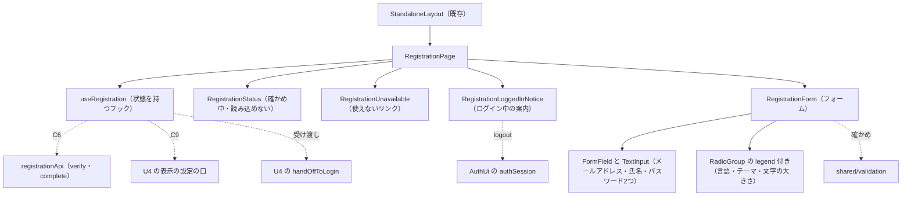

# Frontend Components — U6 登録の完了の画面（u6-registration-ui）

画面の流れ（W1〜W13）・決まり（D1〜D12）・状態の移り変わり・応答ごとの動き・文言・確かめの関数の形は `functional-spec.md` が正本で、ここでは繰り返さない。ここでは部品の階層、props と state、状態を持つフック、API（契約 C6）との受け渡し、U4 の口（契約 C9 と受け渡し）の使い方、置き場のモジュール、テストで確かめる内容を示す。画面の配置と動きは `aidlc/spaces/default/intents/260925-user-management/inception/refined-mockups/` の `mockups.md`（S2）・`interaction-spec.md`（5節）・`design-system-mapping.md`・`accessibility-checklist.md` が正本。

## 1. 部品の階層

画面 `/register` は骨組みの振り分けで `StandaloneLayout` の中に置かれる（`layout: 'STANDALONE'`、`functional-spec.md` の W1）。

| 階層 | 部品 | 置き場 | 役割 |
|---|---|---|---|
| 1 | `StandaloneLayout` | `frontend/src/app/layout/`（既存、変えない） | アプリシェルの外の配置 |
| 2 | `RegistrationPage` | `frontend/src/features/registration/` | 画面の入口。`useRegistration` を使い、状態ごとに子を切り替える。Card・アプリ名・見出し h1 を持つ。外れるときに `clearPreview` |
| 3 | `RegistrationStatus` | 同上 | `verifying`（読み込み中）・`loadFailed`（読み込めない＋「もう一度読み込む」）の表示 |
| 3 | `RegistrationUnavailable` | 同上 | `unavailable` の表示（警告の Alert と「ログインの画面へ」のリンク） |
| 3 | `RegistrationLoggedInNotice` | 同上 | `loggedIn`・`loggingOut` の表示（情報の Alert と2つのボタン） |
| 3 | `RegistrationForm` | 同上 | `ready`・`submitting` のフォーム |
| 4 | RadioGroup（`legend` を渡す形） | make-you-chic-ui（新しい版、B4 で固定先を更新） | 言語・テーマ・文字の大きさの `fieldset`・`legend`・ラジオの組。変えない |
| 4 | FormField・TextInput・Button・Alert・Card | make-you-chic-ui | 変えない。Button は新しい版の `loading`（`aria-disabled`） |

<!-- Text fallback: 既存の StandaloneLayout の中に RegistrationPage を置く。RegistrationPage は状態を持つフック useRegistration を使い、状態に応じて RegistrationStatus（確かめ中・読み込めない）、RegistrationUnavailable（使えないリンク）、RegistrationLoggedInNotice（ログイン中の案内）、RegistrationForm（フォーム）のどれか1つを描く。RegistrationForm は make-you-chic-ui の FormField と TextInput でメールアドレス・氏名・パスワード2つを、make-you-chic-ui の RadioGroup（legend を渡して fieldset と legend で描く形）で言語・テーマ・文字の大きさを描く。useRegistration は registrationApi で契約 C6 の verify・complete を呼び、U4 の表示の設定の口（C9）と受け渡しの口 handOffToLogin を使う。ログイン中の案内は AuthUi の authSession の logout を呼ぶ。フォームの確かめは shared/validation の関数を使う。 -->

## 2. 置き場ごとのモジュール

| 置き場 | モジュール | 役割 |
|---|---|---|
| `frontend/src/features/registration/` | `registration.ts` | 機能の登録（featureId `registration`、画面 `/register`、`STANDALONE`・`PUBLIC`、遅延読み込み、文言 ja・en）。サイドバー・ユーザーメニューの項目は無い |
| 同上 | `registrationApi.ts` | 契約 C6 の2つの呼び出し（3節）。ApiClient の `apiRequest` を使う |
| 同上 | `registrationToken.ts` | フラグメントの文字列からトークンを取り出す純粋な関数（`functional-spec.md` の D1）。React に触れない |
| 同上 | `failureKind.ts` | 確かめ・完了の失敗（`ApiError`）を振り分ける純粋な関数（`functional-spec.md` の 5節の表）。`detail` は読まない |
| 同上 | `formProblems.ts` | フォームの値から項目ごとの誤りの種類を集め、最初の誤りの項目を決める純粋な関数。`shared/validation` を使う |
| 同上 | `useRegistration.ts` | 状態を持つフック（4節） |
| 同上 | `RegistrationPage.tsx`・`RegistrationStatus.tsx`・`RegistrationUnavailable.tsx`・`RegistrationLoggedInNotice.tsx`・`RegistrationForm.tsx` と同じ場所の CSS | 画面の部品（5節） |
| `frontend/src/shared/validation/`（新しい） | 氏名・パスワードの確かめの関数と定数 | `functional-spec.md` の 6節。U7 と共用 |

- エクスポートは名前付きだけ、`enum` を使わず文字列リテラルの union、CSS は部品と同じ場所の素の CSS（`team.md` の Code Style）。各ファイルの先頭に Apache License 2.0 のヘッダー（`/* ... */`、2026、agwlvssainokuni）。
- `shared/validation` は `app/` と `features/` を読み込まない。
- 言語・テーマ・文字の大きさの選択は make-you-chic-ui の RadioGroup を使い（6節）、自前のラジオの部品（初めの版の `frontend/src/shared/ui/RadioFieldset`）は作らない。`frontend/src/shared/ui/` の置き場も作らない。
- 依存の向き: `features/registration` → `app/display-settings`・`app/login-handoff`・`app/i18n`・`app/login-state`（U4 の口と骨組み）、`shared/api-client`・`shared/validation`、make-you-chic-ui、`features/auth/authSession`（`logout` だけ、Q1 A）。ほかの機能から `features/registration` への依存は無い。

## 3. API との受け渡し（契約 C6）

| 関数 | 要求 | 成功の戻り値 | 失敗 |
|---|---|---|---|
| `verifyRegistration(token)` | `POST /api/registration/verify`、`Content-Type: application/json`、本文 `{ token }` | `{ email, language }`（`language` は `'ja'` または `'en'`） | `apiRequest` が投げる `ApiError`（応答か通信の失敗）をそのまま投げる |
| `completeRegistration(request)` | `POST /api/registration/complete`、本文は CompleteRequest（`token`・`displayName`・`password`・`passwordConfirmation`・`language`・`theme`・`fontSize`） | 無し（204） | 同上 |

- パスは `registrationApi.ts` の定数（`REGISTRATION_VERIFY_PATH`・`REGISTRATION_COMPLETE_PATH`）に置く。ApiClient の公開の API のパスに同じ値が入っている（U4 の R-01 の直しで入った U4 の D10、`functional-spec.md` の 10節）。
- トークンは本文だけに入れ、パス・問い合わせ・見出しに入れない（`functional-spec.md` の D3）。
- `Accept-Language` は付けない（U4 の ApiClient が画面の言語で付ける。呼び出し側が指定すると上書きされないため、指定しない）。
- 確かめの応答の `language` が `ja`・`en` でない、`email` が文字列でないときは、形の誤りとして `loadFailed` と同じ扱いにする（サーバーの契約の外れで画面を壊さない）。
- 応答・失敗の値をログに出さない。

## 4. 状態を持つフック `useRegistration()`

### 4.1 持つ値

| 値 | 型 | 初期値 | 意味 |
|---|---|---|---|
| `phase` | `'loggedIn'`・`'loggingOut'`・`'verifying'`・`'loadFailed'`・`'unavailable'`・`'ready'`・`'submitting'`・`'completed'` のどれか | 最初の描画で決める（W2・W3） | 画面の状態（`functional-spec.md` の 3節） |
| `token` | 文字列または無し | 最初の描画でフラグメントから取り出す | メモリだけに持つトークン |
| `invitation` | `{ email, language }` または無し | 無し | 確かめの 200 の値 |
| `values` | `{ displayName, password, passwordConfirmation, language, theme, fontSize }` | 確かめの 200 で `displayName` はメールアドレス、`language` は招待の言語、`theme` は `system`、`fontSize` は `md`、パスワード2つは空 | フォームの値（選んだ値を含む） |
| `problems` | 項目（`displayName`・`password`・`passwordConfirmation`）ごとの誤りの文言の鍵 | 空 | 画面の確かめの誤り |
| `failure` | `'validationFailed'`・`'submitFailed'` のどれか、または無し | 無し | フォームの上の失敗の知らせ |
| `focusTarget` | 項目の名前・知らせ・無し | 無し | 次の描画の確定の後にフォーカスを移す先（部品が読んで移し、消す） |

- `token` の取り出しは状態の初期値を作る関数の中で行い（StrictMode の二重の描画でも、どちらもフラグメントを消す前に読む）、フラグメントの消去は描画の確定の後の副作用で1回だけ行う（`functional-spec.md` の W2）。
- 送信中・確かめ中の要求は、部品が外れた後と、新しい要求を送った後には、答えで状態を移さない（古い答えを捨てる印を持つ）。

### 4.2 返す操作

| 操作 | 何をするか | 流れ |
|---|---|---|
| `logoutAndContinue()` | `phase` を `loggingOut` にし、AuthUi の `logout` を呼ぶ。未ログインになったら `verifying` へ | W3 |
| `goHome()` | `/` へ移る | W3 |
| `reload()` | `loadFailed` から `verifying` に戻す | W4 |
| `setDisplayName(value)`・`setPassword(value)`・`setPasswordConfirmation(value)` | 値を変える（確かめはしない） | W6 |
| `selectLanguage(lang)` | `values.language` を変え、`setLanguage(lang)` | W6 |
| `selectTheme(theme)` | `values.theme` を変え、`setPreview(theme)` | W6 |
| `selectFontSize(size)` | `values.fontSize` を変え、`setPreview(undefined, size)` | W6 |
| `submit()` | 画面の確かめ → 誤りなら `problems` と `focusTarget`、通れば `submitting` にして完了の要求 → 応答で移す | W7・W8・W9・W10 |

- `submitting` の間は、`submit()` と `selectLanguage`・`selectTheme`・`selectFontSize`・値を変える操作は何もしない（Button の `loading` とは別にフックでも二重の送信と値の変更を防ぐ、`functional-spec.md` の W8 の1）。

### 4.3 副作用

| きっかけ | 副作用 |
|---|---|
| 最初の描画の確定の後 | フラグメントがあれば、同じパス（問い合わせを含む）へ置き換えの移動（`replace`）をしてフラグメントを消す |
| `phase` が `verifying` になった | 確かめの要求を送る |
| ログイン状態が未ログインになった（`loggedIn`・`loggingOut` の間） | `verifying` へ移す |
| 確かめの 200 | `setLanguage(invitation.language)` を呼び、`values` を初期値にして `ready` |
| 完了の 204 | `saveBrowserDisplaySettings({ language, theme, fontSize })` → `handOffToLogin(invitation.email)` → `/login` へ置き換えの移動（この順、`functional-spec.md` の D11） |
| 部品が外れる | `clearPreview()`（`functional-spec.md` の D12） |

## 5. 部品ごとの props と state

| 部品 | props | state・読む値 | 要点 |
|---|---|---|---|
| `RegistrationPage` | なし（画面の部品） | `useRegistration()`、`useMessages()` | Card の中にアプリ名（`app.name`）と h1（`registration.heading`、id を振ってフォームの名前に使う）を置き、`phase` で子を1つ描く。`completed` では何も描かない |
| `RegistrationStatus` | `kind`（`'verifying'` または `'loadFailed'`）・`onReload` | — | `verifying` は `role="status"` の文字（`registration.verifying`）。`loadFailed` は失敗の Alert（`role="alert"`、`registration.loadFailed`）と secondary の Button「もう一度読み込む」 |
| `RegistrationUnavailable` | なし | — | 警告の Alert（`role="alert"`、記号つき、`registration.unavailable`）と、React Router のリンク「ログインの画面へ」（`/login`）。リンクはボタンの見た目にしない（移動の操作のため） |
| `RegistrationLoggedInNotice` | `loggingOut`（真偽）・`onLogout`・`onHome` | — | 情報の Alert（`registration.loggedIn.message`）、primary の Button（`loggingOut` の間は `loading` で `aria-disabled`・`aria-busy`、押しても何もしない、フォーカスは保つ、文言は `registration.loggedIn.loggingOut`）、secondary の Button「ホームへ戻る」 |
| `RegistrationForm` | `headingId`・`email`・`values`・`problems`・`failure`・`submitting`・`focusTarget` と各操作 | 項目の要素への参照（フォーカスを移すため） | `form`（`aria-labelledby` に `headingId`、`noValidate`）。失敗の知らせはフォームの上の Alert（`role="alert"`）。項目は `functional-spec.md` の W5 の順と属性。描画の確定の後に `focusTarget` の要素へフォーカスを移す。`submitting` の間は、送信の Button（`type="submit"`）を `loading` にし（文言は `registration.submitting`）、氏名・パスワードの欄を `readOnly` にし、RadioGroup は `disabled` にせず選んでも値を変えない（フォーカスを失わないため、`functional-spec.md` の W8 の1） |

- メールアドレスの欄: TextInput に `readOnly`・`type="email"`・`autoComplete="username"`・`value` は招待のメールアドレス。`disabled` にしない（AC3.2.16）。
- パスワードの2つの欄: TextInput に `type="password"`・`autoComplete="new-password"`（CR6.9）。パスワードの欄の FormField の案内（`helperText`）は `registration.password.hint`（CR6.2）。誤りがあるときは FormField が案内の代わりに誤りを出す。
- 氏名の欄: FormField の案内は `registration.displayName.hint`、`required` の印。
- 言語・テーマ・文字の大きさの3つは、どれも make-you-chic-ui の RadioGroup に `legend` を渡して描く（6節）。
- 3つの RadioGroup の前に h2「表示の設定」（`registration.display.heading`）を置く。

## 6. make-you-chic-ui の RadioGroup の使い方

make-you-chic-ui の新しい版（`origin/main` の `735ef04`。固定先の更新はコード生成の B4）の RadioGroup を使う。`options` の `label` は ReactNode、選択肢ごとに `lang`（BCP 47）を渡せ、`legend` を渡すと `role="radiogroup"` の `div` ではなく `fieldset`・`legend` で描く。自前の部品は作らない（`functional-spec.md` の 10節）。

| まとまり | `name` | `legend` | `options`（並び・`label`・`lang`） | `value`・`onChange` |
|---|---|---|---|---|
| 言語 | `language` | `registration.language.legend` の文字と、2行目の小さな文字の案内 `registration.language.hint` | `ja`（`LANGUAGE_NAMES` の「日本語」、`lang: 'ja'`）・`en`（「English」、`lang: 'en'`） | `values.language`・`selectLanguage` |
| テーマ | `theme` | `registration.theme.legend` | `system`・`light`・`dark`（`display.theme.system`・`display.theme.light`・`display.theme.dark`、`lang` は渡さない） | `values.theme`・`selectTheme` |
| 文字の大きさ | `fontSize` | `registration.fontSize.legend` | `sm`・`md`・`lg`（`display.fontSize.sm`・`display.fontSize.md`・`display.fontSize.lg`、`lang` は渡さない） | `values.fontSize`・`selectFontSize` |

- 言語の選択肢の文字は訳さない（`LANGUAGE_NAMES`）。選択肢ごとの `lang` で、読み上げがその言語で読む（CR6.6）。テーマ・文字の大きさの選択肢は画面の言語の文言のため `lang` を渡さない。
- 案内: RadioGroup は `aria-describedby` を渡す口を持たない（FormField の中に置くと FormField の `label` と `legend` が重なるため、FormField には入れない）。そのため、言語の案内は、選ぶと画面の言語が変わることを選ぶ前に知らせるため `legend` の中に入れる（まとまりに入ったときに名前と一緒に読まれる）。テーマと文字の大きさの案内 `registration.appearance.hint` は、文字の大きさの RadioGroup の下に文字として置き、結び付けない（見た目だけが変わり、読み上げの位置は変わらないため）。
- `legend` の2行目の見た目は部品と同じ場所の素の CSS で整える。make-you-chic-ui の内部のクラス名には頼らない（`legend` に渡す要素に自分のクラスを付ける）。
- 値は外から渡す形（`value`・`onChange`）で使う。言語を切り替えて文言が変わっても RadioGroup に `key` を付け替えず作り直さないため、選んだラジオの入力の要素が残り、フォーカスは選んだラジオのまま（`accessibility-checklist.md` の 2節、`functional-spec.md` の W6 の5）。矢印キーはブラウザの標準のラジオの動き（同じ `name`）。
- `disabled` は使わない。`submitting` の間は `onChange` で値を変えない（5節の `RegistrationForm`）。
- U7 も同じく RadioGroup を使う（U7 の機能設計が持つ）。

## 7. U4 の口の使い方（契約 C9 と受け渡し）

U4 の `frontend-components.md` の 3.4節の約束のとおり使う。

| 口 | 置き場 | 呼ぶ時点 | 流れ |
|---|---|---|---|
| `useDisplaySettings().setLanguage(lang)` | `frontend/src/app/display-settings/` | 確かめの 200（招待の言語）、言語を選んだとき | W5・W6 |
| `useDisplaySettings().setPreview(theme)` | 同上 | テーマを選んだとき | W6 |
| `useDisplaySettings().setPreview(undefined, fontSize)` | 同上 | 文字の大きさを選んだとき | W6 |
| `useDisplaySettings().clearPreview()` | 同上 | 部品が外れるとき | W12 |
| `saveBrowserDisplaySettings({ language, theme, fontSize })` | 同上 | 完了の 204 の直後（1番目） | W9 |
| `LANGUAGE_NAMES` | 同上 | 言語の選択肢の文字 | W5 |
| `handOffToLogin(email)` | `frontend/src/app/login-handoff/` | 完了の 204（2番目、保存の後） | W9 |
| `useLoginState()` | `frontend/src/app/login-state/`（既存） | 最初の描画と、ログイン状態が変わったとき | W3 |
| `useMessages()` | `frontend/src/app/i18n/`（既存） | 文言 | 7節の文言 |

- `useTheme`（make-you-chic-ui）は直接呼ばない（U4 の `functional-spec.md` の 2節）。
- `setPreview` はテーマと文字の大きさの一方だけを渡し、もう一方の見せ方を置かない（まだ選んでいない軸はブラウザの保存の値の表示のまま、`functional-spec.md` の D7）。

## 8. テストで確かめる内容

`team.md` の決まりに従う（対象と同じ場所の `*.test.ts(x)`、Vitest・Testing Library（jsdom）・user-event・vitest-axe、画面部品ごとにアクセシビリティの検査を1件、説明文は英語）。API は `fetch` の差し替え、U4 の口とログイン状態は本物（`renderWithProviders`、ブラウザの保存は jsdom の localStorage、OS の配色は `matchMedia` の差し替え）で動かす。

| 対象 | 確かめる内容 | 上流 |
|---|---|---|
| `shared/validation`（性質ベース、fast-check、種を記録） | `functional-spec.md` の 9節の性質と境界。前後の除去が U2 の White_Space の集合に従う（U+3000・U+00A0・U+0085 は除かれ、U+FEFF は除かれずに Cf として `invalidCharacter` になる） | U2 の BR1.1〜BR1.4、AC3.2.4・AC3.2.9 |
| `registrationToken` | `#token=abc` から `abc`、無い・空・ほかの鍵だけ・フラグメントが無いときは無し、値の URL の符号化を戻す | D1 |
| `failureKind` | 5節の表の全行（確かめ・完了ごと、code の違い・無い、通信の失敗） | `functional-spec.md` の 5節 |
| `RegistrationPage`（開く） | 言語 ja の招待、ブラウザの言語 en で開くと、確かめの後に ja の文言・`<html lang="ja">`、氏名にメールアドレス・言語 ja・テーマ system・文字の大きさ md が選ばれ、テーマ・文字の大きさはブラウザの保存の値（例: dark・lg）で表示される。アプリシェルの外に出る | AC3.2.1、W1・W5 |
| 同上 | 確かめの要求の本文にトークンがあり、URL にトークンが無い。描画の後にフラグメントが消える。トークンが localStorage・sessionStorage に無い | D2・D3、W2 |
| 同上 | フラグメントが無い・空なら API を呼ばずに使えないリンクの表示 | D1、W2 |
| 同上 | 確かめの 404 で使えないリンクの文（AC3.2.2 の趣旨）と「ログインの画面へ」のリンク（`/login`）、フォームが無い | AC3.2.2、W11 |
| 同上 | 確かめの 500 と通信の失敗で「読み込めませんでした」と「もう一度読み込む」、押すと同じトークンで確かめ直して表示される | D5、W4 |
| 同上 | ログインしたまま開くと確かめを送らずに案内を出す。「ログアウトして続ける」でログアウトの要求の後に確かめを送る。「ホームへ戻る」で `/` へ | Q1 A、W3 |
| `RegistrationForm` | メールアドレスの欄が `readOnly`・`autocomplete="username"`・`disabled` でない。パスワードの2つの欄が `autocomplete="new-password"`。「12 文字以上」の案内が入力の前に出る | AC3.2.16、CR6.2・CR6.9 |
| 同上 | 画面の確かめの境界（11・12 コードポイント、72・73 バイト、絵文字 11・12 文字、空、不一致、氏名の 254・255 コードポイント、空白だけ）で、誤りは項目の下に文字で出て `aria-describedby`・`aria-invalid` で結び付き、最初の誤りの項目にフォーカスが移り、要求は送られず、入れた値は消えない。長すぎるときは「長すぎます（…）」 | AC3.2.4・AC3.2.9、CR6.1 |
| 同上 | テーマを選ぶと画面のテーマだけが変わり、文字の大きさはブラウザの保存の値のまま（逆も同じ）。ブラウザの保存の値は変わらない。フォーカスは選んだラジオのまま | D7、W6 |
| 同上 | 言語 en を選ぶと文言・`<html lang>` が en になり、出ていた誤りも en になり、次の完了の要求の `Accept-Language` が en。言語の選択肢は「日本語」「English」で `lang` 属性を持つ | CR1.2・CR1.3・CR6.6、W6、CR1 の確かめ方の読み替え |
| 同上 | 送信の間は「登録しています」でボタンが `aria-disabled`・`aria-busy`、フォーカスはボタンに残る。2回押しても、Enter キーで送っても要求は1回。氏名・パスワードの欄は `readOnly`、ラジオを選んでも値と画面の見せ方が変わらない | CR6.3、W8 |
| 同上 | 204 で、ブラウザの保存の値が選んだ en・dark・lg になり、ログインの画面（`/login`）へ移り、ログインの画面に登録が終わった旨の案内とメールアドレスが出て、URL にメールアドレスが無い。ログインの要求は送られない（自動でログインしない） | AC3.2.5・AC3.2.17・AC3.2.18、W9 |
| 同上 | 400 で入力を確かめる知らせ（`role="alert"`）、値が残り、同じ画面から送り直して 204 で完了できる | AC3.2.10、Q3 A、W10 |
| 同上 | 完了の 404 で使えないリンクの表示に移り、フォームと値が消える | AC3.2.11、W10 |
| 同上 | 500 と通信の失敗で登録できない知らせ（`role="alert"`）、値が残る。サーバーの `detail` の文字が画面に出ない | CR6.4、D10、W10 |
| 同上 | 完了せずに部品が外れると、画面の言語・テーマ・文字の大きさがブラウザの保存の値に戻る | D12、W12 |
| 同上（RadioGroup の使い方） | 3つのまとまりが `fieldset`（`role="group"`）で、名前が `legend` の文字（言語は案内を含む）。言語の選択肢の文字が `lang="ja"`・`lang="en"`、テーマ・文字の大きさの選択肢に `lang` が無い。矢印キーで選べる。言語を切り替えた後もフォーカスが同じラジオに残る | CR6.6、W5・W6、6節 |
| 同上（ログアウト中） | 「ログアウトして続ける」を押すと `aria-disabled`・`aria-busy` になり、フォーカスがボタンに残り、もう一度押してもログアウトの要求は1回 | CR6.3、W3 |
| アクセシビリティ（部品ごとに1件） | `RegistrationPage`（確かめ中・使えない・ログイン中の案内・読み込めないの各表示を含めて検査する形は生成で決める）・`RegistrationForm`・`RegistrationUnavailable`・`RegistrationLoggedInNotice`・`RegistrationStatus` | NFR7 |
| E2E-1 | `functional-spec.md` の W13 | E2E-1、NFR9 |

- フロントエンドのカバレッジの下限（行 80%・分岐 70%）を守る（`team.md`）。
- テーマと文字の大きさのすべての組み合わせで崩れないこと（NFR7）の確かめ方は、NFR 要件の段の持ち主のまま。

## 9. 既存への影響

| 既存 | 影響 | 扱い |
|---|---|---|
| 機能の登録の仕組み | 新しい機能 `registration` が1つ増える（自動で読み込まれる） | 仕組みは変えない |
| `frontend/src/features/auth/authSession.ts` | `logout` を登録の完了の機能から呼ぶ依存が1本増える | `authSession.ts` は変えない |
| ApiClient の公開の API のパス | 確かめ・完了のパスが入る | U4 の R-01 の直しで入った（U4 の D10）。この単位では変えない |
| 骨組み・U4 の口 | 使うだけ | 変えない |
| make-you-chic-ui | 新しい版の RadioGroup（`legend`・選択肢ごとの `lang`）と Button（`loading` の `aria-disabled`）を使う | 中身は変えない。サブモジュールの固定先の更新（`edb1f94` から `735ef04`）はコード生成の B4 で専用のコミットとして行い、更新前後のコミットハッシュを記録する（`project.md` の Mandated）。U6 の B5 はその後。Button の `loading` の変更が既存の画面のテスト（`disabled` を確かめるもの）に及ぶかは B4 で確かめる |
| `frontend/e2e/` | E2E-1 の1本が増える | `./gradlew e2eTest` で動かす。リンクの取り出し方は infrastructure-design |
