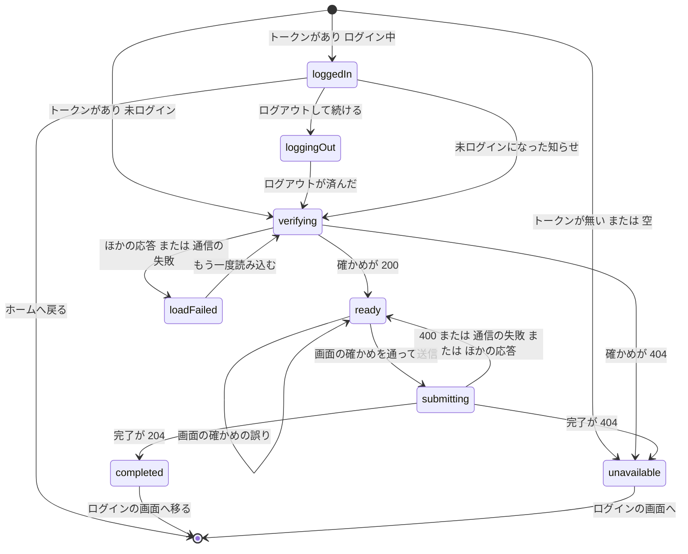

# Functional Spec — U6 登録の完了の画面（u6-registration-ui）

U6 は、招待のリンクから開く、ログインなしの単独の登録の完了の画面（画面 S2、機能 `features/registration`）を受け持つ画面の単位（種類 ui）である（`aidlc/spaces/default/intents/260925-user-management/inception/units-generation/unit-of-work.md`）。

- 正本: この文書は、画面の流れ（W1〜W13）と画面の状態の移り変わりの正本である。U6 は画面の単位のため、保存するデータ（エンティティ）と `rules.md` を持たない。流れの中で守る決まりは 2節に D1〜D12 として1回だけ書く。部品の階層・props・state・フック・API との受け渡し・U4 の口の使い方は `frontend-components.md` に置く。
- 出典: 質問と答え `functional-design-questions.md`（設計の要点 1〜20・決まっていること・Q1 A・Q2 B・Q3 A・Q4 B、まとめの確認は Looks correct）、契約 C6・C9（`aidlc/spaces/default/intents/260925-user-management/inception/contract-design/contract-summary.md`）、要件 FR4・FR7・FR10.3・NFR1・NFR3・NFR7・NFR8（`inception/requirements-analysis/requirements.md`）、ストーリー US3.2・E2E-1 と共通の決まり CR1・CR6（`inception/user-stories/stories.md`）、画面 S2（`inception/refined-mockups/` の `mockups.md` 5節・`interaction-spec.md` 5節・`design-system-mapping.md`・`accessibility-checklist.md`）、依存する単位の機能設計（`construction/u3-invitation/functional-design/` の BR3.5・BR7.1〜BR7.5、`construction/u4-display-foundation/functional-design/` の W8・W9・W12・D4・D13 と `frontend-components.md` の 3節、`construction/u2-user-preferences/functional-design/rules.md` の BR1.1〜BR1.4・BR4.1）。
- 前提にする直し: U4 のレビューの R-01（登録の完了の API を ApiClient の公開の API のパスに足す）、U3 の R-01・R-02、U1 の R-01 は、質問の「決まっていること」のとおり直した後の形を前提にする。
- 受け持たないこと: 登録の完了の API とサーバーの検証・監査（U3）、利用者の作成（U2）、表示の設定を当てる仕組み・要求の言語・ログインの画面の案内（U4）。make-you-chic-ui（`vendor/make-you-chic-ui`）は変更しない（`project.md` の Forbidden）。

## 1. 用語

| 用語 | 意味 |
|---|---|
| 招待のリンク | `https://<ベース URL>/register#token=<トークン>`（契約 C6）。トークンは URL のフラグメントにだけ載る（U3 の BR3.5） |
| トークン | リンクのフラグメントの `token` の値。この画面ではメモリだけに持つ（D2） |
| リンクの確かめ | `POST /api/registration/verify`。招待を消費せず、監査されない（U3 の BR7.1） |
| 登録の完了 | `POST /api/registration/complete`。204 で利用者が作られる。自動ではログインしない（U3 の BR7.3） |
| 招待の値 | 確かめの 200 の応答の `email`（招待のメールアドレス）と `language`（招待の言語） |
| 選んだ値 | フォームの言語・テーマ・文字の大きさの今の値（選ぶ前は初期値） |
| 見せ方 | U4 の口 `setLanguage`・`setPreview` で画面に当てている、保存していない値（U4 の `functional-spec.md` の1節） |

## 2. 決まり（画面の単位の設計の決まり）

画面の単位のため `rules.md` は作らない。流れの中で守る決まりを D1〜D12 として1回だけ書く（U4 の D1〜D14 とは別の番号の並び）。

| ID | 決まり | 出典 |
|---|---|---|
| D1 | トークンはフラグメントの `token` の値だけから取り、無い・空なら API を呼ばずに「リンクが使えない」にする。形（長さ・文字の種類）は画面で確かめない（形の誤りもサーバーが同じ 404 にする） | 設計の要点 3、U3 の BR7.5 |
| D2 | トークンを取り出したら、すぐに今の履歴の項目のアドレスからフラグメントを消し、トークンは画面のメモリ（部品の状態）だけに持つ。ブラウザの保存（localStorage・sessionStorage）・URL のパスと問い合わせ・画面の文言・`console` に出さない。読み込み直すとトークンは無く「リンクが使えない」になる | Q2 B、設計の要点 17、`project.md` の Forbidden |
| D3 | トークンは要求の本文（JSON の `token`）にだけ入れて送る | 契約 C6、U3 の BR3.5 |
| D4 | ログインしたまま開いたときは、リンクを確かめる前に案内を出し、利用者が「ログアウトして続ける」を選ぶまで確かめない。ログアウトは既存の AuthUi の `logout`（リフレッシュトークンのサーバー側の無効化を含む）で行う | Q1 A |
| D5 | 確かめの 404 `REGISTRATION_LINK_INVALID` と、完了の 404 `REGISTRATION_LINK_INVALID` は、理由によらず同じ「リンクが使えない」の表示にする。確かめの通信の失敗とそれ以外の応答は「リンクが使えない」と見せず、読み込み直せる表示にする | AC3.2.2、AC3.2.11、NFR3、設計の要点 6・13 |
| D6 | 確かめ中と、確かめの前に分かった「リンクが使えない」は、その時点の画面の言語で出す。確かめが通ったら招待の言語を `setLanguage` で当てる。テーマと文字の大きさは、選ぶまでブラウザの保存の値のまま表示する | 設計の要点 7、FR4.3、U4 の W8 |
| D7 | テーマ・文字の大きさ・言語は、選んだ軸だけを選んだ時点で画面に当てる（テーマは `setPreview(theme)`、文字の大きさは `setPreview(undefined, fontSize)`、言語は `setLanguage`）。まだ選んでいない軸はブラウザの保存の値の表示のまま | 設計の要点 8、refined-mockups の Q3 A・Q4 C |
| D8 | 送信の前に、サーバーと同じ決まり（氏名・パスワード・2回の一致）を画面でも確かめ、誤りがあれば送らない。判定はサーバーが正で、画面の確かめはその代わりにしない | 設計の要点 9、CR6.1、`team.md` |
| D9 | 入力の誤り・サーバーの拒否・通信の失敗のどれでも、入れた値（パスワードを含む）は消さない。消すのは、完了の時点で「リンクが使えない」になったときと、完了したときだけ | CR6.1、設計の要点 13 |
| D10 | サーバーの Problem Details の `detail` は画面に出さない。画面は状態コードと `code` で分け、この単位の文言（ja・en）を出す。失敗は画面の中に `role="alert"` で残す | 設計の要点 16、CR6.4 |
| D11 | 完了の成功では、(1) 選んだ3つを `saveBrowserDisplaySettings` で保存し、(2) 招待のメールアドレスを `handOffToLogin` で渡し、(3) `/login` へ履歴を置き換えて移る。自動ではログインしない。メールアドレスは URL に載せない | 設計の要点 12、FR4.7、AC3.2.5・AC3.2.17・AC3.2.18、U4 の W8・W9 |
| D12 | 完了せずに画面を離れる（部品が外れる）ときは `clearPreview` を呼ぶ | 設計の要点 14、U4 の W8 の5 |

## 3. 画面の状態の移り変わり

| 状態 | 表示 | 入る時点 |
|---|---|---|
| `loggedIn` | ログイン中である旨の案内と「ログアウトして続ける」「ホームへ戻る」（W3） | 開いた時点でログイン中で、トークンがある |
| `loggingOut` | 同じ案内で、「ログアウトして続ける」を押せなくし「ログアウトしています」と表示 | 「ログアウトして続ける」を押した |
| `verifying` | 文字つきの読み込み中の表示（`role="status"`、「リンクを確かめています」） | トークンがあり未ログイン。「もう一度読み込む」。ログアウトが済んだ |
| `loadFailed` | 「読み込めませんでした。…」（`role="alert"`）と「もう一度読み込む」 | 確かめが 200・404 以外の応答か、通信の失敗 |
| `unavailable` | 「このリンクは使えません。…」（`role="alert"`）と「ログインの画面へ」のリンク（W11） | トークンが無い・空。確かめの 404。完了の 404 |
| `ready` | 初期値の入ったフォーム。失敗の知らせ（400・送れない）を持つことがある | 確かめの 200。送信が 400・通信の失敗・404 以外の応答で終わった |
| `submitting` | フォームのまま「登録を完了する」を押せなくし「登録しています」、`aria-busy` | 画面の確かめを通って送信した |
| `completed` | 何も描かずにログインの画面へ移る | 完了の 204 |

- 設計の要点 5 の `submitFailed` は、`ready` が失敗の知らせを持つ形で表す（入力できる点が `ready` と同じため）。
- 入力の誤り（画面の確かめ・サーバーの 400）は `ready` のまま、項目の下の誤りか、フォームの上の知らせとして出す。

<!-- Text fallback: 画面を開くと、フラグメントにトークンが無いか空なら unavailable（リンクが使えない）になる。トークンがありログイン中なら loggedIn（ログアウトの案内）、未ログインなら verifying（リンクの確かめ中）になる。loggedIn で「ログアウトして続ける」を押すと loggingOut になり、ログアウトが済んだら verifying に移る。loggedIn のまま未ログインになった知らせを受けたときも verifying に移る。「ホームへ戻る」を押すとホームへ移り、この画面を離れる。verifying は、確かめが 200 なら ready（フォーム）、404 なら unavailable、ほかの応答や通信の失敗なら loadFailed（読み込めない）に移る。loadFailed で「もう一度読み込む」を押すと verifying に戻る。ready で画面の確かめに誤りがあれば ready のまま項目の下に誤りを出し、通れば submitting（送信中）に移る。submitting は、204 なら completed になってログインの画面へ移り、404 なら unavailable、400・通信の失敗・ほかの応答なら入れた値を残したまま ready に戻って失敗の知らせを出す。unavailable では「ログインの画面へ」のリンクで画面を離れられる。 -->

## 4. 画面の流れ

### W1. 画面を開く（登録と振り分け）

1. 機能の登録（`frontend/src/features/registration/registration.ts`、featureId `registration`）で、画面 `/register` を `layout: 'STANDALONE'`・`access: 'PUBLIC'`（role なし）として足す。画面の部品は遅延読み込みにする（既存の `frontend/src/features/auth/registration.ts` と同じ形）。サイドバーとユーザーメニューの項目は足さない。
2. 振り分け（既存の `frontend/src/app/routing/decideRoute.ts`）は PUBLIC の画面をログイン状態によらず表示する。サーバーは画面の URL に `index.html` を返す（既存の `backend/src/main/java/cherry/mastersmith/config/WebConfig.java`）ため、サーバーの変更は要らない。
3. 画面は既存の `StandaloneLayout` の中に make-you-chic-ui の Card を置き、アプリ名（骨組みの文言 `app.name`）と見出し h1「登録を完了する」を持つ。既存の `LoginLayout` は見出しが「ログイン」に固定のため使わず、変えない。幅は中央の 480px 前後、768px 未満は1列に積み、ラジオの選択肢は折り返す（`interaction-spec.md` の 5節）。
4. U4 の土台により、開いた時点の画面はブラウザの保存の値（無い軸はブラウザの言語設定・`system`・`md`）で表示される（U4 の W4）。見た目の設定（ブランドカラー・フォントファミリー）も U4 が当てる（CR2）。

### W2. トークンの取り出しとフラグメントの消去（Q2 B）

1. 最初の描画で1回だけ、今の場所（React Router の場所）のフラグメントを `key=value` の並びとして読み、`token` の値を取り出して部品の状態に置く（D1）。開発時の StrictMode の二重の描画でも、どちらの描画もフラグメントを消す前に読むため値は失われない。
2. 描画の確定の後、フラグメントがあれば、今の履歴の項目を同じパス（問い合わせを含む）でフラグメントの無いアドレスに置き換える（D2）。置き換えは React Router の置き換えの移動（`replace`）で行い、ルーターの場所の情報と `history` の項目を食い違わせない（内部で `history.replaceState` と同じく履歴の項目を増やさない）。ログイン中でもこの時点で消す。
3. トークンが無い・空なら、ログイン状態によらず API を呼ばずに `unavailable` にする（D1）。ログアウトも求めない（確かめるものが無いため）。
4. 戻る操作・読み込み直し・閲覧の履歴の同期では、フラグメントの無いアドレスだけが残る。読み込み直すとトークンが無いため `unavailable` になる。メールのリンクを開き直せば続けられる（Q2 B の受け入れた結果）。

### W3. ログインしたまま開いたとき（Q1 A）

1. トークンがあり、ログイン状態（`useLoginState()`）がログイン中なら、確かめを送らずに `loggedIn` にする（D4）。ログイン状態は骨組みのゲートが答えを出してから画面を描くため、開いた時点で決まっている。
2. 表示: `role="alert"` ではなく情報の Alert で「ログインしたままです。登録を続けるには、ログアウトしてください。」を出し、「ログアウトして続ける」（primary）と「ホームへ戻る」（secondary）を置く。
3. 「ログアウトして続ける」を押したら `loggingOut` にし、既存の AuthUi の `logout`（`frontend/src/features/auth/authSession.ts`）を呼ぶ。`logout` は API が失敗しても画面の側の破棄を必ず行い、例外を外へ出さない。
4. ログイン状態が未ログインになったら（`logout` の完了、または更新の失敗などによる未ログインの知らせ）、メモリのトークンで `verifying` に移る。U4 の土台は Guest に移り、この時点では見せ方を置いていないため、画面はブラウザの保存の値で表示される。
5. 「ホームへ戻る」を押したら `/` へ移る。トークンはメモリだけにあったため捨てられる（フラグメントは W2 で消えている）。登録するときはメールのリンクを開き直す。
6. この流れのために、登録の完了の機能から AuthUi の `logout` を呼ぶ依存が1本増える（9節）。

### W4. リンクの確かめ

1. `verifying` に入ったら、`POST /api/registration/verify` を本文 `{ token }` で送る（D3）。ApiClient は、このパスにトークンを付けず、401 での更新と送り直しもしない（U4 のレビューの R-01 の直しの後の公開の API のパス）。`Accept-Language` は U4 の ApiClient がその時点の画面の言語で付ける（U4 の W12）。
2. 応答ごとの動きは 5節の表のとおり。200 は W5、404 `REGISTRATION_LINK_INVALID` は W11、それ以外は `loadFailed`。
3. `loadFailed` では、`role="alert"` の失敗の Alert で「読み込めませんでした。しばらくしてから、もう一度お試しください。」と「もう一度読み込む」ボタンを出す。押すと同じトークンで `verifying` に戻る（使えるリンクを捨てさせないため、D5）。後の段で公開の API の回数の制限が入ったときの拒否（NFR 要件の持ち主）もこの扱いに入る。
4. 開発時の StrictMode で確かめが2回送られても害は無い（確かめは招待を消費しない）。古い要求の答えは捨て、最後に送った要求の答えだけで状態を移す。
5. 確かめ中と、確かめの前に分かった `unavailable` は、その時点の画面の言語で出す（招待の言語はまだ分からない、D6）。

### W5. 確かめが通った時点の表示と初期値

1. 200 の `email`・`language` を招待の値として部品の状態に持ち、`setLanguage(language)` で招待の言語を当てる（D6、U4 の W8 の1）。文言・`<html lang>`・以降の要求の言語が招待の言語になる（CR1.3、U4 の D14）。
2. テーマと文字の大きさはブラウザの保存の値のまま表示する（FR4.3、AC3.2.1）。
3. フォームの初期値: 氏名は招待のメールアドレス、言語は招待の言語、テーマは `system`、文字の大きさは `md`（FR4.2）。表示とフォームの初期値の食い違い（テーマと文字の大きさ）は、項目の下の案内と選んだ時点の反映で扱う（W6、refined-mockups の Q3 A）。
4. 項目（上から順）:
   - ログインに使うメールアドレス: 見える label「メールアドレス（ログインに使います）」、読み取り専用の入力（`readOnly`、`type="email"`、`autocomplete="username"`）。`disabled` にしない（パスワードの管理の道具が組で保存できるように、フォーカスで読めるように、AC3.2.16）。
   - 氏名（必須）: 案内「そのままでも登録できます」。
   - パスワード（必須）: 入力の前の案内「12 文字以上」（CR6.2）。`type="password"`、`autocomplete="new-password"`（CR6.9）。
   - パスワード（確かめ）: `type="password"`、`autocomplete="new-password"`。
   - 表示の設定（見出し）: 言語・テーマ・文字の大きさの3つの `fieldset`・`legend`。言語の選択肢は U4 の `LANGUAGE_NAMES`（「日本語」「English」）で、選択肢の文字に `lang` 属性を付ける（CR6.6）。テーマ・文字の大きさの選択肢は U4 の骨組みの文言 `display.theme.*`・`display.fontSize.*`。言語の下に「選ぶとこの画面の言語が切り替わります」、文字の大きさの下に「テーマと文字の大きさは選ぶと画面に反映されます」を置く（`mockups.md` の S2）。
   - 「登録を完了する」（primary、区切りの中の主な操作は1つ）。
5. フォームは見出し h1 で名前を付け（`aria-labelledby`）、ブラウザの標準の検証を使わない（`noValidate`）。見出しの順は h1 → 表示の設定の見出し（h2）。
6. フォーカスは移さない（読み込み中の表示がフォームに置き換わるだけ）。Tab は上から順に進み、ラジオは矢印キーで選ぶ（`interaction-spec.md` の 5節）。

### W6. 入力と選んだ時点の反映

1. テーマを選んだら `setPreview(theme)`、文字の大きさを選んだら `setPreview(undefined, fontSize)` を呼び、選んだ軸だけを画面に当てる（D7）。まだ選んでいない軸はブラウザの保存の値の表示のまま。
2. テーマ `system` を選んで見せている間も、OS の配色の切り替えに追従する（U4 の D4・W11）。
3. 「言語」を選んだら `setLanguage(lang)` で画面の言語を切り替える。文言・`<html lang>`・以降の要求の `Accept-Language` がそろい（CR1.2・CR1.3）、完了の要求の拒否の説明文（サーバー側）も選んだ言語になる。
4. 画面に出ている誤り・知らせは文言の鍵で持つため、言語を切り替えると同じ描画で新しい言語の文言になる。
5. 選んだ後もフォーカスは選んだラジオのまま。画面が変わったことは読み上げない（選んだ値が読まれるため、`interaction-spec.md` の 5節・`accessibility-checklist.md` の 2節）。`prefers-reduced-motion` のときの切り替えの動きの停止は make-you-chic-ui と U4 の扱いのまま。
6. 氏名・パスワードの入力の間は確かめない（送信のときに確かめる、W7）。

### W7. 画面の側の入力の確かめ

1. 「登録を完了する」を押したら、送る前に `frontend/src/shared/validation/` の関数（6節）で次を確かめる（D8）。
   - 氏名: 前後の Unicode の White_Space の文字を除いた後に、空（空白だけを含む）なら「氏名を入力してください」、254 コードポイントを超えたら「氏名は 254 文字以内で入力してください」、内側に Cc・Cf の文字があれば「氏名に使えない文字（改行・タブ・見えない文字など）が含まれています」（U2 の BR1.1〜BR1.4）。
   - パスワード: 空なら「パスワードを入力してください」、12 コードポイント未満なら「パスワードは 12 文字以上で入力してください」、UTF-8 で 72 バイトを超えたら「長すぎます（半角で 72 文字、全角でおよそ 24 文字まで）」（U3 の BR7.2、refined-mockups の Q6 B）。
   - パスワード（確かめ）: 空なら「確かめのため、同じパスワードをもう一度入力してください」、パスワードと文字の並びとして完全に一致しなければ「パスワードが一致しません」（正規化・前後の空白の除去をしない）。
2. 誤りは項目のすぐ下に文字で出し、項目と結び付ける（`aria-describedby`・`aria-invalid`、make-you-chic-ui の FormField）。色だけで示さない（CR6.1）。
3. 誤りがあれば送らず、上から見て最初の誤りの項目（氏名 → パスワード → パスワード（確かめ）の順）にフォーカスを移す。入れた値（パスワードを含む）は消さない（D9）。
4. 送り直したときは、前の誤りを消してから確かめ直す。直した項目の誤りは次の送信で消える。
5. 言語・テーマ・文字の大きさはラジオのため、いつも許される値のどれかで、確かめない。
6. 画面の確かめを通っても、サーバーが拒否しうる（空白の文字の種類の判定の差、壊れた UTF-16 など）。その場合は W10 の 400 の扱いになる。

### W8. 送信

1. 画面の確かめを通ったら `submitting` にし、「登録を完了する」を押せなくし、文言を「登録しています」に変え、`aria-busy` を付ける（CR6.3、二重の送信を防ぐ）。入力の項目は変えられないままにする。
2. `POST /api/registration/complete` を契約 C6 の CompleteRequest の本文で送る: `token`（メモリの値）、`displayName`（入れたまま。前後の空白の除去はサーバーが行う）、`password`、`passwordConfirmation`、`language`・`theme`・`fontSize`（選んだ値）（D3）。
3. `Accept-Language` は、その時点の画面の言語（選んだ言語）で U4 の ApiClient が付ける（CR1.2）。
4. 応答ごとの動きは 5節の表のとおり。

### W9. 完了の後（U4 の W8・W9）

1. 204 を受けたら `completed` にし、次の順に行う（D11）。
   1. 選んだ3つ（言語・テーマ・文字の大きさ）を `saveBrowserDisplaySettings` で保存する。U4 は見せ方を捨て、ブラウザの保存の値を当てている値にする（AC3.2.18）。
   2. 招待のメールアドレスを `handOffToLogin` で渡す（URL に載せない、画面の中のメモリだけ、AC3.2.17、U4 の D13）。
   3. `/login` へ履歴を置き換えて移る（戻る操作で使い終えたリンクの画面に戻らないため）。
2. 自動ではログインしない（FR4.7、AC3.2.5）。登録が終わった旨の案内（「登録が完了しました。設定したパスワードでログインしてください。」）と、メールアドレスの欄への値の持ち越しは、ログインの画面（U4 の W9）が行う。この画面は成功の Toast を出さない。
3. ログインの画面は、保存した3つ（例: en・dark・lg）で表示される（AC3.2.18）。
4. 移った後に部品が外れ、D12 の `clearPreview` が呼ばれるが、見せ方は (1) で捨てられているため何も変わらない。
5. トークン・パスワードの値は部品とともに捨てられ、持ち続けない（設計の要点 17）。

### W10. 完了の時点の失敗

1. 400 `VALIDATION_FAILED`（Q3 A）: 項目には結び付けず、フォームの上に `role="alert"` の失敗の Alert で「入力を確かめてください。直しても登録できないときは、招待した管理者に連絡してください。」を出す。入れた値を残して `ready` に戻り、直して同じ画面から送り直せる（招待は消費されない、AC3.2.10）。フォーカスは知らせの領域（見出しの無い Alert の本文を持つ要素）へ移し、読み上げとキーボードの位置をそろえる。
2. 404 `REGISTRATION_LINK_INVALID`（期限が切れた・同時に完了された・同じメールアドレスの利用者がいる など）: `unavailable` に移り、フォームと入れた値（パスワードを含む）を捨てる（D5・D9、AC3.2.11、`mockups.md` の S2 の状態の表）。
3. 通信の失敗、5xx、上に無い状態コード・code: フォームの上に `role="alert"` の失敗の Alert で「登録できませんでした。しばらくしてから、もう一度お試しください。」を出し、入れた値を残して `ready` に戻る（CR6.4）。送り直せる。
4. どの失敗でもサーバーの `detail` は出さない（D10）。前の失敗の知らせは、次の送信を始めるときに消す。
5. 画面の確かめで誤りがあったとき（W7）は、フォームの上の知らせを出さない（項目の下の誤りだけ）。

### W11. 使えないリンクの表示（Q4 B）

1. `unavailable` では、フォームを出さず、`role="alert"` の警告の Alert（記号つき）で、理由によらず同じ文「このリンクは使えません。いちばん新しい招待メールのリンクを使うか、招待した管理者に招待の送り直しを依頼してください。」を出す（AC3.2.2、NFR3、CR6.5）。
2. Alert の下に「ログインの画面へ」のリンク（`/login`）を置く。すでに登録を終えた人が古いリンクを開いた場合の行き先になる。理由によらず同じ表示のため、導線から招待の有無は推測できない。
3. 入る時点（トークンが無い・空、確かめの 404、完了の 404）のどれでも表示と導線は同じ。入った時点の画面の言語のまま出す（完了の 404 では、選んでいた言語・テーマ・文字の大きさの見せ方のまま。離れるときに D12 で戻る）。
4. 文にトークンの値・メールアドレス・有効期限の時間の数を含めない（U3 のレビューの R-02 により、有効期限に触れるときに固定の「24 時間」と書かない決まりにも当たらない）。

### W12. 離れるとき

1. 完了せずに画面を離れる（「ホームへ戻る」「ログインの画面へ」、戻る操作、ほかの URL への移動で部品が外れる）ときは `clearPreview` を呼び、言語とテーマ・文字の大きさの見せ方をやめ、ブラウザの保存の値に戻す（D12、U4 の W8 の5）。
2. 見せ方はブラウザに保存されないため、離れた後や読み込み直した後に選んだ値は残らない。
3. 送信の途中で離れたときは、応答を受けても状態を移さない（部品が外れた後の答えは捨てる）。サーバーで完了していれば招待は使用済みになり、メールのリンクを開き直すと `unavailable` になる。

### W13. E2E-1（招待から登録の完了まで）

1. `frontend/e2e/` に Playwright で1本足し、`./gradlew e2eTest` で動かす（`./gradlew verify` と CI の外、`team.md`）。画面・認証に関わる変更を統合する前と、リリースの前に手元で実行する。
2. 流れ（ストーリーの E2E-1）: 管理者でログイン → 招待の画面（U5）で、実行ごとに重ならないメールアドレス（実行時刻を含む）と言語 ja で招待 → 手元の受け手で招待メールを受け、本文のリンクを取り出す → リンクを開く → パスワード（2回）と氏名を入れて登録を完了 → ログインの画面へ移り、登録が終わった旨の案内とメールアドレスの持ち越しを確かめる → 新しい利用者でログイン → 管理メニューが表示されず、管理画面の URL を直接開いても使えない → ログアウト。
3. 前のテストが作った状態に頼らず、管理者のログインと招待を自分で行う。管理者は E2E の既存の初期管理者の値（`frontend/playwright.config.ts`）を使う。
4. リンクを開いた後に、アドレス欄にフラグメント（`#token=`）が残っていないことも確かめる（D2）。
5. 招待メールのリンクを取り出す方法（起動したアプリが送れる手元の受け手の API から読むなど。JVM の中の受け手は使えない）は infrastructure-design の持ち主のまま。この段では流れと確かめる点だけを決める。

## 5. 応答ごとの動き

| 要求 | 応答 | 状態の移り先 | 表示 | 入れた値 |
|---|---|---|---|---|
| 確かめ | 200（`email`・`language`） | `ready` | 招待の言語で初期値の入ったフォーム（W5） | — |
| 確かめ | 404 `REGISTRATION_LINK_INVALID` | `unavailable` | 使えないリンクの表示と「ログインの画面へ」（W11） | — |
| 確かめ | 404 で code が違う・無い | `loadFailed` | 読み込めない表示と「もう一度読み込む」 | — |
| 確かめ | 400・401・403・429・5xx・ほかの応答 | `loadFailed` | 同上 | — |
| 確かめ | 通信の失敗 | `loadFailed` | 同上 | — |
| 完了 | 204 | `completed` | 保存・受け渡し・ログインの画面へ（W9） | 捨てる |
| 完了 | 400 `VALIDATION_FAILED` | `ready` | フォームの上に入力を確かめる知らせ（Q3 A） | 残す |
| 完了 | 404 `REGISTRATION_LINK_INVALID` | `unavailable` | 使えないリンクの表示（W11） | 捨てる |
| 完了 | 400・404 で code が違う・無い、401・403・429・5xx・ほかの応答 | `ready` | フォームの上に登録できない知らせ | 残す |
| 完了 | 通信の失敗 | `ready` | 同上 | 残す |

- 確かめ・完了の API は公開の API のパスのため、401 でトークンの更新と送り直しは起きない（U4 の R-01 の直しの後の形）。401 はこの表の「ほかの応答」として扱う。
- 状態コードと code の組は契約 C6 のとおり。code の判定は ApiClient が作る `ApiError` の `status`・`code` だけで行う（既存の `frontend/src/shared/api-client/apiError.ts`）。

## 6. 入力の確かめの関数（`frontend/src/shared/validation/`、U7 と共用）

React・ブラウザの保存・`window` に触れない純粋な関数として、新しい置き場 `frontend/src/shared/validation/` に置く（設計の要点 10）。U6 と U7（パスワードの変更・プリファレンスの氏名）は同じ Bolt B5 で作るため、置き場と形をこの単位で決め、U7 の機能設計はこれを使う。関数は誤りの種類（文字列リテラルの union）を返し、文言の鍵には変えない（文言は機能ごとに持つ）。

| 名前 | 入力 | 出力 | 決まり |
|---|---|---|---|
| `countCodePoints` | 文字列 | 数 | コードポイントの数（UTF-16 の単位ではない。サロゲートの組は1つ） |
| `utf8ByteLength` | 文字列 | 数 | UTF-8 に符号化したバイト数（ブラウザの TextEncoder と同じ数え方。組になっていないサロゲートは置換文字の3バイト） |
| `trimDisplayName` | 文字列 | 文字列 | 前後から Unicode の White_Space の性質を持つ文字を除く（U2 の BR1.1）。JavaScript の標準の前後の空白の除去は使わない（除く文字の集合が U2 と違う。例: U+FEFF は除かれるが White_Space ではなく Cf、U+0085 は除かれない） |
| `validateDisplayName` | 文字列 | `'required'`・`'tooLong'`・`'invalidCharacter'` のどれか、または誤りなし | `trimDisplayName` の後に、長さ 0 は `required`、254 コードポイントを超えれば `tooLong`、Cc・Cf の文字があれば `invalidCharacter`（U2 の BR1.2〜BR1.4、判定の順もこのとおり） |
| `validateNewPassword` | 文字列 | `'required'`・`'tooShort'`・`'tooLong'` のどれか、または誤りなし | 空は `required`、12 コードポイント未満は `tooShort`、UTF-8 で 72 バイトを超えれば `tooLong`（既存の PasswordPolicy の作成時の規則、U2 の BR4.1・U3 の BR7.2）。12 コードポイント未満の値は多くても 44 バイトのため、`tooShort` と `tooLong` は重ならない |
| `validatePasswordConfirmation` | パスワードと確かめの2つの文字列 | `'required'`・`'mismatch'` のどれか、または誤りなし | 確かめが空は `required`、文字の並びとして完全に一致しなければ `mismatch`（正規化・前後の空白の除去をしない） |
| 定数 | — | — | `DISPLAY_NAME_MAX_CODE_POINTS`（254）・`PASSWORD_MIN_CODE_POINTS`（12）・`PASSWORD_MAX_UTF8_BYTES`（72） |

- U7 のプリファレンスの氏名は `validateDisplayName`、パスワードの変更の新しいパスワードは `validateNewPassword` と `validatePasswordConfirmation` を使う（今のパスワードの空の確かめは U7 が持つ）。
- 性質ベースのテスト（fast-check、失敗時の種を記録、`team.md`）の対象にする（9節）。

## 7. 文言（ja・en）

新しい文言は機能の登録の `messages` に ja・en の両方で置き、鍵は `registration.` で始める（NFR8、CR1.4、`design-system-mapping.md` の4節）。アプリ名は骨組みの `app.name`、言語の選択肢は U4 の `LANGUAGE_NAMES`（訳さない）、テーマ・文字の大きさの選択肢は U4 の `display.theme.*`・`display.fontSize.*` を使う。

| 鍵 | ja | en |
|---|---|---|
| `registration.heading` | 登録を完了する | Complete your registration |
| `registration.verifying` | リンクを確かめています | Checking your link |
| `registration.loadFailed` | 読み込めませんでした。しばらくしてから、もう一度お試しください。 | The page could not be loaded. Please try again later. |
| `registration.reload` | もう一度読み込む | Reload |
| `registration.unavailable` | このリンクは使えません。いちばん新しい招待メールのリンクを使うか、招待した管理者に招待の送り直しを依頼してください。 | This link cannot be used. Use the link in the most recent invitation email, or ask the administrator who invited you to send the invitation again. |
| `registration.toLogin` | ログインの画面へ | Go to the login page |
| `registration.loggedIn.message` | ログインしたままです。登録を続けるには、ログアウトしてください。 | You are logged in. To continue the registration, log out. |
| `registration.loggedIn.logout` | ログアウトして続ける | Log out and continue |
| `registration.loggedIn.loggingOut` | ログアウトしています | Logging out |
| `registration.loggedIn.home` | ホームへ戻る | Back to home |
| `registration.email.label` | メールアドレス（ログインに使います） | Email address (used to log in) |
| `registration.displayName.label` | 氏名 | Name |
| `registration.displayName.hint` | そのままでも登録できます | You can register it as it is |
| `registration.displayName.required` | 氏名を入力してください | Enter your name |
| `registration.displayName.tooLong` | 氏名は 254 文字以内で入力してください | Enter a name of up to 254 characters |
| `registration.displayName.invalidCharacter` | 氏名に使えない文字（改行・タブ・見えない文字など）が含まれています | The name contains characters that cannot be used (line breaks, tabs, invisible characters, and so on) |
| `registration.password.label` | パスワード | Password |
| `registration.password.hint` | 12 文字以上 | At least 12 characters |
| `registration.password.required` | パスワードを入力してください | Enter a password |
| `registration.password.tooShort` | パスワードは 12 文字以上で入力してください | Enter a password of at least 12 characters |
| `registration.password.tooLong` | 長すぎます（半角で 72 文字、全角でおよそ 24 文字まで） | Too long (up to 72 single-byte characters, or about 24 full-width characters) |
| `registration.passwordConfirmation.label` | パスワード（確かめ） | Password (confirmation) |
| `registration.passwordConfirmation.required` | 確かめのため、同じパスワードをもう一度入力してください | Enter the same password again to confirm it |
| `registration.passwordConfirmation.mismatch` | パスワードが一致しません | The passwords do not match |
| `registration.display.heading` | 表示の設定 | Display settings |
| `registration.language.legend` | 言語 | Language |
| `registration.language.hint` | 選ぶとこの画面の言語が切り替わります | Selecting a language changes the language of this page |
| `registration.theme.legend` | テーマ | Theme |
| `registration.fontSize.legend` | 文字の大きさ | Text size |
| `registration.appearance.hint` | テーマと文字の大きさは選ぶと画面に反映されます | The theme and text size are applied to this page when you select them |
| `registration.submit` | 登録を完了する | Complete registration |
| `registration.submitting` | 登録しています | Registering |
| `registration.validationFailed` | 入力を確かめてください。直しても登録できないときは、招待した管理者に連絡してください。 | Check your input. If you still cannot register after correcting it, contact the administrator who invited you. |
| `registration.submitFailed` | 登録できませんでした。しばらくしてから、もう一度お試しください。 | The registration failed. Please try again later. |

- 必須の印は make-you-chic-ui の FormField の `required`（見た目の印）で示し、文言には含めない。
- 文言にトークン・メールアドレス（入力の欄の値を除く）・有効期限の時間の数を含めない。

## 8. 秘密と個人情報

| 値 | 扱い | 出典 |
|---|---|---|
| トークン | メモリ（部品の状態）だけ。フラグメントはすぐに消す。要求の本文だけで送る。ブラウザの保存・`console`・画面の文言・エラーの表示に出さない | D2・D3、`project.md` の Forbidden、NFR1 |
| パスワード | 入力の欄と送信の本文だけ。送信の後は部品とともに捨てる。ブラウザに保存しない | 設計の要点 17 |
| 招待のメールアドレス | 画面の読み取り専用の欄と、U4 の受け渡し（メモリだけ、1回）。URL に載せない | AC3.2.17、U4 の D13 |

- 画面は `console` へ何も出さない（エラーを捕まえたときも、状態と文言の鍵だけを持つ）。サーバーの側の漏えいの確かめ（AC3.2.15）は U3 が持つ。

## 9. テストの方針

`team.md` の Testing Posture に従う（Methodology は test-after、画面部品の層ごとに実装してテストを書き、対象と同じ場所の `*.test.ts(x)`、Vitest・Testing Library（jsdom）・user-event・vitest-axe、画面部品ごとにアクセシビリティの検査を1件、テストの説明文は英語、テストデータは日本語でよい、フロントエンドのカバレッジの下限は行 80%・分岐 70%）。確かめる内容の一覧は `frontend-components.md` の 7節に置く。

- API は `fetch` の差し替えで作り、U4 の口とログイン状態は本物（`frontend/src/app/testing/renderWithProviders.tsx`、U4 の変更の後の並び）で動かす。リンクは `renderWithProviders` の最初の画面の URL（例: `/register#token=...`）で与える。
- 性質ベースのテスト（fast-check、失敗時の種を記録）: `countCodePoints`（`Array.from` の長さと同じ）、`utf8ByteLength`（TextEncoder の長さと同じ）、`trimDisplayName`（2回かけても同じ、前後に White_Space が残らない、内側を変えない）、`validateDisplayName`・`validateNewPassword` の境界（253・254・255 コードポイント、11・12 コードポイント、72・73 バイト、絵文字 11・12 文字）。
- 画面の確かめの境界は AC3.2.4・AC3.2.9 の値で書く（11・12 コードポイント、「あ」24 文字（72 バイト）と「あ」24 文字＋「a」（73 バイト）、絵文字 11・12 文字、空、不一致、氏名の 254・255 コードポイント、空白だけ、内側の改行とゼロ幅の空白）。
- CR1 の確かめ方「言語 en の招待のリンクを、ブラウザの言語が ja の状態で開き、11 文字のパスワードで登録を完了しようとするとエラーの説明文が en」は、画面の側では、確かめで en を受けた後に画面の文言と `<html lang>` が en で、画面の確かめの誤り（11 文字）が en の文言で出ること、送った完了の要求の `Accept-Language` が en であることで確かめる。サーバーの説明文の言語は U3（`Accept-Language` の en）と U4（ApiClient が画面の言語を送る）のテストで確かめる（10節の差）。
- E2E-1 は W13 のとおり。
- サーバー側の受け入れ基準（AC3.2.3・AC3.2.6〜AC3.2.8・AC3.2.11〜AC3.2.15 のサーバーの部分）は U3 が確かめる。

## 10. 上流との差と前提

| 差・前提 | 内容 | 扱い |
|---|---|---|
| 使えないリンクの文 | 画面イメージ（`mockups.md` の S2・`interaction-spec.md` の 5節）の「このリンクは使えません。招待した管理者に招待の送り直しを依頼してください。」ではなく、ストーリーの AC3.2.2 の趣旨の「このリンクは使えません。いちばん新しい招待メールのリンクを使うか、招待した管理者に招待の送り直しを依頼してください。」にし、「ログインの画面へ」のリンクを足す（Q4 B） | 承認済みの画面イメージは書き換えず、差をここに記録する（`project.md` の Way of Working） |
| U4 の R-01 に頼ること | 確かめ・完了の API にトークンを付けず、401 で更新と送り直しをしないことは、U4 の ApiClient の公開の API のパスに `/api/registration/verify`・`/api/registration/complete` を足す直し（U4 の承認の場で行う予定）に頼る。この単位では ApiClient を変えない | U4 の変更の一部として U4 のテストで確かめる。U6 のテストでは、ログインしたままの流れ（W3）でもログアウトの後に確かめるため、トークンが付く経路は通らない |
| CR1 の確かめ方の読み替え | 画面はサーバーの `detail` を出さないため（D10）、ストーリーの CR1 の「エラーの説明文が en」は、画面の文言の言語と要求の `Accept-Language` で確かめ、サーバーの説明文の言語は U3・U4 で確かめる（Q3 の理由のとおり） | 9節 |
| features/auth への依存 | ログインしたまま開いたときのログアウト（Q1 A）のため、`features/registration` から `features/auth/authSession.ts` の `logout` を呼ぶ依存が1本増える。機能どうしの依存は今まで無かった | 依存の向きは registration → auth の1本だけにする。auth は registration を知らない |
| 言語・テーマ・文字の大きさの選択の部品 | `design-system-mapping.md` の 1節は RadioGroup を使うとしているが、make-you-chic-ui の RadioGroup・Radio は選択肢の名前を文字列だけで受け、選択肢の文字に `lang` 属性を付けられず（CR6.6）、`fieldset`・`legend` の名前付けも持たない。3つの軸とも、見た目を make-you-chic-ui の Radio に合わせた素の `fieldset`・`legend`・ラジオの組の部品を `frontend/src/shared/ui/` に作る（U7 も使う） | `frontend-components.md` の 3節。make-you-chic-ui は変えない |
| ログインしたままトークンが無いとき | Q1 A の案内は、トークンがあるときだけ出す。トークンが無い・空なら、ログアウトを求めずに `unavailable` にする | W2 の3。確かめるものが無いのにセッションを終わらせないため |
| フラグメントの消し方 | Q2 B の `history.replaceState` を、React Router の置き換えの移動で行う（履歴の項目を増やさず、ルーターの場所の情報と食い違わない） | W2 の2 |
