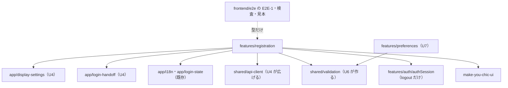

# Logical Components — U6 登録の完了の画面（u6-registration-ui）

U6 の論理的な部品の一覧です。この文書では次のことを決めます。

- 部品と置き場、依存の向き（1節・2節）
- 失敗の範囲（3節）
- 拡張性・信頼性・観測性の扱い（4節。ui のため文書は作らない）
- 実際のブラウザで動くファイルの置き場と非干渉（5節）
- アクセシビリティ・多言語・テストの作り（6節〜8節）

答えは `nfr-design-questions.md` にあります（Q1: A、Q2: A、Consolidated Summary Confirmation: Looks correct）。出典の略号と成果物の置き場の表は `performance-design.md` の冒頭のとおりです。

## 1. 部品の一覧

置き場は機能設計の `frontend-components.md` の2節のとおりで、この段で変えません。

| 部品 | 置き場 | 役割 | 主な NFR |
|---|---|---|---|
| `registration.ts` | `frontend/src/features/registration/`（新しい） | 機能の登録（`/register`、`STANDALONE`・`PUBLIC`、遅延読み込み、文言 ja・en） | NFR6.3・NFR8.1 |
| `registrationApi.ts` | 同上 | 契約 C6 の2つの呼び出しと、確かめの応答の形の確かめ。応答の型は E2E の見本（5.3）からも読まれる | NFR9.1、Q1 A |
| `registrationToken.ts` | 同上 | フラグメントからトークンを取り出す純粋な関数 | NFR1.1 |
| `failureKind.ts` | 同上 | 失敗を状態コードと `code` だけで振り分ける純粋な関数。`detail` と `fieldErrors` を読まない | NFR3.1・NFR9.2、Q2 A |
| `formProblems.ts` | 同上 | フォームの値から項目ごとの誤りと最初の誤りの項目を決める純粋な関数 | NFR7.4・NFR9.3 |
| `useRegistration.ts` | 同上 | 状態を持つフック。トークン・招待・フォームの値をメモリだけに持つ。二重の送信を無視する | NFR1.1〜NFR1.3・NFR9.4 |
| `RegistrationPage`・`RegistrationStatus`・`RegistrationUnavailable`・`RegistrationLoggedInNotice`・`RegistrationForm` と CSS | 同上 | 画面の部品 | NFR6.2・NFR7.1〜NFR7.4 |
| 氏名・パスワードの確かめの関数と定数 | `frontend/src/shared/validation/`（新しい、U7 と共用） | 誤りの理由を返す純粋な関数。`app/` と `features/` を読み込まない | NFR9.3・NFR9.9 |
| E2E-1 | `frontend/e2e/`（新しいファイル1本） | 招待から登録の完了までの流れ、NFR6.1 の5回の計測、応答の形の照合 | NFR6.1・NFR1.3・NFR9.10、Q1 A |
| アクセシビリティの検査（登録の完了の画面） | `frontend/e2e/`（E2E-1 と別のファイル） | 2 状態×20 組の axe と横のはみ出し | NFR7.3・NFR7.5 |
| 確かめの見本 | `frontend/e2e/` の手伝いのモジュール | 差し替えの答えの見本1つ（型付き） | NFR7.5、Q1 A |

- 型は文字列リテラルの union、エクスポートは名前付きだけ、各ファイルの先頭に Apache License 2.0 のヘッダー（`/* ... */`、2026、agwlvssainokuni）。`frontend/e2e/` のファイルも同じです。
- `frontend/e2e/` のファイルは画面の成果物（`dist`）に入りません。

## 2. 依存の向き

図の文章による代替: `features/registration` は、U4 の `app/display-settings`・`app/login-handoff`、既存の `app/i18n`・`app/login-state`、U4 が広げる `shared/api-client`、U6 が作る `shared/validation`、`features/auth/authSession` の `logout`、make-you-chic-ui に依存する。U7 の `features/preferences` も `shared/validation` を使う。`frontend/e2e` の E2E-1・検査・見本は、`features/registration` の応答の型だけを読む（実行時には読み込まない）。

- ほかの機能から `features/registration` への依存はありません。`shared/validation` は `app/` と `features/` を読み込みません。
- `frontend/e2e/` から `src` へは型だけを読みます（`import type`）。E2E のファイルが画面のモジュールを実行時に読み込むことはしません。

## 3. 失敗の範囲

| 失敗 | 影響の範囲 | 扱い | 出典 |
|---|---|---|---|
| 確かめの 404 | この画面だけ | `unavailable`（理由によらず同じ表示） | NFR3.1 |
| 確かめの 404 以外・通信の失敗・応答の形の誤り | この画面だけ | `loadFailed`（同じトークンで読み込み直せる） | NFR9.2、部品 3節 |
| 完了の 400 `VALIDATION_FAILED` | この画面だけ | 値を残して `ready`、フォームの上の一般の知らせ。`fieldErrors` は読まない | Q2 A、W10 の1 |
| 完了の 404 | この画面だけ | `unavailable`、値を捨てる | W10 の2 |
| 完了のほかの応答・通信の失敗 | この画面だけ | 値を残して `ready`、登録できない知らせ | NFR9.2、W10 の3 |
| 見た目の設定の応答が返らない | 全画面の最初の描画 | U4 の W2 の5（受け入れ済み） | U4 の `logical-components.md` |
| ブラウザの保存の読み書きの失敗 | 表示の設定だけ | U4 の口が既定で描く。完了の後の保存の失敗でもログインの画面へ移る | U4 の D7 |
| 画面を読み込み直す | この画面だけ | トークンが無く `unavailable`。メールのリンクを開き直せば続けられる | W2 の4 |

どの失敗でも、画面は壊れず、`console` に何も出さず、サーバーの `detail` を出しません。

## 4. 拡張性・信頼性・観測性（ui のため文書は作らない）

- 拡張性: 状態はブラウザの1つのタブのフックだけにあります。サーバーの負荷は U3 の NFR6.3・NFR6.4 の持ち主です。
- 信頼性: 待ちに上限・再試行を置かず、失敗は3節の表のとおり利用者が読み込み直す・送り直す形にします。確かめは招待を消費しないため、読み込み直しは安全です（U3 の BR7.1）。
- 観測性: 画面の側に独自の指標・ログの送り先を足さず、`console` に何も出しません（`security-design.md` の 1.3 の見張り）。サーバーの側の記録（監査・ログ）は U3 の持ち主です。

## 5. 実際のブラウザで動くファイルの置き場と非干渉

### 5.1 ファイル

| ファイル | 中身 | 決め方 |
|---|---|---|
| E2E-1 | 招待から登録の完了までの流れ（W13）、NFR6.1 の5回の計測と 2.1 の確かめ、応答の形の照合（Q1 A） | 流れの E2E の本数に数える（この Intent の1本） |
| アクセシビリティの検査（登録の完了の画面） | 2 状態×20 組 | 流れの本数に数えない（U4 の NFR9.11）。E2E-1 と別のファイル（NFR7.5） |
| 確かめの見本 | 差し替えの答えの見本1つ | 状態を持たない手伝いのモジュール |

次の3点は、B5 のコード生成の計画で U5・U7 とそろえて決めます。

- ファイルの番号（既存の 010〜040 と U4 の `050-`（見込み）の後）と、アクセシビリティの検査を U4 の `050-` のファイルに足すか、画面の単位ごとのファイルにするか
- 共用の検査の手伝い（組の切り替え・axe の実行・はみ出しの判定・コンソールの問題の集め方）の置き場と、既存の 010 の手伝いとの重なりの扱い（U4 の NFR 設計の memory の未決の点）
- E2E-1 とログインの後の画面の検査が使う管理者の前提の作り方。既存の初期管理者の設定（`playwright.config.ts` の `adminEmail`・`E2E_ADMIN_PASSWORD`）は変えない方針とし、読むだけにする

### 5.2 非干渉

| 項目 | 作り |
|---|---|
| 既存の E2E | 010〜040 のファイルと実行の順を変えない。新しいファイルはその後の番号 |
| コンテキスト | 計測の5回と検査の組ごとに新しいコンテキストを使い、閉じる。表示の設定の値と要求の差し替えはそのコンテキストの中だけに置く |
| サーバーの状態 | 検査はログインせず、状態を変える要求を送らない（`security-design.md` の 5.1）。E2E-1 は自分で管理者のログインと招待を行い、実行ごとに重ならない `example.com` のメールアドレスを使う。前のテストが作った状態に頼らない |
| 実行の順 | `workers: 1`・番号の順のため、E2E-1 が作った利用者は後のファイルに残る。後のファイルは E2E-1 の利用者に頼らない。E2E-1 は既存の 040 の DSL の適用の後に動いても結果が変わらない |
| メール | E2E-1 のメールは E2E が起動したアプリの手元の受け手だけに送り、実在の宛先・外部の SMTP へ送らない。リンクの取り出し方と WAR への SMTP の設定の渡し方は infrastructure-design の持ち主 |

### 5.3 確かめの見本と照合（Q1 A）

- 見本は1つだけ置き、画面の側の確かめの応答の型を付けます。型の検査（`frontend` の `typecheck`、`tsconfig.json` の `include` に `e2e` が入る）で、画面の側の型とのずれに気づけます。
- E2E-1 が本物の確かめの応答の項目の名前と型を見本と照合します（`security-design.md` の 5.2）。

## 6. アクセシビリティ（NFR7.1〜NFR7.5）

| ID | 作り |
|---|---|
| NFR7.1 | 目標は WCAG 2.1 AA。テーマ・文字の大きさ・ブランドカラーのどの組み合わせでも、狭い幅（768px 未満）でも崩れない。確かめは NFR7.2・NFR7.3 |
| NFR7.2 | 画面部品（`RegistrationPage`・`RegistrationStatus`・`RegistrationUnavailable`・`RegistrationLoggedInNotice`・`RegistrationForm`）ごとに vitest-axe の検査を1件入れ、違反 0 件。`RegistrationPage` の検査で確かめ中・使えない・ログイン中の案内・読み込めないの各表示をどう含めるかはコード生成で決める（NFR 要件のまま） |
| NFR7.3 | U4 の実際のブラウザの検査の作り（U4 の `logical-components.md` の5節）を使い、登録の完了の画面の2つの状態で次の組を流す。(a) テーマ2×文字の大きさ3の6組（ブランドカラー `blue`、既定の幅）。(b) ブランドカラー4×テーマ2の8組（文字の大きさ `md`、既定の幅）。(c) 幅 375px（高さ 812px）でテーマ2×文字の大きさ3の6組（ブランドカラー `blue`）。テーマ・文字の大きさは U4 の鍵を初めのスクリプトで置き、ブランドカラーは `/api/appearance` の差し替え。合否は WCAG 2.0・2.1 の A・AA のタグの規則で違反 0 件（U4 の Q2 A）と、`document.documentElement.scrollWidth` が表示の幅以下。回数と時間の見積もりは `performance-design.md` の4節 |
| NFR7.4 | 言語の選択肢の文字に `lang`、3つのまとまりは RadioGroup の `fieldset`・`legend`、矢印キーで選べ、言語を切り替えた後もフォーカスを残し、`<html lang>` を変える。失敗は `role="alert"`、入力の誤りは項目の下に文字で `aria-describedby`・`aria-invalid`、最初の誤りの項目へフォーカス（画面の確かめの誤り）。サーバーの 400 はフォームの上の知らせへフォーカス（Q2 A）。送信中・ログアウト中は `aria-disabled`・`aria-busy` でフォーカスを保つ。確かめは画面部品のテスト |
| NFR7.5 | フォームの状態は確かめの API の答えの差し替えで出し、「リンクが使えない」は本物のまま（`security-design.md` の5節）。検査のファイルは E2E-1 と分ける |

## 7. 多言語（NFR8.1・NFR8.2）

| ID | 作り |
|---|---|
| NFR8.1 | `registration.` で始まる鍵を ja・en の両方に置き、そろえる。アプリ名は `app.name`、テーマ・文字の大きさは U4 の `display.theme.*`・`display.fontSize.*`、言語の選択肢は U4 の `LANGUAGE_NAMES`（訳さない）。画面部品のテストで、足した鍵が両方にあり空でないこと、画面の言語が en でも「日本語」と出ることを見る |
| NFR8.2 | 確かめの 200 で `setLanguage(invitation.language)` を呼び、利用者が選んだ言語を画面と要求に当てる。招待の言語 en をブラウザの言語 ja で開くと、確かめの後の文言・`<html lang>`・画面の確かめの誤りが en になり、完了の要求の `Accept-Language` が en になることを画面部品のテストで見る。サーバーの説明文は画面に出さないため U3・U4 のテストで確かめる |

## 8. テストの作り（NFR9.8〜NFR9.11）

| ID | 作り |
|---|---|
| NFR9.8 | フロントエンドのカバレッジの下限（行 80%・分岐 70%、`@vitest/coverage-v8` の `thresholds`）を守り、U6 のために計測の除外を増やさない。`frontend/e2e/` は既存と同じく Vitest の計測の対象外で、除外の設定は増やさない |
| NFR9.9 | fast-check の性質ベースのテストを `shared/validation` の関数に当てる（`countCodePoints`・`utf8ByteLength`・`trimDisplayName`・`validateDisplayName`・`validateNewPassword` の性質と境界）。失敗時の乱数の種を記録する |
| NFR9.10 | E2E-1 を `frontend/e2e/` に1本足し、`./gradlew e2eTest` で動かす（`verify` と CI の外）。流れは W13 で、管理者のログインと招待を自分で行い、実行ごとに重ならない `example.com` のアドレスを使う。流れの中で NFR6.1 の5回の計測と `performance-design.md` の 2.1 の確かめ、応答の形の照合（Q1 A）を行う。流れ全体の時間の目標は置かない |
| NFR9.11 | 既存の画面のテストと既存の E2E（010〜040）が通り続ける。アクセシビリティの検査は流れではないため本数に数えない |

## 9. 上流との差

承認済みの文書は書き換えません（`aidlc/spaces/default/memory/project.md` の Way of Working）。

| ID | 文書 | 承認済みの記述 | この段での扱い | 理由 |
|---|---|---|---|---|
| LC-D1 | NFR 要件の NFR9.10（`tech-stack-decisions.md`） | E2E-1 の中で NFR6.1 の時間と NFR1.3 のアドレス欄を確かめる | 加えて、確かめの応答の形を見本と照合する（Q1 A）。E2E-1 は見本のモジュールを読む | 依頼者の決定（Q1 A）。追加 |
| LC-D2 | U4 の NFR 設計の `logical-components.md` の5節 | 検査のファイルは `050-`（見込み）。B5 の画面はその検査の中で前提を自分で作る | 登録の完了の画面の検査を `050-` に足すか別のファイルにするか、番号、共用の手伝いは B5 のコード生成の計画で U5・U7 とそろえて決める（5.1） | 3つの画面の単位に共通の決定で、1つの単位の段で決めないため。食い違いではない |
