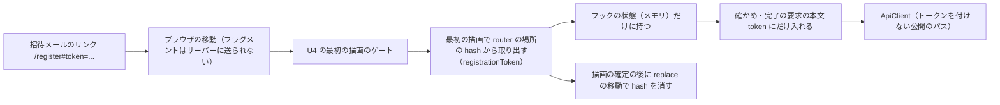

# Security Design — U6 登録の完了の画面（u6-registration-ui）

U6 のセキュリティの設計です。U6 は画面の単位で、サーバー側の認可を持ちません。サーバー側の公開の範囲・拒否の応答の同じさ・漏えいの確かめは U3 が持ち（`construction/u3-invitation/nfr-design/security-design.md`）、画面の側の扱いはその代わりにしません（要件 NFR4、`team.md` の Testing Posture）。

この文書では次の作りを決めます。

- 招待のトークンの画面の側の扱いと、その確かめ（1節）
- 招待のメールアドレスと列挙の防止（2節）
- 公開の API の呼び出し・想定外の応答・400 の出し方（3節）
- パスワード・二重の送信・CSP（4節）
- アクセシビリティの検査の差し替えと、本物の応答の形の照合（5節）
- 依存（6節）

答えは `nfr-design-questions.md` にあります（Q1: A、Q2: A、Consolidated Summary Confirmation: Looks correct）。出典の略号と成果物の置き場の表は `performance-design.md` の冒頭のとおりです。

## 1. 招待のトークン（NFR1.1〜NFR1.5、要点 5）

### 1.1 流れ



図の文章による代替: 招待メールのリンクを開くと、ブラウザはフラグメントをサーバーに送らずに画面を読み込む。U4 の最初の描画のゲートを通った後、登録の完了の画面は最初の描画で React Router の場所のフラグメントから `registrationToken` でトークンを取り出し、フックの状態（メモリ）だけに持つ。描画の確定の後に置き換えの移動でフラグメントを消す。トークンは確かめと完了の要求の本文の `token` にだけ入れ、ApiClient のトークンを付けない公開のパスとして送る。

### 1.2 決まり

| 場面 | 作り | 要件 |
|---|---|---|
| 取り出し | 最初の描画で1回だけ、React Router の場所（`useLocation().hash`）を `registrationToken`（React に触れない純粋な関数）に渡し、`key=value` の並びから `token` の値だけを取る。状態の初期値を作る関数の中で読むため、`StrictMode` の二重の描画でもどちらも消去の前に読む。無い・空なら API を呼ばずに `unavailable`。形は画面で確かめない（D1） | NFR1.1 |
| 消去 | 描画の確定の後の副作用で1回だけ、React Router の置き換えの移動（`replace`）で同じパス（問い合わせを含む）へ移り、フラグメントを消す。ルーターの場所と `history` の項目を食い違わせず、履歴の項目を増やさない。ログイン中でもこの時点で消す（W2 の2） | NFR1.1・NFR1.3 |
| 保持 | フックの状態だけに持つ。ブラウザの保存（localStorage・sessionStorage）・URL・`history.state`・画面の文言・エラーの表示・`console` に出さない。画面を離れると部品とともに捨てる。読み込み直すと無くなり `unavailable` | NFR1.2・NFR1.3 |
| 送信 | 要求の本文（`TokenRequest` の `token`、`CompleteRequest` の `token`）にだけ入れ、パス・問い合わせ・見出しに入れない（D3、契約 C6） | NFR1.1 |
| ログ | 画面は `console` に何も出さない。エラーを捕まえたときも、状態と文言の鍵だけを持つ | NFR1.2 |
| リファラー | 新しい手当ては足さない。フラグメントはブラウザの決まりで `Referer` に載らない。既存の `Referrer-Policy: same-origin`（`SecurityConfig`）と CSP（`application.yaml`）を変えない。画面に外部へのリンクと外部の読み込みを置かない（「ログインの画面へ」は同じオリジンの `/login`） | NFR1.4 |

- U4 のゲートの待ちの間、フラグメントはアドレス欄に残ります。U6 の部品が描かれた後に取り出して消すため、ゲートの間にほかの部品がアドレスを書き換えないことを前提にします。コード生成で、ゲートを通った後にトークンが取れることを画面部品のテスト（`renderWithProviders` で U4 の口とログイン状態を本物で動かす形）で確かめます。

### 1.3 確かめ

| 確かめ | 置き場 | 要件 |
|---|---|---|
| 描画の後の URL にフラグメントが無い。確かめの要求の本文にだけトークンがあり、URL と見出しに無い。フラグメントが無い・空なら要求が無い。読み込み直しで `unavailable` | 画面部品のテスト（`RegistrationPage`（開く）） | NFR1.1・NFR1.3 |
| `#token=abc` から `abc`、無い・空・ほかの鍵だけ・フラグメントが無いときは無し、URL の符号化を戻す | 単体テスト（`registrationToken`） | NFR1.1 |
| (a) 開く・確かめの成功・完了の成功の後に、localStorage・sessionStorage のどの鍵の値にもテストのトークンが無い。(b) `console` の5つの関数（`log`・`info`・`warn`・`error`・`debug`）を `vi.spyOn` で見張り、開く・確かめの失敗（404・500・通信の失敗）・完了の失敗（400・404・500・通信の失敗）のどの流れでも呼ばれない。呼ばれたときは引数にトークン・パスワード・メールアドレスが無いことも見る。(c) 画面の文字にトークンが出ない | 画面部品のテスト | NFR1.2 |
| フォームが出た後の `page.url()` に `#token=` が無い（計測の5回のすべてと、流れの本体） | E2E-1（`performance-design.md` の 2.1 の (a)） | NFR1.3 |
| 実際のブラウザの localStorage・sessionStorage にトークンが無い | E2E-1（同じく (c)） | NFR1.2 |
| `SecurityConfig` の `Referrer-Policy` と `application.yaml` の CSP に差分が無い。画面の部品に外部の URL が無い | B5 のコード生成の点検 | NFR1.4 |

### 1.4 テストの値（NFR1.5）

- E2E-1 のトークンとパスワードは、実行ごとの一時の内部DB の中の使い捨ての値とします。パスワードは既存の初期管理者と同じく実行のたびに作ります（`frontend/playwright.config.ts` の作り方）。E2E-1 は既存の初期管理者の設定（`adminEmail`・`E2E_ADMIN_PASSWORD`）を読むだけで変えません。
- アクセシビリティの検査の見本のトークンは、どの招待にも当たらない、見て見本と分かる低いエントロピーの固定の値（例: `a11y-sample-token`）とし、秘密情報の検出（Gitleaks）に掛からない形にします。
- 失敗のときに残るトレース（`trace: 'retain-on-failure'`）と報告は手元だけに置き、コミットしません。B5 のコード生成で `.gitignore` に `frontend/test-results/`・`frontend/playwright-report/` があることを確かめます（既存）。トレースには E2E-1 のトークン（使い捨て）が入りうるため、共有しません。

### 1.5 残る危険

- ブラウザの閲覧の履歴（履歴の画面・同期された履歴）は、スクリプトが動く前の最初の移動のアドレス（フラグメントを含む）を記録しうります。置き換えの移動がその記録を上書きするかはブラウザに依存し、確かめていません。承認済みの機能設計の W2 の4（「閲覧の履歴の同期では、フラグメントの無いアドレスだけが残る」）は、この点を確かめないまま書かれています（8節の SD-D2）。
- 支え: トークンは1回だけ有効で有効期限を持ち、送り直しで前のトークンは使えなくなります（U3、`project.md` の Mandated）。完了の後の同じリンクは 404 になります。

## 2. 招待のメールアドレスと列挙の防止（NFR2.1・NFR3.1、要点 6）

| 決まり | 作り | 要件 |
|---|---|---|
| メールアドレスの置き場 | 確かめの 200 の値をフックの状態に持ち、読み取り専用の欄（`readOnly`・`type="email"`・`autoComplete="username"`）と氏名の初期値に使う。完了の 204 の後は `saveBrowserDisplaySettings` → `handOffToLogin(email)` → `/login` への置き換えの移動の順（D11）。U4 の受け渡しはメモリだけ・1回（U4 の `security-design.md` の2節） | NFR2.1 |
| 出さない先 | URL（パス・問い合わせ・`#` の後）・ブラウザの保存・`console`。パスワードとトークンは受け渡さない | NFR2.1 |
| 404 の表示 | 確かめ・完了の 404 `REGISTRATION_LINK_INVALID` は理由によらず同じ「このリンクは使えません…」の表示。サーバーの `detail` を読まない・出さない | NFR3.1 |
| 振り分けの1か所 | `failureKind`（`ApiError` の状態コードと `code` だけを見る純粋な関数）で、確かめ・完了ごとに5節の表の行へ振り分ける。`detail`・`title`・`type` と追加の項目は読まない | NFR3.1・NFR9.2 |

- サーバーの拒否の応答そのものが理由によらず同じであることは U3 の7節が結合テストで確かめます。
- 確かめ: 完了の 204 の画面部品のテストで、ログインの画面へ移った後の URL と localStorage・sessionStorage にメールアドレスが無いこと、受け渡した値がメールアドレスだけであること。`detail` の文字だけを変えた複数の 404 の応答で表示が同じで、`detail` の文字が画面に出ないこと。`failureKind` の単体テストで5節の表の全行。

## 3. 公開の API の呼び出し・想定外の応答・400 の出し方

### 3.1 呼び出し（NFR9.1）

- `registrationApi.ts` の2つの関数は ApiClient の `apiRequest` を通し、`Authorization` と `Accept-Language` を呼び出し側で付けません。パスは定数（`REGISTRATION_VERIFY_PATH`・`REGISTRATION_COMPLETE_PATH`）に置きます。
- 公開のパスにトークンを付けず 401 で更新しない扱いは、U4 の ApiClient の1つの一覧と1つの判定（U4 の Q3 A、例: `TOKENLESS_API_PATHS`・`isTokenlessApiPath`）が持ちます。U6 は ApiClient を変えません。U6 の2つのパスがその一覧の値と同じであることは、`registrationApi` の単体テストで要求のパスを見ることと、U4 の NFR9.1 のテストで支えます。
- 確かめの応答は、`language` が `ja`・`en` でない、`email` が文字列でないとき、形の誤りとして `loadFailed` と同じ扱いにします（部品 3節）。応答の形の確かめは `registrationApi.ts` の1か所に置き、5節の見本の型もここから取ります。

### 3.2 想定外の応答（NFR9.2）

- 404 でも 400 でもない応答（例: 429・503）と、404・400 で `code` が違う・無い応答は、確かめでは `loadFailed`（「もう一度読み込む」）、完了では登録できない知らせ（値を残して `ready`）に振り分けます。「リンクが使えない」とは見せません。U6 で回数の制限の手当ては足しません（U3 の NFR4.5）。
- 確かめ: `failureKind` の単体テストに 429・503 の行を入れます。

### 3.3 登録の完了の 400（Q2 A）

- 400 `VALIDATION_FAILED` は、承認済みの機能設計の Q3 A（W10 の1）のままとし、項目に結び付けず、フォームの上に `role="alert"` の一般の知らせを出し、入れた値を残し、フォーカスを知らせの領域へ移します。
- U3 が載せる追加の項目 `fieldErrors: [{field, reason}]`（U3 の `security-design.md` の6節）は読みません。`failureKind` は状態コードと `code` だけで振り分けるため、項目が増えても振る舞いは変わりません（安全な追加）。U7 の `fieldErrors.ts` の置き場（`features/preferences`）にも触れません。
- セキュリティの差はありません。`fieldErrors` は項目の名前と理由の値だけを持ち、画面はそれを出さないためです。
- 受け入れた結果: サーバーの 400 では CR6.1 の「最初の誤りの項目にフォーカスを移す」を満たしません（機能設計の Q3 A で受け入れ済み）。サーバーの 400 は、画面の確かめ（`shared/validation`）をすり抜けたとき（空白の文字の種類の判定の差など）に限られる見込みです。

## 4. パスワード・二重の送信・CSP（NFR9.3〜NFR9.5、要点 7）

| 決まり | 作り | 要件 |
|---|---|---|
| パスワードの欄 | 2つの欄は `type="password"`・`autocomplete="new-password"` | NFR9.3 |
| 画面の確かめ | 送信の前に `shared/validation` でサーバーと同じ決まり（12 コードポイント以上・UTF-8 で 72 バイト以内・2回の一致）を確かめ、誤りがあれば送らない。判定はサーバーが正（U3 の BR7.2） | NFR9.3 |
| パスワードの置き場 | 入力の欄と送信の本文だけ。ブラウザの保存・URL・`console` に出さない。失敗のときに値を残すのは画面のメモリの中だけ。404 で `unavailable` に移るときは値を捨てる | NFR9.3 |
| 二重の送信 | Button の `loading`（`aria-disabled`・`aria-busy`）に加えて、フックが `submitting` の間の `submit()` と値を変える操作を無視する。氏名・パスワードの欄は `readOnly`、ラジオの選択は受け付けない。「ログアウトして続ける」もログアウトの間は無視する | NFR9.4 |
| 守りの主 | 画面の防止は利用の体験のためのもので、サーバーの守り（使い終えた招待は 404、U3 の BR7.5）の代わりにしない | NFR9.4 |
| CSP | CSP を変えず、埋め込みのスクリプト・スタイルを足さない。応答の値を HTML としてそのまま差し込まない（既存のリンタの `react/no-danger`）。アクセシビリティの検査のためにアプリの CSP を緩めず、`bypassCSP` も使わない（U4 の `security-design.md` の6節） | NFR9.5 |

- 確かめ: 画面部品のテスト（部品 8節の `RegistrationForm`・送信の間・ログアウト中）で、欄の属性、境界の値で送られないこと、完了の要求に答えを返さない間に2回押す・Enter キー・ラジオを選ぶの操作をしても要求が1回で本文の値が変わらないこと、ログアウトの要求が1回であること。localStorage・sessionStorage にパスワードが無いことを NFR1.2 と同じテストで見ます。
- CSP の違反は、E2E-1 の計測の5回で失敗の条件にします（`performance-design.md` の 2.1 の (b)）。B5 のコード生成で、`application.yaml` の CSP に差分が無いことと、ビルドした `index.html` に埋め込みのスクリプト・スタイルが無いことを確かめます。

## 5. アクセシビリティの検査の差し替えと、本物の応答の形の照合（NFR7.5、Q1 A、承認の場の R-02）

### 5.1 差し替え

- 組ごとの新しいコンテキストの中で、`page.route` で `POST /api/registration/verify` だけを受けて、200 の見本の答えを返します。ほかの要求（画面の配信・見た目の設定・セッションの復元）は本物の WAR へ送ります。ブランドカラーの組は、U4 の作りのとおり同じコンテキストで `/api/appearance` の答えも差し替えます。
- 開くアドレスは `/register#token=<見本のトークン>`（1.4）。「リンクが使えない」の状態は、フラグメントの無い `/register` を差し替えなしで開きます。
- 検査はログインせず、サーバーの状態（内部DB・監査・招待）を変える要求を送りません。確かめは差し替えで WAR に届かず、`unavailable` は API を呼びません。
- 差し替えはテストのブラウザのコンテキストの中だけで、アプリのコード・設定・CSP に手を入れません。

### 5.2 見本と照合（Q1 A）

- 見本の答えは `frontend/e2e/` の手伝いのモジュールに1つだけ置きます（例: `support/registrationFixtures.ts`。名前はコード生成で決める）。本文は `email` が `example.com` のアドレス、`language` が `ja` です。
- 見本には、画面の側の確かめの応答の型（`registrationApi.ts` が返す型）を付けます。`frontend/tsconfig.json` は `e2e` から `src` の型を読めるため、型の検査（`./gradlew verify` の中の型検査）で、画面の側の型と見本がずれると落ちます。
- E2E-1 は、本物の確かめの応答を `page.waitForResponse` で受け取り、次を確かめます（流れの成否の一部）。
  - 状態コードが 200
  - 本文の項目の名前の集まりが、見本の項目の名前の集まりと同じ
  - 各項目の型が見本と同じ（`email` は文字列、`language` は `ja`・`en` のどちらか）
- 値そのもの（メールアドレス）は比べず、比べた結果の失敗の知らせにも本文の値を載せません（項目の名前と型だけを出す）。
- 形がずれると `./gradlew e2eTest` のたびに E2E-1 が落ちて気づけます。承認の場の R-02 の「1回の照合」は、B5 のコード生成でこの確かめが通ることで閉じます。U3 の側の照合（C6 の結合テスト）は U3 の計画のままです。

```ts
// 説明用の断片（形だけ）
const res = await page.waitForResponse((r) => r.url().endsWith('/api/registration/verify'))
expect(res.status()).toBe(200)
const body: unknown = await res.json()
expect(shapeOf(body)).toEqual(shapeOf(verifyFixture))   // 項目の名前と型だけ
```

- 見本のモジュールを E2E-1 とアクセシビリティの検査の両方が読みますが、状態は持たないため、2つのファイルの実行の順と前提はつながりません。

## 6. 依存（NFR9.6・NFR9.7）

- U6 は新しい依存（実行時・開発時とも）を足しません。`shared/validation` は自前のコードです。差し替えは Playwright の既存の `page.route`、照合は Playwright と TypeScript の既存の機能で行います。
- make-you-chic-ui の新しい版（RadioGroup の `legend`・選択肢ごとの `lang`、Button の `loading` の `aria-disabled`・`aria-busy`）に頼ります。固定先の更新（`edb1f94` → `735ef04`）は B4 の承認を得た専用のコミットで、U6 の B5 はその後に進めます。make-you-chic-ui の中身は変えません。
- B5 のコード生成で、`frontend/package.json` と lockfile に U6 のための差分が無いことと、サブモジュールに差分が無いことを確かめます。

## 7. 脅威と扱い

| 脅威 | 扱い | 節 |
|---|---|---|
| トークンがアドレス欄・閲覧の履歴・画面の写しに残り、別の人に使われる | 取り出したらすぐに置き換えの移動で消し、メモリだけに持つ。閲覧の履歴の最初の記録は残る危険として書き、1回だけ有効・有効期限で支える | 1.2・1.5 |
| トークンがブラウザの保存・コンソールに残る | 出さない。画面部品のテストと実際のブラウザで確かめる | 1.2・1.3 |
| トークンがリファラーで外部に漏れる | フラグメントは載らない。`Referrer-Policy` と CSP を保ち、外部へのリンクを置かない | 1.2 |
| テストの値・トレースが公開のリポジトリに入る | 使い捨てと見本の値、低いエントロピーの見本。トレースと報告はコミットしない | 1.4 |
| メールアドレスが URL に載る | 受け渡しはメモリだけ | 2節 |
| 表示の違いから招待や利用者の有無を推測される | 404 は同じ表示、`detail` を出さない | 2節 |
| 期限切れのアクセストークンが公開の API で 401 を起こす | U4 の ApiClient がトークンを付けない | 3.1 |
| 回数の制限の拒否を「リンクが使えない」と見せ、使えるリンクを捨てさせる | 想定外の応答は読み込み直せる失敗 | 3.2 |
| パスワードがブラウザに残る・画面の確かめだけで弱い値が通る | 保存しない。判定はサーバーが正 | 4節 |
| 二重の送信 | Button とフックの両方で1回にする。サーバーでも2回目は拒否 | 4節 |
| スクリプトの差し込み | CSP を変えず、HTML に差し込まない | 4節 |
| 検査の差し替えが本物の応答の形からずれ、壊れた画面を見逃す | 見本1つに型を付け、E2E-1 で毎回本物の形と照合する | 5.2 |

## 8. 上流との差

承認済みの文書は書き換えません（`aidlc/spaces/default/memory/project.md` の Way of Working）。

| ID | 文書 | 承認済みの記述 | この段での扱い | 理由 |
|---|---|---|---|---|
| SD-D1 | NFR 要件の NFR1.2・NFR1.3・NFR9.5 | NFR1.3 は流れの1回、NFR9.5 は記録、NFR1.2 は画面部品のテスト | E2E-1 の計測の5回で、アドレス欄・CSP の違反・ブラウザの保存を確かめ、失敗の条件にする（`performance-design.md` の 5節の PD-D1〜PD-D3） | 不安定でない確かめのため。アドレス欄と CSP は要約で依頼者が確かめた。保存の確かめは要約に無かった追加のため承認の場で伝える |
| SD-D2 | 機能設計の W2 の4（`functional-spec.md`） | 閲覧の履歴の同期では、フラグメントの無いアドレスだけが残る | 最初の移動のアドレスが閲覧の履歴に残りうることを残る危険として書く（1.5）。作りは変えない | ブラウザの閲覧の履歴の記録の仕方は確かめておらず、承認済みの記述は言い過ぎの見込みのため。project.md の Change Control（記録の食い違いは隠さず明記し、直すかは依頼者に確かめる）に従い、機能設計の文書を直すかは承認の場で確かめる |
| SD-D3 | NFR 要件の承認の場の R-02 | U3・U6 のコード生成の計画に、差し替えの答えと本物の応答の形を1回照合する手順を書く | U6 の側は、見本1つに型を付け、E2E-1 で毎回照合する作りにした（5.2、Q1 A）。コード生成でこの確かめが通ることで閉じる | 依頼者の決定（Q1 A）。1回の照合より強い。U3 の側の照合は U3 の計画のまま |
| SD-D4 | U3 の NFR 設計の `security-design.md` の6節（SD-D3） | 登録の完了の 400 に `fieldErrors` を載せる | U6 は読まず、機能設計の Q3 A の一般の知らせのまま（3.3、Q2 A） | 依頼者の決定（Q2 A）。安全な追加で、U6 が読まなくても壊れない。食い違いではない |
