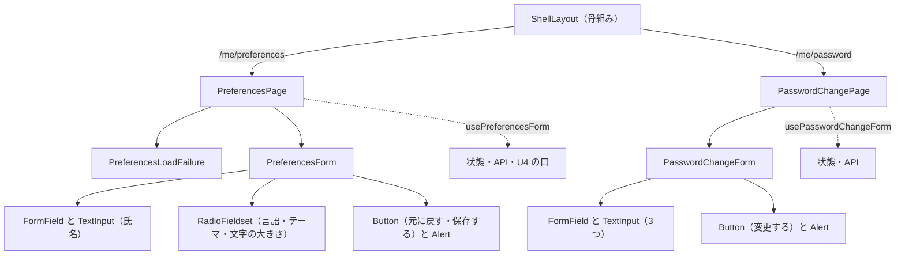

# Frontend Components — U7 プリファレンスとパスワードの変更の画面（u7-preferences-ui）

画面の流れ（W1〜W13）・決まり（D1〜D14）・状態の移り変わり・応答ごとの動き・文言・骨組みへの変更は `functional-spec.md` が正本で、ここでは繰り返さない。ここでは部品の階層、props と state、状態を持つフック、API（契約 C4）との受け渡し、U4 の口（契約 C9）の使い方、置き場のモジュール、テストで確かめる内容を示す。画面の配置と部品ごとの動きは `aidlc/spaces/default/intents/260925-user-management/inception/refined-mockups/` の `mockups.md`（S4・S5）・`interaction-spec.md`（1節・7〜9節）・`design-system-mapping.md` が正本（言語・テーマ・文字の大きさの選択の部品だけは `functional-spec.md` の 10節の (b) の差のとおり）。

## 1. 部品の階層

どちらの画面も骨組みの `ShellLayout`（AppShell の中）に置かれる。ユーザーメニューの2つの項目は `registration.ts` で登録し、`ShellLayout` が `path` で移る（`functional-spec.md` の 9節）。

| 階層 | 部品 | 置き場 | 役割 |
|---|---|---|---|
| 1 | `ShellLayout`（骨組み、既存を変える） | `frontend/src/app/layout/ShellLayout.tsx` | ユーザーメニューの `path` の項目で移る |
| 2 | `PreferencesPage` | `frontend/src/features/preferences/PreferencesPage.tsx` | S4 の画面。見出し・読み込み中・読み込みの失敗・フォームを出し分ける。`usePreferencesForm` を持つ |
| 3 | `PreferencesLoadFailure` | 同じ置き場 | 読み込みの失敗の知らせ（Alert）と「もう一度読み込む」 |
| 3 | `PreferencesForm` | 同じ置き場 | 氏名・3つの選択・「元に戻す」・「保存する」・画面の知らせ |
| 4 | FormField と TextInput（make-you-chic-ui） | — | 氏名 |
| 4 | `RadioFieldset`（共用、U6 が作る） | `frontend/src/shared/ui/RadioFieldset` | 言語・テーマ・文字の大きさ（まとまりごとに `fieldset`・`legend`、選択肢ごとの `lang`） |
| 4 | Button・Alert（make-you-chic-ui） | — | 操作と画面の知らせ |
| 2 | `PasswordChangePage` | `frontend/src/features/preferences/PasswordChangePage.tsx` | S5 の画面。見出しとフォーム。`usePasswordChangeForm` を持つ |
| 3 | `PasswordChangeForm` | 同じ置き場 | 3つのパスワードの項目・「変更する」・画面の知らせ |
| 4 | FormField と TextInput・Button・Alert（make-you-chic-ui） | — | 入力と操作と知らせ |

<!-- Text fallback: 骨組みの ShellLayout の中に、URL /me/preferences では PreferencesPage、/me/password では PasswordChangePage が置かれる。PreferencesPage は読み込みの失敗のとき PreferencesLoadFailure を、読み込めたら PreferencesForm を出す。PreferencesForm は氏名の FormField と TextInput、言語・テーマ・文字の大きさの共用の RadioFieldset、「元に戻す」「保存する」の Button と画面の知らせの Alert を持つ。PasswordChangePage は PasswordChangeForm を置き、3つのパスワードの FormField と TextInput、「変更する」の Button と Alert を持つ。状態と API と U4 の口の呼び出しは、PreferencesPage が usePreferencesForm、PasswordChangePage が usePasswordChangeForm にまとめる。 -->

- 画面の部品（`PreferencesPage`・`PasswordChangePage`）は遅延読み込みにする（既存の `features/auth/registration.ts` と同じ形）。
- 見出しは各画面の `h1`（「プリファレンス」「パスワードの変更」）。画面の幅はコンテンツの幅 640px 前後、768px 未満は1列（`interaction-spec.md` の 7節・8節）。CSS は部品と同じ場所に素の CSS で置く（`team.md`）。

## 2. 置き場ごとのモジュール

| 置き場 | モジュール | 役割 |
|---|---|---|
| `frontend/src/features/preferences/` | `registration.ts` | 機能の登録（6節） |
| 同上 | `messages.ts` | ja・en の文言（`functional-spec.md` の 7節）。`registration.ts` から渡す |
| 同上 | `preferencesApi.ts` | C4 の3つの API の関数と、応答の形の確かめ（5節） |
| 同上 | `fieldErrors.ts` | 400 `VALIDATION_FAILED` の Problem Details から項目ごとの誤り（項目の名前と理由）を読む純粋な関数。壊れた入力でも例外を出さず、読めなければ空の一覧を返す（W12） |
| 同上 | `errorMessages.ts` | 共用の確かめの関数の理由・サーバーの理由・項目の名前から、この機能の文言の鍵を選ぶ純粋な関数（W11・W12、D13） |
| 同上 | `usePreferencesForm.ts` | S4 の状態を持つフック（3.1） |
| 同上 | `usePasswordChangeForm.ts` | S5 の状態を持つフック（3.2） |
| 同上 | `PreferencesPage.tsx`・`PreferencesLoadFailure.tsx`・`PreferencesForm.tsx`・`PasswordChangePage.tsx`・`PasswordChangeForm.tsx` と CSS | 画面の部品（4節） |
| `frontend/src/shared/validation/`（U6 が作る） | 氏名とパスワードの確かめの関数 | 使うだけ。誤りの理由を返す純粋な関数（`functional-spec.md` の W11・10節の (d)） |
| `frontend/src/shared/ui/RadioFieldset`（U6 が作る） | ラジオの組 | 使うだけ（4節） |
| `frontend/src/app/display-settings/`（U4 が作る） | `useDisplaySettings`・`LANGUAGE_NAMES` と表示の設定の型 | 使うだけ（3.3） |
| `frontend/src/app/registry/`・`frontend/src/app/layout/`（既存を変える） | `types.ts`・`validateRegistrations.ts`・`ShellLayout.tsx` | ユーザーメニューの `path`（`functional-spec.md` の 9節） |

- 型は文字列リテラルの union で表し、`enum` は使わない。エクスポートは名前付きだけ（`team.md`）。表示の設定の型（言語・テーマの選択・文字の大きさ）は U4 のものを使い、この機能で別に作らない。
- 項目の名前は C4 の項目名の union（`'displayName'`・`'language'`・`'theme'`・`'fontSize'`、パスワードの画面は `'currentPassword'`・`'newPassword'`・`'newPasswordConfirmation'`）で表す。

## 3. 状態を持つフック

### 3.1 `usePreferencesForm()`

持つ状態:

| 状態 | 型の形 | 意味 |
|---|---|---|
| `phase` | `'loading'`・`'loadFailed'`・`'ready'`・`'saving'` | 画面の状態（`functional-spec.md` の 4.1） |
| `current` | プリファレンス（4つ）、または無い | 今の設定（読み込みか保存の成功の値）。「元に戻す」の戻り先 |
| `form` | プリファレンス（4つ） | フォームの値 |
| `fieldErrors` | 項目の名前から文言の鍵への対応 | 項目の誤り（画面の確かめ・サーバーの項目ごとの誤り） |
| `alert` | 文言の鍵、または無い | 画面の知らせ（1つだけ） |
| `pendingSavedNotice` | 真偽 | 保存の成功の後、次の描画で Toast とフォーカスを行う印（D12） |
| 読み込みの番号 | 数 | 最後に始めた読み込みだけの答えを使うための印（W2 の 6） |
| 外れたかの印 | 真偽 | 画面を離れた後の答えを扱うための印（W6 の 3） |

返す値と操作:

| 名前 | 意味 | 流れ |
|---|---|---|
| `phase`・`form`・`fieldErrors`・`alert` | 描画に使う値 | — |
| `dirty` | `form` が `current` と違うか（4つを文字列として比べる） | W4 の 5 |
| `setDisplayName(value)`・`setLanguage(value)` | フォームの値だけを変える（口は呼ばない） | W4 の 2・3 |
| `setTheme(value)`・`setFontSize(value)` | フォームの値を変え、フォームのテーマと文字の大きさで `setPreview` を呼ぶ | W4 の 1 |
| `reset()` | フォームを `current` に戻し、誤りと知らせを消し、`clearPreview` を呼ぶ。フォーカスを「保存する」へ | W5 |
| `save()` | 画面の確かめ → 送信 → 結果（成功で `applyUserPreferences`、`pendingSavedNotice` を立てる） | W7・W8 |
| `reload()` | 知らせを消して読み直す | W2 の 4 |
| 要素の参照（氏名の入力・各まとまりの最初の選択肢・「保存する」・「もう一度読み込む」） | フォーカスの行き先 | D9・D10 |

副作用:

- 画面を開いたとき（部品が付いたとき）に読み込みを始める。開発時の StrictMode の二重の実行でも、最後に始めた読み込みの答えだけを使う。
- 読み込みの成功で、読んだ値と `useDisplaySettings()` の当たっている値（`displayName`・`language`・`theme`・`fontSize`）を比べ、違えば `applyUserPreferences(読んだ値)` を呼ぶ（D2）。比べるのは開いた直後で見せ方が無い時点のため、口の値が当たっている値になる。
- `pendingSavedNotice` が立った描画の後（新しい言語で描き直した後）に、その描画の文言で `useToast` の Toast「保存しました」（種類 success）を出し、「保存する」にフォーカスを移し、印を下ろす（D12）。
- 部品が外れるときに `clearPreview` を呼ぶ（D6）。

### 3.2 `usePasswordChangeForm()`

| 状態 | 型の形 | 意味 |
|---|---|---|
| `phase` | `'idle'`・`'sending'` | 画面の状態（`functional-spec.md` の 4.2） |
| `form` | `currentPassword`・`newPassword`・`newPasswordConfirmation` の3つの文字列 | フォームの値。部品の中のメモリだけに持ち、ブラウザに保存しない |
| `fieldErrors` | 項目の名前から文言の鍵への対応 | 項目の誤り |
| `alert` | 文言の鍵、または無い | 画面の知らせ |

| 名前 | 意味 | 流れ |
|---|---|---|
| `setField(name, value)` | 1つの項目の値を変える | W9 |
| `submit()` | 画面の確かめ → 送信 → 結果（204 で3つを空に、Toast「パスワードを変更しました」、フォーカスを「変更する」へ。`PASSWORD_CURRENT_MISMATCH` で今のパスワードの項目の誤りとフォーカス） | W9・W10 |
| 要素の参照（3つの入力・「変更する」） | フォーカスの行き先 | D9・D10 |

- パスワードの値はログ・コンソール・ブラウザの保存に出さない（`project.md` の Forbidden）。画面を離れるとメモリから消える。
- 送信中に部品が外れたら、答えは捨てる（W10 の 5）。

### 3.3 U4 の口（契約 C9）の使い方

| 口 | 呼ぶ時点 | 呼ばない時点 | 出典 |
|---|---|---|---|
| `useDisplaySettings()` の `displayName`・`language`・`theme`・`fontSize` | 読み込みの成功の直後に、そろえの比べに読む | フォームの初期値には使わない（初期値は C4 の GET の値、Q3 A） | D2 |
| `setPreview(theme, fontSize)` | テーマか文字の大きさを選んだとき。フォームのテーマと文字の大きさの2つを渡す | 言語・氏名を変えたとき | D4、U4 の W10 の 1・2 |
| `clearPreview()` | 「元に戻す」、部品が外れるとき | 保存の失敗（見せ方を残す） | D5・D6、U4 の W10 の 3 |
| `applyUserPreferences({ displayName, language, theme, fontSize })` | 保存の成功（応答の値）、開いた時点のそろえ（読んだ値）、送信中に離れた後の保存の成功（応答の値） | 保存の失敗 | D2、W8、W6 の 3、U4 の W10 の 4 |
| `setLanguage(lang)` | 呼ばない（言語は保存するまで変えない） | いつも | ストーリーの M8、U4 の 5節 |
| `LANGUAGE_NAMES` | 言語の選択肢の名前と `lang` 属性 | — | D14、U4 の 3.2 |

- `resolvedTheme` は使わない（テーマの選択は `system` のまま出す、D3）。
- ユーザーメニューの氏名・`<html lang>`・要求の言語・ブラウザの保存・OS の配色の追従は U4 が行い、この単位では扱わない。

## 4. 部品ごとの props と state

| 部品 | props | state・読む値 | 要点 |
|---|---|---|---|
| `PreferencesPage` | なし（骨組みの画面の型 `ComponentType`） | `usePreferencesForm()` | `phase` が `loading` なら読み込み中の表示、`loadFailed` なら `PreferencesLoadFailure`、ほかは `PreferencesForm` |
| `PreferencesLoadFailure` | `onRetry`・`retryRef` | — | Alert（種類 danger、`role="alert"`）に `preferences.load.failed`、その下に Button（secondary）「もう一度読み込む」 |
| `PreferencesForm` | `form`・`fieldErrors`・`alert`・`dirty`・`saving`・6つの操作（`setDisplayName`・`setLanguage`・`setTheme`・`setFontSize`・`reset`・`save`）・要素の参照 | — | 見た目は `mockups.md` の S4。送信は `form` の送信の出来事で `save()` を呼ぶ（Enter でも送れる）。`saving` の間は入力・選択・「元に戻す」を押せなくする |
| 氏名の FormField と TextInput | FormField の `label`・`error`・`required`、TextInput の `value`・`onChange`・`disabled`・`autoComplete="name"` | — | 誤りは FormField の `error` で出し、`aria-describedby`・`aria-invalid` は FormField が結び付ける |
| `RadioFieldset`（言語） | 見出し `preferences.language`、選択肢は `LANGUAGE_NAMES` の2つ（`lang` 付き）、値・変更の関数・案内 `preferences.language.hint`・誤り・押せなさ | — | 共用の部品の props の形は U6 の成果物に合わせる（`functional-spec.md` の 10節の (b)・(d)） |
| `RadioFieldset`（テーマ） | 見出し `preferences.theme`、選択肢は `system`・`light`・`dark`（骨組みの `display.theme.*`）、案内 `preferences.appearance.hint` | — | 並びは `mockups.md` の S4 のとおり「OS に合わせる」「ライト」「ダーク」 |
| `RadioFieldset`（文字の大きさ） | 見出し `preferences.fontSize`、選択肢は `sm`・`md`・`lg`（骨組みの `display.fontSize.*`）、案内 `preferences.appearance.hint` | — | 案内は画面に1回だけ出し、テーマと文字の大きさの2つのまとまりから同じ案内を `aria-describedby` で指す |
| 「元に戻す」 | Button（secondary）、`disabled` は `!dirty` か `saving` | — | 押すと `reset()` |
| 「保存する」 | Button（primary）、`type="submit"`、`loading` は `saving` | — | 文言は `saving` の間 `preferences.saving`、ほかは `preferences.save`。言語が変わっても同じ部品のまま描き直す（鍵の固定、W8） |
| 画面の知らせ | Alert（種類 danger）、`dismissLabel` に `preferences.alert.dismiss` | `alert` | フォームの上に1つだけ |
| `PasswordChangePage` | なし | `usePasswordChangeForm()` | 見出しと `PasswordChangeForm` |
| `PasswordChangeForm` | `form`・`fieldErrors`・`alert`・`sending`・`setField`・`submit`・要素の参照 | — | 見た目は `mockups.md` の S5。3つの TextInput は `type="password"`、`autoComplete` は今が `current-password`、新しい2つが `new-password`（CR6.9）。新しいパスワードの FormField の `helperText` に `preferences.password.hint`（誤りがあるときは FormField が誤りに置き換える） |
| 「変更する」 | Button（primary）、`type="submit"`、`loading` は `sending` | — | 文言は `sending` の間 `preferences.password.submitting` |

- 項目の誤りは文言の鍵で持ち、描画のたびに `useMessages()` で今の言語の文言にする（W13 の 2）。
- 読み込み中の表示は文字（`preferences.loading`）で示し、`aria-busy` をフォームの置き場に付ける。
- `RadioFieldset` の選択肢は矢印キーで選べる（ブラウザのラジオの動き）。選んだ時点で `setTheme`・`setFontSize` が呼ばれ、見た目が変わる。フォーカスは選んだ選択肢のまま。

## 5. API との受け渡し（契約 C4）

`preferencesApi.ts` の関数は、既存の `apiRequest`（`frontend/src/shared/api-client/apiClient.ts`）を通す。失敗は既存の `ApiError`（`kind`・`status`・`code`、Problem Details の本文は `problem`）で投げ、フックが 6節の表（`functional-spec.md`）のとおり振り分ける。

| 関数 | 要求 | 成功の値 | 形の確かめ |
|---|---|---|---|
| `getPreferences()` | `GET /api/me/preferences` | `Preferences`（4つ） | `displayName` が文字列、`language` が `ja`・`en`、`theme` が `light`・`dark`・`system`、`fontSize` が `sm`・`md`・`lg`。外れたら形の誤りとして失敗にする |
| `savePreferences(prefs)` | `PUT /api/me/preferences`、本文は4つ（JSON） | `Preferences`（保存した4つ） | 同上 |
| `changePassword(input)` | `POST /api/me/password`、本文は `currentPassword`・`newPassword`・`newPasswordConfirmation`（JSON） | なし（204） | — |

- 形の誤りは `ApiError` とは別の失敗の種類（形の誤り）として扱い、画面では一般の失敗の文言にする。
- 400 の振り分け: `code` が `PASSWORD_CURRENT_MISMATCH` なら今のパスワードの項目、`VALIDATION_FAILED` なら `fieldErrors.ts` で `problem` から項目ごとの誤りを読む（W12）。
- アクセストークン・401 での更新と送り直し・`Accept-Language` は ApiClient に任せる。要求の本文と応答の値をコンソールやブラウザの保存に出さない（D13）。
- 項目ごとの誤りの形は U2 のコード生成で決まる（`functional-spec.md` の 10節の (c)）。`fieldErrors.ts` はその形だけを知る1か所にし、形が変わってもほかのモジュールを変えずに済むようにする。

## 6. 機能の登録

| 項目 | 値 |
|---|---|
| `featureId` | `preferences` |
| 画面 | `path: '/me/preferences'`・`screen: PreferencesPage`（遅延読み込み）・`layout: 'SHELL'`・`access: 'LOGGED_IN'` と、`path: '/me/password'`・`screen: PasswordChangePage`（遅延読み込み）・`layout: 'SHELL'`・`access: 'LOGGED_IN'` |
| ユーザーメニュー | `id: 'preferences-open'`・`labelKey: 'preferences.menu.preferences'`・`path: '/me/preferences'`・`order: 80` と、`id: 'preferences-password'`・`labelKey: 'preferences.menu.password'`・`path: '/me/password'`・`order: 90`（既存のログアウトの 100 より前） |
| サイドバー | 足さない |
| 文言 | `messages.ts` の ja・en |

- 既存の登録の検査が、URL の重なり・文言の ja・en のそろい・鍵の接頭辞を確かめ、U7 が足す検査がユーザーメニューの `path` が登録済みの URL であることを確かめる（`functional-spec.md` の 9.2）。

## 7. テストで確かめる内容

説明文は英語、対象と同じ場所の `*.test.ts(x)`、部品ごとに vitest-axe を1件（`team.md`）。API は `preferencesApi.ts` の関数を差し替える。U4 の土台は `renderWithProviders` で本物を使い、ログイン状態は偽の提供元で作る。

| 対象 | 確かめる内容 | 上流 |
|---|---|---|
| `validateRegistrations` | ユーザーメニューの項目の `action` と `path` のどちらも無い・両方あるで誤り、登録されていない `path` で誤り、登録済みの `path` とホームは通る、既存の `action` だけの項目は通る | Q1 A、9.2 |
| `ShellLayout` | ユーザーメニューの `path` の項目を選ぶと読み込み直しなしでその画面へ移る、既存のログアウトの `action` が呼ばれる | Q1 A、W1、AC5.1.9 |
| `registration` | 2つの画面が `SHELL`・`LOGGED_IN`、ユーザーメニューの2つがログアウトより前、文言の ja・en がそろい鍵が `preferences.` で始まる、登録の検査を通る | W1、CR1.4 |
| `PreferencesPage`（読み込み） | 読み込み中の表示、成功で4つの値が入る、テーマ `system` の利用者は「OS に合わせる」が選ばれ今の見た目（ダーク）ではない、初期値の利用者（氏名がメールアドレス・ja・system・md）がそのまま出る、失敗で `role="alert"` と「もう一度読み込む」が出てフォームは出ない、もう一度読み込むで読み直す | W2・W3、AC4.1.1・AC4.1.10、CR6.4 |
| 同上（そろえ） | 読んだ値が当たっている値と違えば `applyUserPreferences` が読んだ値で呼ばれ、ユーザーメニューの名前・`<html lang>` が読んだ値になる。同じなら呼ばれない | W3、Q3 A |
| 同上（見せ方） | テーマ dark・文字の大きさ lg を選ぶと保存の前から `<html>` の `data-theme`・`data-font-size` が dark・lg になる、言語 en を選んでも文言と `<html lang>` は変わらず案内が出ている、「元に戻す」で light・md とフォームの値に戻り誤りと知らせが消える、保存せずに画面を離れる（部品を外す・ほかの画面へ移る）と light・md に戻る | W4・W5・W6、AC4.1.11 |
| 同上（保存の成功） | 言語 en・氏名「山田 花子」で保存すると、`applyUserPreferences` が応答の値で呼ばれ、文言と `<html lang>` が en、ユーザーメニューの名前が「山田 花子」になり、Toast が en の「Saved」で出て、フォーカスが「保存する」にある。氏名の前後の空白は応答の値（除いた値）でフォームに入る | W8、AC4.1.4・AC4.1.8・AC4.1.12 |
| 同上（画面の確かめ） | 空白だけの氏名・255 コードポイントの氏名・内側に改行やゼロ幅の空白を含む氏名は送らずに項目の下に出して氏名の項目へフォーカス、254 コードポイントちょうどは送る、見せ方は残る | W7・W11、AC4.1.7、CR6.1 |
| 同上（サーバーの誤り） | 400 `VALIDATION_FAILED` の項目ごとの誤りが同じ項目の下に出て最初の誤りの項目へフォーカス、知らない項目だけなら画面の知らせ、500 と通信の失敗で画面の知らせが出て値と見せ方が残りフォーカスが「保存する」に戻る | W8・W12、AC4.1.7、CR6.1・CR6.4 |
| 同上（送信中） | 送信の間「保存する」が押せず「保存しています」と `aria-busy`、入力と「元に戻す」も変えられない、二重に送られない | W7、D10、CR6.3 |
| 同上（アクセシビリティ） | vitest-axe で違反が無い。3つの `fieldset` と `legend`、言語の選択肢の `lang`、案内の `aria-describedby`、項目の誤りの `aria-describedby`・`aria-invalid` | NFR7、CR6.1・CR6.6 |
| `PasswordChangePage` | 3つの項目の `autocomplete`（`current-password`・`new-password`・`new-password`）、新しいパスワードの案内「12 文字以上」、アクセシビリティの検査 | W9、CR6.2・CR6.9 |
| 同上（画面の確かめ） | 今のパスワードが空、新しいパスワードが空・11 コードポイント・73 バイト（長すぎる旨の文言）・絵文字 11 文字、確かめの不一致で送らずに項目の下に出して最初の誤りの項目へフォーカス。12 コードポイント・72 バイト・絵文字 12 文字は送る。今のパスワードに規則を当てない | W11、AC5.1.3、CR6.1 |
| 同上（成功） | 204 で Toast「パスワードを変更しました」、3つの項目が空、フォーカスが「変更する」、ログイン状態が変わらずログインの画面へ移らない | W10、AC5.1.8 |
| 同上（今のパスワードの誤り） | 400 `PASSWORD_CURRENT_MISMATCH` で今のパスワードの項目に誤りが結び付き（`aria-describedby`・`aria-invalid`）、そこへフォーカス、新しいパスワードの2つの値が残る、ログイン状態が変わらずトークンの更新が呼ばれずログインの画面へ移らない | W10、AC5.1.6・AC5.1.7 |
| 同上（ほかの失敗・送信中） | 400 `VALIDATION_FAILED` の項目ごとの誤り、500・通信の失敗の画面の知らせと値の保持、送信の間「変更する」が押せず「変更しています」 | W10・W12、CR6.3・CR6.4 |
| `fieldErrors.ts`（性質ベース、fast-check） | どんな JSON の値を渡しても例外を出さず、知っている項目の名前だけを返す。失敗時の種を記録する | W12、`team.md` |
| `errorMessages.ts` | 理由と項目の名前のすべての組が ja・en の両方に文言を持つ鍵になる、知らない理由は項目ごとの一般の文言になる | W11・W12、D13、NFR8 |

- 共用の確かめの関数そのものの境界と性質ベースのテストは U6 が持つ（`functional-spec.md` の 8節）。U7 のテストは、その関数を差し替えずに通して、画面の結び付きを確かめる。
- フロントエンドのカバレッジの下限（行 80%・分岐 70%）を守る（`team.md`）。

## 8. 既存への影響

| 既存 | 影響 | 扱い |
|---|---|---|
| `UserMenuItemRegistration` の型 | `action` が任意になり `path` が増える | 既存のログアウトの項目はそのまま型に合う。`buildUserMenuItems` は変えない |
| `validateRegistrations` | 検査が2つ増える | 既存の登録はどれも新しい検査を通る（`action` だけを持つ） |
| `ShellLayout` | ユーザーメニューの項目の `onClick` で `path` と `action` を振り分ける | U4 が同じファイルに足す氏名の表示の変更（B4）の後に足す |
| `renderWithProviders` | 変えない（U4 が変えた形を使う） | — |
| make-you-chic-ui | 変えない | Button・Alert・FormField・TextInput・Toast を使う。ラジオは共用の `RadioFieldset` |
