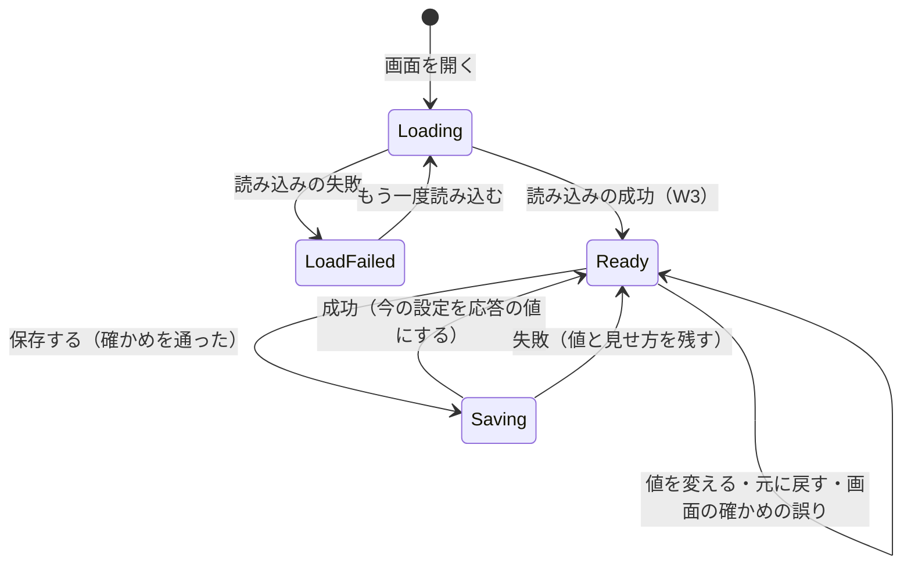
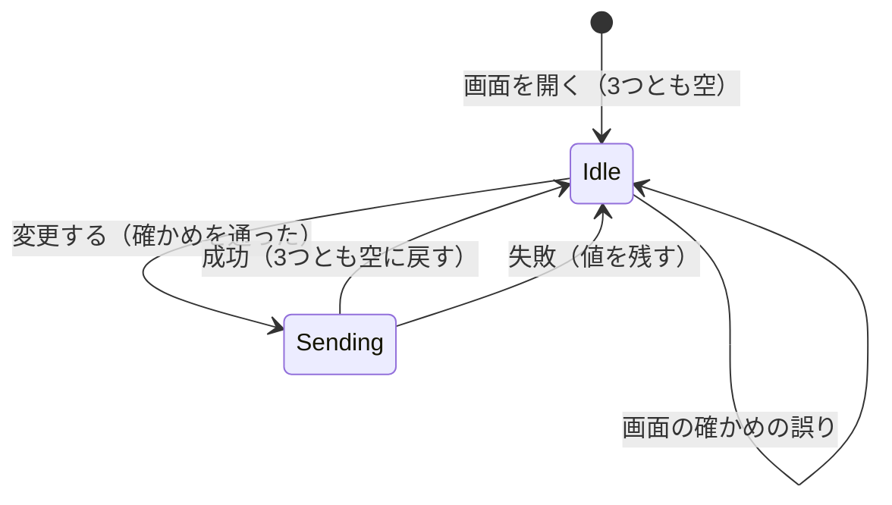

# Functional Spec — U7 プリファレンスとパスワードの変更の画面（u7-preferences-ui）

U7 は、ログインした利用者が自分の氏名・言語・テーマ・文字の大きさを変えて保存し、自分のパスワードを変える画面の単位（種類 ui）である。画面は S4 プリファレンスと S5 パスワードの変更で、部品は PreferencesUi（`aidlc/spaces/default/intents/260925-user-management/inception/units-generation/unit-of-work.md`、`inception/domain-design/components.md`）。

- 正本: この文書は、画面の流れ（W1〜W13）と画面の状態の移り変わりの正本である。U7 は画面の単位のため、保存するデータ（エンティティ）と `rules.md` を持たない。流れの中で守る決まりは 3節に D1〜D14 として1回だけ書く。部品の階層・props と state・フック・API との受け渡し・U4 の口の使い方は `frontend-components.md` に置く。
- 出典: 質問と答え `functional-design-questions.md`（設計の要点 1〜16・決まっていること・Q1 A・Q2 A・Q3 A、まとめの確認は Looks correct）、契約 C4（受ける側、自分の設定の API）・C9（受ける側、表示の設定の口）（`aidlc/spaces/default/intents/260925-user-management/inception/contract-design/contract-summary.md`）、要件 FR5.1〜FR5.5・FR6.1〜FR6.3・FR10.2・NFR7・NFR8（`inception/requirements-analysis/requirements.md`）、ストーリー US4.1・US5.1 と共通の決まり CR1・CR6（`inception/user-stories/stories.md`）、画面 S4・S5 と `interaction-spec.md` の 1節・7〜9節・`design-system-mapping.md`（`inception/refined-mockups/`）、依存する単位 U2（`construction/u2-user-preferences/functional-design/`）と U4（`construction/u4-display-foundation/functional-design/`）の機能設計、並行して設計した U6 の決定（共用の確かめの関数 `frontend/src/shared/validation/` と共用の部品 `frontend/src/shared/ui/RadioFieldset`。U6 の質問ファイルの設計の要点 9・10 と、U6 の担当からの知らせ）、既存のコード `frontend/src/app/registry/`・`frontend/src/app/layout/ShellLayout.tsx`・`frontend/src/app/navigation/navigationItems.ts`・`frontend/src/features/auth/`・`frontend/src/shared/api-client/`。
- 受け持たないこと: 自分の設定の API のふるまい・検証・監査（U2）、表示の設定を画面に当てる仕組み・ユーザーメニューの氏名の表示・`Accept-Language` の付与・OS の配色の追従（U4）、共用の確かめの関数と `RadioFieldset` の中身（U6 が作り、U7 は使う側）。make-you-chic-ui（`vendor/make-you-chic-ui`）は変更しない（`project.md` の Forbidden）。

## 1. 用語

| 用語 | 意味 |
|---|---|
| プリファレンス | 氏名（`displayName`）・言語（`ja`・`en`）・テーマ（`light`・`dark`・`system`）・文字の大きさ（`sm`・`md`・`lg`）の4つ。契約 C4 の `Preferences` |
| 今の設定 | 画面が正とみなす内部DB の値。最後に読み込んだ値（W2）か、最後の保存の成功の応答の値（W8）。「元に戻す」の戻り先 |
| フォームの値 | 画面の入力に入っている4つの値。今の設定と違う状態を「変更あり」という |
| 当たっている値 | U4 が画面の土台として当てている利用者の設定（`useDisplaySettings()` の値。見せ方が無いとき） |
| 見せ方 | 保存せずに画面に当てているテーマ・文字の大きさ（U4 の `setPreview`）。言語は見せない |
| 項目の誤り | 項目の下に出す誤り。画面の確かめ（W11）か、サーバーの項目ごとの誤り（W12）から作る |
| 画面の知らせ | 画面の中の `role="alert"` の失敗の表示（make-you-chic-ui の Alert、種類 danger）。画面に1つだけ置く |

## 2. 置き場と登録

| 置き場 | 中身 | この単位で足す・変えること |
|---|---|---|
| `frontend/src/features/preferences/`（新しい） | 機能 `preferences` の2つの画面・フォーム・フック・API の関数・項目ごとの誤りの読み取り・文言 | すべて新しく足す（`frontend-components.md` の 2節） |
| `frontend/src/features/preferences/registration.ts`（新しい） | 機能の登録 | 画面 `/me/preferences`・`/me/password`（どちらも `layout: 'SHELL'`・`access: 'LOGGED_IN'`、遅延読み込み）、ユーザーメニューの2つの項目（`path` で移る、order 80・90）、文言。サイドバーの項目は足さない（入り口はユーザーメニューだけ、refined-mockups の Q2 B） |
| `frontend/src/app/registry/types.ts`（既存を変える、Q1 A） | `UserMenuItemRegistration` | 任意の `path` を足し、`action` と `path` のどちらか一方だけを持つ形にする（9節） |
| `frontend/src/app/registry/validateRegistrations.ts`（既存を変える、Q1 A） | 登録の検査 | ユーザーメニューの項目の「どちらも無い・両方ある」と「登録されていない URL」を誤りにする（9節） |
| `frontend/src/app/layout/ShellLayout.tsx`（既存を変える、Q1 A） | アプリシェル | `path` を持つ項目を、サイドバーと同じく読み込み直しなしで移る（9節） |
| `frontend/src/shared/validation/`（U6 が作る） | 氏名とパスワードの確かめの純粋な関数 | U7 は使うだけ（W11） |
| `frontend/src/shared/ui/RadioFieldset`（U6 が作る） | `fieldset`・`legend` と選択肢ごとの `lang` 属性を持つラジオの組 | U7 は言語・テーマ・文字の大きさの選択に使うだけ |

- 機能どうしの読み込みは作らない。`features/preferences` は `features/auth`・`features/registration` を読み込まない。共用の関数と部品は `shared/` から読む。
- 表示の設定は U4 の口（契約 C9）だけで扱い、make-you-chic-ui の `useTheme` を直接呼ばない（U4 の 2節の決まり）。
- API は既存の ApiClient（`frontend/src/shared/api-client/`）を通す。アクセストークン・401 での更新と送り直し・`Accept-Language` の付与は ApiClient（と U4 が登録する言語の関数）に任せる。
- 画面を隠すことはサーバー側の検査の代わりにしない。未認証の 401 とログインした利用者の 200 はサーバー側のテストで U2 が確かめる（CR4、NFR4）。

## 3. 決まり（画面の単位の設計の決まり）

| ID | 決まり | 出典 |
|---|---|---|
| D1 | プリファレンスの画面は、開くたびに `GET /api/me/preferences` で読み、読み終わるまでフォームを出さない。値の無いフォームで保存できないようにする | 設計の要点 3・4、AC4.1.1 |
| D2 | 読んだ4つの値のどれかが当たっている値（`useDisplaySettings()` の `displayName`・`language`・`theme`・`fontSize`）と違えば、読んだ値で `applyUserPreferences` を呼んでそろえる。そろえたことは知らせない（利用者の操作ではないため）。内部DB の値が正 | Q3 A、FR5.4、U4 の D8 |
| D3 | テーマ `system` の利用者には、今の見た目（ライト・ダーク）ではなく「OS に合わせる」を選んだ状態で出す。画面の値は応答の `theme` をそのまま使い、U4 の `resolvedTheme` を使わない | AC4.1.1、設計の要点 3 |
| D4 | テーマ・文字の大きさを選んだ時点で、フォームのテーマと文字の大きさの2つで `setPreview` を呼ぶ。言語と氏名を変えても口は呼ばない。言語は保存するまで画面の言語を変えない | 設計の要点 5、AC4.1.11、ストーリーの M8、U4 の W10 |
| D5 | 「元に戻す」はフォームの4つの値を今の設定に戻し、項目の誤りと画面の知らせを消し、`clearPreview` を呼ぶ。フォームの値が今の設定と同じ間と送信の間は押せない | 設計の要点 6 |
| D6 | 画面を離れるとき（画面の部品が外れるとき）は、プリファレンスの画面で `clearPreview` を呼ぶ。保存していない変更の確かめは出さない | 設計の要点 6、S4 の [assumption]（Refined Mockups の承認で受け入れ） |
| D7 | 送る前に、サーバーと同じ決まりを画面でもすべて確かめ、誤りがあれば送らない。確かめの関数は `frontend/src/shared/validation/` の共用の関数だけを使い、画面に同じ決まりを別に書かない。確かめは送信のときだけ行い、入力の途中では行わない | Q2 A、設計の要点 12、U6 の設計の要点 9・10 |
| D8 | サーバーが 400 `VALIDATION_FAILED` で項目ごとの誤りを返したら、同じ項目の下に出す（画面とサーバーの決まりがずれたときの受け皿）。項目の名前は C4 の項目名で対応づける | Q2 A、U2 の BR3.2・BR4.1 |
| D9 | 項目の誤りは項目の下に文字で出し、`aria-describedby`・`aria-invalid` で結び付ける。誤りがあれば、画面の項目の並びで最初の誤りの項目にフォーカスを移す。入れた値（パスワードを含む）は消さない | CR6.1、AC5.1.7 |
| D10 | 送信の間は主な操作のボタンを押せなくし、文言を「保存しています」「変更しています」にして `aria-busy` を付ける（make-you-chic-ui の Button の `loading`）。送信の間は入力と「元に戻す」も変えられなくする。送信が終わったら、成功と項目の誤りでない失敗のときはフォーカスを主な操作のボタンに戻す | CR6.3、AC4.1.12、設計の要点 8 |
| D11 | 成功は Toast（`aria-live="polite"`）だけで知らせる。失敗は画面の知らせ（`role="alert"`）に残し、次の送信を始めたとき・「元に戻す」・「もう一度読み込む」で消す。Toast だけで失敗を知らせない | CR6.4 |
| D12 | 保存の成功の Toast は、`applyUserPreferences` の後の描画（新しい言語に切り替わった後）で、その描画の文言で出す。言語を変えたときも新しい言語で出る | AC4.1.12、U4 の W10 の 5 |
| D13 | 失敗の文言は、サーバーの `detail` を使わず、応答の `code` と項目の名前・理由から画面の文言の鍵を選ぶ。画面が文言を持たない場合は、操作ごとの一般の文言にする。応答の値をブラウザのコンソールや保存に出さない | NFR1、CR5、U5 の D4 と同じ考え方 |
| D14 | 言語の選択肢は U4 の `LANGUAGE_NAMES`（「日本語」「English」、訳さず `lang` 属性を付ける）、テーマ・文字の大きさの選択肢は骨組みの文言 `display.theme.*`・`display.fontSize.*` を使う。選択は `RadioFieldset`（まとまりごとに `fieldset`・`legend`）で作る | CR6.6、U4 の D12・8節、U6 の決定 |

## 4. 画面の状態の移り変わり

### 4.1 プリファレンスの画面（S4）

| 状態 | 表示 | 入る時点 |
|---|---|---|
| Loading | フォームの位置に読み込み中の表示（「読み込んでいます」） | 画面を開いた・もう一度読み込む |
| LoadFailed | 画面の知らせ（読み込めなかった旨）と「もう一度読み込む」のボタン。フォームは出さない | 読み込みの失敗 |
| Ready | 4つの値の入ったフォーム。変更の有無はフォームの値と今の設定の比べで決まる | 読み込みの成功・送信の終わり |
| Saving | フォームを出したまま、入力とボタンを押せない。「保存しています」 | 画面の確かめを通って送信を始めた |



<!-- Text fallback: 画面を開くと Loading になり、読み込みに失敗すると LoadFailed になる。LoadFailed で「もう一度読み込む」を押すと Loading に戻る。読み込みに成功すると Ready になり、フォームを出す。Ready のまま値を変える・元に戻す・画面の確かめで誤りが見つかることがある。確かめを通って保存を始めると Saving になり、成功すると今の設定を応答の値にして Ready に戻り、失敗すると入れた値と見せ方を残して Ready に戻る。どの状態でも画面を離れると clearPreview を呼ぶ。 -->

見せ方の有無は画面の状態と別に持つ。

| 見せ方 | 入る時点 | 抜ける時点 |
|---|---|---|
| 無い | 画面を開いた | — |
| 有る（テーマ・文字の大きさ） | テーマか文字の大きさを選んだ（D4） | 「元に戻す」（`clearPreview`）、保存の成功（`applyUserPreferences` が見せ方を捨てる）、画面を離れる（`clearPreview`）、ログイン状態が新しくなった（U4 の D2） |

- 保存の失敗では見せ方を残す（`mockups.md` の S4 の状態の表の「入れた値は残す」）。
- トークンの更新の応答でログイン状態が新しくなると、U4 は見せ方を捨てる（U4 の D2）。そのときフォームのテーマ・文字の大きさは選んだ値のまま残り、画面は当たっている値に戻る。この食い違いは、次にテーマか文字の大きさを選ぶ・「元に戻す」・保存で解ける（10節の (f)）。

### 4.2 パスワードの変更の画面（S5）

| 状態 | 表示 | 入る時点 |
|---|---|---|
| Idle | 3つの項目と「変更する」。項目の誤り・画面の知らせがあれば出す | 画面を開いた・送信の終わり |
| Sending | 入力とボタンを押せない。「変更しています」 | 画面の確かめを通って送信を始めた |



<!-- Text fallback: 画面を開くと3つの項目が空の Idle になる。「変更する」を押して画面の確かめで誤りが見つかれば Idle のまま誤りを出す。確かめを通ると Sending になり、成功すると3つの項目を空に戻して Idle に、失敗すると入れた値を残して Idle に戻る。 -->

## 5. 画面の流れ

### W1. ユーザーメニューから画面へ移る（Q1 A）

1. ログインした利用者がトップバーのユーザーメニューを開くと、「プリファレンス」（order 80）・「パスワードの変更」（order 90）・既存の「ログアウト」（order 100）の順に並ぶ。管理者かどうかにかかわらず同じ項目が出る（FR10.2、AC5.1.9）。
2. 「プリファレンス」を選ぶと `/me/preferences` へ、「パスワードの変更」を選ぶと `/me/password` へ、サイドバーと同じく読み込み直しなしで移る（ShellLayout が登録の `path` で React Router の移動を行う、9節）。セッションの復元と見た目の設定の読み取りはやり直さない。
3. URL を直接開いたときも同じ画面が出る。未ログインで開くと、既存の振り分けでログインの画面へ移る（`access: 'LOGGED_IN'`、既存の `decideRoute`）。
4. どちらの画面もサイドバーの項目には足さない。サイドバーで目立たせる項目は無い（既存の振り分けのまま）。

### W2. プリファレンスの画面を開く・読み込む

1. 画面を開くと Loading になり、`GET /api/me/preferences`（C4）を呼ぶ（D1）。
2. 200 で、4つの値が C4 の形（`displayName` が文字列、`language`・`theme`・`fontSize` が許される値）なら W3 へ進む。
3. 失敗（通信の失敗・200 以外・形の誤り）なら LoadFailed にし、画面の知らせ「プリファレンスを読み込めませんでした。」と「もう一度読み込む」のボタンを出す。フォームは出さない（設計の要点 4）。
4. 「もう一度読み込む」を押すと、知らせを消して Loading に戻り、読み直す。読み直しの後のフォーカスは、成功なら氏名の項目、失敗なら「もう一度読み込む」のボタン。
5. 401 は ApiClient が更新と送り直しを1回だけ行う。更新もできなければ、既存の流れで未ログインになり、ログインの画面へ移る（画面の部品は外れる）。
6. 読み込みの答えが、画面を離れた後・次の読み直しを始めた後に届いたときは捨てる（最後に始めた読み込みの答えだけを使う）。

### W3. 読んだ値の表示と、当たっている値とのそろえ（Q3 A）

1. 読んだ4つの値を今の設定とし、フォームの値にも入れて Ready にする。氏名は応答のまま（前後の空白を除いた値が保存されている、U2 の BR1.1）。
2. テーマ `system` の利用者は「OS に合わせる」を選んだ状態で出す（D3、AC4.1.1）。スキーマの変更の前からいる利用者は、U2 が入れた初期値（氏名はメールアドレス・ja・system・md）がそのまま出る（AC4.1.10）。
3. 読んだ値のどれかが当たっている値と違えば、読んだ値で `applyUserPreferences` を呼ぶ（D2）。U4 が当たっている値・ユーザーメニューの氏名・画面の言語を置き換え、ブラウザにも保存する（U4 の D6 の (b)・D8）。ほかの PC で保存した後などは、開いた時点で言語やテーマが変わることがある。Toast は出さない。
4. これで「元に戻す」（`clearPreview`）で戻る画面の値と、フォームの戻り先（今の設定）が同じになる。
5. フォームの並びは、氏名（TextInput と FormField、必須の印）・言語・テーマ・文字の大きさ（`RadioFieldset`、D14）・「元に戻す」（secondary）・「保存する」（primary）。言語の案内「保存すると切り替わります」を言語のまとまりに、テーマと文字の大きさの案内「テーマと文字の大きさは選ぶと画面に反映されます」をテーマと文字の大きさの2つのまとまりに `aria-describedby` で結び付ける（`interaction-spec.md` の 7節）。
6. 最初のフォーカスは動かさない（画面の見出しからの読み上げの順のまま。既存の画面と同じ）。

### W4. テーマ・文字の大きさ・言語・氏名を変える（選んだ時点の見せ方）

1. テーマか文字の大きさを選ぶと、フォームの値を変え、フォームのテーマと文字の大きさで `setPreview(theme, fontSize)` を呼ぶ（D4）。保存の前から画面の見た目がその値になる（AC4.1.11）。テーマ「OS に合わせる」を見せている間も、OS の配色の切り替えに追従する（U4 の W11）。
2. 言語を選んでも口は呼ばず、フォームの値だけを変える。画面の言語は保存するまで変わらず、案内「保存すると切り替わります」を出したままにする（ストーリーの M8、AC4.1.11）。
3. 氏名を変えても口は呼ばず、フォームの値だけを変える。ユーザーメニューの氏名は保存するまで変わらない。
4. 項目の誤り・画面の知らせは、値を変えても消さない（次の送信・「元に戻す」で消す、D11）。
5. フォームの値が今の設定と違う間だけ「元に戻す」を押せる（D5）。

### W5. 元に戻す

1. 「元に戻す」を押すと、フォームの4つの値を今の設定に戻し、項目の誤りと画面の知らせを消し、`clearPreview` を呼ぶ（D5）。画面の見た目は当たっている値（W3 でそろえた値、または最後に保存した値）に戻る。
2. 押した後は「元に戻す」が押せなくなるため、フォーカスを「保存する」に移す（押せなくなったボタンにフォーカスを残さない）。
3. 内部DB には何も送らない。

### W6. 画面を離れる

1. 保存せずにプリファレンスの画面を離れる（ユーザーメニュー・サイドバーでほかの画面へ移る、ログアウト、ブラウザの戻る）と、画面の部品が外れる時点で `clearPreview` を呼ぶ（D6）。テーマ・文字の大きさは当たっている値に戻る（AC4.1.11）。
2. 保存していない変更の確かめは出さない（S4 の [assumption]）。
3. 保存の送信中に離れたときは、応答が 200 なら応答の値で `applyUserPreferences` を呼ぶ（内部DB は保存されたため、画面の値を内部DB にそろえる）。Toast とフォーカスの移動はしない（画面が無いため）。失敗の応答は捨てる。

### W7. 保存する（PUT /api/me/preferences）

1. 「保存する」を押すと、画面の知らせを消し、フォームの値を W11 の関数で確かめる（D7）。
2. 誤りがあれば送らず、項目の下に出し、最初の誤りの項目へフォーカスを移す（D9）。入れた値と見せ方は残す。
3. 誤りが無ければ Saving にし、フォームの4つの値を本文にして `PUT /api/me/preferences`（C4）を送る。氏名は入力のまま送る（前後の空白を除くのはサーバー、U2 の BR1.1）。送信の間は D10 のとおり押せなくする（CR6.3）。
4. 結果は W8。

### W8. 保存の結果

1. 200 で、応答が C4 の形なら成功とする。
   1. 応答の4つ（氏名は前後の空白を除いた値）で `applyUserPreferences` を呼ぶ。U4 が当たっている値と氏名を置き換え、見せ方を捨て、ブラウザにも保存する（U4 の D6 の (b)・D8）。言語を変えたときは同じ描画で文言・`<html lang>`・要求の言語が切り替わる（AC4.1.4）。ユーザーメニューの名前は保存した直後から新しい氏名になる（AC4.1.8）。
   2. 今の設定とフォームの値を応答の値に置き換え、項目の誤りを消して Ready にする（「元に戻す」は押せなくなる）。
   3. 次の描画（新しい言語に切り替わった後）で、Toast「保存しました」をその描画の文言で出し、フォーカスを「保存する」に戻す（D10・D12、AC4.1.12）。「保存する」のボタンは言語が変わっても同じ部品のまま描き直し、フォーカスが失われないようにする。
2. 400 `VALIDATION_FAILED` なら、W12 のとおり項目の下に出し、最初の誤りの項目へフォーカスを移す。
3. そのほかの失敗は、画面の知らせ「保存できませんでした。しばらくしてから、もう一度お試しください。」を出し、フォーカスを「保存する」に戻す。
4. 失敗のときは、入れた値と見せ方を残し、今の設定は変えない（`mockups.md` の S4 の状態の表）。
5. 応答ごとの動きは 6.2 の表。

### W9. パスワードの変更の画面を開く・送る（POST /api/me/password）

1. 画面を開くと、今のパスワード（`autocomplete="current-password"`）・新しいパスワード・新しいパスワード（確かめ）（どちらも `autocomplete="new-password"`）の3つの空の項目（どれも `type="password"`、必須の印）と「変更する」（primary）を出す（CR6.9、`mockups.md` の S5）。API は呼ばない。
2. 新しいパスワードの項目には、入力の前の案内「12 文字以上」だけを出す（CR6.2、refined-mockups の Q6 B）。72 バイトの上限は、超えたときだけ誤りとして出す（W11）。
3. 「変更する」を押すと、画面の知らせを消し、3つの値を W11 のとおり確かめる（D7）。誤りがあれば送らず、項目の下に出し、最初の誤りの項目へフォーカスを移す（D9）。
4. 誤りが無ければ Sending にし、3つの値を本文にして `POST /api/me/password`（C4）を送る。送信の間は D10 のとおり押せなくする。
5. 結果は W10。

### W10. パスワードの変更の結果

1. 204 なら成功とする。3つの項目を空に戻し、項目の誤りを消し、Toast「パスワードを変更しました」を出し、フォーカスを「変更する」に戻す。ログインしたままで、画面も移らない（AC5.1.8、FR6.3）。
2. 400 `PASSWORD_CURRENT_MISMATCH` なら、今のパスワードの項目に誤り「今のパスワードが正しくありません」を結び付けて出し、その項目へフォーカスを移す。3つの値はどれも消さない（AC5.1.7、CR6.1）。この応答は 400 のため ApiClient の 401 の更新の流れに乗らず、ログインしたままで、ログインの画面へ移らない（AC5.1.6）。
3. 400 `VALIDATION_FAILED` なら、W12 のとおり項目の下に出す。
4. そのほかの失敗は、画面の知らせ「パスワードを変更できませんでした。しばらくしてから、もう一度お試しください。」を出し、値を残し、フォーカスを「変更する」に戻す。
5. 送信中に画面を離れたときは、応答を捨てる。
6. 応答ごとの動きは 6.3 の表。

### W11. 画面の側の確かめ（Q2 A）

1. 確かめは送信のときだけ、共用の関数（`frontend/src/shared/validation/`、U6 が作る）で行う（D7）。関数は React に触れない純粋な関数で、誤りの理由（種類）を返し、文言は持たない。U7 は理由から自分の文言の鍵を選ぶ（7節）。
2. プリファレンスの画面:
   - 氏名: 前後の空白（Unicode の White_Space）を除いた後が空・254 コードポイントを超える・内側に制御文字（Cc）か見えない書式の文字（Cf）がある、を誤りにする（U2 の BR1.1〜BR1.4 と同じ決まり）。
   - 言語・テーマ・文字の大きさ: 決まった選択肢から選ぶため、画面の値はいつも許される値で、確かめの誤りは出ない。サーバーが誤りを返したときは W12 で受ける。
3. パスワードの変更の画面:
   - 今のパスワード: 空なら誤り。規則（長さ・バイト数）は当てない（今のパスワードは規則ができる前のものでもよく、照合はサーバーが行う。U2 の BR4.2）。
   - 新しいパスワード: 空・12 コードポイント未満・UTF-8 で 72 バイトを超える、を誤りにする（FR4.4・FR6.2、U2 の BR4.1）。
   - 確かめ: 空、または新しいパスワードと文字の並びとして完全に一致しない、を誤りにする。
4. 長さはコードポイント、バイト数は UTF-8 で数える（U2 の BR1.3・既存の `PasswordPolicy` と同じ数え方）。今と同じパスワードへの変更は誤りにしない（U2 の BR4.4）。
5. 1つの項目には誤りを1つだけ出す（決まりの順で最初に当たった理由）。項目の並びの順に最初の誤りの項目へフォーカスを移す（D9）。

### W12. サーバーの項目ごとの誤りの受け方（Q2 A）

1. 400 `VALIDATION_FAILED` の応答の Problem Details から、項目ごとの誤り（項目の名前と理由の組、U2 の BR3.2・BR4.1）を読む。読み方は1か所（`frontend-components.md` の 2節の項目ごとの誤りの読み取り）にまとめる。
2. 項目の名前は C4 の項目名（`displayName`・`language`・`theme`・`fontSize`・`currentPassword`・`newPassword`・`newPasswordConfirmation`）で、画面の項目に対応づける。
3. 理由が W11 の理由と同じものは同じ文言で出し、画面が知らない理由は項目ごとの一般の文言（「入力を確かめてください」など、7節）で出す。サーバーの `detail` は使わない（D13）。
4. 画面の項目に対応づけられる誤りが1つも無い（項目ごとの誤りが無い・知らない項目だけ）ときは、画面の知らせ「入力を確かめてください。」を出す。
5. どの場合も入れた値は消さない。プリファレンスの画面では見せ方も残す。
6. 項目ごとの誤りの形（Problem Details の追加の項目の名前と、理由の値の一覧）は U2 のコード生成で決まる。U7 のコード生成は、その形を確かめてから読み取りを書く（10節の (c)）。

### W13. 文言と言語

1. 2つの画面の文言は、画面の言語（ログインの後は利用者の言語、U4 の W5）で出す（CR1.1）。新しい文言は ja・en の両方を機能の登録の文言に置く（CR1.4、NFR8、7節）。
2. 保存で言語を変えると、U4 が同じ描画で文言を切り替えるため、プリファレンスの画面の見出し・項目の名前・案内・ボタン・項目の誤りも新しい言語になる。項目の誤りは文言の鍵で持ち、描画のたびに今の言語で引く。
3. 画面の知らせの閉じるボタンの文言（make-you-chic-ui の Alert の `dismissLabel`、既定は日本語の「閉じる」）は、画面の言語の文言を渡す。
4. 言語の選択肢の名前は訳さない（D14）。

## 6. 応答ごとの動き

### 6.1 読み込み（`GET /api/me/preferences`）

| 応答 | 動き | 流れ |
|---|---|---|
| 200・C4 の形 | 今の設定とフォームに入れ、当たっている値と違えばそろえて Ready | W3 |
| 200・形の誤り | LoadFailed（読み込めなかった旨ともう一度読み込む） | W2 |
| 401 | ApiClient が更新と送り直しを1回。更新もできなければ未ログインになりログインの画面へ移る。画面が残る間は LoadFailed | W2 |
| そのほかの 4xx・5xx・通信の失敗 | LoadFailed | W2 |

### 6.2 保存（`PUT /api/me/preferences`）

| 応答 | 動き | 流れ |
|---|---|---|
| 200・C4 の形 | `applyUserPreferences`、今の設定を応答の値に、次の描画で Toast「保存しました」、フォーカスは「保存する」 | W8 |
| 200・形の誤り | 画面の知らせ（保存できなかった旨）。内部DB は変わったかもしれないため、今の設定は変えず、次に開いたときの読み込みで内部DB の値が出る | W8 |
| 400 `VALIDATION_FAILED`（項目ごとの誤りあり） | 項目の下に出し、最初の誤りの項目へフォーカス。値と見せ方は残す | W12 |
| 400 `VALIDATION_FAILED`（対応づけられる誤りなし） | 画面の知らせ「入力を確かめてください。」 | W12 |
| 401 | ApiClient が更新と送り直しを1回。更新もできなければ未ログインになりログインの画面へ移る（保存していない変更は失われる）。画面が残る間は画面の知らせ | W8 |
| そのほかの 4xx・5xx・通信の失敗 | 画面の知らせ（保存できなかった旨）、フォーカスは「保存する」。値と見せ方は残す | W8 |

### 6.3 パスワードの変更（`POST /api/me/password`）

| 応答 | 動き | 流れ |
|---|---|---|
| 204 | 3つを空に戻し、Toast「パスワードを変更しました」、フォーカスは「変更する」。ログインしたまま | W10 |
| 400 `PASSWORD_CURRENT_MISMATCH` | 今のパスワードの項目に誤りを結び付け、そこへフォーカス。3つの値は残す。ログインしたまま | W10 |
| 400 `VALIDATION_FAILED` | 項目の下に出す（対応づけられる誤りが無ければ画面の知らせ） | W12 |
| 401 | アクセストークンの期限切れなどで、ApiClient が更新と送り直しを1回。更新もできなければ未ログインになりログインの画面へ移る（今のパスワードの誤りは 401 にならない、U2 の BR4.2） | W10 |
| そのほかの 4xx・5xx・通信の失敗 | 画面の知らせ（変更できなかった旨）、値を残し、フォーカスは「変更する」 | W10 |

## 7. 文言

新しい文言は `features/preferences` の機能の登録の `messages` に置き、鍵は `preferences.` で始める（既存の登録の検査が接頭辞と ja・en のそろいを確かめる）。テーマ・文字の大きさの選択肢は骨組みの `display.theme.*`・`display.fontSize.*`、言語の選択肢は `LANGUAGE_NAMES` を使い、ここには置かない（D14）。

| 鍵 | ja | en |
|---|---|---|
| `preferences.menu.preferences` | プリファレンス | Preferences |
| `preferences.menu.password` | パスワードの変更 | Change password |
| `preferences.page.title` | プリファレンス | Preferences |
| `preferences.loading` | 読み込んでいます | Loading |
| `preferences.load.failed` | プリファレンスを読み込めませんでした。 | The preferences could not be loaded. |
| `preferences.load.retry` | もう一度読み込む | Load again |
| `preferences.displayName` | 氏名 | Name |
| `preferences.language` | 言語 | Language |
| `preferences.language.hint` | 保存すると切り替わります | Changes when you save |
| `preferences.theme` | テーマ | Theme |
| `preferences.fontSize` | 文字の大きさ | Text size |
| `preferences.appearance.hint` | テーマと文字の大きさは選ぶと画面に反映されます | The theme and text size are shown as soon as you choose them |
| `preferences.reset` | 元に戻す | Revert |
| `preferences.save` | 保存する | Save |
| `preferences.saving` | 保存しています | Saving |
| `preferences.saved` | 保存しました | Saved |
| `preferences.save.failed` | 保存できませんでした。しばらくしてから、もう一度お試しください。 | The preferences could not be saved. Please try again later. |
| `preferences.displayName.required` | 氏名を入力してください | Enter your name |
| `preferences.displayName.tooLong` | 氏名は 254 文字以内で入力してください | Enter a name of 254 characters or fewer |
| `preferences.displayName.invalidCharacter` | 氏名に改行・タブや見えない文字は使えません | The name cannot contain line breaks, tabs, or invisible characters |
| `preferences.field.invalid` | 入力を確かめてください | Check this entry |
| `preferences.choice.invalid` | 選択を確かめてください | Check this choice |
| `preferences.form.invalid` | 入力を確かめてください。 | Check your entries. |
| `preferences.alert.dismiss` | 閉じる | Close |
| `preferences.password.title` | パスワードの変更 | Change password |
| `preferences.password.current` | 今のパスワード | Current password |
| `preferences.password.new` | 新しいパスワード | New password |
| `preferences.password.confirm` | 新しいパスワード（確かめ） | New password (confirm) |
| `preferences.password.hint` | 12 文字以上 | At least 12 characters |
| `preferences.password.submit` | 変更する | Change |
| `preferences.password.submitting` | 変更しています | Changing |
| `preferences.password.changed` | パスワードを変更しました | Your password has been changed |
| `preferences.password.failed` | パスワードを変更できませんでした。しばらくしてから、もう一度お試しください。 | The password could not be changed. Please try again later. |
| `preferences.password.currentRequired` | 今のパスワードを入力してください | Enter your current password |
| `preferences.password.currentMismatch` | 今のパスワードが正しくありません | The current password is not correct |
| `preferences.password.newRequired` | 新しいパスワードを入力してください | Enter a new password |
| `preferences.password.tooShort` | 12 文字以上で入力してください | Enter at least 12 characters |
| `preferences.password.tooLong` | 長すぎます（半角で 72 文字、全角でおよそ 24 文字まで） | Too long (up to 72 half-width characters, or about 24 full-width characters) |
| `preferences.password.confirmRequired` | 確かめのため、新しいパスワードをもう一度入力してください | Enter the new password again to confirm it |
| `preferences.password.mismatch` | 新しいパスワードと同じ値を入力してください | Enter the same value as the new password |

- 必須の印は make-you-chic-ui の FormField の `required`（見た目の印）に任せ、項目の名前の文言には「（必須）」を入れない。必須であることは誤りの文言でも伝わる。
- 英語の文言はコード生成で、画面の幅に収まるかと既存の英語の文言の言い回しとそろっているかを確かめる。

## 8. テストの方針

`team.md` の Testing Posture に従う（テストは対象と同じ場所の `*.test.ts(x)`、Vitest・Testing Library（jsdom）・user-event・vitest-axe、画面部品ごとにアクセシビリティの検査を1件、テストの説明文は英語、フロントエンドのカバレッジの下限は行 80%・分岐 70%）。確かめる内容の一覧は `frontend-components.md` の 7節に置く。

- API は `features/preferences` の API の関数を差し替えて偽の応答で作る。U4 の口は、既存の `renderWithProviders`（U4 が表示の設定の土台を加えた形）で本物を使い、画面の値（`<html>` の `data-theme`・`data-font-size`・`lang`）とユーザーメニューの名前で確かめる。口の呼ばれ方だけを確かめたいテストは、口を差し替える。
- 共用の確かめの関数そのものの性質ベースのテスト（fast-check、失敗時の種を記録）は、関数を作る U6 が持つ。U7 は、確かめの結果が正しい項目・正しい文言・正しいフォーカスに結び付くことを画面のテストで確かめる。項目ごとの誤りの読み取りの関数（W12）は U7 の純粋な関数で、壊れた入力でも例外を出さないことを性質ベースのテストで確かめる。
- 骨組みの変更（9節）は、既存の `validateRegistrations.test.ts`・`ShellLayout.test.tsx`・`navigationItems.test.ts` に足して確かめ、既存のログアウトの項目が変わらず動くことも確かめる。
- E2E は足さない（この Intent の代表の流れは招待から登録の完了までの1本で U6 が持つ、`team.md`）。画面・認証に関わる変更のため、統合の前に既存の E2E を手元で流す（`team.md`）。
- テーマと文字の大きさのすべての組み合わせで崩れないこと（NFR7）の確かめ方は、NFR 要件の段の持ち主のまま（ストーリーの「後の段に回す点」）。

## 9. 骨組みへの変更（Q1 A）

骨組み（`frontend/src/app/`、部品 AppFrame、持ち主は U4）に、ユーザーメニューの項目で画面へ移る手段を足す。U4 は登録の仕組みを変えないため、U7 が受け持つ（U4 の担当からの持ち越し）。どれも既存の登録を壊さない安全な追加で、既存のログアウトの項目はそのまま動く。

### 9.1 `UserMenuItemRegistration`（`frontend/src/app/registry/types.ts`）

- 任意の `path`（登録済みの画面の URL）を足し、`action` を任意にする。型で「どちらか一方だけ」を表す（形の例、コード生成で確定する）。

```ts
interface UserMenuItemBase {
  id: string
  labelKey: string
  order: number
}
/** 選んだときに操作を行う項目（例: ログアウト）か、登録済みの画面へ移る項目のどちらか */
export type UserMenuItemRegistration =
  | (UserMenuItemBase & { action: () => void; path?: never })
  | (UserMenuItemBase & { path: string; action?: never })
```

- 既存の `features/auth/registration.ts` のログアウトの項目（`action` だけ）は、そのまま型に合う。

### 9.2 登録の検査（`frontend/src/app/registry/validateRegistrations.ts`）

型の外から来る登録（型の検査をくぐった値）もあるため、検査でも確かめる。どれも既存と同じく、すべての問題を集めて起動を止める（既存の起動の誤りの画面）。

| 足す検査 | 誤りの文言の形 |
|---|---|
| `action` と `path` のどちらも無い、または両方ある | `<featureId>: ユーザーメニューの項目 "<id>" は action と path のどちらか一方だけを持ってください` |
| `path` が登録された画面の URL（ホームを含む）に無い | `<featureId>: ユーザーメニューの項目 "<id>" の URL "<path>" は登録されていません`（サイドバーの項目と同じ判定） |

- 既存の「ユーザーメニューの項目の id の重複」の検査はそのまま。

### 9.3 `ShellLayout`（`frontend/src/app/layout/ShellLayout.tsx`）

- ユーザーメニューの項目のうち `path` を持つものは、選んだときに React Router の移動（`navigate(path)`）で、読み込み直しなしで移る（サイドバーの項目と同じ）。`action` を持つものは今までどおり `action` を呼ぶ。
- make-you-chic-ui の Dropdown の項目（`MenuItem`）は `label` と `onClick` だけのため、`onClick` の中で振り分ける。make-you-chic-ui は変えない。
- `buildUserMenuItems`（`frontend/src/app/navigation/navigationItems.ts`）は変えない（登録をそのまま order の順に並べる）。
- U4 が同じ `ShellLayout` に足す、ユーザーメニューの名前を氏名にする変更（U4 の `frontend-components.md` の 4節）と同じファイルに触れる。どちらも同じ Bolt（B5 は U7、U4 は B4）の中ではないため、U7 のコード生成は U4 の変更が入った後の `ShellLayout` に足す。

## 10. 上流との差・後の段へ渡すこと（承認済みの文書は書き換えず、ここに記録する）

| # | 差・渡すこと | 扱い |
|---|---|---|
| (a) | 骨組み（AppFrame、持ち主は U4）の型・登録の検査・`ShellLayout` を U7 が変える。`unit-of-work.md` の U7 の境界（表示の設定を当てる仕組みは U4）と、U4 の「登録の仕組みを変えない」の外の変更 | Q1 A で依頼者が選んだ。承認の場で骨組みの変更として確かめる（9節）。安全な追加で、既存の登録と `features/auth` はそのまま |
| (b) | 言語・テーマ・文字の大きさの選択を、`design-system-mapping.md` の 1節の make-you-chic-ui の RadioGroup・Radio ではなく、共用の部品 `frontend/src/shared/ui/RadioFieldset`（U6 が作る）で作る | make-you-chic-ui の RadioGroup は選択肢の名前を文字列でしか受けず、選択肢の文字に `lang` 属性を付けられない（CR6.6）。`role="radiogroup"` の `div` を描き、`fieldset`・`legend` の名前付けも無い（`interaction-spec.md` の 7節のまとまりごとの `fieldset`・`legend` を満たせない）。make-you-chic-ui は変えられないため、U6 の決定に合わせる。見た目は make-you-chic-ui の Radio に合わせる（U6 の設計） |
| (c) | 項目ごとの誤り（400 `VALIDATION_FAILED`）の形は、契約 C4 に無く、今の共通のエラー応答の仕組み（`GlobalExceptionHandler`）も返していない。U2 が項目の名前と理由を付けると決め、形は U2 のコード生成で作る | U7 のコード生成の前に、U2 が作った形（Problem Details の追加の項目の名前・項目の名前・理由の値の一覧）を確かめ、W12 の読み取りと 7節の理由ごとの文言を合わせる。既存の DSL の `errors` の項目（投入の誤りの一覧）とは別の意味のため、名前が重なるときは U2 と U7 で区別の仕方を確かめる |
| (d) | 共用の確かめの関数（`frontend/src/shared/validation/`）の名前・引数・返す理由の値は U6 の成果物で決まる。この文書は「誤りの理由を返し、文言を持たない純粋な関数」とだけ置き、理由の名前（空・長すぎ・使えない文字・短すぎ・一致しない）は仮の名前で書いた | U7 のコード生成で U6 の関数の形に合わせ、7節の文言の鍵との対応をそろえる。関数が文言を持つ形になった場合も、U7 は `preferences.` の鍵で出す（機能の文言は `<featureId>.` で始める既存の決まり）。U6 と U7 は同じ B5 で作る |
| (e) | U2 の確認の持ち越し R-01（NFR4 の 403 の場面が無く、一般の利用者も 200）・R-03（C8 の PASSWORD_CHANGED の targetUserId）は画面の変更を生まない。R-02（表示に関わる AC の OK と Deferred の分け方）は、U2 が U7 に Deferred で回した AC4.1.11・AC4.1.12・AC5.1.7・AC5.1.8・AC5.1.9 と、U4 が回した AC4.1.1・AC4.1.11・AC4.1.12・CR6 を U7 の `traceability.json` で OK として受ける | R-01 は画面を `access: 'LOGGED_IN'` にすることと合う。R-03 は監査の中身で U2 のまま |
| (f) | 見せ方の最中にトークンの更新の応答が来ると、U4 が見せ方を捨てる（U4 の D2）ため、フォームのテーマ・文字の大きさと画面の見た目が食い違う（4.1） | 保存・「元に戻す」・次の選択で解けるため、この単位では追わない。気になる場合は U4 に「同じ利用者の更新では見せ方を残す」変更を相談する（コード生成で実際に起きるかを確かめる） |
| (g) | make-you-chic-ui の Button は `loading` のあいだ `disabled` になり、ブラウザによってはフォーカスが外れる | D10 で送信の後にフォーカスを戻す。実際に外れるかと、戻し方が読み上げを乱さないかはコード生成で確かめる |
| (h) | 保存の送信中に画面を離れた後の成功の応答でも `applyUserPreferences` を呼ぶ（W6 の 3） | 質問の答えに無い細部として、内部DB と画面の値をそろえる側を選んだ。承認の場で確かめる |
| (i) | 開いた時点のそろえ（W3 の 3）で言語やテーマが変わることを、利用者に知らせない | Q3 A の答えの範囲の細部として、知らせない側を選んだ（利用者の操作ではなく、内部DB の値に合わせるだけのため） |

## 11. 上流との対応の要約

| 上流 | この文書の置き場 |
|---|---|
| FR10.2・AC5.1.9（ユーザーメニューから開く） | W1、9節 |
| FR5.1・AC4.1.1・AC4.1.10（今の値の表示） | W2・W3、D1・D3 |
| FR5.4（内部DB の値が正）・Q3 A | W3、D2 |
| AC4.1.11（選んだ時点の見せ方・言語は保存で） | W4・W5・W6、D4〜D6 |
| AC4.1.4・AC4.1.8・AC4.1.12（保存の後） | W8、D10・D12 |
| FR5.2・AC4.1.7（入力の誤り）・Q2 A | W7・W11・W12、D7〜D9 |
| FR6.1〜FR6.3・AC5.1.3・AC5.1.6〜AC5.1.8（パスワードの変更） | W9・W10・W11・W12 |
| CR1.1・CR1.4・NFR8（文言） | W13、7節 |
| CR6.1〜CR6.4・CR6.6・CR6.9（画面の共通の決まり） | D9〜D11・D14、W2・W3・W7〜W10 |

画面の単位のため、エンティティの関係図と `rules.md` の要約は無い（U7 はアプリが保存するデータを持たない）。
