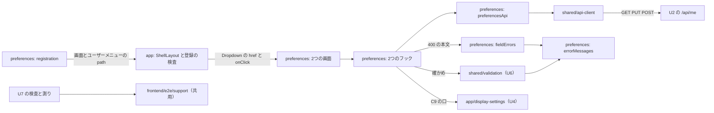

# Logical Components — U7 プリファレンスとパスワードの変更の画面（u7-preferences-ui）

U7 の部品の一覧と、非機能の設計がどの部品に当たるかの見取り図です。この文書には、次のものも置きます。

- 失敗の範囲と、影響の広がり
- 拡張性・信頼性・観測性の扱い（ui の単位のため成果物を作らない）
- 実際のブラウザの検査（置き場・ログインと組の当て方・検査する状態）
- アクセシビリティの画面部品の側と多言語
- テストの作り

答えは `nfr-design-questions.md` にあります（Q1: A、Q2: A、Q3: A、Consolidated Summary Confirmation: Looks correct）。出典の略号と、成果物ごとの置き場の表は `performance-design.md` の冒頭のとおりです。

| 節 | 置く設計 |
|---|---|
| 1〜3節 | 部品の一覧・関係・失敗の範囲 |
| 4節 | 拡張性・信頼性・観測性の扱い |
| 5節 | 実際のブラウザの検査（NFR7.3・NFR7.4・NFR9.9、Q2: A・Q3: A） |
| 6節 | アクセシビリティの画面部品の側（NFR7.1・NFR7.2・NFR7.5）と多言語（NFR8.1・NFR8.2） |
| 7節 | テストとカバレッジ・依存の順（NFR9.5〜NFR9.8、R-02） |
| 8節 | 上流との差 |

## 1. 部品の一覧

置き場は機能設計の2節のとおりです。モジュールの名前は機能設計の `frontend-components.md` の2節のとおりで、細部はコード生成で決めます。

| 部品 | 置き場 | 受け持つこと | 当たる非機能の設計 |
|---|---|---|---|
| 機能の登録・文言（`registration.ts`・`messages.ts`） | `frontend/src/features/preferences/`（新しい） | 2つの画面（遅延読み込み、`LOGGED_IN`）、ユーザーメニューの2つの項目（`path`）、ja・en の文言 | NFR6.6・NFR8.1 |
| API の関数（`preferencesApi.ts`） | 同上 | C4 の3つの API を ApiClient で呼び、成功の応答の形を確かめる | NFR6.4、`security-design.md` の 3.1 |
| 項目ごとの誤りの読み取り（`fieldErrors.ts`） | 同上 | `ApiError.problem` の `fieldErrors` だけを読む。例外を出さない | NFR9.2・NFR9.6（`security-design.md` の 3.2） |
| 文言の鍵の選び方（`errorMessages.ts`） | 同上 | 共用の関数の理由とサーバーの理由を同じ union に寄せ、1つの表で文言の鍵にする | NFR9.2・NFR8.2（`security-design.md` の 3.3） |
| 状態を持つフック（`usePreferencesForm`・`usePasswordChangeForm`） | 同上 | 読み込みの番号、送信中の印（`useRef`）、部品が付いているかの印、値のメモリだけの保持 | NFR6.4・NFR6.5・NFR2.1・NFR9.1・NFR9.3（`performance-design.md` の2節・3節） |
| 画面の部品（`PreferencesPage`・`PreferencesForm`・`PreferencesLoadFailure`・`PasswordChangePage`・`PasswordChangeForm`） | 同上 | make-you-chic-ui の部品で描く。`legend`・`lang`・`aria-describedby`・`aria-invalid`・フォーカス | NFR7.2・NFR7.5 |
| 骨組み（`types.ts`・`validateRegistrations.ts`・`ShellLayout.tsx`、広げる） | `frontend/src/app/registry/`・`frontend/src/app/layout/` | ユーザーメニューの `path` の項目 | NFR9.4（`security-design.md` の5節） |
| 共用の確かめの関数（使うだけ） | `frontend/src/shared/validation/`（U6 が作る） | 氏名とパスワードの確かめ。理由を返す | NFR9.7 |
| 表示の設定の口（使うだけ） | `frontend/src/app/display-settings/`（U4 が作る） | `useDisplaySettings`・`setPreview`・`clearPreview`・`applyUserPreferences`・`LANGUAGE_NAMES` | NFR2.1・NFR8.1 |
| 実際のブラウザの検査と測り | `frontend/e2e/` の `050-` の後の番号の新しいファイル（例: `05x-preferences-accessibility.e2e.ts`。番号は B5 のコード生成の計画で決める） | 組ごとの axe と横のはみ出し、画面の時間の測り | NFR6.1〜NFR6.3・NFR7.3・NFR7.4・NFR9.9（5節、`performance-design.md` の4節） |
| 検査の手伝い（共用） | `frontend/e2e/support/`（U4 が B4 で作る。U5 がログインの関数を足す） | 組の切り替え・axe-core の読み込みと実行・はみ出しの判定・CSP の違反の集め・ログイン。U7 はプリファレンスの答えの差し替えと、測りの利用者の用意の関数を足す | 5節、`security-design.md` の6節 |

- `features/preferences` は、ほかの機能（`features/auth`・`features/registration` など）を読み込まない。共用の関数と部品は `shared/` から読む。
- 表示の設定は U4 の口（契約 C9）だけで扱い、make-you-chic-ui の `useTheme` とブラウザの保存に直接触れない。
- 検査の2つの部品（`frontend/e2e/` の下）は、画面の成果物（`dist`）に入らない。

## 2. 部品の関係

<!-- Text fallback: 機能の登録は2つの画面とユーザーメニューの path の項目を骨組みに渡し、ShellLayout は Dropdown の href と onClick で画面へ移る。2つの画面は状態を持つフックを使う。フックは送る前に U6 の共用の確かめの関数で確かめ、preferencesApi から既存の ApiClient を通して U2 の /api/me の GET・PUT・POST を呼ぶ。400 の本文は fieldErrors で読み、共用の関数の理由と一緒に errorMessages で文言の鍵にする。表示の設定は U4 の C9 の口だけで扱う。U7 の検査と測りは共用の検査の手伝いを使う。 -->

## 3. 失敗の範囲と影響の広がり

失敗の範囲は、ブラウザの1つのタブの中に閉じます。U7 はサーバーの状態を、利用者の保存・変更の操作のときだけ変えます。

| 失敗 | 影響の広がり | 扱い | 出典 |
|---|---|---|---|
| 読み込みの失敗（通信・200 以外・形の誤り） | プリファレンスの画面だけ | LoadFailed（フォームを出さない）と「もう一度読み込む」。自動で読み直さない | W2、6.1 |
| 保存の失敗 | その保存だけ | 画面の知らせ。入れた値と見せ方を残し、今の設定は変えない | W8、6.2 |
| 保存の 200・形の誤り | その保存だけ（内部DB は変わったかもしれない） | 画面の知らせ。次に開いたときの読み込みで内部DB の値が出る | 6.2 |
| パスワードの変更の失敗 | その変更だけ | 画面の知らせか項目の誤り。値を残し、ログインしたまま | W10、6.3 |
| 401 で更新もできない | ログイン状態 | 既存の流れで未ログインになり、ログインの画面へ移る（保存していない変更は失われる） | 6.1〜6.3 |
| 送信中に画面を離れる | その要求の答えだけ | 捨てる。保存の 200 だけ `applyUserPreferences` を呼ぶ | W6 の3・W10 の5 |
| 見せ方の最中のトークンの更新 | フォームと画面の見た目の食い違い | U4 が見せ方を捨てる。保存・「元に戻す」・次の選択で解ける | 機能設計の 10節の (f) |
| 骨組みの登録の誤り（`path` の誤り） | アプリ全体の起動 | 起動の誤りの画面で止める（開発時とテストで見つかる） | 9.2 |

共有する資源:

- U4 の表示の設定の土台（当たっている値・見せ方・ブラウザの保存の鍵）: U7 は C9 の口だけで触る。
- 骨組みのユーザーメニュー: U7 の2つの項目と既存のログアウトが並ぶ。

## 4. 拡張性・信頼性・観測性の扱い

段の定義（`produces_kinds`）により、ui の単位ではこの3つの設計の文書を作りません。U7 での扱いだけを書きます。

| 分類 | 扱い |
|---|---|
| 拡張性 | 状態はブラウザのタブの中だけで、サーバーに状態を足さない。サーバーの負荷は、プリファレンスの画面を開くたびの GET 1件と、利用者の操作ごとの PUT・POST 1件だけ。API の同時の数の目標は U2 が持つ |
| 信頼性 | 3節のとおり、失敗は画面の知らせで示し、値を残す。再試行・サーキットブレーカー・時間切れ・中断は画面に置かない（`performance-design.md` の3節）。401 の更新と送り直しは既存の ApiClient に任せる |
| 観測性 | 画面の側に独自の指標・ログの送り先・外部への送信を足さない。`console` に氏名・パスワード・応答の値を出さない。サーバーの側の要求の数と時間・監査は U2 の観測（`http.server.requests`、監査の記録）で見える |

## 5. 実際のブラウザの検査（NFR7.3・NFR7.4・NFR9.9、Q2: A・Q3: A）

### 5.1 置き場と既存の E2E への非干渉

| 項目 | 作り |
|---|---|
| ファイル | `frontend/e2e/` の `050-display-accessibility.e2e.ts`（U4）の後の番号の新しいファイル（例: `05x-preferences-accessibility.e2e.ts`）。アクセシビリティの検査と画面の時間の測り（`performance-design.md` の4節）を同じファイルに置く。既存の 010〜040 と U4 の 050 のファイルは変えない |
| 実行 | `./gradlew e2eTest` の中（`./gradlew verify` と CI の外）。`workers: 1` のまま番号の順に動く |
| 本数 | 流れの E2E ではないため、`team.md` の「機能の Intent ごとに代表の流れを1本まで」に数えない（NFR9.9） |
| ブラウザの状態 | 組ごとに `browser.newContext()` で新しいコンテキストを作り、終わったら閉じる。差し替え・ブラウザの保存の値はそのコンテキストの中だけ |
| サーバーの状態 | 検査は初期管理者でログインするだけで、設定もパスワードも変えない。PUT・POST を送らない。測りのテストは招待・利用者・パスワードの変更を内部DB に残す（`performance-design.md` の 4.2）。後のファイルは利用者・招待の件数と順に頼らない |
| U5・U6 とそろえること | 次の3つは B5 のコード生成の計画で U5・U6 とそろえて決める。(1) B5 の検査のファイルの番号と並び（U5・U6・U7 の検査と E2E-1 の順）。(2) 初期管理者の設定（`frontend/playwright.config.ts` の `adminEmail`・実行ごとに作るパスワード）を変えない方針。(3) 共用の検査の手伝い（`frontend/e2e/support/`）に足す関数（ログイン・差し替えの答えの組み立て・利用者の用意）の形と置き場。利用者の用意は、受け手からリンクを取り出す手段（infrastructure-design）とあわせて U6 の E2E-1 と同じ関数にする |

### 5.2 組

U4 の組をそのまま使います（U4 の `logical-components.md` の 5.2）。

| 組 | 軸 | 表示の幅 | 数（1画面・1状態あたり） |
|---|---|---|---|
| (a) | テーマ `light`・`dark` × 文字の大きさ `sm`・`md`・`lg`（ブランドカラーは `blue`） | 既定（`Desktop Chrome`） | 6 |
| (b) | ブランドカラー4 × テーマ2（文字の大きさ `md`） | 既定 | 8 |
| (c) | テーマ × 文字の大きさの6組（ブランドカラーは `blue`） | 375px × 812px | 6 |

- 1画面・1状態あたり 20 組です。2つの画面 × 2つの状態（5.4）で、検査は 80 回、ログインは組ごとに1回で 40 回です。
- 画面の言語は既定のロケール（`ja-JP`）のまま日本語です。テーマ `system` とフォントファミリー `serif` は組に入れません（U4 と同じ）。
- 合否は、WCAG 2.0・2.1 の A・AA のタグの規則で axe の違反 0 件と、横のはみ出しが無いこと（`document.documentElement.scrollWidth` が `window.innerWidth` 以下）です（U4 の NFR 設計の Q2: A と 5.4）。判定できなかった要素（`incomplete`）も記録します。

### 5.3 ログインと組の当て方（Q2: A）

ログインの後の画面では、ログインの応答の利用者の設定が当たり、ブラウザの保存の値は使われません（U4 の W5・D8）。そのため U4 の切り替え方（U4 の鍵を初めのスクリプトで置く）は使わず、次のとおり当てます。

| 手順 | 作り | 通す本物の道 |
|---|---|---|
| 1. 差し替えの用意 | 新しいコンテキストのページで、`/api/appearance` を組のブランドカラー（`fontFamily` は `sans`）で、`GET /api/me/preferences` を組のテーマ・文字の大きさ（氏名は固定のテストの値、言語は `ja`）で、200 を返すよう `page.route` で受ける。`PUT` と `POST` は差し替えない | — |
| 2. ログイン | ログインの画面のフォームから初期管理者でログインし、骨組みの画面が出るまで待つ（共用の手伝いのログインの関数） | ログイン、セッション、U4 の W5 |
| 3. プリファレンスの画面 | ユーザーメニューの「プリファレンス」から開く | 骨組みの `path` の道（読み込み直しなし） |
| 4. 組が当たる | 画面が差し替えた答えを読み、当たっている値と違うため `applyUserPreferences` を呼ぶ | D2・W3 の3、U4 の `applyUserPreferences` |
| 5. 当たったことの確かめ | `<html>` の `data-theme`・`data-font-size`・`data-brand` が組の値であることを確かめ、違えば結果を使わずに失敗させる（U4 の 5.3 と同じ） | — |
| 6. パスワードの変更の画面 | 組を当てたプリファレンスの画面から、ユーザーメニューの「パスワードの変更」で移る。当たっている値のまま移り、見せ方は無いため `clearPreview` で値は変わらない。移った後も 5 と同じ確かめを行う | 骨組みの `path` の道 |

- 2つの画面は同じコンテキストで続けて検査します（1つの組につきログインは1回）。組の数は画面ごとに数えます（5.2）。
- `<html>` の属性を直接書き換える方法は使いません（本物の道を通らないため）。
- 差し替えの答えの形は契約 C4 の `Preferences` にそろえ、共用の手伝いで組み立てます。本物の応答の形の確かめは、画面部品のテスト・U2 のサーバー側のテスト・測り（本物の応答）で行います。

### 5.4 検査する状態（Q3: A）

| 画面 | 状態 | 出し方 |
|---|---|---|
| プリファレンス | (1) 最初の状態（4つの値の入ったフォーム。案内の文字を含む） | 5.3 の4の後 |
| プリファレンス | (2) 画面の確かめの誤りの状態（氏名の項目の下の誤り・`aria-invalid`） | 氏名を空にして「保存する」を押す。画面の確かめで止まり、要求を送らない（D7）。フォーカスが氏名に移ったことを待ってから検査する |
| パスワードの変更 | (1) 最初の状態（空の3つの項目と案内「12 文字以上」） | 5.3 の6の後 |
| パスワードの変更 | (2) 画面の確かめの誤りの状態（3つの項目の下の誤り） | 3つを空のまま「変更する」を押す。要求を送らない。フォーカスが今のパスワードに移ったことを待ってから検査する |

- (2) は (1) と同じコンテキストで続けて検査します。ログインの回数は増えません。
- (2) の後に、検査の中で PUT・POST の要求が送られていないことを、コンテキストの要求の記録で確かめます（送られていれば失敗）。
- 次の状態は、実際のブラウザの検査に入れず、画面部品のテスト（vitest-axe と部品 7節）で見ます。サーバーが返したときだけの選択のまとまりの誤り（`legend` の中）、画面の知らせ（Alert）、Toast、読み込み中・LoadFailed、送信中。

### 5.5 結果の記録

- 画面ごと・状態ごと・組ごとの成否と、違反の件数・規則の名前・`incomplete` を、テストの注記と添付（JSON）で残し、Build and Test がそれを結果に写します。
- 画面・認証に関わる変更を統合する前と、リリースの前に、手元で `./gradlew e2eTest` を実行します（`team.md` の Testing Posture）。

## 6. アクセシビリティの画面部品の側と多言語（NFR7.1・NFR7.2・NFR7.5・NFR8.1・NFR8.2）

| ID | 作り |
|---|---|
| NFR7.1 | 目標は WCAG 2.1 AA。実際のブラウザの検査（5節）は WCAG 2.0・2.1 の A・AA のタグの規則で合否を決める。自動で見ない点（読み上げの順序の自然さ、案内の置き方）は、画面部品のテストと機能設計の決まり（D9・D14・W3 の5）で補う |
| NFR7.2 | `PreferencesPage`・`PasswordChangePage` に、vitest-axe の検査を1件ずつ入れ、違反 0 件とする |
| NFR7.5 | 言語・テーマ・文字の大きさは make-you-chic-ui の RadioGroup に `legend` を渡し（`fieldset`・`legend`）、言語の選択肢に `lang` を付ける。言語の案内は言語の `legend` の中の2行目、テーマと文字の大きさの案内は2つのまとまりの前の文字（機能設計の 10節の (b)）。文字の項目の誤りは FormField で `aria-describedby`・`aria-invalid` に結び付け、選択のまとまりの誤りは `legend` の中の文字にする。誤りのときは項目の並びで最初の誤りの項目へフォーカスを移す（D9）。成功は Toast（`aria-live="polite"`）、失敗は `role="alert"`（D11）。言語が変わっても RadioGroup とボタンを作り直さない（`key` を変えない、W8 の1） |
| NFR8.1 | 足す文言は `preferences.` で始まる鍵で、ja・en の両方に置く（機能設計の7節）。言語の選択肢の名前は U4 の `LANGUAGE_NAMES`、テーマ・文字の大きさは骨組みの `display.theme.*`・`display.fontSize.*` を使う。鍵がそろい、空でなく、接頭辞が合うことを、`registration` のテストと既存の登録の検査で確かめる |
| NFR8.2 | `errorMessages.ts` の表（`security-design.md` の 3.3）のすべての鍵が ja・en の両方にあることと、知らない理由が項目ごとの一般の文言になることを、`errorMessages.ts` のテストで確かめる |

## 7. テストとカバレッジ・依存の順（NFR9.5〜NFR9.8、R-02）

| ID | 作り |
|---|---|
| NFR9.5 | フロントエンドのカバレッジの下限（行 80%・分岐 70%、`@vitest/coverage-v8` の `thresholds`）を守る。U7 のために計測の除外を増やさない。`frontend/e2e/` の下の検査・測り・手伝いは Vitest の計測の対象外（既存の E2E と同じ扱い）で、除外の設定は変えない |
| NFR9.6 | 性質ベースのテスト（fast-check）を `fieldErrors.ts` に当てる。性質は2つ（どんな JSON の値を渡しても例外を出さない、返す項目の名前は画面ごとの union の中だけで重ならない）。失敗時の種は、fast-check が失敗のときに示す既定の報告（`seed`・`path`）をテストの出力に残し、その値で再現する（U4 の NFR9.9 と同じ扱い） |
| NFR9.7 | 画面の確かめの境界（新しいパスワードの 11・12 コードポイント、72・73 バイト、絵文字 11・12 文字、確かめの不一致、今のパスワードに規則を当てないこと）と今のパスワードの誤りの表示を、共用の関数を差し替えずに `PasswordChangePage` の画面部品のテストで確かめる。共用の関数そのものの境界と性質ベースのテストは U6 が持つ |
| NFR9.8 | 既存の画面のテスト（`renderWithProviders` を使うものを含む）、骨組みのテスト（`validateRegistrations`・`ShellLayout`・`navigationItems`）、既存の E2E（010〜040）と U4 の 050 が通り続ける。U7 は流れの E2E を足さない。統合の前に `./gradlew e2eTest` を手元で流す |

- テストの置き場と名前は既存の決まりのとおり（対象と同じ場所に `*.test.ts(x)`、説明文は英語、検査と測りは `frontend/e2e/*.e2e.ts`）。個々のテストの一覧は `frontend-components.md` の7節を正とする。
- U6 への依存の順（NFR9.10、R-02）: B5 のコード生成では、U6 の `frontend/src/shared/validation/` を U7 より先に作る。B5 のコード生成の計画の承認の前に、U6 の関数の名前と理由の union（U6 の機能設計の6節）が `security-design.md` の 3.3 の表と合うこと、U6 の側の計画にも「U7 より先に作る」が同じ内容で書かれていることを突き合わせる。
- U4 への依存の順: `ShellLayout` は U4 が B4 でユーザーメニューの名前を氏名にする変更と同じファイルのため、U7 の B5 はその後の `ShellLayout` に足す。検査の手伝いと axe-core も B4 の後。

## 8. 上流との差

承認済みの文書は書き換えません（`aidlc/spaces/default/memory/project.md` の Way of Working）。

| 決定 | 文書 | 承認済みの記述 | この段での扱い |
|---|---|---|---|
| ログインの後の画面の組は `GET /api/me/preferences` の答えの差し替えで当てる（Q2: A） | U4 の NFR 設計の `logical-components.md` の 5.3、U7 の NFR 要件の NFR7.3 | 組の切り替えは U4 の鍵を初めのスクリプトで置く。NFR7.3 は切り替え方を決めていない | U4 の切り替え方はログインの後の画面で効かないため、D2 の本物の道を通す差し替えにした（5.3）。U4 の文書は書き換えない。U5 のログインの後の画面の当て方とは B5 のコード生成の計画でそろえる |
| 誤りの状態を検査に入れる（Q3: A） | U7 の NFR 要件の NFR7.3・NFR7.4 | 画面ごとに組を切り替えて検査する。状態を決めていない | 最初の状態と画面の確かめの誤りの状態の2つにした（5.4）。追加で、食い違いではない |
| パスワードの変更の画面の検査は、プリファレンスの画面からユーザーメニューで移って行う | 機能設計の W1 | ユーザーメニューから読み込み直しなしで移る | 骨組みの `path` の道を実際のブラウザで1回通す（5.3 の6）。追加で、食い違いではない |
| 共用の手伝いに U7 の関数を足す | U4 の NFR 設計の `logical-components.md` の1節・5.1 | 手伝いは組の切り替え・axe-core・はみ出し・CSP の違反 | プリファレンスの答えの差し替えと、測りの利用者の用意の関数を足す（1節）。形と置き場は B5 のコード生成の計画で U5・U6 とそろえる（5.1） |
| 検査のファイルの番号・初期管理者の設定を変えない方針・共用の手伝いを B5 の計画で U5・U6 とそろえる | U4 の `logical-components.md` の 5.1（番号は見込み、コード生成で決める） | ファイルの番号はコード生成で決める | U5 の NFR 設計と同じ方針で書いた（5.1）。食い違いではない |
| U7 が U6 の共用の確かめの関数に頼る | `inception/units-generation/unit-of-work-dependency.md`（U7 は U2・U4 に依存） | U6 への依存が無い | 機能設計の 10節の (d2) と NFR9.10 のとおり、B5 で U6 を先に作る。突き合わせの時点を B5 の計画の承認の前と書いた（7節、R-02） |
