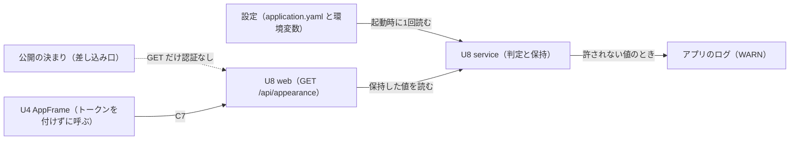

# Functional Spec — U8 インスタンスの見た目の設定（u8-instance-appearance）

## 1. 目的と範囲

U8 は、インスタンス全体の見た目の設定（ブランドカラーとフォントファミリー）を設定から読み、無い・許されない値のときは既定に置き換え、ログインなしで読める API（契約 C7）で画面へ渡す（要件 FR8、共通の決まり CR2（Should）、ADR-006）。

- 受け持つこと: 設定の読み取りと判定、既定への置き換え、警告のログ、公開の API と公開の決まり。
- 受け持たないこと: 画面に当てること（`<html>` の属性や make-you-chic-ui の見た目への対応づけ）、ブラウザへの最後の値の保存、画面がこの API を呼ぶときにトークンを付けないこと。これらは U4（u4-display-foundation）が受け持つ（`unit-of-work.md` の U8・U4 の境界、Q1 A）。
- 置き場: 新しいパッケージ `cherry.mastersmith.appearance` に、画面入出力（`web`）・業務処理（`service`）・この機能の設定の型（`config`）を置く。内部DB に触れないため `domain`・`repository` は作らない。新しいパッケージのため、パッケージごとのカバレッジの下限（行 80%・分岐 70%）の対象になる（`team.md` の Testing Posture）。

## 2. 設定の項目

| 項目 | 環境変数 | 許される値 | 既定 |
|---|---|---|---|
| `mastersmith.appearance.brand-color` | `MASTERSMITH_APPEARANCE_BRAND_COLOR` | blue・green・purple・orange | blue |
| `mastersmith.appearance.font-family` | `MASTERSMITH_APPEARANCE_FONT_FAMILY` | sans・serif | sans |

- `application.yaml` には既存の書き方どおり、環境変数を読み、無ければ空とする形で2項目を置く。`.env.example`（値は空）と README に項目と許される値を足す。
- 値は任意の文字列として受け取り、判定は U8 で行う（BR1.7）。

## 3. 流れ（正本）

### W1. 起動時の読み取りと解決

1. アプリの起動時に、2つの項目の値を文字列として受け取る（BR1.7）。
2. 項目ごとに、別々に次を行う（BR1.5）。
   1. 値の前後の空白を除く。
   2. 値が無い、または空になった → 既定（ブランドカラー blue、フォントファミリー sans）を採る。警告は出さない（BR1.3）。
   3. 大文字・小文字を問わずに許される値と比べ、一致した → その値を小文字の名前として採る（BR1.1・BR1.2）。比べ方は、実行環境の言語の設定に左右されない大文字・小文字の比べ方とする。
   4. 一致しない → 既定を採り、その項目について警告のログを1件出す（BR1.4・BR2.1）。
3. 2つの名前の組を保持する（BR1.6）。起動は、どの場合も止めない（BR1.4・BR1.7）。

判定の例:

| 設定の値 | 採る値 | 警告 |
|---|---|---|
| （設定なし） | blue | なし |
| 空の文字列・空白だけ | blue | なし |
| `green` | green | なし |
| `Green`・` green `・`GREEN` | green | なし |
| `red` | blue | 1件（ブランドカラー） |
| `blue-ish` | blue | 1件（ブランドカラー） |
| ブランドカラー `red`・フォントファミリー `Serif` | blue・serif | 1件（ブランドカラーだけ） |
| ブランドカラー `red`・フォントファミリー `mono` | blue・sans | 2件（項目ごと） |

警告のログの形（BR2.1）: 水準は WARN、スタックトレースなし。構造化ログのキーと値で、項目の名前（例: `mastersmith.appearance.brand-color`）・使った既定の値（例: `blue`）・許される値の一覧（例: `blue, green, purple, orange`）を出す。設定された値そのものは出さない。警告は起動時の1回だけで、要求のたびには出さない。

### W2. 公開の API の応答（契約 C7）

1. 画面（U4 の AppFrame）が、起動時に `GET /api/appearance` をトークンを付けずに呼ぶ（Q1 A。付けないのは U4 の決まり）。
2. 公開の決まり（BR3.2）により、認証を求めずに U8 の API に届く。
3. API は W1 で保持した値を読み、`200` で `{ "brandColor": "<名前>", "fontFamily": "<名前>" }` を返す。値は常に小文字の名前で、2項目の外の値は載せない（BR3.1・BR3.4）。設定は読み直さない（BR1.6）。
4. 応答のキャッシュは既存の `/api/` の決まりどおり `no-store` のまま（BR3.6）。監査の出来事は出さない（BR3.5）。

### W3. トークンを付けた要求（参考）

1. 使えるアクセストークンが付いている → 既存の認証の仕組みでトークンが検証された後、W2 の3と同じ応答を返す。
2. 期限切れ・改ざんなどの使えないトークンが付いている → 既存の認証の仕組みのとおり `401` になる。U8 と `auth` の作りは変えず、これを受け入れる（BR3.3、Q1 A）。画面の側がトークンを付けないため、通常の画面の流れでは起きない。
3. `GET` 以外のメソッドで `/api/appearance` を呼ぶ → 公開の決まりの対象外で、`/api/` の下の既定の扱い（ログインが必要）になる（BR3.2）。

### 状態の移り変わり

U8 には状態を持つもの（生存期間を持つエンティティ）が無いため、状態遷移は定義しない。保持する値は起動時に1回だけ決まり、アプリが止まるまで変わらない（BR1.6）。

## 4. 境界と依存

<!-- Text fallback: U8 の service は起動時に1回だけ設定（application.yaml と環境変数）を読み、判定した値を保持し、許されない値のときはアプリのログに WARN を出す。U8 の web（GET /api/appearance）は保持した値を読んで返す。公開の決まり（差し込み口）が GET だけを認証なしにする。U4 の AppFrame はトークンを付けずに契約 C7 の API を呼ぶ。 -->

- U8 は内部DB・ほかの単位の部品に依存しない（`components.md` の InstanceAppearance の `depends_on: []`）。依存するのは既存の共通の仕組み（公開の決まりの差し込み口、`/api/` の応答の `no-store`、共通のエラー応答）だけ。
- 公開の決まりの順番の値は、既存の単位（110・210）と U3 が足すものと重ならない値を割り当てる。重なりは既存の起動時の検査で起動が止まる（BR3.2）。
- 画面が使う値は名前だけで、外部のフォントを読み込まない。既存の Content-Security-Policy（`font-src 'self'`）は変えない。

## 5. エンティティの関係の図（ER）

U8 にはエンティティが無い（`entities.md` の `entities: []`）。内部DB の表も、保存する値も持たないため、ER の図は置かない。

## 6. 決まりの要約（`rules.md` から導いた見方）

| 群 | 決まり | 要点 |
|---|---|---|
| BR1 設定の読み取りと解決 | BR1.1〜BR1.7 | 許される値（色4つ・フォント2つ）、前後の空白を除き大文字・小文字を問わない判定、無いときは既定で警告なし、許されない値は既定と警告1回、項目ごとに別々、起動時に1回だけ解決、文字列で受け取り起動を止めない |
| BR2 警告のログ | BR2.1 | WARN・スタックトレースなし、項目の名前・既定の値・許される値だけ、設定された値は出さない |
| BR3 公開の API | BR3.1〜BR3.6 | GET /api/appearance は 200 と2項目、GET だけ公開、使えないトークンの 401 は受け入れる、秘密を含めない、監査に残さない、no-store のまま |

## 7. 確かめ方（CR2 のサーバー側との対応）

| CR2 の確かめ方（サーバー側） | 決まり |
|---|---|
| green・serif を設定すると、画面へ渡す値が green・serif になる | BR1.1、BR1.2、BR3.1 |
| red を設定すると起動し、渡す値が blue になり、警告のログが1件出る | BR1.4、BR1.7、BR2.1、BR3.1 |

CR2 の画面側の確かめ方（ログインの画面・登録の完了の画面・管理画面のどれでも当たる、利用者の操作で変えられない）は U4 が受け持つ。U8 の側では、ログインなしで読めること（BR3.2）と、利用者の操作で変える口（書き込みの API）を持たないこと（BR3.1・BR3.2）で支える。

## 8. 想定内の失敗とエラー

- 想定内の失敗は無い。設定の不備は起動時に既定へ置き換えるため、API が業務のエラーを返すことは無い。エラーの `code` の一覧は作らない。
- 想定外の失敗は、既存の共通のエラー応答（Problem Details、内部の例外のメッセージを載せない）に任せる。
