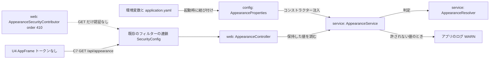

# Logical Components — U8 インスタンスの見た目の設定（u8-instance-appearance）

U8 の部品の一覧と、非機能の設計がどの部品に当たるかの見取り図です。基盤の設計（infrastructure-design）への橋渡しとして、失敗の範囲・影響の広がり・共有する資源を示す。答えは `nfr-design-questions.md`（Q1: A、Q2: A、Consolidated Summary Confirmation: Looks correct）。

出典の略号: NFR はこの単位の NFR 要件 `construction/u8-instance-appearance/nfr-requirements/` の枝番（枝番はこの単位の中で振る）、BR は `construction/u8-instance-appearance/functional-design/rules.md`、「要点 n」は `nfr-design-questions.md` の「NFR 設計の要点（案）」の番号。

## 1. 部品の一覧

置き場は新しいパッケージ `cherry.mastersmith.appearance` の3つの層だけ。`domain`・`repository` は作らない（機能設計の `functional-spec.md` の1節）。部品の名前は仮で、コード生成で決める。

| 部品（仮の名前） | 層 | 受け持つこと | 当たる非機能の設計 |
|---|---|---|---|
| `AppearanceProperties` | `config` | 2項目を文字列で受ける設定の型（`record`、`@Validated` なし） | NFR9.1 |
| `AppearanceResolver`（判定の関数）と許される値の型 | `service` | 前後の空白を除き `Locale.ROOT` で大文字・小文字を問わず比べる全域の純粋な関数。結果（値と警告の有無）を返し、例外を投げない | NFR9.2・NFR9.8 |
| `AppearanceService` | `service` | Bean の作成の時点で1回だけ判定し、警告のログを出し、変わらない `record` を持つ | NFR6.2・NFR6.3・NFR9.4 |
| `AppearanceController` と `AppearanceResponse` | `web` | `GET /api/appearance` の受け口。保持した値を2項目の DTO に写す | NFR4.5・NFR6.2 |
| `AppearanceSecurityContributor` | `web` | 差し込み口。order 410 で「GET・`/api/appearance`」の認証なしの決まりを1つ足す | NFR4.1〜NFR4.3・NFR4.7 |

判定の関数を `service` に置くのは、承認済みの機能設計が `domain` を作らないと決めているため。書き方は既存の `targetdb/domain/DatabaseProduct` にならう（要点 2）。

## 2. 部品の関係

<!-- Text fallback: 環境変数と application.yaml を起動時に config の AppearanceProperties に結び付ける。service の AppearanceService はそれをコンストラクター注入で受け、AppearanceResolver で判定し、許されない値のときはアプリのログに WARN を出す。web の AppearanceController は保持した値を読む。web の AppearanceSecurityContributor（order 410）は既存のフィルターの連鎖（SecurityConfig）に GET だけ認証なしの決まりを足す。U4 の AppFrame はトークンを付けずに C7 の GET /api/appearance を呼び、既存のフィルターの連鎖を通って AppearanceController に届く。 -->

依存の向きは web → service → config の一方向で、`common..` の外のほかの機能に依存しない。ほかの機能も `appearance..` に依存しない（`reliability-design.md` の3.1節の境界テスト）。

## 3. 失敗の範囲と影響の広がり

| 失敗 | 失敗の範囲 | 影響の広がり | 設計 |
|---|---|---|---|
| 設定の不備 | U8 の Bean の作成 | 無し（既定で起動し、警告を1件） | NFR9.1、`reliability-design.md` の2節 |
| 内部DB の接続プールが尽きた・詰め直しの一時停止 | 内部DB を使うほかの機能 | U8 には及ばない（接続を借りない） | NFR5.1・NFR5.2 |
| U8 の想定外の失敗（500） | U8 の1要求 | 画面の最初の描画は前に当てた値か既定のまま進む（U4 W3）。ほかの API には及ばない | NFR9.2 |
| U8 の公開の決まりの誤り | アプリ全体の認可 | 広がりうる（ほかのメソッド・道が公開になる）。メソッドと道を限った1つの決まりと、`security-design.md` の3節のテストで防ぐ | NFR4.1〜NFR4.3 |
| order の重なり | アプリの起動 | 起動が止まる（既存の `SecurityExtensionValidator`）。機能ごとの割り当てで防ぐ | NFR4.7 |

## 4. 共有する資源

| 資源 | U8 の使い方 |
|---|---|
| 要求のスレッド（組み込みのサーブレットのコンテナ） | ほかの API と共有する。回数の制限は設けない（NFR4.6） |
| フィルターの連鎖（`SecurityConfig` と差し込み口） | 決まりを1つ足す。order は機能ごとの割り当て（`security-design.md` の2.3節） |
| 共通のヘッダー・キャッシュの見出し（`CacheControlFilter` など） | そのまま使い、変えない（NFR4.8） |
| 共通のエラー応答（`GlobalExceptionHandler`） | 想定外の失敗と、GET 以外のメソッドの 401・405 に任せる（NFR4.2・NFR9.2） |
| 指標・トレース（Micrometer） | 既存の HTTP の指標とスパンに乗る。独自の指標は足さない（NFR6.5・NFR6.6） |
| 内部DB の接続プール | 使わない（NFR5.1・NFR5.2） |

## 5. テストとカバレッジの置き場

| 確かめ | 置き場と形 | 要件 |
|---|---|---|
| 判定の関数の性質 | `service` の単体テスト（jqwik）。性質: 任意の文字列で結果が常に許される値のどれか / 許される値の大文字・小文字と前後の空白の揺れは同じ結果 / 許される値に一致しない空でない値は既定で「警告あり」。失敗時の乱数の種を記録する | NFR9.8 |
| 起動時に1回だけ判定する | `service` の単体テスト | NFR6.2 |
| 公開の範囲・応答・ヘッダー・警告のログ・監査なし・接続を借りない | `web` の結合テスト（`XxxIT`） | NFR4.1〜NFR4.5・NFR4.8・NFR5.2・NFR9.1・NFR9.4・NFR9.5 |
| 内部DB とほかの機能に依存しない | `AppearanceBoundaryArchitectureTest` | NFR5.1 |
| カバレッジ | `appearance.config`・`appearance.service`・`appearance.web` はパッケージごとの下限（行 80%・分岐 70%）の対象。計測の除外は増やさない。`:backend:cleanTest :backend:cleanIntegrationTest` を付けた `./gradlew verify` で実測して記録する | NFR9.7 |

`SecurityRuleContributor` の説明文の書き直し（`security-design.md` の2.3節）は `common.security` の説明文だけの変更で、コードの中身は変えない。`common.security` は `backend/build.gradle.kts` の `packagesJudgedByTotal` にあるため、この変更が `team.md` の「手を入れる Bolt ではテストを足して一覧から外す」に当たるかを、書き直す Bolt の計画で依頼者に確かめる（`security-design.md` の8節）。

## 6. 上流との差

承認済みの文書は書き換えない。承認済みの設計と違う点は `security-design.md` の8節にまとめた（order を機能の名前で割り当てる決め方、u3-invitation の値 310 を U8 の段で先に決めたこと、`common.security` の説明文の書き直しの範囲とカバレッジの一覧の扱いの確かめ）。部品の構成は承認済みの機能設計と食い違わない。
