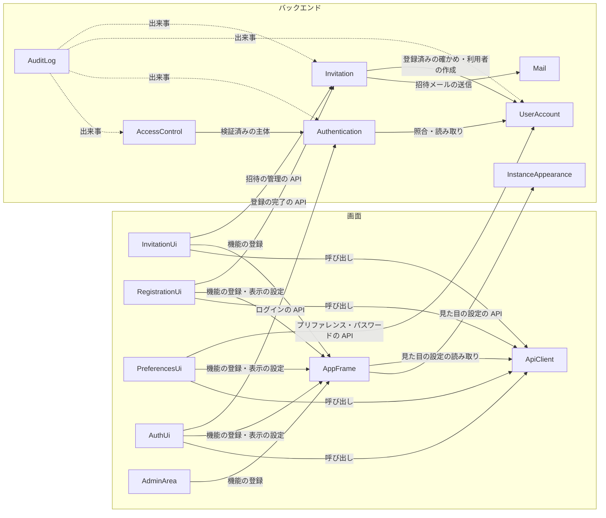

# Components — user-management

出典: 要件 `aidlc/spaces/default/intents/260925-user-management/inception/requirements-analysis/requirements.md`、ストーリー `aidlc/spaces/default/intents/260925-user-management/inception/user-stories/stories.md`、チームの進め方 `aidlc/spaces/default/intents/260925-user-management/inception/practices-discovery/team-practices.md`、既存のコード `aidlc/spaces/default/codekb/mastersmith2/architecture.md`・`component-inventory.md`、この段の答え `domain-design-questions.md`（Q1〜Q7）。決定の理由は `decisions.md`（ADR-001〜ADR-011）。

既存の部品は前の Intent の Domain Design の部品名で呼ぶ（UserAccount・Authentication・AccessControl・AuditLog・AppFrame・AuthUi・AdminArea・ApiClient）。このアプリは1つのプロセスのモジュール分けしたモノリスで、部品は Java のパッケージ（バックエンド）と画面の機能（フロントエンド）に当たる（`architecture.md`）。まとめ方（単位）は Units Generation で決める。

## Part A — 機械が読む形

```yaml
components:
  - name: Invitation
    summary: 新規。管理者の招待・送り直し・取り消しと、招待された人の登録の完了を受け持つ
    behaviour: >
      招待は利用者の表とは別に持ち、登録の完了まで利用者を作らない（FR1.3）。メールアドレスは既存の決まりで正規化し、登録済みの利用者と
      招待中（期限内・取り消していない・未完了）の招待があれば拒否する（FR1.4）。招待ごとに推測できないトークンを作り、ハッシュだけを保存し、
      1回だけ有効・作成（送り直し）から 24 時間で期限切れ（時刻ちょうどは無効）とする（FR1.5、project.md の Mandated）。招待の確定の後に、
      内部DB の接続を持たずに Mail で招待メールを送り、送信の結果を短いトランザクションで招待に記録する（FR2.3・FR2.4、ADR-009）。
      送り直しは前のトークンを無効にし新しいトークンと期限で送る。取り消しはトークンを無効にする。期限切れの招待と同じメールアドレスに新しく
      招待すると古い招待は置き換えて無効にする（AC2.2.6）。登録の完了は、リンクの確かめ・パスワードの規則・2回入力の一致・氏名を確かめ、
      UserAccount で利用者を作り、招待を使用済みにする。拒否は理由によらず同じ応答にする（FR4.1、NFR3）。同じ招待の同時の完了では利用者を
      1人だけ作る（FR4.6）。招待の URL は設定したベース URL だけから組み立てる（FR1.7）。ベース URL か SMTP の接続先が無いときは招待と
      送り直しを拒否する（FR1.8）。登録の完了の API はログインなしで呼べるよう、差し込み口（SecurityRuleContributor）で公開の決まりを
      足す（ADR-011）。招待・送り直し・取り消し・登録の完了・登録の失敗の出来事を知らせる（AuditLog が受ける）。
    responsibilities:
      - 招待の作成・送り直し・取り消し（管理者だけ）
      - 招待中の一覧（20 件ごと、招待した管理者を含む）
      - 招待のトークンの発行・確かめ・無効化
      - 登録の完了（利用者の作成の依頼と招待の使用済み）
      - 招待を使える設定か（ベース URL・SMTP）の判定
      - 招待の操作の出来事の発行
    depends_on:
      - component: UserAccount
        interaction: 招待しようとしたメールアドレスが登録済みかの確かめと、登録の完了での利用者の作成、招待した管理者の氏名の参照
        style: sync
      - component: Mail
        interaction: 招待の言語のテンプレートで招待メールを描いて送る
        style: sync
    dependents:
      - component: AuditLog
        interaction: 招待・送り直し・取り消し・登録の完了・登録の失敗の出来事を受けて記録する
      - component: InvitationUi
        interaction: 招待・一覧・送り直し・取り消しの API を呼ぶ（ApiClient を通す）
      - component: RegistrationUi
        interaction: リンクの確かめと登録の完了の API を呼ぶ（ApiClient を通す）
    external_dependencies:
      - name: 内部DB（組み込みの H2）
        kind: database
        purpose: 招待の表
    entities:
      - name: Invitation
        identifier: invitationId
        attributes: [email, language, tokenHash, invitedByUserId, invitedAt, expiresAt, sendResult, state]
        references:
          - entity: User
            owned_by: UserAccount
            relationship: 各招待は、招待した1人の管理者を指す

  - name: Mail
    summary: 新規（共通）。テンプレートを描いて HTML のメールを作り、SMTP で送る
    behaviour: >
      自前の Mustache エンジン java-mustache-processor（サブモジュール vendor/java-mustache-processor、composite build）で、言語ごとの
      テンプレートを描く。件名は描いた結果の <title> の文面とする（FR2.1）。差し込む値はエスケープされる差し込みだけで入れる
      （{{{ }}}・{{& }} を使わない、project.md の Forbidden）。宛先・件名・差し込む値の改行はヘッダーに入れない。SMTP の接続先と資格情報は
      環境変数だけから受け取り、接続先が無ければ送らない（project.md の Mandated）。接続と読み取りに時間切れを持ち、失敗は呼び出し元に
      結果として返す。例外のメッセージ・SMTP の応答・宛先のメールアドレスはログとエラー応答に出さず、mail.debug を有効にしない
      （project.md の Forbidden）。今回の利用者は Invitation だけだが、今後のメールも使う。
    responsibilities:
      - メールのテンプレートの描画（言語ごと、件名は <title>）
      - SMTP での送信と、送信の結果（成功・失敗の種類）の返却
      - SMTP の設定が有るかの判定
    depends_on: []
    dependents:
      - component: Invitation
        interaction: 招待メールを描いて送る
    external_dependencies:
      - name: java-mustache-processor
        kind: other
        purpose: テンプレートの描画（自前の部品、サブモジュール）
      - name: SMTP サーバー
        kind: third-party-api
        purpose: メールの送信（配備先が決まるまでは手元の受け手だけ）
    entities: []

  - name: InstanceAppearance
    summary: 新規。インスタンス全体の見た目の設定（ブランドカラー・フォントファミリー）をログインなしで読める形で返す
    behaviour: >
      application.yml のブランドカラー（blue・green・purple・orange）とフォントファミリー（sans・serif）を読み、無いときは blue・sans、
      許されない値のときも blue・sans にして警告のログを1回出す。起動は止めない（FR8.2）。ログインの前後を問わず画面が読めるよう、
      公開の API で返す（ADR-006）。設定値だけでアプリが独自に持つデータは無い（エンティティにしない、project.md の学び）。
    responsibilities:
      - 見た目の設定の読み取りと既定への置き換え
      - 見た目の設定を返す公開の API
    depends_on: []
    dependents:
      - component: AppFrame
        interaction: 起動時に見た目の設定を読む（ApiClient を通す）
    external_dependencies: []
    entities: []

  - name: UserAccount
    summary: 既存を広げる。利用者に氏名とプリファレンス（言語・テーマ・文字の大きさ）を足し、プリファレンスとパスワードの変更の操作を足す
    behaviour: >
      利用者の表に氏名・言語・テーマ・文字の大きさの列を Flyway の V7 以降で足し、既存の利用者には氏名＝メールアドレス・言語 ja・
      テーマ system・文字の大きさ md を入れる（NFR10、要件の前提 A3）。利用者の作成は氏名とプリファレンスを受け取れるようにし、既存の
      作成の流れ（UserCreatedEvent によるロックの状態の用意）を保つ。ログインした利用者が自分の氏名・言語・テーマ・文字の大きさを読んで
      変え（値は ja・en、light・dark・system、sm・md・lg、氏名は空にできない）、今のパスワードを確かめて新しいパスワードに変える
      （規則は今の PasswordPolicy）。パスワードを変えても発行済みのリフレッシュトークンには触れない（FR6.3）。今のパスワードの誤りは
      401 にしない。パスワードの変更の成功・失敗の出来事を知らせる（AuditLog が受ける）。プリファレンス・氏名の変更は監査しない（FR9.2）。
      プリファレンスとパスワードの変更の API はログインした利用者だけが呼べる（/api/ の下の既定のログイン必須に乗る。/api/auth/ の下には
      置かない、K-6）。
    responsibilities:
      - 利用者の管理（既存）
      - 氏名とプリファレンスの保持と読み書き（今回足す）
      - パスワードの変更（今回足す）
      - パスワードの変更の出来事の発行（今回足す）
    depends_on: []
    dependents:
      - component: Invitation
        interaction: 登録済みの確かめ・利用者の作成・招待した管理者の氏名の参照
      - component: Authentication
        interaction: ログインでの照合とトークンの認証での利用者の読み取り（既存）。応答の利用者の情報に氏名とプリファレンスを足す
      - component: AuditLog
        interaction: 操作した人を指し、パスワードの変更の出来事を受ける
      - component: PreferencesUi
        interaction: プリファレンスとパスワードの変更の API を呼ぶ（ApiClient を通す）
    external_dependencies:
      - name: 内部DB（組み込みの H2）
        kind: database
        purpose: 利用者の表（users）
    entities:
      - name: User
        identifier: userId
        attributes: [email, passwordHash, admin, displayName, language, theme, fontSize, createdAt]

  - name: Authentication
    summary: 既存を広げる。ログインとトークンの更新の応答の利用者の情報に、氏名とプリファレンスを足す
    behaviour: >
      ログイン・トークンの更新・ログアウト・トークンの認証の決まりは変えない。招待中の人は利用者の表にいないため、ログインの経路では
      存在しない利用者と同じ 401 になる（FR1.3）。画面がログインの後と読み込み直しの後に利用者の設定を当てられるよう、応答の利用者の
      情報（今は email と admin）に氏名・言語・テーマ・文字の大きさを足す。
    responsibilities:
      - ログイン・トークン・ロック・ログアウト（既存）
      - 応答の利用者の情報に氏名とプリファレンスを含める（今回足す）
    depends_on:
      - component: UserAccount
        interaction: 照合と利用者の読み取り（既存）
        style: sync
    dependents:
      - component: AuditLog
        interaction: 認証の出来事を受ける（既存）
      - component: AccessControl
        interaction: 検証済みの主体を使う（既存）
      - component: AuthUi
        interaction: ログインの API を呼ぶ（既存、ApiClient を通す）
    external_dependencies:
      - name: 内部DB（組み込みの H2）
        kind: database
        purpose: リフレッシュトークン・ロックの状態（既存）
    entities:
      - name: RefreshToken
        identifier: tokenId
        attributes: [userId, tokenHash, expiresAt, revokedAt]
        references:
          - entity: User
            owned_by: UserAccount
            relationship: 各リフレッシュトークンは1人の利用者のもの
      - name: LoginAttemptState
        identifier: userId
        attributes: [failureCount, lockedUntil]
        references:
          - entity: User
            owned_by: UserAccount
            relationship: 各ロックの状態は1人の利用者のもの

  - name: AccessControl
    summary: 既存。/api/admin/ の下を管理者だけに限る。今回は変更しない
    behaviour: >
      招待の管理の API を /api/admin/ の下に置くことで、未認証 401・管理者でない 403 と、アクセス拒否の監査がそのまま付く（CR4）。
    responsibilities:
      - 管理者だけの API の判定（既存）
    depends_on:
      - component: Authentication
        interaction: 検証済みの主体を使う（既存）
        style: sync
    dependents:
      - component: AuditLog
        interaction: アクセス拒否の出来事を受ける（既存）
    external_dependencies: []
    entities: []

  - name: AuditLog
    summary: 既存を広げる。招待の操作・登録の完了と失敗・パスワードの変更の出来事を記録する
    behaviour: >
      既存の決まり（確定の後に記録する、書き込みに失敗しても元の操作は失敗させない）に従い、出来事の種類を足す: 管理者の招待・送り直し・
      取り消し、登録の完了、登録の失敗（期限切れ・使用済み・取り消し済み・存在しない・改ざん）、パスワードの変更の成功と今のパスワードの誤り
      による失敗（FR9.1）。記録の表に対象（招待・利用者）と結果を入れる列を Flyway の移行で足す（K-7）。パスワード・招待のトークン・
      招待の URL は記録しない（CR3）。送信の失敗と、プリファレンス・氏名の変更は記録しない（FR9.2）。共通の仕組みは作らない
      （project.md の DECIDED）。
    responsibilities:
      - 招待・登録・パスワードの変更の監査の記録（今回足す）
      - 認証・アクセス拒否・DSL の操作の監査の記録（既存）
    depends_on:
      - component: Invitation
        interaction: 招待の操作と登録の出来事を受け取る
        style: event
      - component: UserAccount
        interaction: パスワードの変更の出来事を受け取り、操作した人を指す
        style: event
      - component: Authentication
        interaction: 認証の出来事を受け取る（既存）
        style: event
      - component: AccessControl
        interaction: アクセス拒否の出来事を受け取る（既存）
        style: event
    dependents: []
    external_dependencies:
      - name: 内部DB（組み込みの H2）
        kind: database
        purpose: 監査の記録（audit_events）
    entities:
      - name: AuditEvent
        identifier: eventId
        attributes: [eventType, occurredAt, actorUserId, targetUserId, targetInvitationId, result, traceId]
        references:
          - entity: User
            owned_by: UserAccount
            relationship: 各記録は、操作した人・対象の利用者を指すことがある
          - entity: Invitation
            owned_by: Invitation
            relationship: 招待の操作と登録の記録は、対象の招待を指す

  - name: InvitationUi
    summary: 新規（画面）。管理者の招待中の一覧・招待の入力・送り直し・取り消しの画面（features/invitation）
    behaviour: >
      画面 S1・S1-M1・S1-M2（mockups.md）。AppShell の中の管理者向けの画面で、サイドバーに「利用者の招待」を差し込む。20 件ごとの一覧、
      招待の入力の Modal、取り消しの確かめ、招待中の誤りから一覧の行へ移る操作、招待を使えないときの警告を持つ。
    responsibilities:
      - 招待の管理の画面
    depends_on:
      - component: Invitation
        interaction: 招待の管理の API
        style: sync
      - component: AppFrame
        interaction: 画面・サイドバーの項目・文言の機能の登録
        style: sync
      - component: ApiClient
        interaction: API の呼び出し
        style: sync
    dependents: []
    external_dependencies:
      - name: make-you-chic-ui
        kind: other
        purpose: 画面の部品（変更しない）
    entities: []

  - name: RegistrationUi
    summary: 新規（画面）。招待のリンクから開く登録の完了の画面（features/registration、ログインなし）
    behaviour: >
      画面 S2（mockups.md）。AppShell の外の単独の画面。開いた時点は招待の言語と、ブラウザに最後に保存されたテーマ・文字の大きさで表示し、
      項目を選んだ時点で画面に当てる。完了で選んだ表示の設定をブラウザにも保存し、ログインの画面へ移る。
    responsibilities:
      - 登録の完了の画面
    depends_on:
      - component: Invitation
        interaction: リンクの確かめと登録の完了の API
        style: sync
      - component: AppFrame
        interaction: 画面の機能の登録と、表示の設定の当て方
        style: sync
      - component: ApiClient
        interaction: API の呼び出し（画面の言語を Accept-Language に入れる）
        style: sync
    dependents: []
    external_dependencies:
      - name: make-you-chic-ui
        kind: other
        purpose: 画面の部品（変更しない）
    entities: []

  - name: PreferencesUi
    summary: 新規（画面）。プリファレンスとパスワードの変更の画面（features/preferences）
    behaviour: >
      画面 S4・S5（mockups.md）。ユーザーメニューに2つの項目を差し込む。テーマと文字の大きさは選んだ時点で見せ、保存しなければ戻す。
      言語は保存で切り替える。氏名を保存したらユーザーメニューの名前を変える。
    responsibilities:
      - プリファレンスの画面
      - パスワードの変更の画面
    depends_on:
      - component: UserAccount
        interaction: プリファレンスとパスワードの変更の API
        style: sync
      - component: AppFrame
        interaction: 画面・ユーザーメニューの項目の機能の登録と、表示の設定の当て方
        style: sync
      - component: ApiClient
        interaction: API の呼び出し
        style: sync
    dependents: []
    external_dependencies:
      - name: make-you-chic-ui
        kind: other
        purpose: 画面の部品（変更しない）
    entities: []

  - name: AuthUi
    summary: 既存を広げる。ログインの画面に言語の切り替え（Could）を足し、登録の完了の後の案内を出す
    behaviour: >
      画面 S3（mockups.md）。右上に言語の切り替えを置き、切り替えた言語をブラウザに保存する（Could、CR1.5）。登録の完了から移ったときは
      完了の知らせを出し、メールアドレスの欄に招待のメールアドレスを入れておく（[assumption]）。ログインの後は応答の利用者の設定を当てる。
    responsibilities:
      - ログインの画面（既存）
      - 言語の切り替えと登録の完了の後の案内（今回足す）
    depends_on:
      - component: Authentication
        interaction: ログインの API（既存）
        style: sync
      - component: AppFrame
        interaction: 画面の機能の登録と、表示の設定の当て方
        style: sync
      - component: ApiClient
        interaction: API の呼び出し
        style: sync
    dependents: []
    external_dependencies:
      - name: make-you-chic-ui
        kind: other
        purpose: 画面の部品（変更しない）
    entities: []

  - name: AppFrame
    summary: 既存を広げる。表示の設定（テーマ system・文字の大きさ・言語・インスタンスの見た目）を画面に当てる仕組みと、ユーザーメニューの氏名を足す
    behaviour: >
      起動時に InstanceAppearance の見た目の設定を読んで当てる。ログインの後は利用者の設定を当ててブラウザにも保存し、ログインの前は
      ブラウザに最後に保存された値を当てる（FR5.4・FR5.5）。テーマ system は OS の配色の設定を見て make-you-chic-ui に light・dark を渡す
      （make-you-chic-ui は変更しない）。表示の言語を切り替える口を作り、<html lang> と要求の言語を合わせて変える（K-5）。ユーザーメニューに
      氏名を出す（M7）。機能の登録の仕組み（features/<featureId>/registration.ts）は変えない。
    responsibilities:
      - 画面の骨組み（既存）
      - 表示の設定を画面に当てる仕組みとブラウザへの保存（今回足す）
      - 表示の言語の切り替えの口（今回足す）
    depends_on:
      - component: ApiClient
        interaction: 見た目の設定の読み取り
        style: sync
      - component: InstanceAppearance
        interaction: 見た目の設定の公開の API（ApiClient を通す）
        style: sync
    dependents:
      - component: InvitationUi
        interaction: 機能の登録
      - component: RegistrationUi
        interaction: 機能の登録と表示の設定
      - component: PreferencesUi
        interaction: 機能の登録と表示の設定
      - component: AuthUi
        interaction: 機能の登録と表示の設定
      - component: AdminArea
        interaction: 機能の登録（既存）
    external_dependencies:
      - name: make-you-chic-ui
        kind: other
        purpose: ThemeProvider・AppShell（変更しない）
    entities: []

  - name: AdminArea
    summary: 既存。管理者向け領域の画面。今回は変更しない
    behaviour: >
      既存の管理者向け領域。招待の管理の画面は InvitationUi が機能の登録で差し込むため、AdminArea は変えない。
    responsibilities:
      - 管理者向け領域の画面（既存）
    depends_on:
      - component: AppFrame
        interaction: 機能の登録（既存）
        style: sync
    dependents: []
    external_dependencies: []
    entities: []

  - name: ApiClient
    summary: 既存を広げる。要求の言語（Accept-Language）を画面の言語・利用者の言語に合わせる
    behaviour: >
      ログインの前は画面が表示している言語、ログインの後は利用者の言語を Accept-Language に入れて送る（CR1.2、ADR-005）。既存の呼び出し方と
      401 の後の更新の流れは変えない。
    responsibilities:
      - API の呼び出しの共通部分（既存）
      - 要求の言語の付与（今回足す）
    depends_on: []
    dependents:
      - component: InvitationUi
        interaction: API の呼び出し
      - component: RegistrationUi
        interaction: API の呼び出し
      - component: PreferencesUi
        interaction: API の呼び出し
      - component: AuthUi
        interaction: API の呼び出し
      - component: AppFrame
        interaction: 見た目の設定の読み取り
    external_dependencies: []
    entities: []
```

## Part B — 人が読む形

### Component Diagram



<!-- Text fallback: 画面では、InvitationUi が Invitation の招待の管理の API を、RegistrationUi が Invitation の登録の完了の API を、PreferencesUi が UserAccount のプリファレンスとパスワードの変更の API を、AuthUi が Authentication のログインの API を、どれも ApiClient を通して呼び、AppFrame に機能を登録して表示の設定を当ててもらう。AdminArea も AppFrame に登録する。AppFrame は ApiClient を通して InstanceAppearance の見た目の設定を読む。バックエンドでは、Invitation が UserAccount で登録済みを確かめ利用者を作り、Mail で招待メールを送る。Authentication は UserAccount で照合し、AccessControl は Authentication の検証済みの主体を使う。AuditLog は Invitation・UserAccount・Authentication・AccessControl の出来事を受けて記録する（点線は出来事）。 -->

### Component Summary

| Component | Purpose | Depends On | Dependents | Entities Owned |
|---|---|---|---|---|
| Invitation | 招待・送り直し・取り消し・登録の完了 | UserAccount・Mail | AuditLog・InvitationUi・RegistrationUi | Invitation |
| Mail | テンプレートの描画と SMTP の送信（共通） | — | Invitation | — |
| InstanceAppearance | 見た目の設定の公開の API | — | AppFrame | — |
| UserAccount | 利用者・氏名・プリファレンス・パスワードの変更 | — | Invitation・Authentication・AuditLog・PreferencesUi | User |
| Authentication | ログイン・トークン（応答に氏名とプリファレンス） | UserAccount | AuditLog・AccessControl・AuthUi | RefreshToken・LoginAttemptState |
| AccessControl | 管理者だけの API の判定（変更なし） | Authentication | AuditLog | — |
| AuditLog | 監査の記録（出来事の種類を足す） | Invitation・UserAccount・Authentication・AccessControl | — | AuditEvent |
| InvitationUi | 招待の管理の画面 | Invitation・AppFrame・ApiClient | — | — |
| RegistrationUi | 登録の完了の画面 | Invitation・AppFrame・ApiClient | — | — |
| PreferencesUi | プリファレンスとパスワードの変更の画面 | UserAccount・AppFrame・ApiClient | — | — |
| AuthUi | ログインの画面（言語の切り替えを足す） | Authentication・AppFrame・ApiClient | — | — |
| AppFrame | 画面の骨組みと表示の設定の当て方 | ApiClient・InstanceAppearance | InvitationUi・RegistrationUi・PreferencesUi・AuthUi・AdminArea | — |
| AdminArea | 管理者向け領域（変更なし） | AppFrame | — | — |
| ApiClient | API の呼び出しと要求の言語 | — | InvitationUi・RegistrationUi・PreferencesUi・AuthUi・AppFrame | — |

### Entity Ownership

| Entity | Owning Component | Identifier | Attributes | References |
|---|---|---|---|---|
| Invitation | Invitation | invitationId | email・language・tokenHash・invitedByUserId・invitedAt・expiresAt・sendResult・state | User（招待した管理者） |
| User | UserAccount | userId | email・passwordHash・admin・displayName・language・theme・fontSize・createdAt | — |
| RefreshToken | Authentication | tokenId | userId・tokenHash・expiresAt・revokedAt | User |
| LoginAttemptState | Authentication | userId | failureCount・lockedUntil | User |
| AuditEvent | AuditLog | eventId | eventType・occurredAt・actorUserId・targetUserId・targetInvitationId・result・traceId | User・Invitation |

属性の型・制約・取りうる値は Functional Design で決める。RefreshToken・LoginAttemptState・AuditEvent の既存の属性は主なものだけを書いた。

### External Dependencies

| Component | Dependency | Kind | Purpose |
|---|---|---|---|
| Invitation | 内部DB（組み込みの H2） | database | 招待の表 |
| Mail | java-mustache-processor | other | テンプレートの描画（サブモジュール、composite build） |
| Mail | SMTP サーバー | third-party-api | メールの送信（配備先が決まるまでは手元の受け手だけ） |
| UserAccount | 内部DB（組み込みの H2） | database | 利用者の表 |
| Authentication | 内部DB（組み込みの H2） | database | リフレッシュトークン・ロックの状態 |
| AuditLog | 内部DB（組み込みの H2） | database | 監査の記録 |
| InvitationUi・RegistrationUi・PreferencesUi・AuthUi・AppFrame | make-you-chic-ui | other | 画面の部品（変更しない） |

### Rationale

| Component | 別の部品にする理由 |
|---|---|
| Invitation | 招待は利用者になる前の状態と独自の期限・トークンを持ち、利用者と変わる理由が違う。利用者の表に入れないことで、ログインの3つの経路に状態の確かめを足さずに済む（ADR-001） |
| Mail | テンプレートと SMTP は招待に限らない技術の関心で、今後のメールも使う。外部の部品（java-mustache-processor）と SMTP への依存を1か所に閉じる（ADR-002） |
| InstanceAppearance | ログインなしで読める公開の API という、ほかの部品と違う公開の範囲を持つ。設定値だけで小さい（ADR-006） |
| UserAccount（広げる） | 氏名・プリファレンス・パスワードは利用者そのものの属性で、利用者と同じ理由で変わる（ADR-003・ADR-004） |
| InvitationUi・RegistrationUi・PreferencesUi | 利用者の立場（管理者・ログインなし・ログインした利用者）と画面の置き場（AppShell の中・外）が違い、アクセスの区分ごとに機能の登録を分けられる（ADR-007） |
| AppFrame（広げる） | 表示の設定はすべての画面に当たる横断の関心で、機能ではなく骨組みが持つ（ADR-007） |

**Alternatives Rejected**（詳細は `decisions.md`）:
- 招待を UserAccount の中に足す（Q1 B）: 利用者の表に状態を持つことになり、ログイン・更新・トークンの認証の3経路すべてに拒否の確かめが要る。
- メールを Invitation の中に閉じる（Q2 B）: 今後のメールで同じ仕組みを作り直すことになる。
- プリファレンスを別の部品・別の表にする（Q3 B・C）: 利用者と1対1で同じ理由で変わるため、分けると読み込みのたびに2つを合わせる手間が増える。
- 見た目の設定を配信する HTML に埋め込む（Q6 B）: 配信の仕組み（AppFrame の配信、SPA のフォールバック）に手を入れる必要がある。
- 画面を1つの機能にまとめる（Q7 B）: アクセスの区分（ADMIN・PUBLIC・LOGGED_IN）が混ざり、機能の登録を分けられない。
