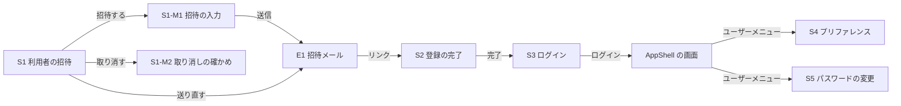

# Mockups — user-management

## 0. 前提

- 出典: ストーリー `aidlc/spaces/default/intents/260925-user-management/inception/user-stories/stories.md`（US・AC・共通の決まり CR）、要件 `aidlc/spaces/default/intents/260925-user-management/inception/requirements-analysis/requirements.md`（FR・NFR）、チームの進め方 `aidlc/spaces/default/intents/260925-user-management/inception/practices-discovery/team-practices.md`、この段の答え `refined-mockups-questions.md`（Q1〜Q7）。
- この Intent は Ideation の段を行っていないため、ラフな画面イメージと利用者の流れは無い。画面はストーリーと要件から直接作った。
- 画面は make-you-chic-ui の部品で作る（部品の対応は `design-system-mapping.md`）。幅はパソコンの幅（1024px 以上）を主な対象にし、狭い幅でも崩れずに読めて操作できるようにする（Q5: B）。
- 図の文言は日本語で示す。英語の画面は同じ配置で文言だけが変わる（CR1、NFR8）。
- 状態（読み込み中・空・成功・失敗・部分）は各画面の「状態」の表に書く。部品ごとの細かい動きは `interaction-spec.md`、アクセシビリティは `accessibility-checklist.md`。

## 1. 画面の一覧

| ID | 画面 | 置き場 | 利用者 | ストーリー |
|---|---|---|---|---|
| S1 | 利用者の招待（招待中の一覧） | AppShell の中、サイドバーの管理者向けの項目「利用者の招待」 | P1 管理者 | US2.1・US2.2 |
| S1-M1 | 招待の入力（Modal） | S1 の「招待する」から開く | P1 管理者 | US1.1 |
| S1-M2 | 取り消しの確かめ（Modal） | S1 の行の「取り消す」から開く | P1 管理者 | US2.2 |
| S2 | 登録の完了 | AppShell の外の単独の画面（ログインなし） | P2 招待された人 | US3.2 |
| S3 | ログイン（既存に言語の切り替えを足す） | AppShell の外の単独の画面 | すべて | CR1.5（Could） |
| S4 | プリファレンス | AppShell の中、ユーザーメニュー「プリファレンス」 | P3 ログインした利用者 | US4.1 |
| S5 | パスワードの変更 | AppShell の中、ユーザーメニュー「パスワードの変更」 | P3 ログインした利用者 | US5.1 |
| E1 | 招待メール | メール（HTML） | P2 招待された人 | US3.1 |

利用者の流れ:



<!-- Text fallback: 管理者は S1 利用者の招待の画面で「招待する」を押し、S1-M1 の入力で招待を送る。招待された人は E1 招待メールのリンクから S2 登録の完了の画面を開き、完了すると S3 ログインの画面へ移り、ログインすると AppShell の画面に入る。ログインした利用者はユーザーメニューから S4 プリファレンスと S5 パスワードの変更を開く。管理者は S1 から送り直し（E1 が再び送られる）と、S1-M2 の確かめを経た取り消しができる。 -->

## 2. S1 利用者の招待（招待中の一覧）

Q1: B、Q7: B、FR3.1、FR1.8、AC2.1.*、AC2.2.*、M9

```
+--------------------------------------------------------------------------+
| [AppShell トップバー]                           [氏名 v] (ユーザーメニュー) |
+-------------+------------------------------------------------------------+
| サイドバー   | 利用者の招待                              [招待する] (primary) |
|  ...        |                                                            |
|  DSL        | (招待を使えないとき) [!] 招待を使えません: メールの送り先が     |
| >利用者の招待 |     設定されていません。運用者に設定を依頼してください。         |
|             |                                                            |
|             | +--------------------------------------------------------+ |
|             | | メールアドレス | 言語 | 招待した管理者 | 招待した日時 |     | |
|             | |              |      |              | 有効期限 | 送信 | 操作 | |
|             | |--------------------------------------------------------| |
|             | | a@example.test | 日本語 | 管理 太郎 | 09/25 21:00 |      | |
|             | |   有効期限 09/26 21:00  送信済み      [送り直す][取り消す] | |
|             | | b@example.test | English | admin@...  | 09/25 20:10 |      | |
|             | |   [!]送信の失敗                       [送り直す][取り消す] | |
|             | | c@example.test | 日本語 | 管理 太郎 | 09/23 10:00 |      | |
|             | |   [時計]期限切れ                      [送り直す][取り消す] | |
|             | +--------------------------------------------------------+ |
|             |   21〜40 件目 / 全 43 件      [< 前へ] 2 / 3 [次へ >]        |
+-------------+------------------------------------------------------------+
```

- 列: メールアドレス・言語（「日本語」「English」）・招待した管理者（氏名、無ければメールアドレス。M9）・招待した日時・有効期限・送信の結果（送信済み・送信の失敗）・状態（期限切れの印）・操作（送り直す・取り消す）。
- 並びは招待した日時の新しい順、20 件ごとにページ送り（Q7: B）。ページ送りは件数の範囲と全件数を文字で示す。
- 送信の結果と期限切れは、記号だけでなく文字で示す（CR6.5）。
- 招待を使えないとき（ベース URL か SMTP の接続先が無い、FR1.8）は、画面の上に警告の表示を出し、「招待する」と「送り直す」を押せなくする。押せない理由は警告の文で読み上げられる。警告の文は、足りない設定ごとに分ける（AC1.1.6）。
  - SMTP の接続先が無い: 「招待を使えません: メールの送り先が設定されていません。運用者に設定を依頼してください。」
  - ベース URL が無い: 「招待を使えません: 招待のリンクに使うアプリの URL が設定されていません。運用者に設定を依頼してください。」
  - 両方が無い: 2つの理由を並べて示す
  - 最終の文言は機能設計で決める。

| 状態 | 表示 |
|---|---|
| 読み込み中 | 表の位置に読み込み中の表示（文字つき） |
| 空 | 「招待中の人はいません。『招待する』から招待できます。」（AC2.1.4） |
| 成功 | 上の図 |
| 失敗（一覧を取れない） | 画面の中に `role="alert"` の失敗の表示と「もう一度読み込む」 |
| 部分 | 長いメールアドレスは折り返す。1件だけでも表の形のまま |
| 送り直し・取り消しの結果 | 成功は Toast、失敗（見つからない・送信の失敗など）は表の上に `role="alert"` で残す（CR6.4） |

## 3. S1-M1 招待の入力（Modal）

Q1: B、FR1.1〜FR1.4、AC1.1.*

```
+-------------------------------------------+
| 利用者を招待する                      [x]  |
|-------------------------------------------|
| メールアドレス（必須）                     |
| [__________________________________]      |
|  (誤り) 形式が正しくありません             |
|                                           |
| 招待メールの言語                           |
| (o) 日本語   ( ) English                   |
|   初期値は自分の言語                        |
|                                           |
|              [やめる]  [招待する](primary) |
+-------------------------------------------+
```

- 言語の初期値は、操作する管理者自身の言語（AC1.1.1）。選択肢はそれぞれの言語の名前で示す（CR6.6）。
- 「招待する」を押すと、送信が終わるまでボタンを押せなくし「送信しています」と表示する（CR6.3、AC1.1.9）。
- 成功: Modal を閉じ、Toast「招待を送りました」、一覧に1行増える。
- 送信の失敗（招待は作られる、AC1.1.5）: Modal を閉じ、一覧の上に `role="alert"` で「招待は作りましたが、メールを送れませんでした。一覧から送り直せます。」を残し、行に送信の失敗が表示される。
- 入力の誤り・登録済み・招待中（AC1.1.3・AC1.1.4）: Modal を閉じずに、項目の下に誤りを出してフォーカスを移す。招待中のときは「すでに招待中です。一覧から送り直してください。」に続けて「一覧でこの招待を見る」のリンクを出す。押すと Modal を閉じ、一覧をその招待の行が載っているページへ移し、その行を目立たせて行の「送り直す」ボタンにフォーカスを置く（AC1.1.4。一覧は 20 件ごとのページ送りのため、行のページへ移す）。
- Modal は背景のクリックで閉じない（入れた値を失わないため）。Esc と「やめる」で閉じる。

## 4. S1-M2 取り消しの確かめ（Modal）

CR6.7、AC2.2.11

```
+-------------------------------------------+
| 招待を取り消しますか                   [x] |
|-------------------------------------------|
| b@example.test への招待を取り消します。    |
| 取り消すと、招待メールのリンクは使えなく   |
| なります。                                 |
|                                           |
|             [やめる](初期フォーカス) [取り消す] |
+-------------------------------------------+
```

- 背景のクリックで閉じず、はじめのフォーカスは「やめる」。Esc で閉じ、閉じたら元の「取り消す」ボタンにフォーカスを戻す。

## 5. S2 登録の完了（ログインなし、単独の画面）

FR4.1〜FR4.7、AC3.2.*、Q3: A、Q4: C、Q6: B、M4

```
+----------------------------------------------------+
|                    MasterSmith                     |
|                  登録を完了する                     |
|  メールアドレス（ログインに使います）               |
|  [a@example.test] (変えられない値)                  |
|                                                    |
|  氏名（必須）                                       |
|  [a@example.test_____________________]              |
|   そのままでも登録できます                           |
|                                                    |
|  パスワード（必須）  12 文字以上                     |
|  [______________________]                          |
|  パスワード（確かめ）                                |
|  [______________________]                          |
|                                                    |
|  表示の設定                                         |
|  言語         (o) 日本語  ( ) English               |
|    選ぶとこの画面の言語が切り替わります             |
|  テーマ       (o) OS に合わせる ( ) ライト ( ) ダーク |
|  文字の大きさ ( ) 小  (o) 標準  ( ) 大              |
|    テーマと文字の大きさは選ぶと画面に反映されます   |
|                                                    |
|                         [登録を完了する](primary)   |
+----------------------------------------------------+
```

- 開いた時点は、言語は招待の言語で表示し、テーマと文字の大きさはブラウザに最後に保存された値で表示する（FR4.3）。フォームの初期値は、氏名がメールアドレス・言語が招待の言語・テーマが「OS に合わせる」（system）・文字の大きさが「標準」（md）（FR4.2）。
- ログインに使うメールアドレスは、変えられない値として表示する。欄は `autocomplete="username"` を持ち、パスワードの管理の道具がメールアドレスとパスワードを組で保存できるようにする（AC3.2.16）。
- 表示とフォームの初期値が食い違いうる点（ストーリーの段で残った異論）は、テーマと文字の大きさについて起きる（言語は表示もフォームの初期値も招待の言語で一致する）。テーマと文字の大きさの項目の下に「テーマと文字の大きさは選ぶと画面に反映されます」と示し、選んだ時点で画面に見せることで扱う（Q3: A）。
- 言語は別の理由で選んだ時点で切り替える。ログインの前の画面の言語の切り替えをこの画面に置かないため、フォームの「言語」の項目を選ぶとこの画面の言語も切り替わる（Q4: C）。項目の下に「選ぶとこの画面の言語が切り替わります」と示す。
- パスワードの入力の前の案内は「12 文字以上」だけ。72 バイトを超えたときだけ「長すぎます（半角で 72 文字、全角でおよそ 24 文字まで）」と項目の下に出す（Q6: B）。
- 完了すると、選んだ言語・テーマ・文字の大きさをブラウザにも保存し（M4）、S3 ログインの画面へ移り「登録が完了しました。設定したパスワードでログインしてください。」を表示する（FR4.7）。ログインの画面のメールアドレスの欄には招待のメールアドレスを入れておく [assumption]（P2 の目的「どのメールアドレスでログインすればよいか分かる」のため）。
- 言語の切り替え（CR1.5）はこの画面に置かない（Q4: C）。

| 状態 | 表示 |
|---|---|
| 読み込み中（リンクの確かめ） | 画面の中央に読み込み中の表示（文字つき） |
| リンクが使えない（期限切れ・使用済み・取り消し・存在しない・改ざん） | どの理由でも同じ表示: 「このリンクは使えません。招待した管理者に招待の送り直しを依頼してください。」フォームは出さない（AC3.2.2、NFR3） |
| 入力の誤り | 項目の下に誤りを出し、最初の誤りの項目にフォーカス。入れた値（パスワードを含む）は消さない（CR6.1） |
| 送信中 | 「登録を完了する」を押せなくし「登録しています」と表示（CR6.3） |
| 完了の時点で使えない（期限が切れた・同時に完了された・同じメールアドレスの利用者がいる） | リンクが使えないときと同じ表示（AC3.2.11） |

## 6. S3 ログイン（言語の切り替えを足す）

CR1.5（Could）、Q4: C、FR5.5

```
+----------------------------------------------------+
|                               [日本語 | English]    |
|                    MasterSmith                     |
|                     ログイン                        |
|  メールアドレス  [__________________________]       |
|  パスワード      [__________________________]       |
|                              [ログイン](primary)    |
+----------------------------------------------------+
```

- 右上に言語の切り替えを置く（Could）。切り替えると画面の言語が変わり、ブラウザに保存する（次にログインの画面を開いたときもその言語）。エラーの言語も画面の言語にそろえる（CR1.2）。
- テーマと文字の大きさは、ブラウザに最後に保存された値で表示する（FR5.5）。

## 7. S4 プリファレンス

Q2: B、FR5.1〜FR5.4、AC4.1.*、M7、M8

```
+-------------+------------------------------------------------------------+
| サイドバー   | プリファレンス                                             |
|             |                                                            |
|             | 氏名（必須）                                                |
|             | [管理 太郎___________________]                             |
|             |                                                            |
|             | 言語          (o) 日本語  ( ) English                       |
|             |   保存すると切り替わります                                   |
|             | テーマ        ( ) OS に合わせる (o) ライト ( ) ダーク         |
|             | 文字の大きさ  ( ) 小  (o) 標準  ( ) 大                      |
|             |   テーマと文字の大きさは選ぶと画面に反映されます              |
|             |                                                            |
|             |                          [元に戻す] [保存する](primary)     |
+-------------+------------------------------------------------------------+
```

- テーマと文字の大きさは選んだ時点で画面に見せ、保存しないで画面を離れる・「元に戻す」を押すと元に戻す。言語は保存した時点で切り替える（M8）。
- 保存すると Toast「保存しました」。氏名を変えたらトップバーのユーザーメニューの名前がすぐ変わる（M7）。
- 保存していない変更がある状態で画面を離れるときの確かめは設けない（テーマ・文字の大きさは元に戻す）[assumption]。

| 状態 | 表示 |
|---|---|
| 読み込み中 | フォームの位置に読み込み中の表示 |
| 失敗（読み込めない・保存できない） | 画面の中に `role="alert"`、入れた値は残す |
| 入力の誤り（空の氏名など） | 項目の下に誤り、フォーカス移動（CR6.1） |

## 8. S5 パスワードの変更

Q2: B、FR6.1〜FR6.3、AC5.1.*、Q6: B

```
+-------------+------------------------------------------------------------+
| サイドバー   | パスワードの変更                                           |
|             | 今のパスワード（必須）                                       |
|             | [______________________]                                   |
|             | 新しいパスワード（必須）  12 文字以上                         |
|             | [______________________]                                   |
|             | 新しいパスワード（確かめ）                                    |
|             | [______________________]                                   |
|             |                              [変更する](primary)            |
+-------------+------------------------------------------------------------+
```

- 成功: Toast「パスワードを変更しました」、3つの項目を空にする。ログインしたまま（ほかの端末もそのまま、FR6.3）。
- 今のパスワードの誤り: 今のパスワードの項目に結び付けて誤りを出し、新しいパスワードの2つの値は消さない（AC5.1.7）。

## 9. E1 招待メール（HTML）

FR2.1・FR2.2、AC3.1.*、M1: C、M5: A

```
件名: MasterSmith への招待（<title> の文面）
------------------------------------------------
MasterSmith への招待

MasterSmith の利用者として招待されました。
次のボタンから、パスワードと表示の設定を決めて
登録を完了してください。

        [ 登録を完了する ]   (招待のリンク)

このリンクは 24 時間有効です。
ボタンが使えないときは、次の URL をブラウザに貼り付けてください。
https://<設定したベース URL>/...

心当たりが無い場合は、このメールを破棄してください。
------------------------------------------------
```

- 件名はテンプレートの `<title>` の文面（FR2.1）。有効期限の日時は書かず「このリンクは 24 時間有効です」とだけ書く（M1: C）。招待した管理者の氏名は載せない（M5: A）。
- 英語のテンプレートは同じ構成で文言だけが変わる。
- 差し込む値（リンクの URL など）はエスケープされる差し込みだけで入れる（`project.md` の Forbidden）。差し込む値の一覧は機能設計で決める。
- 文言の最終版は機能設計でテンプレートとして決める。上は構成の案。

## 10. 要件との差

- **AC1.1.8 との差（レビューの指摘 R-01、依頼者の決定）**: ストーリーの AC1.1.8 は、招待が成功した後もフォームが開いたまま（メールアドレスの項目が空に戻り、言語はそのまま、フォーカスはメールアドレスの項目へ）を前提にしている。この段では、Q1 B（入力は Modal）に合わせて、成功したら Modal を閉じて Toast で知らせ、一覧に1行加える形にした。承認済みのストーリーは書き換えず、差をここに記録する。続けて招待するときは、もう一度「招待する」を押す。
- S2 の「ログインの画面のメールアドレスの欄に招待のメールアドレスを入れておく」と、S4 の「保存していない変更の確かめを設けない」は、要件・ストーリーに無い画面の細部で、[assumption] とした。承認の場で確かめる。
