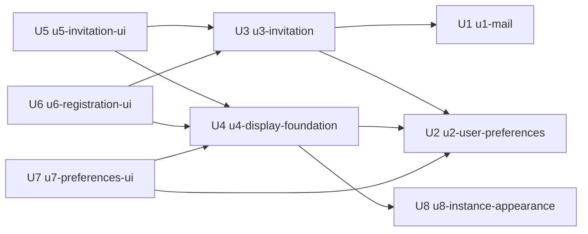

# Unit of Work Dependency — user-management

単位は `unit-of-work.md`。この文書は依存の形（どれがどれに依存するか）だけを示し、作る順は決めない（順は Delivery Planning）。部品の依存は `aidlc/spaces/default/intents/260925-user-management/inception/domain-design/components.md`。

## 依存の図



<!-- Text fallback: 矢印は「左が右に依存する」を示す。U3 は U1 と U2 に依存する。U4 は U2 と U8 に依存する。U5 と U6 は U3 と U4 に依存する。U7 は U2 と U4 に依存する。U1・U2・U8 は何にも依存しない。循環は無い。 -->

## 依存の一覧

| 単位 | 依存先 | 理由 |
|---|---|---|
| U1 | — | 共通の部品で、ほかの単位を使わない |
| U2 | — | 既存の部品を広げるだけで、新しい単位を使わない |
| U3 | U1 | 招待メールを描いて送る |
| U3 | U2 | 登録の完了で、氏名とプリファレンスを受け取る利用者の作成を使う。監査の対象・結果の列は U2 で足す |
| U4 | U2 | ログインの応答の氏名とプリファレンスを画面に当てる |
| U4 | U8 | 起動時に見た目の設定を読んで当てる |
| U8 | — | 設定を読んで返すだけで、ほかの単位を使わない |
| U5 | U3 | 招待の管理の API |
| U5 | U4 | 表示の設定と要求の言語 |
| U6 | U3 | リンクの確かめと登録の完了の API |
| U6 | U4 | 表示の設定を当てる仕組みとブラウザへの保存 |
| U7 | U2 | プリファレンスとパスワードの変更の API |
| U7 | U4 | 表示の設定とユーザーメニューの氏名 |

## 単位の間のつなぎ目

| つなぎ目 | 形 | 内容 |
|---|---|---|
| U3 → U1 | アプリの中の呼び出し | テンプレートの識別・言語・差し込む値・宛先を渡し、送信の結果（成功・失敗の種類）を受け取る |
| U3 → U2 | アプリの中の呼び出し | メールアドレスが登録済みかの確かめ、氏名とプリファレンスを付けた利用者の作成、招待した管理者の氏名の参照 |
| U2・U3 → AuditLog | アプリの中の出来事 | 確定の後に監査の出来事を知らせる（既存の決まり） |
| U4 → U2 | HTTP（既存のログインと更新の応答） | 応答の利用者の情報（氏名・言語・テーマ・文字の大きさ） |
| U4 → U8 | HTTP（公開） | 見た目の設定（ブランドカラー・フォントファミリー） |
| U5・U6 → U3 | HTTP | 招待の管理の API（`/api/admin/` の下）と、登録の完了の API（公開） |
| U7 → U2 | HTTP | プリファレンスとパスワードの変更の API（ログイン必須） |
| U5・U6・U7 → U4 | 画面の中の呼び出し | 機能の登録、表示の設定を当てる口、要求の言語 |

具体の形（API の要求と応答、出来事の項目）は Contract Design で決める。

## 並行して作れる組

依存の図の上では、次の組は互いに依存せず並行して作れる（Q3: A のとおり、作るのは1つずつとし、ここには可能であることだけを記録する）。

- U1・U2・U8
- U3 と U4（U3 は U1・U2 の後、U4 は U2・U8 の後）
- U5・U6・U7（U5・U6 は U3 と U4 の後、U7 は U2 と U4 の後）

## 機械が読む形

```yaml
units:
  - name: u1-mail
    kind: library
    depends_on: []
  - name: u2-user-preferences
    kind: service
    depends_on: []
  - name: u3-invitation
    kind: service
    depends_on: [u1-mail, u2-user-preferences]
  - name: u4-display-foundation
    kind: ui
    depends_on: [u2-user-preferences, u8-instance-appearance]
  - name: u5-invitation-ui
    kind: ui
    depends_on: [u3-invitation, u4-display-foundation]
  - name: u6-registration-ui
    kind: ui
    depends_on: [u3-invitation, u4-display-foundation]
  - name: u7-preferences-ui
    kind: ui
    depends_on: [u2-user-preferences, u4-display-foundation]
  - name: u8-instance-appearance
    kind: service
    depends_on: []
```
