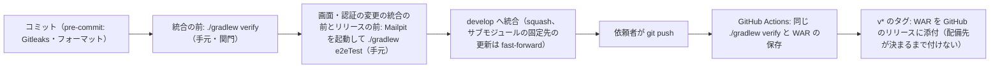

# CI の構成（ci-config）

Intent `260930-user-admin`（U1〜U5、Bolt B1〜B5）の CI の記録です。すでにリポジトリにある `.github/workflows/ci.yml` と、CI が呼ぶ `./gradlew verify` の中身を記録します（`project.md` の Deployment「CI の仕組みが既に実装されている段では、既にあるものの記録として書く」）。この段では CI の定義を変えていません。

- 作成日：2026-10-03
- 対象のファイル：`.github/workflows/ci.yml`（ワークフローの名前 `CI`）、`.github/dependabot.yml`、`build.gradle.kts`・`backend/build.gradle.kts`、`.gitleaks.toml`
- 段ごとの合否の基準と、Build and Test の検査との対応：`quality-gates.md`
- 依頼者の決定：`ci-pipeline-questions.md` の Consolidated Summary Confirmation（Looks correct）。新しく決める論点が無いため、質問は作っていません

## 1. この Intent での CI に関わる変更

| ファイル | 変更 | コミット |
|---|---|---|
| `.github/workflows/ci.yml` | **変えていない**（`git log -- .github/` の最後は前の Intent までのコミット） | — |
| `.github/dependabot.yml` | **変えていない** | — |
| `.gitleaks.toml` | 監査ログのレビューの記録のフォルダの識別子（16桁の16進数）の誤検知を除外した。対象を「`aidlc/spaces/<space>/intents/<intent>/audit/` の `.md`」かつ「検出された値が `<単位> > <16桁の16進数>` の形」の両方に当たるものに絞った（`team.md` の Code Style「パスと値の形の両方で絞る」） | `f299400`（B1 の前） |
| `gradle/libs.versions.toml`・`backend/gradle.lockfile` | Jackson の上書きを 3.1.6 から 3.1.7 に上げた（重大度 High 4 件。`osvScan` の関門に当たるため。`project.md` の Tech Stack） | `f299400`（同上） |
| `backend/build.gradle.kts`（`./gradlew verify` の中身） | 全体の合計で判定する既存のパッケージの一覧 `packagesJudgedByTotal` を 12 から 7 に減らした（2節） | `ded2653`（B1）・`4bd600d`（B4） |
| `frontend/.npmrc` | `ignore-scripts=true` を足した（`team.md` の Code Style。CI の `npm ci` にも効く） | `17af97d`（B5） |
| `vendor/make-you-chic-ui`（サブモジュールの固定先） | `077f5b4` から `3d9521a` へ上げた（専用のコミット）。CI は `submodules: true` で固定先を取得する | `364e9d6`（B5） |

CI は同じ `./gradlew verify` を呼ぶため、中身の変更はそのまま CI にも効きます。YAML を変える必要はありませんでした。

## 2. この Intent で `verify` に増えた中身

### 2.1 パッケージごとのカバレッジの下限の対象

`backend/build.gradle.kts` の `packagesJudgedByTotal`（パッケージごとの下限を当てず、全体の合計で判定する既存のパッケージ）から、手を入れたパッケージを外し、パッケージごとの下限（行 80%・分岐 70%）の対象に戻しました（`team.md` の Testing Posture）。

| Bolt | 一覧から外したパッケージ | 外した後の一覧の数 |
|---|---|---|
| Intent の始め | — | 12 |
| B1（`ded2653`） | `auth.domain`・`auth.repository`・`access.domain` | 9 |
| B4（`4bd600d`） | `common.error.web`・`common.observability` | **7** |

- 今の一覧（7）：`access.service`・`audit.repository`・`common.error.domain`・`common.error.service`・`common.health`・`common.i18n.domain`・`common.web`（いずれも `cherry.mastersmith.` の下）。
- 一覧を増やした変更と、計測の除外を増やした変更はありません。
- 外した5つのパッケージの値は、どれも下限を満たしています（`build-and-test/test-results.md` の 2.1）。
- 新しく作ったパッケージ（`useradmin.web`・`useradmin.service`・`useradmin.domain`・`common.paging`・`common.persistence`・`invitation.lock`）は、一覧に入らないため自動でパッケージごとの下限の対象です。

### 2.2 Gitleaks の除外

1節の `f299400` のとおりです。`gitleaksScan`（`verify` の 8 の段）は履歴全体を調べるため、除外を足す前のコミットを CI で流し直しても失敗のままです（6節）。

### 2.3 そのほかの検査の中身

`verify` の段の並びと失敗の条件は、前の Intent（`260925-user-management`）の記録から変わっていません。この Intent の新しいテスト（停止の3つの入口、管理の API の 401／403／200、最後の管理者の保護の同時性、上限切れの漏えい、E2E 以外の画面のテストなど）は、既存の 5・6 の段にそのまま入ります。数は `quality-gates.md` の 1節にあります。

## 3. CI の位置づけ

- CI は**統合の後の再確認**として動きます（`team.md` の Way of Working・Deployment）。統合を止める関門ではありません。
- 統合の前の関門は、手元で実行する `./gradlew verify` です。E2E（Mailpit を起動した `./gradlew e2eTest`）は、画面・認証に関わる変更の統合の前とリリースの前に手元で流します。この Intent では、B1・B2・B4・B5 の統合の前の関門で流しました（B3 は E2E の条件に当たらず流していない）。
- プルリクエストは使いません。`origin` への `git push` は依頼者が行い、AI はプッシュしません。
- CI が失敗したら、次に進む前に `team.md` の Testing Posture の「不安定なテストと CI の失敗」の決まりで扱います。

<!-- Text fallback: コミットの直前に pre-commit が動く。統合の前に手元で ./gradlew verify を流し、画面・認証の変更の統合の前とリリースの前には Mailpit を起動して ./gradlew e2eTest も流す。通ったら develop へ統合する（squash。サブモジュールの固定先の更新は fast-forward）。依頼者がプッシュすると GitHub Actions が同じ ./gradlew verify を実行して WAR を保存する。v* のタグでは WAR をリリースに添付するが、配備先が決まるまでタグは付けない。 -->

## 4. きっかけ・段の並び・権限・固定している版

`ci.yml` を変えていないため、前の Intent の記録から変わっていません。読み直した値を書きます。

| 項目 | 値 |
|---|---|
| きっかけ | `push`（ブランチ `develop`・タグ `v*`）、`workflow_dispatch` |
| 権限 | `contents: read`（ジョブ `release` だけ `contents: write`） |
| 重なりの制御 | `concurrency: ci-${{ github.ref }}`・`cancel-in-progress: false` |
| ランナー | `ubuntu-latest`。ジョブ `verify` は `timeout-minutes: 60`、`release` は 10 |
| 秘密情報 | 使わない（`release` の `GH_TOKEN` は Actions の `github.token`） |

ジョブ `verify`（名前 `./gradlew verify`）の段の並びは次のとおりです。

| 順 | 段 | 中身 |
|---|---|---|
| 1 | リポジトリとサブモジュールを取得する | `submodules: true`（2つのサブモジュールを固定先のコミットで取得）、`fetch-depth: 0`（Gitleaks が履歴全体を調べるため） |
| 2 | JDK 25（Temurin）を入れる | `distribution: temurin`・`java-version: "25"` |
| 3 | Node.js 24 を入れる | `cache: npm`（`frontend/package-lock.json`・`vendor/make-you-chic-ui/package-lock.json`） |
| 4 | Gradle を用意する | キャッシュを使う |
| 5 | Gitleaks と OSV-Scanner を入れる | 版と SHA-256 を照合し、合わなければ失敗 |
| 6 | 1コマンドの検査を実行する | `./gradlew verify`（0〜9 の段。`quality-gates.md` の 2節） |
| 7 | WAR を成果物として保存する | 5節 |

固定している版は次のとおりです。

| 対象 | 版 | 固定のしかた |
|---|---|---|
| `actions/checkout` | v7.0.1 | コミットのハッシュ `3d3c42e5aac5ba805825da76410c181273ba90b1` |
| `actions/setup-java` | v6.0.1 | `de7274f081f381c8f8158605e0321c36c376e2e6` |
| `actions/setup-node` | v7.0.0 | `820762786026740c76f36085b0efc47a31fe5020` |
| `gradle/actions/setup-gradle` | v6.3.0 | `9c971963bec38e04b3d30dcc455b5382be2fdbfb` |
| `actions/upload-artifact` | v7.0.1 | `043fb46d1a93c77aae656e7c1c64a875d1fc6a0a` |
| `actions/download-artifact` | v8.0.1 | `3e5f45b2cfb9172054b4087a40e8e0b5a5461e7c` |
| Gitleaks | 8.30.1（`linux_x64`） | SHA-256 `551f6fc83ea457d62a0d98237cbad105af8d557003051f41f3e7ca7b3f2470eb` |
| OSV-Scanner | 2.6.0（`linux_amd64`） | SHA-256 `ca69b3d3cd08f889a49dc0a383122f71cc528b83803671df5fd874d97485b108` |
| JDK | Temurin 25 | `setup-java` の `java-version` |
| Node.js | 24 | `setup-node` の `node-version` |
| npm・Gradle の依存 | lockfile どおり | `frontend/package-lock.json`・`backend/gradle.lockfile`（`project.md` の Mandated） |

## 5. 成果物とリリース

- ジョブ `verify` は、`backend/build/libs/mastersmith.war` を成果物 `mastersmith-<コミットのハッシュ>` として保存します（30 日、`if-no-files-found: error`）。
- `v*` のタグでは、ジョブ `release` が同じ WAR を GitHub のリリースに添付します。配備先が決まるまで `main` にタグは付けません（`team.md` の Deployment）。この Intent の CI ではどれも `skipped` でした。
- 成果物の版はコミットのハッシュで識別します。

## 6. CI の実行の結果（`gh run list`・`gh run view` で読んだもの）

### 6.1 B1〜B5 の統合の後と、承認の後の push

依頼者は Bolt の統合と記録を一緒に push しているため、CI のきっかけになったのは各 push の先頭のコミット（多くは記録のコミット）です。その CI が、同じ push に含まれる Bolt のコードのコミットを確かめています（対応は `git log <前の push>..<この push>` で確かめた）。

| push の先頭 | 中に含まれる主なコミット | run | 結果 | 作成〜終わり（UTC） | 時間 |
|---|---|---|---|---|---|
| `726c5ac`（B1 の記録） | `f299400`（Jackson・Gitleaks の除外）、`ded2653`（B1 U1 の squash）、NFR Requirements の承認〜B1 の計画の承認の記録 | 36972782269 | success | 2026-10-02T06:16:42Z〜06:28:31Z | 11 分 49 秒 |
| `0402a53`（B2 の記録） | `9b42c2d`（B2 U2）・`1de9ef6`（B2 U4）の単位ごとの squash | 37007594106 | success | 2026-10-02T12:35:28Z〜12:48:31Z | 13 分 3 秒 |
| `493b4dc`（U3 の計画の承認） | U3 の計画と承認の記録だけ（`aidlc/` の下） | 37010663674 | success | 2026-10-02T13:05:07Z〜13:17:28Z | 12 分 21 秒 |
| `c13e817`（B3 の記録） | `f6bf385`（B3 U3 前半の squash） | 37015756225 | success | 2026-10-02T13:51:00Z〜14:00:21Z | 9 分 21 秒 |
| `21a2fdd`（B4 の完了の記録） | `4bd600d`（B4 U3 後半の squash）・`589e6cd` | 37036697597 | success | 2026-10-02T16:50:51Z〜17:03:20Z | 12 分 29 秒 |
| `335aba6`（B5 の統合の記録） | `17af97d`〜`afd69c3`（B5 の fast-forward。`364e9d6` の make-you-chic-ui の固定先の更新を含む） | 37080444724 | success | 2026-10-03T00:04:01Z〜00:16:13Z | 12 分 12 秒 |
| `7689ade`（Code Generation の承認） | `f82f186`・`b126bdc`（U3 の監査の組み立ての失敗のログの直し）・`7689ade` | 37106195579 | success | 2026-10-03T07:23:38Z〜07:38:52Z | 15 分 14 秒 |

- どの run も 1回目（attempt 1）で success でした。ジョブ `./gradlew verify` は success、ジョブ `リリースに WAR を添付する` は skipped（タグでないため）です。
- 時間は 9〜15 分で、U3 の計画 4.6 の許容（CI は 30 分以内）に入っています。ジョブの上限（60 分）にも余裕があります。
- run 37106195579 では、B4 の1回目の関門で落ちた `MailConfigurationIT` も落ちていません（`build-and-test/test-results.md` の 6節）。
- Build and Test の記録（`86c5918`・`d12bca2`）とこの段の記録は、2026-10-03 の時点でまだ push されていません（`origin/develop` は `7689ade`）。どれも `aidlc/` の下だけの変更です。

### 6.2 この Intent の途中の CI の失敗（既知の失敗、解消済み）

| push の先頭 | run | 結果 | 作成の日時（UTC） | 試した回数 |
|---|---|---|---|---|
| `3c800d3` | 36745945313 | failure | 2026-09-30T16:40:40Z | 4（最後の試し 2026-10-01T16:01Z〜16:09Z） |
| `eb7c982` | 36852536626 | failure | 2026-10-01T10:59:29Z | 3（最後の試し 2026-10-01T13:54Z〜14:03Z） |
| `7f3de43`（NFR Requirements の記録） | 36864851188 | failure | 2026-10-01T12:53:40Z | 6（最後の試し 2026-10-02T12:24Z〜12:35Z） |

- 原因：`verify` の 8 の段の `gitleaksScan` が `leaks found: 1` で失敗しました（run 36864851188 のログで確かめた。`Execution failed for task ':gitleaksScan'`）。検出されたのは、監査ログ（`aidlc/.../audit/` の `.md`）に道具が書くレビューの記録のフォルダの識別子（16桁の16進数）で、秘密情報ではありません（`generic-api-key` の誤検知）。
- 直し：B1 の前に `f299400` で `.gitleaks.toml` に除外を足しました（1節）。その後の push の CI はすべて success です（6.1）。
- 3つの run は、除外の無い設定と、誤検知を含む履歴のコミットを確かめるため、流し直しても失敗のままです。run の結果は書き換えられないため、既知の失敗として記録します。
- `team.md` の「CI が失敗したら次の Bolt に進む前に扱う」に対しては、B1 の統合（`ded2653`）の前に原因を直しており、Bolt の進行との差はありません。

## 7. 依存関係の更新（`.github/dependabot.yml`）

この Intent では変えていません。

| 対象 | 置き場 | 間隔 | 見送る更新（`ignore`） |
|---|---|---|---|
| gradle | `/`（`exclude-paths: vendor/**`） | 週1 | opentelemetry-logback-appender・networknt json-schema-validator・Jackson の BOM（理由と外す時期はファイルのコメント） |
| npm | `/frontend` | 週1 | typescript の大きな版 |
| github-actions | `/` | 週1 | — |
| docker | `/` | 週1 | eclipse-temurin の大きな版 |
| docker-compose | `/` | 週1 | — |

- 開いたままの Dependabot のプルリクエストは 0 件です（`gh pr list`、2026-10-03）。
- 最後の Dependabot の実行（2026-09-29）はすべて success です。
- Dependabot alerts は使っていません。脆弱性の関門は `osvScan` だけです（`quality-gates.md` の 3節）。

## Sources

- `.github/workflows/ci.yml`・`.github/dependabot.yml`・`.gitleaks.toml`・`build.gradle.kts`・`backend/build.gradle.kts`・`frontend/.npmrc`（読み取り）
- `git log`・`git show --stat f299400`・`git diff --stat ded2653~1 7689ade`・`git rev-parse origin/develop`（読み取り）
- GitHub Actions の run（`gh run list --workflow CI --branch develop`、`gh run view` の attempt・jobs、run 36864851188 の `--log-failed`）、`gh pr list`
- `construction/ci-pipeline/ci-pipeline-questions.md`（まとめの確認）
- `construction/build-and-test/test-results.md`（2節・4節・6節）・`build-and-test-summary.md`・`build-instructions.md`
- `construction/code-generation/gate-decisions.md`
- 各単位の `code-summary.md`（`construction/u1-user-suspension/` 〜 `construction/u5-user-admin-ui/` の `code-generation/`）
- `aidlc/spaces/default/memory/team.md`（Way of Working・Testing Posture・Code Style・Deployment）・`project.md`（Deployment・Tech Stack）
- `aidlc/spaces/default/intents/260925-user-management/construction/ci-pipeline/ci-config.md`（形の手本）

## Assumptions & Open Questions

- 6.1 の「作成〜終わり」は `gh run list` の `createdAt`・`updatedAt` です。`concurrency` で前の run を待った時間があれば、それも含みます（7f3de43 の6回目の試しが 12:35:40Z に終わり、0402a53 の run は 12:35:28Z に作られている）。
- `build-and-test/security-test-instructions.md`（1節）と `test-results.md`（2.3）には「`.gitleaks.toml` は Intent の間で変わっていない」とありますが、`f299400`（この Intent の B1 の前）で除外を足しています。比べた範囲が B1 の後（`ded2653` の親 `782a9f6` から）だったためと見られます。承認済みの記録は書き換えず、差をここに記録します（`project.md` の Change Control）。依頼者の決定（2026-10-03）で、Build and Test の記録は直さず、この記録に差と根拠を残す形にしました。同じ `f299400` で入った Jackson の 3.1.7 への上書きも、同じ理由で「Intent の始めから差が無い」の比べの外にあります。
