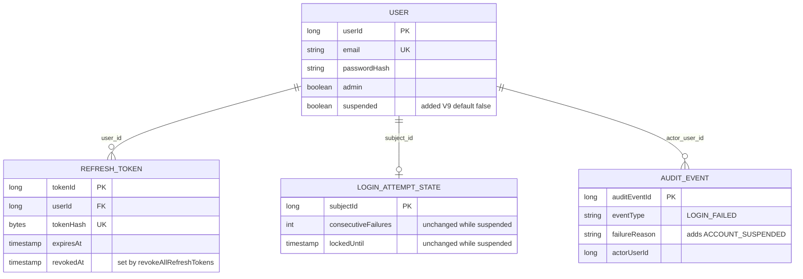

# Functional Spec — U1 利用停止の状態と3つの入口（u1-user-suspension）

この文書は、U1 の手順（流れ）と状態の移り変わりの正本である。データの形は `entities.md`、判定の決まりは `rules.md` の YAML が正本で、4節の図と5節の要約はそこから導いた読みやすさのための写しである。出典は `rules.md` の冒頭の略号のとおり。

U1 は種類 library の単位で、自分の API を持たない。既存の3つの入口（ログインの照合・トークンの更新・アクセストークンの認証）に停止の判定を足し、U3 の止める・解く処理が使う口（C1）を作る。止める・解く操作そのもの（拒否の判定・監査の `USER_SUSPENDED`・`USER_RESUMED`）は U3 が持つ。U1 のテストは、C1 の口かテストのデータで停止の状態を入れて確かめる（`unit-of-work.md` の U1 の確かめ）。

## 1. 状態の移り変わり

### 1.1 利用者の停止の状態（User.suspended）

| 今の状態 | きっかけ | 次の状態 | 決まり |
|---|---|---|---|
| （列が無い） | V9 の前からいる利用者に V9 を当てる | 有効（false） | BR1.1・BR1.2 |
| （行が無い） | 初期管理者の自動作成・登録の完了による作成 | 有効（false、既定の値） | BR1.1 |
| 有効（false） | U3 の止める処理が setSuspended(true) を呼び、確定する | 停止中（true） | BR1.5 |
| 停止中（true） | U3 の停止を解く処理が setSuspended(false) を呼び、確定する | 有効（false） | BR1.5 |
| どちらでも | 呼び出し元のトランザクションが巻き戻る | 変わらない | BR1.5 |
| どちらでも | 利用者自身の API の要求（本文に停止の項目を足しても） | 変わらない | BR1.6 |

停止の状態の移り変わりで、管理者の印・氏名と表示の設定・パスワード・ロックの状態は変わらない（BR1.5）。同じ値への書き換え（有効のまま false など）を拒否するかは U3 が判定する（`setSuspended` は判定しない）。

### 1.2 リフレッシュトークン（RefreshToken.revokedAt）

| 今の状態 | きっかけ | 次の状態 | 決まり |
|---|---|---|---|
| 未無効（空） | U3 の止める処理が revokeAllRefreshTokens を呼び、確定する（期限切れの行も含む） | 無効（止めた時刻） | BR5.1・BR5.2 |
| 未無効（空） | 停止中の利用者がそのトークンで更新する | 未無効のまま（巻き戻す） | BR3.1 |
| 無効 | 停止を解く | 無効のまま（戻さない） | BR5.4 |
| 未無効（空） | 止める確定の前に同時の更新が作った新しいトークン | 未無効のまま残りうる（M8 B の隙） | BR5.5 |
| 未無効（空） | ログインの照合の後・判定の前に止める処理が確定し、そのログインが作った新しいトークン | 未無効のまま残りうる（M8 B と同じ種類の隙、R-03） | BR5.5 |

### 1.3 停止中のロックの状態（LoginAttemptState）

停止中のログインでは、失敗回数 n・解除の予定の時刻 t は、パスワードの正誤とロック中かどうかにかかわらず、読んだ値のまま書き戻すため変わらない（BR2.2）。停止を解いた後のログインは、今までどおりのロックの判定で n・t から続ける。本人の行が無い利用者では、パスワードの誤りと同じく行（失敗回数 0・ロックなし）を作ってから判定をやり直す（BR2.3）。

## 2. 手順

### 2.1 ログインの照合（POST /api/auth/login、ADR-008、Q1 A）

既存の流れ（`backend/src/main/java/cherry/mastersmith/auth/service/LoginService.java`）に、停止の分岐を1つ足す。太字が足す手順である。

1. メールアドレスで利用者を探し、パスワードを照合する。トランザクションの外で、停止の状態にかかわらず必ず照合を1回行う（照合の結果に付く利用者の要約に suspended が載る、BR1.3・BR2.3）。
2. 判定のトランザクションを始める。
3. 利用者がいなければ、ダミーの行を排他つきで読み、読んだ値のまま更新を1回行い、LOGIN_FAILED（USER_NOT_FOUND）を知らせて失敗で終える（既存）。
4. 利用者がいれば、本人のロックの状態の行を排他つきで読む。行が無ければ、何も書かず出来事も出さずに終え、別の短いトランザクションで行を作ってから 2 からやり直す（既存。停止中でも同じ、BR2.3）。
5. **利用者の要約の suspended が true なら（BR2.1）**:
   1. **読んだ失敗回数と解除の予定の時刻を、そのままの値で本人の行に1回更新する（BR2.2）。**
   2. **LOGIN_FAILED（理由 ACCOUNT_SUSPENDED、操作した人は本人）を1件知らせる（BR2.5）。**
   3. **トークンを出さずに失敗で終える。**
6. 停止中でなければ、今までどおりロックの判定を行い、判定の結果を1回更新し、成功ならトークンを出して LOGIN_SUCCEEDED、失敗なら LOGIN_FAILED（PASSWORD_MISMATCH・ACCOUNT_LOCKED）を知らせる（既存）。
7. トランザクションが確定し、AuditLog が出来事を記録する（既存。書き込みの失敗で応答を変えない）。
8. 失敗はどれも 401 AUTHENTICATION_FAILED で返す（BR2.4・BR6.1）。

停止中のログインの読み書きの回数は、次の表のとおりパスワードの誤りと同じになる（ADR-007 の項目4は成り立つ、AC3.2.3）。違いは書き戻す値（停止中は読んだ値のまま、誤りは数えた値）と出来事の理由だけで、どちらも応答には出ない。

| 場合 | パスワードの照合 | 排他つきの読み取り | 更新 | 出来事 | 応答 |
|---|---|---|---|---|---|
| パスワードの誤り | 1回 | 1回（本人の行） | 1回（数えた値） | 1件（PASSWORD_MISMATCH） | 401 AUTHENTICATION_FAILED |
| ロック中 | 1回 | 1回（本人の行） | 1回 | 1件（ACCOUNT_LOCKED） | 401 AUTHENTICATION_FAILED |
| 停止中（正誤を問わない） | 1回 | 1回（本人の行） | 1回（読んだ値のまま） | 1件（ACCOUNT_SUSPENDED） | 401 AUTHENTICATION_FAILED |
| 存在しないメールアドレス | 1回（ダミーのハッシュ） | 1回（ダミーの行） | 1回（読んだ値のまま） | 1件（USER_NOT_FOUND） | 401 AUTHENTICATION_FAILED |

本人の行が無い利用者では、パスワードの誤りと停止中のどちらも「何も書かない判定 → 行を作る → 判定のやり直し」の同じ流れになり、回数はそろったままである。確かめは既存の `LoginServiceTest` の形（照合と読み書きの呼び出しの回数を数える）で行う。

5 の判定は、1 でトランザクションの外で読んだ要約の suspended を使う（4 で排他して読むのはロックの状態の行で、users の行ではない）。そのため、1 の後・5 の前に止める処理が確定すると、そのログインは通りうる。M8 B と同じ種類の隙として受け入れ、判定のトランザクションでの読み直しは足さない（BR5.5、承認の場の決定 R-03）。

### 2.2 トークンの更新（POST /api/auth/session/refresh、Q2 A）

1. リフレッシュトークンの値が無ければ失敗（既存）。
2. 値のハッシュで行を引き、無い・無効にした・期限切れなら失敗（既存）。
3. その行を条件つきで無効にし、ほかの要求が先に無効にしていたら失敗（既存）。
4. 行の利用者 ID で利用者の要約を読み、いなければ失敗（既存）。
5. **要約の suspended が true なら失敗とする（BR3.1）。** 失敗はすべて例外でトランザクションを巻き戻すため、3 の無効化も戻り、出されたトークンは変わらない。監査は出さない（BR3.2）。
6. 新しいアクセストークンとリフレッシュトークンを出す（既存）。
7. 失敗はどれも 401 REFRESH_FAILED で返す（BR6.1）。

### 2.3 アクセストークンの認証（すべての Bearer の要求、Q3 A）

1. アクセストークンの形式・署名・方式・有効期限を確かめる（既存。時刻は注入した時計）。
2. トークンの利用者 ID で利用者の要約を内部DB から読み、いなければ区分 USER_NOT_FOUND で失敗（既存）。
3. **要約の suspended が true なら、区分 USER_SUSPENDED で失敗とする（BR4.1）。**
4. 認証された利用者（利用者 ID・メールアドレス・管理者の印）を要求の文脈に置く（既存）。
5. 失敗は、今の 401 の入口で 401 AUTHENTICATION_REQUIRED になる（入口は変えない、BR6.1）。
6. 管理の API（/api/admin/ の下）での 401 は、アクセスの拒否の理由に変えて監査に残す仕組みがある（既存）。**USER_SUSPENDED は TOKEN_EXPIRED と同じく理由なしに変え、監査に残さない（BR4.2）。** 停止中の管理者の要求は認可と業務の処理に届かない（BR4.4）。

要求ごとに 2 で内部DB を読むため、止めた確定の後の次の要求から 3 で拒否され、停止を解いた確定の後の次の要求から受け付ける（BR4.1・BR6.2）。

### 2.4 停止中に止める前のアクセストークンを使う時刻の例（AC3.2.7、BR4.3）

時刻はすべて注入した時計で動かす（`sleep` と実時刻に頼らない）。

1. 利用者 B が t0 にログインし、アクセストークン X（有効期限 t0＋5 分）を受け取る。
2. t0＋1 分に B を止める（テストでは C1 の setSuspended(true) と revokeAllRefreshTokens を同じトランザクションで呼ぶか、テストのデータで入れる）。
3. t0＋1 分〜t0＋2 分の X での要求は、2.3 の 3 で 401。
4. t0＋2 分に停止を解く（setSuspended(false)）。
5. t0＋2 分以後、X の有効期限の直前（t0＋5 分の1ミリ秒前）までの要求は受け付ける。
6. t0＋5 分ちょうど以後の要求は、2.3 の 1 の有効期限の判定で 401。

### 2.5 停止の状態の口（C1 の UserAccount）

C1 の口の型・置き場・戻り値・トランザクションの属性は次のとおりとする（承認の場の決定 R-01）。U3 の機能設計（`aidlc/spaces/default/intents/260930-user-admin/construction/u3-user-admin-api/functional-design/functional-spec.md` の 2.5・2.6）は、この名前と引数のまま呼ぶ。

| 口 | 置き場（クラス） | 引数 | 戻り値 | トランザクションの属性 | 決まり |
|---|---|---|---|---|---|
| isSuspended | `cherry.mastersmith.user.service.UserAccountService`（既存） | long userId | boolean | `@Transactional(readOnly = true)`（既定の REQUIRED。呼び出し元があれば入る） | BR1.4 |
| setSuspended | `cherry.mastersmith.user.service.UserAccountService`（既存） | long userId, boolean suspended | void | `@Transactional(propagation = Propagation.MANDATORY)` | BR1.5 |
| revokeAllRefreshTokens | `cherry.mastersmith.auth.service.RefreshTokenRevocationService`（新しい） | long userId | `RevokeAllResult(int revoked)`（auth.service の record） | `@Transactional(propagation = Propagation.MANDATORY)` | BR5.1・BR5.2 |

- user は auth を知らない（BR7.1）ため、revokeAllRefreshTokens は auth の側に置く。U3 の useradmin から user.service・auth.service へ向かう依存は、C8 と同じ向きである。
- 引数は利用者 ID と真偽だけで、戻り値も件数だけのため、TRACE のログに出ても個人に関する値と秘密は出ない。
- **isSuspended(userId)**: 内部DB の今の値を返す。同じトランザクションの中で setSuspended の後に呼んでも、書いた後の値を返す（BR1.4、R-05）。利用者がいなければ想定外の誤り（IllegalStateException）。
- **setSuspended(userId, suspended)**: 呼び出し元のトランザクションに入り、UserRepository に足す列を絞った更新の問い合わせで停止の列だけを書き換える。問い合わせは `@Modifying(clearAutomatically = true, flushAutomatically = true)` とし、実行の前に未反映の変更を書き出し、実行の後に永続化の文脈を空にする。そのため、後の isSuspended・findById・U3 の要約の読み取りは内部DB から読み直し、古い値を返さない（BR1.4・BR1.5、R-05）。拒否の判定・監査・トークンの無効化はしない（BR1.5）。更新した行が 0 なら利用者がいないとして想定外の誤り（IllegalStateException）。トランザクションの外から呼ぶと想定外の誤り（IllegalTransactionStateException）。
- 書いた後の値を読めることの確かめ（R-05）: 結合テストで、同じトランザクションの中で (1) findById で対象を読み込んでおき、(2) setSuspended(true) の後に isSuspended と findById の要約の suspended が true、(3) setSuspended(false) の後にどちらも false になることを確かめる。

U1 の中には呼ぶ側が無く、U3 の止める・解く処理が使う。U3 は、止めるときに setSuspended(true) と revokeAllRefreshTokens を同じトランザクションで呼び、解くときは setSuspended(false) だけを呼ぶ（BR5.4）。

### 2.6 リフレッシュトークンのまとめての無効化（C1 の revokeAllRefreshTokens）

置き場は `cherry.mastersmith.auth.service.RefreshTokenRevocationService#revokeAllRefreshTokens(long userId)`、戻り値は `RevokeAllResult(int revoked)`、属性は MANDATORY（2.5 の表）。

1. 呼び出し元のトランザクションの中かを確かめ、外なら想定外の誤り（MANDATORY による IllegalTransactionStateException、BR5.2）。
2. 注入した時計から今の時刻を取る。
3. 利用者 ID の行のうち、revokedAt が空の行すべてに今の時刻を入れる更新を1回行う（期限切れの行も含む、既存の利用者 ID の索引で引く、BR5.1）。問い合わせは RefreshTokenRepository に足し、既存の revokeIfActive と同じく `@Modifying(clearAutomatically = true, flushAutomatically = true)` にする。
4. 無効にした件数をアプリのログに DEBUG で、利用者 ID と件数だけ出す（BR5.3）。
5. 件数を RevokeAllResult で返す。0 件でも成功（BR5.1）。監査の出来事は出さない（BR5.3）。

### 2.7 スキーマの変更 V9 の方針（NFR10）

1. users に suspended（真偽、必須、既定 false）を足す。既存の行は false になる（BR1.2）。
2. 1つの V9 にまとめ、名前は既存の形にそろえて `V9__u1_user_suspension.sql` とする。適用済みの V1〜V8 は書き換えない。前進のみ。
3. 後方互換: 1つ前の版のアプリは列を知らずに動き、利用者の作成も既定の値で入る。V9 は前進のみで、戻しても列は残るため、前の版のイメージで動かす選択肢は残る。
4. 戻した間は停止が効かない: 1つ前の版は停止を見ないため、イメージだけで戻すと、戻している間は停止中の利用者もログインで新しいトークンを取れる（止めたときに無効にしたリフレッシュトークンは無効のまま）。戻すのは問題が起きたときの短い間で、配備先は手元の PC だけのため、依頼者の決定でこの制約を受け入れる（R-02、BR1.2）。deployment-pipeline に「前の版に戻す前に、停止中の利用者を確かめる手順」を申し送る（7節）。

## 3. 失敗の場合とふるまい

| 場合 | 応答 | 内部DB | 監査 | 決まり |
|---|---|---|---|---|
| 停止中の利用者が正しいパスワードでログイン | 401 AUTHENTICATION_FAILED | ロックの状態は読んだ値のまま（変わらない） | LOGIN_FAILED・ACCOUNT_SUSPENDED | BR2.1〜BR2.5 |
| 停止中の利用者が誤ったパスワードでログイン | 401 AUTHENTICATION_FAILED | 同上（失敗回数は増えない） | LOGIN_FAILED・ACCOUNT_SUSPENDED | BR2.1〜BR2.5 |
| 停止中かつロック中の利用者がログイン | 401 AUTHENTICATION_FAILED | 同上 | LOGIN_FAILED・ACCOUNT_SUSPENDED（停止を先に判定） | BR2.1 |
| 停止中の利用者がリフレッシュトークンで更新 | 401 REFRESH_FAILED | 巻き戻る（出されたトークンは変わらない） | 残さない | BR3.1・BR3.2 |
| 停止中の利用者がアクセストークンで API を呼ぶ | 401 AUTHENTICATION_REQUIRED | 変わらない | 残さない | BR4.1 |
| 停止中の管理者が管理の API を呼ぶ | 401 AUTHENTICATION_REQUIRED | 対象の利用者は変わらない | 業務の監査もアクセスの拒否も残さない | BR4.2・BR4.4 |
| 停止を解いた後、止める前のリフレッシュトークンで更新 | 401 REFRESH_FAILED | 変わらない | 残さない | BR3.3・BR5.4 |
| 停止を解いた後、止める前のアクセストークン（有効期限の前） | 受け付ける | — | — | BR4.3 |
| 停止中の利用者のメールアドレスへの招待 | 今の登録済みの拒否のまま | 招待は作られない | 今の招待の拒否の扱いのまま | BR6.4 |
| setSuspended・isSuspended に存在しない利用者 ID | 想定外の誤り（呼び出し元が巻き戻る） | 変わらない | — | BR1.4・BR1.5 |
| revokeAllRefreshTokens をトランザクションの外から呼ぶ | 想定外の誤り | 変わらない | — | BR5.2 |
| 監査の書き込みの失敗（停止中のログイン） | 401 AUTHENTICATION_FAILED のまま | 元の判定のとおり | 記録されない（既存どおりアプリのログに ERROR） | BR2.5 |

どの拒否の応答にも、停止を示す値・メールアドレス・トークンの値を載せない（BR6.1、PM の Forbidden）。画面は変えず、停止中の 401 は今のログインの切れと同じに扱われる（BR6.3）。

## 4. エンティティの関係（`entities.md` から導いた図）

文字の代替説明: 利用者（USER）1人に、リフレッシュトークン（REFRESH_TOKEN）が0件以上、ロックの状態（LOGIN_ATTEMPT_STATE）が0か1件、監査の記録（AUDIT_EVENT）が「操作した人」として0件以上つながる。利用者には停止の状態 suspended（V9、既定 false）を足す。リフレッシュトークンは形を変えず、止めるときに revokedAt をまとめて入れる。ロックの状態は形を変えず、停止中のログインでは失敗回数と解除の予定の時刻が変わらない。監査の記録は列を足さず、失敗の理由に ACCOUNT_SUSPENDED を足す。図では、この単位に関わる列だけを描いた（ほかの既存の列は `entities.md`）。

## 5. 決まりの要約（`rules.md` から導いた写し）

| 群 | ID | 要点 |
|---|---|---|
| 停止の状態 | BR1.1〜BR1.6 | 真偽で既定は有効、V9 で前進のみ（前の版へ戻した間は停止が効かない制約を受け入れる）、3つの入口は同じ要約を読む、isSuspended・setSuspended は UserAccountService（判定しない・停止の列だけ・書いた後の読み取りは書いた値）、変えられるのは C1 の口だけ |
| ログインの照合 | BR2.1〜BR2.6 | ロックより前に停止、本人の行を読んだ値のまま書き戻す、照合1回・排他つきの読み取り1回・更新1回・出来事1件、401 AUTHENTICATION_FAILED、ACCOUNT_SUSPENDED の監査、ログにメールアドレスを出さない |
| トークンの更新 | BR3.1〜BR3.3 | 401 REFRESH_FAILED で巻き戻す、監査しない、止める前のトークンは解いた後も拒否 |
| アクセストークンの認証 | BR4.1〜BR4.4 | USER_SUSPENDED で 401 AUTHENTICATION_REQUIRED、管理の API の監査に残さない、解いた後は期限まで使える、停止中の管理者は業務に届かない |
| まとめての無効化 | BR5.1〜BR5.5 | auth.service の RefreshTokenRevocationService が未無効の行を今の時刻で無効にし RevokeAllResult で件数を返す、MANDATORY、監査しない、戻さない、トークンの更新とログインの照合の隙は塞がない |
| 列挙の防止と解いた後 | BR6.1〜BR6.4 | ほかの失敗と同じ応答、解いた直後から受け付ける、画面は変えない、メールアドレスは登録済み |
| 構造と名前 | BR7.1・BR7.2 | user は auth を知らない、32 文字に収まる |

## 6. この単位の作業（決まりに当たらないもの）

| 作業 | 内容 | 出典 |
|---|---|---|
| `.idea/.gitignore` | `dataSources.xml` を足す。`/dataSources/` はすでにある（今は `/dataSources/` と `/dataSources.local.xml`） | UQ2 A、`bolt-plan.md` の B1、要点 14 |
| カバレッジの一覧から外す | 手を入れる `auth.domain`（LoginFailureReason・TokenFailureReason）・`auth.repository`（RefreshTokenRepository）・`access.domain`（AccessDeniedReason）を、テストを足して下限（行 80%・分岐 70%）を満たしたうえで `packagesJudgedByTotal` から外す。`auth.repository` の足りない分岐は `lockDummyForUpdate` の「空いたダミーの行が無い」側で、ダミーの行8つをすべて排他した状態を作るテストが要る | `team.md` の Testing Posture、要点 15、Q3 A |
| `team.md` の必須テスト | 利用停止の3つの入口を入口ごとに・停止を解いた直後の3つの入口・停止の前に出したトークンの扱い（リフレッシュは拒否、アクセスは解いた後は期限まで）を、サーバー側のテストで確かめる | `team.md` の Testing Posture の利用停止 |

## 7. 後の段へ渡すこと

| 論点 | 持ち主の段 |
|---|---|
| 停止中のログインの応答時間がパスワードの誤りとそろうことの測り方（読み書きの回数はそろうが、本人の行とダミーの行の違いは残る） | nfr-requirements |
| V9 の後方互換の確かめ方 | nfr-design・infrastructure-design |
| 1つ前の版へ戻した間は停止が効かないこと（受け入れた制約、R-02）の戻し方の手順への記載と、前の版に戻す前に停止中の利用者を確かめる手順 | deployment-pipeline |
| 停止中の利用者のメールアドレスへの招待が今の登録済みの拒否になることの回帰テスト1件（AC3.2.6、R-04） | U1 の code-generation |
| 書いた後の読み取りが書いた値を返すことの結合テスト（BR1.4、R-05） | U1 の code-generation |
| まとめての無効化の件数が多い利用者での性能（1人のトークンの数に比例する見込み、ADR-007 の項目2） | nfr-requirements |
| 止める操作から C1 の2つの口を同じトランザクションで呼ぶ結合の確かめ（AC3.1.1 など） | U3 の functional-design・code-generation |
| 停止中の利用者の画面の代表の流れ（AC3.2.9・AC3.2.10 の画面の動き） | U5 の E2E（M9 A） |
| 既存の漏えいのテスト（`*SecretLeakIT`）の列の一覧に V9 の列を足すかの確かめ | code-generation |

## 8. 上流との差

承認済みの上流の文書は書き換えず、この段の決定で上流と違う形・上流に無い作業になった点を書く（PM の決まり）。

| ID | 上流 | 上流の記載 | この単位の設計 | 理由と扱い |
|---|---|---|---|---|
| D1 | Delivery Planning（`aidlc/spaces/default/intents/260930-user-admin/inception/delivery-planning/bolt-plan.md` の B1） | B1 の完了の条件で、`packagesJudgedByTotal` から外すのは `auth.domain`・`auth.repository` の2つ | `access.domain` にも手が入り、B1 で一覧から外す作業が増える（3つになる） | Q3 A でアクセストークンの認証の失敗の区分に `USER_SUSPENDED` を足すため、区分を漏れなく並べる `AccessDeniedReason` の変換に1行足す必要がある（BR4.2）。`access.domain` は今、行・分岐とも 100% で下限を満たしているため、作業はテストの確かめと一覧の1行の削除で済む見込み。量の見積もりはコード生成の計画で実測して確かめる |
| D2 | 契約 C7（`aidlc/spaces/default/intents/260930-user-admin/inception/contract-design/contract-summary.md`） | 「トークンの更新・アクセストークンの認証で停止中だったことは記録しない。新しい監査は足さない」 | アクセストークンの認証の失敗の区分 `USER_SUSPENDED` は足すが、監査には残さない（有効期限切れと同じ扱い）。アクセスの拒否の理由の値も足さない | C7 の not_recorded を守ったまま、内部の区分だけを足す形にした（Q3 A）。既存の区分（`USER_NOT_FOUND`）に寄せると、管理の API の監査に「利用者がいない」として残り、読む人が取り違えるため（ストーリーの「残る隙と申し送り」）。区分はアプリの中だけの値で、応答と監査には出ない。契約の文書は書き換えない |
| D3 | 契約 C1 | isSuspended の戻り値は boolean とだけ書かれ、利用者がいないときの扱いは無い | 利用者がいないときは想定外の誤りとする（BR1.4）。setSuspended も同じ（BR1.5） | U3 は行の排他の口（C8）で利用者の有無を確かめてから使うため、いない利用者で呼ばれるのは想定外にあたる。false を返すと「いない」と「有効」が区別できないため。契約の文書は書き換えず、U3 の機能設計で確かめる |

## 承認の場の決定（Request Changes、2026-10-01）

Functional Design の承認の場で、依頼者が Request Changes を選び、レビューの指摘 R-01〜R-05 を次のとおり決めた。

| 指摘 | 重さ | 決定 | この単位の文書での扱い | 申し送り |
|---|---|---|---|---|
| R-01 C1 の口の型・置き場・戻り値・トランザクションの属性が決まっていない | Major | 直す | isSuspended・setSuspended は既存の `UserAccountService`（user.service）に置き、戻り値は boolean・void、属性は読み取りだけ・MANDATORY とした。revokeAllRefreshTokens は auth.service に新しく作る `RefreshTokenRevocationService` に置き、戻り値は `RevokeAllResult(int revoked)`、属性は MANDATORY とした。U3 の設計が呼ぶ名前と引数（setSuspended(対象, 真偽)・revokeAllRefreshTokens(対象)）と一致する（2.5・2.6、BR1.4・BR1.5・BR5.1・BR5.2、entities.md） | なし |
| R-02 1つ前の版に戻すと、戻している間は停止が効かない | Major | 受け入れて記録する | 戻すのは問題が起きたときの短い間で、配備先は手元の PC だけのため、受け入れた制約とした（2.7、BR1.2） | deployment-pipeline に「前の版に戻す前に、停止中の利用者を確かめる手順」を申し送る（7節） |
| R-03 ログインの照合の直後に止める操作が確定すると、そのログインは通りうる | Minor | 受け入れて記録する | M8 B と同じ種類の隙として、ログインの経路も受け入れる範囲に明記した。判定のトランザクションでの読み直しは足さない（1.2・2.1、BR5.5） | なし |
| R-04 AC3.2.6・AC3.2.9・AC3.2.10 を確かめる単位が分からない | Minor | 直す | traceability.json の target に確かめる単位を書き足した（AC3.2.6 は既存の動きの回帰テストを U1 で1件、AC3.2.9・AC3.2.10 の画面の動きは U5 の E2E）。BR6.4 に回帰テストを書いた | U1 の code-generation の計画に AC3.2.6 の回帰テストを1件入れる（7節） |
| R-05 setSuspended の後の読み取りで古い値が返りうる | Minor | 直す | 書いた後の読み取りが書いた値を返すこと（更新の問い合わせで書き出しと文脈の片付けを行う）を BR1.4 に足し、同じトランザクションで書いて読む結合テストで確かめると書いた（2.5） | U1 の code-generation の計画にその結合テストを入れる（7節） |
