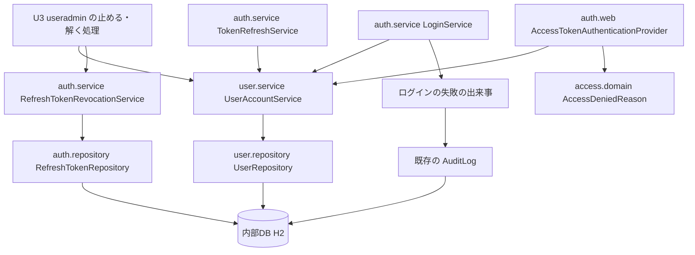

# Logical Components — U1 利用停止の状態と3つの入口（u1-user-suspension）

U1 の論理的な部品の一覧と、NFR の作りがどこに当たるかです。アプリは1つの WAR・1台（開発者の PC 上のコンテナ）で、部品はどれも同じ JVM の中のパッケージです（`aidlc/spaces/default/memory/team.md` の Code Style の層の分け方）。U1 は新しい機能のパッケージを作らず、既存の `user`・`auth`・`access`・`audit` に手を入れ、`auth.service` に部品を1つ足します。出典の略号は `security-design.md` と同じ。作りの中身は `security-design.md` の節を指します。

## 1. 部品の一覧

| 部品 | パッケージ | 新しい・手を入れる | 役目 | 当たる NFR の作り |
|---|---|---|---|---|
| UserSummary | `user.service` | 手を入れる | `suspended` を足す。3つの入口の判定の材料 | `security-design.md` 2.1（NFR1.1・NFR5.1） |
| UserAccountService | `user.service` | 手を入れる | `isSuspended`（読み取りだけ）・`setSuspended`（MANDATORY）を足す。`verifyPassword`・`findById` が要約に `suspended` を写す | 同 2.1・4.1（NFR11.2） |
| User | `user.domain` | 手を入れる | `suspended` の列（必須、作るときに false）。外から呼べる書き換えのメソッドは作らない | 同 4.3・8.1（NFR1.4・NFR10.1） |
| UserRepository | `user.repository` | 手を入れる | 停止の列だけの更新（`@Modifying(clearAutomatically = true, flushAutomatically = true)`） | 同 4.1（NFR11.2・NFR9.4） |
| LoginService | `auth.service` | 手を入れる | `decide` でロックの判定の前に停止を判定し、読んだ値のまま書き戻して ACCOUNT_SUSPENDED を知らせる | 同 2.2（NFR1.1・NFR2.1・NFR2.2） |
| TokenRefreshService | `auth.service` | 手を入れる | 利用者を読んだ直後に停止を判定し、例外で巻き戻す | 同 2.3（NFR1.1・NFR2.1） |
| RefreshTokenRevocationService・RevokeAllResult | `auth.service` | 新しい | `revokeAllRefreshTokens`（MANDATORY）、件数を返す、DEBUG のログ | 同 4.2（NFR5.3・NFR3.2・NFR11.2） |
| RefreshTokenRepository | `auth.repository` | 手を入れる | 利用者 ID で引く未無効の行のまとめての無効化の更新 | 同 4.2（NFR5.3・NFR9.4） |
| LoginFailureReason・TokenFailureReason | `auth.domain` | 手を入れる | `ACCOUNT_SUSPENDED`・`USER_SUSPENDED` を足す | 同 2.2・2.4 |
| AccessTokenAuthenticationProvider | `auth.web` | 手を入れる | 利用者を読んだ直後に停止を判定し、`USER_SUSPENDED` で失敗にする | 同 2.4（NFR1.1・NFR2.3） |
| AccessDeniedReason | `access.domain` | 手を入れる | 変換に `USER_SUSPENDED -> Optional.empty()` を足す | 同 2.4（NFR2.3） |
| AuditFailureReason・AuditEventFactory | `audit.domain` | 手を入れる | `ACCOUNT_SUSPENDED` と変換の1行 | 同 6節（NFR6.1） |
| V9 | `backend/src/main/resources/db/migration/V9__u1_user_suspension.sql` | 新しい | `users.suspended`（BOOLEAN・既定 FALSE・必須） | 同 8.1（NFR10.1） |

手を入れない部品: `access.service`（`AccessDeniedEventPublisher` など）、`audit.service`（`AuditEventListener`）、`common.security`（SecurityFilterChain と 401 の入口）、既存の警報の決まり。新しい依存・指標・警報は足しません。

## 2. 部品の間のつながり

図の文章による代替: U3 の止める・解く処理は、`user.service` の `UserAccountService`（停止の状態）と、`auth.service` の `RefreshTokenRevocationService`（まとめての無効化）だけを呼ぶ。3つの入口（`LoginService`・`TokenRefreshService`・`AccessTokenAuthenticationProvider`）は、どれも `UserAccountService` が返す利用者の要約を読んで停止を判定する。アクセストークンの認証の失敗の区分は `access.domain` の `AccessDeniedReason` で理由に変わる（停止は理由なし）。停止中のログインだけが出来事を知らせ、既存の AuditLog が確定の後に内部DB に記録する。`user` から `auth` への矢印は無い。

## 3. C1 の口と U3 への約束（機能設計のレビューの R-06）

C1 の形は契約 `aidlc/spaces/default/intents/260930-user-admin/inception/contract-design/contract-summary.md` の C1 と、機能設計 `functional-spec.md` の 2.5・2.6 のとおりです。この節は、形の上には現れない約束を U3 に渡します。

| 口 | トランザクション | 永続化の文脈への影響 | U3 が守ること |
|---|---|---|---|
| `UserAccountService#isSuspended(long)` | 読み取りだけ（呼び出し元があれば入る） | 変えない | 利用者がいなければ想定外の誤りになる。C8 の行の排他の口で有無を確かめてから呼ぶ |
| `UserAccountService#setSuspended(long, boolean)` | MANDATORY | 実行の前に未反映の変更を書き出し、実行の後に文脈を空にする | 口を呼ぶ前に読み込んだエンティティは切り離される。口を呼んだ後に、そのエンティティの変更を書かない（書いても内部DB に反映されない）。値が要るときは読み直す。利用者がいなければ想定外の誤り |
| `RefreshTokenRevocationService#revokeAllRefreshTokens(long)` | MANDATORY | 同上 | 同上。止めるときは `setSuspended(true)` と同じトランザクションで呼ぶ。解くときは呼ばない |

- 文脈を空にしても、C8 の行の排他（内部DB の行のロック）は確定まで続くため失われない。
- 呼び出し元のトランザクションが巻き戻れば、停止もトークンの無効化も戻る（NFR11.2）。
- 確かめの持ち主: U1 の側は「同じトランザクションで書いて読むと書いた値が返る」結合テスト（NFR9.2、R-05）。U3 の側の「口を呼んだ後に先に読み込んだエンティティを使わない」確かめは、U3 のコード生成の計画に置く（申し送りのとおり）。

## 4. 障害の範囲

| 起きること | 及ぶ範囲 | 及ばない範囲 |
|---|---|---|
| 内部DB の読み取りが失敗する | その要求だけが失敗する（今の 3つの入口の失敗と同じ扱い） | 停止の状態の写しを持たないため、古い値で通すことは無い |
| 停止の列の更新が 0 行（利用者がいない） | U3 の操作が想定外の誤りで巻き戻る | ほかの利用者・ほかの要求 |
| まとめての無効化の件数が多い | U3 の止める操作の応答時間（U3 の p95 1 秒に含めて測る） | 3つの入口（無効化は止める操作の中だけで動く） |
| 監査の書き込みが失敗する | 監査の行が残らない。アプリのログに ERROR | 停止中のログインの応答と判定の結果 |
| 停止中のログインが増える | 監査の行（ログインの失敗と同じ量）と接続の2本目（既存の経路） | 新しい接続の経路は無く、接続プールの見積もりは変わらない |
| 1つ前の版のイメージに戻す | 戻している間は停止が効かない（R2） | 止めたときに無効にしたリフレッシュトークンは無効のまま |

## 5. 共有するもの

| 共有するもの | 使い方の変化 | 守り |
|---|---|---|
| 内部DB（H2）の `users` | 列を1つ足す。書くのは C1 の `setSuspended` だけ | 前進のみの V9。既存の列を変えない |
| 内部DB の `refresh_tokens` | まとめての無効化の更新を1つ足す | 既存の利用者 ID の索引で引く |
| 内部DB の `login_attempt_states` | 停止中のログインで読んだ値のまま1回書き戻す | パスワードの誤りと同じ回数 |
| 内部DB の `audit_events` | 理由 `ACCOUNT_SUSPENDED` の行が増える | 列とスキーマは変えない |
| 接続プール（上限 30） | 変わらない | 新しく2本使う経路を足さない |
| 注入した `Clock` | まとめての無効化の時刻に使う | テストは `MutableClock` |

## 6. テストの部品と片付け（Q2 A・Q3 A）

B1 の作業ブランチの中の順序は次のとおりです。手順の細部とテストの名前は、コード生成の計画で決めます。

1. `invitation/repository/V8MigrationIT.java` の待ちの確かめの手伝い（`INFORMATION_SCHEMA.SESSIONS` を上限の時間つきで見る）を `backend/src/test/java/cherry/mastersmith/auth/testsupport` に移す。
2. `InvitationSchemaIT` に、`V8MigrationIT` の (b) の確かめを1件足す。(d) は `InvitationConcurrencyIT` が業務の層で確かめているとみなし、その対応を計画に書く。
3. `user/repository/V7MigrationIT.java`・`V7BackwardCompatibilityIT.java`、`invitation/repository/V8MigrationIT.java`・`V8BackwardCompatibilityIT.java`、`backend/src/test/resources/db/migration-through-v6`・`migration-through-v7` を消す。
4. V9 とエンティティ、3つの入口、C1 の口、監査の理由を、層ごとに実装とテストで進める（`team.md` の Testing Posture の Ordering）。
5. `LoginAttemptStateRepositoryIT` に、ダミーの行8つをすべて排他した状態を作るテストを足す（1 の手伝いを使う）。
6. `README.md` の V7・V8 の説明を直し、V9 の行を足す。
7. `:backend:cleanTest :backend:cleanIntegrationTest` を付けた `./gradlew verify` でパッケージごとのカバレッジを実測し、実際に `src/main` を変えたパッケージを `packagesJudgedByTotal` から外す。

テストの手伝いの置き場: 回数の確かめは既存の `auth/testsupport` の `CountingPasswordEncoder`・`SqlStatementCounter`、時刻は `MutableClock`。新しい手伝いを足すときも `<機能>/testsupport` に置きます。

## 7. B1 で確かめること

| 確かめること | 合否の見方 |
|---|---|
| 起動時の Flyway の `validate-on-migrate` と Hibernate の `validate` が V9 で通る | アプリを起動する結合テストが通る |
| エンティティで `suspended` の true・false を書いて読み戻せる | 結合テスト（Q1 B） |
| 3つの入口の問い合わせの回数が変わらない | `SqlStatementCounter` |
| 停止中とパスワードの誤りの読み書きの回数が同じ | `CountingPasswordEncoder`・`SqlStatementCounter` |
| 既存の ArchUnit の境界テストが変更なしで通る | `ArchitectureTest`・機能ごとの境界テスト |
| 消したテストの後も `invitation.*`・`user.repository` がパッケージごとの下限を満たす | JaCoCo の実測 |
| 外したパッケージ（見込みは `auth.domain`・`auth.repository`・`access.domain`）が下限を満たす | JaCoCo の実測 |

## 8. 上流との差

この単位の上流との差は `security-design.md` の 12節（S-1〜S-8）にまとめました。部品の形（C1 の口の名前・引数・戻り値・属性）は契約 C1 と機能設計の 2.5・2.6 から変えていません。
