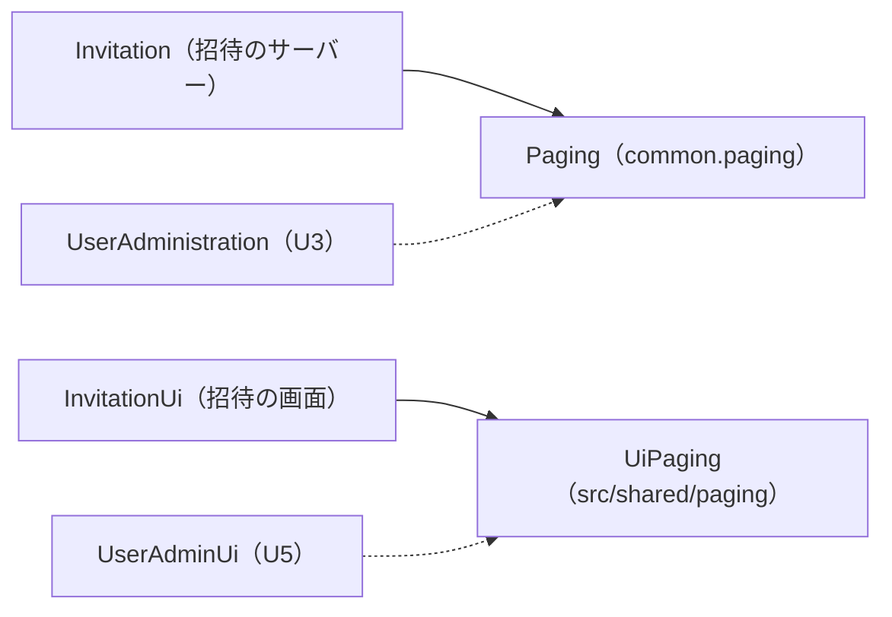

# Functional Spec — U2 ページ送りの共通化（u2-shared-paging）

この文書は、U2 の手順（流れ）の正本である。データの形は `entities.md`（エンティティは 0 件）、判定と計算の決まりは `rules.md` の YAML が正本で、4節と5節はそこから導いた読みやすさのための写しである。出典の略号は `rules.md` の冒頭のとおり。上流は `aidlc/spaces/default/intents/260930-user-admin/inception/units-generation/unit-of-work.md`（U2）、`unit-of-work-story-map.md`（US1.1 の従）、`aidlc/spaces/default/intents/260930-user-admin/inception/domain-design/components.md`（Paging・UiPaging）、`requirements.md`（FR1.3・FR1.5）、`contract-summary.md`（C2・C5）。

U2 は種類 library の単位で、招待の一覧のページ送りの計算を、サーバーは `cherry.mastersmith.common.paging` の Paging、画面は `frontend/src/shared/paging/` の UiPaging に移し、招待のサーバーと画面を切り替える（ADR-004）。招待の振る舞いは変えない。利用者の一覧（U3・U5）は、この単位が作った口を後の Bolt で使う。

## 1. 状態の移り変わり

この単位には状態の移り変わりが無い。Paging・UiPaging は状態を持たない純粋な関数で（BR1.5・BR2.5）、ページの番号などの値は呼び出しのたびに計算して捨てる。画面が今のページを持つこと（何ページ目を見ているか）は、使う側の画面（InvitationUi・UserAdminUi）の状態であり、U2 は持たない。

## 2. 手順

### 2.1 一覧の要求（サーバー、呼び出し元が Paging を使う流れ）

招待の一覧（今）と U3 の利用者の一覧（後の Bolt）が同じ順で行う。

1. 要求の page を問い合わせの文字列のまま受ける（指定が無ければ無し）。
2. Paging.parsePage に渡して検証する（BR1.2）。結果が空なら、入力の誤り（400 `VALIDATION_FAILED`）として拒否し、ここで終わる。全体の件数は数えず、監査にも残さない（BR3.1）。
3. 読み取りのトランザクションを始め、条件に当たる全体の件数 total を数える（検索があれば検索の結果の件数。検索は U3 の受け持ち）。
4. Paging.offsetOf(page) で読み始めの位置を求める（BR1.3）。
5. 読み始めの位置が total 以上なら、行を読まずに空の一覧とする（BR3.2。最後のページより後のページの番号、または全体が 0 件のとき）。そうでなければ、読み始めの位置から 20 件までを、ID で同順を決めた並びで読む（BR3.4）。
6. 応答に、行・page（受けた値。指定なしは 1）・size（20、BR1.1）・total を入れて 200 で返す（BR3.3）。

説明のための流れ（招待の今の形。移した後は名前だけが変わる）:

```text
parsed = Paging.parsePage(rawPage)
if parsed is empty -> 400 VALIDATION_FAILED（監査なし）
page  = parsed の値
total = 条件に当たる件数を数える
rows  = Paging.offsetOf(page) >= total ? 空 : 位置 offsetOf(page) から PAGE_SIZE 件を読む
-> 200 { items: rows, page, size: PAGE_SIZE, total }
```

### 2.2 行が載るページを求める（サーバー、招待の今の使い方）

招待で、同じメールアドレスの招待中の招待があるときの応答に「その招待が載るページ」を入れる流れ。U3 は使わないが、口は C2 のとおり残す。

1. その招待より前に並ぶ招待中の件数 before を数える。
2. Paging.pageOf(before + 1) でページの番号を求める（BR1.4）。位置は 1 以上のため例外にはならない。

### 2.3 一覧の応答を受けた画面（呼び出し元が UiPaging を使う流れ）

招待の画面（今）と U5 の利用者の管理の画面（後の Bolt）が同じ順で行う。

1. 応答の page・total と行の数を受ける。
2. UiPaging.correctedPage(page, total, 行の数) を求める（BR2.3）。移る先のページがあれば、そのページを読み直して 1 に戻る。
3. UiPaging.pageRange(page, total) で「n〜m 件目」を、PAGE_SIZE と total でページ送りの部品の表示を作る（BR2.1・BR2.2）。
4. ページ送りのボタンで移ったときは、UiPaging.pagerButtonDisabledAfter(向き, page, total) で押したボタンが押せなくなるかを求め、押せなくなるならフォーカスを一覧の見出しへ移す（BR2.4。フォーカスの扱いそのものは使う側の画面の決まり）。

### 2.4 切り替えの手順（コード生成で行うこと）

1. サーバー: `invitation/domain/InvitationPaging.java` を `common/paging/Paging.java` に移し、口の名前・引数・結果・例外を変えない（BR1.5）。説明文を共通の書き方に直す（BR1.6）。`InvitationPaging` は消す。
2. サーバーの使い手: 本体は `InvitationService` の1つだけ（`pageOf`・`parsePage`・`offsetOf`・`PAGE_SIZE`）。テストの使い手は `InvitationRepositoryIT`（`PAGE_SIZE`）。どちらも参照先だけを変える。
3. サーバーのテスト: `InvitationPagingTest` を `backend/src/test/java/cherry/mastersmith/common/paging/PagingTest.java` に移し、今の事例をすべて残す（境目の値 1・20・21・40・41、拒否する入力 `0`・`-1`・`1.5`・`abc`・空・` 1`・`+1`・`9999999999`、1 未満の例外、性質ベースのテスト）。6節の性質を足す。
4. 画面: `frontend/src/features/invitation/paging.ts` を `frontend/src/shared/paging/paging.ts` に移し、すべての export を変えない（BR2.5）。移す前のファイルは消す。
5. 画面の使い手: `InvitationList.tsx`（`PAGE_SIZE`・`pageRange`・`PagerDirection`）と `useInvitationAdmin.ts`（`correctedPage`・`pageRange`・`pagerButtonDisabledAfter`・`PagerDirection`）の import の場所だけを変える。
6. 画面のテスト: `paging.test.ts` を `frontend/src/shared/paging/paging.test.ts` に移し、今の事例をすべて残す。6節の性質を足す。招待の画面のほかのテストは `./paging` を差し替えていないため、そのまま通る見込み。
7. 確かめ: 招待の既存のテスト（サーバー・画面とも）が、参照先の変更だけで通ったままであること（BR3.5）。境界の検査（`ArchitectureTest`・`InvitationBoundaryArchitectureTest`）は書き換えない。

## 3. 失敗の場合とふるまい

| 場合 | ふるまい | 決まり |
|---|---|---|
| page の指定が無い | 1ページ目として扱う | BR1.2 |
| page が 0・負の数・小数・数字でない・空・前後に空白・符号つき・10 桁以上 | 400 `VALIDATION_FAILED`。全体の件数を数えず、監査に残さない | BR1.2・BR3.1 |
| page が最後のページより後（例: 全体 21 件で3ページ目） | 200。items は空、total は 21、page は 3 のまま | BR3.2 |
| 全体が 0 件で1ページ目 | 200。items は空、total は 0 | BR3.2 |
| 呼び出し元が 1 未満のページ・位置を Paging に渡した | IllegalArgumentException（プログラムの誤り。要求の入力の誤りではない。正しい呼び出しでは起きない） | BR1.3・BR1.4・BR1.5 |
| 画面が読んだページが空で total が 1 以上（ほかの操作の後で行が減った） | 最後のページへ移って読み直す。最後のページを読んで空なら、同じページを読み続けない | BR2.3 |

## 4. エンティティの関係（`entities.md` から導いた見方）

この単位にはエンティティが無い（`entities.md` の `entities: []`）。そのため ER 図は描かず、代わりに部品の依存の向きを示す。



文字の代替説明: 招待のサーバー（Invitation）は Paging を、招待の画面（InvitationUi）は UiPaging を使う（実線。この単位で切り替える）。U3 の利用者の管理（UserAdministration）は Paging を、U5 の利用者の管理の画面（UserAdminUi）は UiPaging を、後の Bolt で使う（点線）。Paging と UiPaging は、どの機能にも依存せず、保存するデータを持たない。

## 5. 決まりの要約（`rules.md` から導いた写し）

| 群 | ID | 要点 |
|---|---|---|
| サーバーの計算（Paging） | BR1.1〜BR1.6 | 20 件、page の検証（指定なしは 1、1〜9 桁の数字で 1 以上だけ）、読み始めは (page − 1) × 20、位置が載るページ、1 未満は例外、純粋な関数で口を変えず InvitationPaging を消す、説明文を共通に |
| 画面の計算（UiPaging） | BR2.1〜BR2.5 | ページの数、「n〜m 件目」、空のページの補正、ボタンの押せる押せない、純粋な関数で export を変えず文言は移さない前提 |
| 呼び出し元が守る決まり | BR3.1〜BR3.5 | page は Paging だけで検証し空なら 400（監査なし）、最後のページより後は 200 の空の一覧、応答に page・size・total、一意の並びで 20 件、計算を自分で持たない |

## 6. 性質ベースのテスト（`team.md` の Testing Posture）

既存の性質を残し、次を足す。失敗のときは乱数の種を出して再現できるようにする（jqwik は既定で種を出し、fast-check は seed と path を出す）。

| 道具 | 性質 | 決まり |
|---|---|---|
| jqwik（既存） | 位置 p が載るページは (p − 1) ÷ 20 + 1 で、p はそのページの範囲に入る | BR1.4 |
| jqwik（足す） | 1〜999,999,999 の整数 n で、parsePage(n を10進の文字列にしたもの) が n になる | BR1.2 |
| jqwik（足す） | 数字以外の文字を含む・10 文字以上の数字・"0" の文字列は、parsePage が空になる | BR1.2 |
| jqwik（足す） | 1 以上のどの page でも、offsetOf(page + 1) − offsetOf(page) が 20、pageOf(offsetOf(page) + 1) が page に戻る | BR1.3・BR1.4 |
| fast-check（既存） | どの全体の件数・正しいページでも、範囲と補正が範囲の中に収まる | BR2.2・BR2.3 |
| fast-check（足す） | 隣り合うページの範囲が隙間なくつながり（次の from が前の to + 1）、すべてのページの件数の和が total になる | BR2.1・BR2.2 |
| fast-check（足す） | pageCount(total) を c とすると、total が 1 以上なら (c − 1) × 20 < total ≤ c × 20 | BR2.1 |
| fast-check（足す） | 「次へ」が押せなくなるのは page が pageCount(total) 以上のときだけ | BR2.4 |
| fast-check（足す） | 行が1件以上あれば correctedPage は補正しない | BR2.3 |

## 7. 後の段へ渡すこと

| 論点 | 持ち主の段 |
|---|---|
| 画面の文言（`invitation.pager.status`・`invitation.action.prev`・`invitation.action.next` などの訳の鍵）を共通に移すか。この段では移さない前提で書いた（BR2.5、ADR-004 の中立の結果） | code-generation（計画） |
| `invitation.domain` から `InvitationPaging` が抜けることでパッケージごとのカバレッジ（行 80%・分岐 70%）が下がらないかの実測と記録。`common.paging` は新しいパッケージで自動で下限の対象（移す単体テストで parsePage の3つの分かれ道と2つの例外を通る見込み） | code-generation・build-and-test |
| B2 の統合を単位ごとの squash（U2 と U4 で2コミット）にするか、Bolt で1コミットにするか | code-generation（計画） |
| U3 の利用者の一覧が BR3.1〜BR3.5 を守ること（検索の結果の件数を total にすること、同順を ID で決めること） | U3 の functional-design・code-generation |
| U5 の画面が BR2.3 の補正を操作の後の読み直しで使うこと（画面イメージ S5） | U5 の functional-design |

## 8. 上流との差

| ID | 上流 | 上流の記載 | この単位の設計 | 理由と扱い |
|---|---|---|---|---|
| D1 | `aidlc/spaces/default/intents/260930-user-admin/inception/units-generation/unit-of-work.md` の U2 の境界 | Paging が「1ページ 20 件、ページの番号の検証、最後のページより後は空の一覧」を持つ | 「最後のページより後は空の一覧」は Paging の口にせず、呼び出し元が守る決まり BR3.2 とした（呼び出し元が offsetOf の結果と全体の件数で判定する）。Paging の口は C2 の4つだけ | 単位の分け方の後のレビュー（Contract Design の R-03）で直した契約 C2 が、この扱いを「呼び出し元が offsetOf で読んだ結果」とし、口を足さないと決めたため（C2 の behaviour）。後で決めた契約に従う。振る舞い（拒否せず全体の件数つきの空の一覧）は U2 の境界の書き方と同じで、置き場だけが違う。`unit-of-work.md` は書き換えない |
| D2 | `aidlc/spaces/default/intents/260930-user-admin/inception/units-generation/unit-of-work-story-map.md` の US1.1（U3 が主、U2・U5 が従） | U2 はページ送りの計算を受け持つ（受け入れ基準の単位ごとの受け持ちは文で書かれている） | US1.1 の受け入れ基準 13 件のうち、ページ送りの部分を持つ AC1.1.1・AC1.1.5・AC1.1.7 を OK とし、残りの 10 件は主の単位（サーバーの AC1.1.2〜AC1.1.4・AC1.1.6・AC1.1.13 は u3-user-admin-api、画面の AC1.1.8〜AC1.1.12 は u5-user-admin-ui）へ Deferred とした（`traceability.json`） | 一覧・検索・応答の項目・画面の状態は U3・U5 の受け持ちのため。AC1.1.1・AC1.1.5・AC1.1.7 も、並び・行の項目・検索の文字の検証・画面の表示の部分は U3・U5 が持ち、U2 が OK で持つのはページ送りの計算の部分だけである |
