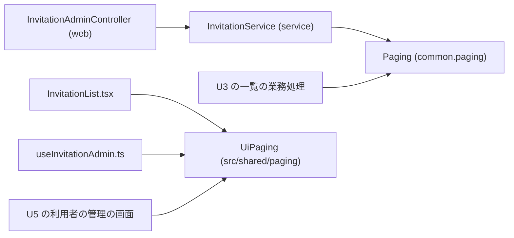

# Logical Components — U2 ページ送りの共通化（u2-shared-paging）

U2 の論理的な部品の一覧と、NFR の作りがどこに当たるかです。アプリは1つの WAR・1台（開発者の PC 上のコンテナ）で、サーバーの部品はどれも同じ JVM の中のパッケージ、画面の部品は同じ画面の束（`dist`）の中のモジュールです（`aidlc/spaces/default/memory/team.md` の Code Style）。U2 は新しい部品を足さず、既存の2つの計算の置き場を移すだけです（要点 1）。出典の略号は `security-design.md` と同じ。作りの中身は `security-design.md` の節を指します。

## 1. 部品の一覧

| 部品 | 置き場 | 新しい・手を入れる・消す | 役目 | 当たる NFR の作り |
|---|---|---|---|---|
| Paging | `common.paging`（`backend/src/main/java/cherry/mastersmith/common/paging/Paging.java`） | 新しい（`InvitationPaging` を移す） | 素のクラスの静的なメソッド4つ（`parsePage`・`pageOf`・`offsetOf`・`PAGE_SIZE`）。契約 C2 の口 | `security-design.md` 2節・3節・4.1・5節（NFR9.1・NFR9.2・NFR3.1・NFR11.1） |
| InvitationPaging | `invitation.domain` | 消す | Paging へ移した後に消す | 同 7節（NFR9.8、残る危険 R1） |
| InvitationService | `invitation.service` | 手を入れる（参照先だけ） | `list`・招待中の重なりで Paging を呼ぶ。検証の空を誤りの結果にし、空にする判定と読み取りの位置を同じ page から導く | 同 2節・3節（NFR9.1〜NFR9.3） |
| InvitationAdminController | `invitation.web` | 変えない | page を `String` で受け、誤りの結果を `VALIDATION_FAILED` に変える。TRACE で page の文字列が出うる | 同 2節・4.2・4.3（NFR9.3・NFR3.1） |
| UiPaging | `frontend/src/shared/paging/paging.ts` | 新しい（`features/invitation/paging.ts` を移す） | 名前つきの export（`PAGE_SIZE`・`PagerDirection`・`PageRange`・`pageCount`・`pageRange`・`correctedPage`・`pagerButtonDisabledAfter`）。契約 C5 の口 | 同 2節・5節（NFR9.1・NFR11.1） |
| features/invitation/paging.ts | `frontend/src/features/invitation/` | 消す | UiPaging へ移した後に消す | 同 5節 |
| InvitationList.tsx・useInvitationAdmin.ts | `frontend/src/features/invitation/` | 手を入れる（import の場所だけ） | UiPaging を使う画面の側 | 同 5節（NFR9.5・NFR11.1） |
| 後の U3 の利用者の一覧の業務処理・controller | `useradmin` の `service`・`web`（U3 の設計） | U3 で作る | Paging の使い手。招待と同じ形で検証と判定を行う | 同 3節・4.2（残る危険 R2・R3） |
| 後の U5 の利用者の管理の画面 | `frontend/src/features/useradmin/`（U5 の設計） | U5 で作る | UiPaging の使い手 | 同 5節 |

## 2. 部品の間のつながり

文字の代替: `InvitationAdminController` は `InvitationService` を呼び、`InvitationService` と後の U3 の一覧の業務処理は Paging を呼ぶ。`InvitationList.tsx`・`useInvitationAdmin.ts` と後の U5 の画面は UiPaging を呼ぶ。Paging と UiPaging はどこも呼ばない（矢印は依存の向き）。

## 3. 障害の範囲

| 部品 | 失敗の形 | 影響の範囲 | 止め方 |
|---|---|---|---|
| Paging | 正しい呼び出しでは失敗しない。1 未満の引数の IllegalArgumentException はプログラムの誤りで、その要求だけが 500 になる | その1件の要求 | parsePage を通った値だけを渡す（3節）。単体テストで固定する |
| Paging の規則の誤り（移すときの書き間違い） | page の受け方・空にする判定がずれる | 招待の一覧と後の利用者の一覧の両方 | 移すテストの事例をすべて残し、性質ベースのテストを足す。招待の既存の結合テストを変更なしで通す（NFR9.5） |
| UiPaging | 例外を投げない計算で、誤りは表示と補正のずれになる | 招待の画面と後の U5 の画面の表示 | 移すテストと fast-check の性質。サーバーの検証が正のため、データの誤りにはならない |

共通にしたことで、規則の誤りの影響が2つの一覧に広がります。その代わり、規則が1か所になり、片方だけ直す食い違いが起きません。広がりはテストで抑えます。

## 4. 共有するもの

| 共有するもの | 共有する部品 | 扱い |
|---|---|---|
| `PAGE_SIZE`（20）と page の規則 | 招待の一覧・後の利用者の一覧（サーバー）、招待の画面・後の U5 の画面 | サーバーと画面で同じ 20 を持つ（契約 C2・C5）。値を変えるときは両方を同じ変更で直す |
| コンパイル済みの `Pattern` | Paging を呼ぶすべての要求 | 不変でスレッド安全。状態は共有しない |
| 内部DB・接続プール | 共有しない | Paging は内部DB に触れない。数える1回と読む1回は呼び出し元の受け持ち（NR の NFR5.1） |

## 5. テストの部品

| テスト | 置き場 | 中身 |
|---|---|---|
| PagingTest | `backend/src/test/java/cherry/mastersmith/common/paging/PagingTest.java` | `InvitationPagingTest` の事例をすべて移し、jqwik の性質3つを足す（`tries = 500`） |
| paging.test.ts | `frontend/src/shared/paging/paging.test.ts` | 今の事例をすべて移し、fast-check の性質4つを足す（既定 100 回） |
| 招待の既存のテスト | 招待のサーバー・画面のテスト（`InvitationRepositoryIT` など） | 参照先と import だけを変え、中身を書き換えない |
| 境界の検査 | 既存の `ArchitectureTest`・`InvitationBoundaryArchitectureTest` | 書き換えない |

テスト用の手伝い（`testsupport`）は足しません。片付けるデータもありません。

## 6. B2 で確かめること

| 確かめること | 方法 |
|---|---|
| Paging・UiPaging の口・引数・結果・例外が今のままであること | コード生成のレビュー（契約 C2・C5 と突き合わせる） |
| page の文字列が TRACE に出うるのが呼び出し元の引数だけであること、要求の行の上限 | コード生成のレビュー（`security-design.md` 4.3） |
| `invitation.domain` と `common.paging` のカバレッジ | `:backend:cleanTest :backend:cleanIntegrationTest` を付けた `./gradlew verify` で実測して記録する |
| 依存・lockfile・警報の決まりが変わらないこと | コード生成のレビュー |

## 7. 上流との差

上流（機能設計・契約 C2・C5・NFR 要件）と違う部品の分け方はありません。`security-design.md` の 11節の S-1（TRACE のログへの出方をこの段で受け入れると決めたこと）だけが読み方の補いです。
