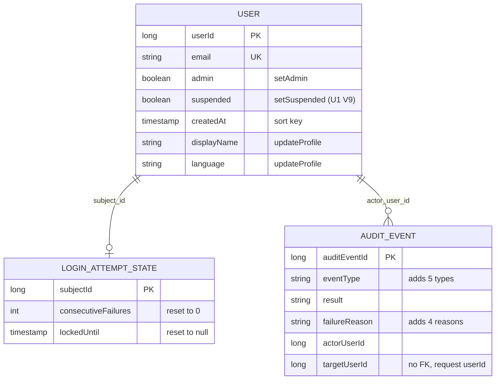

# Functional Spec — U3 利用者の管理の API（u3-user-admin-api）

この文書は、U3 の手順（流れ）と状態の移り変わりの正本である。データの形は `entities.md`、判定の決まりは `rules.md` の YAML が正本で、5節の図と6節の要約はそこから導いた読みやすさのための写しである。出典の略号は `rules.md` の冒頭のとおり。

U3 は種類 service の単位で、`/api/admin/users` の下に7つの API（一覧と、6つの変更）を持つ。新しいパッケージ `useradmin`（部品 UserAdministration）が業務の決まりを持ち、`user`（UserAccount）と `auth`（Authentication）に足す口（C8）と、U1 の口（C1）・U2 の Paging（C2）を使う。監査には出来事で知らせる（C6）。設計は1つの単位として通し、前半 B3 と後半 B4 への分け方はコード生成の計画で決める（8節）。

## 1. 状態の移り変わり

### 1.1 管理者の印（User.admin）

| 今の状態 | きっかけ | 次の状態 | 決まり |
|---|---|---|---|
| 印なし | 印を付ける（拒否されず、確定する） | 印あり | BR4.1 |
| 印あり | 印を外す（拒否されず、確定する） | 印なし | BR4.2・BR3.2 |
| 印あり | 印を付ける | 変わらない（変えるものが無い） | BR2.2 |
| 印なし | 印を外す | 変わらない（変えるものが無い） | BR2.2 |
| どちらでも | 対象が停止中で印を付ける・外す | 変わらない（対象が停止中） | BR2.2 |
| 印あり | 外すと有効な管理者が 0 人になる | 変わらない（最後の有効な管理者） | BR3.2 |
| どちらでも | 管理の API の外・氏名と言語の変更の本文に印の項目を入れる | 変わらない（無視） | BR5.4・BR7.2 |

印を変えてもトークンは無効にしない。印は要求ごとに内部DB から読まれるため、確定の後の対象の次の要求から管理の API の可否が切り替わる（BR4.1・BR4.2）。

### 1.2 停止の状態（User.suspended）

| 今の状態 | きっかけ | 次の状態 | 決まり |
|---|---|---|---|
| 有効 | 止める（拒否されず、確定する） | 停止中。同じ確定でリフレッシュトークンをすべて無効にする | BR4.3 |
| 停止中 | 停止を解く（拒否されず、確定する） | 有効。無効にしたトークンは戻らない | BR4.4 |
| 停止中 | 止める | 変わらない（変えるものが無い） | BR2.2 |
| 有効 | 停止を解く | 変わらない（変えるものが無い） | BR2.2 |
| 有効 | 止めると有効な管理者が 0 人になる | 変わらない（最後の有効な管理者） | BR3.2 |

止めても解いても、失敗回数とロックの状態は変わらない（BR4.3・BR4.4）。

### 1.3 ロックの状態（LoginAttemptState）と一覧の表示

| 表の値（今の時刻 now） | 一覧の locked | lockedUntil | resettable | 失敗回数を戻す操作 |
|---|---|---|---|---|
| 行が無い | 偽 | 無し | 偽 | 変えるものが無い（行は作らない） |
| 失敗回数 0・解除の予定なし | 偽 | 無し | 偽 | 変えるものが無い |
| 失敗回数 n（1 以上）・解除の予定なし | 偽 | 無し | 真 | 0・無しに書く |
| 解除の予定 t・now < t | 真 | t | 真 | 0・無しに書く（ロックが解ける） |
| 解除の予定 t・now ≧ t（t ちょうどを含む） | 偽 | 無し | 真 | 0・無しに書く（M2 B） |

判定は BR1.7、戻す操作は BR4.5。

## 2. 手順

### 2.1 一覧（GET /api/admin/users?page=&q=）

1. 既存の認可（BR7.1）。未認証は 401、管理者でないは 403（アクセスの拒否の監査は既存の入口が残す）。
2. q を SearchText に包む（Bean でない変換の部品、検証しない、BR1.3）。
3. 操作した人の利用者 ID を要求の文脈から読む（BR2.8）。
4. page を Paging の parsePage で検証する。空なら 400 VALIDATION_FAILED（BR1.1）。
5. SearchText の前後の空白を除き、254 コードポイントを超えれば 400 VALIDATION_FAILED（q・TOO_LONG）。除いた後が空なら検索なし（BR1.4）。
6. 読み取りだけのトランザクションを始める（BR1.6）。
7. 条件に当たる全体の件数を数える（BR1.5）。
8. 読み始めの位置（Paging の offsetOf）が全体の件数以上なら、行を読まずに空の items で 10 へ（BR1.1）。
9. 20 件までの行を、登録した日時の古い順・利用者 ID の順に読み（BR1.1）、その利用者 ID のロックの判定の結果を1回の問い合わせで読む（BR1.7）。
10. 行ごとに AdminUser を作り、self を決める（BR1.8）。200 で AdminUserPage を返す。監査は出さない（BR1.9）。

### 2.2 5つの操作に共通の流れ

どの操作も、次の順で進む。どの段で止まったかで応答と監査が決まる（3節の表）。

1. 認可（BR7.1）。401・403 は業務処理を呼ばない。
2. userId を整数として結び付ける。読めなければ 400 VALIDATION_FAILED（監査なし、BR2.7）。
3. 操作した人の利用者 ID と送り手の情報を要求の文脈から読む（BR2.8）。
4. 業務処理のトランザクションを始める（BR4.6）。
5. 行を排他する（操作ごとに違う、2.3〜2.7）。上限切れは Busy で巻き戻し、409 USER_ADMIN_BUSY（監査なし、BR3.5）。
6. 待ち合わせの口を通る（本番は何もしない、BR3.6）。
7. 事実の組（OperationFacts）を作り、拒否の判定の関数で理由を決める（BR2.1・BR2.2）。理由があれば 9 へ。
8. 操作した人を確かめ直す（BR2.5）。外れていれば、理由 NOT_ADMIN として 9 へ（応答は 403 ACCESS_DENIED、BR2.6）。
9. 拒否なら書き込みをせず、失敗の監査の出来事を出して確定する（BR2.4・BR6.1・BR6.3）。
10. 拒否でなければ状態を書き換え（BR4.1〜BR4.5）、成功の監査の出来事を出して確定する。
11. 確定の後に AuditLog が監査の行を1行追記する（書き込みの失敗で応答を変えない、BR6.3）。
12. controller が結果を場合を尽くして応答に写す（BR2.3）。

拒否の判定の関数の形（説明のための擬似コード）:

```text
decide(operation, facts):
  if not facts.targetExists                         -> USER_NOT_FOUND
  if applies(operation, SELF) and facts.targetIsOperator -> SELF_OPERATION
  if operation in {GRANT_ADMIN, REVOKE_ADMIN} and facts.targetSuspended -> TARGET_SUSPENDED
  if noChange(operation, facts)                     -> NO_CHANGE
  if operation in {REVOKE_ADMIN, SUSPEND} and facts.leavesNoActiveAdmin -> LAST_ACTIVE_ADMIN
  return NONE
# applies(op, SELF): 失敗回数を戻す操作だけ偽
# noChange: GRANT=targetAdmin, REVOKE=!targetAdmin, SUSPEND=targetSuspended,
#           RESUME=!targetSuspended, RESET=!targetResettable
```

### 2.3 印を付ける（POST /{userId}/grant-admin）

1. 管理者の印を持つ行と対象の行を、利用者 ID の小さい順に排他する（BR3.1）。上限切れは BUSY。
2. 対象の要約と、排他の後の有効な管理者の集合を得る。
3. 判定: 対象がいない → 自分自身 → 対象が停止中 → すでに管理者（変えるものが無い）。
4. 操作した人が有効な管理者の集合に含まれるかを確かめ直す（BR2.5）。
5. setAdmin(対象, 真)。トークンに触れない（BR4.1）。監査 USER_ADMIN_GRANTED・SUCCESS。

### 2.4 印を外す（POST /{userId}/revoke-admin）

1〜2. 2.3 と同じ。
3. 判定: 対象がいない → 自分自身 → 対象が停止中 → 管理者でない（変えるものが無い）→ 対象を除くと有効な管理者が 0 人（最後の有効な管理者、BR3.2）。
4. 確かめ直し（BR2.5）。
5. setAdmin(対象, 偽)。トークンに触れない（BR4.2）。監査 USER_ADMIN_REVOKED・SUCCESS。

### 2.5 止める（POST /{userId}/suspend）

1〜2. 2.3 と同じ。
3. 判定: 対象がいない → 自分自身 → すでに停止中（変えるものが無い）→ 対象を除くと有効な管理者が 0 人（BR3.2）。対象が停止中の理由は当てない。
4. 確かめ直し（BR2.5）。
5. setSuspended(対象, 真) と revokeAllRefreshTokens(対象) を同じトランザクションで呼ぶ（BR4.3）。ロックの状態は変えない。監査 USER_SUSPENDED・SUCCESS。

### 2.6 停止を解く（POST /{userId}/resume）

1. 対象の行だけを排他する（BR3.3）。上限切れは BUSY。
2. 判定: 対象がいない → 自分自身 → 停止中でない（変えるものが無い）。
3. 操作した人の行を排他なしで読み直し、いて・印を持ち・停止していないかを確かめる（BR2.5）。
4. setSuspended(対象, 偽)。トークンを戻さない（BR4.4）。監査 USER_RESUMED・SUCCESS。

### 2.7 失敗回数を戻す（POST /{userId}/reset-login-failures）

1. 対象の利用者の行を排他なしで読み、いなければ 対象がいない（BR3.4・BR2.7）。負の ID もここで止まり、ダミーの行に触れない。
2. 1段目: 対象のロックの状態の行を排他つきで読む（ログインの判定と同じ行、BR3.4・BR4.5）。上限切れは BUSY（このときだけ、対象がいないかの判定の後に BUSY が来る）。
3. 待ち合わせの口（ロックの状態の行を排他した直後、BR3.6）。
4. 判定: 行が無い・失敗回数 0 → 変えるものが無い。自分自身・対象が停止中は当てない。
5. 操作した人の行を排他なしで読み直す（BR2.5）。
6. 2段目: 失敗回数 0・解除の予定の時刻 無し を明示の更新1回で書く。行を作らない（BR4.5）。監査 LOGIN_FAILURES_RESET・SUCCESS。

### 2.8 氏名と言語の変更（PUT /{userId}/profile）

1. 認可（BR7.1）。userId の形の誤りは 400（BR2.7）。
2. 本文は displayName と language だけを読み、知らない項目を無視する（BR5.4）。
3. 既存のプリファレンスと同じ規則で検証する。誤りは 400 VALIDATION_FAILED（項目の名前と理由だけ、BR5.1）。
4. 氏名（前後の空白を除いた値）と言語の2つの列だけを更新する。行の排他はしない（BR5.2）。
5. 更新した行が 0 なら 404 USER_NOT_FOUND、それ以外は 204（同じ値でも成功）。
6. 操作した人の確かめ直しはしない。監査は出さない（BR5.3）。

入力の誤りと対象がいないことが重なったときは、入力の誤り（400）を返す（自分のプリファレンスの保存と同じ順）。

### 2.9 同時の重なりの例（待ち合わせで作る、BR3.6）

**AC2.1.6 互いの印を外す（有効な管理者は A と B）**

1. A の「B の印を外す」が管理者の行 {A, B} を排他し、数える直前の待ち合わせの口で止まる。
2. B の「A の印を外す」は管理者の行の排他を待つ（A と同じ順で取るため行き詰まらない）。
3. A を進める: 有効な管理者 {A, B} から B を除くと {A} で拒否しない。A は集合に含まれる。B の印を外して確定、監査 SUCCESS。
4. B が排他を得る: 管理者の行は {A}。有効な管理者 {A} から A を除くと空で「最後の有効な管理者」。判定が確かめ直し（B はもう管理者でない）より前のため、理由は LAST_ACTIVE_ADMIN のまま（Q5 A）。409 USER_ADMIN_LAST_ADMIN、監査 FAILURE・LAST_ACTIVE_ADMIN。
5. 有効な管理者はちょうど1人、監査は成功1行・失敗1行。

**AC2.1.12 A が B の印を外す・B が A を止める**、**AC3.1.5 互いに止める**も、止めるが同じ排他の口（BR3.1）を使うため同じ流れになる。

**AC4.1.5 失敗回数を戻す と しきい値に届くログイン（失敗回数はしきい値−1）**

- 戻す側が先に排他を取った場合: 戻す側をロックの状態の行の排他の直後で止め、ログインは同じ行の排他を待つ。戻す側が 0 にして確定 → ログインが 0 から数えて失敗回数 1・ロックなし。
- ログインが先に排他を取った場合: ログインを同じ待ち合わせの口で止め、戻す側は待つ。ログインがしきい値に届いてロックして確定 → 戻す側が排他を得て、失敗回数 1 以上のため戻せると判定し 0・無しにする。失敗回数 0・ロックなし。
- どちらも2つを順に行った結果の一方に一致し、5xx にならない。時刻は注入した時計。

### 2.10 業務処理の層を直接呼ぶテスト（AC2.1.11・AC3.1.9、FR4.4）

API の1件ずつの操作では最後の有効な管理者の拒否は起きない（BR3.2）。そのため業務処理の層を直接呼び、操作した人を C とする。

- C がロック中の管理者: 有効な管理者は {B, C}。C が B の印を外す（止める）と {C} が残り、C は集合に含まれるため受け付ける（ロック中も数える）。
- C が停止中の管理者: 有効な管理者は {B}。C が B の印を外す（止める）と空になり「最後の有効な管理者」で拒否し、状態は変わらない。確かめ直し（C は有効でない）は業務の理由の後のため、理由は LAST_ACTIVE_ADMIN になる（BR2.5）。

## 3. 判定の順と、操作ごとに返りうる応答

左から判定の順（FR7.5・差3・BR2.1）。BUSY と確かめ直しは業務の理由の外（BR3.5・BR2.5）。「―」は当たらない。

| 操作 | 排他の上限切れ | 対象がいない | 自分自身 | 対象が停止中 | 変えるものが無い | 最後の有効な管理者 | 確かめ直し | 成功 |
|---|---|---|---|---|---|---|---|---|
| 印を付ける | 409 USER_ADMIN_BUSY（最初） | 404 USER_NOT_FOUND | 409 USER_ADMIN_SELF_OPERATION | 409 USER_ADMIN_TARGET_SUSPENDED | 409 USER_ADMIN_NO_CHANGE（すでに管理者） | ― | 403 ACCESS_DENIED | 204 |
| 印を外す | 409 USER_ADMIN_BUSY（最初） | 404 USER_NOT_FOUND | 409 USER_ADMIN_SELF_OPERATION | 409 USER_ADMIN_TARGET_SUSPENDED | 409 USER_ADMIN_NO_CHANGE（管理者でない） | 409 USER_ADMIN_LAST_ADMIN | 403 ACCESS_DENIED | 204 |
| 止める | 409 USER_ADMIN_BUSY（最初） | 404 USER_NOT_FOUND | 409 USER_ADMIN_SELF_OPERATION | ― | 409 USER_ADMIN_NO_CHANGE（すでに停止中） | 409 USER_ADMIN_LAST_ADMIN | 403 ACCESS_DENIED | 204 |
| 停止を解く | 409 USER_ADMIN_BUSY（最初） | 404 USER_NOT_FOUND | 409 USER_ADMIN_SELF_OPERATION | ― | 409 USER_ADMIN_NO_CHANGE（停止中でない） | ― | 403 ACCESS_DENIED | 204 |
| 失敗回数を戻す | 409 USER_ADMIN_BUSY（対象がいないの後） | 404 USER_NOT_FOUND | ―（許す） | ―（許す） | 409 USER_ADMIN_NO_CHANGE（戻せない） | ― | 403 ACCESS_DENIED | 204 |
| 氏名と言語 | ―（排他しない） | 404 USER_NOT_FOUND | ―（許す） | ― | ―（同じ値も成功） | ― | ―（しない） | 204 |

どの API も、このほかに 401 AUTHENTICATION_REQUIRED・403 ACCESS_DENIED（認可の入口）・400 VALIDATION_FAILED（userId の形、氏名と言語の検証）を返しうる。監査の残り方は次のとおり。

| 結果 | 5つの操作の監査 | 氏名と言語・一覧 |
|---|---|---|
| 成功 | その種類・SUCCESS | 残さない |
| 業務の拒否（404・409、BUSY を除く） | その種類・FAILURE・理由（USER_NOT_FOUND・SELF_OPERATION・TARGET_SUSPENDED・NO_CHANGE・LAST_ACTIVE_ADMIN） | 残さない |
| 確かめ直しの 403 | その種類・FAILURE・NOT_ADMIN | ― |
| 409 USER_ADMIN_BUSY | 残さない（アプリのログに WARN の code） | ― |
| 400・401 | 残さない | 残さない |
| 認可の入口の 403 | 既存のアクセスの拒否（ACCESS_DENIED・NOT_ADMIN）だけ | 同じ |

## 4. 失敗の場合とふるまい

| 場合 | 応答 | 内部DB | 監査 | 決まり |
|---|---|---|---|---|
| page が 0・数でない・空・桁あふれ | 400 VALIDATION_FAILED | 読まない | 残さない | BR1.1 |
| q が前後の空白を除いて 255 コードポイント以上 | 400 VALIDATION_FAILED（q・TOO_LONG、値は載せない） | 読まない | 残さない | BR1.4 |
| 最後のページより後の page | 200、items 空・total つき | 読み取りだけ | 残さない | BR1.1 |
| userId が整数でない | 400 VALIDATION_FAILED | 変わらない | 残さない | BR2.7 |
| 対象がいない（5つの操作） | 404 USER_NOT_FOUND | 変わらない | FAILURE・USER_NOT_FOUND・対象は要求の ID | BR2.3・BR6.2 |
| 自分自身の印を外す・止める・印を付ける・停止を解く | 409 USER_ADMIN_SELF_OPERATION | 変わらない | FAILURE・SELF_OPERATION | BR2.2 |
| 停止中の利用者の印を付ける・外す | 409 USER_ADMIN_TARGET_SUSPENDED | 変わらない | FAILURE・TARGET_SUSPENDED | BR2.2 |
| すでにそうなっている・戻せない | 409 USER_ADMIN_NO_CHANGE | 変わらない（ロックの状態の行も作らない） | FAILURE・NO_CHANGE | BR2.2・BR4.5 |
| 有効な管理者が 0 人になる | 409 USER_ADMIN_LAST_ADMIN | 変わらない | FAILURE・LAST_ACTIVE_ADMIN | BR3.2 |
| 排他の待ちの上限切れ | 409 USER_ADMIN_BUSY | 巻き戻す | 残さない | BR3.5 |
| 排他を待つ間に操作した人の印が外れた・止められた | 403 ACCESS_DENIED | 変わらない | FAILURE・NOT_ADMIN | BR2.5・BR2.6 |
| 監査の書き込みの失敗 | 元の応答のまま | 元の判定のとおり | 記録されない（アプリのログに ERROR） | BR6.3 |
| 氏名が空・長すぎる・制御文字、言語が ja・en でない | 400 VALIDATION_FAILED（項目の名前と理由） | 変わらない | 残さない | BR5.1 |
| 氏名と言語の変更で対象がいない | 404 USER_NOT_FOUND | 変わらない | 残さない | BR5.2 |
| 氏名と言語の本文に印・停止・失敗回数を入れる | 204（その項目は無視） | 氏名と言語だけ変わる | 残さない | BR5.4 |
| /api/me・/api/me/preferences の本文に印・停止・失敗回数を入れる | 今までどおり | 変わらない | 今までどおり | BR7.2 |
| 想定外の誤り（DB の障害など） | 500（既存のエラー応答） | 巻き戻す | 残らない（確定しないため） | 既存の決まり |

どの応答にも、メールアドレス・氏名・検索の文字・失敗回数・ハッシュ値・トークンを載せない（BR7.5）。

## 5. エンティティの関係（`entities.md` から導いた図）



文字の代替説明: 利用者（USER）1人に、ロックの状態（LOGIN_ATTEMPT_STATE）が0か1件、監査の記録（AUDIT_EVENT）が「操作した人」として0件以上つながる。監査の記録の対象の利用者 ID（targetUserId）は参照の制約を持たず、いない利用者の ID も入る。U3 は表と列を足さない。利用者の印・停止・氏名・言語を書き換え、登録した日時で並べる。ロックの状態は失敗回数を戻す操作で 0 と無しに書く。監査の記録には種類5つと理由4つを足す。図では、この単位に関わる列だけを描いた（ほかの既存の列と、保存しない受け渡しの値は `entities.md`）。

## 6. 決まりの要約（`rules.md` から導いた写し）

| 群 | ID | 要点 |
|---|---|---|
| 一覧と検索 | BR1.1〜BR1.9 | 古い順・ID 順・20 件、最後のページより後は空の 200、停止中と初期管理者を含む、q は SearchText で受け包むだけ、前後の空白を除き 254 まで・空は全件、部分一致・大文字小文字を区別しない・特殊文字は文字どおり、同じ読み取りのトランザクション、ロックは3つの結果だけ、11 の項目と self、監査なし |
| 拒否の判定 | BR2.1〜BR2.8 | 判定の順と最初の理由1つ、操作ごとの当てはまり、code の写し、拒否は書き込みなしで確定、判定の後に操作した人を確かめ直す、外れたら 403 と NOT_ADMIN の監査、ID の形の誤りと対象がいない、操作した人は認証の主体から |
| 排他と最後の管理者 | BR3.1〜BR3.6 | 管理者の行と対象の行を ID 順に排他、有効な管理者の数え方、停止を解くは対象の行だけ、失敗回数はロックの状態の行だけ、上限切れは BUSY で監査なし、待ち合わせの口 |
| 5つの操作の実行 | BR4.1〜BR4.6 | 印はトークンに触れない、止めるはトークンを無効にしロックを変えない、解くはトークンを戻さない、失敗回数は2段で戻し行を作らない、1つのトランザクションで 204 |
| 氏名と言語 | BR5.1〜BR5.4 | プリファレンスと同じ検証、2つの列を後勝ち・同じ値も成功・いなければ 404、監査なし、知らない項目は無視 |
| 監査 | BR6.1〜BR6.4 | 種類5つ・理由6つ、残す項目と残さない値、確定の後に記録、残さない場合 |
| 認可・改ざん・漏えい・構造 | BR7.1〜BR7.6 | 401・403・2xx、管理の API の外から変えられない、書き換えの口は useradmin だけ、伏せ字の型、応答に含めない値、境界テスト |

## 7. この単位の作業（決まりに当たらないもの）

| 作業 | 内容 | 出典 |
|---|---|---|
| スキーマ | 表と列の変更は無い。停止の列は U1 の V9。監査の種類と理由は列挙の値を足すだけで、列の長さ 32 文字に収まる | ADR-006、要点 1・11 |
| カバレッジ | `auth.domain`（LockView の判定）・`auth.repository`（ロックの状態の行の読み出しと戻す更新）・`auth.service` に手が入る。`auth.domain`・`auth.repository` は B1 で `packagesJudgedByTotal` から外れる計画のため、U3 ではパッケージごとの下限（行 80%・分岐 70%）を満たし続ける。`access.domain` は AccessProblemTypes を使うだけで本体を変えないため、作業は付かない（Q6 A）。`audit.repository` は変えない。`useradmin` の各パッケージと `user`・`audit` の既存のパッケージは、すでにパッケージごとの下限の対象 | TP の Testing Posture、要点 13 |
| 監査の3ファイル | `audit` の AuditEventListener・AuditEvent・AuditEventFactory に、出来事の受け取りと写しを足す（ADR-006 の悪い点のとおり大きくなる） | ADR-006 |
| `team.md` の必須テスト | 管理者の印の変更・ロックの解除・最後の管理者の保護（業務処理の層を直接呼ぶテストと待ち合わせの重なり）・管理の API の認可 401／403／200（停止中の管理者を含む）・要求の改ざん・管理の操作の監査・利用者の管理の漏えい（TRACE、q 付き） | TP の Testing Posture |

## 8. 後の段へ渡すこと

### 8.1 B3 と B4 の分け方の目安（決めるのはコード生成の計画）

| Bolt | 入れる目安 | 決まり |
|---|---|---|
| B3 一覧と氏名・言語の変更 | パッケージ `useradmin` の骨組み（web・service・domain、UserAdminProblemTypes と USER_NOT_FOUND、境界テスト）。一覧（C8 findAdminPage・lockViewsOf、SearchText と型の変換の登録、検索）。氏名と言語の変更（C8 updateProfile）。7つの API のうち2つの認可と漏えいのテスト | BR1.x・BR2.7・BR2.8・BR5.x・BR7.1・BR7.4〜BR7.6 |
| B4 管理の操作と最後の管理者の保護 | 拒否の判定の関数と5つの操作（C8 の排他の口・setAdmin・失敗回数の2段の口、C1 の呼び出し）、ほかの5つの code、確かめ直し、待ち合わせの口、監査の出来事（C6）と audit の受け取り、要求の改ざんのテスト、5つの API の認可と漏えいのテスト | BR2.1〜BR2.6・BR3.x・BR4.x・BR6.x・BR7.2・BR7.3 |

- B3 では 404 USER_NOT_FOUND を氏名と言語の変更で使う。ほかの5つの code（409）と OperationResult は B4 で足してよい。
- 漏えいのテスト（UserAdminSecretLeakIT）は B3 で一覧と氏名と言語を、B4 で5つの操作を足す形が自然。
- 監査の種類と理由の列挙の値は B4 で足す（B3 は監査を出さない）。

### 8.2 ほかの段へ

| 論点 | 持ち主の段 |
|---|---|
| 検索の小文字にそろえる範囲（ASCII だけか Unicode か）と、users.created_at の索引の要否（一覧の並びと件数の性能） | nfr-requirements・nfr-design |
| 管理者の行と対象の行の排他で、待った後の問い合わせが確定済みの変更（印が外れた行・新しく付いた行）を数えに含めるか（H2 の排他つきの読み取りの振る舞い） | nfr-design |
| 既存のロックの状態の行の排他の上限切れの例外を受けて Busy に変えた後、トランザクションが巻き戻しの印で確定できない場合の扱い | nfr-design |
| 止める操作のトークンの無効化と、同じ利用者のログインのトークンの追記が、利用者の行の外部キーで待つかの確かめ（待っても向きは一方だけ） | nfr-design |
| 排他の待ちの上限 3000 ミリ秒（上限切れの応答は約 3 秒で NFR5 の 1 秒を超える）を変えるか | nfr-requirements・nfr-design |
| 7つの API の応答時間（1ページ 20 件・ロックの判定の結果の読み出しを含む）と、操作の監査で接続を2本使う経路の同時の数 | nfr-requirements・performance の確かめ |
| ロックの状態の行を排他した直後の待ち合わせの口をログインの判定に足すこと（auth.service の LoginService に手が入る） | code-generation |
| 既存の漏えいのテストの列の一覧に、足す監査の種類・理由で確かめる項目があるかの確かめ | code-generation |
| 画面が理由ごとの文言・自分の行の押せない表示・確かめの表示を出すこと（AC2.1.8・AC2.1.9・AC2.1.13 など） | U5 の functional-design |
| 403 ACCESS_DENIED を受けた画面の共通の扱い（確かめ直しの 403 を含む） | U4 の functional-design |

## 9. 上流との差

承認済みの上流の文書は書き換えず、この段の決定で上流と違う形・上流で決まっていなかった点を書く（PM の決まり）。

| ID | 上流 | 上流の記載 | この単位の設計 | 理由と扱い |
|---|---|---|---|---|
| D1 | ADR-001（`aidlc/spaces/default/intents/260930-user-admin/inception/domain-design/decisions.md`） | `useradmin` は `user`・`auth` の service の口と値の型だけを使う | `useradmin.web` から `access.domain`（AccessProblemTypes）への依存を1本足し、UserAdminBoundaryArchitectureTest に書く（BR7.6） | Q6 A。確かめ直しで外れた操作に既存の 403 ACCESS_DENIED を返すため。共通の code は機能の側で重ねて定義しない決まり（TP の Code Style）に従う。`access.domain` の本体は変えないため、カバレッジの作業は付かない |
| D2 | 契約 C6（`aidlc/spaces/default/intents/260930-user-admin/inception/contract-design/contract-summary.md`）と Open questions | 排他の待ちの上限切れ（USER_ADMIN_BUSY）を監査に残すかは機能設計・NFR 設計で決める | 監査に残さない（C6 の not_recorded に確定、BR3.5・BR6.4） | Q7 A（R-04）。FR7.2 の範囲のままで要件との差を作らない。アプリのログの WARN の code で気づける。契約の文書は書き換えない |
| D3 | 契約 C3 の q の説明 | SearchText の置き場（`common` か `useradmin.domain` か）は U3 の機能設計で決める | `user.domain` の RedactedText の隣に置き、長さの検証もそこに置く（BR1.3・BR1.4） | Q1 A。C8 の findAdminPage は `user` にあり、`user` は `useradmin` に依存できないため、契約の候補の `useradmin.domain` には置けない。C8 の形は変えない |
| D4 | `components.md` の UserAdministration の behaviour | 確かめ直しで有効でなければ「最後の有効な管理者の保護と同じく業務の誤りとして拒否する」 | 403 ACCESS_DENIED を返し、その操作の失敗として理由 NOT_ADMIN で監査に残す（BR2.6） | C8（Contract Design）が「ACCESS_DENIED と同じ扱い」とし、Q6 A で細部を決めた。業務の誤り（409 LAST_ADMIN）にすると、印を失った管理者に「最後の管理者」と誤った理由を示すため |
| D5 | ADR-007 の項目1と `components.md` | 管理者の行を排他した後、操作者の確かめ直しを「有効な管理者を数える前」に行う。範囲は印の操作と止めるの3つ | 確かめ直しは業務の理由の判定をすべて通った後・書き換えの直前に置き、範囲を5つの操作に広げる（BR2.5）。停止を解く・失敗回数を戻すは操作した人の行を排他なしで読み直す | Q5 A。数える前に置くと、AC2.1.6・AC2.1.12 の負けた側が 403 になり、ストーリーの理由（最後の有効な管理者）と食い違う。範囲を広げるのは、外された直後の管理者が権限や利用を戻す操作を通す隙を塞ぐため |
| D6 | 契約 C8 の resetLoginFailures | 1つの口で、行を排他し、戻せるかを判定し、書く。結果は Reset・NothingToReset・Busy | 2段の口に分ける。1段目は行を排他して Ready・NothingToReset・Busy を返し、2段目は同じトランザクションで 0・無しを書く（BR4.5、entities.md の LoginFailureResetPreparation） | Q5 A の確かめ直しの位置（変えるものが無いの判定の後、書く前）を守るため。C8 は「口の名前と結果の型の細部は U3 の機能設計で決めてよい」としている。入出力の値の種類・排他・Busy で返すこと・行を作らないこと・内部の値を渡さないことは変えない |
| D7 | 契約 C8 の lockUserRow の説明と C3 の BUSY の位置 | lockUserRow は「停止を解く・失敗回数を戻すなど」が使う。BUSY は行の排他を取れなかった時点で判定の前に止まる | lockUserRow を使うのは停止を解くだけ。失敗回数を戻すは利用者の行を排他せず、対象の有無を排他なしで読むため、BUSY は「対象がいない」の判定の後に起きうる（BR3.4・BR3.5） | Q4 A（R-07）。どの操作も利用者の行とロックの状態の行を同時に排他しないことで、取る順の決まりを無くし、ログインとの行き詰まりを防ぐ |
| D8 | 契約 C8 | UserAccount の口は findAdminPage・lockAdminRowsInIdOrder・lockUserRow・setAdmin・updateProfile | 排他なしで1人の要約を読む口（例 findAdminSummary）を UserAccount に足す。失敗回数を戻す操作の対象の有無と、停止を解く・失敗回数を戻すの確かめ直しに使う | D5・D7 の結果、排他せずに読む場面ができたため。入出力は利用者 ID と UserAdminSummary（ハッシュ値なし、伏せ字の文字列）で、C8 の決まりの範囲 |
| D9 | 契約 C8 の UserAdminSummary | email は EmailAddress、displayName は DisplayName の型 | email・displayName は文字列で持ち、要約の record の文字列の形で伏せる（entities.md） | 既存の EmailAddress・DisplayName は値の型ではなく、検証と整形の関数だけを持つクラスのため。既存の UserSummary と同じ持ち方にした。伏せる決まり（NFR3）は変わらない |
| D10 | 契約 C3 の Forbidden の応答 | 403 ACCESS_DENIED は「管理者でない。監査に『アクセスの拒否』として残る」 | 認可の入口の 403 はそのまま。加えて、業務処理の確かめ直しの 403 ACCESS_DENIED があり、こちらはアクセスの拒否ではなく、その操作の失敗（NOT_ADMIN）として残る（BR2.6） | D4 と同じ（Q6 A）。応答の code は同じため、画面（U4）の扱いは変わらない |
| D11 | U1 の機能設計の差 D3（`aidlc/spaces/default/intents/260930-user-admin/construction/u1-user-suspension/functional-design/functional-spec.md` 8節） | isSuspended・setSuspended は存在しない利用者 ID で呼ぶと想定外の誤り。U3 の機能設計で確かめる | U3 は止める・停止を解くで、行の排他（BR3.1・BR3.3）で対象がいると確かめてから setSuspended を呼ぶ。いない ID では呼ばない（BR4.3・BR4.4）。isSuspended は使わない（排他の口の要約に停止の状態が載るため） | 確かめた。差は生じない |
| D12 | ストーリーの監査の読み方 | 業務の理由で拒否した操作は、業務のトランザクションが巻き戻っても失敗の監査の行が残る（AuditRollbackIT の形） | 業務の拒否ではトランザクションを巻き戻さず、書き込みなしで確定させ、確定の後に失敗の行を記録する（BR2.4・BR6.3） | 要点 5。結果（失敗の行が残る）は同じ。巻き戻すのは BUSY と想定外の誤りだけで、BUSY は監査に残さない（D2） |
