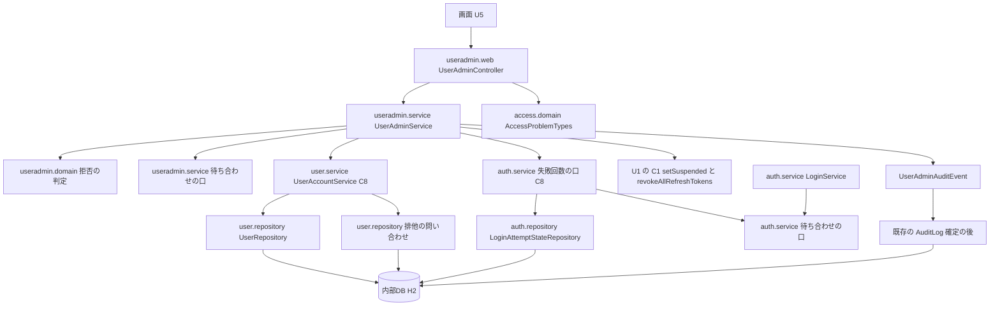

# Logical Components — U3 利用者の管理の API（u3-user-admin-api）

U3 の論理的な部品の一覧と、NFR の作りがどこに当たるかです。アプリは1つの WAR・1台（開発者の PC 上のコンテナ）で、部品はどれも同じ JVM の中のパッケージです（`aidlc/spaces/default/memory/team.md` の Code Style の層の分け方）。U3 は新しい機能のパッケージ `useradmin` を作り、既存の `user`・`auth`・`audit` に口と値を足します。部品の名前のうち「例」と書いたものは、コード生成の計画で決めます。

出典の略号は `reliability-design.md` と同じ。作りの中身は各文書の節を指します。

## 1. 部品

| 部品 | パッケージ | 新しい・手を入れる | 役目 | 当たる NFR の作り |
|---|---|---|---|---|
| UserAdminController・AdminUser・AdminUserPage・ProfileRequest・型の変換の登録（例 UserAdminWebConfig） | `useradmin.web` | 新しい | 7つの API、q を `SearchText` で受ける、結果の型を場合を尽くして `BusinessException` に変える | `security-design.md` 1・3・4・5節（NFR1.1・NFR1.5・NFR3.1〜NFR3.3） |
| UserAdminService（5つの操作と一覧・氏名と言語） | `useradmin.service` | 新しい | `TransactionTemplate` の境界、Busy で `setRollbackOnly()`、確かめ直し、監査の出来事 | `reliability-design.md` 5・7節（NFR4.3・NFR9.5）、`security-design.md` 2節（NFR1.4） |
| 例 UserAdminBarrier・NoOp の既定の部品 | `useradmin.service` | 新しい | 有効な管理者を数える直前の待ち合わせの口 | `reliability-design.md` 6節（NFR4.1・NFR4.4） |
| UserAdminProblemTypeCatalog | `useradmin.service` | 新しい | 起動時の code の一覧 | `security-design.md` 8節（NFR8.1） |
| AdminOperation・RejectionReason・OperationFacts・OperationResult・拒否の判定の関数 | `useradmin.domain` | 新しい | 判定の純粋な関数と結果の型 | `security-design.md` 2節、NFR9.8（性質ベースのテスト） |
| UserAdminProblemTypes・UserAdminAuditEvent | `useradmin.domain` | 新しい | 6つの code、管理の操作の監査の出来事 | `security-design.md` 8節、`observability-design.md` 4節（NFR9.3） |
| SearchText・ProfileUpdate | `user.domain` | 新しい | 伏せ字の型。Locale.ROOT の小文字化とエスケープのパターンを `RedactedText` で返す | `security-design.md` 4・6節（NFR3.1・NFR9.1） |
| UserAccountService の口（findAdminPage・lockAdminRowsInIdOrder・lockUserRow・findAdminSummary・setAdmin・updateProfile）と UserAdminSummary・UserAdminSlice・AdminRowsLock・UserRowLock・ProfileCommand・ProfileUpdateResult | `user.service` | 手を入れる | C8 の口（FS の D6〜D9・D13 を優先）。repository の値を Busy に写す | `reliability-design.md` 2・5.2節（NFR4.1・NFR4.3・NFR4.5）、`performance-design.md` 2節（NFR5.2） |
| UserRepository（一覧の投影・件数・`ilike`・氏名と言語の更新・印の更新・要約の投影） | `user.repository` | 手を入れる | Spring Data の問い合わせ（排他しないもの） | `performance-design.md` 2節、`security-design.md` 6.2 |
| 例 UserRowLockRepository | `user.repository` | 新しい | EntityManager を直接使う排他の問い合わせ（管理者の行と対象の行、対象の行だけ）。上限切れをメソッドの中で受け、クラスの名前だけを WARN に出す | `reliability-design.md` 5.2（NFR4.3）、`security-design.md` 7節（NFR3.1） |
| Authentication の口（lockViewsOf・失敗回数を戻す2段）と LoginFailureResetPreparation | `auth.service` | 手を入れる | C8 の口。1段目の結果を Ready・NothingToReset・Busy に写す | `reliability-design.md` 3節（NFR4.2） |
| 例 LoginAttemptBarrier・NoOp の既定の部品、LoginService | `auth.service` | 新しい・手を入れる | ロックの状態の行を排他した直後の待ち合わせの口。LoginService の実在の利用者の行の排他の直後から呼ぶ | `reliability-design.md` 6節（NFR4.2） |
| LockView | `auth.domain` | 新しい | ロック中か・解除の予定の時刻・戻せるかの3つ | `security-design.md` 5節（NFR3.2） |
| LoginAttemptStateRepository | `auth.repository` | 手を入れる | `subjectId in (:ids)` の読み取り、上限切れを中で受ける排他のメソッド（例 `tryLockForUpdate`）、0・無しの明示の更新。既存の `lockForUpdate` は変えない | `reliability-design.md` 3・5.2節 |
| AuditEventType・AuditFailureReason・AuditEventListener・AuditEvent・AuditEventFactory | `audit.domain`・`audit.service` | 手を入れる | 種類5つと理由4つ、出来事の受け取りと写し | `observability-design.md` 4節（NFR9.3・NFR9.4・NFR10.1） |

手を入れない部品: `common.security`（SecurityFilterChain と `/api/admin/` の判定）、`common.error.web.GlobalExceptionHandler`、`common.observability.TraceAspect`、`access.domain`（使うだけ）、既存の警報の決まり、`compose.yaml`・Dockerfile・`.env.example`。新しい依存・指標・警報・移行は足しません。

## 2. 部品の間のつながり

図の文章による代替: 画面の要求は `useradmin.web` の controller が受け、`useradmin.service` の業務処理を呼ぶ。controller は確かめ直しの 403 のために `access.domain` の `AccessProblemTypes` だけを使う。業務処理は、拒否の判定の純粋な関数（`useradmin.domain`）、数える直前の待ち合わせの口、`user.service` の C8 の口、`auth.service` の失敗回数の2段の口、U1 の C1 の口を呼ぶ。`user.service` は排他しない問い合わせを Spring Data の `UserRepository` に、排他の問い合わせを EntityManager を直接使う `repository` のクラスに頼む。`auth.service` はロックの状態の行を `LoginAttemptStateRepository` で読み書きし、排他の直後に待ち合わせの口を通る。既存の `LoginService` も同じ口を通る。業務処理が出した監査の出来事は、確定の後に既存の AuditLog が内部DB に記録する。`user` から `auth` への矢印と、`user`・`auth` から `useradmin` への矢印は無い。

## 3. 口の約束

### 3.1 C8 の口（FS の D6〜D9・D13 を優先、C8 は書き換えない）

| 口 | トランザクション | 排他 | 上限切れ | 返す値 |
|---|---|---|---|---|
| findAdminPage | 読み取りだけ | しない | ― | UserAdminSlice（投影、ハッシュ値なし） |
| lockAdminRowsInIdOrder | MANDATORY | 管理者の行と対象の行、利用者 ID の昇順、3000 ミリ秒 | Busy（repository の中で受ける） | Locked（対象の要約と有効な管理者の ID の集合。排他の後に別の問い合わせで読む）か Busy |
| lockUserRow（停止を解くだけ） | MANDATORY | 対象の行だけ | Busy | Locked（対象の要約）か Busy |
| findAdminSummary | 呼び出し元に入る | しない | ― | 要約か無し |
| setAdmin | MANDATORY | ― | ― | 無し（明示の更新の問い合わせ） |
| updateProfile | MANDATORY | しない | ― | 結果の型（更新・いない・入力の誤り） |
| lockViewsOf | 読み取りだけ | しない | ― | 利用者 ID ごとの LockView |
| 失敗回数を戻す1段目・2段目 | MANDATORY | ロックの状態の行だけ | 1段目が Busy | Ready・NothingToReset・Busy、2段目は無し |

### 3.2 U1 の C1 への約束（U1 の `logical-components.md` 3節、変えない）

- `setSuspended`・`revokeAllRefreshTokens` は MANDATORY で、呼ぶ前に未反映の変更を書き出し、呼んだ後に持続の文脈を空にする。U3 は投影の値だけを持ち、エンティティを持たないため、口を呼んだ後に古いエンティティを書くことは起きない（`reliability-design.md` 7節）。
- 対象がいるかを C8 の排他の口で確かめてから呼ぶ。いない ID では呼ばない（FS の D11）。
- 止めるときは両方を同じトランザクションで呼ぶ。解くときは `revokeAllRefreshTokens` を呼ばない。
- U3 の側の確かめ（口を呼んだ後に先に読み込んだエンティティを使わない）は、U3 のコード生成の計画に置く。

## 4. 障害の範囲

| 起きること | 及ぶ範囲 | 及ばない範囲 |
|---|---|---|
| 排他の待ちの上限切れ | その操作だけが 409 で巻き戻る | ほかの操作・ログイン（ログインの判定の上限切れの扱いは変えない） |
| 印の操作が重なる | 後の操作が前の確定を待つ（1つずつ通る） | 停止を解く（対象が違えば）・失敗回数を戻す・一覧・氏名と言語 |
| 失敗回数を戻す操作とログインが重なる | 同じ利用者のログインの判定が待つ | ほかの利用者 |
| 止める操作とトークンの更新が重なる | 止める操作がトークンの行を待つ（一方向） | ログインのトークンの追記（外部キーで待たない） |
| 監査の書き込みの失敗 | 監査の行が残らない。アプリのログに ERROR | 操作の応答と結果 |
| 接続プールの2本目の時間切れ | 監査が欠ける（既知の制約） | 操作の応答と結果 |
| 内部DB の障害 | その要求が 500 で巻き戻る | 停止とトークンの無効化が片方だけ残ることは無い |

## 5. 共有するもの

| 共有するもの | 使い方の変化 | 守り |
|---|---|---|
| 内部DB の `users` | 印・停止・氏名・言語の更新、管理者の行の排他、一覧の読み取り | 列と索引を変えない。排他は利用者 ID の昇順 |
| 内部DB の `login_attempt_states` | 失敗回数を戻す操作の排他と更新、一覧のロックの判定の読み取り | ログインの判定と同じ行・同じ上限。行を作らない |
| 内部DB の `refresh_tokens` | 止める操作のまとめての無効化（U1 の口） | 既存の利用者 ID の索引 |
| 内部DB の `audit_events` | 種類5つ・理由4つの行が増える | 列とスキーマを変えない |
| 接続プール（上限 30） | 5つの操作は1件に2本 | `scalability-design.md` 2節 |
| 注入した `Clock` | ロックの判定の今の時刻 | テストは `MutableClock` |
| `TraceAspect` | 新しい層の引数と戻り値も TRACE に出る | 伏せ字の型と、例外を repository の外へ出さない作り（`security-design.md` 4・7節） |

## 6. テストとカバレッジ（NFR9.6〜NFR9.8・NFR11.1）

| 項目 | 設計 |
|---|---|
| 境界テスト | `UserAdminBoundaryArchitectureTest` に、`useradmin` が使ってよい先（`user`・`auth` の service の口と値の型、`useradmin.web` から `access.domain` の1本、`audit` へは出来事だけ）と、書き換えの口の呼び出し元を `useradmin.service` に限ることを書く。既存の `ArchitectureTest` と機能ごとの境界テストは書き換えない。排他の問い合わせを EntityManager で `user.repository` に置く形が既存の層の決まりに合うことも、既存の境界テストが変更なしで通ることで確かめる |
| カバレッジ | `useradmin` の新しいパッケージは自動でパッケージごとの下限（行 80%・分岐 70%）の対象。`auth.domain`・`auth.repository` は B1 で一覧から外れる計画のため、U3 でも下限を満たし続ける。`auth.service`・`user` の各パッケージ・`audit.domain`・`audit.service` はすでに対象。実測は `:backend:cleanTest :backend:cleanIntegrationTest` を付けた `./gradlew verify` |
| 性質ベースのテスト | jqwik を拒否の判定の関数と LockView の判定に当て、失敗時の乱数の種を記録する |
| テストの手伝い | `useradmin/testsupport`（待ち合わせの口のテストの部品）・`auth/testsupport`（ロックの状態の行の口、既存の `SqlStatementCounter`・`MutableClock`、U1 が移す排他の待ちの確かめの手伝い） |

## 7. B3・B4 で確かめること

| Bolt の目安 | 確かめること | 合否の見方 |
|---|---|---|
| B3 | Spring Data の `@Query` が HQL の `ilike ... escape` と SpEL の引数を受け付ける（`security-design.md` 6.2） | 起動と一覧の結合テストが通る。受け付けなければ native の問い合わせに切り替え、差を記録 |
| B3 | 一覧の問い合わせの回数と空のページ | `SqlStatementCounter` |
| B4 | 待った後の数え・同時の重なり（確かめ 1 の本番版） | `reliability-design.md` 2.2 の表 |
| B4 | ログインのトークンの追記が止める操作を待たない（確かめ 3 の本番版） | 止める操作を待ち合わせで止めている間にログインが通る結合テスト |
| B4 | 上限切れの 409・巻き戻し・上限切れの前の書き込みが残らない・TRACE でログに値が出ない（確かめ 4 の本番版） | `reliability-design.md` 5.3 の表 |
| B4 | 既存の漏えいのテストの列の一覧と監査の新しい値 | 既存の `*SecretLeakIT` が変更なしで通るか、足す項目があるかを計画で確かめる |

## 8. 上流との差

この単位の上流との差は、`reliability-design.md` 11節（ND-1〜ND-4）、`security-design.md` 12節（SD-1〜SD-4）、`performance-design.md` 8節（PD-1・PD-2）にまとめました。部品の形のうち、排他の問い合わせを EntityManager を直接使う `repository` のクラスに置く点（ND-1）が、承認済みの機能設計の BR3.5 の書き方と違います。C8・C1 の口の名前・入出力・トランザクションの属性は、機能設計の 9節の D6〜D9・D13 のとおりで変えていません。
