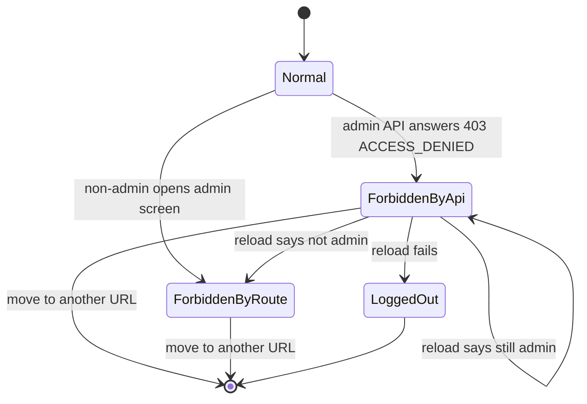

# Functional Spec — U4 管理の画面の 403 の共通の扱い（u4-admin-forbidden-ui）

U4 は、管理の画面すべて（管理の入口・DSL の管理・招待の管理・利用者の管理）で、管理の API から「権限が無い」（403・`ACCESS_DENIED`）を受けたときの表示とログインの状態の読み直しを、画面の骨組み（AppFrame）の1か所にまとめる画面の単位（種類 ui）である。あわせて、管理者が自分自身の氏名・言語を変えたときに画面へ当てる口（U5 が使う）を作る（`aidlc/spaces/default/intents/260930-user-admin/inception/units-generation/unit-of-work.md`）。

- 正本: この文書は、画面の流れ（W1〜W8）と「権限が無い」の表示の状態の移り変わりの正本である。U4 は画面の単位のため、保存するデータ（エンティティ）と `rules.md` を持たない。流れの中で守る決まりは 3節の D1〜D14 に1回だけ書く。部品・props・state・API との受け渡しは `frontend-components.md` に置く。
- 出典: 質問と答え `functional-design-questions.md`（設計の要点 1〜12・決まっていること・Q1〜Q5 はすべて A・まとめの確認は Looks correct）、契約 C4（`aidlc/spaces/default/intents/260930-user-admin/inception/contract-design/contract-summary.md`）、ADR-005・ADR-007 の 3.（`inception/domain-design/decisions.md`）、要件 FR2.2・FR2.3・FR6.3・FR8.1・FR8.2・NFR7・NFR8（`inception/requirements-analysis/requirements.md`）、ストーリー US2.2（AC2.2.1〜AC2.2.6、M5 B、差2）と US5.1（AC5.1.3）（`inception/user-stories/stories.md`）、画面 S6 と 9節の D1（`inception/refined-mockups/mockups.md`）、`interaction-spec.md` の AdminForbiddenNotice、`accessibility-checklist.md`、Bolt の計画の B2（`inception/delivery-planning/bolt-plan.md`）。
- 受け持たないこと: 利用者の管理の画面（U5）、管理の API とサーバー側の 403・監査（U3 と既存のサーバー）、ページ送り（U2）。make-you-chic-ui（`vendor/make-you-chic-ui`）は変更しない（`project.md` の Forbidden）。画面の判定はサーバー側の判定の代わりにしない（`project.md` の Mandated）。

## 1. 用語

| 用語 | 意味 |
|---|---|
| 管理の画面 | サイドバーの管理のメニューから開く、`access: 'ADMIN'` で登録された画面。今は管理の入口（`/admin`）・DSL の管理（`/admin/dsl`）・招待の管理（`/admin/invitations`）。U5 で利用者の管理が加わる |
| 管理の API | パスが `/api/admin/` で始まる API |
| 権限が無い（403） | 管理の API の応答が、状態 403 で code が `ACCESS_DENIED` のもの。判定は `isAdminForbidden`（D1） |
| S6 | 権限が無いときの表示。見出し・「この画面を使う権限がありません」・「ホームへ戻る」。部品の名前は契約 C4 の `AdminForbiddenView`（`interaction-spec.md` の AdminForbiddenNotice と同じもの） |
| 権限が無い URL | 管理の画面が 403 を受けたときに、その画面の URL のパスとして覚える値。別の URL へ移ったら捨てる（D5） |
| 画面の側の印 | 画面が持つ管理者の印（`LoginState.admin`）。トークンの応答（ログイン・更新）からだけ入る。サーバーの判定とは別 |
| ログインの状態の読み直し | 登録済みのトークンの更新を1回呼び、応答の今の印で画面の側の印を新しくすること（D7） |
| 自分の氏名と言語の反映 | 管理者が自分の行の氏名・言語を変えたときに、上の帯の氏名・画面の言語・要求の言語（`Accept-Language`）を変えること。テーマと文字の大きさは変えない（契約 C4 の `useApplyOwnProfile`） |

## 2. 置き場と責務

| 置き場 | 部品 | この単位で足す・変えること |
|---|---|---|
| `frontend/src/shared/api-client/`（既存を広げる） | ApiClient | 判定の関数 `isAdminForbidden`（新しいファイル）。登録済みのトークンの更新を外から1回呼べる関数 `refreshSessionOnce`（Q3 A） |
| `frontend/src/app/admin-forbidden/`（新しい） | AppFrame | 権限が無い URL の状態を持つ `AdminForbiddenProvider`、管理の画面が失敗を渡す口 `useAdminForbidden`、表示の部品 `AdminForbiddenView`、見出しを決める純粋な関数 |
| `frontend/src/app/routing/`（既存を変える） | AppFrame | 振り分けに「権限が無い」を足す（Q2 A） |
| `frontend/src/app/layout/ShellLayout.tsx`（既存を変える） | AppFrame | 権限が無い URL のとき、コンテンツの領域を S6 に置き換える |
| `frontend/src/app/display-settings/`（既存を広げる） | AppFrame | 自分の氏名と言語だけを当てる関数（Q4 A）と口 `useApplyOwnProfile` |
| `frontend/src/app/i18n/messages/`（既存を広げる） | AppFrame | S6 の文言（ja・en） |
| `frontend/src/app/App.tsx`・`app/testing/renderWithProviders.tsx`（既存を変える） | AppFrame | `AdminForbiddenProvider` を並びに足す |
| `frontend/src/features/admin/`・`features/dsl/`・`features/invitation/`（既存を変える） | AdminArea・DslAdminUi・InvitationUi | 403 の扱いを `useAdminForbidden` に渡す形に置き換える（Q1 A） |

- 契約 C4 の未解決の点（関数・部品の名前と置き場）は、判定を `src/shared/api-client/`、表示・状態・口を `src/app/` の下に置くと決めた。名前は C4 のまま（`isAdminForbidden`・`AdminForbiddenView`・`useAdminForbidden`・`useApplyOwnProfile`）。U5 は C4 の名前で使える。
- 機能（`features/*`）は骨組みの口を `src/app/` から読む（今の `app/i18n`・`app/display-settings`・`app/pages` と同じ形）。骨組みは `features/auth` を直接読まない。ApiClient は AppFrame を読まない（今の境界のまま）。

## 3. 決まり（画面の単位の設計の決まり）

画面の単位のため `rules.md` は作らない。流れの中で守る決まりを、ここに D1〜D14 として1回だけ書く。

| ID | 決まり | 出典 |
|---|---|---|
| D1 | 「権限が無い」は、要求のパスが `/api/admin/` で始まり、状態が 403 で、code が `ACCESS_DENIED` のときだけとする。code が無い・違う 403、管理の API の外（`/api/me/` など）の 403、401・ほかの状態・通信の失敗は「権限が無い」としない。判定は副作用の無い純粋な関数 `isAdminForbidden` の1か所で行う | C4、設計の要点 2、AC2.2.3、契約の共通の決まり（403 は `ACCESS_DENIED` だけ） |
| D2 | 管理の画面は、API の失敗を自分の失敗の扱いの入口で `useAdminForbidden` が返す関数に、失敗とその画面の API の根のパスを添えて渡す。関数が true を返したら、その画面は自分の誤りの表示（Alert・一般の文言・「ページが見つかりません」）を出さず、ほかの後始末（読み直しなど）もしない。false なら今までどおり自分で扱う | Q1 A、C4 の `useAdminForbidden` |
| D3 | 関数が true を返したら、同じ描画の中で、その画面の URL を権限が無い URL として覚え、コンテンツの領域を S6 に置き換える。画面の部品は外れるため、一覧・操作・入力は出なくなり、開いていた確かめ・入力の表示（Modal）も閉じる | AC2.2.1、AC2.2.4、画面イメージ S6、設計の要点 4 |
| D4 | 失敗を渡した画面の URL が、渡した時点の今の URL と違うとき（403 の応答が届く前に別の URL へ移ったとき）は、S6 に置き換えない。ログインの状態の読み直し（D7）は行う | 設計の要点 4（URL に結び付ける） |
| D5 | 権限が無い URL は1つだけ持ち、URL のパスが変わったら捨てる。「ホームへ戻る」・サイドバー・ブラウザの戻る、のどれで移っても同じ | 設計の要点 4 |
| D6 | ログインしていて画面の側の印が管理者でない利用者が管理の画面を開いたときは、「ページが見つかりません」ではなく S6 を出す。サーバーには問わない。ログインしていないときは今までどおりログインの画面へ移る | Q2 A、AC2.2.4・AC2.2.5 |
| D7 | 権限が無い URL を新しく覚えたときに、ログインの状態を1回だけ読み直す。読み直しは登録済みのトークンの更新を `refreshSessionOnce` で呼ぶ形で行い、同時の更新（ほかの 403・401 の更新）は ApiClient の今の仕組みで1回にまとまる。同じ URL のまま重ねて届いた 403（DSL の管理が並べて読む3つの要求など）では、読み直しを重ねない | Q3 A、AC2.2.2、設計の要点 6 |
| D8 | 読み直しの結果は、今のログイン状態の知らせ（`subscribe`）で骨組みに届く。印が外れていれば、サイドバーの管理のメニューは今の作り（`visibleWhen: 'ADMIN'`）で消え、開いている管理の画面は D6 で S6 のまま続く。時間の経過では判定しない | AC2.2.2、差2 |
| D9 | 読み直しの失敗（リフレッシュトークンが使えない・通信の失敗）は、今のトークンの更新の失敗と同じ扱い（ログインの状態を消し、ログインの画面へ移る）とする。U4 は新しい扱いを足さない。印を外してもリフレッシュトークンは無効にならないため、印の変更だけではログアウトにならない | FR2.3、AC2.2.3、設計の要点 6・11 |
| D10 | 401 の扱い（`AUTHENTICATION_REQUIRED` での更新と送り直し、`onUnauthenticated`）は今の ApiClient のまま変えない。管理の API の外の画面は今までどおり使える | C4 の behaviour、AC2.2.3、AC3.2.9 |
| D11 | S6 の見出しは、開いている URL に登録されたサイドバーの項目の名前とする。項目は表示の条件（`visibleWhen`）によらず登録から探す（印が外れて管理のメニューが消えた後も同じ見出しにするため）。項目が無い URL は共通の見出し「管理」（en: "Administration"）とする | Q5 A、画面イメージ S6（見出しは残す） |
| D12 | S6 は、見出し・Alert（info）の「この画面を使う権限がありません」（en: "You do not have permission to use this page."）・「ホームへ戻る」（en: "Back to home"）を出す。原因（管理者ではなくなった）は書かない。出したら見出しへフォーカスを移す。「ホームへ戻る」はホームの URL へ読み込み直しなしで移るリンクとする | 画面イメージ S6・9節の D1、`interaction-spec.md` の AdminForbiddenNotice |
| D13 | 自分の氏名と言語の反映は、ログインしているときだけ、上の帯の氏名と画面の言語（文言・`<html lang>`・要求の言語）を変える。テーマと文字の大きさは、そのとき当てている値（見せ方を除く）のまま変えない。ブラウザの保存は言語だけを書き換える。言語の見せ方が残っていれば言語の分だけ捨てる | Q4 A、C4 の `useApplyOwnProfile`、FR6.3、AC5.1.3 |
| D14 | 自分の氏名と言語の反映で当てた値は、今のログイン状態に結び付けて持ち、ログイン状態が新しくなったら（トークンの更新・ログインの応答）新しいほうを使う。どちらもサーバーの値のため食い違わない（今の `applyUserPreferences` と同じ考え方） | 前の Intent の U4 の D8、設計の要点 9 |

## 4. 権限が無いときの表示の状態の移り変わり

URL ごとに、画面の表示は次の状態を移る。

文字の代替:

| 状態 | 意味 | 画面 | 入る時点 | 出る時点 |
|---|---|---|---|---|
| Normal | 管理の画面を管理者として表示している | 各画面の中身 | 管理者が管理の画面を開いた | 403 を受けた（→ ForbiddenByApi）・URL が変わった |
| ForbiddenByApi | 管理の画面が 403 を受け、URL を権限が無い URL として覚えた | S6（ShellLayout がコンテンツの領域を置き換える） | D2・D3 | 読み直しで印が外れた（→ ForbiddenByRoute）、読み直しが失敗した（→ LoggedOut）、URL が変わった（D5） |
| ForbiddenByRoute | 画面の側の印が管理者でない利用者が管理の画面を開いている | S6（振り分けが出す、D6） | 管理者でない利用者が管理の画面を開いた・ForbiddenByApi で読み直しの結果が届いた | URL が変わった |
| LoggedOut | 読み直しが失敗し、ログインの状態が消えた | ログインの画面へ移る（今の振り分け） | D9 | — |

- ForbiddenByApi で読み直しの結果がまだ管理者のままのとき（403 の後に印が付け直されたときなど）は、その URL にいる間は S6 のままとする。別の URL へ移れば、次に開いたときは各画面の中身から始める。
- ForbiddenByApi と ForbiddenByRoute は同じ S6 を出す。移るときに S6 を描き直しても、見出しと文言は同じである。

## 5. 画面の流れ

### W1. 管理者が管理の画面で 403 を受ける（AC2.2.1・AC2.2.4）

1. 管理者 B が管理の画面（入口・DSL・招待、のちに利用者の管理）を開いている。ほかの管理者 A が B の管理者の印を外す。
2. B の画面が管理の API を呼ぶ（画面を開いたときの読み込み・一覧の読み直し・操作・確かめの表示の中の実行のどれでも）。サーバーは要求ごとに内部DB の印を見て 403（`ACCESS_DENIED`）を返し、監査に「アクセスの拒否」を残す（今のサーバーのまま、AC2.2.6）。
3. ApiClient は失敗（`ApiError`）を呼び出し元へ返す。401 ではないため、更新と送り直しはしない（D10）。
4. 画面の失敗の扱いの入口が、失敗と自分の API の根のパスを `useAdminForbidden` の関数に渡す（D2）。関数は `isAdminForbidden` で判定し（D1）、true を返す。
5. 骨組みは、その画面の URL を権限が無い URL として覚え、ShellLayout がコンテンツの領域を S6 に置き換える（D3）。画面の部品は外れ、開いていた確かめ・入力の表示も閉じる。
6. S6 が見出しへフォーカスを移す（D12）。Alert（info）の文言が読み上げられる。
7. 骨組みはログインの状態を1回読み直す（D7、W3）。

### W2. 管理者でない利用者が管理の画面を開く（AC2.2.5・D6）

1. 画面の側の印が管理者でない利用者が、URL を直に打つ・ブックマーク・戻るなどで管理の画面を開く。
2. 振り分けは、ログインしていて管理者でない利用者の管理の画面を「権限が無い」と判定し、ShellLayout の中に S6 を出す。画面の部品は作られず、管理の API は呼ばれないため、ほかの利用者の行は画面に届かない。
3. 画面の側の印がまだ管理者のまま（読み直しの前）の利用者が開き直したときは、画面の部品が作られて API を呼び、W1 の流れで S6 になる（AC2.2.5）。どちらの場合も一覧の行は表示されない。

### W3. ログインの状態の読み直し（AC2.2.2）

1. W1 の 5 で権限が無い URL を新しく覚えたとき、骨組みは `refreshSessionOnce` を呼ぶ（D7）。同じ URL で重ねて 403 を受けても、2回目からは呼ばない。
2. ApiClient は登録済みのトークンの更新（`features/auth` の `refresh`）を、今の「同時の更新を1回にまとめる」仕組みに乗せて呼ぶ。
3. 更新が成功すると、新しいトークンと今の印がログイン状態に入り、`subscribe` の知らせで LoginStateGate が新しい状態を受ける（D8）。
4. 印が外れていれば、サイドバーの管理のメニューが消え、開いている管理の画面は振り分けで S6 のまま続く（W2 の判定）。
5. 更新が失敗したときは、今の更新の失敗と同じくログインの状態が消え、ログインの画面へ移る（D9）。
6. 呼び出し元の画面はこの結果を待たない。S6 への置き換えは読み直しより先に終わっている。

### W4. S6 から移る（D5）

1. 利用者が「ホームへ戻る」を押す（またはサイドバー・ブラウザの戻るで別の URL へ移る）。
2. ホーム（ログインの後の最初の画面）へ読み込み直しなしで移る。URL が変わったため、権限が無い URL は捨てる。
3. 管理の API の外の画面（自分の設定・パスワードの変更など）は今までどおり使え、ログアウトはされない（AC2.2.3）。

### W5. 403 の応答が届く前に別の URL へ移った（D4）

1. 管理の画面 P が API を呼び、応答を待つ間に利用者が別の URL Q へ移る。
2. P の要求に 403 が届く。今の各画面は外れた後の結果を捨てるため、ふつうは関数に渡らない。渡ったときも、渡した画面の URL（P）と今の URL（Q）が違うため、Q を S6 にしない。
3. ログインの状態の読み直しは行う（印が外れていればメニューが消える）。

### W6. 管理の API の外や、ほかの種類の失敗（D1・D10）

- `/api/me/` などの 403、code の無い・違う 403、409・404・400・5xx・通信の失敗は、関数が false を返し、各画面が今までどおり自分で扱う。
- 401（`AUTHENTICATION_REQUIRED`）は今の ApiClient が更新と送り直しを行い、できなければログインの画面へ移る。関数には届かない（送り直しの後も 401 なら、各画面の今の 401 の扱いのまま）。

### W7. 既存の3つの画面の置き換え（AC2.2.4）

| 画面 | 今の 403 の扱い | 置き換えた後 |
|---|---|---|
| 管理の入口（`features/admin`） | 確かめの API（`/api/admin/check`）の 403 を code によらず「ページが見つかりません」にする | 確かめの失敗を関数に渡す。true なら S6（画面は何も出さない）、false なら今の一般の誤りの文言。403 を「ページが見つかりません」にする扱いはなくす |
| DSL の管理（`features/dsl`） | 状態 403 だけで判定し（code は見ない）、画面全体を「ページが見つかりません」にする。確かめの表示は閉じない | 失敗の扱いの入口（今の `checkForbidden`）が、失敗と `/api/admin/dsl` を関数に渡す。true なら S6（確かめの表示も閉じる）、false なら今の扱い。画面の中の「ページが見つかりません」の分かれ道はなくす |
| 招待の管理（`features/invitation`） | 403 を一般の 4xx の文言（`invitation.errorGeneral.client`）で一覧・入力の表示・送り直しの結果に出す。読み直しはしない | 一覧の読み込み・招待・送り直し・取り消しの4つの失敗の扱いが、今の 401 の確かめと並べて、失敗と `/api/admin/invitations` を関数に渡す。true なら S6、false なら今の扱い |

- 3つの画面とも、403 の扱いの変更だけを行い、ほかの振る舞い（文言・読み直し・フォーカス）は変えない。招待の画面は、U2 のページ送りの移設と同じ Bolt（B2）の中で一度だけ直す。
- U5 の利用者の管理の画面も、同じ形（失敗の扱いの入口で関数に渡す）で使う。

### W8. 自分の氏名と言語の反映（AC5.1.3、FR6.3）

1. 管理者 A が利用者の管理の画面（U5）で自分の行の氏名・言語を保存し、成功の応答を受ける。
2. U5 は、変えた行が自分自身のときだけ、`useApplyOwnProfile` の関数に保存した氏名と言語を渡す。
3. 骨組みは、上の帯の氏名を保存した氏名にし、画面の言語を保存した言語にする。文言・`<html lang>`・次からの要求の `Accept-Language` が同じ時点で切り替わる（今の言語の切り替えの仕組み）。
4. テーマと文字の大きさは、そのとき当てている値のまま変えない。ブラウザの保存は言語だけを書き換える（D13）。
5. 次にトークンの更新・ログインの応答が届いたら、その値（サーバーの値）を当てる（D14）。
6. ログインしていないときに呼ばれても何もしない。

## 6. 失敗の場合とふるまい

| 場合 | ふるまい |
|---|---|
| 管理の画面が `/api/admin/` の 403・`ACCESS_DENIED` を受けた | W1。S6 に置き換え、読み直しを1回行う |
| 同じ URL で 403 を重ねて受けた | S6 のまま。読み直しは重ねない（D7） |
| 403 の後の読み直しで、まだ管理者だった | その URL にいる間は S6 のまま。メニューは残る。別の URL へ移れば元に戻る（4節） |
| 読み直しが失敗した（リフレッシュトークンが使えない・通信の失敗） | 今の更新の失敗と同じく、ログインの状態を消してログインの画面へ移る（D9）。U4 では変えない |
| 読み直しと 401 の更新が重なった | ApiClient の今の仕組みで更新は1回にまとまる（D7） |
| 403 の応答が届く前に別の URL へ移った | 移った先を S6 にしない。読み直しは行う（D4、W5） |
| code の無い・違う 403、管理の API の外の 403 | 各画面の今の扱い（一般の誤りなど）。S6 にしない（D1） |
| 管理の画面を骨組みの外（`AdminForbiddenProvider` の外）で描いた | 開発の誤りとして、`useAdminForbidden` を呼んだ時点で例外にする（テストで漏れに気づくため。画面の利用者には起きない） |
| 自分の氏名と言語の反映を、ログインしていないときに呼んだ | 何もしない（D13） |
| 自分の氏名と言語の反映に、ja・en 以外の言語が渡った | 言語は変えず、氏名だけを当てる（保存の検証はサーバー側の U3 が正、画面は今の言語の検証の関数で弾く） |

## 7. 文言

骨組みの文言（`frontend/src/app/i18n/messages/ja.ts`・`en.ts`）に足す。今の `notFound.homeLink`（「ホームへ」）とは別の鍵にする。

| 鍵 | ja | en |
|---|---|---|
| `adminForbidden.message` | この画面を使う権限がありません | You do not have permission to use this page. |
| `adminForbidden.homeLink` | ホームへ戻る | Back to home |
| `adminForbidden.heading` | 管理 | Administration |

- `adminForbidden.heading` は、URL に登録されたサイドバーの項目が無いときの共通の見出し（D11）。項目があればその項目の文言の鍵（`admin.nav.label`・`dsl.nav.label`・`invitation.nav.label`、U5 の項目）を使う。
- 今の3つの画面の見出しは、サイドバーの項目の名前と同じ文言（「管理」・「DSL」・「利用者の招待」）のため、S6 の見出しは各画面の見出しと同じになる。U5 も、利用者の管理の画面の見出しとサイドバーの項目の名前（「利用者の管理」）をそろえる。
- en の「ホームへ戻る」の文言は画面イメージに無いため、この段で "Back to home" と決めた（上流との差、10節）。

## 8. テストの方針

`team.md` の Testing Posture に従う（テストは対象と同じ場所の `*.test.ts(x)`、Vitest・Testing Library（jsdom）・user-event・vitest-axe、画面部品ごとにアクセシビリティの検査を1件、テストの説明文は英語、描画の後に反映される値は `waitFor` で待つ、フロントエンドのカバレッジの下限は行 80%・分岐 70%）。確かめる内容の一覧は `frontend-components.md` の 7節に置く。

- 性質ベースのテスト（fast-check、失敗時の種を記録）: `isAdminForbidden`（パス・状態・code のどの組でも、3つの条件がそろうときだけ true。通信の失敗と知らない値は false）と、見出しを決める関数。
- 403 はテストで差し替えて作る（E2E には初期管理者しかいない。`frontend/e2e/030-admin-access.e2e.ts` は変えない）。各画面のテストは今の偽物の API（ApiClient を通らない）のまま、画面を ShellLayout の中に描いて S6 を確かめる（Q1 A）。
- ログインの状態の読み直しは、ApiClient に登録した偽物の更新（`registerAuthHandlers`）の呼ばれた回数と、ログイン状態の提供元の知らせで確かめる。
- サーバー側の 403 と監査の「アクセスの拒否」（AC2.2.6）は今のサーバーの動作で、この単位では変えない。サーバーのテストは U3 が受け持つ。

## 9. 上流との対応の要約

| 上流 | この文書の置き場 |
|---|---|
| AC2.2.1（一覧と操作を出さない・権限が無い旨・外へ移る手段・確かめと入力の表示を閉じる） | D2・D3・D12、W1、`frontend-components.md` 4節 |
| AC2.2.2（ログインの状態の読み直しとメニュー、時間で判定しない） | D7・D8・D9、W3 |
| AC2.2.3（管理の API の外は使え、ログアウトされない） | D1・D9・D10、W4・W6 |
| AC2.2.4（入口・DSL・招待も同じ表示と読み直し） | D2・D3、W7 |
| AC2.2.5（開き直したときも同じ表示、行を出さない） | D6、W2 |
| AC2.2.6（監査の「アクセスの拒否」） | 今のサーバーのまま（8節）。U3 が確かめる |
| AC5.1.3・FR6.3（自分の言語・氏名が直後から当たる） | D13・D14、W8（U5 が口を呼ぶ） |
| ADR-005（403 の扱いを骨組みに置く） | 2節・D2〜D8 |
| 画面イメージ S6・D1、AdminForbiddenNotice | D11・D12、7節 |
| C4 の未解決の点（名前と置き場） | 2節 |

画面の単位のため、エンティティの関係図と `rules.md` の要約は無い（U4 はアプリが保存するデータを持たない）。

## 10. 上流との差

| # | 上流の記述 | この設計 | 理由 |
|---|---|---|---|
| G1 | 契約 C4 の振り分けには触れていない（管理の画面の 403 の表示だけ）。今の振り分けは、ログインしていて管理者でない利用者の管理の画面を「ページが見つかりません」にする | 振り分けを変え、その場合に S6 を出す（D6）。C4 に無い変更 | Q2 A。読み直しの後に S6 が「ページが見つかりません」に変わると AC2.2.4 と食い違うため |
| G2 | 契約 C4 の exports に、トークンの更新を外から呼ぶ関数は無い | ApiClient に `refreshSessionOnce` を足す（D7）。C4 に無い口 | Q3 A。骨組みは `features/auth` を読めず、差し込み口の型を変えずに読み直すため |
| G3 | ADR-005 の Decision と `unit-of-work.md` の U4 の境界は「ApiClient が管理の API の 403 を知らせ、AppFrame が切り替える」 | ApiClient は知らせない。各画面が失敗を `useAdminForbidden` に渡し、AppFrame が切り替える（D2） | Q1 A。承認済みの契約 C4 の形（呼び出し元が渡す）に合わせた。偽物の API を使う今の画面のテストの形を保てる。ADR の「1か所に集まる」は判定（`isAdminForbidden`）と切り替え（AppFrame）で満たし、各画面には渡す1行が残る |
| G4 | 契約 C4 の `useAdminForbidden` の関数と `isAdminForbidden` は、失敗を `ApiError` の型で受ける | どちらも `unknown` で受け、中で `ApiError` かを確かめる | 3つの画面の失敗の扱いの入口は `unknown` を受けており（catch の値）、呼び出し元での型の決めつけ（`as ApiError`）をなくすため。`ApiError` を渡す呼び出しはそのまま通る（広げる変更で、U5 の使い方は変わらない） |
| G5 | 質問の文書の「書き換える既存のテスト」は5ファイル | ほかに、振り分けのテスト2ファイル（`app/routing/decideRoute.test.ts`・`app/routing/AppRouter.test.tsx` の、管理者でない利用者の管理の画面を「ページが見つかりません」とする確かめ）も書き換える | G1（Q2 A）の帰結。まとめの確認の時点では数えていなかった |
| G6 | 画面イメージ S6 は「ホームへ戻る」の en の文言を決めていない | "Back to home" とした（7節） | 文言を ja・en の両方用意する決まり（`team.md`、NFR8） |
| G7 | `interaction-spec.md` の部品の名前は AdminForbiddenNotice、Props は「なし」 | 部品の名前は C4 の `AdminForbiddenView`。Props は持たない（見出しは骨組みが URL から決める、D11） | C4 の名前を正とした（中身は同じもの） |
| G8 | ストーリーの AC2.2.1 は「管理者ではなくなった（管理の画面を使う権限が無い）旨」 | 文言は原因を書かず「この画面を使う権限がありません」だけ | 画面イメージ 9節の D1（RQ6 C）のまま。画面イメージの段で記録済みの差を引き継ぐ |
| G9 | 管理の入口の今の決まり（403 は code によらず「ページが見つかりません」）と、その性質ベースのテスト | 403 でも code が `ACCESS_DENIED` でなければ一般の誤りの文言にする | D1 の判定の条件（C4）に合わせた |

## 11. 承認の場で確かめたいこと

1. D9: ログインの状態の読み直しが通信の失敗で終わったときも、今のトークンの更新の失敗と同じくログアウトになる（今の `features/auth` の更新は、失敗の種類によらずログインの状態を消す）。403 を受けた直後の通信の失敗でログインの画面へ移ることになるが、U4 では今の扱いを変えない、でよいか。
2. G1・G5: 振り分けの変更で、管理者でない利用者が管理の画面の URL を開くと、「ページが見つかりません」ではなく S6 が出る（管理の画面の URL があることは分かる）。質問の Q2 A のとおりだが、振り分けのテスト2ファイルも書き換えの範囲に入る。
3. G3: ADR-005 と `unit-of-work.md` の「ApiClient が知らせる」は書き換えず、この差の記録で扱う（`project.md` の決まり）、でよいか。
