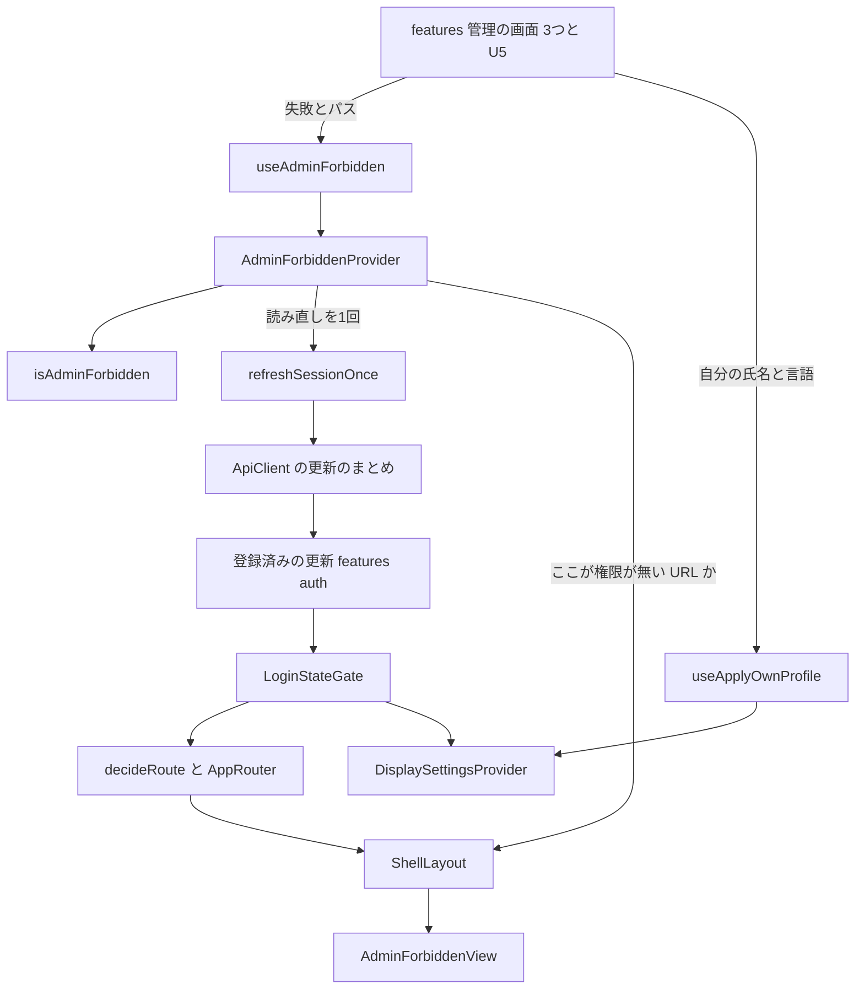

# Logical Components — U4 管理の画面の 403 の共通の扱い（u4-admin-forbidden-ui）

U4 の論理的な部品の一覧と、NFR の作りがどこに当たるかです。U4 の部品は、どれもブラウザの中の1つのタブで動く画面の側のモジュールで、WAR に同梱するフロントエンドのビルドの結果（`dist`）に入ります。サーバー・内部DB・配備の構成に新しい部品はありません。出典の略号は `security-design.md` と同じです。性能の作りは `performance-design.md`、セキュリティの作りは `security-design.md` の節を指します。

## 1. 部品の一覧

置き場と口の名前は、機能設計（FC の 2節・3節）と契約 C4 のとおりです（要点 1）。

| 部品 | 置き場 | 新しい・変える | 役目 | 当たる NFR の作り |
|---|---|---|---|---|
| `isAdminForbidden` と定数 | `shared/api-client/adminForbidden.ts` | 新しい | 「権限が無い」の判定の1か所（純粋な関数） | `security-design.md` 2.2（NFR1.2） |
| `refreshSessionOnce` | `shared/api-client/apiClient.ts` | 変える | 今の `refreshOnce` を外へ出す口。登録が無ければ false | `performance-design.md` 3節（NFR5.1・NFR9.2） |
| `AdminForbiddenProvider`・`useAdminForbidden`・`useIsAdminForbiddenHere` | `app/admin-forbidden/AdminForbiddenProvider.tsx` | 新しい | 権限が無い URL を1つ持つ。状態用と関数用の2つの context。読み直しを重ねない | `performance-design.md` 2節・3節（NFR9.1・NFR9.2）、`security-design.md` 2.4（NFR1.4） |
| `AdminForbiddenView`（と CSS） | `app/admin-forbidden/AdminForbiddenView.tsx` | 新しい | S6 の表示。Props を持たず失敗の値を受け取らない | `security-design.md` 3節・6節（NFR3.1・NFR9.5）、5節（NFR7.1・NFR7.2・NFR8.1） |
| `forbiddenHeadingKey` | `app/admin-forbidden/forbiddenHeading.ts` | 新しい | S6 の見出しの文言の鍵（純粋な関数） | 5節（NFR8.1・NFR9.9） |
| `decideRoute`・`AppRouter` | `app/routing/` | 変える | `ADMIN_FORBIDDEN` を足し、同じ形の木で S6 を描く | `security-design.md` 2.3（NFR1.3）、5節（NFR7.1） |
| `ShellLayout` | `app/layout/ShellLayout.tsx` | 変える | 権限が無い URL のとき子を S6 に置き換える | `performance-design.md` 2.1（NFR9.1）、`security-design.md` 2.1（NFR1.1） |
| `applyOwnProfile`・`applyOwnProfileFor`・`useApplyOwnProfile` | `app/display-settings/` | 新しい・変える | 自分の氏名と言語の反映。呼ばれた時点の最新のログイン状態を ref で読む | `security-design.md` 4節（NFR1.5・NFR3.1・NFR8.2） |
| 文言 `adminForbidden.*` | `app/i18n/messages/ja.ts`・`en.ts` | 変える | S6 の文言（ja・en） | 5節（NFR8.1） |
| `App`・`renderWithProviders` | `app/App.tsx`・`app/testing/renderWithProviders.tsx` | 変える | `AdminForbiddenProvider` を `FeatureRegistryProvider` の内側・`AppRouter` の外側に置く | 7節（NFR9.11） |
| 既存の3つの画面の 403 の扱い | `features/admin/`・`features/dsl/`・`features/invitation/` | 変える | 失敗の扱いの入口から `useAdminForbidden` の関数に渡す1行 | `security-design.md` 2.1（NFR1.1） |
| 表示の設定の組を当てる手伝い | `frontend/e2e/support/loginPreferences.ts` | 変える（テストの補助） | 型に省略できる `displayName` を足す（Q1 A） | 6.2（NFR7.3） |
| 実際のブラウザの検査 130 | `frontend/e2e/130-admin-forbidden-accessibility.e2e.ts` | 新しい（テスト） | S6 の 20 組の検査、コンソールの表示の除き方（Q2 B） | 6節（NFR7.3・NFR3.2） |

変えない部品: `backend/` のすべて、`vendor/make-you-chic-ui`、`frontend/package.json`・`frontend/package-lock.json`、共有の `e2e/support/pageProblems.ts`・`axe.ts`・`displayCombos.ts`・`adminLogin.ts`、E2E の `030-admin-access.e2e.ts`、表示の設定の今の口（`applyUserPreferences`・`setPreview`・`setLanguage`）、ApiClient の要求の送り方と 401 の扱い。

## 2. 部品の間のつながり



図の文章による代替: 管理の画面（features の3つと U5）は、失敗と自分の API の根のパスを `useAdminForbidden` に渡す。Provider は `isAdminForbidden` で判定し、true なら今の URL を覚えて、ShellLayout がコンテンツの領域を `AdminForbiddenView` に置き換える。Provider は同時に `refreshSessionOnce` を1回呼び、ApiClient が登録済みの更新（`features/auth`）を今のまとめの仕組みで呼ぶ。更新の結果は `LoginStateGate` の知らせで、振り分け（`decideRoute`・`AppRouter`）と表示の設定（`DisplaySettingsProvider`）に届く。印が外れていれば振り分けが ForbiddenByRoute として同じ ShellLayout の中に `AdminForbiddenView` を描く。U5 は自分の氏名と言語の保存の成功を `useApplyOwnProfile` で `DisplaySettingsProvider` に渡す。骨組み（`src/app/`）から `features/*` への矢印と、ApiClient（`src/shared/api-client/`）から `src/app/` への矢印は無い。

## 3. 境界と依存（NFR9.12・NFR9.6・NFR9.7）

### 3.1 依存の向き

| 読む側 | 読んでよいもの | 読まないもの |
|---|---|---|
| `features/*` | `src/app/admin-forbidden/` の `useAdminForbidden`、`src/app/display-settings/` の `useApplyOwnProfile`、`src/shared/` | ほかの `features/*` |
| `src/app/admin-forbidden/` | `src/shared/api-client/`、`src/app/` のほかの骨組み（登録・文言・ルーター） | `features/*`（`features/auth` を含む） |
| `src/app/display-settings/` | `src/app/login-state/`、`src/shared/` | `features/*` |
| `src/shared/api-client/` | 自分の中だけ | `src/app/`・`features/*` |

- 骨組みは `features/auth` を直接読めないため、読み直しは ApiClient に登録済みの更新を `refreshSessionOnce` で呼ぶ形にします（FC の 3.2、FS の G2）。
- 今のリンタの設定（`frontend/eslint.config.js`）には import の向きを強制する決まりがありません。そのため、コード生成で U4 が足した・変えたファイルの import を一覧にして、上の表に合うことを確かめて記録します（TS の NFR9.12）。決まりをリンタに足すことは U4 では行いません（既存の全ファイルに効き、U4 の範囲を超えるため）。

### 3.2 依存と make-you-chic-ui

- 新しい依存（実行時・開発時とも）を足しません。`frontend/package.json`・`frontend/package-lock.json` に U4 の分の差分を持たないことを、コード生成で確かめて記録します（NFR9.6）。そのため、ライセンスの確認と OSV-Scanner の対象の変化はありません。
- `vendor/make-you-chic-ui` の中身と固定先を変えません。S6 は今の固定先の `Alert`（`variant="info"` で `role="status"`）だけで作ります。コード生成で `vendor/make-you-chic-ui` に差分が無いことを確かめます（NFR9.7）。

## 4. 障害の範囲

| 起きること | 及ぶ範囲 | 及ばない範囲 |
|---|---|---|
| 管理の画面が 403・`ACCESS_DENIED` を受ける | そのタブのその URL のコンテンツの領域（S6 に置き換わる） | サイドバー・上の帯・管理の外の画面・ほかのタブ・サーバー |
| 読み直しが失敗する | そのタブのログインの状態（消えてログインの画面へ、受け入れ済みの R2） | サーバーの状態・ほかの利用者 |
| 判定の関数に知らない値が渡る | 何も起きない（false、例外を出さない） | 画面の今の誤りの扱いはそのまま |
| Provider の外で `useAdminForbidden` を呼ぶ | 開発の誤りとして例外（テストで気づく） | 利用者の画面には起きない（`App` と `renderWithProviders` が必ず置く） |
| `applyOwnProfile` が古いログイン状態に結び付く（4.2 の仮の場合） | 反映した氏名と言語が捨てられ、サーバーの値が出る | 印・権限・サーバーに保存した値 |
| 130 の検査が失敗する | 統合の前の手元の確かめ（`./gradlew verify` と CI の外） | `./gradlew verify` と CI の合否 |

失敗の範囲は、どれもブラウザの中の1つのタブに閉じます。U4 はデータを保存せず、サーバー・内部DB・ほかのタブに書くものがないため、障害が広がる経路がありません（ブラウザの保存に書く言語は今の口と同じ値で、ほかのタブは今の仕組みのまま読む）。

## 5. アクセシビリティと多言語（NFR7.1・NFR7.2・NFR8.1・NFR8.2）

| 項目 | 作り | 確かめ |
|---|---|---|
| S6 の構造 | `section`（`aria-labelledby` で見出しを指す）、`h1`（`tabIndex={-1}`）、`Alert`（info、`role="status"`）の中に文言と「ホームへ戻る」の `Link` | `AdminForbiddenView.test.tsx` |
| フォーカス | 部品が作られたときだけ（`useEffect`）見出しへ移す。ForbiddenByApi から ForbiddenByRoute へ移っても同じ形の木のため作り直さず、移し直しも起きない | `AdminForbiddenView.test.tsx`（`waitFor` で待つ）、`AppRouter.test.tsx`（同じ要素・フォーカス・サイドバーの開閉が変わらない） |
| 読み上げ | 見出しへのフォーカスで見出しが読まれ、Alert は穏やかな知らせ（status）として続く。`alert` で割り込ませない | 同上（`role="status"` を確かめる） |
| キーボード | 「ホームへ戻る」はリンクで Tab で届く。Enter でホームへ移る | `AdminForbiddenView.test.tsx`（user-event） |
| 部品の検査 | `AdminForbiddenView` に vitest-axe の検査を1件、違反 0 件 | `AdminForbiddenView.test.tsx`（Bolt B2 の完了の条件） |
| 実際のブラウザの検査 | 20 組の axe・はみ出し・`role="status"`・フォーカス（6節） | 130 |
| S6 の文言 | `adminForbidden.message`・`homeLink`・`heading` を ja・en の両方に置く。既定は日本語 | `AdminForbiddenView.test.tsx`（ja・en）、既存の文言の鍵のそろいのテスト |
| S6 の見出し | 登録されたサイドバーの項目の鍵を `visibleWhen` によらず探し、無ければ `adminForbidden.heading` | `forbiddenHeading.test.ts`（例と性質ベースのテスト） |
| 自分の言語の反映 | ja・en だけを当て、それ以外は言語を変えず氏名だけを当てる。当てたら文言・`<html lang>`・`Accept-Language` が今の仕組みで同じ時点に切り替わる | `displaySettingsStore.test.ts`・`DisplaySettingsProvider.test.tsx` |

## 6. 実際のブラウザの検査 130（NFR7.3・NFR3.2、Q1 A・Q2 B）

### 6.1 組み立て

060 と同じ組み立てに、管理の入口の確かめの API の差し替えと、コンソールの表示の見張りを足します（要点 7）。組ごとに1つのテスト（既存の 20 組、`support/displayCombos.ts`）で、次の順に進めます。

| 順 | すること | 使うもの |
|---|---|---|
| 1 | 共有の見張りを張る。続けて 130 の中のコンソールの見張り（6.3）と、管理の API への GET 以外の要求を数える見張りを張る | `watchPage`（変えない）、130 の中の `page.on` |
| 2 | 組の幅・ブランドカラーを用意する | `prepareCombo` |
| 3 | ログインと復元の応答に、組のテーマ・文字の大きさと2語の氏名を当てる（1つの差し替え、6.2） | `routeLoginPreferences` |
| 4 | `GET /api/admin/check` だけを 403・`ACCESS_DENIED` の見本（`application/problem+json`、`detail` に目印の固定の文字）に差し替え、返した回数を数える。GET 以外は差し替えない | 130 の中の `page.route` |
| 5 | 初期管理者でログインし、組が当たったことを確かめる | `loginAsAdmin`・`expectComboApplied` |
| 6 | サイドバーの「管理」から管理の入口を開く。確かめの API が 403 になり S6 が出る | `openSidebarItem` |
| 7 | S6 が出た後の読み直し（POST `/api/auth/session/refresh`）の応答を待ってから確かめる。E2E のサーバーでは初期管理者はまだ管理者のため、S6 のまま続く（残る危険 R1 の形）。読み直しの応答も 3 の差し替えを通るため、2語の氏名と組の値は保たれる | `page.waitForResponse` |
| 8 | 組の確かめ（6.4）をする | `runAxe`・`missingRequiredRules`・`measureHorizontalOverflow` |
| 9 | 「ホームへ戻る」でホームへ移り、S6 が消えたことを確かめる（20 組のうち既定の組の1つだけで足りるが、どの組でも同じ手順のため全組で行ってよい。コード生成の計画で決める） | — |
| 10 | 問題の一覧と要求の数を確かめる（6.4） | — |

- 画面の時間は測らず、記録もしません（`performance-design.md` 4節）。
- 既知の違反の一覧は持たず（空から始める）、どの違反も失敗にします。共有の `support/axe.ts` に一覧を足しません。
- 130 は `./gradlew verify` と CI の外に置き、画面・認証に関わる変更を統合する前とリリースの前に手元で流します。流れの E2E の本数には数えません（NFR9.10）。

### 6.2 2語の氏名の当て方（Q1 A）

Playwright は同じ要求に複数の差し替えを重ねても、先に応答を返した1つしか効きません。組の値と氏名は同じ2本の API の応答に当てるため、共有の手伝いの1つの差し替えで両方を当てます。

```text
// e2e/support/loginPreferences.ts（説明用）
export interface LoginPreferences {
  theme: 'light' | 'dark'
  fontSize: FontSize
  /** 渡したときだけ user.displayName を書き換える（130 だけが渡す） */
  displayName?: string
}
// 書き換え: 値が undefined の項目は重ねない（渡さない呼び出しの動作を今と同じに保つ）
const overrides = Object.fromEntries(
  Object.entries(preferences).filter(([, value]) => value !== undefined),
)
const rewritten = { ...body, user: { ...user, ...overrides } }
```

- 渡さない既存の E2E の動作は変わりません。今この手伝いを読み込む既存の E2E は 060 だけです（`frontend/e2e/` を `routeLoginPreferences` で検索して確かめた。質問の文書の「050〜090 は渡さない」は、手伝いを使わないものも含めた言い方）。`displayName: undefined` を渡したときも、今の氏名を消しません。
- 氏名の値は、空白で区切った架空の2語（ASCII の文字で、実在しそうな氏名にしない）を 130 の中の定数に置きます。make-you-chic-ui の `getInitials` は最初の2語から最大2文字を作るため、上の帯の Avatar の文字が2文字になります。値は注記・添付・標準出力に出しません（`security-design.md` 5節）。
- 頭文字が2文字で描かれたことは、上の帯の Avatar の文字の数（値ではなく長さ）で確かめ、注記には数だけを残します。
- 手伝いのファイルの冒頭の説明に、130 が `displayName` を使うことを書き足します。
- 確かめ: コード生成で、型の変更の後に `./gradlew e2eTest` で 010〜100 と 130 が通ることを確かめて記録します（共有の手伝いに手が入るため、NFR9.10 の既存の E2E の確かめを兼ねる）。

### 6.3 差し替えた 403 のコンソールの表示の除き方（Q2 B）

Chrome は、差し替えた 403 に対して「Failed to load resource: the server responded with a status of 403 (Forbidden)」をコンソールに出します。この文には URL が入らず、URL は表示の位置にだけ入ります。共有の `watchPage` は文字列で集め、既定の除外は未ログインの更新の 401 だけです。共有の見張りは変えず、130 の中の見張りで件数を数えて引きます。

```text
// 130 の中（説明用）。watchPage の後に張る
const excludedTexts: string[] = []
page.on('console', (message) => {
  if (message.type() !== 'error') return
  if (pathOf(message.location().url) !== '/api/admin/check') return // 解けない URL は空のパス
  if (!message.text().startsWith('Failed to load resource:')) return
  excludedTexts.push(`console: ${message.text()}`)
})
// 合否: watch.problems の写しから excludedTexts の各項目を1つずつ取り除き、残りが 0 件
```

- 取り除くのは、位置の URL が `/api/admin/check` の読み込みの失敗の表示と同じ文字の項目を、数えた件数だけです。ほかの URL の同じ文の失敗は、件数で引くため残って見つかります。
- 除いた件数は、差し替えた 403 を返した回数以下であることを確かめ、件数を注記に残します（表示が出ないブラウザの版もありうるため、1件以上は求めない）。
- CSP の違反（`watch.cspViolations`）は除外の対象にせず、0件を求めます。

### 6.4 組ごとの合否

| 確かめること | 合否 |
|---|---|
| axe-core（WCAG 2.0・2.1 の A・AA、`color-contrast` を含む） | 違反 0 件。`REQUIRED_RULES` が走った（`missingRequiredRules` が空） |
| はみ出し | 文書の横の大きさが表示の幅を超えない（幅 375px の6組を含む） |
| S6 の Alert | `role="status"` |
| フォーカス | 読み直しの応答の後も見出しにある |
| 上の帯の Avatar | 文字の数が 2 |
| `detail` の目印 | S6 の画面の文字に含まれない |
| ログインと復元の書き換え | 書き換えた回数が1以上（組と氏名が当たる道を通った） |
| 問題の一覧 | 6.3 で引いた残りが 0 件、CSP の違反 0 件 |
| 管理の API への GET 以外の要求 | 0 件 |

## 7. テストと関門（NFR9.8〜NFR9.11）

| 項目 | 作り |
|---|---|
| 部品のテスト | FC の 7節の一覧のとおり。加えて `DisplaySettingsProvider.test.tsx` に `security-design.md` 4.3 の確かめを足す |
| 性質ベースのテスト | fast-check で `isAdminForbidden`・`forbiddenHeadingKey`、`adminAreaStatus` の書き換え（`ACCESS_DENIED` 以外の 403 も一般の誤り）。失敗時の乱数の種を記録する（NFR9.9） |
| 時刻と待ち | 実時刻と `sleep` に頼らない。描画の後に反映される値は `waitFor` で待つ。テストの時間の上限は原因を確かめずに延ばさない（NFR9.11） |
| 403 の作り方 | DSL の管理・招待の管理は画面に渡す偽物の API、管理の入口は偽物の `fetch`（ApiClient を通る）。`renderDsl`・`renderInvitation`・`AdminAreaPage.test.tsx` の描き方を ShellLayout の中に描ける形に直す（既定は今のまま） |
| 書き換える既存のテスト | FC の 7節の「書き換え」の行（振り分けのテスト2ファイルを含む）。書き換えの範囲はコード生成の計画に書き、書き換えたテストの一覧を記録する |
| `renderWithProviders` | `AdminForbiddenProvider` を同じ位置に置き、今の画面のテストが通り続けることを確かめる |
| カバレッジ | フロントエンドの下限（行 80%・分岐 70%、`frontend/vitest.config.ts` の `thresholds`）を保つ。計測の除外を足さない。U4 の変更の後の値を記録する（NFR9.8） |
| バックエンド | `backend/` に手を入れない。`packagesJudgedByTotal` の一覧とパッケージごとの下限に U4 の作業は無い。`backend/` に差分が無いことを記録する |
| E2E | 流れの E2E を足さない。`030-admin-access.e2e.ts` は変えない。U4 の変更の後に `./gradlew e2eTest` で 010〜100 と 130 が通ることを記録する（NFR9.10） |
| 関門 | `./gradlew verify`（フォーマット・リンタ・ライセンスヘッダー・型・全テスト・カバレッジ・秘密情報・静的解析・依存の脆弱性）を通してから統合する（TM の Way of Working） |

## 8. 共有するものとプラットフォームの視点

| 共有するもの | 使い方の変化 | 守り |
|---|---|---|
| ApiClient の更新のまとめ（`pendingRefresh`） | `refreshSessionOnce` からも乗る | 401 の更新と同じ約束を共有し、更新は1回 |
| ログイン状態（`LoginStateGate`） | 変わらない（読み直しの結果が今の知らせで届く） | U4 は書き換える口を作らない |
| 表示の設定のストア（`savedUser`・ブラウザの保存の言語） | `applyOwnProfileFor` が `savedUser` と言語を書く | 書く値は今の `applyUserPreferencesFor` と同じ種類。氏名は保存しない |
| 骨組みの文言 | 鍵を3つ足す | ja・en をそろえる |
| E2E の共有の手伝い | `loginPreferences.ts` の型に省略できる項目を1つ足す | 渡さない呼び出しの動作を変えない。ほかの手伝いは変えない |
| E2E のアプリ・内部DB・初期管理者 | 130 は状態を変える要求を送らない | 初期管理者の状態を変えない（TM の Testing Posture） |

プラットフォームの視点: 配備先は開発者の PC 上のコンテナで、U4 に基盤の設計の論点はありません（PM の Deployment）。変わるのは WAR に同梱する `dist` の中身だけで、Dockerfile・compose の設定・`.env` の項目・CSP・メモリの上限・ヘルスチェック・戻し方（直前の版のイメージ）は変わりません。スキーマの変更も無いため、戻すときに内部DB の扱いは要りません。

## 9. 上流との差

この単位の上流との差と申し送りは `security-design.md` の 9節（S-1〜S-6）にまとめました。部品の置き場と口の名前・引数・戻り値は、契約 C4 と機能設計の FC の 2節・3節から変えていません。
