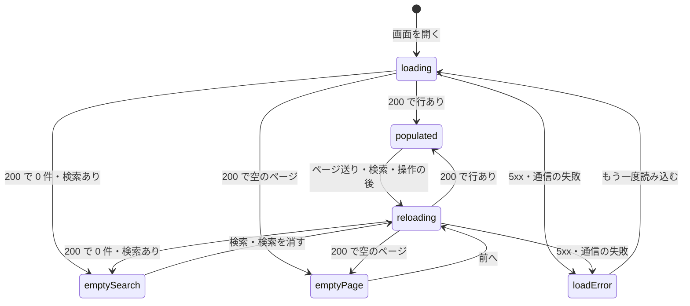
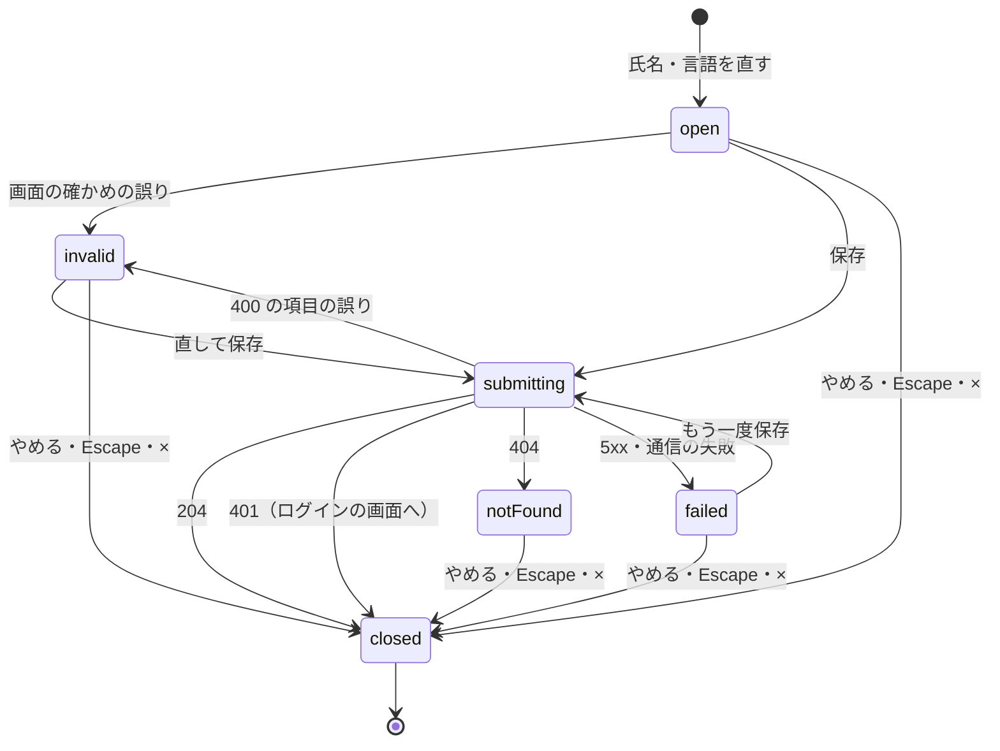

# Functional Spec — U5 利用者の管理の画面（u5-user-admin-ui）

U5 は、管理者が利用者の一覧で状態（管理者の印・利用停止・ロック）を確かめ、利用者を探し、行ごとに管理者の印の付け外し・利用停止と解除・ロックの解除（失敗回数を戻す）・氏名と言語の変更を行う画面の単位（種類 ui）である。画面は S1（一覧）・S2（行の操作のメニュー）・S3（確かめの表示 5 種類）・S4（氏名・言語の入力）・S5（結果の知らせ）で、部品は UserAdminUi（`aidlc/spaces/default/intents/260930-user-admin/inception/units-generation/unit-of-work.md`）。S6（権限が無いときの表示）は U4 の共通の扱いを使う。

- 正本: この文書は、画面の流れ（W1〜W12）と画面の状態の移り変わり（4節）の正本である。U5 は画面の単位のため、保存するデータ（エンティティ）と `rules.md` を持たない。流れの中で守る決まりは 3節に D1〜D20 として1回だけ書く。部品の階層・props と state・`useUserAdmin`・API との受け渡しは `frontend-components.md` に置く。
- 出典: 質問と答え `functional-design-questions.md`（設計の要点 1〜13・決まっていること・Q1〜Q5 はすべて A、まとめの確認は Looks correct）。契約 C3（受ける側、利用者の管理の API）・C4（受ける側、403 の共通の扱いと自分の氏名と言語の反映）・C5（受ける側、画面のページ送り）（`aidlc/spaces/default/intents/260930-user-admin/inception/contract-design/contract-summary.md`）。要件 FR1・FR2・FR3・FR5・FR6・FR8.1・NFR3・NFR7・NFR8・NFR9（`inception/requirements-analysis/requirements.md`）。ストーリー US1.1・US2.1・US2.2・US3.1・US4.1・US5.1 と「画面の共通の決まり（D-1）」・E2E の代表の流れ（M9 A）（`inception/user-stories/stories.md`）。画面 S1〜S6 と `interaction-spec.md`・`design-system-mapping.md`・`accessibility-checklist.md`（`inception/refined-mockups/`）。Bolt B5（`inception/delivery-planning/bolt-plan.md`）。依存する単位の機能設計: U2（`construction/u2-shared-paging/functional-design/`、画面のページ送りの BR2.1〜BR2.5）、U3（`construction/u3-user-admin-api/functional-design/` の質問の答え Q3 A・Q6 A・Q7 A と `entities.md`）、U4（`construction/u4-admin-forbidden-ui/functional-design/functional-design-questions.md` の Q1〜Q5 の答え）。既存のコード `frontend/src/features/invitation/`・`frontend/src/features/preferences/fieldErrors.ts`・`frontend/src/shared/`・`frontend/src/app/`・`frontend/e2e/`・`vendor/make-you-chic-ui` の `Dropdown`・`Table`・`Modal`。
- 受け持たないこと: 利用者の管理の API のふるまい・拒否の判定と順・最後の管理者の保護・監査・認可（U3）、403 の判定と共通の表示とログインの状態の読み直しと自分の氏名と言語を当てる口（U4）、ページ送りの計算（U2）、停止の3つの入口での判定とログインの画面の文言（U1・既存）。make-you-chic-ui・java-mustache-processor の中身は変えない（`project.md` の Forbidden）。

## 1. 用語

| 用語 | 意味 |
|---|---|
| 一覧の応答 | `GET /api/admin/users?page=n[&q=…]` の `AdminUserPage`（`items`・`page`・`size`・`total`）。行は `AdminUser`（C3） |
| 行 | 一覧の1人の利用者（`AdminUser`: `userId`・`email`・`displayName`・`language`・`admin`・`suspended`・`locked`・`lockedUntil`・`resettable`・`registeredAt`・`self`） |
| 今のページ・今の検索の文字 | 画面が表示しているページの番号（1 から）と、検索で使っている文字。どちらも画面の中の状態だけに持ち、URL・ブラウザの保存・履歴に出さない（Q1 A） |
| 自分の行 | 応答の `self` が真の行。操作している管理者自身 |
| 操作 | 行に対する6つの操作。種類の名前は `grantAdmin`（印を付ける）・`revokeAdmin`（印を外す）・`suspend`（止める）・`resume`（停止を解く）・`resetFailures`（ロックを解除＝失敗回数を戻す）・`editProfile`（氏名・言語を直す） |
| 確かめの操作 | `editProfile` を除く5つ。実行の前に S3 を出す（M4 B） |
| 業務の失敗の知らせ | 一覧の上（検索の下）に出す `Alert`（warning）。画面に1つだけ置き、次の操作の開始か [×] で消す |
| 一覧の見出し | 表の上に置く `h2`「利用者の一覧」（`tabIndex=-1`）。make-you-chic-ui の `Table` は `caption` を持てないため、フォーカスの行き先とする（招待の画面の前例）。表そのものにも `aria-label`「利用者の一覧」を付ける |
| 読み直し | 今のページと今の検索の文字のまま一覧を読み直すこと（操作の後・「もう一度読み込む」）。ページ送りと検索は、ページの番号か検索の文字を変えて読む |

## 2. 置き場と登録

| 置き場 | 中身 | この単位で足す・変えること |
|---|---|---|
| `frontend/src/features/useradmin/`（新しい） | 機能 `useradmin` の画面・部品・フック・API の関数・文言・純粋な関数 | すべて新しく足す（`frontend-components.md` の 2節） |
| `frontend/src/features/useradmin/registration.ts`（新しい） | 機能の登録 | 画面 `/admin/users`（`layout: 'SHELL'`・`access: 'ADMIN'`）と、サイドバーの項目「利用者の管理」（en: Users、`visibleWhen: 'ADMIN'`、order 230。「管理」200・「DSL」210・「利用者の招待」220 の次）。画面は遅延読み込み（`lazy`） |
| `frontend/src/shared/api-client/fieldErrors.ts`（移す） | 400 `VALIDATION_FAILED` の項目ごとの誤りを読む純粋な関数 `readFieldErrors` | `frontend/src/features/preferences/fieldErrors.ts` から移す（Q3 A）。ふるまいは変えない。プリファレンスの import とテストの置き場を直す |
| `frontend/.npmrc`（既存） | npm の設定 | `ignore-scripts=true` を足す（`team.md`、設計の要点 12） |
| `vendor/make-you-chic-ui`（サブモジュール） | デザインシステム | 固定先を `3481488` 以降に上げる（中身は変えない。承認を得た専用のコミット、更新前後のハッシュを記録）。上げた直後に `frontend-components.md` 2.5 の表で実際の形を確かめる |
| `frontend/e2e/110-user-admin-flow.e2e.ts`（新しい） | E2E の代表の流れ | 9節のとおり足す。既存の 010〜100 と `e2e/support/` の手伝いは変えない |

- 骨組み（`frontend/src/app/`）のファイルは書き換えない。403 の共通の表示・振り分け・ログインの状態の読み直し・自分の氏名と言語を当てる口は U4 が作り、U5 は使うだけである（C4）。
- 機能どうしの読み込みは作らない。`features/useradmin` は `features/invitation`・`features/preferences` を読み込まず、共通のもの（ページ送り `src/shared/paging/`、日時の書式 `src/shared/format/`、氏名の確かめ `src/shared/validation/`、項目ごとの誤り `src/shared/api-client/fieldErrors.ts`）だけを `src/shared/` から読む。
- API は既存の ApiClient（`frontend/src/shared/api-client/`）を通す。アクセストークン・401 での更新・`Accept-Language` の付与は ApiClient に任せる。

## 3. 決まり（画面の単位の設計の決まり）

| ID | 決まり | 出典 |
|---|---|---|
| D1 | 一覧はサーバーの順（登録した日時の古い順、同じ日時は利用者 ID の小さい順）のまま出し、画面で並べ替えない。1ページ 20 件。ページの数・「n〜m 件目」・前へ／次への可否・空のページの移り先は UiPaging（C5 の `pageCount`・`pageRange`・`pagerButtonDisabledAfter`・`correctedPage`）で求め、画面で計算を持たない | AC1.1.1、C5、U2 の BR2.1〜BR2.4・BR3.5 |
| D2 | 今のページと今の検索の文字は画面の中だけに持つ。画面を開く・再読み込みするたびに1ページ目・検索なしから始める。URL・ブラウザの保存・履歴に出さない | Q1 A、NFR3 |
| D3 | 一覧を読むのは、画面を開いたとき・ページ送り・検索・検索を消す・操作の応答を受けた後・「もう一度読み込む」のときだけ。決まった間隔の読み直しはしない。読み直しごとに番号を増やし、最後に始めた読み直しの答えだけを使う。画面を離れた後の答えは捨てる。今のページと今の検索の文字は、応答 200 を受けたときに、読んだページと検索の文字に置き換える（送る前には書き換えない） | 設計の要点 3、ストーリーの画面の共通の決まり、招待の前例、承認の場の決定（R-04） |
| D4 | ロックの表示は応答の `locked`・`lockedUntil` をそのまま使い、次の読み直しまで変えない。ブラウザの時計で解除の予定の時刻を過ぎたかを判定しない | Q2 A、FR1.2 |
| D5 | 行の操作のメニューに出す項目と押せない項目は、行の `admin`・`suspended`・`resettable`・`self` の4つだけから決める（5節の W4 の表）。ほかの値（`locked` など）や画面の外の状態で決めない | 設計の要点 5、画面イメージ 4節 |
| D6 | 自分の行の「管理者の印を外す」「利用を止める」は、メニューから消さずに押せない形（`aria-disabled="true"`）で出し、理由の文を添えて `aria-describedby` で結ぶ。押しても操作は始まらない（要求・確かめの表示・入力の表示を出さない。メニューが閉じるかどうかは W4 の 4）。画面の表示にかかわらず、サーバー側の拒否（U3）は残す | AC2.1.9・AC3.1.8、M6 B、`project.md` の Mandated |
| D7 | 確かめの操作（5つ）は、実行の前に必ず S3 を出す。「やめる」・Escape・[×] では要求を送らない。背景のクリックでは閉じない。はじめのフォーカスは「やめる」 | AC2.1.8・AC3.1.7・AC4.1.9、M4 B、画面イメージ 5節 |
| D8 | 失敗の文言は、応答の `code` と状態コードから画面が選ぶ。サーバーの `detail`・`title` は画面に出さない。知らない code・code の無い応答・通信の失敗は一般の文言にする | 設計の要点 6、招待の `failureMessage.ts` の前例 |
| D9 | 成功は `Toast`（`role="status"`）だけで知らせる。業務の失敗（404・409）は業務の失敗の知らせ（`Alert` warning）で、理由ごとの文言を出す。どちらも、その後に一覧を読み直す（今のページと今の検索の文字を保つ） | 画面イメージ 7節（S5）、AC2.1.13・AC3.1.11・AC4.1.10 |
| D10 | 読み直しで今のページが空になり全体の件数が 1 以上なら、`correctedPage` が返す最後のページを読む。この読み直しは、1回の読み込み（画面を開く・ページ送り・検索・検索を消す・操作の後の読み直し・もう一度読み込む）につき 1 回までとする。読み直した先も空なら、それ以上読まずに empty-page にする | C5、画面イメージ 7節、承認の場の決定（R-06） |
| D11 | 403 は C4 の `useAdminForbidden` に失敗と要求のパスを渡す。真が返れば、その失敗について画面は何も表示しない（AppFrame が S6 に置き換え、画面の部品は外れて開いていた Modal も閉じる）。偽なら一般の失敗として扱う | C4、U4 の Q1 A、AC2.2.1 |
| D12 | 401 は既存の ApiClient とログインの状態に任せ、画面の文言を出さない。送信中の印を戻し、開いている確かめの表示（S3）・入力の表示（S4）はどちらも閉じる。ApiClient が画面に 401 を返すのは、トークンの更新も失敗してログインの画面へ移るときだけのため | C4 の behaviour、AC3.2.9、承認の場の決定（R-05） |
| D13 | 二重の送信を、次の3つの守りで防ぐ。(1) 送信中は、開いている確かめ・入力の表示のボタンを押せなくし、実行・保存のボタンの名前を「処理中」に変える。(2) 一覧の読み直しの間は、行の「操作」を make-you-chic-ui の `Button` の `loading` にして押しても開かない形にし（`disabled` 属性を付けないためフォーカスは外れない）、読み上げの名前の末尾に「（処理中）」を足す。[検索]・[検索を消す] は `aria-disabled="true"` を付けて押しても何もしない形にする。`Table` のページ送りの [前へ]・[次へ] には押せなくする口が無いため、見た目は押せる形のまま、`onPageChange` の側で押下を捨てる。(3) `useUserAdmin` は、読み直しの最中と送信の最中を参照（`useRef`）で持ち、その間に来た読み直し・ページ送り・検索・検索を消す・操作の選択・実行・保存の呼び出しを捨てる（状態の更新が描画に届く前の二度押しも防ぐ）。D3 の「最後の読み直しの答えだけを使う」は、この3つに加える守りである | ストーリーの画面の共通の決まり、画面イメージ 3.2・5節、承認の場の決定（R-01） |
| D14 | 送信から 5 秒を過ぎても応答が無いときは、確かめ・入力の表示の中に「時間がかかっています」を出す。応答を受けたら消す。時間で要求を打ち切らない | `interaction-spec.md` 3節、`accessibility-checklist.md` 2節 |
| D15 | 検索の文字は、前後の空白（半角・全角を含む White_Space）を除いてから数え、254 コードポイントを超えれば送らずに入力欄の下に上限を知らせる。除いた後が空なら `q` を付けずに全件を読む。送る値は除いた後の値 | U3 の Q3 A、AC1.1.4・AC1.1.11 |
| D16 | 氏名の入力は既存の `validateDisplayName`（前後の空白を除いて空・254 コードポイント超え・Cc と Cf の文字）で保存の前に確かめる。判定はサーバーを正とし、サーバーの 400 の項目ごとの誤りも同じ入力欄の下に出す。入力した値は消さない | FR6.2、AC5.1.4・AC5.1.7、Q3 A |
| D17 | 自分の行の氏名・言語の保存が成功したら、送った値を C4 の `useApplyOwnProfile` に渡し、上の帯の氏名と画面の言語を変える。テーマと文字の大きさは変えない。そのときの成功の Toast は、送った言語を明示して文言を選ぶ（W8 の 3） | AC5.1.3、C4、FR6.3、承認の場の決定（R-02） |
| D18 | 日時（登録した日時・解除の予定の時刻）は応答の ISO 8601 の UTC を受け、既存の `formatDateTime`（`src/shared/format/`）の書式で、画面の言語とブラウザの時間帯で出す。解除の予定の時刻は、ブラウザの時間帯で今日なら時刻と時差の略号だけ、今日でなければ日付つきにする | 設計の要点 10、画面イメージ 3.1、C3 の共通の決まり |
| D19 | 管理者の印・状態・ロック中・「あなた」は、色に加えて `Badge` の文字で示す。印が無い・ロックしていないは「—」で示し、読み上げは「なし」にする | AC1.1.1、画面イメージ 3.1、D-1 |
| D20 | 応答の値（メールアドレス・氏名・検索の文字）を console・ブラウザの保存・URL に出さない。行の「操作」の読み上げの名前には対象の氏名とメールアドレスを入れる（画面の中の表示であり、ログではない） | NFR3、ストーリーの画面の共通の決まり |

## 4. 画面の状態の移り変わり

### 4.1 一覧（S1、`UserAdminPage`）

| 状態 | 表示 | 入る条件 |
|---|---|---|
| loading | 行の形の置き換え（支援技術から隠す）と「利用者を読み込んでいます…」（`role="status"`）。表に `aria-busy="true"` | 画面を開いた（まだ一度も読めていない） |
| reloading | 前の行を残し、一覧の上に「読み込んでいます…」（`role="status"`）。表に `aria-busy="true"`。行の「操作」・検索・ページ送りは押しても何もしない（作り方は D13 の (2)・(3)） | 一度読めた後の読み直し・ページ送り・検索 |
| populated | 一覧と、ページの状態「n / m ページ（全 k 件）」 | 一覧の応答 200 で `items` が1件以上 |
| empty-search | 「「〔検索の文字〕」に当たる利用者はいません。」と「検索を消す」の案内 | 応答 200・`total` が 0・検索の文字がある |
| empty-page | 「このページに利用者はいません」と全体の件数。今のページが 2 以上なら [前へ] で戻れる | 応答 200・`items` が 0・`total` が 1 以上で、`correctedPage` が移り先を返さないとき、または D10 の読み直しを 1 回した後も空のとき |
| load-error | 前の行は出さず、`Alert`（error）「利用者の一覧を読み込めませんでした」と「もう一度読み込む」 | 一覧の 5xx・通信の失敗・読めない本文・400 以外の想定外の 4xx |

- empty-page に入るのは競合のときだけである。今のページが最後のページより後になったときは、D10 で最後のページへ自動で移るため、ふつうは入らない。入るのは、(1) D10 で移った先を読む間に、ほかの管理者の操作などで件数がさらに減ったとき（2つの応答の間で件数が変わったとき）と、(2) サーバーが返した全体の件数と行が食い違ったとき（同じ応答の中で、件数を数えた後に行が減ったとき）だけ。画面イメージ 3.5（空のページを示し [前へ] で戻る）は、この競合のときの表示として残し、ふつうの「件数が減った」場合は 3.5 の表示を出さずに最後のページを見せる（差は 10節の (j)）。テストは、一覧の API の偽物が 2 回続けて空の行と 1 以上の件数を返す形で、読み直しが 1 回で止まり empty-page になることを確かめる。
- 検索なしで `total` が 0 になることは無い（見ている管理者自身がいる、AC1.1.10）。万一 0 なら empty-page と同じ表示にする。
- 一覧の 400 `VALIDATION_FAILED`（検索の文字・ページの番号の誤り、AC1.1.5）は状態を変えず、前の表示のまま、検索の入力欄の下に誤りの文言を出す（W3）。
- 一覧の 403 は D11、401 は D12。どちらも状態を変えない。

文字の代替: 画面を開くと loading になり、応答で populated・emptySearch・emptyPage・loadError のどれかになる。一度表示した後のページ送り・検索・操作の後の読み直しは reloading（前の行を残す）を通って同じ4つのどれかになる。loadError からは「もう一度読み込む」で loading に戻る（前の行を出さないため）。403 は図の外で、AppFrame が画面ごと S6 に置き換える。

### 4.2 確かめの表示（S3、`ConfirmActionDialog`）

| 状態 | 表示 | 入る条件 |
|---|---|---|
| closed | 出さない | 既定。やめる・Escape・[×]・応答を受けた |
| open | 見出し・対象の氏名とメールアドレス・効き目の文・「やめる」・実行のボタン | メニューで確かめの操作を選んだ |
| submitting | 両方のボタンを押せない。実行のボタンの名前は「処理中」。5 秒を過ぎたら「時間がかかっています」 | 実行を押した |

- submitting の間は Escape・[×] でも閉じない（応答を待つ）。
- 応答を受けたら、結果（成功・失敗・403・401）にかかわらず閉じる。403 は AppFrame の置き換えで閉じる（D11）。401 は閉じたうえで ApiClient に任せる（D12。S4 も同じ扱いで閉じる）。

### 4.3 氏名・言語の入力（S4、`EditProfileDialog`）

| 状態 | 表示 | 入る条件 |
|---|---|---|
| closed | 出さない | 既定。保存の成功・やめる・Escape・[×]・401（D12） |
| open | 今の氏名と言語が入った入力。はじめのフォーカスは氏名 | メニューで「氏名・言語を直す」を選んだ |
| invalid | 入力欄のすぐ下に誤りの文言（`aria-invalid`・`aria-describedby`）。入力は消さない | 画面の確かめの誤り・サーバーの 400 の項目ごとの誤り |
| submitting | 「保存」と「やめる」を押せない。「保存」の名前は「処理中」。5 秒を過ぎたら「時間がかかっています」 | 保存を押した（画面の確かめを通った） |
| not-found | 表示の中に「対象の利用者が見つかりません。一覧を読み直してください。」。「保存」は押せない。「やめる」で閉じる | 応答 404 `USER_NOT_FOUND` |
| failed | 表示の中に一般の失敗の文言。入力は残し、もう一度保存できる | 5xx・通信の失敗・知らない code・項目に結び付かない 400 |

文字の代替: 入力を開くと open。画面の確かめで誤りがあれば invalid、通れば submitting。204 で閉じ、401 でも閉じ（ApiClient がログインの画面へ移す。S3 と同じ扱い）、400 の項目の誤りは invalid、404 は notFound（保存を押せない）、5xx・通信の失敗は failed（もう一度保存できる）。submitting 以外ではやめる・Escape・[×] で閉じる。403 は AppFrame の置き換えで閉じる。

### 4.4 行の「操作」（S2、`UserRowActions`）

| 状態 | 表示 | 入る条件 |
|---|---|---|
| closed | 「操作」ボタンだけ。読み上げの名前は「〔氏名〕（〔メールアドレス〕）の操作」 | 既定 |
| open | その行の項目のメニュー（W4 の表） | ボタンを押す・Enter・Space・↓ |
| busy | 「操作」の `Button` を `loading` にする（スピナーを出し、`aria-disabled="true"`・`aria-busy="true"` を付け、`disabled` 属性は付けない）。押す・Enter・Space でもメニューは開かない。フォーカスは外れない。読み上げの名前は「〔氏名〕（〔メールアドレス〕）の操作（処理中）」 | 一覧の reloading の間、またはその行への要求の送信中 |

- busy の作りの根拠（今の固定先 `077f5b4` のソースで確かめた）: `Dropdown` は `trigger` の要素を `cloneElement` で複製し、その要素の props の `onClick` を「開く・閉じる」の関数で上書きする。このため呼ぶ側が自分の `onClick` で押下を止めることはできない。一方 `Button` は、受け取った props の `onClick` を自分の押下の処理の中から呼び、`loading` が真のときは呼ばずに戻る。したがって `trigger` に渡す `Button` を `loading` にすると、`Dropdown` が渡した「開く」の関数も呼ばれず、メニューは開かない。`loading` は `disabled` 属性を付けないため、フォーカスはボタンに残る。固定先を上げた後もこの形が保たれるかは `frontend-components.md` 2.5 の表で確かめる。
- 守りとして、`busy` の間に項目の選択が届いても `onSelect` は呼ばない（ふつうは起きない。メニューを開いた状態から読み直しが始まる道は無い）。

## 5. 画面の流れ

### W1. 画面を開き、一覧を読む

1. 管理者がサイドバーの「利用者の管理」を押す（または `/admin/users` を開く）。骨組みが `access: 'ADMIN'` の振り分けを行う（管理者でない人には U4 の S6、U4 の Q2 A）。
2. 画面は今のページを 1、今の検索の文字を空にして、loading で `GET /api/admin/users?page=1` を送る（D2・D3）。
3. 応答 200 で、`items` を表に並べる（D1）。列はメールアドレス・氏名（自分の行は「あなた」の `Badge` を添える）・管理者（[管理者] か「—」）・状態（[有効] か [利用停止]）・ロック（[ロック中] と「〔時刻〕まで」か「—」、D4・D18）・登録した日時（D18）・操作。長いメールアドレス・氏名は列の中で折り返す（切り詰めない）。
4. ページの状態「n / m ページ（全 k 件）」を `Table` の `labels.pageStatus` で画面の言語で出す。件数の範囲（`pageRange`）を `role="status"` で読み上げる。
5. 4.1 の表のとおり、0 件・空のページ・失敗の状態にする。load-error では「もう一度読み込む」で今のページと今の検索の文字のまま loading から読み直す（AC1.1.9）。

### W2. ページ送り

1. 管理者が `Table` の [前へ]・[次へ] を押す。押せるかどうかは `Table` が今のページと全体の件数から決める（1ページ目の [前へ]・最後のページの [次へ] は `disabled`）。読み直しの間に押されたときは、`onPageChange` の側で捨てて何もしない（D13 の (2)・(3)）。
2. 業務の失敗の知らせを消し、今の検索の文字を保ったまま、新しいページの番号で reloading にして読む（AC1.1.10 の「ページを送っても検索の文字は保たれる」）。今のページは応答 200 を受けたときに置き換える（D3）。
3. 読み終えたら、`pagerButtonDisabledAfter(押した向き, 読んだページ, 全体の件数)` で、押したボタンが読んだ先のページで押せなくなったかを求める。押せなくなったとき（1ページ目に着いた [前へ]・最後のページに着いた [次へ]）だけ、フォーカスを一覧の見出しへ移す。押せるままなら、フォーカスは押したボタンに残す。`pagerButtonDisabledAfter` は押せるかを決める道具ではなく、フォーカスの移し先を決める道具である（招待の画面の前例、U2 の BR2.4。差は 10節の (i)）。
4. 応答の `items` が空で `total` が 1 以上なら D10 で最後のページを読む（1 回まで）。

### W3. 検索と検索を消す〔Should〕

1. 管理者が検索の入力欄（見える label「検索」、説明「メールアドレスまたは氏名の一部。前後の空白を除いて 254 文字まで」を `aria-describedby`）に文字を入れ、[検索] か Enter を押す。
2. 画面は D15 で文字を確かめる。上限を超えれば送らず、入力欄の下に「検索の文字は 254 文字までにしてください。」を出し（`aria-invalid`）、一覧は変えない（AC1.1.11）。
3. 通れば、業務の失敗の知らせを消し、除いた後の値とページ 1 で reloading にして読む（AC1.1.10）。除いた後が空なら検索なしと同じ（`q` を付けない）。今のページと今の検索の文字は、応答 200 を受けたときに、読んだページ（1）と送った値に置き換える（D3。送る前には書き換えない）。
4. 応答 200 で 0 件なら empty-search（AC1.1.10）。結果の件数の変化（「全 k 件」）を `role="status"` で読み上げる。
5. 応答 400 `VALIDATION_FAILED`（サーバーの上限など、AC1.1.5）なら、一覧の表示は前のまま変えず、入力欄の下に「検索の文字が正しくありません。」を出す。今のページと今の検索の文字は、どちらも送る前の値に戻る（3 のとおり 200 を受けるまで書き換えないため。たとえば 3 ページ目を見ていたなら、今のページは 3 のままで、次の [次へ] は 4 ページ目を読む）。検索の入力欄の値は入れたまま残す。
6. [検索を消す] は入力欄を空にし、検索なし・ページ 1 で読む（今のページと今の検索の文字は 200 を受けたときに置き換える）。入力欄の誤りの文言も消す。
7. 検索の後もフォーカスは入力欄に残す。読み直しの間は [検索]・[検索を消す]・Enter を押しても何もしない（`aria-disabled="true"`。`disabled` 属性は付けず、[検索] を押した後のフォーカスを外さない。D13）。

### W4. 行の操作のメニューを開く

1. 管理者が行の「操作」を押す（Enter・Space・↓ でも開く）。メニューは make-you-chic-ui の `Dropdown`（固定先を `3481488` 以降に上げた版の `disabled`・`description`）で出す。行が busy の間は、「操作」の `Button` が `loading` のため開かない（4.4・D13）。
2. 項目は次の表のとおり、行の4つの値だけから決める（D5）。並びは表の上からの順。

| 項目（ja） | 操作の種類 | 出す条件 | 押せない形で出す条件と理由の文 |
|---|---|---|---|
| 管理者の印を付ける | grantAdmin | `admin` が偽 かつ `suspended` が偽 | —（自分の行は `admin` が真のため出ない） |
| 管理者の印を外す | revokeAdmin | `admin` が真 かつ `suspended` が偽 | `self` が真: 「自分自身の印は外せません」 |
| 利用を止める | suspend | `suspended` が偽 | `self` が真: 「自分自身は止められません」 |
| 停止を解く | resume | `suspended` が真 | — |
| ロックを解除（失敗回数を戻す） | resetFailures | `resettable` が真（ロック中かどうかによらない、M2 B） | —（自分の行も押せる、AC4.1.7） |
| 氏名・言語を直す | editProfile | いつでも（自分の行を含む） | — |

3. 停止中の行には印の項目を出さない（先に停止を解く、AC2.1.10）。停止中でも `resettable` が真ならロックの解除を出す（AC4.1.8）。
4. 押せない項目にもキーボードのフォーカスが移り、理由の文が読み上げられる（`Dropdown` の `description` を `aria-describedby` で結ぶ）。押せない項目を押しても `onSelect` は呼ばれず、操作は始まらない（D6）。メニューが開いたままかどうかは make-you-chic-ui の作りに従う。依頼（`make-you-chic-ui-request.md` の R1）は「開いたまま」だが、今の固定先 `077f5b4` の `Dropdown` は項目の選択で必ず `onClick` の後にメニューを閉じてフォーカスを「操作」へ戻す（`MenuItem` に `disabled` が無い）。固定先を上げた直後に実際の形を確かめ、閉じる形であっても、`onSelect` が呼ばれずフォーカスが「操作」へ戻るなら U5 で受け入れる（`frontend-components.md` 2.5 の表）。
5. 押せる項目を選ぶと、メニューを閉じ、確かめの操作なら W5、`editProfile` なら W7 へ進む。Escape ではメニューを閉じて「操作」ボタンへフォーカスを戻す。
6. この関数（行の値から項目と押せなさを決める）は純粋な関数にし、性質ベースのテスト（fast-check）で次を確かめる（設計の要点 5）。
   - `self` が真の行では、「印を外す」「止める」は出るときは必ず押せない形である。
   - `suspended` が真の行には印の項目（grantAdmin・revokeAdmin）が出ず、suspend も出ず、resume が出る。
   - `resettable` が偽なら resetFailures が出ない。真なら出て押せる。
   - editProfile は必ず出て押せる。grantAdmin と revokeAdmin は同時に出ない。suspend と resume はちょうど1つ出る。

### W5. 確かめの表示と実行（印を付ける・外す・止める・停止を解く・ロックを解除）

1. 選んだ操作と行の値で S3 を開く（open）。見出し・効き目の文・実行のボタンの文言と見た目は 7.3 の表。対象の氏名とメールアドレスを示す（AC2.1.8・AC3.1.7・AC4.1.9）。`aria-labelledby` と `aria-describedby` は `Modal` が自分で付ける（見出しの `span` と、本文の領域の全体）。画面の側では付け直さない。本文の領域には対象と効き目の文・「時間がかかっています」・ボタンが入るため、読み上げの説明は本文の全体になる。本文の先頭に対象と効き目の文を置き、ボタンをその後ろに置いて、説明として先に読まれる形にする（差は 10節の (k)）。S4 の `Modal` も同じ付け方である。はじめのフォーカスは「やめる」（D7）。
2. 「やめる」・Escape・[×] で閉じる。要求は送らない。フォーカスはその行の「操作」へ戻す。
3. 実行を押すと submitting にし、業務の失敗の知らせを消して、操作の API を送る（7.1 の表のパス、本文なし）。送信中にもう一度実行が届いても送らない（D13 の (3)）。5 秒を過ぎたら「時間がかかっています」を出す（D14）。
4. 応答を受けたら S3 を閉じ、W6 で結果を扱う。

### W6. 操作の結果と読み直し

応答ごとの扱い（6節の表も参照）:

| 応答 | 画面の扱い | 一覧の読み直し |
|---|---|---|
| 204 | `Toast`（success）で成功の文（7.4）。業務の失敗の知らせを消す | する |
| 404 `USER_NOT_FOUND` | 業務の失敗の知らせに理由の文（7.5） | する |
| 409 `USER_ADMIN_SELF_OPERATION`・`USER_ADMIN_TARGET_SUSPENDED`・`USER_ADMIN_NO_CHANGE`・`USER_ADMIN_LAST_ADMIN`・`USER_ADMIN_BUSY` | 業務の失敗の知らせに理由ごとの文（7.5）。〔氏名〕は画面が持つ行の値から差し込む | する |
| 403 | D11（`useAdminForbidden` が真なら何もしない。偽なら 5xx と同じ扱い） | しない（画面が置き換わる） |
| 401 | D12（何も表示しない） | しない |
| 400・知らない code・5xx・通信の失敗 | 業務の失敗の知らせに「操作を完了できませんでした。一覧を読み直して状態を確かめてください。」 | する |

1. 読み直しは今のページと今の検索の文字のまま行う（D9）。行が減って今のページが空になれば D10 で最後のページへ移る（氏名の変更で検索に当たらなくなったとき、など）。
2. 読み直しの後、AC3.1.11・AC4.1.1 のとおり行の文字の印と操作のメニューの項目が新しい値に切り替わる（W4 の表を新しい値で当て直すだけで、画面は操作の種類ごとに行の値を書き換えない）。
3. 業務の失敗の知らせは、次の操作の開始（W2・W3・W4 の選択）か [×] で消す。読み直しでは消さない。
4. 操作の後のフォーカスは W12。
5. 操作した管理者が途中で管理者でなくなった（U3 の確かめ直し）ときは、サーバーが 403 `ACCESS_DENIED` を返すため D11 で S6 になる（U3 の Q6 A）。

### W7. 氏名・言語の入力と保存（S4）

1. メニューで「氏名・言語を直す」を選ぶと、S4 を open で開く。対象の氏名とメールアドレスを「対象: 〔氏名〕（〔メールアドレス〕）」で示す。氏名の入力欄（`FormField`・`TextInput`、見える label「氏名（必須）」、`autocomplete="off"`）に行の `displayName`、言語（`RadioGroup`、日本語・English）に行の `language` を入れる。はじめのフォーカスは氏名（AC5.1.7）。
2. メールアドレス・パスワード・テーマ・文字の大きさの入力は置かない（FR6.5）。
3. 「保存」を押すと、D16 で氏名を確かめる。誤りがあれば invalid にし、入力欄の下に文言（7.6）を出して氏名へフォーカスを移す。要求は送らない。
4. 通れば submitting にし、`PUT /api/admin/users/{userId}/profile` に `{ displayName, language }`（氏名は前後の空白を除いた値）だけを送る。5 秒を過ぎたら「時間がかかっています」（D14）。
5. 応答 204: S4 を閉じ、`Toast` で「〔氏名〕さんの氏名と言語を直しました」（〔氏名〕は送った新しい氏名）。対象が自分の行（`self` が真）なら W8 を先に行う。そのあと一覧を読み直す。
6. 応答 400 `VALIDATION_FAILED`: 項目ごとの誤りを `readFieldErrors`（`src/shared/api-client/fieldErrors.ts`）で `displayName`・`language` について読み、7.6 の文言で入力欄の下に出す（invalid）。項目に結び付くものが無ければ failed（「入力の内容を確かめてください。」）。入力は消さない（AC5.1.7）。最初の誤りの入力欄へフォーカスを移す。
7. 応答 404 `USER_NOT_FOUND`: not-found にし、表示の中に文言を出す。一覧を読み直す（後ろで）。
8. 応答 403 は D11、401 は D12（S4 を閉じる。S3 と同じ扱い。ApiClient がログインの画面へ移す）。5xx・通信の失敗・知らない code は failed にし、入力を残す。一覧を読み直す（後ろで）。
9. 「やめる」・Escape・[×]（submitting 以外）で閉じる。値は変わらない。背景のクリックでは閉じない（入力の途中を守る）。

### W8. 自分の氏名・言語の反映

1. W7 の保存が 204 で、対象の行の `self` が真のとき、送った `{ displayName, language }` を C4 の `useApplyOwnProfile` に渡す（D17）。
2. 上の帯の氏名と画面の言語が直後に変わる。画面の言語が変われば ApiClient の `Accept-Language` も変わる（U4 の Q4 A）。テーマと文字の大きさは変わらない。
3. 順は `applyOwnProfile` → 成功の `Toast` → 一覧の読み直しとする。ただし、順だけでは Toast が新しい言語になることは保証されない（`applyOwnProfile` は状態の更新で、同じ呼び出しの中で引く文言は、まだ古い言語の描画の `t` で選ばれる）。そのため、自分の行の保存の成功の Toast は、送った `language` を明示して文言を選ぶ（`useUserAdminText` に言語を渡し、i18next の `lng` の指定で引く。`frontend-components.md` 3.4）。読み直しの要求の `Accept-Language` は、U4 の効果で言語が切り替わる前に出ると古い言語になることがあるが、一覧の応答には言語で変わる文言が無く（失敗の文言は画面が code から選ぶ、D8）、害は無い。テストで「自分の言語を en に直した直後の Toast が英語である」ことを `waitFor` で確かめる。
4. ほかの利用者（`self` が偽）の言語を直したときは、自分の画面には何も当てない。その利用者の画面は、その人が読み直す・ログインし直す・トークンを更新したときに変わる（AC5.1.2、サーバーと既存のログインの仕組み）。

### W9. 権限が無いとき（403）

1. 一覧・操作・保存のどの要求でも、失敗が 403 なら、画面は `useAdminForbidden()` が返す関数に失敗と要求のパス（`USER_ADMIN_API_ROOT` の下のパス）を渡す（D11）。
2. 真が返れば、画面は失敗の知らせ・入力の誤り・Toast を出さない。U4 の AppFrame がコンテンツの領域を S6（見出しはサイドバーの項目の名前「利用者の管理」、U4 の Q5 A）に置き換え、ログインの状態を読み直して管理のメニューを消す（AC2.2.1・AC2.2.2）。画面の部品は外れ、開いていた S3・S4 も閉じる。
3. 偽が返れば（code が `ACCESS_DENIED` でない 403 など）、一般の失敗として扱う（一覧なら load-error、操作なら W6 の一般の文、保存なら failed）。
4. 管理者でない人が `/admin/users` を開いたときは、骨組みの振り分けが S6 を出し、一覧の要求は送られない（U4 の Q2 A、AC2.2.5）。

### W10. 401 と通信の失敗

1. 401 は ApiClient がトークンの更新と送り直しを試み、だめならログインの画面へ移す（既存）。画面は文言を出さず、送信中の印だけを戻す（D12）。止められた利用者が画面を開いていたときも同じで、止められた旨は出さない（AC3.2.9）。
2. 通信の失敗・読めない本文（形の違う応答）は、一覧なら load-error、操作なら W6 の一般の文、保存なら failed にする。

### W11. 文言の言語

1. 画面の文言はすべて `messages.ts` の ja・en の対から、画面の言語で出す（NFR8）。`Table` のページ送り・空の文言・ページの状態は `labels` で渡し、既定の日本語に固定しない。
2. サーバーの説明文は使わないため（D8）、エラーの文言も画面の言語になる。en にするとすべて英語になる（AC1.1.12）。

### W12. フォーカスの戻し先

| きっかけ | 戻し先 |
|---|---|
| メニューを Escape で閉じた | その行の「操作」 |
| S3・S4 を「やめる」・Escape・[×] で閉じた | 開いた行の「操作」 |
| 操作・保存の応答を受けて閉じ、一覧を読み直した | 同じ `userId` の行の「操作」。その利用者が今のページに見えなくなったら一覧の見出し |
| ページ送りの後 | 押したボタンが読んだ先で押せなくなったときだけ一覧の見出し（`pagerButtonDisabledAfter`）。押せるままなら押したボタンに残す（W2 の 3） |
| 検索・検索を消すの後 | 検索の入力欄に残す |
| load-error の「もう一度読み込む」の後 | 読めたら一覧の見出し、また失敗なら「もう一度読み込む」 |
| S4 の誤り | 最初の誤りの入力欄 |

- 読み直しの間（reloading）、行の「操作」は `Button` の `loading` で押しても開かない形にし、フォーカスは外さない（`loading` は `aria-disabled="true"`・`aria-busy="true"` を付け、`disabled` 属性は付けない。4.4）。押せない理由は読み上げの名前の末尾の「（処理中）」で伝える。[検索]・[検索を消す] は `aria-disabled`、ページ送りのボタンは見た目は押せる形のまま、どちらも押しても何もしない（D13）。

## 6. 応答ごとの動き

### 6.1 一覧（`GET /api/admin/users?page=n[&q=…]`）

| 応答 | 動き |
|---|---|
| 200 | 本文を `AdminUserPage` として読み、決まった項目だけの値にする（知らない項目は捨てる）。形が違えば通信の失敗と同じ。`correctedPage` が値を返せばそのページを読み直す（D10、1回の読み込みにつき 1 回まで）。そうでなければ 4.1 の表の状態にし、今のページと今の検索の文字を読んだ値に置き換える（D3） |
| 400 `VALIDATION_FAILED` | 検索の入力欄の下に誤りの文言（W3 の 5）。一覧と、今のページ・今の検索の文字は前のまま。初めの読み込み（検索なし・1ページ目）で起きたら load-error |
| 401 | D12 |
| 403 | D11（偽なら load-error） |
| そのほか・5xx・通信の失敗 | load-error |

### 6.2 確かめの操作（`POST /api/admin/users/{userId}/grant-admin`・`revoke-admin`・`suspend`・`resume`・`reset-login-failures`）

W6 の表のとおり。成功の 204 の本文は読まない。`userId` は行の値を `encodeURIComponent` してパスに入れる。

### 6.3 氏名・言語（`PUT /api/admin/users/{userId}/profile`）

W7 の 5〜8 のとおり。本文は `displayName`・`language` の2つだけ（知らない項目を送らない）。

## 7. 文言

鍵は `useradmin.` で始め、ja・en を対で `messages.ts` に置く。〔氏名〕・〔メールアドレス〕・〔時刻〕などは差し込み。下は主な文言で、鍵の名前と全文はコード生成で `messages.ts` に置く。

### 7.1 画面・一覧

| 場所 | ja | en |
|---|---|---|
| サイドバー・見出し `h1` | 利用者の管理 | Users |
| 一覧の見出し `h2`・表の名前 | 利用者の一覧 | User list |
| 列 | メールアドレス・氏名・管理者・状態・ロック・登録した日時・操作 | Email・Name・Admin・Status・Lock・Registered・Actions |
| `Badge` | 管理者・有効・利用停止・ロック中・あなた | Admin・Active・Suspended・Locked・You |
| 無い印の読み上げ | なし | None |
| 解除の予定 | 〔時刻〕まで | Until 〔time〕 |
| 読み込み中（初め） | 利用者を読み込んでいます… | Loading users… |
| 読み込み中（読み直し） | 読み込んでいます… | Loading… |
| 読み込みの失敗 | 利用者の一覧を読み込めませんでした。時間をおいて、もう一度読み込んでください。 | Could not load the user list. Please try again later. |
| もう一度読み込む | もう一度読み込む | Reload |
| 空のページ | このページに利用者はいません。 | There are no users on this page. |
| ページの状態 | 〔n〕 / 〔m〕ページ（全〔k〕件） | Page 〔n〕 of 〔m〕 (〔k〕 total) |
| 前へ・次へ | 前へ・次へ | Previous・Next |
| 業務の失敗の知らせを閉じる | 知らせを閉じる | Dismiss |

### 7.2 検索・メニュー

| 場所 | ja | en |
|---|---|---|
| 検索の label・説明 | 検索 ／ メールアドレスまたは氏名の一部。前後の空白を除いて 254 文字まで | Search ／ Part of an email address or name. Up to 254 characters, excluding leading and trailing spaces |
| ボタン | 検索・検索を消す | Search・Clear search |
| 上限の誤り | 検索の文字は 254 文字までにしてください。 | Enter up to 254 characters to search. |
| サーバーの 400 | 検索の文字が正しくありません。 | The search text is not valid. |
| 0 件 | 「〔検索の文字〕」に当たる利用者はいません。検索の文字を変えるか、「検索を消す」で全体に戻してください。 | No users match "〔text〕". Change the search text, or choose "Clear search" to see all users. |
| 「操作」の読み上げの名前 | 〔氏名〕（〔メールアドレス〕）の操作 ／ 処理中は末尾に「（処理中）」 | Actions for 〔name〕 (〔email〕) ／ "(processing)" while busy |
| メニューの項目 | 管理者の印を付ける・管理者の印を外す・利用を止める・停止を解く・ロックを解除（失敗回数を戻す）・氏名・言語を直す | Grant admin・Revoke admin・Suspend・Resume・Unlock (reset failed attempts)・Edit name and language |
| 押せない理由 | 自分自身の印は外せません ／ 自分自身は止められません | You cannot revoke your own admin role ／ You cannot suspend yourself |

### 7.3 確かめの表示（S3）

| 操作 | 見出し | 効き目の文（ja） | 実行のボタン | 見た目 |
|---|---|---|---|---|
| grantAdmin | 管理者の印を付けますか？ | 〔氏名〕さんは、次の操作から管理の画面を使えるようになります。 | 管理者の印を付ける | 主 |
| revokeAdmin | 管理者の印を外しますか？ | 〔氏名〕さんは、次の操作から管理の画面を使えなくなります。ログインは続きます。 | 管理者の印を外す | 危険 |
| suspend | 利用を止めますか？ | 〔氏名〕さんはすぐにこのアプリを使えなくなります。停止を解いた後も、ログインし直す必要があります。 | 利用を止める | 危険 |
| resume | 停止を解きますか？ | 〔氏名〕さんは、新しくログインすればこのアプリを使えるようになります。 | 停止を解く | 主 |
| resetFailures | ロックを解除しますか？ | 〔氏名〕さんのログインの失敗回数を 0 に戻します。すぐに正しいパスワードでログインできます。 | ロックを解除 | 主 |

- 共通: 「やめる」（en: Cancel）、[×] の名前「閉じる」（Close）、送信中の実行のボタン「処理中」（Processing…）、5 秒後「時間がかかっています。そのままお待ちください。」（This is taking longer than usual. Please wait.）。en の見出しと効き目の文は ja と同じ中身で `messages.ts` に置く。

### 7.4 成功の Toast

| 操作 | ja |
|---|---|
| grantAdmin | 〔氏名〕さんに管理者の印を付けました |
| revokeAdmin | 〔氏名〕さんの管理者の印を外しました |
| suspend | 〔氏名〕さんの利用を止めました |
| resume | 〔氏名〕さんの停止を解きました |
| resetFailures | 〔氏名〕さんのロックを解除しました |
| editProfile | 〔氏名〕さんの氏名と言語を直しました |

### 7.5 業務の失敗の知らせ（S5）

| code | ja |
|---|---|
| USER_NOT_FOUND | 対象の利用者が見つかりません。一覧を読み直しました。 |
| USER_ADMIN_SELF_OPERATION | 自分自身にはこの操作をできません。ほかの管理者に頼んでください。 |
| USER_ADMIN_TARGET_SUSPENDED | 〔氏名〕さんは利用停止中です。先に停止を解いてください。 |
| USER_ADMIN_NO_CHANGE | 〔氏名〕さんはすでにこの状態です。ほかの管理者がすでに変えた可能性があります。一覧を読み直しました。 |
| USER_ADMIN_LAST_ADMIN | この操作をすると、管理者が1人もいなくなるため受け付けられません。先にほかの利用者に管理者の印を付けてください。 |
| USER_ADMIN_BUSY | ほかの処理と重なったため、操作できませんでした。少し待ってから、もう一度操作してください。 |
| 一般（5xx・通信の失敗・知らない code） | 操作を完了できませんでした。一覧を読み直して状態を確かめてください。 |

### 7.6 氏名・言語の入力（S4）

| 場所 | ja |
|---|---|
| 見出し | 氏名と言語を直す |
| 対象 | 対象: 〔氏名〕（〔メールアドレス〕） |
| 項目 | 氏名（必須）・言語（日本語・English） |
| ボタン | やめる・保存（送信中は「処理中」） |
| 氏名が空（required） | 氏名を入れてください。 |
| 長すぎる（tooLong） | 氏名は 254 文字までにしてください。 |
| 使えない文字（invalidCharacter） | 氏名に使えない文字が含まれています。 |
| 言語の誤り（サーバー） | 言語を選んでください。 |
| 項目に結び付かない 400 | 入力の内容を確かめてください。 |
| 404 | 対象の利用者が見つかりません。一覧を読み直してください。 |
| 一般の失敗 | 保存できませんでした。時間をおいて、もう一度保存してください。 |

- サーバーの `reason`（`REQUIRED`・`TOO_LONG`・`INVALID_CHARACTER`・`INVALID_VALUE` など）は、画面の確かめの理由と同じ種類に寄せてから文言を選ぶ（プリファレンスの `errorMessages.ts` と同じ考え方。機能どうしで読み込まないため、表は useradmin の中に持つ）。

## 8. テストの方針

- 画面部品ごとに vitest-axe の検査を1件以上入れる（`accessibility-checklist.md` 5節の状態。2語の氏名・長いメールアドレス・ロック中・利用停止・「あなた」・誤りの状態・5種類の確かめ）。light・dark と文字の大きさ sm・md・lg の組は既存の表示の設定のテストの手伝いで流す（AC1.1.12、`project.md` の学び）。
- 描画の後に反映される値（読み直しの後の行・Toast・フォーカスの移り先・言語の切り替え）は `waitFor` で待って確かめる。時間の上限は原因を確かめずに延ばさない（`team.md`）。
- 純粋な関数（行の操作の項目、検索の文字の確かめ、解除の予定の時刻の書式、code から文言の鍵）は単体テストと、行の操作の項目・検索の文字の確かめは性質ベースのテスト（fast-check、乱数の種を記録）で確かめる。
- API の関数はテストで差し替え、応答の形の確かめ（知らない項目を捨てる、形の違う本文は通信の失敗）を単体テストで確かめる。
- 403 は API の偽物で作り、`useAdminForbidden` が呼ばれて画面が何も出さないことを確かめる（U4 の Q1 A の形）。
- E2E は 9節の代表の流れを1本（`team.md`、M9 A）。実際のブラウザでのアクセシビリティの検査（Playwright と axe）を足すかは NFR 要件の段で決め、足しても本数に数えない（`project.md` の学び）。
- テストの説明文は英語、テストデータのメールアドレスは `example.com` だけ（`team.md`）。

## 9. E2E の代表の流れ（E2E-M9、`frontend/e2e/110-user-admin-flow.e2e.ts`）

この節の流れを `traceability.json` では `E2E-M9` と呼ぶ。

ストーリーの M9 A・Q4 A・Q5 A のとおり、1本の流れにする。前のテストが作った状態に頼らず、状態を変える操作は流れの中で作った利用者 U だけに行い、初期管理者の状態は変えない（`team.md`）。何も差し替えない（本物の WAR・Mailpit・一時の内部DB）。test.step の題・注記・添付・失敗の知らせに、宛先・パスワード・トークン・初期管理者のメールアドレスを入れない（既存の 090 と同じ）。

1. **前提と U を作る**: 実行ごとに重ならない印 `runTag`（時刻と乱数の16進）を作る。`requestAdminAccessToken` と `registrationPrerequisites` で招待を使えるか・Mailpit に届くかを確かめ、使えなければ理由の種類だけを注記して飛ばす（080 と同じ扱い）。`createRegisteredUser(request, runTag)` で U（宛先 `u7-perf-<runTag>@example.com`・氏名「計測 花子」・実行ごとのパスワード）を作る。手伝いは変えない（Q4 A）。
2. **管理者が U を見つける（US1.1）**: 管理者のコンテキストで `loginAsAdmin` → `openSidebarItem(page, '利用者の管理')`。検索の入力欄に `runTag` を入れて [検索]。一覧がちょうど1行で、その行の状態が [有効]、ロックが「—」であることを確かめる。
3. **U をロックする（US1.1、Q5 A）**: Playwright の要求の口で、U の宛先と誤ったパスワードで `POST /api/auth/login` をしきい値の回数（定数 5。`playwright.config.ts` の `webServer` はしきい値の設定 `MASTERSMITH_AUTH_LOCK_THRESHOLD` を渡しておらず既定の 5 回であることを、手伝いの注に書く）呼び、すべて 401 で code が `AUTHENTICATION_FAILED` であることを確かめる。管理者の画面で [検索] を押し直し、U の行に [ロック中] と「〔時刻〕まで」が出ることを確かめる。
4. **ロックを解除し U が入れる（US4.1）**: U の行の「操作」を読み上げの名前（「計測 花子（〔U の宛先〕）の操作」）と役割 `button` で探して開く（`dropdown-trigger` の `data-testid` と既存の `openUserMenuItem` は使わない、設計の要点 13）。項目「ロックを解除（失敗回数を戻す）」→ S3「ロックを解除しますか？」でフォーカスが「やめる」にあることを確かめ →「ロックを解除」。成功の Toast を確かめ、U の行の [ロック中] が消え、メニューに「ロックを解除（失敗回数を戻す）」が無いことを確かめる。新しいコンテキスト（U のブラウザ）で `loginWithForm`（U の宛先と正しいパスワード）を行い、ホームの画面が出ることを確かめる。
5. **U を止め、U が使えない（US3.1・US3.2）**: 管理者が U の行の「操作」→「利用を止める」→ S3 →「利用を止める」。Toast と、U の行の [利用停止]、メニューの「停止を解く」を確かめる。U のブラウザでユーザーメニューからプリファレンスを開く（U の画面は利用者の管理の画面ではないため `openUserMenuItem` を使ってよい）。要求が 401 になり、トークンの更新も 401 になって、ログインの画面（`login-layout`）へ移ることを確かめる。そこで U の宛先と正しいパスワードを入れ、`login-form-error-text` がパスワードを誤ったときと同じ文言「メールアドレスまたはパスワードが正しくありません」であることを確かめる（AC3.2.9・AC3.2.10）。
6. **停止を解き、U が入れる（US3.1・US3.2）**: 管理者が U の行の「操作」→「停止を解く」→ S3 →「停止を解く」。Toast と U の行の [有効] を確かめる。U のブラウザで `loginWithForm` を行い、ホームの画面が出ることを確かめる。
7. **後片付け**: コンテキストを閉じる。U は消さない（利用者を消す仕組みは無い。宛先は実行ごとに重ならない）。初期管理者の印・停止・ロックは触らない。

- 管理者の印の付け外しはこの流れに入れない（サーバー側の結合テストと画面部品のテストで確かめる、M9 A）。
- この E2E は `./gradlew e2eTest` で、`./gradlew verify` と CI の外に置く。画面・認証に関わる変更とサブモジュールの固定先の更新を統合する前に手元で流す（`bolt-plan.md` の B5、`team.md`）。

## 10. 上流との差（承認済みの文書は書き換えず、ここに記録する）

| # | 上流の文書 | 上流の書き方 | この設計 | 理由 |
|---|---|---|---|---|
| (a) | `refined-mockups/mockups.md` 3.1・9節 D7、`functional-design-questions.md` 設計の要点 9 | 検索の上限は「64 文字」を仮に示す。設計の要点 9 は「入力欄で上限を超えて入れられないようにする」 | 上限は 254 コードポイントで、前後の空白を除いてから数える（D15）。入力欄の HTML の `maxLength` では止めず、送る前に数えて超えれば入力欄の下に上限を知らせる（AC1.1.11 の2つ目の形） | 上限は U3 の Q3 A で 254・空白を除いてから数えると決まった。HTML の `maxLength` は UTF-16 の単位で数え、前後の空白も数えるため、サーバーの判定と食い違う（254 コードポイントの正しい入力を止めうる）。AC1.1.11 は「入れられない」か「送る前に知らせる」のどちらでもよい |
| (b) | `refined-mockups/mockups.md` 3.1 | 日時の例は ja `2026/09/22 10:00`、en `Sep 22, 2026, 10:00 AM`。解除の予定は「10:42 まで」 | 既存の `formatDateTime` の書式（ja `2026-09-22 10:00 JST`、en `Sep 22, 2026, 10:00 GMT+9`、24 時間）で出す。解除の予定は今日なら「10:42 JST まで」（D18） | 設計の要点 10 と「決まっていること」が既存の書式を使うと決めており、DSL・招待の画面とそろえるため。画面イメージの例は見本の形 |
| (c) | `refined-mockups/interaction-spec.md` の UserAdminPage・AdminForbiddenNotice | UserAdminPage が状態 `forbidden` を持ち、AdminForbiddenNotice を部品として持つ | U5 の画面は `forbidden` の状態を持たない。403 は U4 の AppFrame がコンテンツの領域ごと `AdminForbiddenView` に置き換える（W9） | C4 と U4 の Q1 A・Q5 A で、表示と状態の持ち主が AppFrame に決まったため |
| (d) | `refined-mockups/interaction-spec.md` の UserRowActions | ボタンは `aria-haspopup="menu"` | make-you-chic-ui の `Dropdown` が付ける値（今の固定先では `'true'`）をそのまま使う。固定先を上げたときの値を確かめ、`'menu'` でなくても受け入れる | `Dropdown` の中身を変えられない（`project.md` の Forbidden）。`'true'` は WAI-ARIA でメニューと同じ意味として扱われる。依頼文（`make-you-chic-ui-request.md`）の参考に挙げ済み |
| (e) | `refined-mockups/mockups.md` 3節・`interaction-spec.md` | 一覧の見出しは `h1`「利用者の管理」だけで、表の名前は `caption` または `aria-label` | 表の上に `h2`「利用者の一覧」（`tabIndex=-1`）を足し、ページ送り・行が見えなくなったときのフォーカスの行き先にする | `Table` は `caption` を持てず、フォーカスの行き先が要るため（招待の画面の前例） |
| (f) | `units-generation/unit-of-work.md` の U5 の境界 | 作るものは UserAdminUi と、固定先の更新・`ignore-scripts` | `features/preferences/fieldErrors.ts` を `src/shared/api-client/` へ移し、プリファレンスの import とテストの置き場を直す作業が加わる（ふるまいは変えない） | Q3 A。機能どうしで読み込まない決まり（`team.md` の Code Style）で、2つの機能が同じ関数を使うため |
| (g) | `user-stories/stories.md` の E2E の代表の流れ 1・2 | 管理者が「流れの中で招待して登録させた」利用者 U。U が「パスワードをしきい値の回数だけ誤る」 | U は既存の手伝い `createRegisteredUser`（招待と登録の完了を API で行う）で作る。誤りはログインの API を 5 回呼んで作る | Q4 A・Q5 A。招待と登録の画面の流れは 090 が、ログインの画面の拒否の文言は 5 の手順が確かめる |
| (h) | `refined-mockups/mockups.md` 3.2 | 読み込み中の間、行の操作のボタンを押せなくする | 行の「操作」は `Button` の `loading` にして、`disabled` 属性を付けずに押しても開かない形にし、読み上げの名前の末尾を「（処理中）」にする。[検索]・[検索を消す] は `aria-disabled` で押しても何もしない形、ページ送りは見た目は押せる形のまま押下を捨てる（D13・4.4・W12） | 読み直しの間にフォーカスが失われると、操作した行へ戻せなくなるため（招待の画面の「送り直す」の `loading` と同じ考え方）。`Dropdown` は開き口の `onClick` を上書きするため、呼ぶ側の `onClick` では止められず、`Button` の `loading` が押下を止める唯一の口である。`Table` のページ送りには押せなくする口が無い（承認の場の決定、R-01） |
| (i) | `refined-mockups/interaction-spec.md` の UserTable（Focus management） | ページ送りの後は一覧の見出しへ | 押したボタンが読んだ先で押せなくなったときだけ一覧の見出しへ移し、押せるままなら押したボタンに残す（W2 の 3・W12） | U2 の BR2.4 と招待の画面の前例で、`pagerButtonDisabledAfter` はフォーカスの移し先を決める道具と決まっているため。押せるボタンからフォーカスを動かさないほうが、続けてページを送れる（承認の場の決定、R-01） |
| (j) | `refined-mockups/mockups.md` 3.5 | 最後のページより後では「このページに利用者はいません」と件数を示し、[前へ] で戻れる | 最後のページより後になったときは D10 で最後のページへ自動で移る（1 回まで）。3.5 の表示（empty-page）は、移った先も空だった競合のときだけ出す（4.1） | C5 と U2 の BR2.3 が空のページの補正を決めており、招待の画面と同じ動きにそろえるため。空のページを見せて押させるより手数が少ない（承認の場の決定、R-06） |
| (k) | `refined-mockups/interaction-spec.md` の ConfirmActionDialog（Label / aria-label） | `aria-describedby` は対象と効き目の文 | `Modal` が付ける `aria-describedby`（本文の領域の全体）をそのまま使う。本文の先頭に対象と効き目の文を置く（W5 の 1） | `Modal` は `aria-labelledby` と `aria-describedby` を自分の中で固定で付け、呼ぶ側が変える口を持たない（`project.md` の Forbidden で中身を変えられない）（承認の場の決定、R-03） |

- 上の (a)〜(k) のほかに、承認済みの上流の文書と違う決定は無い。

## 11. 上流との対応の要約

| 上流 | この文書の場所 |
|---|---|
| AC1.1.8〜AC1.1.12（画面の状態・検索・アクセシビリティ） | 4.1・W1〜W3・W11・8節 |
| AC2.1.8・AC2.1.9・AC2.1.13 | W4・W5・W6・7.3・7.5 |
| AC3.1.7・AC3.1.8・AC3.1.11 | W4・W5・W6 |
| AC4.1.9・AC4.1.10（画面の部分） | W4・W5・W6 |
| AC5.1.2・AC5.1.3・AC5.1.7 | W7・W8 |
| US2.2（共通の扱いを使う） | D11・W9 |
| E2E の代表の流れ（M9 A、E2E-M9） | 9節 |
| AC3.2.9・AC3.2.10（主は U1。画面の流れとして E2E で確かめる） | W10・D12・9節の 5 |
| C3・C4・C5 | 6節・W8・W9・D1・D10 |
| 設計の要点 1〜13・Q1〜Q5 | 2節・3節・5節・9節（要点 12 のリポジトリの作業は 2節） |

## 承認の場の決定（Request Changes、2026-10-01）

Functional Design の承認の場で、依頼者が Request Changes を選び、レビューの指摘 R-01〜R-08 を次のとおり扱うと決めた。

| 指摘 | 扱い | 決定の中身 | 直した場所 |
|---|---|---|---|
| R-01（Major） 読み直しの間に行の操作とページ送りを押せなくする手段が無い | 直す | 部品のソース（固定先 `077f5b4`）で確かめた。`Dropdown` は開き口の `onClick` を上書きするため、呼ぶ側では止められない。`Button` は `loading` のとき受け取った `onClick` を呼ばず、`disabled` 属性も付けない。よって行の「操作」は `Button` の `loading` で押しても開かない形にし、フォーカスを保つ。`Table` のページ送りには押せなくする口が無いため、`onPageChange` の側で読み直し中の押下を捨てる。[検索]・[検索を消す] は `aria-disabled` で押しても何もしない形にする。二重の送信は、表示のボタン・部品の形・`useUserAdmin` の参照での守りの3つで防ぎ、D3 だけに頼らない。`pagerButtonDisabledAfter` は、押したボタンが押せなくなったときにフォーカスを一覧の見出しへ移すための道具として使う（招待の前例）。make-you-chic-ui への新しい依頼は要らない（ページ送りを見た目でも押せない形にしたくなったら、そのときに依頼を考える） | 3節 D6・D13、4.1 の reloading、4.4 の busy と根拠、W2・W3 の 7・W4 の 1・W5 の 3・W12、10節 (h)・(i)。`frontend-components.md` 3.1・3.4・4節・8節 |
| R-02 自分の言語を変えたときの Toast の言語 | 直す | 順は `applyOwnProfile` → Toast → 読み直し。Toast の文言は送った言語を明示して選ぶ（i18next の `lng`）。読み直しの `Accept-Language` が古いままでも一覧の応答に害は無い。en に直した直後の Toast が英語であることをテストで確かめる | 3節 D17、W8 の 3。`frontend-components.md` 3.4・8節 |
| R-03 押せない項目を押したときの形と、Modal の `aria-describedby` | 直す | 今の固定先 `077f5b4` の `Dropdown` は項目の選択で必ず閉じる。固定先を `3481488` 以降へ上げた直後に実際の形を確かめ、U5 で受け入れる差と依頼者に戻す差を分けた表に従う。Modal の `aria-labelledby`・`aria-describedby` は部品が固定で付ける（説明は本文の全体）ため、画面は付け直さず、本文の先頭に対象と効き目の文を置く | 2節の vendor の行、3節 D6、W4 の 4・W5 の 1、10節 (k)。`frontend-components.md` 2.4・2.5 |
| R-04 検索が 400 のときのページの番号 | 直す | 今のページと今の検索の文字は応答 200 を受けたときだけ置き換える。400 のときは、どちらも送る前の値に戻る | 3節 D3、W2 の 2・W3 の 3・5・6、6.1。`frontend-components.md` 3.1・8節 |
| R-05 401 の扱いが S3 と S4 で違う | 直す | 401 では S3・S4 のどちらも閉じる（ApiClient がログインの画面へ移すため）。4.3 の図に 401 を足した | 3節 D12、4.2、4.3 の表と図、W7 の 8。`frontend-components.md` 3.4・8節 |
| R-06 空のページの状態に入る条件 | 直す | empty-page は競合のときだけの表示と明記した。D10 の読み直しは 1 回の読み込みにつき 1 回まで。画面イメージ 3.5 は競合のときの表示として残し、ふつうは最後のページへ自動で移る | 3節 D10、4.1 の表と注、W2 の 4、6.1、10節 (j)。`frontend-components.md` 8節 |
| R-07 traceability.json の抜けと、U2 の置き場 | 直す | `traceability.json` に E2E の流れ（`E2E-M9`）と AC3.2.9・AC3.2.10（主は U1、U5 の E2E が確かめる）を足した。U2 の置き場は U2 の `functional-spec.md` の 2節の 4・5 で `frontend/src/shared/paging/paging.ts`（export は変えない）と確かめた | 9節の見出し、11節、`traceability.json`。`frontend-components.md` 2.2 |
| R-08 E2E の確かめの細部 | 申し送る（Build and Test） | 統合の前の E2E で、代表の流れが飛ばされていないこと（飛ばした注記が出ていないこと）を確かめる。9節の 5 の「U のプリファレンスを開くと 401」になることを実際に確かめる。ロックの解除の予定の時刻は 30 分後が翌日にまたがると日付つきで出るため、確かめは時刻の文言の形に固定しない | 設計の文書は変えない（Build and Test で扱う） |
| 差 (a) 検索の上限は送る前に数えて知らせる | 受け入れて記録する | 10節 (a) のとおり | 10節 (a) |
| 差 (b) 日時の書式 | 受け入れて記録する | 10節 (b) のとおり | 10節 (b) |
| 差 (d) `aria-haspopup` の値 | 受け入れて記録する | 10節 (d) のとおり。固定先を上げた後に `'true'` のままでも受け入れる | 10節 (d)、`frontend-components.md` 2.5 |
| E2E を飛ばす扱い | 受け入れて記録する | 前提（招待・Mailpit）が無いときに理由の種類だけを注記して飛ばす扱いは、080 と同じとする。飛ばしていないことの確かめは R-08 で Build and Test に申し送る | 9節の 1 |

- U4 の口の名前（`useAdminForbidden`・`useApplyOwnProfile`）は変えていない。
- 質問の文書（`functional-design-questions.md`）は変えていない。
