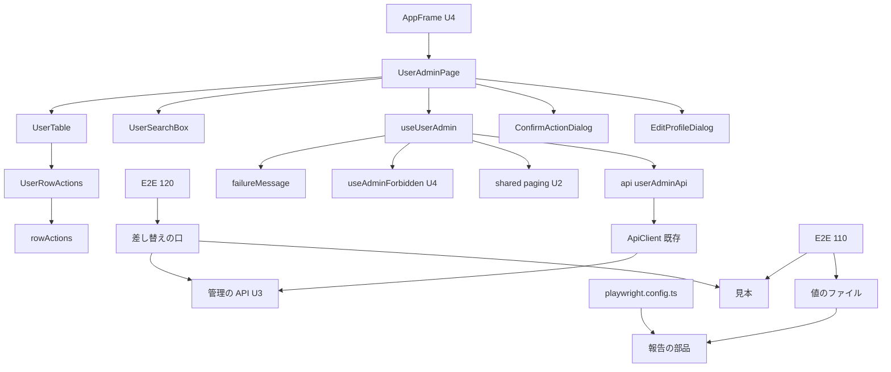

# Logical Components — U5 利用者の管理の画面（u5-user-admin-ui）

U5 の論理的な部品の一覧と、NFR の作りがどこに当たるかです。U5 は画面の単位（種類 ui）で、部品はどれも WAR に同梱する画面（SPA）の中のモジュールか、手元で流す E2E（Playwright）の部品です。アプリは1つの WAR・1台（開発者の PC 上のコンテナ）で、U5 はサーバーの部品と基盤を変えません。アクセシビリティ・多言語・テストの関門（NFR7.1〜NFR7.3・NFR8.1〜NFR8.3・NFR9.5〜NFR9.8）の作りは、ui の単位に別の文書が無いため、この文書の 6節〜8節に置きます。

出典の略号は `security-design.md` と同じです（NS・NP・TS・FS・FC・要点 n・C3・C4・TM・PM）。作りの中身は `performance-design.md`（PD）と `security-design.md`（SD）の節を指します。

## 1. 画面の部品（`frontend/src/features/useradmin/`、新しい）

部品の名前と置き場は FC 2.1 のとおりで、この段で新しい部品は足しません（要点 13）。

| 部品 | 役目 | 当たる NFR の作り |
|---|---|---|
| `registration.ts` | 機能の登録。画面を `lazy` で読む | PD 4節（NFR5.6） |
| `UserAdminPage` | 画面。`useUserAdmin` を呼び、部品を並べる | PD 2節・3節、SD 2.2・6.1 |
| `useUserAdmin` | 画面の状態と操作。読み直しの番号、`loadingRef`・`submittingRef`、5 秒の時計、失敗の入口 `handleFailure` | PD 2節・3節（NFR5.4・NFR5.5）、SD 2.2・6.1（NFR1.2・NFR3.1） |
| `UserSearchBox` | 検索。読み直しの間は `aria-disabled` | PD 3.2（NFR5.5） |
| `UserTable` | 一覧の表。`onPageChange` の側で読み直し中の押下を捨てる | PD 3.2（NFR5.5）、SD 6.3（NFR3.3） |
| `UserRowActions` | 行の「操作」とメニュー。読み直しの間は `Button` の `loading` | PD 3.2（NFR5.5）、SD 2.1（NFR1.1）、6節（NFR7.1） |
| `ConfirmActionDialog`・`EditProfileDialog` | 確かめの表示・氏名と言語の入力。送信中は閉じない、5 秒の表示 | PD 3節（NFR5.5）、6節（NFR7.1）、7節（NFR8.2） |
| `rowActions.ts` | 行の4つの値から項目と押せなさを決める純粋な関数 | SD 2.1（NFR1.1）、8節（NFR9.6） |
| `searchInput.ts` | 検索の文字の確かめ（254 コードポイント、前後の空白を除く） | 8節（NFR9.6） |
| `failureMessage.ts` | `code` と状態コードから文言の鍵を選ぶ | SD 6.2（NFR3.2） |
| `lockedUntil.ts` | 解除の予定の時刻の書式 | 7節（NFR8.3） |
| `api/userAdminApi.ts`・`api/types.ts` | API の関数と型。C3 の項目だけを写して返す | SD 6.3（NFR3.3）、PD 6節（NFR5.3）、SD 5節（NFR9.9 の型） |
| `messages.ts`・`useUserAdminText.ts` | 文言 ja・en と、言語を明示して引く関数 | 7節（NFR8.1・NFR8.3） |
| そのほか（`profileInput.ts`・`focusTarget.ts`・`testing/`） | FC 2.1 のとおり | 8節（NFR9.5・NFR9.7） |

## 2. 使う共通のもの（読むだけ）

| もの | 持ち主 | 使い方 |
|---|---|---|
| `src/shared/paging/paging.ts` | U2（B2 で移す） | `PAGE_SIZE`・`correctedPage`・`pagerButtonDisabledAfter` など（PD 2.3） |
| `src/shared/format/`・`src/shared/validation/` | 既存 | 日時の書式、氏名の確かめ、コードポイントの数え方 |
| `src/shared/api-client/`（ApiClient・`apiError.ts`） | 既存 | 要求、401 の更新、`Accept-Language`。独自の時間切れを置かない（PD 3.1） |
| `src/shared/api-client/fieldErrors.ts` | U5 が `features/preferences/` から移す（ふるまいは変えない） | 項目ごとの誤り |
| `useAdminForbidden`・`useApplyOwnProfile`（C4） | U4（B2） | 403 の扱い（SD 2.2）、自分の氏名と言語の反映 |
| make-you-chic-ui（`Table`・`Dropdown`・`Modal`・`Button`・`Badge`・`Alert`・`Toast`） | サブモジュール（固定先を U5 が上げる） | SD 8節（NFR9.3） |

## 3. E2E の部品

| 部品 | 新しい・手を入れる | 役目 | 当たる NFR の作り |
|---|---|---|---|
| `frontend/e2e/110-user-admin-flow.e2e.ts` | 新しい | 代表の流れ（FS 9節）、見本と本物の照らし合わせ、値のファイルへの記録 | SD 3.3・3.4・5節（NFR3.4・NFR9.9）、8節（NFR9.8） |
| `frontend/e2e/120-user-admin-accessibility.e2e.ts` | 新しい | 20 組×11 状態の検査と、画面の時間の測り | 6節（NFR7.3）、PD 5節（NFR5.1・NFR5.2）、SD 4節（NFR3.5） |
| 新しい手伝い: 値のファイル | 新しい | U の値を `test-results/` の下に権限 600 で書く | SD 3.4（NFR3.4） |
| 新しい手伝い: 差し替えの口 | 新しい | 管理の API の道の形（正規化した `/api/admin` ちょうどか `/api/admin/` の下）を page ごとの1つの `page.route` で受け、見本・本物へ通す GET・打ち切りの記録・受けた件数の確かめ | SD 4節（NFR3.5） |
| 新しい手伝い: 見本 | 新しい | 一覧・409・400 の見本（画面の型つき） | SD 5節（NFR9.9） |
| 新しい手伝い: 値を伏せた診断と `e2eTraceMode()` | 新しい | 失敗のときだけの記録、110・120 の trace の指定 | SD 3.2・3.6（NFR3.4） |
| `frontend/playwright-secret-check-reporter.ts` | 手を入れる | 探す値と探す先を広げる、json の報告の添付（base64）の復号、zip の展開、前の html の報告、値のファイルの片付け | SD 3.5（NFR3.4） |
| `frontend/playwright.config.ts` | 手を入れる | reporter から html を外す、trace の既定を `off`・`E2E_TRACE`、冒頭の説明 | SD 3.2（NFR3.4） |

- 手伝いの置き場（`frontend/e2e/support/` の下の新しいファイルか）とファイルの名前は、コード生成の計画で決めます（要点 14）。既存の `support/` のファイルと 010〜100・U4 の 130 のファイルは変えません。
- `README.md` の E2E の手順（trace を手元で有効にする、失敗の写しを確かめてから消す、前の html の報告を消す）は、コード生成で直します。

## 4. 部品の間のつながり

文字の代替: AppFrame（U4）の中に UserAdminPage を置き、UserAdminPage は useUserAdmin と5つの部品を並べる。UserTable の各行に UserRowActions があり、項目と押せなさは rowActions が決める。useUserAdmin は API の関数・failureMessage・U4 の useAdminForbidden・U2 のページ送りを使い、API の関数は既存の ApiClient を通して U3 の管理の API を呼ぶ。E2E では、110 が値のファイルに書き、見本と本物を照らし合わせる。120 は差し替えの口を通して見本を返し、測りのときだけ一覧の GET を U3 へ通す。報告の部品は設定から呼ばれ、値のファイルと報告のファイルを探す。

## 5. 障害の範囲

| 障害 | 範囲 | 守り |
|---|---|---|
| 一覧の API が遅い・失敗する | この画面だけ。ほかの画面は動く | 読み込みの失敗の表示と「もう一度読み込む」。自動の読み直しで負荷を重ねない（PD 2.1） |
| 操作の API が応答しない | この画面の確かめ・入力の表示だけ | 5 秒で「時間がかかっています」、サーバーの排他の待ちの上限で 409（PD 3.1）。通信が止まったままなら再読み込みで抜ける（残る危険、PD 3.4）。参照は finally で戻す（PD 3.2） |
| 403（管理者の印を外された） | この画面と開いていた Modal | U4 の AppFrame が置き換える（SD 2.2） |
| 401（期限切れ・停止） | アプリ全体（ログインの画面へ） | 既存の ApiClient。画面は S3・S4 を閉じるだけ（SD 2.2） |
| 画面のコードの読み込みの失敗 | この画面だけ（`lazy`） | 既存の遅延読み込みの扱い |
| make-you-chic-ui の固定先の更新の不具合 | 部品を使うすべての画面 | 更新を専用のコミットにし、既存の画面のテストと E2E（010〜100・130）を通す（SD 8節） |
| `.npmrc` の `ignore-scripts=true` の不具合 | `frontend/` のインストールとビルド・E2E | 固定先の更新と別のコミットにし、変更ごとに `npm ci`・`./gradlew e2eTest`（SD 8節） |
| 報告の部品の誤り（誤検知・読めないファイル） | `./gradlew e2eTest` の実行全体（すべての E2E の結果が失敗になる） | 値は表示せず種類と件数だけを出す。わざと値を入れた報告で確かめる（SD 3.8） |
| `playwright.config.ts` の変更（html・trace） | すべての E2E の報告 | json の報告は変えない。Build and Test が写すのは json だけ（SD 3.2） |
| 120 の差し替えの口の漏れ | E2E の内部DB と初期管理者の状態 | GET 以外は打ち切って 0 件を確かめ、口が受けた件数が 1 以上であることも毎回確かめる（SD 4.2） |

U5 の部品はサーバーの資源（接続プール・内部DB・メモリ）を持たないため、画面の障害がほかの利用者の要求に及ぶことはありません。E2E の部品は手元で流すときだけ動き、`./gradlew verify` と CI に入りません。

## 6. アクセシビリティ（NFR7.1〜NFR7.3、要点 15）

### 6.1 画面の作り（NFR7.1）

- 印・状態・ロック中・「あなた」は `Badge` の文字で示し、無いときは「—」（読み上げは「なし」）にします。
- 自分の行の押せない項目は `aria-disabled="true"` と、理由の文を `aria-describedby` で結びます（make-you-chic-ui の `Dropdown` の口。固定先を上げた直後に FC 2.5 の表で確かめる）。
- 確かめの表示は背景のクリックで閉じず、はじめのフォーカスを「やめる」に置き、本文の先頭に対象と効き目の文を置きます。
- 読み直しの間も行の「操作」のフォーカスを保ちます（`Button` の `loading`、PD 3.2）。フォーカスの戻し先は FS の W12 のとおりです。
- 狭い画面向けの形は作らず、表は包む要素の中だけで横に動きます。

### 6.2 画面部品のテスト（NFR7.2）

部品ごと（`UserAdminPage`・`UserSearchBox`・`UserTable`・`UserRowActions`・`ConfirmActionDialog`・`EditProfileDialog`）に vitest-axe の検査を1件以上入れ、違反 0 件とします。見本は2語の氏名・長いメールアドレス・ロック中・利用停止・「あなた」・誤りの状態・5種類の確かめを含めます（PM の学び）。light・dark と文字の大きさ sm・md・lg の組は、既存の表示の設定のテストの手伝いで流します。

### 6.3 実際のブラウザの検査（NFR7.3）

- 120 に、U4 の 130 と同じ 20 組（`support/displayCombos.ts`）×11 状態の検査を置きます。切り替え方も 130 と同じです。
- 状態ごとの画面は、差し替えの口の検査のモード（SD 4.1）で見本を返して作ります。状態を変える要求はサーバーへ届けません。
- 組と状態ごとに、axe-core の違反 0 件（WCAG 2.0・2.1 の A・AA）、`REQUIRED_RULES`（`color-contrast`・`scrollable-region-focusable`）が走ったこと（`missingRequiredRules` が空）、文書の横の大きさが表示の幅を超えないこと（375px の組を含む）を確かめます。既知の違反の一覧は空から始めます。
- `Toast` のように時間で消える表示は、消える前に検査します（見えていることを待ってから axe を走らせる）。
- 押せない項目と理由の文の文字のコントラストが 4.5:1 を下回ったときは、FC 2.5 の「依頼者に戻す差」として扱います。
- 失敗のときは値を伏せた手がかり（SD 3.6）が残ります。組と状態の名前は値を含まないため、注記に使ってよいです。
- 120 は流れではないため、流れの E2E の本数に数えません（PM の学び）。

## 7. 多言語（NFR8.1〜NFR8.3）

- 文言は `messages.ts` に ja・en を持ち、鍵は `useradmin.` で始めます。既定は日本語です。鍵の一覧が ja と en で一致することを `registration.test.tsx`（または `messages.test.ts`）で確かめます（NFR8.1）。
- make-you-chic-ui の `Table` の `labels` と `Modal` の `closeLabel` を画面の言語で渡し、en の画面に日本語の既定の文言を出しません（NFR8.2）。
- 自分の言語を en に直して保存した直後の成功の Toast は、`useUserAdminText` の3つ目の引数で言語を明示して引きます。日時は既存の `formatDateTime` の書式、解除の予定の時刻は `lockedUntil.ts` で、今日なら時刻と時差の略号だけにします。`lockedUntil.test.ts` は時間帯と今の時刻を引数で固定します（NFR8.3）。

## 8. テストと関門（NFR9.5〜NFR9.8）

| NFR | 作り | 確かめの場 |
|---|---|---|
| NFR9.5 | フロントエンドのカバレッジの下限（行 80%・分岐 70%）を守る。U5 のために計測の除外を増やさない | `./gradlew verify` の `@vitest/coverage-v8` の `thresholds` |
| NFR9.6 | `rowActions.ts`（任意の4つの値で、自分の行の「印を外す」「止める」が押せる形にならない、項目が4つの値だけで決まる）と `searchInput.ts`（前後の空白を足しても同じ、送る値は 254 コードポイント以下）に fast-check。失敗のときの乱数の種を記録する | `rowActions.test.ts`・`searchInput.test.ts` |
| NFR9.7 | `waitFor` で待つ、時間の上限を延ばさない、説明文は英語、見本のメールアドレスは `example.com` だけで2語の氏名を含める、偽の時計か引数で時刻を固定する。`fieldErrors.ts` を移した後もプリファレンスのテストが通る | `./gradlew verify`、テストのコードのレビュー |
| NFR9.8 | 流れの E2E は 110 の1本だけ。状態を変える操作は 110 が作った U だけ、初期管理者は変えない。前提が無くて飛ばしたときは理由の種類だけを注記し、統合の前の実行では飛ばしていないことを確かめる。010〜100 と 130 も通る | `./gradlew e2eTest`（統合の前と、リリースの前に手元で） |

## 9. 共有するもの

| もの | 共有する相手 | U5 の扱い |
|---|---|---|
| E2E の WAR・内部DB・初期管理者 | すべての E2E のファイル | 110 は自分で作った U だけを変える。120 は書き換えを本物へ通さない |
| `frontend/playwright.config.ts`・報告の部品 | すべての E2E | html を外し trace の既定を `off` にする。json の報告は変えない |
| Mailpit | 090・080・110 など招待を使う E2E | 110 は既存の `createRegisteredUser` を変えずに使う |
| make-you-chic-ui の固定先 | すべての画面 | 固定先の更新を専用のコミットにする |
| `frontend/.npmrc` | `frontend/` のインストール | `ignore-scripts=true` を足す |

## 10. 上流との差

この文書の部品の一覧は FC 2節のとおりで、新しい画面の部品はありません。E2E の部品の差（120 と新しい手伝い、`playwright.config.ts` の変更）と、Q1〜Q3 の答えによる差は `security-design.md` の 12節にまとめました。

| 決定 | 文書 | 承認済みの記述 | この段での扱い |
|---|---|---|---|
| `playwright.config.ts` に手を入れる | FC 9節（`frontend/e2e/` は 110 を足し、010〜100 と `support/` は変えない） | 設定のファイルについては書いていない | Q1 A・Q2 A で、reporter と trace の既定を変える（SD 3.2）。010〜100・130 と `support/` の既存のファイルは変えない。すべての E2E の報告に効く変更のため、障害の範囲（5節）に書いた |
| アクセシビリティ・多言語・テストの関門の作りをこの文書に置く | 段の定義（ui の単位の成果物は performance・security・logical-components） | — | ui の単位に置き場の文書が無いため、6節〜8節に置いた。traceability.json の target でこの文書の節を指す |
