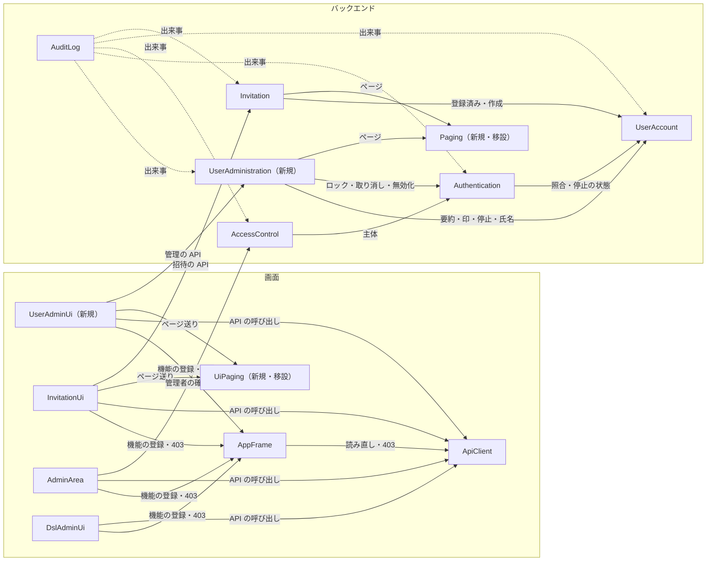

# 部品の一覧（Domain Design）— user-admin

出典の表記: FR・NFR は `aidlc/spaces/default/intents/260930-user-admin/inception/requirements-analysis/requirements.md`、US・AC は `aidlc/spaces/default/intents/260930-user-admin/inception/user-stories/stories.md`、S1〜S6 は `aidlc/spaces/default/intents/260930-user-admin/inception/refined-mockups/mockups.md`、DQ1〜DQ5 は `aidlc/spaces/default/intents/260930-user-admin/inception/domain-design/domain-design-questions.md` の確定した答え、K-n は `aidlc/spaces/default/codekb/mastersmith2/` の所見、ADR-n は同じディレクトリの `decisions.md`。

既存の部品は、前の Intent の Domain Design の部品名（UserAccount・Authentication・AccessControl・AuditLog・Invitation・AppFrame・AdminArea・ApiClient・InvitationUi）で書く。この Intent で触れない部品（Mail・InstanceAppearance・RegistrationUi・PreferencesUi・AuthUi・DSL のバックエンドの部品）は一覧に載せない。DSL の管理の画面は、403 の扱いを足すため DslAdminUi として載せる。

## Part A — 機械が読む一覧

```yaml
components:
  - name: UserAdministration
    summary: 新規。管理者による利用者の管理（一覧・管理者の印・利用停止と解除・失敗回数の取り消し・氏名と言語の変更）をまとめる
    behaviour: >
      /api/admin/ の下の管理の API を持ち、今の決まり（要求ごとに DB の管理者の印を見る）で管理者だけに許す（FR8.2、K-5）。
      一覧は UserAccount の利用者の要約と、Authentication のロックの判定の結果（ロック中か・解除の予定の時刻・失敗回数を戻せるか）を
      合わせて作る。失敗回数そのものは応答に含めない（FR1.6）。1ページ 20 件、登録した日時の古い順、メールアドレス・氏名の部分一致の
      検索（特殊文字は文字どおり、FR1.4）。操作の拒否は「対象の利用者がいない → 自分自身への操作 → 対象の利用者が停止中 → 変えるものが無い
      → 最後の有効な管理者の保護」の順に判定し、最初の理由1つで返す（FR7.5、ストーリーの差3）。最後の有効な管理者の保護（有効な管理者＝印を
      持ち停止していない利用者、ロック中も数える）は同時の操作でも破られないように判定する。判定の前に、UserAccount の口で管理者の行を決まった順（利用者 ID の小さい順）でまとめて排他し、そのトランザクションの中で、操作する管理者自身が今も有効な管理者か（印を持ち停止していないか）を確かめ直す。確かめ直しで有効でなければ「最後の有効な管理者の保護」と同じく業務の誤りとして拒否する（FR4、ADR-007）。止めるときは同じトランザクション
      で Authentication にリフレッシュトークンの無効化を頼む（ADR-003）。成功・失敗の操作ごとに監査の出来事を知らせる（AuditLog が受ける、
      ADR-006）。氏名・言語の変更は監査しない（FR6.4）。受け渡しの値は、TRACE のログに文字列で出てもメールアドレス・氏名が出ない形にする
      （NFR3、K-8）。検索の文字はログ・トレース・監査に出さない。
    responsibilities:
      - 利用者の管理の API（一覧・印・停止と解除・失敗回数の取り消し・氏名と言語）
      - 利用者の要約とロックの判定の結果の組み合わせ
      - 拒否の理由の判定と順序
      - 最後の有効な管理者の保護（操作者の確かめ直しを含む）
      - 管理の操作の監査の出来事の発行
    depends_on:
      - component: UserAccount
        interaction: 利用者の要約の一覧と検索、管理者の印・停止・氏名と言語の変更、有効な管理者の行の排他と数え上げ
        style: sync
      - component: Authentication
        interaction: ロックの判定の結果の読み取り、失敗回数の取り消し、リフレッシュトークンのまとめての無効化
        style: sync
      - component: Paging
        interaction: ページの番号と件数の計算
        style: sync
    dependents:
      - component: AuditLog
        interaction: 管理の操作の成功・失敗の出来事を受ける
      - component: UserAdminUi
        interaction: 管理の API を呼ぶ（ApiClient を通す）
    external_dependencies: []
    entities: []

  - name: UserAccount
    summary: 既存を広げる。利用者に利用停止の状態を足し、管理者による印・停止・氏名と言語の変更と、一覧と検索の読み取りを足す
    behaviour: >
      利用者の表に利用停止の状態を Flyway の V9 以降で足し、既存の利用者は「有効」を初期値とする（NFR10、ADR-002）。管理者の印・停止の
      状態の変更、氏名と言語の変更（検証はプリファレンスと同じ規則、FR6.2）、利用者の要約の一覧（ページ・検索・件数）、有効な管理者の
      数え上げを service の口として出す。最後の有効な管理者の保護のため、管理者の印を持つ行を決まった順（利用者 ID の小さい順）でまとめて排他する口（既存の排他の待ちの上限 3 秒にそろえる）を出す（ADR-007）。3つの入口が使う利用者の読み取りに停止の状態を含める（Authentication が判定する）。利用者の
      `user` は `auth` を知らないまま（K-3）。要約の型は toString でメールアドレス・氏名を伏せる（K-8）。
    responsibilities:
      - 利用者の管理（既存）
      - 利用停止の状態の保持（今回足す）
      - 管理者の印・停止・氏名と言語の変更の口（今回足す）
      - 利用者の要約の一覧と検索・有効な管理者の数え上げ（今回足す）
      - 管理者の行を決まった順でまとめて排他する口（今回足す）
    depends_on: []
    dependents:
      - component: UserAdministration
        interaction: 要約の一覧と検索・印と停止と氏名と言語の変更・有効な管理者の行の排他と数え上げ
      - component: Authentication
        interaction: ログインの照合・トークンの更新・アクセストークンの認証での利用者の読み取り（停止の状態を含む）
      - component: Invitation
        interaction: 登録済みの確かめ（停止中の利用者も登録済み、ストーリーの前提 A1）・利用者の作成（既存）
      - component: AuditLog
        interaction: 操作した人と対象の利用者を指す（既存）
    external_dependencies:
      - name: 内部DB（組み込みの H2）
        kind: database
        purpose: 利用者の表（users）
    entities:
      - name: User
        identifier: userId
        attributes: [email, passwordHash, admin, suspended, displayName, language, theme, fontSize, createdAt]

  - name: Authentication
    summary: 既存を広げる。3つの入口で利用停止を判定し、失敗回数の取り消しとリフレッシュトークンのまとめての無効化と、ロックの判定の結果の読み取りを足す
    behaviour: >
      ログインの照合では、停止の確かめをロックの判定より前に行い、停止中は失敗回数とロックの状態を変えずに、ほかの失敗と同じ応答
      （AUTHENTICATION_FAILED）を返す。出来事の失敗の理由には「停止中」を足す（ストーリーの差5、ADR-008）。応答の時間をそろえる今の仕組み
      （照合とロックの状態の行の読み書きの回数）を崩さない。トークンの更新とアクセストークンの認証では、停止中を無効なトークンと同じ応答
      （REFRESH_FAILED・AUTHENTICATION_REQUIRED）で拒否する（FR3.4）。アクセストークンに失効の仕組みは足さない（PM の DECIDED、ストーリーの
      差1）。失敗回数の取り消しは、ログインの判定と同じ行の排他で、失敗回数を 0 にし解除の予定の時刻を無くす。行の無い利用者には行を作らない
      （FR5）。ロックの判定の結果（ロック中か・解除の予定の時刻・戻せるか）を利用者ごとに読む口を出す（失敗回数の生の値は出さない）。
      利用者のリフレッシュトークンをまとめて無効にする口を出す（FR3.3、ADR-003）。
    responsibilities:
      - ログイン・トークン・ロック・ログアウト（既存）
      - 3つの入口での利用停止の判定（今回足す）
      - 失敗回数の取り消し（今回足す）
      - ロックの判定の結果の読み取りの口（今回足す）
      - リフレッシュトークンのまとめての無効化（今回足す）
    depends_on:
      - component: UserAccount
        interaction: 照合と利用者の読み取り（停止の状態を含む）
        style: sync
    dependents:
      - component: UserAdministration
        interaction: ロックの判定の結果・失敗回数の取り消し・リフレッシュトークンの無効化
      - component: AccessControl
        interaction: 検証済みの主体を使う（既存）
      - component: AuditLog
        interaction: 認証の出来事を受ける（既存。停止中の理由を足す）
    external_dependencies:
      - name: 内部DB（組み込みの H2）
        kind: database
        purpose: リフレッシュトークン・ロックの状態（既存）
    entities:
      - name: RefreshToken
        identifier: tokenId
        attributes: [userId, tokenHash, expiresAt, revokedAt]
        references:
          - entity: User
            owned_by: UserAccount
            relationship: 各リフレッシュトークンは1人の利用者のもの
      - name: LoginAttemptState
        identifier: subjectId
        attributes: [consecutiveFailures, lockedUntil]
        references:
          - entity: User
            owned_by: UserAccount
            relationship: 利用者の行は1人の利用者のもの（ダミーの行は利用者を指さない）

  - name: AccessControl
    summary: 既存。/api/admin/ の下を管理者だけに限る。今回は変更しない
    behaviour: >
      利用者の管理の API を /api/admin/ の下に置くことで、未認証 401・管理者でない 403 と、アクセス拒否の監査がそのまま付く（FR8.2）。
      停止中の管理者は Authentication がアクセストークンの認証で拒否する（401）ため、ここに来ない（FR3.8）。
    responsibilities:
      - 管理者だけの API の判定（既存）
      - 管理者の確かめの API（既存）
    depends_on:
      - component: Authentication
        interaction: 検証済みの主体を使う（既存）
        style: sync
    dependents:
      - component: AuditLog
        interaction: アクセス拒否の出来事を受ける（既存）
      - component: AdminArea
        interaction: 管理者の確かめの API を呼ぶ（既存、ApiClient を通す）
    external_dependencies: []
    entities: []

  - name: AuditLog
    summary: 既存を広げる。管理の操作（印・停止と解除・失敗回数の取り消し）の成功・失敗と、停止中のログインの失敗の理由を記録する
    behaviour: >
      既存の決まり（確定の後に記録する、業務の拒否は巻き戻しの後も失敗として残す、書き込みに失敗しても元の操作は失敗させない）に従い、
      出来事の種類を5つ（印を付ける・外す・止める・停止を解く・失敗回数を戻す）と、失敗の理由（対象の利用者がいない・自分自身への操作・
      対象の利用者が停止中・変えるものが無い・最後の有効な管理者の保護・ログインの停止中）を足す（FR7、ADR-006）。名前は 32 文字まで（K-6）。
      対象の利用者がいないときは指定された利用者 ID をそのまま対象に残す（FR7.6）。列を足す移行は要らない見込み（K-6）。パスワード・
      トークン・ロックの判定の生の値・検索の文字は記録しない（FR7.4）。共通の仕組みは作らない（PM の DECIDED）。
    responsibilities:
      - 管理の操作の監査の記録（今回足す）
      - 認証・アクセス拒否・DSL・招待・パスワードの変更の監査の記録（既存）
    depends_on:
      - component: UserAdministration
        interaction: 管理の操作の出来事を受け取る
        style: event
      - component: Authentication
        interaction: 認証の出来事を受け取る（既存。停止中の理由を足す）
        style: event
      - component: AccessControl
        interaction: アクセス拒否の出来事を受け取る（既存）
        style: event
      - component: UserAccount
        interaction: パスワードの変更の出来事を受け取り、利用者を指す（既存）
        style: event
      - component: Invitation
        interaction: 招待の操作と登録の出来事を受け取る（既存）
        style: event
    dependents: []
    external_dependencies:
      - name: 内部DB（組み込みの H2）
        kind: database
        purpose: 監査の記録（audit_events）
    entities:
      - name: AuditEvent
        identifier: eventId
        attributes: [eventType, occurredAt, actorUserId, targetUserId, targetInvitationId, result, failureReason, traceId]
        references:
          - entity: User
            owned_by: UserAccount
            relationship: 各記録は、操作した人・対象の利用者を指すことがある（対象がいないときは指定された ID のまま）

  - name: Invitation
    summary: 既存。ページ送りの計算を Paging に移すだけで、振る舞いは変えない
    behaviour: >
      招待の一覧のページ送りの計算（今の InvitationPaging）を Paging に移して使う（DQ4 A、ADR-004）。停止中の利用者のメールアドレスは、
      今までどおり登録済みとして招待を拒否する（ストーリーの前提 A1）。そのほかの振る舞いは変えない。
    responsibilities:
      - 招待・送り直し・取り消し・一覧・登録の完了（既存）
    depends_on:
      - component: UserAccount
        interaction: 登録済みの確かめ・利用者の作成（既存）
        style: sync
      - component: Paging
        interaction: ページの番号と件数の計算（今回 Paging から使う）
        style: sync
    dependents:
      - component: AuditLog
        interaction: 招待の出来事を受ける（既存）
      - component: InvitationUi
        interaction: 招待の管理の API を呼ぶ（既存）
    external_dependencies:
      - name: 内部DB（組み込みの H2）
        kind: database
        purpose: 招待の表（既存）
    entities:
      - name: Invitation
        identifier: invitationId
        attributes: [email, language, tokenHash, invitedByUserId, invitedAt, expiresAt, sendStatus, completedUserId, cancelledAt]
        references:
          - entity: User
            owned_by: UserAccount
            relationship: 各招待は招待した管理者を指し、完了したら作られた利用者を指す

  - name: Paging
    summary: 新規（既存の InvitationPaging を共通に移す）。管理の一覧のページの番号・大きさ・件数の計算
    behaviour: >
      置き場は `packagesJudgedByTotal` の一覧に無い新しいパッケージ（`common.paging`）とする（ADR-004）。1ページ 20 件の大きさと、ページの番号の検証（1 未満・整数でないは入力の誤り）、最後のページより後は空の一覧として扱う計算を、DB を
      使わない純粋な関数として持つ（ストーリーの差7、招待の一覧の前例）。性質ベースのテストの対象にする（TP）。
    responsibilities:
      - ページの番号の検証とページの計算
    depends_on: []
    dependents:
      - component: UserAdministration
        interaction: 利用者の一覧のページ
      - component: Invitation
        interaction: 招待の一覧のページ
    external_dependencies: []
    entities: []

  - name: ApiClient
    summary: 既存を広げる。管理の API の 403 を、画面の骨組みが受け取れる形で知らせる
    behaviour: >
      既存の呼び出し方・要求の言語の付与・401 の後の更新の流れは変えない。管理の API が 403 を返したとき（要求の経路が /api/admin/ の下で、応答の code が
      ACCESS_DENIED のときに限る。ほかの 403 は今までどおり呼んだ画面に返す）、呼んだ画面に「権限が無い」と分かる形で返し、AppFrame の共通の扱い（表示の切り替えとログインの状態の読み直し）を起こせるようにする（DQ5 A、ADR-005）。
    responsibilities:
      - API の呼び出しの共通部分（既存）
      - 403 を権限が無いとして知らせる（今回足す）
    depends_on: []
    dependents:
      - component: AppFrame
        interaction: ログインの状態の読み直しと 403 の受け取り
      - component: UserAdminUi
        interaction: API の呼び出し
      - component: InvitationUi
        interaction: API の呼び出し（既存）
      - component: AdminArea
        interaction: API の呼び出し（既存）
      - component: DslAdminUi
        interaction: API の呼び出し（既存）
    external_dependencies: []
    entities: []

  - name: AppFrame
    summary: 既存を広げる。管理の画面すべての 403 の共通の扱い（権限が無いときの表示と、ログインの状態の読み直し・管理のメニューの更新）を足す
    behaviour: >
      管理の画面が 403 を受けたら、共通の表示（「この画面を使う権限がありません」と「ホームへ戻る」、S6）に置き換え、ログインの状態を読み
      直してサイドバーの管理のメニューを消す（AC2.2.1・AC2.2.2・AC2.2.4、DQ5 A）。決まった間隔ではログインの状態を更新しない。自分自身の
      氏名・言語が管理の画面で変わったときに、画面の言語と上の帯の氏名を変える口を出す（AC5.1.3）。機能の登録の仕組みは変えない。
    responsibilities:
      - 画面の骨組み（既存）
      - 管理の画面の 403 の共通の扱いと表示（今回足す）
      - ログインの状態の読み直しの口（今回足す）
    depends_on:
      - component: ApiClient
        interaction: ログインの状態の読み直しと 403 の受け取り
        style: sync
    dependents:
      - component: UserAdminUi
        interaction: 機能の登録・403 の共通の扱い・自分の氏名と言語の反映
      - component: InvitationUi
        interaction: 機能の登録（既存）・403 の共通の扱い（今回）
      - component: AdminArea
        interaction: 機能の登録（既存）・403 の共通の扱い（今回）
      - component: DslAdminUi
        interaction: 機能の登録（既存）・403 の共通の扱い（今回）
    external_dependencies:
      - name: make-you-chic-ui
        kind: other
        purpose: AppShell・Alert（変更しない）
    entities: []

  - name: UserAdminUi
    summary: 新規。利用者の管理の画面（一覧・検索・行の操作のメニュー・確かめの表示・氏名と言語の入力・結果の知らせ）
    behaviour: >
      画面イメージ S1〜S5 と操作の仕様（`interaction-spec.md`）のとおり。サイドバーの管理のメニューに機能として登録する（order は招待の
      220 の近く、K-9）。行の操作は make-you-chic-ui の Dropdown（押せない項目と理由の文、固定先の更新が要る）で出す。403 は AppFrame の
      共通の扱いに任せる。ページ送りは UiPaging を使う。文言は ja・en。
    responsibilities:
      - 利用者の管理の画面（今回足す）
    depends_on:
      - component: AppFrame
        interaction: 機能の登録・403 の共通の扱い・自分の氏名と言語の反映
        style: sync
      - component: ApiClient
        interaction: 管理の API の呼び出し
        style: sync
      - component: UiPaging
        interaction: ページ送りの計算と文言
        style: sync
      - component: UserAdministration
        interaction: 管理の API（ApiClient を通す HTTP）
        style: sync
    dependents: []
    external_dependencies:
      - name: make-you-chic-ui
        kind: other
        purpose: Table・Badge・Button・Dropdown・Modal・Toast・Alert・FormField・TextInput・RadioGroup（固定先を 3481488 以降に更新）
    entities: []

  - name: InvitationUi
    summary: 既存。ページ送りを UiPaging に移し、403 を AppFrame の共通の扱いに任せる
    behaviour: >
      招待の管理の画面の振る舞いは変えない。ページ送りの計算（今の features/invitation/paging.ts）を UiPaging に移して使い（DQ4 A）、403 を
      一般の誤りの文言で出す今の扱いを、AppFrame の共通の扱いに置き換える（M5 B、ストーリーの差2）。
    responsibilities:
      - 招待の管理の画面（既存）
    depends_on:
      - component: AppFrame
        interaction: 機能の登録・403 の共通の扱い
        style: sync
      - component: ApiClient
        interaction: API の呼び出し
        style: sync
      - component: UiPaging
        interaction: ページ送りの計算（今回 UiPaging から使う）
        style: sync
      - component: Invitation
        interaction: 招待の管理の API（既存）
        style: sync
    dependents: []
    external_dependencies: []
    entities: []

  - name: AdminArea
    summary: 既存。管理の入口の画面。403 を「ページが見つかりません」で出す今の扱いを、AppFrame の共通の扱いに置き換える
    behaviour: >
      管理の入口の振る舞いは変えない。管理者の確かめが 403 のときの表示を、AppFrame の共通の表示とログインの状態の読み直しに置き換える
      （M5 B）。
    responsibilities:
      - 管理者向け領域の入口（既存）
    depends_on:
      - component: AppFrame
        interaction: 機能の登録（既存）・403 の共通の扱い（今回）
        style: sync
      - component: ApiClient
        interaction: 管理者の確かめの API の呼び出し（既存）
        style: sync
      - component: AccessControl
        interaction: 管理者の確かめの API（既存）
        style: sync
    dependents: []
    external_dependencies: []
    entities: []

  - name: DslAdminUi
    summary: 既存。DSL の管理の画面。403 を「ページが見つかりません」で出す今の扱いを、AppFrame の共通の扱いに置き換える
    behaviour: >
      DSL の管理の画面の振る舞いは変えない。403 の表示を AppFrame の共通の表示とログインの状態の読み直しに置き換える（M5 B）。DSL の
      バックエンドの部品はこの Intent で触れないため一覧に載せない。
    responsibilities:
      - DSL の管理の画面（既存）
    depends_on:
      - component: AppFrame
        interaction: 機能の登録（既存）・403 の共通の扱い（今回）
        style: sync
      - component: ApiClient
        interaction: DSL の管理の API の呼び出し（既存）
        style: sync
    dependents: []
    external_dependencies: []
    entities: []

  - name: UiPaging
    summary: 新規（既存の features/invitation/paging.ts を src/shared/ に移す）。画面のページ送りの計算
    behaviour: >
      ページの番号と全体の件数から、前へ・次への可否と表示の文言の元になる値を計算する純粋な関数。招待の管理と利用者の管理の画面で共有する
      （DQ4 A、ADR-004）。性質ベースのテスト（fast-check）の対象にする（TP）。
    responsibilities:
      - 画面のページ送りの計算
    depends_on: []
    dependents:
      - component: UserAdminUi
        interaction: 利用者の一覧のページ送り
      - component: InvitationUi
        interaction: 招待の一覧のページ送り
    external_dependencies: []
    entities: []
```

## Part B — 人が読む形

### Component Diagram



文字の代替: 画面では、UserAdminUi・InvitationUi・AdminArea・DslAdminUi が AppFrame（機能の登録と 403 の共通の扱い）と ApiClient を使い、UserAdminUi と InvitationUi は UiPaging を共有する。UserAdminUi は UserAdministration、InvitationUi は Invitation、AdminArea は AccessControl の API を呼ぶ。バックエンドでは、UserAdministration が UserAccount（要約・印・停止・氏名と言語）と Authentication（ロックの判定の結果・失敗回数の取り消し・リフレッシュトークンの無効化）と Paging を使う。Authentication は UserAccount を、AccessControl は Authentication を、Invitation は UserAccount と Paging を使う。AuditLog は5つの部品の出来事を受ける（点線）。

### Component Summary

| Component | Purpose | Depends On | Dependents | Entities Owned |
|---|---|---|---|---|
| UserAdministration（新規） | 利用者の管理の API と業務の決まり | UserAccount・Authentication・Paging | AuditLog・UserAdminUi | — |
| UserAccount | 利用者（停止の状態を足す）と変更・一覧の口 | — | UserAdministration・Authentication・Invitation・AuditLog | User |
| Authentication | 3つの入口での停止の判定・失敗回数の取り消し・リフレッシュトークンの無効化 | UserAccount | UserAdministration・AccessControl・AuditLog | RefreshToken・LoginAttemptState |
| AccessControl | 管理者だけの API の判定（変更なし） | Authentication | AuditLog・AdminArea | — |
| AuditLog | 管理の操作と停止中のログインの監査 | UserAdministration・Authentication・AccessControl・UserAccount・Invitation（出来事） | — | AuditEvent |
| Invitation | 招待（ページ送りを Paging に移す） | UserAccount・Paging | AuditLog・InvitationUi | Invitation |
| Paging（新規・移設） | ページの計算 | — | UserAdministration・Invitation | — |
| ApiClient | 403 を権限が無いとして知らせる | — | AppFrame・UserAdminUi・InvitationUi・AdminArea・DslAdminUi | — |
| AppFrame | 管理の画面すべての 403 の共通の扱い | ApiClient | UserAdminUi・InvitationUi・AdminArea・DslAdminUi | — |
| UserAdminUi（新規） | 利用者の管理の画面 | AppFrame・ApiClient・UiPaging・UserAdministration | — | — |
| InvitationUi | 招待の画面（ページ送りの移設・403） | AppFrame・ApiClient・UiPaging・Invitation | — | — |
| AdminArea | 管理の入口（403） | AppFrame・ApiClient・AccessControl | — | — |
| DslAdminUi | DSL の管理の画面（403） | AppFrame・ApiClient | — | — |
| UiPaging（新規・移設） | 画面のページ送りの計算 | — | UserAdminUi・InvitationUi | — |

### Entity Ownership

| Entity | Owning Component | Identifier | Attributes | References |
|---|---|---|---|---|
| User | UserAccount | userId | email・passwordHash・admin・suspended（今回）・displayName・language・theme・fontSize・createdAt | — |
| RefreshToken | Authentication | tokenId | userId・tokenHash・expiresAt・revokedAt | User（UserAccount） |
| LoginAttemptState | Authentication | subjectId | consecutiveFailures・lockedUntil | User（UserAccount。ダミーの行は指さない） |
| AuditEvent | AuditLog | eventId | eventType・occurredAt・actorUserId・targetUserId・targetInvitationId・result・failureReason・traceId | User（UserAccount） |
| Invitation | Invitation | invitationId | email・language・tokenHash・invitedByUserId・invitedAt・expiresAt・sendStatus・completedUserId・cancelledAt | User（UserAccount） |

UserAdministration はエンティティを持たない。一覧の行（利用者の要約とロックの判定の結果の組み）は、UserAccount と Authentication から読んで組み立てる読み取りの形で、保存しない。

### External Dependencies

| Component | Dependency | Kind | Purpose |
|---|---|---|---|
| UserAccount | 内部DB（組み込みの H2） | database | 利用者の表 |
| Authentication | 内部DB（組み込みの H2） | database | リフレッシュトークン・ロックの状態 |
| AuditLog | 内部DB（組み込みの H2） | database | 監査の記録 |
| Invitation | 内部DB（組み込みの H2） | database | 招待の表 |
| AppFrame | make-you-chic-ui | other | AppShell・Alert |
| UserAdminUi | make-you-chic-ui | other | 一覧・メニュー・確かめ・入力・知らせの部品（固定先を 3481488 以降に更新） |

### Rationale

| Component | なぜ別の部品か |
|---|---|
| UserAdministration | `user` と `auth` の両方の状態をまとめて扱う業務の決まり（拒否の順・最後の管理者・監査）を持つ。`user` は `auth` を知らないため `user` には置けず、`auth` に置くと「ログインとトークン」の責務が「利用者の管理」まで広がる（DQ1 A、ADR-001） |
| UserAccount（広げる） | 利用停止は利用者の状態で、管理者の印と同じく3つの入口が読む。持ち主を利用者にすると、入口は今と同じ口から読める（DQ2 A、ADR-002） |
| Authentication（広げる） | 3つの入口・ロックの状態・リフレッシュトークンはすべて `auth` が持つ。停止の判定と失敗回数の取り消しとトークンの無効化は、データの持ち主の側に置く |
| AuditLog（広げる） | 監査は出来事を受けて確定の後に別のトランザクションで記録する既存の仕組みに乗せる（ADR-006） |
| Paging・UiPaging | 招待と利用者の管理の両方が使う純粋な計算。境界の決まりで `invitation` を直接使えないため、共通の置き場に移す（DQ4 A、ADR-004） |
| AppFrame・ApiClient（広げる） | 管理の画面すべての 403 の扱いを1か所にまとめる（DQ5 A、ADR-005） |
| UserAdminUi | 新しい画面。招待の画面と同じ形の独立した機能（`features/<id>/`） |
| InvitationUi・AdminArea・DslAdminUi | 振る舞いは変えず、403 の扱いとページ送りの置き場だけを変える |

**Alternatives Rejected**（部品の分け方）: 利用者の管理の部品を `auth` に置く案（DQ1 B）と `access` に置く案（DQ1 C）、停止の状態を `auth` や新しい部品が持つ案（DQ2 B・C）、リフレッシュトークンの無効化を出来事で起こす案（DQ3 B）、ページ送りを利用者の管理の側に複製する案（DQ4 B）、403 の扱いを各画面で書く案（DQ5 B）。理由はそれぞれ `decisions.md` の ADR に書いた。
