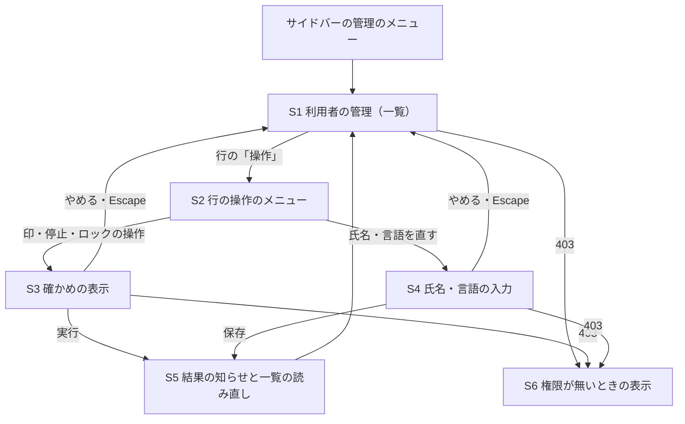

# 画面イメージ — user-admin（利用者の管理）

出典の表記: US・AC は `aidlc/spaces/default/intents/260930-user-admin/inception/user-stories/stories.md`（承認済み）、FR・NFR は `aidlc/spaces/default/intents/260930-user-admin/inception/requirements-analysis/requirements.md`（承認済み）、RQ1〜RQ7 は `aidlc/spaces/default/intents/260930-user-admin/inception/refined-mockups/refined-mockups-questions.md` の確定した答え（Q1〜Q7）。classic の範囲のため Ideation のラフな画面イメージと利用者の流れは無く、画面イメージはストーリーと要件から直接作った（無い成果物の中身は作っていない）。

部品の対応は `design-system-mapping.md`、部品ごとの状態・操作・アクセシビリティの仕様は `interaction-spec.md`、アクセシビリティの確かめは `accessibility-checklist.md` に書く。

## 1. 画面の一覧と、受け入れ基準との対応

書く前に、画面にかかわる受け入れ基準を画面ごとに一覧にし、すべてをいずれかの画面に当てた（PM の学び）。サーバー側だけの基準（認可・監査・同時性・トークン）は画面に出ないため「画面に出ない」とした。

| 画面 | 内容 | 当たる受け入れ基準 |
|---|---|---|
| S1 利用者の管理（一覧） | 一覧・検索・ページ送り・4つの状態 | AC1.1.1〜AC1.1.5・AC1.1.7〜AC1.1.12・AC3.1.10・AC3.1.11・AC4.1.1・AC4.1.4 |
| S2 行の操作のメニュー | 行で今できる操作・自分の行の押せない操作 | AC2.1.9・AC3.1.8・AC3.1.11・AC4.1.1・AC4.1.4・AC4.1.7 |
| S3 確かめの表示（5種類） | 印を付ける・外す・止める・停止を解く・ロックを解除 | AC2.1.8・AC3.1.7・AC4.1.9 |
| S4 氏名・言語の入力 | 氏名と言語を直す | AC5.1.1〜AC5.1.5・AC5.1.7 |
| S5 操作の結果の知らせ | 成功の知らせ・理由ごとの失敗の文言・一覧の読み直し | AC2.1.13・AC3.1.11・AC4.1.10 |
| S6 権限が無いときの表示 | 管理の画面すべて（入口・DSL・招待・利用者の管理）の 403 | AC2.2.1・AC2.2.2・AC2.2.4・AC2.2.5 |
| （既存）ログインの画面 | 止められた利用者の画面の移り方 | AC3.2.9・AC3.2.10（既存の表示のまま。変えない） |
| 画面に出ない | サーバー側の判定 | AC1.1.6・AC1.1.13・AC2.1.1〜AC2.1.7・AC2.1.10〜AC2.1.12・AC2.1.14・AC2.2.3・AC2.2.6・AC3.1.1〜AC3.1.6・AC3.1.9・AC3.1.12・AC3.2.1〜AC3.2.8・AC4.1.2・AC4.1.3・AC4.1.5・AC4.1.6・AC4.1.8・AC4.1.11・AC4.1.12・AC5.1.6・AC5.1.8 |

画面に出ない基準のうち、操作の結果として画面に表示が出るもの（拒否の理由の文言など）は S5 で扱う。

## 2. 画面の置き場と移り方

- 管理画面（AppShell）の中に1つの画面を置き、サイドバーの管理のメニューに「利用者の管理」（en: Users）を足す。招待の管理（order 220）と並べる（RQ1 A、FR8.1）。
- 確かめの表示（S3）と氏名・言語の入力（S4）は、画面の上に重ねて出す（Modal）。画面は移らない（RQ1 A・RQ3 A）。
- 管理の画面で 403 を受けたら、どの管理の画面でも S6 に置き換え、ログインの状態を読み直してサイドバーの管理のメニューを消す（AC2.2.2・AC2.2.4）。
- 画面は広い画面での利用を前提とし、狭い画面向けの形は作らない。狭い画面では、表がはみ出したら横にずれて見え、文字や操作が重なって読めなくならないことだけを確かめる（RQ7 C）。



文字の代替: サイドバーの管理のメニューから S1 を開く。S1 の行の「操作」で S2 のメニューを開き、印・停止・ロックの操作なら S3 の確かめ、氏名・言語なら S4 の入力を重ねて出す。実行・保存の後は S5 で結果を知らせて S1 を読み直す。やめる・Escape では S1 に戻る。どこで 403 を受けても S6 に置き換わる。

## 3. S1 利用者の管理（一覧）

### 3.1 表示の状態（広い画面）

```
┌──────────────────────────────────────────────────────────────────────────────────────┐
│ 利用者の管理                                                                          │  ← h1
│                                                                                      │
│ 検索  [ メールアドレスまたは氏名の一部            ] [検索] [検索を消す]   〔Should〕   │
│        64 文字まで（上限の値は機能設計）                                              │
│                                                                                      │
│ ┌──────────────────────┬──────────────┬────────┬──────────┬──────────────────┬─────────────┬──────┐ │
│ │ メールアドレス          │ 氏名           │ 管理者   │ 状態       │ ロック              │ 登録した日時    │ 操作  │ │
│ ├──────────────────────┼──────────────┼────────┼──────────┼──────────────────┼─────────────┼──────┤ │
│ │ admin@example.com    │ 佐藤 一郎 あなた│[管理者] │[有効]     │ —                │ 2026/09/22 10:00│[操作▾]│ │
│ │ tanaka@example.com   │ 田中 花子      │ —      │[有効]     │[ロック中] 10:42 まで│ 2026/09/25 14:03│[操作▾]│ │
│ │ suzuki@example.com   │ 鈴木 次郎      │[管理者] │[利用停止] │ —                │ 2026/09/26 09:15│[操作▾]│ │
│ │ yamada@example.com   │ 山田 太郎      │ —      │[利用停止] │[ロック中] 10:55 まで│ 2026/09/28 11:20│[操作▾]│ │
│ │ ...（1ページ 20 件）                                                                   │ │
│ └──────────────────────────────────────────────────────────────────────────────────────┘ │
│                                       [前へ]  1 / 3ページ（全 47 件）  [次へ]            │
└──────────────────────────────────────────────────────────────────────────────────────┘
```

- 並びは登録した日時の古い順（同じ日時は利用者 ID の小さい順）、1ページ 20 件（AC1.1.1、RQ5 A）。
- 管理者の印・状態・ロック中は、色に加えて `Badge` の文字で示す（[管理者]・[有効]・[利用停止]・[ロック中]）。印が無い・ロックしていないは「—」で示し、読み上げは「なし」とする（D-1）。
- ロック中の利用者は、解除の予定の時刻を利用者の言語の書式・画面の時間帯で示す（例 ja: 「10:42 まで」、日付が今日でなければ「2026/09/30 10:42 まで」。en: "Until 10:42 AM"）。解除の予定の時刻ちょうど以後はロック中と示さない（AC1.1.2）。
- 自分の行は、氏名の横に「あなた」の小さな印（`Badge`）を付ける（AC2.1.9・AC3.1.8 の手がかり）。
- 登録した日時は利用者の言語の書式で示す（ja: `2026/09/22 10:00`、en: `Sep 22, 2026, 10:00 AM`）。
- 長いメールアドレス・氏名は、列の中で折り返して全体を読めるようにする（切り詰めない）。2語の氏名（頭文字が2文字）でも崩れない（AC1.1.12）。

### 3.2 読み込み中（AC1.1.8）

```
│ 利用者の管理                                                                          │
│ 検索  [                                  ] [検索] [検索を消す]                       │
│ ┌──────────────────────────────────────────────────────────────────────────────────┐ │
│ │ ░░░░░░░░░░  ░░░░░░  ░░░  ░░░░  ░░░░░░  ░░░░░░░░  ░░                             │ │  ← 行の形の置き換え
│ │ ░░░░░░░░░░  ░░░░░░  ░░░  ░░░░  ░░░░░░  ░░░░░░░░  ░░                             │ │
│ └──────────────────────────────────────────────────────────────────────────────────┘ │
│ 利用者を読み込んでいます…                                       （role="status"）       │
```

- 読み込み中である旨を文字で示し、支援技術にも伝える（`role="status"`、`aria-busy` を一覧に付ける）。
- 読み直し（操作の後・ページ送り・検索）では、前の行を残したまま一覧の上に「読み込んでいます…」を出し、行の操作のボタンは押せなくする（前の行を最新の状態のように操作させない）。

### 3.3 読み込みの失敗（AC1.1.9）

```
│ 利用者の管理                                                                          │
│ ┌ ⚠ 利用者の一覧を読み込めませんでした ─────────────────────────────────────────────┐ │
│ │ 時間をおいて、もう一度読み込んでください。                       [もう一度読み込む]  │ │  ← Alert（error）
│ └──────────────────────────────────────────────────────────────────────────────────┘ │
```

- 5xx・通信の失敗のとき、前に表示していた行は出さず（最新の状態のように見せない）、失敗した旨と「もう一度読み込む」を示す。
- 入力の誤り（ページの番号・検索の文字が不正、AC1.1.5）は、検索の入力欄の近くに理由の文言を出す（`FormField` の誤りの文言）。一覧は前の状態のまま。

### 3.4 検索で 0 件（AC1.1.10、〔Should〕）

```
│ 検索  [ zzz                              ] [検索] [検索を消す]                       │
│ ┌──────────────────────────────────────────────────────────────────────────────────┐ │
│ │ 「zzz」に当たる利用者はいません。                                                  │ │
│ │ 検索の文字を変えるか、[検索を消す] で全体に戻してください。                         │ │
│ └──────────────────────────────────────────────────────────────────────────────────┘ │
```

- 検索したときは1ページ目に戻し、ページを送っても検索の文字は保つ。
- 一覧の全体が 0 件になることは無い（見ている管理者自身がいる）ため、検索なしの 0 件の表示は作らない。

### 3.5 最後のページより後（AC1.1.5、差7）

- ページの番号が最後のページより後のとき（例: 操作の後に件数が減った）、サーバーは空の一覧を返す。画面は「このページに利用者はいません」と全体の件数を示し、[前へ] で戻れるようにする。

## 4. S2 行の操作のメニュー

各行の「操作」ボタンを押すと、その行で今できる操作のメニューが開く（RQ2 A）。

```
有効・管理者でない・ロック中の田中さんの行:      自分（佐藤・管理者・有効・失敗回数あり）の行:
┌────────────────────────────────┐               ┌──────────────────────────────────────────┐
│ 管理者の印を付ける               │               │ 管理者の印を外す（押せません）              │
│ 利用を止める                     │               │   自分自身の印は外せません                  │
│ ロックを解除（失敗回数を戻す）    │               │ 利用を止める（押せません）                  │
│ 氏名・言語を直す                 │               │   自分自身は止められません                  │
└────────────────────────────────┘               │ ロックを解除（失敗回数を戻す）              │
                                                  │ 氏名・言語を直す                           │
利用停止中の鈴木さん（管理者）の行:              └──────────────────────────────────────────┘
┌────────────────────────────────┐
│ 停止を解く                       │
│ 氏名・言語を直す                 │
└────────────────────────────────┘
```

行の状態とメニューの項目:

| 項目 | 出す条件 | 押せない形で出す条件 |
|---|---|---|
| 管理者の印を付ける | 印が無く、有効（停止中でない） | — |
| 管理者の印を外す | 印があり、有効 | 自分の行（理由「自分自身の印は外せません」、AC2.1.9） |
| 利用を止める | 有効 | 自分の行（理由「自分自身は止められません」、AC3.1.8） |
| 停止を解く | 停止中 | — |
| ロックを解除（失敗回数を戻す） | 「失敗回数を戻せる」が真（ロック中・解除の予定の時刻を過ぎて回数が残る、を含む。M2 B） | — |
| 氏名・言語を直す | いつでも（自分の行を含む） | — |

- 停止中の利用者には、印の付け外しを出さない（先に停止を解く。AC2.1.10）。停止中でもロックの解除は出す（AC4.1.8）。
- 「ロックを解除（失敗回数を戻す）」は、ロック中かどうかにかかわらず1つの名前にする（RQ4 B）。行が無い・失敗回数 0 の利用者には出さない（AC4.1.4）。
- 自分の行の押せない項目は、メニューの中に押せない形（`aria-disabled="true"`）で出し、すぐ下に理由を小さな文字で添える。理由は項目の読み上げの説明（`aria-describedby`）にも結ぶ（RQ2 A、M6 B）。押しても何も起きない。
- 自分の行には「管理者の印を付ける」「停止を解く」は出ない（自分は管理者で有効のため）。
- 操作の送信中は、その行の「操作」ボタンを押せなくし、読み上げの名前を「処理中」に変える（D-1、二重の送信の防止）。
- 「操作」ボタンの読み上げの名前は、対象が分かる形にする（例「田中 花子（tanaka@example.com）の操作」）。

メニューの部品（項目を押せない形にし理由を添える）は make-you-chic-ui の `Dropdown` に無い。扱いは `design-system-mapping.md` の「足りない部品」。

## 5. S3 確かめの表示（Modal、5種類）

共通の形（RQ3 A、M4 B）:

```
┌────────────────────────────────────────────────────────┐
│ 利用を止めますか？                                  [×] │  ← 見出し（aria-labelledby）
│                                                        │
│ 田中 花子（tanaka@example.com）                         │  ← 対象の氏名とメールアドレス
│                                                        │
│ 田中さんはすぐにこのアプリを使えなくなります。           │  ← 効き目（aria-describedby）
│ 停止を解いた後も、ログインし直す必要があります。         │
│                                                        │
│                               [やめる]  [利用を止める]  │  ← はじめのフォーカスは「やめる」
└────────────────────────────────────────────────────────┘
```

| 種類 | 見出し | 効き目の文（ja） | 実行のボタン | ボタンの見た目 |
|---|---|---|---|---|
| 印を付ける | 管理者の印を付けますか？ | 〔氏名〕さんは、次の操作から管理の画面を使えるようになります。 | 管理者の印を付ける | 主 |
| 印を外す | 管理者の印を外しますか？ | 〔氏名〕さんは、次の操作から管理の画面を使えなくなります。ログインは続きます。 | 管理者の印を外す | 危険 |
| 止める | 利用を止めますか？ | 〔氏名〕さんはすぐにこのアプリを使えなくなります。停止を解いた後も、ログインし直す必要があります。 | 利用を止める | 危険 |
| 停止を解く | 停止を解きますか？ | 〔氏名〕さんは、新しくログインすればこのアプリを使えるようになります。 | 停止を解く | 主 |
| ロックを解除 | ロックを解除しますか？ | 〔氏名〕さんのログインの失敗回数を 0 に戻します。すぐに正しいパスワードでログインできます。 | ロックを解除 | 主 |

- はじめのフォーカスは「やめる」。Escape と [×] と「やめる」で閉じる。背景のクリックでは閉じない（PM の学び、招待の取り消しと同じ形）。
- 閉じたら、開いた行の「操作」ボタンにフォーカスを戻す。実行の後に一覧を読み直して行が変わっても、同じ利用者の行の「操作」ボタンに戻す（その利用者が見えなくなったら一覧の見出しへ）。
- 「やめる」では要求を送らない（状態も監査も変わらない）。
- 実行のボタンを押した後は、応答まで両方のボタンを押せなくし、実行のボタンの読み上げの名前を「処理中」に変える。応答を受けたら閉じて S5 で知らせる。
- 403 を受けたら、確かめの表示を閉じて S6 にする（AC2.2.1）。

## 6. S4 氏名・言語の入力（Modal）

```
┌────────────────────────────────────────────────────────┐
│ 氏名と言語を直す                                    [×] │
│                                                        │
│ 対象: 田中 花子（tanaka@example.com）                   │
│                                                        │
│ 氏名（必須）                                            │
│ [ 田中 花子                                         ]   │  ← 今の値が入っている
│ ⚠ 氏名を入れてください。                                │  ← 誤りは入力欄のすぐ下（入力は消さない）
│                                                        │
│ 言語                                                    │
│ ( ) 日本語   (•) English                               │  ← RadioGroup（ja・en）
│                                                        │
│                                     [やめる]  [保存]    │
└────────────────────────────────────────────────────────┘
```

- 氏名と言語には今の値を入れて開く。はじめのフォーカスは氏名の入力欄（AC5.1.7）。
- 保存の前に画面でも空・空白だけ・上限を超えないことを確かめ、誤りは入力欄のすぐ下に利用者の言語で示す。サーバー側の検証（AC5.1.4）はそのまま残す。サーバーの入力の誤りも同じ場所に示し、入力した値は消さない。
- 「やめる」・Escape・[×] では値は変わらない。背景のクリックでは閉じない（入力の途中を守る）。
- 保存が成功したら閉じて S5 の成功の知らせを出し、一覧を読み直す。自分自身の言語・氏名を直したときは、直後から自分の画面の言語と上の帯の氏名を変える（AC5.1.3）。
- 対象の利用者がいない（AC5.1.5）ときは、入力の表示の中に「対象の利用者が見つかりません。一覧を読み直してください。」を出し、一覧を読み直す。
- メールアドレス・パスワード・テーマ・文字の大きさの入力は置かない（AC5.1.6）。

## 7. S5 操作の結果の知らせ

- **成功**: 画面の端に短い知らせ（`Toast`、`role="status"`）を出す。例:「田中 花子さんの利用を止めました」「鈴木 次郎さんの停止を解きました」「山田 太郎さんのロックを解除しました」「田中 花子さんの氏名と言語を直しました」。そのあと一覧を読み直す（今のページの番号と検索の文字を保つ）。
- **業務の理由の失敗**: 一覧の上（検索の下）に残る形の `Alert`（warning）で、理由ごとの文言を出し、一覧を読み直す（AC2.1.13・AC3.1.11・AC4.1.10）。次の操作をするか [×] で閉じるまで残す。

| 理由 | 文言（ja） |
|---|---|
| 対象の利用者がいない | 対象の利用者が見つかりません。一覧を読み直しました。 |
| 自分自身への操作 | 自分自身にはこの操作をできません。ほかの管理者に頼んでください。 |
| 対象の利用者が停止中 | 〔氏名〕さんは利用停止中です。先に停止を解いてください。 |
| 変えるものが無い | 〔氏名〕さんはすでにこの状態です。ほかの管理者がすでに変えた可能性があります。一覧を読み直しました。 |
| 最後の有効な管理者の保護 | この操作をすると、管理者が1人もいなくなるため受け付けられません。先にほかの利用者に管理者の印を付けてください。 |
| 待ちの上限切れ（AC4.1.11） | ほかの処理と重なったため、操作できませんでした。少し待ってから、もう一度操作してください。 |
| 通信の失敗・5xx | 操作を完了できませんでした。一覧を読み直して状態を確かめてください。 |

- 失敗の文言は、利用者の言語（ja・en）で出す。サーバーの説明文の言語は画面の言語で決まる（ストーリーの前提）。文言の最終の形は、サーバーの code と説明文を決める機能設計で合わせる。

## 8. S6 権限が無いときの表示（管理の画面すべて）

```
┌──────────────────────────────────────────────────────────────────────────────────────┐
│ 利用者の管理                                                                          │  ← 画面の見出しは残す
│                                                                                      │
│ ┌ ⓘ この画面を使う権限がありません ──────────────────────────────────────────────────┐ │  ← Alert（info）
│ │                                                         [ホームへ戻る]             │ │
│ └──────────────────────────────────────────────────────────────────────────────────┘ │
└──────────────────────────────────────────────────────────────────────────────────────┘
```

- 管理の画面すべて（管理の入口・DSL の管理・招待の管理・利用者の管理）で、403 を受けたら一覧・操作・入力を出さずにこの表示に置き換える（AC2.2.1・AC2.2.4・AC2.2.5）。文言は原因を書かず「この画面を使う権限がありません」とだけ書く（RQ6 C）。en: "You do not have permission to use this page."
- 「ホームへ戻る」で管理の画面の外（ログインの後の最初の画面）へ移れる。
- 403 を受けたら、ログインの状態を読み直し、サイドバーの管理のメニューを消す（AC2.2.2）。開いていた確かめ・入力の表示は閉じる。
- 今の管理の入口と DSL の管理（「ページが見つかりません」）、招待の管理（一般の誤りの文言）の 403 の表示は、この表示に置き換える（M5 B、範囲の拡大。ストーリーの差2）。

## 9. 決めた点と、ストーリーとの差

| # | 決めた点 | 根拠 | ストーリーとの関係 |
|---|---|---|---|
| D1 | 403 の文言は「この画面を使う権限がありません」とだけ書き、「管理者ではなくなった」とは書かない | RQ6 C | AC2.2.1 の「管理者ではなくなった（管理の画面を使う権限が無い）旨」は、文言の細部をこの段で決めるとしていた。原因を書かない形に決めたため、「管理者ではなくなった」の語は出ない（差として記録） |
| D2 | 失敗回数を戻す操作の名前は「ロックを解除（失敗回数を戻す）」の1つ | RQ4 B | ストーリーの「失敗回数を戻す」（AC4.1.9 など）は、画面ではこの名前で出す |
| D3 | 一覧の並びは古い順のまま | RQ5 A | AC1.1.1 のとおり（ストーリーの承認で持ち越した R-01 の結論） |
| D4 | 行の操作は1つのメニューにまとめ、自分の行の押せない項目はメニューの中に理由つきで出す | RQ2 A | AC2.1.9・AC3.1.8 の「押せない形で出て理由が読める」をメニューの項目として満たす |
| D5 | 狭い画面向けの形は作らない | RQ7 C | NFR7 の「どの組でも崩れない」は、広い画面で確かめ、狭い画面では横にずれて読めることだけを確かめる |
| D6 | 「あなた」の印を自分の行に付ける | D-5（mob のデザイナーの意見）、AC2.1.9 の手がかり | ストーリーに無い表示の追加（自分の行を見分けやすくするため） |
| D7 | 検索の上限は「64 文字」を仮に示す | 画面の見本のための仮の値 | 上限の値は機能設計で決める（AC1.1.4）。決まった値で文言を直す |
