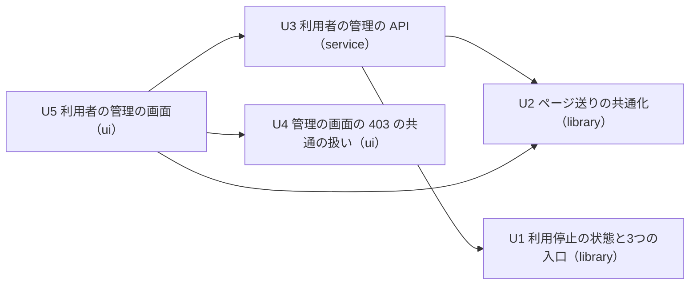

# 単位の依存 — user-admin

この文書は単位の依存（どの単位がどの単位を先に要するか）だけを書く。作る順と、届ける上で最も長い道筋は Delivery Planning で決める。

## 依存の一覧（機械が読む形）

```yaml
units:
  - name: u1-user-suspension
    kind: library
    depends_on: []
  - name: u2-shared-paging
    kind: library
    depends_on: []
  - name: u3-user-admin-api
    kind: service
    depends_on: [u1-user-suspension, u2-shared-paging]
  - name: u4-admin-forbidden-ui
    kind: ui
    depends_on: []
  - name: u5-user-admin-ui
    kind: ui
    depends_on: [u2-shared-paging, u3-user-admin-api, u4-admin-forbidden-ui]
```

## 依存の図



文字の代替: 矢印は「左が右に依存する」を表す。U3 は U1 と U2 に依存する。U5 は U2・U3・U4 に依存する。U1・U2・U4 は、どの単位にも依存しない。循環は無い。

## 依存の理由と、単位の間でやり取りするもの

| 依存 | やり取りするもの | 形 |
|---|---|---|
| U3 → U1 | 停止の状態（UserAccount の列と口）、リフレッシュトークンのまとめての無効化の口（Authentication） | 同じアプリの中の service の口（同期、同じトランザクション） |
| U3 → U2 | ページの番号の検証とページの計算（Paging） | 同じアプリの中の純粋な関数 |
| U5 → U3 | 利用者の管理の API（`/api/admin/` の下の HTTP、JSON、Problem Details の誤り） | HTTP（ApiClient を通す） |
| U5 → U4 | 403 の共通の扱いと表示、自分の氏名と言語の反映の口（AppFrame・ApiClient） | 同じ画面の中の部品の呼び出し |
| U5 → U2 | 画面のページ送りの計算（UiPaging） | 同じ画面の中の純粋な関数 |

境界の細部（API の形・誤りの code・出来事の型）は Contract Design で決める。

## 並行して作れる単位

依存の上では、次の組は並行して作れる（どの順でも依存の向きを満たす）。

- U1・U2・U4 は、たがいに依存しない。
- U4 は、U1・U2・U3 のどれにも依存しない。

この Intent では、並行して作れることを記録するだけにし、1つずつ順に作る前提とする（UQ3 A）。順序は Delivery Planning で決める。
