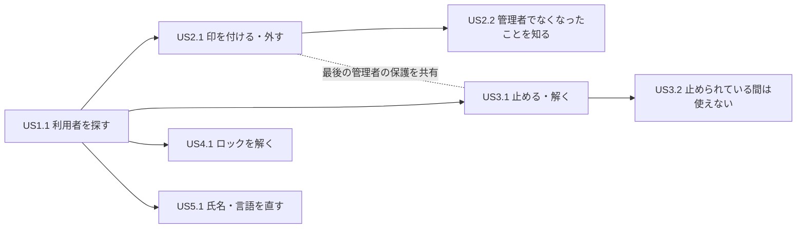

# ユーザーストーリー — user-admin

出典の表記: FR・NFR は `aidlc/spaces/default/intents/260930-user-admin/inception/requirements-analysis/requirements.md`（承認済み）。SQ1〜SQ5・SF1・M1〜M9 は `aidlc/spaces/default/intents/260930-user-admin/inception/user-stories/user-stories-questions.md` の確定した答え（Q1〜Q5・F1・M1〜M9）と、同じファイルの末尾の「リードが決めた点」。TP は `aidlc/spaces/default/memory/team.md`（今回の Practices Discovery で確定）、PM は `aidlc/spaces/default/memory/project.md`。D・開発・品質は、mob の3人の意見（`contributions/aidlc-design-agent.md`・`aidlc-developer-agent.md`・`aidlc-quality-agent.md`）を指す。

この文書は、初稿に3人の意見と依頼者の決定（M1〜M9）を統合した版である。初稿の ID は変えず、足した受け入れ基準は続きの番号にした。承認済みの要件と違う点は、要件を書き換えずに「要件との差」の節に書いた（PM の決まり）。

## 前提と読み方（すべての受け入れ基準に共通）

### 分け方・優先度

- **分け方と細かさ**: 管理者の目的ごとに大きめにまとめる（SQ2 A・SQ5 B）。操作をまたぐ要件（最後の有効な管理者の保護・監査と拒否の理由の順・管理の API の認可）は、関わる各ストーリーの受け入れ基準に入れる（SQ3 A）。
- **優先度**: 1つのストーリーに Should の部分が混ざるときは、ストーリーを Must とし、その受け入れ基準に **〔Should〕** と印を付ける。すべてが Should のストーリーは Should とする（SF1 B）。

### 業務の決まりの読み方

- **「有効な管理者」**: 管理者の印を持ち、利用停止していない利用者。ロック中の管理者も数える（FR4.1）。
- **ロック中の境界**: ロック中は「今の時刻 < 解除の予定の時刻」のときだけとする。解除の予定の時刻ちょうどはロック中でない。一覧の表示・ログインの判定の2つは同じ境界を使う（既存の `LockPolicy` と同じ、品質・開発）。ロックの状態の行が無い利用者は、失敗回数 0 でロックしていないとして扱う（FR1.2）。
- **「失敗回数を戻せる」**: 表に残る失敗回数が1回以上なら「戻せる」とする。解除の予定の時刻を過ぎた利用者（表に回数が残る）も「戻せる」に含む（M2 B）。行が無い・失敗回数 0 の利用者は「戻せない」。一覧の真偽・API の受け付け・監査の3つはこの定義でそろえる。
- **失敗回数を 0 に戻す操作の中身**: 失敗回数を 0 にし、解除の予定の時刻を無くす（回数だけを 0 にしてロックが残る形にしない、開発）。行が無い利用者に行を新しく作らない。
- **しきい値**: ロックのしきい値は設定で変えられる（既定 5 回）。受け入れ基準の「しきい値−1 回」「しきい値ちょうど」は、既定の値と、設定で変えた値の両方で確かめる（品質）。
- **利用停止とトークン**: 止めたときは、その利用者のリフレッシュトークン（複数の端末の分）をすべて無効にする（FR3.3）。アクセストークンには失効の仕組みが無く（PM の DECIDED）、有効期限は既定 5 分。停止中はアクセストークンの認証で DB の状態を見て拒否する。停止を解いた後の、止める前のアクセストークンの扱いは US3.2 の AC3.2.7（M1 A）。
- **停止中のログイン**: 停止の確かめはロックの判定より前に行い、停止中の利用者のログインでは失敗回数とロックの状態を変えない。応答はほかのログインの失敗と同じにし、監査の失敗の理由には「停止中」の区分を足してほかの失敗と区別する（M3 A）。
- **自分自身への操作**: 自分自身の印を外す・自分自身を止めることは拒否する（FR2.4・FR3.6）。自分自身に印を付ける・自分自身の停止を解くも、判定の順により「自分自身への操作」として拒否する。自分自身の失敗回数を戻すことと、自分自身の氏名・言語を変えることは許す（リードの決定、FR6.1）。

### 拒否の理由と判定の順

- **判定の順**: 「対象の利用者がいない → 自分自身への操作 → 対象の利用者が停止中 → 変えるものが無い → 最後の有効な管理者の保護」の順に判定し、最初に当たった理由1つで拒否する。応答と監査はその理由1つにする（FR7.5 に M7 B の「対象の利用者が停止中」を足した順。「要件との差」の差3）。
- **操作ごとに当たりうる理由**（開発の表に M7 B を足したもの。○は当たりうる、―は当たらない）:

| 操作 | 対象がいない | 自分自身 | 対象が停止中 | 変えるものが無い | 最後の有効な管理者 |
|---|---|---|---|---|---|
| 印を付ける | ○ | ○ | ○ | ○（すでに管理者） | ― |
| 印を外す | ○ | ○ | ○ | ○（管理者でない） | ○ |
| 止める | ○ | ○ | ―（すでに停止中は「変えるものが無い」） | ○（すでに停止中） | ○ |
| 停止を解く | ○ | ○ | ― | ○（停止中でない） | ― |
| 失敗回数を 0 に戻す | ○ | ―（許す） | ―（停止中でも受け付ける） | ○（戻せない利用者） | ― |
| 氏名・言語を変える | ○ | ―（許す） | ― | ―（当てない、FR6.6） | ― |

- **拒否の応答**: 業務の理由の拒否は、理由ごとに別の安定した `code` を持ち、1つの code に1つの状態コードを固定した Problem Details で返る（TP の Code Style）。受け入れ基準の「〜として拒否される」は「その理由の code で拒否される」と読む。code の名前と状態コードは機能設計で決める。業務の理由の拒否は 4xx で、5xx にしない。
- **利用者 ID の形の誤りと、いない利用者の区別**: 要求の利用者 ID が数でない・空・桁あふれのときは入力の誤り（既存の `VALIDATION_FAILED`）で、監査に残さない。数として正しいがその利用者がいないときは「対象の利用者がいない」（業務の誤り）で、指定された ID を対象として監査に残す（FR1.5・FR7.3・FR7.6、品質）。監査の対象の利用者の列には参照の制約が無く、実在しない ID をそのまま残せる（開発の確かめ。要件 7節の R-07 の点）。
- **状態が変わらない**: 拒否したとき、対象の利用者の印・停止・失敗回数・解除の予定の時刻・ロックの状態の行の有無と、その利用者のトークンが、操作の前と同じであること（品質の直しで「行の有無」を足した）。

### 監査の読み方

- **監査の確かめ方**: 監査ログの行に、出来事の種類・操作した人・対象の利用者・結果（成功／失敗）・失敗の理由が残ることを確かめる。出来事の種類は、印を付ける・印を外す・止める・停止を解く・失敗回数を戻す の5つで別にする（品質）。種類と理由の名前は機能設計で決める（32 文字まで、KB K-6）。
- 監査ログには、パスワード（平文・ハッシュ値）・トークン・ロックの判定の生の値・検索の文字を残さない（FR7.4、NFR3）。
- 業務の理由で拒否した操作は、業務のトランザクションが巻き戻っても、失敗の監査の行が残る（既存の `AuditRollbackIT` と同じ形、品質）。
- 監査の書き込みに失敗しても、今までどおり操作そのものは失敗させない（既存の「確定の後に記録」の決まりと `AuditWriteFailureIT` にそろえる。リードの決定）。
- 監査に残さないもの: 一覧の閲覧、入力の誤り、氏名・言語の変更（成功・失敗とも）（FR6.4・FR7.3）。

### 認可と「次の要求」

- **認可**: 足す管理の API はどれも、未認証は 401、管理者の印の無い利用者は 403（監査ログには今までどおり「アクセスの拒否」が残る）、有効な管理者は 200 系（FR8.2）。401・403 のときは対象の利用者の状態が変わらず、業務の操作の監査の行は作られない。各ストーリーに、そのストーリーの API の認可の受け入れ基準を1件ずつ置く（品質）。
- **停止中の管理者**: 停止中の管理者のアクセストークンは認証で拒否される（401）ため、管理の API を呼べない（FR3.8）。
- **「次の要求から」の確かめ方**: 操作の応答を受けた後、対象の利用者の**同じアクセストークン**での次の要求で確かめる（トークンを取り直さない。既存の `AdminAccessIT` と同じ形、品質）。
- **要求の改ざん**: 管理の API の外（`/api/me`・`/api/me/preferences`・`/api/me/password`）と、氏名・言語の変更の API の要求の本文に、管理者の印・停止の状態・失敗回数などの項目を入れても、それらは変わらない。知らない項目は今の `/api/me/preferences` と同じく無視する（400 にしない）（FR8.3、開発・品質）。

### 時刻・同時の操作

- **時刻**: ロック中かどうか・トークンの有効期限は、注入した時計で時刻を動かして確かめ、実時刻と `sleep` に頼らない（FR1.2、TP）。
- **同時の操作の合否**: 同時の重なりはスレッドの数に頼らず、テスト用に差し替えられる待ち合わせ（`TestInvitationBarrier` と同じ形）で確実に作る。合否は次の形で決める（NFR4、品質）。
  - 最終の状態が、2つの操作を順に行った結果のどちらか一方に一致する。
  - 成功がちょうど1つのとき、負けた側は業務の誤り（最後の有効な管理者の保護など）として拒否され、5xx にならない。待ちの上限切れで 5xx になる形を合格にしない。
  - 監査の行の数と結果が、最終の状態と合う。
  - 待ち合わせの時間切れはテストの失敗とし、上限を原因を確かめずに延ばさない（TP）。

### 画面の共通の決まり（D-1）

- **画面の状態**: 利用者の管理の画面は、読み込み中・表示・結果 0 件・読み込みの失敗の4つの状態を持ち、利用者の言語の文言で示す。読み込み中である旨は支援技術にも伝える。
- **操作の結果の知らせ**: 成功は短い知らせ（make-you-chic-ui の `Toast` 相当、`role="status"`）で伝え、失敗は理由ごとの文言を操作の近くに残る形（`Alert` 相当）で伝える。成功・失敗のどちらも、操作の後に一覧を読み直して最新の状態を見せる（今のページの番号と検索の文字は保つ）。
- **処理中**: 操作を送ってから応答までの間、その行の操作のボタンは押せず、処理中である旨の読み上げの名前に変わる（二重の送信の防止）。
- **読み上げの名前**: 行ごとの操作のボタンは、対象の利用者が分かる読み上げの名前を持つ（例「山田 太郎（yamada@example.com）の利用を止める」）。
- **色だけに頼らない**: 管理者の印・状態（有効／利用停止）・ロック中は、色に加えて文字（`Badge` の文言）で示す。
- **キーボード**: 一覧・検索・ページ送り・各操作・確かめの表示は、キーボードだけで操作でき、フォーカスの位置が見える。
- **確かめの表示**: 印を付ける・印を外す・止める・停止を解く・失敗回数を戻す の5つの操作の前に出す（M4 B）。対象の利用者の氏名とメールアドレス、操作の効き目を示す。はじめのフォーカスは「やめる」、Escape で閉じ、背景のクリックでは閉じない。閉じたら、開いたボタン（行が変わったときは同じ行の操作）にフォーカスを戻す。「やめる」では要求は送られず、状態も監査も変わらない。形（Modal か行の中か）は画面イメージの段で決める。
- **日時の表示**: 登録した日時・解除の予定の時刻は、利用者の言語の書式と画面の時間帯で表示する。
- **テーマと文字の大きさ**: light・dark と文字の大きさ sm・md・lg のどの組でも、一覧の列と操作のボタンが重ならず読める（NFR7）。
- **言語**: 画面の文言と新しいエラーの説明文は ja・en の両方があり、利用者の言語で表示する（NFR8）。エラーの説明文の言語は、画面が要求に付ける言語（`Accept-Language`、画面の言語）で決まる（開発の確かめ）。
- **画面が持つ管理者の印**: 画面は、ログインの状態（管理者の印を含む）を、ログイン・トークンの更新・画面の読み直し、と、管理の画面で 403 を受けたとき（M5 B）に読み直す。決まった間隔では更新しない（開発の確かめ）。

---

## 群1 利用者を探す

### US1.1 利用者の一覧を見て、利用者を探す

- **ストーリー**: 管理者（P1）として、利用者の一覧で状態（管理者の印・利用停止・ロック）を確かめ、目当ての利用者を探したい。それは、DB を直接見ずに、次に行う操作を決められるようにするためだ。
- **優先度**: Must（検索の部分は Should、SQ4 A）
- **出典**: FR1.1〜FR1.6、FR8.1〜FR8.2、NFR3、NFR5、NFR7、NFR8、NFR9
- **依存**: なし
- **受け入れ基準**:
  - **AC1.1.1** Given 管理者がログインしている / When サイドバーの管理のメニューから利用者の管理の画面を開く / Then 利用者が登録した日時の古い順（同じ日時は利用者 ID の小さい順）に1ページ 20 件並び、各行にメールアドレス・氏名・管理者の印・状態（有効／利用停止）・ロック中かどうか・登録した日時が表示され、全体の件数とページの番号が分かる。
  - **AC1.1.2** Given 利用者 B の解除の予定の時刻が T / When 今が T の1ミリ秒前・T ちょうどのそれぞれで一覧を開く / Then T の前は B がロック中と表示され、解除の予定の時刻が利用者の言語の書式・画面の時間帯で表示される。T ちょうどではロック中と表示されない（失敗回数が残っていても）。ロックの状態の行が無い利用者はロックしていないと表示される。時刻は注入した時計で動かす。
  - **AC1.1.3** Given 一覧を開く / When 応答を調べる / Then ロックについては「ロック中か」「ロック中なら解除の予定の時刻」「失敗回数を戻せるか（真偽）」の3つだけが含まれ、失敗回数そのもの・パスワードのハッシュ値・リフレッシュトークンは含まれない。「戻せるか」は、行が無い・失敗回数 0 で偽、失敗回数1回以上（ロック中・解除の予定の時刻を過ぎた利用者を含む）で真になる（M2 B）。
  - **AC1.1.4** 〔Should〕 Given 氏名かメールアドレスに「yamada」を含む利用者が2人、氏名に「山田」を含む利用者が2人いる / When 「YAMADA」・「山田」でそれぞれ検索する / Then それぞれの2人だけが一覧に出る（ASCII の英字の大文字と小文字は区別しない）。検索の文字に `%`・`_`・`\` を入れると、ワイルドカードやエスケープではなく文字どおりに一致する。検索の結果が 21 件なら2ページになり、全体の件数は検索の結果の件数になる。検索の文字が空なら全件と同じになる。検索の文字の長さの上限ちょうどは受け付ける（上限の値は機能設計で決める）。
  - **AC1.1.5** Given ページの番号が 1 未満・整数でない・空・桁あふれ、または検索の文字が上限＋1 文字 / When 一覧を求める / Then 入力の誤り（`VALIDATION_FAILED`）として拒否され、監査ログには残らず、アプリのログにも検索の文字が出ない。最後のページより後のページの番号（例: 2ページしか無いのに3ページ目）は拒否せず、全体の件数つきの空の一覧（200）を返す（招待の一覧の前例、「要件との差」の差7）。〔検索の部分は Should〕
  - **AC1.1.6** Given TRACE のログを有効にしている / When 足す管理の API のすべて（一覧・印を付ける・外す・止める・停止を解く・失敗回数を戻す・氏名と言語の変更）を呼ぶ / Then アプリのログ・トレースの属性に、メールアドレス・氏名・検索の文字・パスワードのハッシュ値が出ない（既存の `*SecretLeakIT` と同じ形）。どの API の応答（成功の応答を含む）にも、パスワードのハッシュ値・招待のトークンのハッシュ値・失敗回数の生の値が含まれない。
  - **AC1.1.7** Given 利用者が 20 人・21 人のそれぞれ / When 一覧を開く / Then 20 人なら1ページ、21 人なら2ページで2ページ目は1件になる。利用停止中の利用者と初期管理者は一覧に出て、招待中（登録が終わっていない）の人は出ない（前提 A4）。
  - **AC1.1.8** Given 管理者が一覧を開いた / When 応答を待っている間 / Then 読み込み中である旨が表示され、支援技術にも伝わる。応答が来たら一覧に置き換わる。
  - **AC1.1.9** Given 一覧の読み込みが失敗した（5xx・通信の失敗） / When 画面を見る / Then 失敗した旨と、もう一度読み込む操作が表示され、前に表示していた行を最新の状態のように見せ続けない。
  - **AC1.1.10** 〔Should〕 Given 「zzz」に当たる利用者がいない / When 「zzz」で検索する / Then 当たる利用者がいない旨と、検索を消して全体に戻す操作が表示される。検索したときは1ページ目に戻り、ページを送っても検索の文字は保たれる（一覧の全体が 0 件になることは無い。見ている管理者自身が必ずいるため）。
  - **AC1.1.11** 〔Should〕 Given 検索の入力欄 / When 上限より長い文字を入れようとする / Then 画面は上限を超えて入れられないか、送る前に上限を知らせる。サーバー側の拒否（AC1.1.5）は、画面の制限の有無にかかわらず残す。
  - **AC1.1.12** Given 利用者の管理の画面の画面部品 / When アクセシビリティの検査をする / Then 部品ごとに vitest-axe の検査が1件あって違反が無く、WCAG 2.1 AA を満たす。light・dark と文字の大きさ sm・md・lg のどの組でも崩れない。誤りを出した状態と、2語の氏名（頭文字が2文字）を含むデータでも検査する（PM の学び）。画面の言語を en にすると、すべての文言と新しいエラーの説明文が英語になる。実際のブラウザでの検査を足すかは設計で決める。
  - **AC1.1.13** Given 一覧の API / When 未認証・管理者の印の無い利用者・有効な管理者のそれぞれで呼ぶ / Then 401・403・200 になり、403 は監査に「アクセスの拒否」として残る（一覧の閲覧そのものは残さない）。

---

## 群2 権限を管理する

### US2.1 管理者の印を付ける・外す

- **ストーリー**: 管理者（P1）として、利用者に管理者の印を付けたり外したりしたい。それは、管理の担当の交代を DB を触らずに済ませるためだ。
- **優先度**: Must
- **出典**: FR2.1〜FR2.5、FR4.1〜FR4.4、FR7.1〜FR7.6、FR8.2〜FR8.3、NFR1、NFR3、NFR4、NFR8、NFR9
- **依存**: US1.1（画面の上で対象を一覧から選ぶ。API の上では独立）
- **受け入れ基準**:
  - **AC2.1.1** Given 利用者 B は有効で、管理者の印を持たない / When 管理者 A が B に印を付ける / Then 応答の後、B の同じアクセストークンでの次の管理の API の呼び出しが 200 になる。B のトークンは無効にならない。監査ログに出来事の種類（印を付ける）・操作した人 A・対象 B・成功が残る。
  - **AC2.1.2** Given 有効な管理者が A と B の2人 / When A が B の印を外す / Then 応答の後、B の同じアクセストークンでの次の管理の API の呼び出しが 403 になり、有効な管理者は A だけになる。B のトークンは無効にならない。監査ログに出来事の種類（印を外す）・A・B・成功が残る。
  - **AC2.1.3** Given 管理者 A / When A が自分自身の印を外そうとする / Then 「自分自身への操作」として拒否され、状態は変わらず、監査ログに失敗と理由（自分自身への操作）が残る。有効な管理者が A だけでも理由は「自分自身への操作」になる（判定の順）。A が自分自身に印を付けようとした場合も「自分自身への操作」として拒否される。
  - **AC2.1.4** Given 利用者 B は有効ですでに管理者 / When A が B に印を付ける / Then 「変えるものが無い」として拒否され、監査ログに失敗と理由が残る。有効で印を持たない利用者の印を外す場合も同じ。
  - **AC2.1.5** Given 指定した利用者 ID（数として正しい）の利用者がいない / When A がその ID に印を付ける・外す / Then 「対象の利用者がいない」として拒否され、監査ログに指定した ID を対象として失敗が残る。利用者 ID が数でない・桁あふれのときは入力の誤りとして拒否され、監査に残らない。
  - **AC2.1.6** Given 有効な管理者が A と B の2人 / When A が B の印を外すのと、B が A の印を外すのを、有効な管理者を数える直前で待ち合わせて重ねる / Then ちょうど1つが成功し、もう1つは「最後の有効な管理者の保護」として拒否され（5xx にならない）、終わった後の有効な管理者はちょうど1人で、監査は成功1行・失敗1行になる。後に動いた側の操作した人がすでに管理者でなくなっていても、理由は「最後の有効な管理者の保護」とする（リードの決定）。
  - **AC2.1.7** Given 管理者の印の無い利用者 C / When C が `/api/me/preferences`・`/api/me/password` などの管理の API の外へ、要求の本文に管理者の印・停止の状態・失敗回数の項目を入れて送る / Then 要求は今までどおりに扱われ（`/api/me/preferences` は 200）、C の印・停止・失敗回数は変わらない。
  - **AC2.1.8** Given A が一覧で B の「管理者の印を付ける」または「管理者の印を外す」を選ぶ / When 確かめの表示が出る / Then B の氏名・メールアドレスと効き目（付ける: B は次の操作から管理の画面を使える。外す: B は次の操作から管理の画面を使えなくなる）が示され、「やめる」を選ぶと要求は送られず、B の状態も監査も変わらない（M4 B、前提の確かめの表示）。
  - **AC2.1.9** Given 管理者 A が一覧を見る / When 自分自身の行を見る / Then 自分の行の「管理者の印を外す」は押せない形で出て、自分自身には行えない理由が読める（支援技術にも伝わる）。画面の表示にかかわらず、サーバー側の拒否（AC2.1.3）は残す（M6 B、PM の Mandated）。
  - **AC2.1.10** Given 利用者 B は利用停止中 / When A が B に印を付ける・B の印を外す / Then 「対象の利用者が停止中」として拒否され、B の印は変わらず、監査ログに失敗と理由（対象の利用者が停止中）が残る。先に停止を解けば操作できる（M7 B、「要件との差」の差3）。
  - **AC2.1.11** Given 業務処理の層を直接呼ぶテストで、有効な管理者を対象 B だけにした状態（操作する管理者を数に含めない、FR4.4） / When B の印を外す / Then ほかの管理者 C が**ロック中**なら受け付けられ（ロック中も数える）、C が**利用停止中**なら「最後の有効な管理者の保護」として拒否され、状態は変わらない。
  - **AC2.1.12** Given 有効な管理者が A と B の2人 / When A が B の印を外すのと、B が A を止めるのを、有効な管理者を数える直前で待ち合わせて重ねる / Then ちょうど1つが成功し、もう1つは「最後の有効な管理者の保護」として拒否され（5xx にならない）、有効な管理者は 0 人にならない（違う種類の操作の重なり、開発・品質）。
  - **AC2.1.13** Given A が古い一覧のまま操作した / When 印の操作が業務の理由で拒否される / Then 画面は理由ごとの文言を A の言語で操作の近くに表示し、一覧を読み直して今の状態を見せる。「変えるものが無い」では「ほかの管理者がすでに変えた可能性がある」旨、「最後の有効な管理者の保護」では有効な管理者が 0 人になるため受け付けられず先にほかの利用者に印を付ける必要がある旨、「対象の利用者が停止中」では先に停止を解く必要がある旨、「対象の利用者がいない」では対象が見つからない旨を示す（D-6）。
  - **AC2.1.14** Given 印を付ける・外すの API / When 未認証・管理者の印の無い利用者・有効な管理者のそれぞれで呼ぶ / Then 401・403・200 になり、401・403 のときは対象の状態が変わらず、印の操作の監査の行は作られない（403 は「アクセスの拒否」として残る）。

### US2.2 管理者でなくなったことを知る

- **ストーリー**: 管理される利用者（P2。管理者の印を外された元の管理者を含む）として、管理者の印を外されたとき、管理の画面が使えなくなったことを分かりやすく知りたい。それは、画面が壊れたと誤解せずに済むためだ。
- **優先度**: Must
- **出典**: FR2.2〜FR2.3、FR8.1、NFR1、NFR7、NFR8
- **依存**: US2.1（印を外す操作）。表示の仕組みは 403 を受けることだけに依存する
- **受け入れ基準**:
  - **AC2.2.1** Given B は利用者の管理の画面を開いている / When A が B の印を外した後、B が一覧を読む・操作する / Then サーバーは 403 を返し、画面は一覧と操作を出さずに「管理者ではなくなった（管理の画面を使う権限が無い）」旨を B の言語で表示し、管理の画面の外へ移る手段を示す。開いていた確かめの表示・入力の表示は閉じる。文言の細部は画面イメージの段で決める（M5 B。文言の注意は「残る隙と申し送り」）。
  - **AC2.2.2** Given B の印が外された / When B の画面が 403 を受ける・トークンを更新する・画面を読み直す・ログインし直す、のどれかが起きる / Then B の画面はログインの状態を読み直し、サイドバーの管理のメニューが表示されなくなる。時間の経過（5 分など）では判定しない（「要件との差」の差2）。
  - **AC2.2.3** Given B の印が外された / When B が管理の API の外の画面（自分の設定など）を使う / Then 今までどおり使え、ログアウトはされない。
  - **AC2.2.4** Given B は管理の入口・DSL の管理・招待の管理のどれかの画面を開いている / When B の印が外された後に B がその画面で読む・操作する / Then どの画面も AC2.2.1 と同じ表示（「ページが見つかりません」や一般の誤りの文言ではない）になり、AC2.2.2 と同じくログインの状態を読み直して管理のメニューを消す（M5 B、今回の範囲を広げた。「要件との差」の差2）。
  - **AC2.2.5** Given B の画面はまだ B を管理者として扱っている / When B が管理の画面を開き直す / Then AC2.2.1 の表示になり、一覧の行（ほかの利用者のメールアドレス・氏名）は表示されない。
  - **AC2.2.6** Given B の印が外された / When B が管理の API を呼ぶ / Then 監査に今までどおり「アクセスの拒否」（管理者でない）が残る。

---

## 群3 利用を止める

### US3.1 利用を止める・停止を解く

- **ストーリー**: 管理者（P1）として、利用者の利用を止めたり、止めた利用者の停止を解いたりしたい。それは、退職や一時的な不在の人の利用を、利用者を消さずにすぐ止められるようにするためだ。
- **優先度**: Must
- **出典**: FR3.1、FR3.3、FR3.6〜FR3.7、FR4.1〜FR4.4、FR7.1〜FR7.6、FR8.2〜FR8.3、NFR1、NFR4、NFR8、NFR9、NFR10
- **依存**: US1.1（画面の上で対象を一覧から選ぶ。API の上では独立）
- **受け入れ基準**:
  - **AC3.1.1** Given 利用者 B は有効で、2つの端末でログインしている / When 管理者 A が B を止める / Then 一覧で B は「利用停止」と表示され、B のどちらの端末のリフレッシュトークンで更新しても 401 `REFRESH_FAILED` になり、ほかの利用者のリフレッシュトークンは使える。監査ログに出来事の種類（止める）・A・B・成功が残る。止めた理由は記録しない。
  - **AC3.1.2** Given B は利用停止中 / When A が B の停止を解く / Then 一覧で B は「有効」と表示され、監査ログに出来事の種類（停止を解く）・A・B・成功が残る。止める前に出した B のリフレッシュトークンは使えないままである。止める前に出したアクセストークンの扱いは AC3.2.7（M1 A、「要件との差」の差1）。
  - **AC3.1.3** Given 管理者 A / When A が自分自身を止めようとする / Then 「自分自身への操作」として拒否され、状態は変わらず、監査ログに失敗と理由が残る。有効な管理者が A だけでも理由は「自分自身への操作」になる。
  - **AC3.1.4** Given B はすでに利用停止中 / When A が B を止める / Then 「変えるものが無い」として拒否され、監査ログに失敗と理由が残る。有効な利用者の停止を解く場合も同じ。
  - **AC3.1.5** Given 有効な管理者が A と B の2人 / When A が B を止めるのと、B が A を止めるのを、有効な管理者を数える直前で待ち合わせて重ねる / Then ちょうど1つが成功し、もう1つは「最後の有効な管理者の保護」として拒否され（5xx にならない）、終わった後の有効な管理者はちょうど1人で、監査は成功1行・失敗1行になる。
  - **AC3.1.6** Given 指定した利用者 ID（数として正しい）の利用者がいない / When A がその ID を止める・停止を解く / Then 「対象の利用者がいない」として拒否され、監査ログに指定した ID を対象として失敗が残る。
  - **AC3.1.7** Given A が一覧で B の「利用を止める」または「停止を解く」を選ぶ / When 確かめの表示が出る / Then B の氏名・メールアドレスと効き目（止める: B はすぐに使えなくなり、停止を解いた後もログインし直しが要る。解く: B は新しくログインすれば使える）が示され、「やめる」を選ぶと要求は送られず、B の状態も監査も変わらない（M4 B）。
  - **AC3.1.8** Given 管理者 A が一覧を見る / When 自分自身の行を見る / Then 自分の行の「利用を止める」は押せない形で出て、自分自身には行えない理由が読める。サーバー側の拒否（AC3.1.3）は残す（M6 B）。
  - **AC3.1.9** Given 業務処理の層を直接呼ぶテストで、有効な管理者を対象 B だけにした状態（FR4.4） / When B を止める / Then ほかの管理者 C が**ロック中**なら受け付けられ、C が**利用停止中**なら「最後の有効な管理者の保護」として拒否され、状態は変わらない。
  - **AC3.1.10** Given 利用者 B はロック中 / When A が B を止める / Then 受け付けられ、一覧で B は「利用停止」と「ロック中」の両方が表示される。B の失敗回数とロックの状態は、止めたことでは変わらない。
  - **AC3.1.11** Given A が B を止めた・停止を解いた / When 一覧を見る / Then B の行の状態は文字の印で示され、操作は「停止を解く」／「利用を止める」に切り替わる。業務の理由で拒否されたときは AC2.1.13 と同じく理由ごとの文言を示して一覧を読み直す。
  - **AC3.1.12** Given 止める・停止を解くの API / When 未認証・管理者の印の無い利用者・有効な管理者のそれぞれで呼ぶ / Then 401・403・200 になり、401・403 のときは対象の状態が変わらず、停止の操作の監査の行は作られない。

### US3.2 止められている間は使えず、解かれたら使える

- **ストーリー**: 管理される利用者（P2）として、止められている間はどの経路からも使えず、停止を解かれたら再びログインして使いたい。それは、止めた意味が確かに守られ、再開も管理者の操作だけで済むようにするためだ。
- **優先度**: Must
- **出典**: FR3.2〜FR3.5、FR3.8〜FR3.9、FR7.4、NFR1、NFR2、NFR8、NFR9
- **依存**: US3.1（止める操作）。3つの入口での拒否は、停止の状態をテストのデータとして入れれば US3.1 より先に作って確かめられる（開発）
- **受け入れ基準**:
  - **AC3.2.1** Given B を止めた / When 止めた応答の後に、B が止める前に出した同じアクセストークンで API を呼ぶ / Then 401 `AUTHENTICATION_REQUIRED`（無効なアクセストークンと同じ応答）になる。
  - **AC3.2.2** Given B を止めた / When B が止める前に出したリフレッシュトークンで更新する / Then 401 `REFRESH_FAILED`（無効なリフレッシュトークンと同じ応答）になる。
  - **AC3.2.3** Given B を止めた / When B が正しいパスワードでログインする / Then 401 `AUTHENTICATION_FAILED` になり、応答はパスワードを誤ったときと区別できない。応答の時間をそろえる仕組みは、パスワードの照合（ハッシュの比べ）とロックの状態の行の読み書きの回数が、パスワードを誤ったときと同じであることで確かめる（ダミーの行を使うなどの形は設計で決める。既存の `LoginServiceTest` の考え方、品質）。
  - **AC3.2.4** Given B の停止を解いた / When B が入口ごとに、新しくログインする・そのとき出たリフレッシュトークンで更新する・新しいアクセストークンで API を呼ぶ / Then 3つの入口のすべてで受け付けられる。止める前のリフレッシュトークンでの更新は 401 `REFRESH_FAILED` になる。
  - **AC3.2.5** Given 管理者 C を止めた / When C が止める前に出したアクセストークンで管理の API（印・停止・失敗回数の操作）を呼ぶ / Then 401 になり、対象の利用者の状態は変わらず、業務の操作の監査の行は作られない。
  - **AC3.2.6** Given B は利用停止中 / When 管理者が B のメールアドレスで招待する / Then 今までどおり「登録済み」として招待は拒否される（前提 A1）。
  - **AC3.2.7** Given B が時刻 t0 にアクセストークン X（有効期限 t0＋5 分）を受け取り、t0＋1 分に止められ、t0＋2 分に停止を解かれた / When B が X で API を呼ぶ / Then 停止中（t0＋1 分〜t0＋2 分）は 401 になり、停止を解いた後は X の有効期限の直前（t0＋5 分の1ミリ秒前）まで受け付けられ、有効期限ちょうど以後は 401 になる。これは決めた側の動作とする（アクセストークンに失効の仕組みを持たない DECIDED による。M1 A、「要件との差」の差1）。時刻は注入した時計で動かす。
  - **AC3.2.8** Given B は利用停止中で、失敗回数は n（しきい値未満） / When B が誤ったパスワード・正しいパスワードでそれぞれログインを試みる / Then どちらも 401 `AUTHENTICATION_FAILED` になり、B の失敗回数（n のまま）・解除の予定の時刻・ロックの状態は変わらない。監査ログにはログインの失敗が、理由「停止中」の区分でほかの失敗と区別して残る（応答は区別しない。M3 A、「要件との差」の差5）。
  - **AC3.2.9** Given B は画面を開いたまま止められた / When B が次に操作する / Then 画面は 401 を受けてトークンの更新を試み、更新も 401 になってログインの画面へ移る。止められたことを示す文言は出さない（ほかの理由でログインが切れたときと同じ表示）。
  - **AC3.2.10** Given 止められた B がログインの画面で正しいパスワードを入れる / When 拒否される / Then 画面の文言はパスワードを誤ったときと同じで、停止・ロックのどちらかを見分けられない。

---

## 群4 ロックを解く

### US4.1 ロックを解く（失敗回数を 0 に戻す）

- **ストーリー**: 管理者（P1）として、パスワードを誤り続けてロックされた利用者を、解除の予定の時刻を待たずにログインできる状態に戻したい。それは、問い合わせを受けたその場で利用者の仕事を止めずに済むためだ。
- **優先度**: Must（ロック中でない利用者の回数の取り消しは Should、SQ4 C）
- **出典**: FR1.2、FR1.6、FR5.1〜FR5.4、FR7.1〜FR7.6、FR8.2、NFR4、NFR8、NFR9
- **依存**: US1.1（画面の上で対象を一覧から選ぶ。API の上では独立）
- **受け入れ基準**:
  - **AC4.1.1** Given 利用者 B はロック中 / When 管理者 A が B の失敗回数を 0 に戻す / Then B の失敗回数は 0、解除の予定の時刻は無しになり、B は直後に正しいパスワードでログインできる。一覧の B の行はロック中でなくなり、「戻せるか」は偽になって「失敗回数を戻す」の操作が消える。監査ログに出来事の種類（失敗回数を戻す）・A・B・成功が残る。
  - **AC4.1.2** Given 失敗回数を 0 に戻した直後の B / When B がパスワードを誤る / Then しきい値−1 回ではロックされず、しきい値ちょうどでロックされる。既定のしきい値（5 回）と、設定で変えたしきい値（例: 3 回）の両方で確かめる。回数の計算は性質ベースのテスト（jqwik、任意のしきい値 n）にも向く（TP）。
  - **AC4.1.3** 〔Should〕 Given B はロック中でないが失敗回数が1回以上ある（解除の予定の時刻が無い場合と、解除の予定の時刻を過ぎた場合の両方） / When A が B の失敗回数を 0 に戻す / Then 失敗回数が 0 になり、監査ログに成功が残る（M2 B）。
  - **AC4.1.4** Given 利用者 C は失敗回数が 0、またはロックの状態の行が無い / When 一覧を見る・A が API で C の失敗回数を戻そうとする / Then 一覧に操作は出ず、API では「変えるものが無い」として拒否され、監査ログに失敗と理由が残る。行が無い利用者について、拒否の後も行は作られない。
  - **AC4.1.5** Given B の失敗回数はしきい値−1 回 / When A の取り消しと、B の誤ったパスワードでのログイン（しきい値ちょうどに届く1回）を、行の排他を先に取った側で待ち合わせて重ねる / Then 終わった後の状態は、2つを順に行った結果のどちらか一方（取り消しが先なら失敗回数 1・ロックなし、ログインが先なら失敗回数 0・ロックなし）に一致し、それ以外（失敗回数がしきい値を超える、解除の予定の時刻だけ残る など）にならない。どちらの要求も 5xx にならない。時刻は注入した時計で動かす。
  - **AC4.1.6** Given 指定した利用者 ID（数として正しい）の利用者がいない / When A が失敗回数を戻そうとする / Then 「対象の利用者がいない」として拒否され、監査ログに指定した ID を対象として失敗が残る。
  - **AC4.1.7** Given 管理者 A 自身の失敗回数が1回以上 / When A が自分自身の失敗回数を戻す / Then 受け付けられ、A の失敗回数は 0 になり、監査ログに成功が残る（自分自身への操作として拒否しない。リードの決定）。
  - **AC4.1.8** Given 利用者 B は利用停止中で、止める前の失敗回数が1回以上ある / When A が B の失敗回数を戻す / Then 受け付けられ（「対象の利用者が停止中」は印の操作だけに当てる）、B は停止中のままである。
  - **AC4.1.9** Given A が一覧で B の「失敗回数を戻す」を選ぶ / When 確かめの表示が出る / Then B の氏名・メールアドレスと効き目（B はすぐに正しいパスワードでログインできる）が示され、「やめる」を選ぶと要求は送られず、B の状態も監査も変わらない（M4 B）。
  - **AC4.1.10** Given 一覧で B はロック中と表示されたが、操作の前に解除の予定の時刻を過ぎた、またはほかの管理者がすでに B の回数を戻した / When A が B の失敗回数を戻す / Then 表に回数が残っていれば成功し〔ロック中でない利用者の取り消しは Should〕、残っていなければ「変えるものが無い」として拒否され AC2.1.13 と同じ文言を示す。どちらでも画面は操作の後に一覧を読み直し、B の今のロックの表示を見せる。
  - **AC4.1.11** Given B のロックの状態の行が、ほかの処理に排他されたまま待ちの上限を超える / When A が B の失敗回数を戻す / Then B の状態は変わらず、決めた code（機能設計・NFR 設計で決める）で失敗する。
  - **AC4.1.12** Given 失敗回数を戻す API / When 未認証・管理者の印の無い利用者・有効な管理者のそれぞれで呼ぶ / Then 401・403・200 になり、401・403 のときは対象の状態が変わらず、失敗回数の操作の監査の行は作られない。

---

## 群5 利用者の情報を直す

### US5.1 利用者の氏名・言語を直す

- **ストーリー**: 管理者（P1）として、利用者の氏名や言語を直したい。それは、登録の時の誤りや、利用者からの頼みにその場で応えられるようにするためだ。
- **優先度**: Should（SQ4 B）
- **出典**: FR6.1〜FR6.6、FR7.3、FR8.2〜FR8.3、NFR3、NFR8
- **依存**: US1.1（画面の上で対象を一覧から選ぶ。API の上では独立）
- **受け入れ基準**:
  - **AC5.1.1** Given 利用者 B / When 管理者 A が B の氏名を直す / Then 一覧に直した氏名が表示され、監査ログには残らない（失敗の場合も残らない、FR6.4・FR7.3）。
  - **AC5.1.2** Given 利用者 B の言語は ja / When A が B の言語を en に直した後、B が画面を読み直す・ログインし直す・トークンを更新する / Then B の画面の文言が英語になり、画面が要求に付ける言語が英語になるので、エラーの説明文も英語になる。B がすでに開いている画面の言語がその場で変わることは求めない。言語は利用者の言語として保存されるが、登録を終えた利用者へ送るメールは今は無いため、メールの言語はこの Intent では確かめない（「要件との差」の差6）。
  - **AC5.1.3** Given 管理者 A / When A が利用者の管理の画面で自分自身の言語・氏名を直す / Then 直した直後から A の画面にその言語が当たり、上の帯などに出る自分の氏名も直した氏名になる。
  - **AC5.1.4** Given 氏名を空・空白だけ・上限＋1 文字にする、または言語に `JA`・`fr` など ja・en 以外を入れる / When A が保存する / Then 入力の誤りとして拒否され、値は変わらず、監査に残らない。氏名の上限ちょうどは受け付ける（検証と上限はプリファレンスの画面と同じ規則、FR6.2）。
  - **AC5.1.5** Given 指定した利用者 ID（数として正しい）の利用者がいない / When A が保存する / Then 「対象の利用者がいない」業務の誤りとして拒否され、監査に残らない。今と同じ値のまま保存したときは成功として受け付ける（FR6.6）。
  - **AC5.1.6** Given 管理者 A / When A が氏名・言語の変更の API の要求の本文に、メールアドレス・パスワード・テーマ・文字の大きさ・管理者の印・停止の状態・失敗回数の項目を入れて送る / Then 氏名と言語だけが変わり、ほかは変わらない（知らない項目は無視する）。この API から印・停止を変えて監査と最後の管理者の保護をすり抜けられない（品質）。
  - **AC5.1.7** Given A が B の氏名・言語を直す入力を開いた / When 見る・操作する / Then 氏名と言語には B の今の値が入っている。「やめる」を選ぶと値は変わらない。入力の誤りは、その入力欄のすぐ近くに利用者の言語で示され、入力した値は消えない。
  - **AC5.1.8** Given 氏名・言語の変更の API / When 未認証・管理者の印の無い利用者・有効な管理者のそれぞれで呼ぶ / Then 401・403・200 になり、401・403 のときは対象の氏名・言語が変わらない。

---

## E2E の代表の流れ（M9 A）

`team.md` の「Intent ごとに代表の流れを1本まで」「状態を変える操作は、その流れで自分で作った利用者だけを対象にし、初期管理者の状態は変えない」に合わせ、次の1本を代表の流れとする。

1. 管理者（初期管理者）が、流れの中で招待して登録させた利用者 U を、利用者の管理の画面で見つける（US1.1）
2. U がパスワードをしきい値の回数だけ誤り、ロックされる。一覧で U がロック中と表示される（US1.1）
3. 管理者が確かめの表示を経て U の失敗回数を戻し、U が正しいパスワードでログインできる（US4.1）
4. 管理者が確かめの表示を経て U を止める。U の画面は次の操作でログインの画面へ移り、ログインもパスワードの誤りと同じ文言で拒否される（US3.1・US3.2）
5. 管理者が停止を解き、U が新しくログインできる（US3.1・US3.2）

- 管理者の印の付け外しは、サーバー側の結合テスト（AC2.1.1・AC2.1.2）と画面部品のテストで確かめ、この流れには入れない。
- Playwright で行うアクセシビリティの検査は、流れの本数に数えない（PM の読み方）。
- **目当ての利用者を探す手段の依存**: E2E は1つの内部DB を全ファイルで共有し、前の E2E が作った利用者が積もるため、「登録した日時の古い順」では U が1ページ目に出るとは限らない。1 で U を見つけるには検索（AC1.1.4、〔Should〕）に頼る。Delivery Planning で検索を後の Bolt に回すときは、この E2E を足す Bolt を検索の後に置くか、ページを送って探す書き方にするかを合わせて決める（品質）。

---

## 要件との差

承認済みの `requirements.md` は書き換えず、この段の決定で要件と違う形になった点を1つずつ書く（PM の決まり）。

### 差1 停止を解いた後の、止める前のアクセストークン（FR3.3、M1 A）

- **要件**: FR3.3「停止を解いても、止める前に出したトークンは使えない」。
- **ストーリー**: 止めたときに無効にするのはリフレッシュトークンだけで、止める前のリフレッシュトークンは停止を解いた後も使えない（要件どおり）。一方、アクセストークンには失効の仕組みが無い（DECIDED）ため、止めてから有効期限（既定 5 分）の内に停止を解くと、止める前のアクセストークンは期限まで再び使える。これを決めた側の動作として AC3.2.7 に明記した。
- **理由**: 依頼者の決定（M1 A）。発行時刻と比べる仕組みを足す案（M1 B）は取らなかった。

### 差2 管理者でなくなったときの表示の範囲と、印の反映の時点（FR2.3、M5 B と事実の直し）

- **要件**: FR2.3「画面は次のトークンの更新（最大 5 分後）かログインで印を反映する。管理の画面で 403 を受けたときは、管理者ではなくなった旨を表示する」。7節は表示と管理のメニューを隠すまでの扱いを後の段に回していた。
- **ストーリー**: (1) 画面は決まった間隔でトークンを更新せず、401 を受けたときと画面を開いた（読み直した）ときだけ更新するため、「最大 5 分後」は誤り。印の反映は、トークンの更新・画面の読み直し・ログインし直し・管理の画面で 403 を受けたときの、出来事の時点で決める（AC2.2.2）。(2) 403 を受けたときの表示とログインの状態の読み直しを、利用者の管理の画面だけでなく、管理の画面すべて（入口・DSL・招待・利用者の管理）にそろえる（AC2.2.4）。今の入口・DSL は 403 を「ページが見つかりません」、招待は一般の誤りの文言で出しており、既存の画面とテストの変更が今回の範囲に入る。
- **理由**: (1) は開発の確かめた事実（`frontend/src/shared/api-client/apiClient.ts`・`frontend/src/features/auth/authSession.ts`）による直し。(2) は依頼者の決定（M5 B）。

### 差3 停止中の利用者への印の付け外しと、拒否の理由の区分・判定の順（FR7.2・FR7.5、M7 B）

- **要件**: FR7.2 は拒否の理由を4つ（対象の利用者がいない・自分自身への操作・変えるものが無い・最後の有効な管理者の保護）とし、FR7.5 はその順で判定する。停止中の利用者への印の付け外しは要件に書かれていない。
- **ストーリー**: 停止中の利用者への印の付け外しは拒否する（AC2.1.10）。拒否の理由に「対象の利用者が停止中」を足して5つとし、判定の順を「対象の利用者がいない → 自分自身への操作 → 対象の利用者が停止中 → 変えるものが無い → 最後の有効な管理者の保護」とする（前提の「拒否の理由と判定の順」）。この理由は印の操作だけに当て、止める・停止を解く・失敗回数を戻す・氏名と言語の変更には当てない。
- **理由**: 依頼者の決定（M7 B）。

### 差4 「失敗回数を戻せる」の読み（FR1.6・FR5.1・FR5.2、M2 B）

- **要件**: FR5.1「失敗回数が1回以上ある利用者について、失敗回数を 0 に戻せる」。FR1.6 は「FR5 の操作を出せるかどうかの真偽」を応答に含める。解除の予定の時刻を過ぎた利用者の扱いは明記されていない。
- **ストーリー**: 表に残る失敗回数で決める文字どおりの読みを取り、解除の予定の時刻を過ぎた利用者（表に回数が残る）も「戻せる」とする（AC1.1.3・AC4.1.3）。今のロックの判定は、解除の予定の時刻を過ぎた利用者の次のログインを 0 から数え直すため、この利用者の回数を戻しても次のログインの結果は変わらないが、成功として受け付け監査に残す。
- **理由**: 依頼者の決定（M2 B）。効き目で決める案（M2 A）は取らなかった。

### 差5 停止中のログインの扱いと、監査の理由の区分（FR3.2・FR3.4・FR7、M3 A）

- **要件**: FR3.4 は停止中の拒否の応答をほかの失敗と同じにする。停止の確かめとロックの判定の順、停止中のログインで失敗回数を数えるか、監査の理由を区別するかは書かれていない。FR7 の監査の要件は管理の操作についてのもので、ログインの失敗の理由の区分は扱っていない。
- **ストーリー**: 停止の確かめをロックの判定より先に行い、停止中の利用者のログインでは失敗回数とロックの状態を変えない。ログインの失敗の監査の理由に「停止中」の区分を足して、ほかの失敗と区別する。応答は今までどおり同じ（AC3.2.3・AC3.2.8）。
- **理由**: 依頼者の決定（M3 A）。監査は応答に出ないため、区別して残しても列挙の防止（NFR2）は崩れない。

### 差6 言語の変更の効き目（FR6.3、事実の直し）

- **要件**: FR6.3「変えた言語は、その利用者の次の画面の表示・エラーの説明文・送るメールに当たる」。
- **ストーリー**: 登録を終えた利用者へ送るメールは今は無い（メールは招待だけ）ため、メールの言語はこの Intent では確かめない。エラーの説明文の言語は、DB の利用者の言語ではなく、画面が要求に付ける言語（`Accept-Language`）で決まるため、「B の画面の言語が英語になった結果、エラーの説明文も英語になる」形で確かめる（AC5.1.2）。
- **理由**: 開発・品質の確かめた事実（`backend/src/main/resources/mail/templates/`・`frontend/src/shared/api-client/apiClient.ts`）による直し（リードの決定）。

### 差7 範囲の外のページの番号（FR1.5、読み方）

- **要件**: FR1.5「ページの番号や検索の文字が不正なとき（数でない、範囲の外、長すぎる など）は、入力の誤りとして拒否する」。
- **ストーリー**: 「範囲の外」を「1 未満・整数でない・空・桁あふれ」と読み、最後のページより後のページの番号は拒否せず、全体の件数つきの空の一覧を返す（AC1.1.5）。
- **理由**: 既存の招待の一覧の前例（`invitation/domain/InvitationPaging.java`）にそろえ、検索の結果が減ったときに画面が誤りにならないようにするため（開発・品質の指摘、リードの決定）。

### 要件で後の段に回されていた点のうち、この段で決めたもの（差ではない）

- 各操作の前の確かめの表示: 5つの操作すべてで出す（M4 B、前提の画面の共通の決まり）。形は画面イメージの段。
- 自分自身の行の操作: 押せない形で出して理由を示す（M6 B、AC2.1.9・AC3.1.8）。
- 一覧の並びの向きと同順: 登録した日時の古い順、同じ日時は利用者 ID の小さい順（AC1.1.1。FR1.3 の「登録した順」の読み）。
- 対象の利用者がいないときの監査: 監査の対象の利用者の列には参照の制約が無く、指定した ID をそのまま残せる（R-07 の点、開発の確かめ）。列の扱いの最終の確かめは機能設計。
- 自分自身の失敗回数を戻すことは許す（リードの決定、AC4.1.7）。

---

## 残る隙と申し送り

- **止める操作とトークンの更新の重なり（M8 B、塞がない）**: A が B を止める処理でリフレッシュトークンを無効にしている間に、B のトークンの更新が停止の確定の前の状態を読んで新しいリフレッシュトークンを作ると、そのトークンは無効にされずに残りうる。停止中は更新の入口で拒否されるので停止の間は害が無いが、停止を解いた後にそのトークンで更新できてしまう。依頼者の決定（M8 B）で、この隙は塞がずに残し、受け入れ基準には入れない。AC3.1.2・AC3.2.4 の「止める前のリフレッシュトークンは使えない」は、この重なりが起きなかった場合についての基準と読む。
- **403 の表示の文言（D-4 の注意）**: 403 は印を外されたとき以外（そもそも管理者でない人が URL を直接開く など）にも起きうるため、「管理者ではなくなった」と言い切ると、印を持ったことの無い人には誤りになる。AC2.2.1 は依頼者の決定（M5 B）の趣旨どおり書いたうえで、文言の細部（原因を言い切らない言い方にするか）を画面イメージの段で決める。
- **停止中の管理者の 401 の監査の理由**: `/api/admin/` の下の 401 は今の仕組みで「アクセスの拒否」として監査に残る。停止中による拒否の理由を既存の区分（利用者がいない など）に寄せると監査を読む人が取り違えるため、区分を足すかを機能設計で決める（開発）。区分を足すと `access.domain`・`auth.domain` に手が入る。
- **code・出来事の種類・理由の名前**: すべて機能設計で決める（32 文字まで）。
- **待ち合わせの口の置き場**: 「有効な管理者を数える直前」「失敗回数の行を読む直前」に、本番のコードを変えずにテストで差し替えられる部品を置く。置き場は設計で決める（品質）。
- **行の排他の待ちの上限切れ**（AC4.1.11）の code と監査の扱いは、機能設計・NFR 設計で決める。
- **カバレッジの作業**: 停止の理由・ロックの取り消しで `auth.domain`・`auth.repository`・`access.domain`・`access.service`（`packagesJudgedByTotal` の一覧の中）に手が入ると、そのパッケージを下限まで上げて一覧から外す作業が付く（開発、TP）。Delivery Planning とコード生成の計画で見積もる。
- **大きさと順番（Delivery Planning への申し送り、開発）**: US2.1 と US3.1 は「最後の有効な管理者の保護」と「拒否の理由の判定と監査」を共有するため、同じ Bolt に入れるか共通の部品を先の Bolt に置く。US3.2 は認証の3つの入口・リフレッシュトークンのまとめての無効化・監査の区分・スキーマの変更・画面の遷移に及び最も重い。分けるなら「3つの入口での拒否（サーバー）」と「P2 が画面で受ける動き」に割るのが自然。US1.1 の利用者とロックの状態を合わせる処理（K-3）は、各操作の対象の読み取りにも使えるため先に作ると後が軽い。

---

## 保たれた異論

None.

3人の意見のうち判断が分かれた点（確かめの表示の範囲・403 の表示の範囲・自分の行の操作・「戻せる」の定義・停止中のログイン・E2E の流れ など）は、依頼者の決定（M1〜M9）で決着した。担当の推しと違う形になった点（D-3 の確かめを3つの操作に絞る推し、D-4 と開発の (a) 利用者の管理の画面だけにする推し、D-5 の自分の行の操作を出さない推し、開発の M2 A の推し）は、依頼者の決定として扱い、異論としては残さない。D-4 の文言の注意は「残る隙と申し送り」に移した。

---

## 依存と順序

文字の代替: 画面の上では US1.1 がほかのすべての入口になる（対象を一覧から選ぶ）。US2.2 は US2.1 に、US3.2 は US3.1 に依存する。US4.1・US5.1 は US1.1 だけに依存する。US2.1 と US3.1 は「最後の有効な管理者の保護」と「拒否の理由の判定と監査」の部品を共有する（点線）。API の上では、印・停止・取り消し・氏名の変更は一覧が無くても作れ、サーバー側のテストで確かめられる。E2E の代表の流れは US1.1（検索）・US3.1・US3.2・US4.1 にまたがる。

## INVEST の確かめ

| ストーリー | 独立 | 交渉可能 | 価値 | 見積もり | 小ささ | テスト可能 | 備考 |
|---|---|---|---|---|---|---|---|
| US1.1 | ○ | ○ | ○ | ○ | △ | ○ | 一覧・検索・画面の状態・アクセシビリティをまとめたため大きめ（SQ5 B）。AC 13 件。利用者とロックの状態を合わせる処理（K-3）を含む |
| US2.1 | ○（API）／△（画面） | ○ | ○ | ○ | △ | ○ | 画面は一覧に依存。最後の管理者の同時性（同じ種類・違う種類）・停止中の対象の拒否を含む。AC 14 件 |
| US2.2 | △ | ○ | ○ | ○ | △ | ○ | US2.1 に依存。管理の画面すべて（入口・DSL・招待）の 403 の表示に広げた（M5 B） |
| US3.1 | ○（API）／△（画面） | ○ | ○ | ○ | △ | ○ | 画面は一覧に依存。最後の管理者の同時性とリフレッシュトークンのまとめての無効化を含む。AC 12 件 |
| US3.2 | ○（停止の状態をデータで入れれば）／△ | ○ | ○ | ○ | △ | ○ | 認証の3つの入口・停止を解いた後のアクセストークン・停止中のログインの監査・画面の遷移に及び最も重い |
| US4.1 | ○（API）／△（画面） | ○ | ○ | ○ | △ | ○ | `auth` に閉じる。ログインとの同時性・待ちの上限切れを含む。AC 12 件 |
| US5.1 | ○（API）／△（画面） | ○ | ○ | ○ | ○ | ○ | Should。監査に残さない |

受け入れ基準が6件を超えるストーリーは、操作をまたぐ要件（認可・監査・最後の管理者・画面の共通の状態）を各ストーリーに入れた（SQ3 A）ためで、分けずに大きめのままにした（SQ5 B）。独立の「○（API）／△（画面）」は、サーバー側の単位では一覧が無くても作って確かめられ、画面の上では一覧を入口にすることを表す（開発）。
