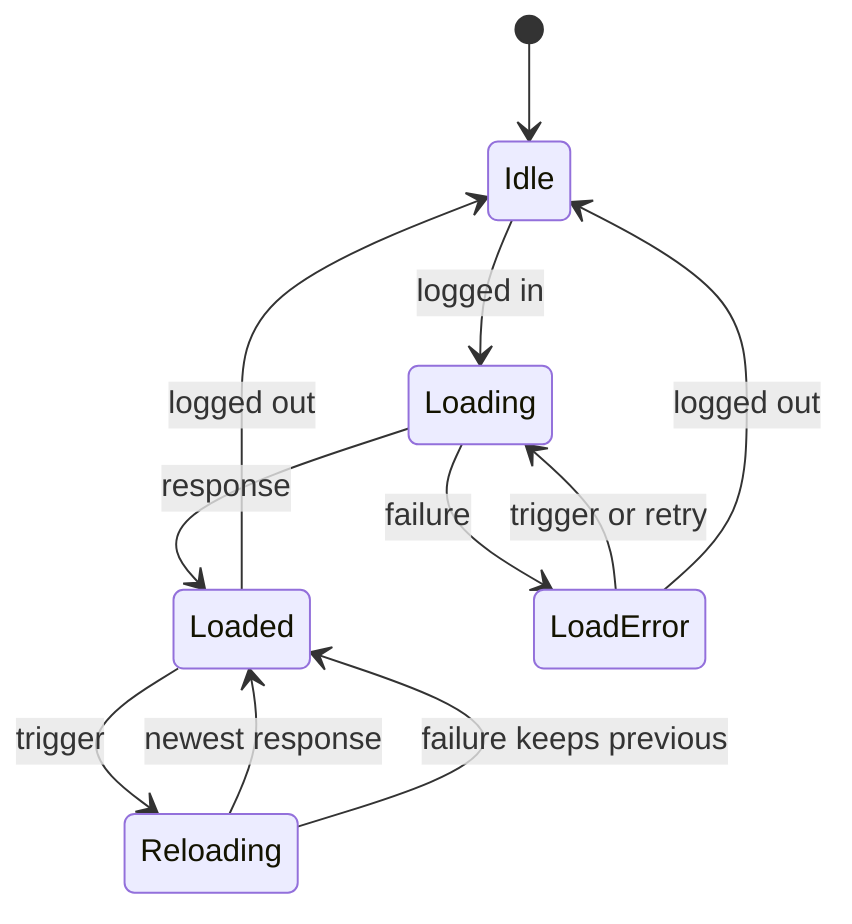

# 機能の仕様 — U7 app-frame-ui

U7 は kind が ui の単位で、`entities.md`・`rules.md` を作らない（段の定義の `produces_kinds`）。この文書が画面の流れ（番号つきの手順）と画面の状態の遷移の正で、ほかの成果物を読まなくても分かるように書く。画面の単位の決まりは 2節の D1〜D30 に番号を付けて持ち、`traceability.json` はこの番号と流れの番号（W1.1 など）を指す。部品・props・型・文言は `frontend-components.md` に書く。

## 出典

- 作る単位 `aidlc/spaces/default/intents/261004-role-menu/inception/units-generation/unit-of-work.md`（U7 の持ち物と境界）。
- ストーリーと単位の対応 `inception/units-generation/unit-of-work-story-map.md`（US4.1・US4.2・US5.1 の画面、US5.3 の主の単位。E2E の I の流れは U7、F の流れは U6・U7 をまたぐ）。
- 要件 `inception/requirements-analysis/requirements.md`（FR5・FR6・FR9・FR10、NFR1・NFR2.2・NFR4・NFR6、C1・C3）。
- 部品の一覧 `inception/domain-design/components.md`（AppFrame・MyPermissionsUi・TablePlaceholderUi・SharedTreeView・ApiClient）と ADR（`decisions.md` の ADR-006 の make-you-chic-ui の行）。
- 契約の一覧 `inception/contract-design/contract-summary.md`（C2 共有の型と木、C8 自分の作業ロールと権限の API、C9 業務のメニューとテーブルの置き場の API、共通の決まり）。
- ストーリー `inception/user-stories/stories.md`（「前提と読み方」の画面の共通の決まり、US4.1・US4.2・US5.1・US5.3 の AC）。画面 `inception/refined-mockups/` の `mockups.md`（S1・S2・S8・10a 節）・`interaction-spec.md`（WorkRoleSwitcher・NavTree・PermissionTree・TablePlaceholderPage）・`accessibility-checklist.md`・`design-system-mapping.md`・`make-you-chic-ui-request.md`。Bolt の計画 `inception/delivery-planning/bolt-plan.md`（B9）。
- 先に確定した単位の機能設計: cross-cutting（`construction/cross-cutting/functional-design/frontend-components.md` の 2節・3節・4節）、navigation（`construction/navigation/functional-design/functional-spec.md` の 2節・8節・9節）、role（`construction/role/functional-design/functional-spec.md` の 2.9〜2.11・10節）、role-admin-ui（`construction/role-admin-ui/functional-design/functional-spec.md` の 7節・8.3・11節）。
- この段の答え `construction/app-frame-ui/functional-design/functional-design-questions.md`（決まっていること、設計の要点、Q1〜Q5 A・Q6 B、まとめの確認は Looks correct）。
- `aidlc/spaces/default/memory/team.md`（Testing Posture の N 階層のメニュー・役割と権限の画面の出し分け・画面のテスト・E2E の決まり、Way of Working の make-you-chic-ui の固定先の更新、Code Style のフロントエンド）と `project.md`（実際のブラウザの axe・開いた部品のはみ出し・E2E の見本の型・make-you-chic-ui の口の確かめの学び）。
- コード: `frontend/src/main.tsx`、`frontend/src/app/`（layout・navigation・registry・routing・login-state・admin-forbidden・pages）、`frontend/src/features/auth/`、`frontend/e2e/`、`vendor/make-you-chic-ui`（固定先 e82b651）と、上流の make-you-chic-ui の 5bf1ffe（読み取りだけで `git show` により確かめた `AppShell.tsx`・`Sidebar.tsx`・`Topbar.tsx`・`AppShell.css`）。

---

## 1. 全体

### 1.1 置き場と登録

| 部品 | 置き場 | 画面・役目 | 道（登録の path） | access・layout |
|---|---|---|---|---|
| 作業ロール | `frontend/src/app/work-role/` | S1 トップバーの作業ロールの切り替えと、作業ロールの状態（`useWorkRole()`） | — | — |
| メニューの組み立て | `frontend/src/app/navigation/` | S1 サイドバー（`buildNavSections`・業務のメニューの状態 `useBusinessNavigation()`・開閉の状態） | — | — |
| 骨組みの配置 | `frontend/src/app/layout/ShellLayout.tsx`（広げる） | AppShell に区画・開閉・文言・トップバーの部品を渡す | — | — |
| ホーム | `frontend/src/app/pages/HomePage.tsx`（広げる） | 業務のメニューが空のときの案内 | `/`（既存） | 既存のまま |
| tables | `frontend/src/features/tables/` | S2 テーブルの画面の置き場（準備中・権限なし） | `/tables` | LOGGED_IN・SHELL |
| mypermissions | `frontend/src/features/mypermissions/` | S8 自分の権限（Should） | `/me/permissions` | LOGGED_IN・SHELL |
| auth（変える。U7 の持ち物の外） | `frontend/src/features/auth/` | ログアウトの画面とユーザーメニューの項目（D27、7節の差） | `/logout` | LOGGED_IN・STANDALONE |

- `features/tables` と `features/mypermissions` は互いに import しない。作業ロールと業務のメニューの読み直しは `app/work-role`・`app/navigation` の口（フック）で読む（今の機能が `app/` のフックを使うのと同じ形。U1 の ESLint は機能どうしの import だけを止める）。
- サイドバーの項目として登録するものは無い（業務のメニューは C9 の応答から、管理のメニューは既存と U6 の登録から骨組みが組み立てる）。S8 はユーザーメニューに `mypermissions-open`（order 70、path `/me/permissions`）を登録する（D26）。
- 画面は遅延読み込み（`lazy`）で、入口の JavaScript に入れない（既存の画面と同じ）。

### 1.2 使う API（受ける側）

| 画面・部品 | 方法と道 | 本文・引数 | 成功の応答 | この画面が扱う拒否 |
|---|---|---|---|---|
| 作業ロール（S1） | GET `/api/me/work-role` | なし | 200 `{roles: [{roleId, name}], current: {roleId, name} または null}`（`roles` はロールの ID の順、`current` は読み替えの後の有効な作業ロール） | 401（ApiClient の更新に任せる） |
| 作業ロール（S1） | PUT `/api/me/work-role` | `{roleId}` だけ | 204（今と同じロールも 204 で何も起きない） | VALIDATION_FAILED（400）・ROLE_NOT_ASSIGNED（409） |
| サイドバー（S1）・ホーム | GET `/api/me/navigation` | なし（引数を付けない） | 200 `{items: [NavNode], emptyReason: NOT_CONFIGURED・NOTHING_VISIBLE・null}`。`NavNode` は `{id, label: {ja, en}, icon, table: {schemaName, tableName} または null, navigable, items}` | 401（ApiClient） |
| S2 | GET `/api/me/table-access?schema=…&table=…` | 引数はスキーマ名とテーブル名（`URLSearchParams` でエンコード） | 200 `{schemaName, tableName, displayName: {ja, en}, main: READ または FULL}` | ACCESS_DENIED（403）・VALIDATION_FAILED（400） |
| S8 | GET `/api/me/permissions/schemas` | なし | 200 `{workRole: {roleId, name} または null, items: [MyPermissionNode]}` | 401（ApiClient） |
| S8 | GET `/api/me/permissions/tables?schema=…` | スキーマ名は問い合わせの引数（`URLSearchParams`） | 同上 | 同上・VALIDATION_FAILED（400） |
| S8 | GET `/api/me/permissions/columns?schema=…&table=…` | スキーマ名とテーブル名は問い合わせの引数 | 同上 | 同上 |

- `MyPermissionNode` は `{schemaName, tableName, columnName, displayName, effective: {main, create, delete}, inMenu, hasChildren}`（契約 C8、role の 2.11）。
- S8 の道は、承認の場の決定で U4 role が名前を問い合わせの引数で受ける形に直す（11節）。上の道はその例の形で、正確な道は role の機能設計の直しの確定の形に合わせる（この段の時点で role の文書はまだ直っておらず、読めなかった）。名前に `/`・`%`・`..`・`;` があっても要求の検査に当たらない（差 (j) は解消）。
- すべて既存の ApiClient（`apiRequest`）を通し、トークン・401 での更新・`Accept-Language` は ApiClient に任せる。応答は型の項目だけを写して新しい値にし（知らない項目は捨てる）、必要な項目が無い・型が違う本文は通信の失敗として扱う（既存の useradmin と同じ）。
- どの API も利用者を指す値を送らない（主体はサーバーが要求の文脈から読む。AC4.1.12・AC4.2.3）。
- 契約 C9 の形との差（`label` と `displayName` が `{ja, en}`、`id`・`emptyReason` を足す、置き場の道を問い合わせの引数にする）は navigation の 8節で確定しており、この単位はその形を受け入れる（8節）。

### 1.3 make-you-chic-ui の部品の口と固定先の更新

- B9 の最初に、`vendor/make-you-chic-ui` の固定先を e82b651 から 5bf1ffe へ上げる専用のコミットを作り、更新の前後のハッシュをコミットのメッセージと code-summary に記録する。統合は `team.md` の fast-forward の例外を使う（D28）。Q4 A の追加の依頼（`aidlc/spaces/default/intents/261004-role-menu/make-you-chic-ui-request-2.md`）が B9 までに上流に入れば、その版を固定先にする。間に合わなければ 5bf1ffe で進め、残る点を差としてコード生成の成果物に記録し承認の場で伝える。畳んだ状態の `aria-labelledby` が axe の違反になったときは、その時点で依頼者に諮る。
- 5bf1ffe で使う口（ソースで確かめた形）:
  - `AppShell` の `navSections: SidebarNavSection[]`・`navExpandedIds: Set<string>`・`onNavExpandedChange: (ids: Set<string>) => void`・`navLabels: Partial<SidebarLabels>`。`navSections` があれば `navItems` は使われない（`navItems` は任意になった）。`topbarEnd` はユーザーメニューの前に右寄せで描かれる（e82b651 から変わらない）。
  - `SidebarNavSection` は `{id, heading?, items}`。見出しは `h2` で、区画の `ul` を `aria-labelledby` で結ぶ。`items` が空の区画は描かれない。
  - `SidebarNavItem` は `{id, label, icon?, href?, onClick?, current?, children?}`。`href` があれば `<a>`（`aria-label` と `title` に名前の全体）、無ければ押せない文字。`current` で `aria-current="page"` と太字・左の線。子があれば開閉のボタン（`aria-expanded`・`aria-controls`、名前は `labels.expandGroup(label)`・`collapseGroup(label)`）。段ごとの字下げと1行の省略は部品が持つ。
  - `SidebarLabels` は `{navigationLabel, expandGroup, collapseGroup}`。
  - 畳んだ状態では1段目のアイコンだけを出し、子を持つ1段目はボタン（押すとサイドバーを開いてその項目を開く）。
  - `data-testid` は `sidebar-nav-<id>`・`sidebar-toggle-<id>`（今のテストが使う `sidebar-nav-<href>` から変わる。7節の差 (f)）。
  - `Icon` の名前の一覧は変わらない（18 個）。`backend/src/main/resources/navigation/allowed-icons.txt` と `app/registry` の一覧は直さない。
- `Dropdown` は e82b651 のまま（項目は `label`・`href`・`onClick`・`disabled`・`description`。区切り線・まとまり・`menuitemradio` は無い）。

---

## 2. 画面の単位の決まり（D1〜D30）

| ID | 決まり | 出典 |
|---|---|---|
| D1 | 置き場と登録は 1.1 のとおり。S2・S8 はログインだけで開ける画面（LOGGED_IN）。画面に出さないこと・出すことは見せ方だけで、権限の判定はサーバー（置き場の問い合わせ・管理の API） | unit-of-work.md の U7、FR10.4、NFR1.1、project.md の Mandated |
| D2 | 骨組みの並びに `WorkRoleProvider` と `BusinessNavigationProvider` を `AdminForbiddenProvider` の内側・`AppRouter` の外側に置く。ログインしている間だけ API を読み、未ログインになったら持っている値（作業ロール・業務のメニュー・開閉の状態）を捨てる | components.md の AppFrame、FR5.6 |
| D3 | 応答は型の項目だけを写して確かめ、崩れた本文は通信の失敗として扱う。道の中の名前は `encodeURIComponent`、問い合わせの引数は `URLSearchParams` で作る。応答・要求の値をコンソールとブラウザの保存に出さない | 既存の useradmin、NFR1.6 |
| D4 | 作業ロールと業務のメニューは、(a) ログイン状態の知らせ（ログイン・トークンの更新・ログアウト）、(b) 作業ロールの切り替えの成功の後、(c) 置き場の 403 と `ROLE_NOT_ASSIGNED` の後、(d) 画面の道（pathname と問い合わせの引数）が変わるたび、に読み直す。読み直しの間は今の表示を残し、要求の世代で比べて古い結果は捨てる。同じきっかけが重なったときは1回にまとめる | Q2 A、AC4.1.1・AC5.1.5・AC5.1.11・AC5.3.7、ストーリーの SM8 B |
| D5 | 作業ロールの表示は状態ごとに次のとおり: 読み込み中は「作業ロール: 読み込んでいます」（ボタンにしない）、ロールが2つ以上は「作業ロール: 営業 ▼」、ロールが1つは「作業ロール: 営業 ▼」、ロールが無いは「作業ロール: なし ▼」（この3つは Dropdown のトリガーのボタン）、読み込みの失敗は「作業ロール: 読み込めませんでした」の文字（次のきっかけで読み直す）。ロールが1つのときの「切り替える先が無い」説明は、Tooltip に頼らず、開いた一覧の押せない項目の `description` で出す（D6、承認の場の直し R-03） | AC4.1.4・AC4.1.7・AC4.1.9、mockups S1 1.2、interaction-spec の WorkRoleSwitcher |
| D6 | 切り替えの一覧は make-you-chic-ui の `Dropdown`（`placement="bottom-end"`）で、トリガーを `data-testid="work-role-switcher"` の入れ物で包む（Dropdown はトリガー自身の `data-testid` を `dropdown-trigger` に上書きするため、区別は入れ物で付ける。R-01）。項目は次のとおり: ロールが2つ以上は自分のロールを応答の順（ロールの ID の順）に並べ、今のロールの名前に「（使用中）」を足す（例「営業（使用中）」）。ロールが1つは、ロールの項目を並べず、押せない項目「切り替える先はありません」（`disabled`、`description` に「割り当てられたロールは営業だけのため、切り替える先はありません」）だけ。ロールが無いは、押せない項目「作業ロールを選べません」（`description` に「割り当てられたロールがありません。管理者に依頼してください。」）だけ。S8 があるときはどの場合も最後に「自分の権限を見る」（`/me/permissions` へのリンク）を足す。押せない項目は矢印のキーでたどれ、`description` は `aria-describedby` で読み上げに届く。トリガーの読み上げの名前は見える文字と同じ「作業ロール: 営業」 | interaction-spec の WorkRoleSwitcher、design-system-mapping、AC4.1.4・AC4.1.7・AC4.1.9、承認の場の直し R-01・R-03 |
| D7 | 項目を選んだら、今のロールと同じならば要求を送らずに閉じる。違えば `PUT /api/me/work-role` に `{roleId}` を送り、間はトリガーを押せなくする。成功したら Toast と `aria-live="polite"` の読み上げで「作業ロールを経理に切り替えました」と伝え、フォーカスはトリガーに戻し、D4 の (b) で作業ロールと業務のメニューを読み直す | AC4.1.1・AC4.1.8・AC4.1.13、FR5.2 |
| D8 | 切り替えの拒否（`ROLE_NOT_ASSIGNED`・`VALIDATION_FAILED`）・通信の失敗は、Toast と `aria-live` で「作業ロールを切り替えられませんでした。割り当てが変わった可能性があります。」と伝え、作業ロールを読み直す（D4 の (c)）。`code` や内部の値は出さない。フォーカスはトリガーに戻す | role の 10節、interaction-spec の error、AC4.1.3・AC4.1.11 |
| D9 | 768px 未満ではトリガーの見える文字を「営業 ▼」に縮め、読み上げの名前は「作業ロール: 営業」のまま（この単位の CSS で行う） | mockups 10a 節 |
| D10 | サイドバーの区画は、見出しの無い先頭の区画に「ホーム」（アイコン `home`）、続けて見出し「業務」の区画、見出し「管理」の区画の順。業務のメニューが空（`items` が空）のときは業務の区画を出さず、サイドバーに案内を置かない（案内はホームの画面、D19）。管理者でなければ管理の区画を出さない | Q1 A、AC5.3.1〜AC5.3.5、FR9.1・FR9.5 |
| D11 | 業務の項目は C9 の `NavNode` の木を順と親子のまま写す。`id` は `biz:` と応答の `id` をつないだもの、名前は D13、アイコンは D14、`navigable` が真なら `href` に D20 の道を入れ `onClick` で読み込み直しなしに移る。`navigable` が偽の項目は `href` を持たない（押せないまとまり）。子も `href` も無い項目は画面でも落とす（応答が崩れていても子の無いまとまりを残さない） | navigation の 2.3・9節、AC5.1.1・AC5.1.2・FR10.2、ストーリーの D9 |
| D12 | 管理の項目は、登録の `section: 'ADMIN'` の項目を `order` の順に並べ、ログイン状態の `admin` が真のときだけ出す。`id` は `adm:` と登録の `id` をつないだもの、名前は登録の文言の鍵、アイコンは登録の `icon`（無ければ `list`）。作業ロールでは変わらない | cross-cutting の 3.3、FR10.3、C1、AC5.3.6・AC5.3.7 |
| D13 | 業務の項目・置き場の表示名は、表示の言語の値を出す。空の文字列なら、もう片方の言語の値、それも空ならテーブルを指す項目はテーブル名、まとまりは「（名前なし）」「(Untitled)」 | navigation の 9節 |
| D14 | 名前（`label`・`displayName`）は React の文字として描き、HTML として描かない（`react/no-danger` の書き方を使わない）。アイコンは `app/registry` の許した名前の一覧で照らし、一覧に無い・空は `list`。道は D20 の形だけで作り、名前から外部の URL・`javascript:` の道は作れない | team.md の信頼できない入力、FR9.6、AC5.1.7・AC5.1.13 |
| D15 | サイドバーの今の項目（`current`）は多くて1つ。ホームは道 `/` のときだけ。管理の項目は道の区切り（`/`）での前方一致（`/admin/roles` は `/admin/roles` と `/admin/roles/12/assignments` に当たる）で、当たる項目が複数なら最も長い道の項目。業務の項目は D20 の決め方 | role-admin-ui の 11節、AC5.1.3・AC5.1.8 |
| D16 | 開閉の状態は骨組みが `Set` で持ち、`sessionStorage` の1つの鍵に覚える（タブの間だけ。読み書きの失敗は無視し、壊れた値は空として読む）。今の木に無い `biz:` の `id` を捨てる照らし合わせ（`pruneExpanded`）は、業務のメニューの木を読み終えたとき（loaded に入ったとき。読み直しの結果が届いたときを含む）にだけ当て、読み込み中・読み直し中・読み込みの失敗のときは当てず、保存した状態も消さない。今の項目の祖先を開いた状態に足すのは、今の項目の祖先の `id` の並び（`currentAncestorIds`）の中身が変わったときで、道が変わったとき（直接開く・再読み込みを含む）と、木が後から届いたとき（読み直しを含む）のどちらでも起きる。中身で比べるため、同じ道のまま利用者が閉じた枝を開き直さない。ほかの開閉は変えない。作業ロールの切り替えでは変えない（同じ DSL の間は `id` が変わらない）。ログアウトで捨てる（承認の場の直し R-02） | interaction-spec の NavTree、AC5.1.8・AC5.1.9、navigation の 9節 |
| D17 | サイドバーの文言は `navLabels` で渡す: 領域の名前「メインメニュー」「Main menu」、開閉のボタン「〇〇を開く」「〇〇を閉じる」「Expand 〇〇」「Collapse 〇〇」。見出しは「業務」「管理」「Business」「Administration」 | AC5.1.12、NFR4.3 |
| D18 | 業務のメニューの読み込みの失敗（初めての読み込み）は、業務の区画に押せない項目「業務のメニューを読み込めませんでした」を1つ出し、D4 の次のきっかけで読み直す。読み直しの失敗では、前に読めた木を残す。［もう一度］のボタンはホームの画面に出す | interaction-spec の NavTree の error（7節の差 (d)） |
| D19 | ホームの画面は、見出しと説明に加え、業務のメニューの状態で案内を出す: 読み込み中は出さない、`NOT_CONFIGURED` は「業務のメニューが設定されていません。」、`NOTHING_VISIBLE` で作業ロールが無いときは「ロールが割り当てられていません。管理者に依頼してください。」、作業ロールがあるときは「表示できる業務のメニューがありません。作業ロールに見てよいテーブルがありません。」、失敗は「業務のメニューを読み込めませんでした。」と［もう一度］。S8 があるときは案内に［自分の権限を見る］を添える。案内は `role="status"` の区画 | mockups S1 1.3、AC4.1.4・AC4.2.7・AC5.1.6・AC5.3.3 |
| D20 | テーブルの置き場の道は `/tables?schema=<スキーマ名>&table=<テーブル名>&item=<位置の道>`（`URLSearchParams` で作り、`item` は前置きの無い `NavNode.id`）。業務の今の項目は、道が `/tables` のとき、`item` がそのスキーマ名とテーブル名を指す `navigable` の項目に当たればその項目、無い・当たらないときは DSL の順（深さ優先の行きがけの順）で最初にその組を指す `navigable` の項目、それも無ければ無し | Q3 A、AC5.1.3・AC5.1.8・AC5.1.13、navigation の 9節 |
| D21 | S2 は開いたとき、引数が変わったとき、作業ロールが変わったとき（`current` の `roleId` か切り替えの回数）に置き場の問い合わせを送る。200 は見出し（h1）にテーブルの表示名（D13）と「この画面は準備中です。一覧と詳細の画面は、後の更新で追加されます。」。`schema`・`table` が無い・空のときは要求を送らずに権限なしの表示。403 と 400 も同じ権限なしの表示（h1「この画面を表示する権限がありません」、今の作業ロールの名前）で、表示名とテーブルの名前を出さない | FR9.3・FR10.4、AC5.1.3・AC5.1.4・AC4.1.10、mockups S2 |
| D22 | S2 で 403 を受けたら、業務のメニューを読み直す（D4 の (c)）。読み直した木には権限の無いテーブルが出ない | AC5.1.11、navigation の 9節 |
| D23 | S2 の権限なしの表示に、作業ロールが2つ以上なら［作業ロールを切り替える］（押すとトップバーの切り替えのトリガーへフォーカスを移す）、いつも［ホームへ］を置く。準備中・権限なしの切り替えは見出しへフォーカスを移さず、`aria-live="polite"` で伝える | mockups S2、interaction-spec の共通の決まり |
| D24 | 〔Should〕S8 は S4 と同じ形: 左は `shared/tree` の `SharedTreeView`（最上位はスキーマの節（子あり）、子はテーブルの節（子なし））、右は選んだ対象の値の表。節の id は名前を JSON の配列にした文字列（`["SALES"]`・`["SALES","ORDER_LINE"]`）。開いた節だけ子を読む。テーブルを選んだらカラムの段を読み、カラムの表を出す。作業ロールが変わったら木を最上位から読み直す | AC4.2.1・AC4.2.2、mockups S8、role-admin-ui の D10 |
| D25 | 〔Should〕S8 の値は文字で意味を添える: 主権限は「READ（見られる・直せない）」「FULL（見られる・直せる）」「NONE（見られない）」、補助権限は「可」「不可」（カラムの行は主権限だけ）。テーブルには「業務のメニュー: 出る・出ない」を `inMenu` から文字で出す。見出しの横に「今の作業ロール: 営業」。`workRole` が null なら「作業ロールがありません。すべて見られません（NONE・不可）。」。`items` が空（DSL が無い）なら「対象がありません。」 | AC4.2.1・AC4.2.4・AC4.2.6、FR6.1 |
| D26 | 〔Should〕S8 への入口は、作業ロールの一覧の最後（D6）、ユーザーメニューの「自分の権限」（order 70、プリファレンスの 80 の前）、ホームの案内（D19）の3つ。S8 を B9 から外すと決めたときは3つとも出さない | mockups S1 1.2・1.3、RQ7: A |
| D27 | ログアウトは道の移動にする: `features/auth` が道 `/logout`（LOGGED_IN・STANDALONE）を登録し、ユーザーメニューの「ログアウト」は action から path `/logout` に替える。ログアウトの画面は描いたときに1回だけ `logout()` を呼び（StrictMode の二度の呼び出しでも1回）、終わるとログイン状態が未ログインになり、振り分けがログインの画面へ移す。道の移動のため、U6 の S4 の `useBlocker` がそのまま保存していない変更の確かめを出す。data router に替えられなかったとき（U6 の 7.3）は確かめを経ずにログアウトする | Q6 B、role-admin-ui の 7.2・11節、AC1.2.15 |
| D28 | make-you-chic-ui の固定先の更新は B9 の最初に専用のコミットで行い、前後のハッシュを記録する（1.3）。上げた後、`ShellLayout`・`AppRouter` の既存のテストの `sidebar-nav-<href>` を新しい `data-testid` かリンクの名前に書き換える。あわせて、トップバーに `dropdown-trigger` が2つ並ぶため、ユーザーメニューの開き口を探す既存の E2E（`frontend/e2e/support/registeredUser.ts` の `openUserMenuItem`、`080-preferences-accessibility.e2e.ts` の開き口の操作）を、作業ロールの入れ物（`work-role-switcher`）の外の `dropdown-trigger` を探す共通の関数（`e2e/support/` に置く）に書き換える。氏名では探さない（今の support の方針のまま）（R-01） | team.md の Way of Working、project.md の Mandated（固定先の更新）、Q4 A |
| D29 | 画面の文言は日本語と英語（既定は日本語）。骨組みの文言は `app/i18n/messages` の鍵（`nav.*`・`workRole.*`・`home.*`）、S2・S8 は各機能の `messages`。ロール・テーブル・カラム・DSL の表示名は訳さない | NFR4.3、team.md の Code Style |
| D30 | 読み込み中は既存の画面と同じ文字「読み込んでいます」（Skeleton は使わない）。操作の結果は Toast と `aria-live="polite"` の読み上げで伝え、状態は色だけで表さず文字かアイコンと読み上げの名前を伴う | interaction-spec の共通の決まり、stories の画面の共通 |

---

## 3. 画面の流れ

### 3.1 起動と読み込み（骨組み）

W1.1 ログインした後の最初の描画
1. ログイン状態が `loggedIn` になると、`WorkRoleProvider` が `GET /api/me/work-role` を、`BusinessNavigationProvider` が `GET /api/me/navigation` を読む（D2）。2つは並べて読み、待ち合わせない。
2. 読み込み中は、トップバーに「作業ロール: 読み込んでいます」、サイドバーにホームと管理の区画（管理者のとき）だけを出す（D5・D10）。
3. 作業ロールの応答で D5 の状態を決めて描く。業務のメニューの応答で D11 の写しを作り、業務の区画を出す（空なら出さない）。
4. 今の道から今の項目を決め（D15・D20）、その祖先を開閉の状態に足す（D16）。業務のメニューの木が道より後に届いたとき（直接開く・再読み込み）も、木が届いた時点で今の項目と祖先が決まり、祖先を足す（R-02）。

W1.2 読み直し（D4）
1. きっかけ (a)〜(d) のどれかが起きたら、要求の世代を1つ進め、2つの API を読み直す。
2. 応答が届いたとき、その要求の世代が今の世代でなければ捨てる。
3. 読み直しの間は今の作業ロールの表示と業務の区画を残す（ちらつかせない）。
4. 作業ロールの `current` が変わっていたら、表示を変えるだけで案内は出さない（SM8 B）。S2・S8 は作業ロールが変わったことを受けて問い直す（W7.3・W8.3）。
5. 未ログインになったら、持っている値を捨て、開閉の状態の保存も消す（D2・D16）。

### 3.2 S1 作業ロールの切り替え（トップバー）

W2.1 見る
1. トップバーの右（ユーザーメニューの前）に D5 の状態の表示を出す。どの画面でも同じ場所（AC4.1.7）。
2. 読み込み中・読み込みの失敗はボタンにしない。ロールが1つでもボタンにし、開くと押せない項目の説明で切り替える先が無いことを伝える（AC4.1.9、D6）。

W2.2 切り替える
1. トリガーを押す（Enter・Space・↓ でも）と、Dropdown に D6 の項目が開く。↑↓ で移り、Escape で閉じる（Dropdown の既存の操作）。
2. 今のロール（「（使用中）」の項目）を選ぶと、要求を送らずに閉じる（AC4.1.13）。
3. ほかのロールを選ぶと、`PUT /api/me/work-role` に `{roleId}` を送る。間はトリガーを押せなくする（switching）。
4. 204 なら、Toast と読み上げで「作業ロールを経理に切り替えました」と伝え、フォーカスをトリガーに戻し、W1.2 で読み直す（D7）。業務の区画は読み直した木に替わり（AC4.1.8・AC5.1.5）、開いている S2・S8 は問い直す（AC4.1.10・AC4.2.2）。
5. 拒否・失敗なら D8 の文を Toast と読み上げで伝え、作業ロールを読み直す。

W2.3 ロールが無い・1つ
1. 「作業ロール: なし ▼」を押すと、押せない項目（理由の説明つき）と、S8 があれば「自分の権限を見る」を出す（AC4.1.4・AC4.2.4）。
2. 「作業ロール: 営業 ▼」（ロールが1つ）を押すと、押せない項目「切り替える先はありません」（説明つき）と、S8 があれば「自分の権限を見る」を出す。ロールの項目は並べない（AC4.1.9）。

### 3.3 S1 サイドバーの組み立て

W3.1 区画を作る（`buildNavSections`、純粋な関数）
1. 未ログインなら空の配列（今と同じ。サイドバーは STANDALONE の画面では描かれない）。
2. 先頭に見出しの無い区画（id `home`）を置き、項目はホーム（id `home`、`href` `/`、アイコン `home`）だけ（D10）。
3. 業務のメニューの状態が「読めた」で `items` が空でなければ、見出し「業務」の区画（id `business`）に D11 の写しを置く。初めての読み込みの失敗なら D18 の押せない項目だけを置く。読み込み中・空なら区画を置かない。
4. ログイン状態の `admin` が真なら、見出し「管理」の区画（id `admin`）に D12 の項目を置く。
5. 今の道から D15・D20 で今の項目を1つ決め、その項目に `current: true` を付ける。
6. 結果を `AppShell` の `navSections` に渡す。項目の `onClick` は既定の移動を止め、ルーターで移る（今と同じ）。

W3.2 業務の項目を写す（D11）
1. 応答の項目ごとに、子から先に写す。
2. 写した子が空で、`navigable` が偽（または `table` が無い）なら、その項目を落とす。
3. `navigable` が真なら `href` に D20 の道を作る（`item` は応答の `id`）。偽なら `href` を持たない。
4. 名前を D13、アイコンを D14 で決める。`id` は `biz:` を前置く。

W3.3 開閉（D16）
1. 開閉のボタン（部品の `button`、`aria-expanded`）を押すと、部品が `onNavExpandedChange` に新しい集まりを渡す。骨組みはそれを状態にし、`sessionStorage` に書く。
2. 画面を移っても状態は保つ（AC5.1.9）。今の項目の祖先の `id` の並びの中身が変わったとき（道が変わったとき、木が後から届いたとき・読み直したとき）に、その祖先を足す（AC5.1.8）。同じ道のまま中身が変わらなければ足さないため、利用者が閉じた枝は閉じたまま。
3. 業務のメニューの木を読み終えたとき（loaded に入ったとき）にだけ、今の木に無い `biz:` の `id` を捨てる。読み込み中・読み直し中・読み込みの失敗のときは捨てず、`sessionStorage` の値も消さない（再読み込みの直後に保存した開閉が消えない。I の流れの 6.4 の 6）（R-02）。

### 3.4 ホーム

W4.1 案内を出す
1. 見出し「ホーム」と既存の説明を出す。
2. 業務のメニューの状態と作業ロールで D19 の案内を出す（AC4.1.4・AC4.2.7・AC5.1.6・AC5.3.3）。
3. 失敗の案内の［もう一度］を押すと、業務のメニューと作業ロールを読み直す（W1.2）。

### 3.5 S2 テーブルの置き場（`/tables`）

W7.1 開く
1. 道の引数 `schema`・`table` を読む。どちらかが無い・空なら、要求を送らずに権限なしの表示にする（D21）。
2. `GET /api/me/table-access` に `schema`・`table` を送る（`item` は送らない）。間は「読み込んでいます」。
3. 200 なら準備中の表示（見出しは表示名）。403・400 なら権限なしの表示（D21）。通信の失敗は「読み込めませんでした。[もう一度]」。
4. サイドバーでは D20 の決め方で今の項目に `aria-current` が付き、祖先が開く（AC5.1.3・AC5.1.8）。

W7.2 権限が無かった
1. 403 を受けたら、業務のメニューを読み直す（D22、AC5.1.11）。
2. 権限なしの表示に［作業ロールを切り替える］（ロールが2つ以上のとき）と［ホームへ］を出す（D23）。

W7.3 作業ロールが変わった
1. 作業ロールの切り替え、または読み直しで `current` が変わったら、W7.1 の 2 から問い直す（AC4.1.10）。前の表示は結果が来るまで残し、結果を `aria-live` で伝える。

### 3.6 S8 自分の権限（`/me/permissions`、Should）

W8.1 開く
1. 見出し「自分の権限」と「今の作業ロール: 営業」を出し、`GET /api/me/permissions/schemas` を読む。
2. `workRole` が null なら案内（D25）。`items` が空なら「対象がありません。」。
3. 左の木にスキーマの節を出す（D24）。

W8.2 たどる
1. スキーマの節を開くと、`/api/me/permissions/tables?schema=…` を読んで子に出す（共有の木が読む。道は 1.2 の例で、role の確定の形に合わせる）。
2. 節を選ぶと、右の表にその対象の値を出す（D25）。テーブルを選んだら `/api/me/permissions/columns?schema=…&table=…` を読み、カラムの表を出す。
3. 768px 未満では縦に積み、木で選んだら表の見出しへフォーカスを移す（10a 節）。

W8.3 作業ロールが変わった
1. 切り替え・読み直しで `current` が変わったら、選びと開閉を捨てて W8.1 の 1 から読み直す（AC4.2.2）。

### 3.7 ログアウト（D27）

W9.1 ログアウトする
1. ユーザーメニューの「ログアウト」は `/logout` へのリンク（読み込み直しなしで移る）。
2. U6 の S4 に保存していない変更があれば、`useBlocker` が確かめ（［留まる］［移る］）を出す。［留まる］なら何もしない。
3. `/logout` の画面が描かれると、`logout()` を1回だけ呼ぶ。終わるまで「ログアウトしています」を出す。
4. ログイン状態が未ログインになり、振り分け（`decideRoute`）が `/logout`（LOGGED_IN）からログインの画面へ移す。骨組みは作業ロール・業務のメニュー・開閉の状態を捨てる。
5. `logout()` の失敗は外へ出さない（既存の `useLogout` と同じ）。トークンは画面の側で捨てられ、ログインの画面へ移る。
6. 未ログインで `/logout` を直接開くと、今の振り分けどおりログインの画面へ移る。

---

## 4. 状態の遷移

### 4.1 作業ロール（`WorkRoleProvider`）

| 状態 | 中身 | 次の状態 |
|---|---|---|
| idle | 未ログイン。値を持たない | loading（ログイン） |
| loading | 初めての読み込み | ready・load-error |
| ready | `roles` と `current` | reloading（D4）・switching（切り替え）・idle（ログアウト） |
| reloading | 今の値を残して読み直す | ready・ready（失敗は前の値のまま） |
| switching | `PUT` を待つ。トリガーを押せない | reloading（成功・拒否・失敗のどれでも読み直す） |
| load-error | 「作業ロール: 読み込めませんでした」 | loading（次のきっかけ） |

表示の種類（D5）は ready の値から決める: `roles` が2つ以上は multiple、1つは single、0 は none（このとき `current` は null）。

### 4.2 業務のメニュー（`BusinessNavigationProvider`）

| 状態 | 中身 | 業務の区画 | ホームの案内 |
|---|---|---|---|
| idle | 未ログイン | 無し | 無し |
| loading | 初めての読み込み | 無し | 無し |
| loaded（items あり） | 木 | 出す | 無し |
| loaded（items が空） | `emptyReason` | 無し | D19 の文 |
| reloading | 前の値を残す | 前のまま | 前のまま |
| load-error | 初めての読み込みの失敗 | 押せない項目1つ（D18） | 失敗の文と［もう一度］ |

テキストの代替: 未ログインの idle から、ログインで読み込みを始める。応答が来れば loaded、初めての読み込みで失敗すれば load-error。loaded の間は、D4 のきっかけで reloading に入り、最新の応答で loaded に戻る（失敗なら前の値のまま loaded）。load-error からはきっかけか［もう一度］で読み直す。ログアウトでどこからでも idle に戻る（図は主な線だけを書いた）。

### 4.3 S2 テーブルの置き場

| 状態 | 中身 | 次の状態 |
|---|---|---|
| loading | 問い合わせを待つ（前の表示があれば残す） | available・forbidden・load-error |
| available | 準備中（表示名つき） | loading（引数・作業ロールが変わった） |
| forbidden | 権限なし（表示名なし）。業務のメニューを読み直させる | loading（引数・作業ロールが変わった） |
| load-error | 「読み込めませんでした。[もう一度]」 | loading |

引数が無い・空のときは loading を経ずに forbidden（要求を送らない）。

### 4.4 S8 自分の権限（Should）

| 状態 | 中身 | 次の状態 |
|---|---|---|
| loading | 最上位を読む | ready・no-role・empty・load-error |
| ready | 木と、選んだ対象の表 | loading（作業ロールが変わった）・選びの変更 |
| no-role | 作業ロールが無い案内（D25） | loading（作業ロールが変わった） |
| empty | 対象が無い案内 | loading |
| load-error | 「読み込めませんでした。[もう一度]」 | loading |

節ごとの子の読み込み（notLoaded・loading・loaded・failed）は共有の木が持つ（cross-cutting の 5.1）。

---

## 5. 誤りの code ごとの表示

| 場面 | 状態・code | 表示 |
|---|---|---|
| 作業ロールの切り替え | 409 `ROLE_NOT_ASSIGNED`、400 `VALIDATION_FAILED`、通信の失敗 | D8 の文。作業ロールを読み直す |
| 作業ロールの読み込み | 通信の失敗・崩れた本文 | 「作業ロール: 読み込めませんでした」（D5） |
| 業務のメニュー | 通信の失敗・崩れた本文 | D18（サイドバー）・D19（ホーム） |
| 置き場 | 403 `ACCESS_DENIED`・400 `VALIDATION_FAILED`・引数が無い | 同じ権限なしの表示（D21）。403 は業務のメニューを読み直す |
| 置き場 | 通信の失敗・5xx | 「読み込めませんでした。[もう一度]」 |
| S8 | 通信の失敗・400 `VALIDATION_FAILED`（引数の誤り）・5xx | 「読み込めませんでした。[もう一度]」（節の子なら共有の木の失敗の表示） |
| どれも | 401 | ApiClient が更新し、だめならログインの画面（既存） |

拒否の文言は `code` と状態だけで選び、`detail`・`title`・内部の値は出さない。置き場の 403 は `useAdminForbidden` に渡さない（管理の画面の 403 ではない）。

---

## 6. テストの方針

### 6.1 画面のテスト（Vitest＋Testing Library＋user-event＋vitest-axe）

- 部品ごとに vitest-axe を1件（誤りの状態と、40 文字の名前・5 段の木の見本を含める）。描画の後に反映される値は `waitFor` で待ち、時間の上限は原因を確かめずに延ばさない。説明文は英語、メールアドレスは `example.com` だけ。API の関数は props か提供元の差し替えで替える（既存の形）。
- 確かめること（主なもの）:
  - 作業ロール: 5 つの表示の状態（D5）、トリガーの読み上げの名前、「（使用中）」の項目、今のロールを選ぶと要求を送らない、切り替えの成功の読み上げとフォーカスがトリガーに戻る、拒否・失敗で読み直す、ロールが1つ・無いときに開いた一覧の押せない項目と説明が矢印のキーでたどれて `aria-describedby` で読める（Tooltip に頼らない、R-03）、トリガーが `work-role-switcher` の入れ物の中にありユーザーメニューの開き口と区別できる（R-01）、768px 未満の見える文字と名前が違わないこと（CSS の切り替えは実際のブラウザで確かめる）、キーボードだけで切り替えられる。
  - サイドバー: 区画の並びと見出し（空の見出しを出さない、管理者でなければ管理の区画が無い）、開閉のボタンの `aria-expanded` と名前（日本語と英語）、`aria-current` が1つだけ、キーボード（Tab・Enter・Space）だけで 5 段の末端まで開いて移れる、`label` に `<script>`・`<`・`>`・`&`・`"`・`'` を含めても文字で出る、知らないアイコンが `list` になる、ナビゲーションの名前が英語の表示で「Main menu」、開閉の状態が画面の移動で保たれ直接開いた画面で祖先が開く、業務のメニューが読み込み中・失敗のあいだ保存した開閉を捨てない、木が道より後に届いても祖先が開く、同じ道で閉じた枝を開き直さない（R-02）、作業ロールの切り替えで業務の区画が替わる。make-you-chic-ui の部品に頼る振る舞いも、このリポジトリのテストで確かめる（`team.md`）。
  - 読み直し（D4）: ログイン状態の知らせ・切り替え・置き場の 403・`ROLE_NOT_ASSIGNED`・道の変化で読み直し、古い応答を捨てる（遅らせた応答で確かめる）。読み直しの間に表示が消えない。
  - ホーム: D19 の5つの案内、［もう一度］で読み直す。
  - S2: 準備中（表示名・言語の切り替え・空の表示名の既定）、403・400・引数なしが同じ表示で表示名を出さない、403 で業務のメニューを読み直す、作業ロールの切り替えで問い直す、問い合わせの引数に `item` を送らない。
  - S8（Should）: 木の開閉と選び、値の文字、`inMenu` の文字、作業ロールが無い・対象が無い、作業ロールの切り替えで読み直す。
  - ログアウト: ユーザーメニューの項目が `/logout` へのリンク、画面が `logout()` を1回だけ呼ぶ（StrictMode）、終わるとログインの画面へ移る、骨組みの値と開閉の保存が消える。`features/auth` の既存のテストを合わせて直す。
- 既存のテストの書き換え: `app/layout/ShellLayout.test.tsx`・`app/routing/AppRouter.test.tsx` のサイドバーの `data-testid`（`sidebar-nav-/admin` など）と、`app/navigation/navigationItems.test.ts`（平らな一覧から区画へ）。`features/auth` のログアウトの項目のテスト。

### 6.2 性質ベースのテスト（fast-check、失敗時の種を記録する）

`buildNavSections`（と業務の項目を写す関数）に、任意の `NavNode` の木（深さ 5 段まで、テーブルと子の組み合わせ、同じ組を指す項目の重なり、`label` に任意の文字列）・任意の登録・任意のログイン状態・任意の道を与えて、次の性質を確かめる。

1. 業務の項目の親子と並びは応答と同じで、`biz:` を外した `id` が応答の `id` と一致する（D11）。
2. `href` はすべて `/`・`/tables?…` か登録の道で、`/tables` の道は読み戻すと同じスキーマ名・テーブル名・`item` になり、外部の URL・`javascript:`・`/tables` の外の道にならない（D14・D20）。
3. アイコンはすべて許した名前の一覧にある（D14）。
4. `current` の項目は多くて1つで、あればその祖先は開閉の状態を求める関数の結果に含まれる（D15・D16）。
5. 子も `href` も無い項目と、見出しの下が空の区画が無い（D10・D11）。
6. 管理の区画は `admin` が真のときだけあり、業務の区画の有無は `admin` に依らない（D12、C1）。
7. 今の項目の決め方（D20）: `item` がその組を指す移れる項目に当たればその項目、当たらなければ行きがけの順で最初の項目。

### 6.3 実際のブラウザのアクセシビリティと幅（本数に数えない）

- `frontend/e2e/` に U7 の画面の検査を1ファイル足す（番号は U6 の検査・F の流れと合わせてコード生成の計画で決める）。流れの E2E ではないため、`team.md` の本数に数えない（`project.md` の読み方）。
- 状態: サイドバーを 5 段まで開き 40 文字の名前の項目を含む状態（今の項目が末端）、開いた作業ロールの Dropdown（ロール3つ・40 文字のロール名）、作業ロールが1つ・無いの表示、S2 の準備中と権限なし、S8 の木を開いてカラムの表を出した状態、ホームの案内、畳んだサイドバー（5bf1ffe の `aria-labelledby` の件を確かめる。違反なら依頼者に諮る。1.3）。
- 表示の設定の 20 組（`support/displayCombos.ts`）すべてで axe の違反 0 件・画面全体の横のはみ出しなし・開いた Dropdown と5段のサイドバーが画面の中に収まることを確かめる。幅の 360px・768px・1280px は既定の1組で確かめる（作業ロールの見える文字の縮み、S8 が 768px 未満で縦に積まれる、サイドバーの横のはみ出しなし）。
- API は `support/` の差し替えで、見本に画面の側の型を付ける（作業ロール・業務のメニュー・置き場・自分の権限）。見本の形が本物と同じことは 6.4・6.5 の流れの E2E で確かめる。内部DB に書かず、初期管理者は変えない。

### 6.4 流れの E2E（I の流れ、Q5 A）

B9 で I の流れの1本を新しいファイルに書く（番号はコード生成で決める）。前提は API で自分で作る（前のテストの状態に頼らない。初期管理者の状態とロールは変えない）。

1. 管理者のトークンで、5 段の項目（各段 40 文字までの名前、末端がテーブル T1 を指す）と、NONE にするテーブル T2 を含む版 2 の DSL を投入・適用する。
2. ロールを作り（名前は走らせるごとに一意）、T1 を READ、T2 を NONE にする。
3. 招待から登録まで済ませた利用者（`support/registeredUser.ts`）を作り、そのロールを割り当てる。
4. その利用者で画面からログインし、サイドバーで「業務」の 5 段を開閉のボタンで開いて末端の T1 を選ぶ。
5. 準備中の画面に T1 の表示名が出て、末端の項目に `aria-current="page"` が付き、祖先が開いていることを確かめる。
6. 再読み込みしても、5 と同じであることを確かめる（開閉の保存と祖先の展開、AC5.1.8）。
7. T2 の置き場の道を直接開くと、権限なしの表示で T2 の表示名が出ないことを確かめる（AC5.1.4）。
8. `GET /api/me/navigation`・`GET /api/me/table-access` の本物の応答の項目の名前と型が、6.3 の見本と一致することを確かめる。

### 6.5 F の流れの E2E に B9 で足す部分（U6 の Q6 A）

- U6 が B8 で書いた F の流れのファイルに、次を足す（本数は1本のまま）: 管理者が S3・S5 で2つ目のロール（T を設定しない）を作って同じ利用者に割り当てる → 利用者でログインし、トップバーに「作業ロール: <1つ目>」と2つのロールがあることを確かめる → トップバーから2つ目のロールに切り替え、読み上げの文（`aria-live` の区画の文字）と、サイドバーから T の項目が消えることを確かめる → 1つ目に戻すと T の項目が出る。`GET /api/me/work-role` の本物の応答と見本の型の一致も確かめる。
- 統合の前に手元で E2E 全体を流す（画面・認証に関わる変更）。既存の E2E のユーザーメニューの操作は変わる: トップバーに作業ロールの Dropdown のトリガーが並び、`dropdown-trigger` の testid が2つになるため、`support/registeredUser.ts` の `openUserMenuItem` と `080-preferences-accessibility.e2e.ts` の開き口の操作を、作業ロールの入れ物（`work-role-switcher`）の外のトリガーを探す共通の関数に書き換える（D28、R-01）。ログアウトの項目の名前は変わらず、道の変更（D27）の後もこの関数で選べることを確かめる。

---

## 7. 上流との差（承認済みの文書は書き換えず、ここに記録する）

| # | 上流 | 上流の書き方 | この設計 | 理由 |
|---|---|---|---|---|
| (a) | mockups.md S1 の図と 1.1a | サイドバーにホームが無い。業務のメニューも空のときは「表示できるメニューはありません」とだけ出す | 見出しの無い先頭の区画にホームを置く。空のときはサイドバーに文を置かず、案内はホームの画面だけ（D10・D19） | 5bf1ffe の `navSections` は項目しか描けず文だけの区画を置けない。ホームへ戻る道を全員に残す（Q1 A） |
| (b) | mockups.md 1.1・interaction-spec の TablePlaceholderPage | 道は `/tables/{スキーマ名}/{テーブル名}` | `/tables?schema=…&table=…&item=…`（D20） | 道の中の `%2F`・`%25`・`..`・`;` が要求の検査で 400 になり、直接開く・再読み込みで画面を返せない。押した項目を今の項目にする（Q3 A） |
| (c) | mockups.md 10a 節・interaction-spec の Responsive Behaviour | 768px 未満のサイドバーは AppShell の既存の開閉（重ねた表示）に任せる | AppShell には画面の幅による切り替えが無く（e82b651・5bf1ffe とも `@media` なし、サイドバーの幅は固定）、畳む（アイコンだけ）か開くかの2つのまま。360px での横のはみ出しが無いことを 6.3 で確かめ、出たら依頼者に諮る | 部品の作り（make-you-chic-ui を直接変えない） |
| (d) | interaction-spec の NavTree の error | 業務の部分に「メニューを読み込めませんでした。[もう一度]」 | サイドバーには押せない項目で失敗を示し、［もう一度］はホームの画面に置く（D18・D19） | `navSections` の区画にボタンを置けない |
| (e) | unit-of-work.md の U7 の持ち物 | 骨組み・`features/mypermissions`・`features/tables`・固定先の更新 | `features/auth` の登録（ユーザーメニューのログアウトを path に）とログアウトの画面 `/logout` を足す（D27） | S4 の保存していない変更の確かめをログアウトにも当てるため（Q6 B、role-admin-ui の 11節の引き継ぎ） |
| (f) | 既存のテスト | サイドバーの `data-testid` は `sidebar-nav-<href>`。ユーザーメニューの開き口は `app-shell` の中の唯一の `dropdown-trigger` | 5bf1ffe の `navSections` では `sidebar-nav-<id>` になり、`ShellLayout.test.tsx`・`AppRouter.test.tsx`・`navigationItems.test.ts` を書き換える。トップバーの `dropdown-trigger` が2つになるため、E2E の `support/registeredUser.ts`（`openUserMenuItem`）と `080-preferences-accessibility.e2e.ts` の開き口の操作を、`work-role-switcher` の入れ物の外のトリガーを探す `e2e/support/` の共通の関数に書き換える（D28） | 固定先の更新と、作業ロールの Dropdown の追加に伴う（vendor の Dropdown はトリガーの `data-testid` を上書きするため、作業ロールの側に別の testid を付けられない。R-01） |
| (g) | interaction-spec の WorkRoleSwitcher の error | 一覧を閉じず「切り替えられませんでした」 | Dropdown は選ぶと閉じるため、閉じた後に Toast と読み上げで伝え、フォーカスはトリガーに戻す（D8） | Dropdown に選んだ後も開いたままにする口が無い |
| (h) | mockups.md 1.2 | 一覧の中に区切り線を引き、その下に「自分の権限を見る」 | 区切り線を引かず、普通の項目として最後に置く（D6） | Dropdown に区切り線・まとまりが無い |
| (i) | stories.md AC5.1.12・make-you-chic-ui-request.md | ナビゲーションの名前と開閉のボタンの名前を英語にする | 2つは `navLabels` で英語になる。トップバーの畳むボタン・ユーザーメニューのトリガーの名前は 5bf1ffe でも日本語の固定のため、追加の依頼（make-you-chic-ui-request-2.md）が入るまで英語の表示でも日本語のまま | 上流の部品の文言（Q4 A） |
| (j) | 契約 C8・role の 2.11 | 自分の権限の木は道の中にスキーマ名・テーブル名を入れる | S8 は、承認の場の決定で U4 が直す、名前を問い合わせの引数で受ける道を使う（1.2。正確な道は role の確定の形に合わせる）。要求の検査に当たる名前でも 400 にならない | 道の中の `%2F` などが要求の検査に当たるため（11節の 4、navigation の Q4 A と同じ考え方） |
| (k) | design-system-mapping.md・mockups.md 1.2 | 作業ロールの切り替えは Dropdown。ロールが1つのときは ▼ と一覧を出さず、Tooltip と読み上げの説明 | ロールが1つ・無いときも Dropdown を開き、押せない項目の `description` で理由を出す（ロールの項目は並べない）（D5・D6） | e82b651 の Dropdown の `disabled`・`description` を使う。Tooltip はフォーカスできない文字には届かず、説明がキーボードと読み上げに届かないため（R-03） |

---

## 8. 先に確定した単位からの引き継ぎの受け方

| 引き継ぎ元 | 引き継がれたこと | この設計での受け方 |
|---|---|---|
| cross-cutting 3.3 | 登録の項目を section ごとに束ねて見出しつきの区画にする。見出しの文言・並び・ホームの置き場・id の重なりの避け方は U7 | 管理の区画（見出し「管理」）に `section: 'ADMIN'` の項目を `order` の順で置き、`adm:` を前置く。ホームは見出しの無い先頭の区画（D10・D12） |
| cross-cutting 3.3 | `icon` の無い項目に骨組みの既定 | `list`（ホームは `home`）（D12） |
| cross-cutting 2節 | 共有の木 `SharedTreeView`（`labels`・`expandedIds`・`onToggle`） | S8 の左の木に使い、文言は `mypermissions` の文言で渡す（D24） |
| cross-cutting 4節 | `useLogout()` | ログアウトの画面が使う（D27） |
| navigation 9節 | `NavNode.id` に前置きを付け、開閉の状態も前置きつきで持つ。覚えた状態に無い id は無視 | `biz:` を前置き、今の木に無い id は捨てる（D11・D16） |
| navigation 9節 | 画面の道が要求の検査に当たる件 | `/tables?schema=…&table=…&item=…`（D20） |
| navigation 9節 | 同じテーブルを指す項目が複数あるときの今の項目 | `item` に当たればその項目、無ければ行きがけの順で最初（D20） |
| navigation 9節 | `label` が空のときの既定 | 他方の言語 → テーブル名 → 「（名前なし）」（D13） |
| navigation 9節 | エスケープ・アイコンの照らし直し・空の理由の文言・置き場の 403 で読み直す | D14・D19・D22 |
| navigation 9節 | アイコンの一覧が変わったら両方を直す | 5bf1ffe でアイコンは変わらないため直さない（1.3） |
| role 10節 | `roles` は ID の順で先頭が最初のロール、`current` は読み替えの後、同じロールは 204、`ROLE_NOT_ASSIGNED` で読み直す | D6・D7・D8 |
| role-admin-ui 11節 | B8 で data router に替える前提 | U7 はこの形を前提にし、`App` の中の振り分けは変えない。替えられなかったときは `BrowserRouter` のまま動く（D27 の確かめだけが出ない） |
| role-admin-ui 11節 | 引数つきの道の今の項目 | 道の区切りでの前方一致、最も長い道（D15） |
| role-admin-ui 11節 | F の流れに作業ロールの切り替えとサイドバーの変化を足す | 6.5 |
| role-admin-ui 11節 | ログアウトで未保存の確かめが出ない件 | ログアウトを道の移動にする（D27、Q6 B） |

---

## 9. B9 の作業の順（コード生成の計画の入力）

1. make-you-chic-ui の固定先の更新（専用のコミット、前後のハッシュ、既存のテストの `data-testid` の書き換えを含め `./gradlew verify` が通る形）（D28）。
2. 作業ロールの状態と切り替え（`app/work-role`）、トップバーへの配置（D2〜D9）。
3. メニューの組み立て（`buildNavSections`・業務のメニューの状態・開閉の状態）と `ShellLayout` の差し替え、fast-check（D10〜D18）。
4. ホームの案内（D19）。
5. S2（`features/tables`）（D20〜D23）。
6. ログアウトの道の移動（`features/auth`）（D27）。
7. 〔Should〕S8（`features/mypermissions`）と入口（D24〜D26）。
8. 実際のブラウザの検査、I の流れの E2E、F の流れへの追加（6.3〜6.5）。統合の前に E2E 全体を流す。

---

## 10. 上流との対応の要約

| ストーリー | この単位が受け持つ所（画面） | サーバーで受け持つ単位 |
|---|---|---|
| US4.1 | S1 の作業ロールの切り替え（D4〜D9・W2.1〜W2.3）、S2 の切り替えの後の問い直し（W7.3）、ホームの案内（D19） | U4 role（切り替え・読み替え・認可・同時性・監査・性能・性質ベース） |
| US4.2 | 〔Should〕S8（D24〜D26・W8.1〜W8.3）、ホームの入口（D19） | U4 role（自分の権限の API・認可・IDOR） |
| US5.1 | S1 のサイドバー（D10〜D18・W3.1〜W3.3）、S2（D20〜D23・W7.1〜W7.3）、ブラウザの axe（6.3）、I の流れ（6.4） | U5 navigation（絞り込み・置き場の判定・認可・性能・jqwik） |
| US5.3 | 管理の区画（D10・D12・D15）、作業ロールと管理の区画が独立していること | U6 role-admin-ui（管理の画面の登録）、既存の管理の API と認証（管理者の印） |

---

## 11. 承認の場の決定と直し

- 決定: 依頼者は承認の場で Request Changes を選び、直す範囲を「推奨の案のとおり直す」とした（Major の指摘と、それに伴う小さな直しだけ）。レビューの記録は `aidlc/spaces/default/intents/261004-role-menu/.aidlc-reviews/functional-design/units/app-frame-ui/590127822cc937f0/1.json`（1 回目、NOT-READY）。Minor の R-04〜R-08 と Suggestion の R-09 は、この直しでは扱わない。
- 直した指摘:
  1. **R-01（Major）**: 作業ロールの Dropdown が並ぶとトップバーの `dropdown-trigger` が2つになり、既存の E2E が Playwright の strict モードで落ちる。作業ロールの切り替えは Dropdown のままにし、トリガーを `data-testid="work-role-switcher"` の入れ物で包む（D6）。既存の E2E のユーザーメニューの開き口の探し方を、入れ物の外のトリガーを探す `e2e/support/` の共通の関数に B9 で書き換える（D28・6.5・7節 (f)）。vendor は変えない。
  2. **R-02（Major）**: 開閉の状態の照らし合わせ（`pruneExpanded`）は業務のメニューの木を読み終えたときだけ当て、読み込み中・読み直し中・失敗では当てず保存も消さない。今の項目の祖先は、道が変わったときと木が届いたとき（読み直しを含む）の両方で、祖先の `id` の並びの中身が変わったときに足す（D16・W1.1 の 4・W3.3・6.1）。AC5.1.8 と I の流れの再読み込みの手順（6.4 の 6）は、木が道より後に届いても祖先が開くことで満たす。
  3. **R-03（Major）**: ロールが1つのときの「切り替える先が無い」説明を Tooltip に頼らず、ロールが無いときと同じ形（Dropdown を開くと押せない項目と `description`。矢印のキーでたどれて `aria-describedby` で読める）にした（D5・D6・W2.1・W2.3・6.1・7節 (k)）。ロールの項目は並べない。
  4. **それに伴う小さな直し（role の直しへの追随）**: 自分の権限の API の道を、名前を問い合わせの引数で受ける形（例 `/api/me/permissions/schemas`・`/api/me/permissions/tables?schema=…`・`/api/me/permissions/columns?schema=…&table=…`）に合わせ、差 (j) を解消した形に直した（1.2・W8.2・5節・7節 (j)、`frontend-components.md` の 7節）。この段の時点で role の機能設計の直しは読めなかったため、正確な道は role の確定の形に合わせる。`make-you-chic-ui-request-2.md` はユーザーメニューのトリガーの名前を含めたまま変えない。
